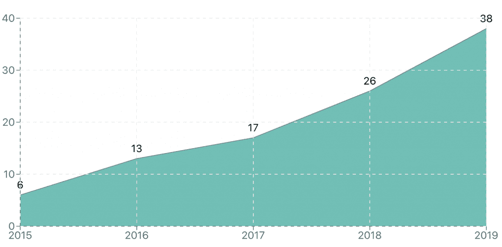
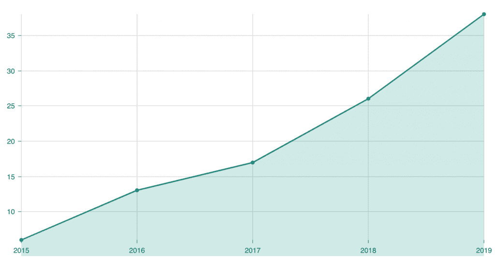

# 反应面积图比较- LogRocket 博客

> 原文：<https://blog.logrocket.com/react-area-chart-comparison/>

React 有许多很棒的图表选项可供选择。并不是所有的图表都是一样的，但是大部分都是简单的，比如折线图、条形图和饼图。我们将关注面积图，它类似于折线图，但是线下的区域是阴影的。

我们将看到的图表库是[里查尔兹](http://recharts.org/en-US/)、[胜利](https://formidable.com/open-source/victory/)和[尼沃](https://nivo.rocks/)。 [React-Vis](https://uber.github.io/react-vis/) 是另一个不错的选择，但我们将在本文中关注前面提到的三个，并在这个附带的视频中关注 Recharts 和 Victory。

 [https://www.youtube.com/embed/ynrCLvScysA?version=3&rel=1&showsearch=0&showinfo=1&iv_load_policy=1&fs=1&hl=en-US&autohide=2&wmode=transparent](https://www.youtube.com/embed/ynrCLvScysA?version=3&rel=1&showsearch=0&showinfo=1&iv_load_policy=1&fs=1&hl=en-US&autohide=2&wmode=transparent)

视频

完整的源代码可以在找到[。](https://github.com/leighhalliday/victory-recharts-area)

## 选择图表库

假设多个库可以完成你需要做的事情，你如何选择一点点取决于偏好，一点点取决于你看重什么。我在选择库时看重的东西有(排名不分先后):

*   **受欢迎程度**:人们在使用这个图书馆吗？受欢迎并不意味着它是好的，但它确实意味着它更有可能得到支持
*   **开发**:它还在接受定期更新和支持吗？
*   **问题**:是否有大量未解决的问题，它们是否被关闭/分类
*   **文档**:有没有写得很好的例子和 API 文档？
*   重量:在浏览器中，重量(这个包添加到你的 JS 包中的大小)很重要，尤其是在较慢的移动网络上
*   **Look & feel** :这个包装看起来怎么样？
*   **易用性**:是否易于使用并启动运行？

以下是我们今天所涉及的图表包的一些高级数字和统计数据:

*   充值:21k 使用，12.9k 星，541 期， [445kb 捆绑包大小](https://bundlephobia.com/result?p=recharts@2.0.0-beta.1)
*   胜利:4k 使用，7.6k 明星，167 期， [464kb 捆绑大小](https://bundlephobia.com/result?p=victory@33.1.7)
*   Nivo: 6.1k stars，128 期， [389kb 捆绑包大小](https://bundlephobia.com/result?p=nivo@0.31.0)
*   React-Vis: 3.8k 使用，6.6k stars，242 期， [307kb 捆绑包大小](https://bundlephobia.com/result?p=react-vis@1.11.7)

## 争论图表数据

绘制图表总是要求您不仅要有数据，还要有库所要求的正确格式。我们正在使用的三个库都需要对象数组中的数据，用`x`和`y`作为键:

```
const data = [
  { x: "2015", y: 6 },
  { x: "2016", y: 13 },
  { x: "2017", y: 17 },
  { x: "2018", y: 26 },
  { x: "2019", y: 38 }
];
```

上面的数据代表了我每年在 GitHub 上创建的存储库的数量(在我最近的 100 次回复中)。不幸的是，GitHub 不提供这种格式的数据。我首先使用他们的 [GraphQL 浏览器](https://developer.github.com/v4/explorer/)提取`createdAt`字段，并使用以下查询:

```
{
  viewer {
    repositories(last: 100) {
      nodes {
        createdAt
        name
      }
    }
  }
}
```

它返回的结果类似于下面的简短列表:

```
{
  "data": {
    "viewer": {
      "repositories": {
        "nodes": [
          {
            "createdAt": "2019-11-15T14:44:19Z",
            "name": "redux-context-reducers"
          },
          {
            "createdAt": "2019-11-30T22:26:28Z",
            "name": "mobx2020"
          },
          {
            "createdAt": "2019-12-11T20:58:05Z",
            "name": "victory-recharts-area"
          },
          {
            "createdAt": "2019-12-15T17:47:24Z",
            "name": "crime-mapping"
          }
        ]
      }
    }
  }
}
```

由此，我们可以在 JavaScript 中进行一些数据辩论，以计算每年发生多少次，并将其转换成所需的格式。

```
// Extract year from each repo createdAt
const repoYears = raw.data.viewer.repositories.nodes.map(repo =>
  parseInt(repo.createdAt.substr(0, 4), 10)
);

// Build object with each year initialized to 0
const years = {};
for (let i = Math.min(...repoYears); i <= Math.max(...repoYears); i++) {
  years[i] = 0;
}

// Populate years object with actual counts
const countsByYearObject = repoYears.reduce(
  (acc, year) => {
    acc[year] += 1;
    return acc;
  },
  { ...years }
);

// Convert object into array format victory wants
const countsByYear = Object.keys(countsByYearObject).map(year => ({
  x: year.toString(),
  y: countsByYearObject[year]
}));
```

## 胜利面积图


如果您还需要在 React Native 中构建类似的图表，Victory 是一个很好的选择。它有很好的 React 本地支持，API 在它和库的 web 版本之间几乎是相同的。实际上，生成一个好看的面积图并不需要太多代码。

```
import { VictoryChart, VictoryArea, VictoryTheme } from "victory";

function VictoryDemo() {
  return (
    <div style={{ maxWidth: "800px", margin: "0 auto" }}>
      <VictoryChart theme={VictoryTheme.material} width={800} height={400}>
        <VictoryArea
          data={data}
          labels={({ datum }) => datum.y}
          style={{ data: { fill: colors.teal } }}
        />
      </VictoryChart>
    </div>
  );
}
```

您可以在`VictoryChart`容器中放置多个面积图/条形图/折线图，允许您覆盖共享相同轴的数据。Victory 附带了几个预定义的主题来让您的图表看起来很棒，但是您可以随时用您自己的值覆盖这些主题，就像我使用`style` prop 对填充颜色所做的那样。

`width`和`height`属性是以像素为单位的，但是它们更多地代表一个比率而不是一个绝对值。当您调整屏幕大小时，Victory 将调整图表的大小，以防止它超出其父容器。

## 再 charts 面积图



如果说 Victory 的美在于简单，那么 Recharts 则在灵活性方面大放异彩。一切都是这个包裹中的一个组成部分。从`AreaChart`组件，一直到在图表上绘制漂亮的虚线网格的`CartesianGrid`组件。

我个人非常喜欢和里查尔兹一起工作。您可以将这些组件混合搭配在一起，得到您想要的东西，而不是复杂的选项。您甚至可以在一个`ResponsiveContainer`中组合多个图表。

Recharts 并不假设您将使用标签`x`和`y`来传递数据，这就是为什么您必须在许多不同的组件上指定`dataKey`属性，以便它知道从哪里提取数据。

```
import {
  AreaChart,
  XAxis,
  YAxis,
  CartesianGrid,
  Area,
  Tooltip,
  ResponsiveContainer,
  LabelList
} from "recharts";

function RechartsDemo() {
  return (
    <div style={{ maxWidth: "800px", margin: "0 auto", height: "400px" }}>
      <ResponsiveContainer>
        <AreaChart
          data={data}
          margin={{ top: 25, right: 25, bottom: 25, left: 0 }}
        >
          <XAxis dataKey="x" />
          <YAxis dataKey="y" />
          <Area
            dataKey="y"
            isAnimationActive={false}
            name="Repos"
            fill={colors.teal}
            stroke={colors.blueGrey}
          >
            <LabelList dataKey="y" position="top" offset={10} />
          </Area>
          <CartesianGrid stroke={colors.lightGrey} strokeDasharray="5 5" />
          <Tooltip />
        </AreaChart>
      </ResponsiveContainer>
    </div>
  );
}
```

## Nivo 面积图



虽然我从未在视频中介绍过 Nivo，但它是一个非常漂亮的库，拥有非常棒的文档，所以我想把它包含在本文中。文档是交互式的，您可以更改选项和切换属性，以实时查看图表上的变化。它甚至在您更改属性时更新代码，以便当它看起来完全符合您的要求时，您可以将代码复制并粘贴到您自己的项目中。

要制作面积图，您将从折线图开始，用一个简单的选项填充线下的区域。这是通过将`enableArea={true}`传递给`ResponsiveLine`组件来完成的。Nivo 的感觉类似于 Victory，因为您处理的组件更少，而这些组件获得了更多的道具来定制图表的外观和感觉:

```
function NivoDemo() {
  return (
    <div style={{ maxWidth: "800px", margin: "0 auto", height: "400px" }}>
      <ResponsiveLine
        data={[
          {
            id: "repos",
            color: colors.teal,
            data
          }
        ]}
        margin={{ top: 25, right: 25, bottom: 25, left: 60 }}
        xScale={{ type: "point" }}
        yScale={{
          type: "linear",
          min: "auto",
          max: "auto"
        }}
        colors={d => d.color}
        enableArea={true}
        useMesh={true}
      />
    </div>
  );
}
```

## 结论

让数据活起来对我来说一直很有趣。我喜欢将数据转换成正确的格式，然后让图表看起来恰到好处。与简单的数字表格相比，图表可以向用户传达更多的信息。在本文中，我们比较了在 Victory、Recharts 和 Nivo 中构建一个非常相似的面积图，让我们能够比较和对比它们，看看是什么让它们起作用。

## [LogRocket](https://lp.logrocket.com/blg/react-signup-general) :全面了解您的生产 React 应用

调试 React 应用程序可能很困难，尤其是当用户遇到难以重现的问题时。如果您对监视和跟踪 Redux 状态、自动显示 JavaScript 错误以及跟踪缓慢的网络请求和组件加载时间感兴趣，

[try LogRocket](https://lp.logrocket.com/blg/react-signup-general)

.

[ ](https://lp.logrocket.com/blg/react-signup-general) [](https://lp.logrocket.com/blg/react-signup-general) 

LogRocket 结合了会话回放、产品分析和错误跟踪，使软件团队能够创建理想的 web 和移动产品体验。这对你来说意味着什么？

LogRocket 不是猜测错误发生的原因，也不是要求用户提供截图和日志转储，而是让您回放问题，就像它们发生在您自己的浏览器中一样，以快速了解哪里出错了。

不再有嘈杂的警报。智能错误跟踪允许您对问题进行分类，然后从中学习。获得有影响的用户问题的通知，而不是误报。警报越少，有用的信号越多。

LogRocket Redux 中间件包为您的用户会话增加了一层额外的可见性。LogRocket 记录 Redux 存储中的所有操作和状态。

现代化您调试 React 应用的方式— [开始免费监控](https://lp.logrocket.com/blg/react-signup-general)。