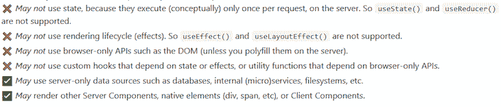

# React 是一个黑盒。这有什么关系？

> 原文：<https://blog.logrocket.com/react-black-box/>

React 可以说是最受欢迎的前端技术。这一成功的原因之一无疑是 React 的小 API surface，它在最近几年有所增长，但仍然可以在几个小时内学会。

尽管 React 的 API 很小，但许多开发人员认为 React 的内部机制不仅非常复杂，而且需要了解。所以很自然地，问题出现了 React 是黑盒有关系吗？这对我们有帮助，还是有负面影响？

在本文中，我将探究 React 抽象模型的来龙去脉，以寻求答案。

## React 的外部 API

在许多用例中，React 的外部 API 几乎不存在。如果我们这样写 JSX:

```
const element = <div>Hello!</div>;

```

或者像这样:

```
const Component = ({ children }) => (
  <>
    <p>I am a component</p>
    {children}
  </>
);

```

然后这被传输成从`react/jsx-runtime`模块对`jsx`的调用。甚至在新 JSX 变换推出之前，我们所要做的就是引入`React`，比如:

```
import * as React from 'react';

const element = <div>Hello!</div>;

```

Babel 或 TypeScript 之类的 transpiler 会将其转换为 call `React.createElement`。

所以我们已经可以看到，React 最重要的 API 几乎被隐藏了。由于`createElement`或`jsx`被隐式使用，我们从未显式调用外部 API。

现在，排除更多的“经典”API，如`Component`或`PureComponent`(包括它们的生命周期)，我们知道 React 提供了比我们想要(甚至需要)使用的更多的东西。例如，使用`lazy`进行惰性加载(例如，用于包分裂)是非常酷的，但是需要一个`Suspense`边界。

另一方面，我们有像`useState`和`useEffect`这样的 API，它们带来了某种魔力。首先，这些都是函数，但是这些函数不能在任何地方使用。它们只能在组件内部使用，并且只能在从 React 调用(即呈现)时使用。即便如此，他们的行为也可能不完全符合我们的预期。

这些是相当容易泄漏的 API。为了理解它们，我们需要对 React 的内部发生的*有一个相当复杂的理解——这就把我们带到了内部 API。*

## React 的内部 API

有三种内部 API:

1.  通常只由少数几个库实现的 API(比如协调 API——后面会详细介绍)
2.  从外部来看，API 有时是有用的和可达到的，但不稳定
3.  无法从外部访问的 APIs 它们只能在内部使用

我不想关注上面的第三点，因为这已经超出了我们的能力范围。选择第二条也没有多大意义，因为这些总是会发生变化，应该避免。留给我们的 API 只由少数几个库实现，但有相当大的影响。

如前所述，要实现的最重要的东西是协调 API。其中一个实现由`react-dom`的`render`函数提供。再比如`react-dom/server`里的`renderToString`。有什么区别？

让我们考虑一个更复杂(但仍然简单)的组件:

```
const Component = () => {
  const [color, setColor] = useState('white');

  useLayoutEffect(() => {
    document.body.style.backgroundColor = color;
  }, [color]);

  return (
    <>
      <p>Select your preferred background color.</p>
      <select onChange={e => setColor(e.target.value)} value={color}>
        <option value="white">White</option>
        <option value="black">Black</option>
        <option value="red">Red</option>
        <option value="green">Green</option>
        <option value="blue">Blue</option>
      </select>
    </>
  );
};

```

该组件的某些部分使得在不同的渲染选项中使用它变得更加容易。首先，我们显然直接使用了 DOM，尽管只是在布局效果上。第二，我们使用一种效果——一种特殊的效果(“布局效果”)。

应该尽可能避免直接使用 DOM，但是正如在上面的例子中看到的，我们有时会错过正确的方法来做不同的事情。为了改善这种情况，我们仍然可以像这样保护这条线:

```
if (typeof document !== 'undefined') {
  document.body.style.backgroundColor = color;
}

```

或者使用一些替代检查。

那仍然留给我们`useLayoutEffect`。这个是高度渲染专用的，可能根本不存在。例如，使用`renderToString`函数，当我们使用这个钩子时会得到一个错误。

当然，一种可能性是回到标准的`useEffect`。但是接下来我们需要知道这两个之间的【不那么明显】[区别。无论如何，`useEffect`执行的 *when* 和从`useState`实例调用返回的 setter 的重渲染策略一样模糊。](https://blog.logrocket.com/useeffect-vs-uselayouteffect/)

让我们利用这个机会后退一步，探索一下为什么我们会关心这些。

## 我们为什么要关心 React 是不是黑盒？

抽象是有用的，抽象是美好的，很明显，抽象使我们更有生产力。毕竟，我们可以更富于表现力，只处理与解决特定任务相关的构建模块，而不是关心所有底层细节。

但是抽象也会产生问题。有时他们限制太多。有时他们隐藏重要的细节。有时候他们太固执己见了。

在 React 的情况下，这是一个问题。如果我们在创建一个组件时需要考虑所有的(不可见的)边缘情况，那么这是相当复杂的。我们渴望可读性。为此迫切需要的一件事是，能够仅仅通过观察一个组件来推理行为。

* * *

### 更多来自 LogRocket 的精彩文章:

* * *

用贾里德·帕尔默的话说:

> 请记住，React 应该负责“如何做”,这样我们就可以专注于我们的应用程序“是什么”。

失去这方面就意味着失去了最初让 React 如此强大的核心属性之一。当然，关于钩子是否真的让 React 变得更复杂，或者是否有人一开始就对 React 有错误的印象，还有很多争论。

然而，这样的讨论实际上是支持增加复杂性的论点。如果违反了最小惊讶原则(即使只是针对少数人)，那就已经是个问题了——也许不是大问题，但仍然是个问题。

因此，我们关心 React 变得更难理解的原因是，这将引入不必要的争论、微妙的错误和更大的培训需求。这些都是适得其反的，会降低我们的效率。

在“嘿，这东西真神奇”和“哦，我没想到会这样”之间找到正确的平衡是至关重要的。当然，我们中的许多人可能想站在事物神奇的一面，但在现实中，有不同的看法。在一天结束的时候，让它工作就好了。

将来，React 会变得更加复杂。有了 [React 并发模式](https://blog.logrocket.com/react-concurrent-mode/)，我们将获得另一种渲染模式，这种模式可以根据组件的内部结构发生巨大变化。错误和不受欢迎的行为会再次发生。

目前还不清楚 React 服务器组件会增加多少混乱。至少在 RFC 上，规则规定了一些需要了解的限制:



尽管 React 变得更加强大，但它也变得更加复杂——这是不可否认的。是的，那种复杂性的一部分*无论如何都应该是事先知道的，但是很明显，在大多数情况下它是可选的；现在很多情况下都需要。*

## 结论

React 的优势在某种程度上也是它的弱点。只要我们知道游戏规则，美丽的抽象就能发挥作用。任何超出范围的行为都会导致令人惊讶的和潜在的不良行为。

显然，像调和算法这样的开放东西是 React 如此强大的原因，但我们需要一些知识和纪律才能使用不同的渲染选项。

正确使用钩子是 React 的黑盒系统可能太不透明而无法完全掌握正在发生的事情的另一个方面。尽管如此，就我个人而言，我认为这些选择和设计是值得的。最终，React 的编程模型给开发者带来了生产力和快乐——这是值得保留的东西。

你有什么想法？是 React 太黑箱了，还是魔法量调得好？

## 使用 LogRocket 消除传统反应错误报告的噪音

[LogRocket](https://lp.logrocket.com/blg/react-signup-issue-free)

是一款 React analytics 解决方案，可保护您免受数百个误报错误警报的影响，只针对少数真正重要的项目。LogRocket 告诉您 React 应用程序中实际影响用户的最具影响力的 bug 和 UX 问题。

[ ](https://lp.logrocket.com/blg/react-signup-general) [  ](https://lp.logrocket.com/blg/react-signup-general) [LogRocket](https://lp.logrocket.com/blg/react-signup-issue-free)

自动聚合客户端错误、反应错误边界、还原状态、缓慢的组件加载时间、JS 异常、前端性能指标和用户交互。然后，LogRocket 使用机器学习来通知您影响大多数用户的最具影响力的问题，并提供您修复它所需的上下文。

关注重要的 React bug—[今天就试试 LogRocket】。](https://lp.logrocket.com/blg/react-signup-issue-free)