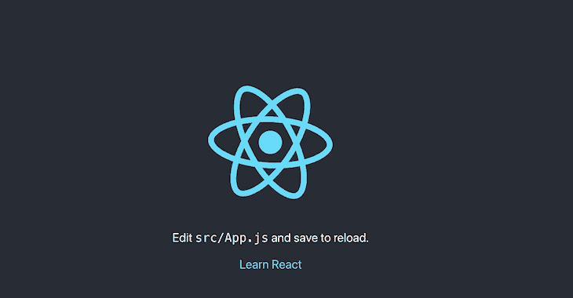
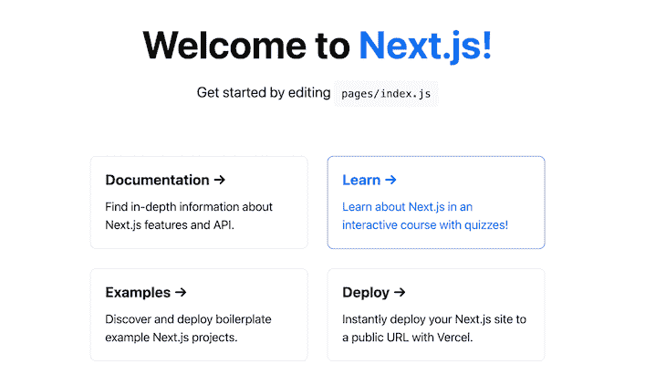
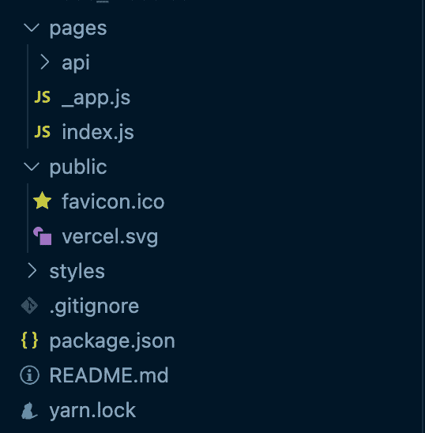
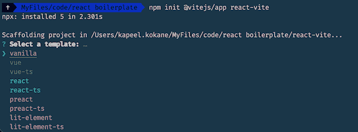
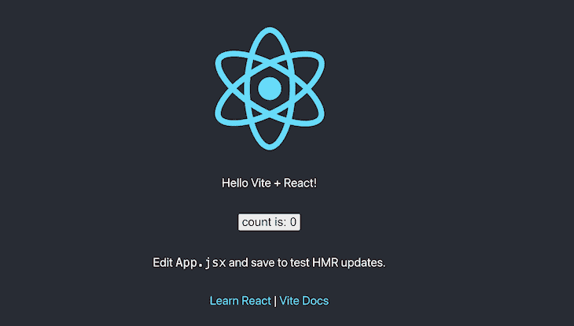
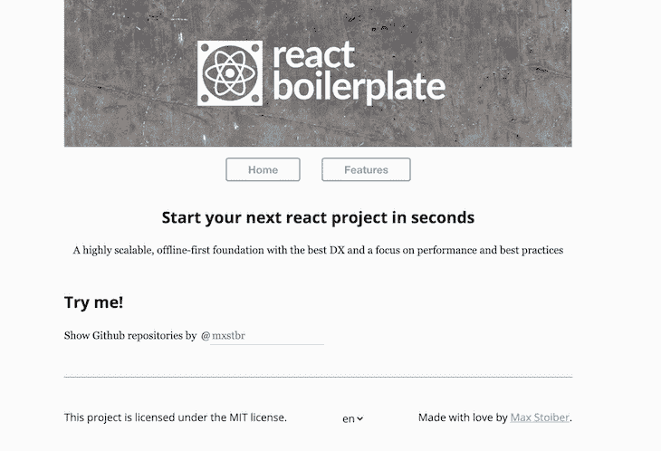
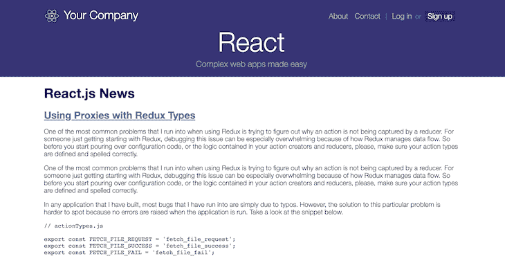

# 2021 年顶级 React 样板文件

> 原文：<https://blog.logrocket.com/react-boilerplates-for-2021/>

最近，React 越来越受欢迎，成为有史以来最受欢迎的前端框架之一。JS 调查的[状态证明了这一点，React 在过去五年中一直排名前两位。这也意味着比以往更多的开发人员在 React 中构建项目。](https://2020.stateofjs.com/en-US/technologies/front-end-frameworks/)

React 库的设计并不固执己见，它受益于样板文件的使用，样板文件是在开始使用任何技术进行开发时作为逻辑起点的代码片段。在本文中，我们将研究 React 的五个这样的样板文件，并探讨它们的优缺点。

## 1.创建 React 应用

作为 React 团队推荐的官方脚本， [Create React App (CRA)](https://create-react-app.dev) 是引导 React 应用程序最安全的选择。根据官方文档网站:

> Create React App 是一个学习 React 的舒适环境，也是在 React 中开始构建新的单页面应用程序的最佳方式。

### 入门指南

为了使用`create-react-app`设置新的应用程序，我们运行命令:

```
npx create-react-app my-app

```

这里使用的`npx`命令不同于`npm`命令。`npx`代表节点包执行，它会自动安装到 npm 版本 5.2.0 或更高版本的系统上。`npx`命令的特点是它可以执行 npm 存储库中的任何包，而不需要预先安装包。

该命令在当前目录中创建一个名为`my-app`的新文件夹，并在该文件夹中设置一个 React 项目。

为了运行开发服务器和应用程序，我们使用命令:

```
npm start

```



当对代码更改感到满意时，我们可以使用:

```
npm run build

```

这将生成一个优化的`build`文件夹，可以部署在我们希望托管应用的任何地方。

### 主要特征

*   通过在创建命令后添加`--template`标志来选择模板:

```
npx create-react-app my-app --template [template-name]
```

*   通过选择`typescript`模板来支持类型脚本:

```
npx create-react-app my-app --template typescript
```

*   对现代 JavaScript 特性的支持，如[动态导入](https://www.dropbox.com/scl/fi/xa2comf6uqs8m60k0ygx1/React-boilerplates-for-2021-Copy.paper?dl=0&rlkey=uuod49dc7ymfih7onni9qgqxc)开箱即用，这使得开发人员的生活更加轻松
*   直接支持 CSS 文件和 CSS 模块
*   SCSS 的帮助支持`node-sass`
*   使用 React 路由器的路由支持和通过动态导入的代码分割支持

### 从创建 React 应用程序中退出

虽然 Create React App 带来的简单性值得赞赏，但在某些情况下，我们需要对我们的代码库及其功能进行额外的控制。

为了处理这种情况，Create React App 为我们提供了驱逐依赖项的能力。我们可以通过运行脚本来定制构建工具或其他配置:

```
npm run eject

```

这种单向操作消除了在幕后完成所有繁重工作的单一`react-scripts`依赖。它还将所有依赖项和可传递依赖项(如 webpack 和 Babel)带回`package.json`中，用户可以完全控制它们。

弹出前的依赖关系:

```
"dependencies": {
"@testing-library/jest-dom": "^5.11.4",
"@testing-library/react": "^11.1.0",
"@testing-library/user-event": "^12.1.10",
"papercss": "^1.8.2",
"react": "^17.0.1",
"react-dom": "^17.0.1",
"react-scripts": "4.0.2",
"web-vitals": "^1.0.1"
},

```

弹出后的依赖关系:

```
"dependencies": {
"@babel/core": "7.12.3",
"@pmmmwh/react-refresh-webpack-plugin": "0.4.3",
"@svgr/webpack": "5.5.0",
"@testing-library/jest-dom": "^5.11.4",
"@testing-library/react": "^11.1.0",
"@testing-library/user-event": "^12.1.10",
"@typescript-eslint/eslint-plugin": "^4.5.0",
"@typescript-eslint/parser": "^4.5.0",
"babel-eslint": "^10.1.0",
"babel-jest": "^26.6.0",
"babel-loader": "8.1.0",
"babel-plugin-named-asset-import": "^0.3.7",
"babel-preset-react-app": "^10.0.0",
"bfj": "^7.0.2",
"camelcase": "^6.1.0",
"case-sensitive-paths-webpack-plugin": "2.3.0",
"css-loader": "4.3.0",
"dotenv": "8.2.0",
"dotenv-expand": "5.1.0",
"eslint": "^7.11.0",
"eslint-config-react-app": "^6.0.0",
"eslint-plugin-flowtype": "^5.2.0",
"eslint-plugin-import": "^2.22.1",
"eslint-plugin-jest": "^24.1.0",
"eslint-plugin-jsx-a11y": "^6.3.1",
"eslint-plugin-react": "^7.21.5",
"eslint-plugin-react-hooks": "^4.2.0",
"eslint-plugin-testing-library": "^3.9.2",
"eslint-webpack-plugin": "^2.1.0",
"file-loader": "6.1.1",
"fs-extra": "^9.0.1",
"html-webpack-plugin": "4.5.0",
"identity-obj-proxy": "3.0.0",
"jest": "26.6.0",
"jest-circus": "26.6.0",
"jest-resolve": "26.6.0",
"jest-watch-typeahead": "0.6.1",
"mini-css-extract-plugin": "0.11.3",
"optimize-css-assets-webpack-plugin": "5.0.4",
"pnp-webpack-plugin": "1.6.4",
"postcss-flexbugs-fixes": "4.2.1",
"postcss-loader": "3.0.0",
"postcss-normalize": "8.0.1",
"postcss-preset-env": "6.7.0",
"postcss-safe-parser": "5.0.2",
"prompts": "2.4.0",
"react": "^17.0.1",
"react-app-polyfill": "^2.0.0",
"react-dev-utils": "^11.0.2",
"react-dom": "^17.0.1",
"react-refresh": "^0.8.3",
"resolve": "1.18.1",
"resolve-url-loader": "^3.1.2",
"sass-loader": "^10.0.5",
"semver": "7.3.2",
"style-loader": "1.3.0",
"terser-webpack-plugin": "4.2.3",
"ts-pnp": "1.2.0",
"url-loader": "4.1.1",
"web-vitals": "^1.0.1",
"webpack": "4.44.2",
"webpack-dev-server": "3.11.0",
"webpack-manifest-plugin": "2.2.0",
"workbox-webpack-plugin": "5.1.4"
}

```

从 create react 应用程序中弹出通常并不常见，但是如果您知道自己在做什么，那么拥有这个选项是很好的。

### 优点

*   React 团队正式推荐用于引导 React 应用程序
*   涵盖所有基本功能，没有额外的依赖
*   包括全面的文档网站
*   为开发人员提供简单的配置

### 弱点

*   对存储库的更好的方面没有太多的控制(如果没有被驱逐)

因此，如果您正在寻找一种屡试不爽的方法来开始 React 开发，而不必亲自动手，那么 Create React App 就是一个可以使用的工具。

## 2.创建下一个应用

创建 React App 是通过客户端渲染来引导通用 SPA 的一种不错的方式，但是如果需求有点复杂，比如服务器端渲染或静态站点生成，那么最好的开始方式是使用 [Create Next App](https://blog.logrocket.com/introducing-the-new-create-next-app/) 。这是一个简单的 CLI 工具，用于开始 [Next.js](https://nextjs.org/) 项目。

### **入门**

为了生成样板文件，我们只需要运行命令:

```
npx create-next-app

```

接下来，我们回答问卷，在问卷的最后，为我们设置了一个 Next.js 代码 repo。还有一个条款是通过使用`-e`或`--example`标志，基于来自官方文档页面的任何示例来引导应用程序。

为了启动开发服务器，我们运行:

```
npm run dev

```

这将打开开发服务器的主页:



创建下一个应用程序创建一个文件夹结构，如下所示:



在`pages`目录中创建的任何 JavaScript 文件都会在 Next.js 应用程序中创建与该文件同名的路径。所需的任何资产(如图像)都要放在`public`文件夹中。默认情况下支持 CSS 及以下版本。

### 主要特征

*   通过文件命名约定和`getStaticPaths()`方法自动/动态路由
*   通过`getStaticProps()`方法支持静态站点生成
*   通过`getServerSideProps()`方法的服务器端渲染

### 优点

*   快速刷新和开箱即用的`fetch`支持

### 弱点

*   对于需要不断获取和刷新数据的应用程序，没有进行优化
*   与 Next.js 特有的 SSR 方面相关的学习曲线

记住这一点，如果你的需求是一个相当静态的站点，并且你正在寻找一个在[服务器端渲染](https://nextjs.org/docs/basic-features/pages#server-side-rendering)和[静态站点生成](https://nextjs.org/docs/basic-features/pages#static-generation-recommended)方面遥遥领先的可靠的 React 框架，那么一定要使用 Next.js，你不会失望的。

## 3.轻快地

Vite 是前端框架工具领域中相对较新的候选工具，由 Vue.js fame 的 T2 尤雨溪 T3 创建/维护。 [Vite](https://blog.logrocket.com/getting-started-with-vite/) 是一个通用的解决方案，可以使用模板从多个技术栈中引导项目，目前支持 Vue、React 和 Preact。

### 入门指南

就本文的范围而言，我们将探索 React 项目的创建。为了启动回购创建，我们运行:

```
npm init @vitejs/app react-vite

```

这将打开选择菜单:



选择 **React** 选项在目录中创建一个 React 项目。值得注意的是，建立回购协议只需大约一秒钟，而其他工具的整个过程只需几秒钟。在 repo 设置好之后，我们需要进入目录并安装`vite`包作为开发依赖项。

```
cd react-vite
npm i --save-dev vite

```

然后，我们可以按如下方式运行开发脚本:

```
npm run dev

```

这将在`localhost:3000`调出默认用户界面。



请注意，为了让开发脚本正确运行，我们需要使用支持`worker_threads`的 Node.js 的最新构建版本，否则，我们会在尝试运行开发脚本时收到以下错误:

```
Cannot find module 'worker_threads'

```

您可以使用 [nvm](https://github.com/nvm-sh/nvm/blob/master/README.md) 安装 npm 的最新版本，并管理以前安装的版本。

### 主要特征

Vite 不同于列表中的其他样板工具，因为它是在牢记开发人员体验(DX)的同时从头开始构建的。

Vite 支持一组详尽的[特性](https://vitejs.dev/guide/features) [s](https://vitejs.dev/guide/features) ，然而，Vite 着手解决的主要问题是大多数捆绑工具(想一想[包](https://parceljs.org))大规模面临的问题:当代码库增长到一个相当大的规模时，捆绑器需要几分钟来启动一个 dev 服务器的本地实例。

即使有了像 [h](https://blog.logrocket.com/getting-started-with-vite/) [ot 模块替换(HMR)](https://blog.logrocket.com/getting-started-with-vite/) 这样的优化，在关键文件被修改的情况下，代码更新仍然需要几秒钟才能作为实时预览反映到用户界面上。

Vite 通过以下方式解决这些问题:

*   利用大多数现代浏览器对本地 ES 模块的支持，并且根本不捆绑代码
*   将整个代码库分类为`library code`和`source code`，并通过使用 [esbuild](https://esbuild.github.io/) 预构建库代码
*   在本机 ES 模块上执行 HMR，这大大减少了失效的 HMR 边界并提高了性能

虽然开发服务器不捆绑代码，但是生产脚本仍然使用高度优化的 [Rollup](https://rollupjs.org/) 构建捆绑包。

### 优点:

*   主要关注开发者体验(DX)
*   现成的类型脚本支持
*   尤雨溪和 Vite 团队的积极开发和维护
*   CSS 模块的 CSS 导入支持以及预处理支持
*   [W](https://vitejs.dev/guide/features.html#web-assembly) [asm](https://vitejs.dev/guide/features.html#web-assembly) 和 [web worker](https://vitejs.dev/guide/features.html#web-workers) 支持

### 弱点

*   构建过程建立在新兴技术的基础上，因此可能不熟悉，如果需要的话很难调整
*   与 webpack 相比，可用的文档和在线支持更少

因此，如果您正在寻找开发人员体验、面向未来和性能增强方面的前沿技术，Vite 是您的最佳选择。

## 4.反应样板


在设置 React 项目时，另一个值得添加的工具是 [react-boilerplate](https://www.reactboilerplate.com/) 。在其登录页面上，react-boilerplate 将自己描述为高性能 web 应用程序的下一个前沿，并强调了它在没有网络连接的情况下通过其应用程序的可用性。

### 入门指南

虽然构建这个库的基本前提与其他的相同，但是建立一个新的代码库的步骤略有不同。首先，我们需要克隆安装存储库:

```
git clone https://github.com/react-boilerplate/react-boilerplate.git my-react-boilerplate

```

接下来，我们需要进入克隆的存储库并运行设置脚本:

```
cd my-react-boilerplate
npm run setup

```

然后是启动开发服务器的启动脚本:

```
npm start

```

这将打开这个主页:



### 主要特征

这个列表中的其他工具和 react-boilerplate 之间的主要区别在于 post 设置，我们得到了一个非常固执己见，但功能非常丰富的开发设置。它包括支持 react-router 进行路由，支持 [Redux](https://blog.logrocket.com/why-use-redux-reasons-with-clear-examples-d21bffd5835/) 进行状态管理，支持 redux-saga 增强 Redux，支持 reselect 进行优化，支持 Immer 进行不变性，支持 styled-components 进行快速跟踪开发。

甚至项目结构也非常强调容器(连接到 Redux 存储)和纯组件之间的分离。

### 优点:

*   具有路由、状态管理和其他优化功能的成熟回购设置
*   由 react 生态系统中的大人物马克斯·斯托伊伯维护
*   现成的样式组件支持

### 弱点:

*   过时；最后一次提交存储库是在 2019 年 3 月
*   非常固执己见

考虑到这一点，如果您从一开始就需要与 React 项目相关的所有功能，并且不介意被库创建者预先决定的非常固执己见的方法所束缚，那么 react-boilerplate 是一个很好的选择。

## 5.React 初学者工具包

最后，让我们看看 React Starter Kit，它将自己描述为同构的 web 应用程序样板。主页还提到 React Starter Kit 非常固执己见，这意味着它已经为我们选择了技术堆栈，包括 Node.js、Express 和 GraphQL。

### 入门指南

为了从样板文件开始，我们需要克隆最新的存储库，并以此为起点:

```
git clone -o react-starter-kit -b master --single-branch https://github.com/kriasoft/react-starter-kit.git MyApp

```

然后，移动到创建的文件夹并安装依赖项:

```
cd MyApp
yarn install

```

并按如下方式启动开发服务器:

```
yarn start

```

这就引出了样板主页:



### 主要特征

这个样板文件的主要特点是它具有高度的特性包和高度的可定制性。除了我们在回购设置中获得的详尽的文件结构之外:

```
.
├── /build/ # The folder for compiled output
├── /docs/ # Documentation files for the project
├── /node_modules/ # 3rd-party libraries and utilities
├── /public/ # Static files which are copied into the /build/public folder
├── /src/ # The source code of the application
│ ├── /components/ # React components
│ ├── /data/ # GraphQL server schema and data models
│ ├── /routes/ # Page/screen components along with the routing information
│ ├── /client.js # Client-side startup script
│ ├── /config.js # Global application settings
│ ├── /server.js # Server-side startup script
│ └── ... # Other core framework modules
├── /test/ # Unit and end-to-end tests
├── /tools/ # Build automation scripts and utilities
│ ├── /lib/ # Library for utility snippets
│ ├── /build.js # Builds the project from source to output (build) folder
│ ├── /bundle.js # Bundles the web resources into package(s) through Webpack
│ ├── /clean.js # Cleans up the output (build) folder
│ ├── /copy.js # Copies static files to output (build) folder
│ ├── /deploy.js # Deploys your web application
│ ├── /postcss.config.js # Configuration for transforming styles with PostCSS plugins
│ ├── /run.js # Helper function for running build automation tasks
│ ├── /runServer.js # Launches (or restarts) Node.js server
│ ├── /start.js # Launches the development web server with "live reload"
│ └── /webpack.config.js # Configurations for client-side and server-side bundles
├── Dockerfile # Commands for building a Docker image for production
├── package.json # The list of 3rd party libraries and utilities
└── yarn.lock # Fixed versions of all the dependencies

```

以及我们开箱即用的脚本数量:

```
"scripts": {
"precommit": "lint-staged",
"lint-js": "eslint --ignore-path .gitignore --ignore-pattern \"!**/.*\" .",
"lint-css": "stylelint \"src/**/*.{css,less,styl,scss,sass,sss}\"",
"lint": "yarn run lint-js &amp;&amp; yarn run lint-css",
"fix-js": "yarn run lint-js --fix",
"fix-css": "yarn run lint-css --fix",
"fix": "yarn run fix-js &amp;&amp; yarn run fix-css",
"flow": "flow",
"flow:check": "flow check",
"test": "jest",
"test-watch": "yarn run test --watch --notify",
"test-cover": "yarn run test --coverage",
"coverage": "yarn run test-cover &amp;&amp; opn coverage/lcov-report/index.html",
"clean": "babel-node tools/run clean",
"copy": "babel-node tools/run copy",
"bundle": "babel-node tools/run bundle",
"build": "babel-node tools/run build",
"build-stats": "yarn run build --release --analyse",
"deploy": "babel-node tools/run deploy",
"render": "babel-node tools/run render",
"serve": "babel-node tools/run runServer",
"start": "babel-node tools/run start"
}

```

该图书馆还提供了几个[食谱](https://github.com/kriasoft/react-starter-kit/tree/master/docs/recipes)，就像官方指南一样，解释了使用`react-bootstrap`时常见问题的解决方案，这使得它非常方便。

### 优点:

*   同构样板文件考虑了要在服务器(Node.js)上执行的操作，如 SSR
*   支持 [GraphQL](https://graphql.org/) 到[阿波罗](https://www.apollographql.com/)
*   实现常见用例的方法
*   通过[酶](http://airbnb.io/enzyme/)进行反应测试，通过[流程](http://flowtype.org/)进行静态类型检查

### 弱点:

*   大量的依赖项可能会增加包的大小，即使不使用也是如此
*   非常固执己见

凭借 React Starter Kit 提供的功能，加上它提供的定制选项，如果您正在寻找一个不同于 Create React App 的同构样板，那么它是值得一试的。

## 结论

就这样，我们总结了 2021 年的 top React 样板文件。正如我们所看到的，它们中的每一个都有自己的优点和缺点。这意味着我们将根据手头的用例以及期望的最终结果做出不同的选择。幸运的是，我们并不缺少选择。

## 使用 LogRocket 消除传统反应错误报告的噪音

[LogRocket](https://lp.logrocket.com/blg/react-signup-issue-free)

是一款 React analytics 解决方案，可保护您免受数百个误报错误警报的影响，只针对少数真正重要的项目。LogRocket 告诉您 React 应用程序中实际影响用户的最具影响力的 bug 和 UX 问题。

[ ](https://lp.logrocket.com/blg/react-signup-general) [  ](https://lp.logrocket.com/blg/react-signup-general) [LogRocket](https://lp.logrocket.com/blg/react-signup-issue-free)

自动聚合客户端错误、反应错误边界、还原状态、缓慢的组件加载时间、JS 异常、前端性能指标和用户交互。然后，LogRocket 使用机器学习来通知您影响大多数用户的最具影响力的问题，并提供您修复它所需的上下文。

关注重要的 React bug—[今天就试试 LogRocket】。](https://lp.logrocket.com/blg/react-signup-issue-free)