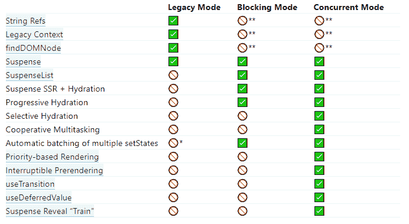
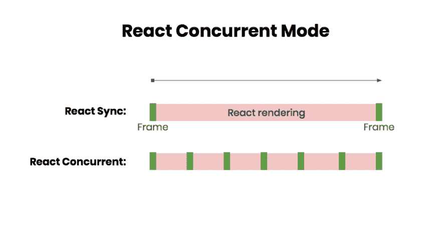
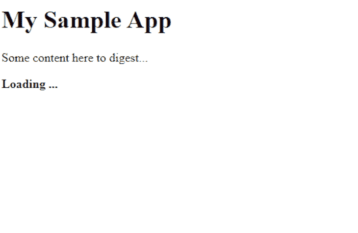

# React 并发模式

> 原文：<https://blog.logrocket.com/react-concurrent-mode/>

首先，一个大大的警告:我要写的关于**的东西**已经可以用了，但是**还不应该用**。

这些都是实验性的功能，它们会有所改变。剩下的会是一点(全部？)的内部工作和这里概述的结果。

如果你喜欢实验性的东西和阅读 React 的未来，你来对地方了。否则，最好等到尘埃落定，这个特性就永远存在了。

## 什么是并发模式？

React 团队将并发模式描述为:

> […]一系列新功能有助于 React 应用保持响应，并根据用户的设备功能和网络速度进行适当调整。

听起来很棒，对吧？有几个功能属于这一类别:

*   控制初始渲染的能力
*   区分渲染事件优先级的能力
*   暂停和恢复组件呈现的方法
*   缓存和优化运行时呈现代码
*   虚拟渲染，或隐藏尚不需要的内容

在并发模式下，呈现是可中断的，并且可能发生在多个阶段。

下图对此进行了更直观的解释:


如果我们总是遵循最佳实践，有几个不良后果应该不会影响我们。不用说，大多数现实世界的应用程序至少在一个地方会违反这一点，所以让我们来探索如何捕捉问题，以及我们可以对这样的问题做些什么。

## 使用并发模式

为了实际使用并发模式，我们需要 React 和 React DOM 的预览版。毕竟，这仍然是实验性的，不是任何生产版本的一部分。

```
npm install [email protected] [email protected]
```

假设您的应用程序的`index.jsx`看起来像下面的代码:

```
import * as React from 'react';
import { render } from 'react-dom';

render(<App />, document.getElementById('root'));
```

新方法(支持并发模式)将把`render`调用分成两部分:

*   在元素上创建渲染根
*   实际上使用渲染根来开始渲染子对象

因此，代码更改为:

```
import * as React from 'react';
import { createRoot } from 'react-dom';

createRoot(document.getElementById('root')).render(<App />);
```

老方法就不能保留吗？实际上，它仍然会存在——为了向后兼容。

目前，计划了三种不同的模式:

1.  遗留模式(我们在第一个片段中看到的模式)
2.  阻塞模式(这将是第一个迁移步骤)
3.  并发模式(上一个片段中的模式)

对于阻塞模式，我们将用`createBlockingRoot`替换`createRoot`。这是并发模式的一个子集，应该更容易理解。

React 文档比较列出了这三种模式的特性。



正如我们所看到的，这三个从遗留模式中删除的特性在相当长的一段时间内都应该被避免。问题——尤其是对于最近的应用——甚至可能不在于我们的代码，而在于仍然利用这些功能的依赖关系。

就我个人而言，我认为这个列表是按照出现的次数排序的。我怀疑字符串引用会比传统上下文的使用更常见。我觉得缺少`findDOMNode`在大多数情况下不会是问题。

### 初步迁移指南

我确信，从长远来看，将会有一套工具和助手来正确地诊断和指导迁移到 React 并发模式。

以下几点应该足以检查迁移是否有意义和可能。

此外，它还可以帮助我们实际执行迁移。

关键问题是:我的应用程序会遭受性能损失吗？如果我们处理大型列表或大量元素，那么它肯定是有意义的。此外，如果我们的应用程序是高度动态的，并且可能在未来获得更多的异步功能，那么迁移也是有意义的。

为了检查迁移是否可行，我们必须知道目前为止我们使用的是 React 的哪个 API 接口。

如果我们完全掌握了钩子和函数，那就太好了——几乎不会有任何问题。

如果我们在类上(更不用说带有潜在填充的`React.createClass`),那么我们很有可能使用不推荐的生命周期方法。更糟糕的是，有可能误用这些生命周期方法。

我的建议是，在考虑使用 React 的并发模式之前，迁移到新的生命周期方法，甚至是钩子。

* * *

### 更多来自 LogRocket 的精彩文章:

* * *

其中一个原因当然是旧的(不安全的)生命周期名称已被否决，并且已经以别名存在。

这里我们有:

*   `componentWillMount`，也可用作`UNSAFE_componentWillMount`
*   `componentWillReceiveProps`，也可用作`UNSAFE_componentWillReceiveProps`
*   `componentWillUpdate`，也可用作`UNSAFE_componentWillUpdate`

一般来说，检查一切是否与当前模型一致的最简单方法是激活严格模式。

```
import * as React from 'react';
import { render } from 'react-dom';

render(
  <React.StrictMode>
    <App />
  </React.StrictMode>,
  document.getElementById('root')
);
```

在严格模式下，一些函数会运行两次，以检查是否有副作用。此外，使用不推荐的生命周期函数将在控制台中特别注明。还有其他有用的警告。

回到我们的迁移上来:在我们完成了代码的功课之后，我们就可以试一试了。

我会先从完全并发模式开始。最有可能的是，它会工作。否则，根据我的经验，阻塞模式起作用的可能性很小。尽管如此，试一试也无妨。

重要的是，虽然对并发模式的更改应该在生产版本中恢复，但是到目前为止所有其他的更改都是完全值得的，如果可能的话应该投入生产。

### 实际例子

好了，让我们看看 React 并发在实践中是怎样的。

我们从一个使用标准渲染的简单应用程序开始。它从一个服务器获得一个帖子列表，并从另一个包中使用列表组件的延迟加载。

代码类似于下面的代码:

```
// index.jsx
import * as React from 'react';
import { render } from 'react-dom';
import { App } from './App';

render(
  <React.StrictMode>
    <App />
  </React.StrictMode>,
  document.querySelector('#app')
);

// App.jsx
import * as React from 'react';

const List = React.lazy(() => import('./List'));

export default () => (
  <div>
    <h1>My Sample App</h1>
    <p>Some content here to digest...</p>
    <React.Suspense fallback={<b>Loading ...</b>}>
      <List />
    </React.Suspense>
  </div>
);
```

我们定义的列表如下:

```
import * as React from 'react';

export default () => {
  const [photos, setPhotos] = React.useState([]);

  React.useEffect(() => {
    fetch('https://jsonplaceholder.typicode.com/photos')
      .then((res) => res.json())
      .then((photos) => setPhotos(photos));
    return () => {
      // usually should prevent the operation from finishing / setting the state
    };
  }, []);

  return (
    <div>
      {photos.map((photo) => (
        <div key={photo.id}>
          <a href={photo.url} title={photo.title} target="_blank">
            
          </a>
        </div>
      ))}
    </div>
  );
};
```

现在(除了缺少效果处理器的实现)，这看起来很不错。

但是，效果不是很好:



首先，我们在此加载 5000 个条目。更糟糕的是，我们的渲染树负载相当重。

所以我们试着用 React 的并发模式。我们从使用 API 加载的改进版本开始。

让我们把照片装入它自己的模块:

```
function fetchPhotos() {
  return fetch('https://jsonplaceholder.typicode.com/photos')
    .then((res) => res.json());
}

export function createPhotosResource() {
  let status = 'pending';
  let result = undefined;

  const suspender = fetchPhotos().then(
    (photos) => {
      status = 'success';
      result = photos;
    },
    (error) => {
      status = 'error';
      result = error;
    },
  );

  return {
    read() {
      switch (status) {
        case 'pending':
          throw suspender;
        case 'error':
          throw result;
        case 'success':
          return result;
      }
    },
  };
}
```

这是定义异步资源的初步 API。它肯定会改变——通过一些抽象或其他细节。

后端 API 访问的整个生命周期现在都在一个专用模块中，根本没有任何 UI。那很好。我们如何使用它？

我们只需要改变列表:

```
import * as React from 'react';

export default ({ resource }) => {
  const photos = resource.read();

  return (
    <div>
      {photos.map((photo) => (
        <div key={photo.id}>
          <a href={photo.url} title={photo.title} target="_blank">
            
          </a>
        </div>
      ))}
    </div>
  );
};
```

在这种情况下，我们将资源作为名为`resource`的道具传入。

此时，代码更好了(也更健壮了)，但是性能还是一样的。

让我们添加一个为长时间运行的 API 请求做准备的转换。该转换允许延迟加载指示器。

最后，我们的`App`模块如下所示:

```
import * as React from 'react';
import { createPhotosResource } from './photos';

const List = React.lazy(() => import('./List'));

export default () => {
  const [photosResource, setPhotosResource] = React.useState();
  const [startTransition, isPending] = React.useTransition(500);

  React.useEffect(() => {
    const tid = setTimeout(() => {
      startTransition(() => {
        setPhotosResource(createPhotosResource());
      });
    }, 100);

    return () => clearTimeout(tid);
  }, []);

  return (
    <div>
      <h1>My Sample App</h1>
      <p>Some content here to digest...</p>
      <React.Suspense fallback={<b>Loading ...</b>}>
        <List resource={photosResource} pending={isPending} />
      </React.Suspense>
    </div>
  );
};
```

好的——到目前为止一切顺利。但是这对我们的渲染有帮助吗？没有那么多。但是等等…我们还没有激活并发模式！

入口模块现在更改为:

```
import * as React from 'react';
import { createRoot } from 'react-dom';
import App from './App';

createRoot(document.querySelector('#app')).render(
  <React.StrictMode>
    <App />
  </React.StrictMode>,
);
```

因此，最终用户感觉渲染很流畅。让我们来看看:



演示的完整代码可以在 GitHub 上找到。

## 结论

React 并发模式提供了一种很好的方式来利用现代功能，真正实现令人惊叹的用户体验。

现在，要很好地扩展 React 代码，需要进行大量的微调和实验。有了并发模式，这应该会得到彻底的改善。

通过遵循最佳实践和避免不推荐的 API，给出了启用并发模式的途径。

React 的简单工具在这里非常有用。

你在哪里可以看到使用 React 新的并发模式的好处和障碍？你认为它会是下一件大事吗？我们很想在评论中听到你的意见！

## 使用 LogRocket 消除传统反应错误报告的噪音

[LogRocket](https://lp.logrocket.com/blg/react-signup-issue-free)

是一款 React analytics 解决方案，可保护您免受数百个误报错误警报的影响，只针对少数真正重要的项目。LogRocket 告诉您 React 应用程序中实际影响用户的最具影响力的 bug 和 UX 问题。

[ ](https://lp.logrocket.com/blg/react-signup-general) [  ](https://lp.logrocket.com/blg/react-signup-general) [LogRocket](https://lp.logrocket.com/blg/react-signup-issue-free)

自动聚合客户端错误、反应错误边界、还原状态、缓慢的组件加载时间、JS 异常、前端性能指标和用户交互。然后，LogRocket 使用机器学习来通知您影响大多数用户的最具影响力的问题，并提供您修复它所需的上下文。

关注重要的 React bug—[今天就试试 LogRocket】。](https://lp.logrocket.com/blg/react-signup-issue-free)