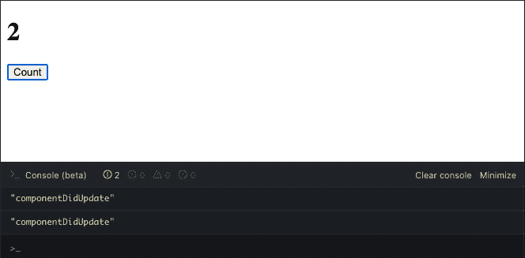
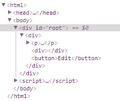
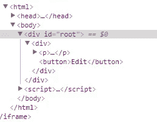
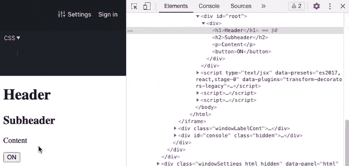
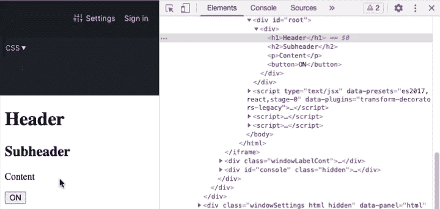

# React 条件渲染:9 种方法及示例

> 原文：<https://blog.logrocket.com/react-conditional-rendering-9-methods/>

编者按:本教程最后一次更新是在 2022 年 6 月 16 日，以反映 React v18 中所做的更改。

JSX 是 JavaScript 的强大扩展，它允许我们定义 UI 组件。它不直接支持循环或条件表达式，然而，条件表达式的添加[在](https://github.com/reactjs/react-future/issues/35)之前已经讨论过了。

如果你想遍历一个列表来呈现多个组件或者实现一些条件逻辑，你必须使用纯 JavaScript。对于循环，您也没有太多的选择。大多数时候，`map`会满足你的需求。但是[条件渲染](https://reactjs.org/docs/conditional-rendering.html)就是另一回事了。

## React 中的条件渲染是什么？

在 React 中，条件渲染指的是基于特定条件交付元素和组件的过程。

在 React 中使用条件渲染的方式不止一种。就像编程中的大多数事情一样，有些事情比其他事情更适合，这取决于您试图解决的问题。

在本教程中，我们将介绍在 React 中实现条件渲染的最流行的方法，同时回顾一些技巧和最佳实践。

为了演示所有这些方法是如何工作的，我们将实现一个具有查看和编辑功能的组件，如下图所示:


你可以在 [JSFiddle](https://jsfiddle.net/) 中派生出所有的例子来跟进。我们将从最简单的实现开始，使用一个`if...else`块并从那里开始构建。

## React 里的`if...else`怎么写

创建具有以下状态的组件:

```
import React from "react"

class App extends React.Component {
  constructor(props) {
    super(props);
    this.state = {
      text: "",
      inputText: "",
      mode: "view",
    };
  }
}

```

您将为保存的文本使用一个属性，为正在编辑的文本使用另一个属性。第三个属性将指示您是处于`edit`还是`view`模式。

接下来，添加一些处理输入文本的方法，然后保存和编辑事件，如下所示:

```
class App extends React.Component {
  constructor(props) {
    super(props);
    this.state = {text: '', inputText: '', mode:'view'};

    this.handleChange = this.handleChange.bind(this);
    this.handleSave = this.handleSave.bind(this);
    this.handleEdit = this.handleEdit.bind(this);
  }

  handleChange(e) {
    this.setState({ inputText: e.target.value });
  }

  handleSave() {
    this.setState({text: this.state.inputText, mode: 'view'});
  }

  handleEdit() {
    this.setState({mode: 'edit'});
  }
}

```

现在，对于`render`方法，检查`mode` state 属性来呈现编辑按钮或文本输入和保存按钮，以及保存的文本:

```
class App extends React.Component {
  // …
  render () {
    if(this.state.mode === 'view') {
      return (
        <div>
          <p>Text: {this.state.text}</p>
          <button onClick={this.handleEdit}>
            Edit
          </button>
        </div>
      );
    } else {
      return (
        <div>
          <p>Text: {this.state.text}</p>
            <input
              onChange={this.handleChange}
              value={this.state.inputText}
            />
          <button onClick={this.handleSave}>
            Save
          </button>
        </div>
      );
    }
}

```

下面是完整的小提琴来尝试一下:

一个`if...else`块是解决问题最简单的方法，但是我相信你知道这不是一个好的实现。虽然它对于简单的用例工作得很好，并且每个程序员都知道它是如何工作的，但是有很多重复，并且`render`方法看起来很拥挤。

让我们通过将所有条件逻辑提取到两个呈现方法来简化它:一个呈现输入框，另一个呈现按钮:

```
class App extends React.Component {
  // …

  renderInputField() {
    if(this.state.mode === 'view') {
      return <div></div>;
    } else {
      return (
          <p>
            <input
              onChange={this.handleChange}
              value={this.state.inputText}
            />
          </p>
      );
    }
  }

  renderButton() {
    if(this.state.mode === 'view') {
      return (
          <button onClick={this.handleEdit}>
            Edit
          </button>
      );
    } else {
      return (
          <button onClick={this.handleSave}>
            Save
          </button>
      );
    }
  }

  render () {
    return (
      <div>
        <p>Text: {this.state.text}</p>
        {this.renderInputField()}
        {this.renderButton()}
      </div>
    );
  }
}

```

下面是完整的小提琴来尝试一下:

假设我们有两个以上的分支依赖于同一个变量来评估条件。您可以考虑使用一个大的`if...else`块，如下面的代码所示:

```
if(this.state.mode === 'a') {
  // ...   
} else if(this.state.mode === 'b') {
  // ...
} else if(this.state.mode === 'c') {
  // ...
} else {
  // ...
}

```

相反，您可以使用如下的`switch`语句:

```
switch(this.state.mode) {
  case 'a':
    // ...
  case 'b':
    // ...
  case 'c':
    // ...
  default:
    // equivalent to the last else clause ...
}

```

`switch`语句可能会增加一点清晰度，但它仍然太冗长，并且它不适用于多个或不同的条件。就像一个`if...else`语句一样，你不能在 JSX 的`return`语句中使用`switch`语句，除非你使用立即调用的函数，这一点我们将在后面讨论。

让我们看看一些额外的技术来改进这段代码。请注意，当应用程序处于查看模式时，方法`renderInputField`返回一个空的`<div>`元素。然而，这不是必须的。

## 用`null`防止渲染

如果您想隐藏一个组件，您可以让它的 render 方法返回`null`，这样就不需要将一个空的、不同的元素作为占位符来呈现。然而，在返回`null`时要记住的一件重要事情是，即使组件没有出现，它的生命周期方法仍然被触发。

以下面的提琴为例，它实现了一个包含两个组件的计数器:

`Number`组件只呈现偶数值的计数器。否则返回`null`。然而，当您查看控制台时，您会看到无论`render`返回什么值，总是会调用`componentDidUpdate`。



在我们的示例中，将`renderInputField`方法更改为如下代码所示:

```
  renderInputField() {
    if(this.state.mode === 'view') {
      return null;
    } else {
      return (
          <p>
            <input
              onChange={this.handleChange}
              value={this.state.inputText}
            />
          </p>
      );
    }
  }

```

完整的小提琴在下面:

返回`null`而不是空元素的一个好处是，您可以稍微提高应用程序的性能，因为 React 不必卸载组件来替换它。

例如，如果您从呈现空的`<div>`元素的[控件](https://jsfiddle.net/eh3rrera/q0w1aamt/)中打开**检查器**标签，您会看到根下的`<div>`元素总是被更新:



这不同于当点击**编辑**按钮时，返回`null`隐藏组件并且`<div>`元素不更新的情况:



您可以查看文档以了解 React 中关于[协调的更多信息，这基本上是指 React 如何更新 DOM 元素以及 diffing 算法如何工作。](https://reactjs.org/docs/reconciliation.html)

虽然在这个简单的例子中，性能的提高是微不足道的，但是当您处理大型组件时，这种差异会更加明显。稍后，我们将讨论更多条件渲染的性能含义。现在，让我们继续改进我们的例子。

反应元素变量

## 因为我不喜欢在方法中有一个以上的`return`语句，所以我将使用一个变量来存储 JSX 元素，并且只在条件为`true`时初始化它:

上面的代码给出了与从那些方法返回`null`相同的结果。下面是尝试一下的小提琴:

```
renderInputField() {
    let input;

    if(this.state.mode !== 'view') {
      input = 
        <p>
          <input
            onChange={this.handleChange}
            value={this.state.inputText} />
        </p>;
    }

      return input;
  }

  renderButton() {
    let button;

    if(this.state.mode === 'view') {
      button =
          <button onClick={this.handleEdit}>
            Edit
          </button>;
    } else {
      button =
          <button onClick={this.handleSave}>
            Save
          </button>;
    }

    return button;
  }

```

The code above gives the same result as returning `null` from those methods. Here’s the Fiddle to try it out:

尽管主`render`方法以这种方式更具可读性，但没有必要使用`if...else`块或类似于`switch`语句和辅助呈现方法的东西。让我们尝试一个更简单的方法。

更多来自 LogRocket 的精彩文章:

* * *

### React 中的三元运算符

* * *

## 不使用`if...else`块，我们可以使用[三元条件操作符](https://developer.mozilla.org/en-US/docs/Web/JavaScript/Reference/Operators/Conditional_Operator):

运算符用花括号括起来，表达式可以包含 JSX，可以用括号括起来以提高可读性。该运算符也可以应用于组件的不同部分。

```
condition ? expr_if_true : expr_if_false

```

让我们将它应用到示例中来看看实际情况。我将删除`renderInputField`和`renderButton`，在`render`方法中，我将添加一个变量来知道组件是处于`view`还是`edit`模式:

现在，如果设置了`view`模式，您可以使用三元运算符返回`null`，否则设置输入字段:

```
render () {
  const view = this.state.mode === 'view';

  return (
      <div>
      </div>
  );
}

```

使用三元运算符，您可以声明一个组件，通过相应地更改其处理程序和标签来呈现保存或编辑按钮:

```
  // ...

  return (
      <div>
        <p>Text: {this.state.text}</p>

        {
          view
          ? null
          : (
            <p>
              <input
                onChange={this.handleChange}
                value={this.state.inputText} />
            </p>
          )
        }

      </div>
  );

```

下面是尝试一下的小提琴:

```
  // ...

  return (
      <div>
        <p>Text: {this.state.text}</p>

        {
          ...
        }

        <button
          onClick={
            view 
              ? this.handleEdit 
              : this.handleSave
          } >
              {view ? 'Edit' : 'Save'}
        </button>

      </div>
  );

```

Here’s the Fiddle to try it out:

如前所述，该操作符可以应用于组件的不同部分，甚至在 return 语句和 JSX 内部，作为一行`if...else`语句。然而，正是因为这个原因，事情很快就会变得一团糟。

让我们回顾一下有助于改进代码的另一种技术。

短路和操作器`&&`

## 有一种特殊情况，三元运算符可以简化。当你想渲染什么或者什么都不渲染时，你只能使用 [`&&`操作符](https://www.robinwieruch.de/conditional-rendering-react/#conditional-rendering-in-react-)。与`&`运算符不同，如果只有左边的表达式可以决定最终结果，`&&`不会计算右边的表达式。

例如，如果第一个表达式的计算结果为假，`false && …`，那么就没有必要计算下一个表达式，因为结果总是为`false`。

在 React 中，可以有如下表达式:

如果`showHeader`的计算结果为`true`，那么表达式将返回`<Header/>`组件。如果`showHeader`评估为`false`，则`<Header/>`组件将被忽略，并返回一个空的`<div>`。

```
return (
    <div>
        { showHeader && <Header /> }
    </div>
);

```

考虑下面的表达式:

上面的代码可以变成下面的代码片段，如下图所示:

```
{
  view
  ? null
  : (
    <p>
      <input
        onChange={this.handleChange}
        value={this.state.inputText} />
    </p>
  )
}

```

下面是完整的小提琴:

```
!view && (
  <p>
    <input
      onChange={this.handleChange}
      value={this.state.inputText} />
  </p>
)

```

尽管这个例子中的代码看起来更好，但情况并非总是如此。例如，考虑以下一组复杂的嵌套条件:

这很快就会变得一团糟。出于这个原因，有时您可能希望使用其他技术，比如立即调用的函数。

顾名思义，[立即调用函数表达式(iife)](https://flaviocopes.com/javascript-iife/)是定义后立即执行的函数，不需要显式调用。

```
return (
  <div>
    { condition1
      ? <Component1 />
      : ( condition2
        ? <Component2 />
        : ( condition3
          ? <Component3 />
          : <Component 4 />
        )
      )
    }
  </div>
);

```

通常，您会在稍后定义并执行一个函数，如下面的代码片段所示:

但是，如果您想在函数定义后立即执行它，您必须将整个声明放在括号中，以将其转换为表达式。您可以通过添加两个括号来执行它，并传递函数可能接受的任何参数:

添加额外的括号:

```
function myFunction() {

// ...

}

myFunction();

```

因为在任何其他地方都不会调用这个函数，所以您可以删除这个名称:

```
( function myFunction(/* arguments */) {
    // ...
}(/* arguments */) );

```

或者，您可以使用箭头函数:

```
( function myFunction(/* arguments */) {
    // ...
} ) (/* arguments */);

```

在 React 中，你用花括号把一个生命括起来，把所有你想要的逻辑放进去，比如一个`if...else`、`switch`、三元运算符等等。，并返回您想要呈现的任何内容。

```
( function (/* arguments */) {
    // ...
} ) (/* arguments */);

```

换句话说，在生活中，我们可以使用任何类型的条件逻辑。这允许我们在`return`语句中使用`if...else`和`switch`语句，如果你认为可以提高代码的可读性，还可以使用 JSX:

```
( (/* arguments */) => {
    // ...
} ) (/* arguments */);

```

例如，呈现“保存”或“编辑”按钮的逻辑看起来像下面这样:

下面是完整的小提琴:

```
return (
  <div>
    <p>...</p>
    {
      (()=> {
        switch (condition) {
          case 1: return <Component1 />;
          case 2: return <Component2 />;
          default: null;
        }
      })()
     }
  </div>
);

```

反应子组件

```
{
  (() => {
    const handler = view 
                ? this.handleEdit 
                : this.handleSave;
    const label = view ? 'Edit' : 'Save';

    return (
      <button onClick={handler}>
        {label}
      </button>
    );
  })()
}

```

有时候，一个 IFFE 看起来像是一个蹩脚的解决方案。毕竟我们用的是 React。推荐的方法是将你的应用程序的逻辑分成尽可能多的组件，并使用[函数式编程](https://blog.logrocket.com/react-functional-components-3-advantages-and-why-you-should-use-them-a570c83adb5e/)而不是命令式编程。

将条件呈现逻辑移动到根据其属性呈现不同内容的子组件中是一个不错的选择。但是，在这个例子中，我将做一些不同的事情，向您展示如何从命令式解决方案转变为更具声明性和功能性的解决方案。

## 我将从创建一个`SaveComponent`开始:

作为属性，它接收工作所需的一切。同理，还有一个`EditComponent`:

现在，`render`方法可以看起来像下面的代码:

下面是完整的小提琴:

```
const SaveComponent = (props) => {
  return (
    <div>
      <p>
        <input
          onChange={props.handleChange}
          value={props.text}
        />
      </p>
      <button onClick={props.handleSave}>
        Save
      </button>
    </div>
  );
};

```

`If`组件

```
const EditComponent = (props) => {
  return (
    <button onClick={props.handleEdit}>
      Edit
    </button>
  );
};

```

像 [JSX 控制语句](https://github.com/AlexGilleran/jsx-control-statements)这样的库扩展了 JSX，增加了如下条件语句:

```
render () {
    const view = this.state.mode === 'view';

    return (
      <div>
        <p>Text: {this.state.text}</p>

        {
          view
            ? <EditComponent handleEdit={this.handleEdit}  />
            : (
              <SaveComponent 
               handleChange={this.handleChange}
               handleSave={this.handleSave}
               text={this.state.inputText}
             />
            )
        } 
      </div>
    );
}

```

这个库实际上是一个 Babel 插件，所以上面的代码被翻译成如下:

或者，`Choose`标记用于更复杂的条件语句:

### 上面的代码翻译成以下内容:

这些库提供了更高级的组件，但是如果我们需要像简单的`if...else`这样的东西，我们可以使用类似于[迈克尔·j·瑞安的](https://github.com/tracker1)在[评论](https://github.com/facebook/jsx/issues/65#issuecomment-255484351)中对这个[问题](https://github.com/facebook/jsx/issues/65)的解决方案:

```
<If condition={ a === 1 }>
  <span>Hi!</span>
</If>

```

下面是完整的小提琴:

```
{
  a === 1 ? <span>Hi!</span> : null;
}

```

枚举对象

```
<Choose>
  <When condition={ a === 1 }>
    <span>One</span>
  </When>
  <When condition={ a === 2 }>
    <span>Two</span>
  </When>
  <Otherwise>
    <span>Default</span>
  </Otherwise>
</Choose>

```

既然保存/编辑功能被封装在两个组件中，我们可以使用 enum 对象来呈现其中一个组件，这取决于应用程序的状态。

```
{
  a === 1 ? (
    <span>One</span>
  ) : a === 2 ? (
    <span>Two</span>
  ) : (
    <span>Default</span>
  );
}

```

枚举是对常数值进行分组的类型。例如，下面是如何在 TypeScript 中定义枚举:

```
const If = (props) => {
  const condition = props.condition || false;
  const positive = props.then || null;
  const negative = props.else || null;

  return condition ? positive : negative;
};

// …

render () {
    const view = this.state.mode === 'view';
    const editComponent = <EditComponent handleEdit={this.handleEdit}  />;
    const saveComponent = <SaveComponent 
               handleChange={this.handleChange}
               handleSave={this.handleSave}
               text={this.state.inputText}
             />;

    return (
      <div>
        <p>Text: {this.state.text}</p>
        <If
          condition={ view }
          then={ editComponent }
          else={ saveComponent }
        />
      </div>
    );
}

```

JavaScript 本身不支持枚举，但我们可以使用一个对象来分组枚举的所有属性，并冻结该对象以避免意外的更改:

你可能想知道为什么我们不用常量。主要的好处是我们可以使用动态生成的键来访问对象的属性:

## 将此应用到我们的示例中，我们可以用保存和编辑的两个组件来声明一个 enum 对象:

我们可以使用`mode`状态变量来指示要显示哪个组件:

你可以在下面的小提琴中看到完整的代码:

```
enum State {
  Save = "Some value",
  Edit = "Another value"
}

```

JavaScript doesn’t support enums natively, but we can use an object to group all the properties of the enum and freeze that object to avoid accidental changes:

```
const State = Object.freeze({
  Save: "Some value",
  Edit: "Another value"
});

```

当您想要基于多个条件使用或返回一个值时，Enum 对象是一个很好的选择，在许多情况下，它是`if...else`和`switch`语句的很好的替代品。

```
const key = condition ? "Save" : "Edit":
const state = State[key];

```

React 中的高阶组件

```
const Components = Object.freeze({
  view: <EditComponent handleEdit={this.handleEdit} />,
  edit: <SaveComponent 
          handleChange={this.handleChange}
          handleSave={this.handleSave}
          text={this.state.inputText}
        />
});

```

[高阶组件(HOC)](https://reactjs.org/docs/higher-order-components.html) 是一个函数，它获取一个现有组件，并返回一个具有一些附加功能的新组件:

```
const key = this.state.mode;
return (
  <div>
    <p>Text: {this.state.text}</p>
    {
      Components[key]
    } 
  </div>
);

```

应用于条件呈现时，HOC 可以返回一个不同于基于某些条件传递的组件:

在这篇文章中，我将从[罗宾·威鲁奇](https://www.robinwieruch.de/react-higher-order-components/)那里借用`EitherComponent`的概念。

在函数式编程中，`Either`类型通常被用作包装器来返回两个不同的值。让我们首先定义一个带有两个参数的函数，另一个函数将返回一个布尔值，条件求值的结果，以及如果该值为`true`将返回的组件:

## 按照惯例，特设的名称以单词`with`开头。该函数将返回另一个函数，该函数将原始组件返回一个新组件:

此内部函数返回的组件或函数将是您将在应用程序中使用的组件或函数，因此它将接受一个具有工作所需的所有属性的对象:

```
const EnhancedComponent = higherOrderComponent(component);

```

内部函数可以访问外部函数的参数。现在，根据`conditionalRenderingFn`函数返回的值，要么返回`EitherComponent`要么返回原来的`Component`:

```
function higherOrderComponent(Component) {
  return function EnhancedComponent(props) {
    if (condition) {
      return <AnotherComponent { ...props } />;
    }

    return <Component { ...props } />;
  };
}

```

或者，您可以使用箭头函数:

使用之前定义的`SaveComponent`和`EditComponent`，您可以创建一个`withEditConditionalRendering`特设，并以此创建一个`EditSaveWithConditionalRendering`组件:

```
function withEither(conditionalRenderingFn, EitherComponent) {

}

```

您现在可以在`render`方法中使用 HOC，向它传递所有需要的属性:

```
function withEither(conditionalRenderingFn, EitherComponent) {
    return function buildNewComponent(Component) {

    }
}

```

下面是完整的小提琴:

```
function withEither(conditionalRenderingFn, EitherComponent) {
    return function buildNewComponent(Component) {
        return function FinalComponent(props) {

        }
    }
}

```

性能考虑因素

```
function withEither(conditionalRenderingFn, EitherComponent) {
    return function buildNewComponent(Component) {
        return function FinalComponent(props) {
            return conditionalRenderingFn(props)
                ? <EitherComponent { ...props } />
                 : <Component { ...props } />;
        }
    }
}

```

条件渲染可能很棘手。正如我之前向您展示的，每个选项的性能都可能不同。然而，大多数时候，这些差异并不重要。但是，当他们这样做时，您需要很好地理解 React 如何与虚拟 DOM 一起工作，以及一些优化性能的技巧。

```
const withEither = (conditionalRenderingFn, EitherComponent) => (Component) => (props) =>
  conditionalRenderingFn(props)
    ? <EitherComponent { ...props } />
    : <Component { ...props } />;

```

基本思想是，由于条件渲染而改变组件的位置会导致回流，这将卸载/装载应用程序的组件。基于本文的示例，我创建了两个 JSFiddles。

```
const isViewConditionFn = (props) => props.mode === 'view';

const withEditContionalRendering = withEither(isViewConditionFn, EditComponent);
const EditSaveWithConditionalRendering = withEditContionalRendering(SaveComponent);

```

第一个使用一个`if...else`块来显示/隐藏`SubHeader`组件:

```
render () {    
    return (
      <div>
        <p>Text: {this.state.text}</p>
        <EditSaveWithConditionalRendering 
               mode={this.state.mode}
               handleEdit={this.handleEdit}
               handleChange={this.handleChange}
               handleSave={this.handleSave}
               text={this.state.inputText}
             />
      </div>
    );
}

```

第二个使用短路操作符`&&`做同样的事情:

## 打开**检查器**，点击几次按钮。您将看到每个实现如何不同地对待`Content`组件。

`if...else`块用下面的代码处理组件:



短路操作员使用以下方法:



使用片段的条件渲染

如何根据特定条件呈现多个子组件？答案是通过使用[片段](https://reactjs.org/docs/fragments.html)。片段允许您通过分组返回多个元素，而无需向 DOM 添加额外的节点。

您可以使用片段的传统语法:

或者它们的简短语法:

当根据条件用片段呈现多个元素时，您可以使用本文中描述的任何技术。例如，您可以这样使用三元运算符:

更好的是，你可以使用短路:

## 您还可以将子元素的呈现封装在一个方法中，并使用一个`if`或`switch`语句来决定返回什么:

使用 React 挂钩的条件渲染

现在，大多数有经验的 React 开发人员都使用钩子来编写组件。所以，不要像下面这样的类:

```
return (
  <React.Fragment>
    <Button />
    <Button />
    <Button />
  </React.Fragment>
);

```

您可以使用`useState`钩子编写带有函数的组件:

```
return (
  <>
    <Button />
    <Button />
    <Button />
  </>
);

```

就像片段一样，您可以使用本文中描述的任何技术来有条件地呈现使用钩子的组件:

```
{ 
  view
  ? null
  : (
    <React.Fragment>
      <Button />
      <Button />
      <Button />
    </React.Fragment>
  )
}

```

唯一的警告是，你不能有条件地调用一个钩子，这样它就不会总是被执行。根据[钩子文档](https://reactjs.org/docs/hooks-rules.html)，你不应该在循环、条件或嵌套函数中调用钩子。相反，总是在 React 函数的顶层使用钩子。通过遵循这条规则，您可以确保每次组件呈现时都以相同的顺序调用钩子。这使得 React 能够正确保存多个 `useState` 和 `useEffect` 调用之间的钩子状态。

```
{ 
  condition &&
  <React.Fragment>
    <Button />
    <Button />
    <Button />
  </React.Fragment>
}

```

使用`useEffect`钩子，你不能设置一个条件来阻止钩子在每次组件被渲染时被调用，就像这样:

```
render() {
  return <div>{ this.renderChildren() }</div>;
}

renderChildren() {
  if (this.state.children.length === 0) {
    return <p>Nothing to show</p>;
  } else {
    return (
      <React.Fragment>
        {this.state.children.map(child => (
          <p>{child}</p>
        ))}
      </React.Fragment>
    );
 }
}

```

## 你必须把条件放在钩子里面:

React 中实现条件渲染的最好方法是什么？

```
import React, { Component } from 'react';

class Doubler extends Component {
  constructor(props) {
    super(props);

    this.state = {
      num: 1,
    };
  }

  render() {
    return (
      <div>
        <p>{this.state.num}</p>
        <button onClick={() =>
            this.setState({ num: this.state.num * 2 })
        }>
          Double
        </button>
      </div>
    );
  }
}

```

与编程中的许多事情一样，React 中有许多实现条件呈现的方法。我要说的是，除了第一种方法之外，对于许多回报，你可以自由选择你想要的任何方法。

```
import React from 'react';

function Doubler() {
  const [num, setNum] = React.useState(1);

  return (
    <div>
      <p>{num}</p>
      <button onClick={() => setNum(num * 2)}>
        Double
      </button>
    </div>
  );
}

```

您的决策中需要考虑的一些因素包括您的编程风格、条件逻辑的复杂程度，以及您对 JavaScript、JSX 和 HOCs 等高级 React 概念的熟悉程度。

```
function Doubler() {
  const [num, setNum] = React.useState(1);
  const showButton = num <= 8;
  const button = <button onClick={() => setNum(num * 2)}>Double</button>;

  return (
    <div>
      <p>{num}</p>
      {showButton && button}
    </div>
  );
}

```

并且，在同等条件下，你应该总是倾向于简单性和可读性。我希望你喜欢这篇文章，如果你有任何问题，一定要留下评论。

With the `useEffect` Hook, you can’t put a condition that could prevent the Hook from being called every time the component is rendered, like this:

```
if (shouldExecute) {
  useEffect(() => {
    // ...
  }
}

```

You have to put the condition inside the Hook:

```
useEffect(() => {
  if (shouldExecute) {
    // ...
  }
}, [shouldExecute])

```

## What’s the best way to implement conditional rendering in React?

As with many things in programming, there are many ways to implement conditional rendering in React. I’d say that, with the exception of the first method, `if...else` with many returns, you’re free to choose whatever method you want.

Some factors to include in your decision include your programming style, how complex the conditional logic is, and how comfortable you are with JavaScript, JSX, and advanced React concepts like HOCs.

And, all things equal, you should always favor simplicity and readability. I hope you enjoyed this article, and be sure to leave a comment if you have any questions.