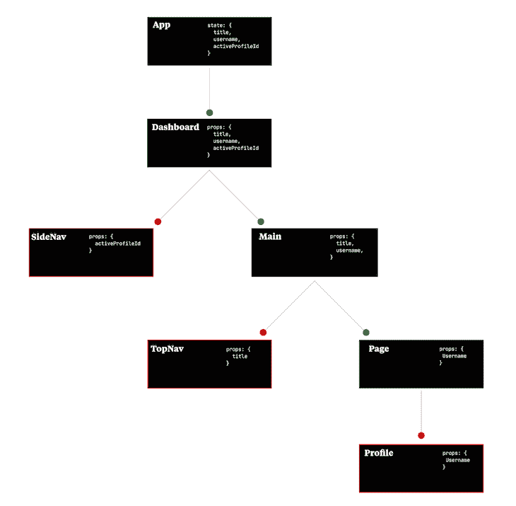
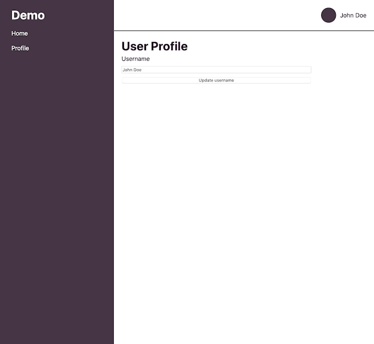
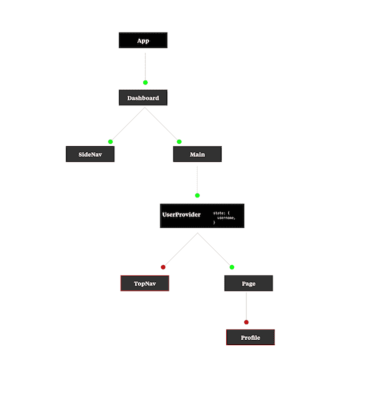

# React Context API:示例深度剖析

> 原文：<https://blog.logrocket.com/react-context-api-deep-dive-examples/>

> **编者按**:这篇文章最后一次更新是在 2021 年 10 月，以反映关于 React 上下文 API 的最新信息。

尽管 React 很受欢迎，但开发人员在使用该库时面临的最大障碍之一是组件过度重复渲染，这会降低性能并损害可读性。当开发人员需要组件在称为 prop drilling 的过程中相互通信时，组件重新呈现尤其有害。

React v.16.3 引入的[新 React 上下文 API](https://reactjs.org/docs/context.html) 允许我们通过组件树传递数据，使我们的组件能够在不同级别上通信和共享数据。在本教程中，我们将探索如何使用 React 上下文来避免适当的钻取。首先，我们将涵盖什么是道具演练，以及为什么我们应该避免它。

目录:

## React 中的组件和道具

虽然您的应用程序开始时可能只有一个组件，但是随着它变得越来越复杂，您必须不断地将它分解成更小的组件。有了组件，我们可以隔离更大的应用程序的各个部分，提供关注点的分离。如果您的应用程序中出现任何问题，您可以使用故障隔离轻松地确定问题出在哪里。

然而，组件也意味着可重用。您希望避免重复的逻辑并防止过度抽象。重用组件带来了干代码的好处；组件通常具有另一个组件需要的一些数据或功能，例如，保持组件同步。在 React 中，我们可以使用道具来使我们的组件进行通信。

组件就像 JavaScript 函数，可以接受任意数量的参数。理想情况下，函数的参数用于其操作。我喜欢把函数想象成一个代码块，它执行一个函数，传递给它的参数可以是零，也可以是任意数量。例如，下面的函数`sum`将两个数字`a`和`b`相加:

```
function sum(a, b) {
  return a + b;
}

```

执行该函数相当简单:

```
console.log(sum(1, 2)); // 3

```

在 React 组件中，这些参数被称为 props，是 properties 的缩写。一个`ErrorMessage`可能看起来像这样:

```
function ErrorMessage(props) {
  return (
    <div className="error-message">
      <h1> Something went wrong </h1>  
      <p> {props.message} </p>
    </div>
  )
}

```

因为`ErrorMessage`将在整个应用中被多次重用，所以它将在其 props 中传递一个不同的`message`。然而，这只是一个组成部分，这个例子并没有阐明`message`道具从何而来，这对我们了解很重要。

## 反作用支柱钻井

React 将 UI 更改保存在虚拟 DOM 中，然后通过一个称为协调的过程来更新浏览器 DOM。让我们以一个简单的仪表板应用程序为例:

```
function App() {
  const [title, setTitle] = React.useState("Home");
  const [username, setUsername] = React.useState("John Doe");
  const [activeProfileId, setActiveProfileId] = React.useState("A1B2C3");

  return (
    <div className="app">
      <h1>Welcome, {username}</h1>
      <Dashboard {...{ activeProfileId, title, username}}/>
    </div>
  )
}

```

`App`组件有三个`states`、`activeProfileId`、`title`和`username`。`states`有默认值，它们被传递给`Dashboard`组件:

```
function Dashboard({activeProfileId, title, username}) {
  return (
    <div className="dashboard">
      <SideNav {...{activeProfileId}}/>
      <Main {...{title, username}}/>
    </div>
  )
}

```

`Dashboard`组件接收`props`并立即将它们分派给树中更下面的后续组件`SideNav`和`Main`:

```
function SideNav({activeProfileId}) {
  return (
    <nav className="side-nav">
      <h1>ID: {activeProfileId}</h1>
    </nav>
  )
}

function Main({title, username}) {
  return (
    <div className="main-content">
      <TopNav {...{title}}/>
      <Page {...{username}}/>
    </div>
  )
}
SideNav immediately consumes the activeProfileId prop, and Main continues to relay the title and username props further down the tree.
function TopNav({title}) {
  return (
    <nav className="top-nav">
      <h1> {title} </h1>
    </nav>
  )
}

function Page({username}) {
  return <Profile {...{username}}/>
}
TopNav uses the title props, and Page sends username down, again, to Profile:
function Profile({username}) {
  return <h1>{username}</h1>
}

```

最后，`Profile`使用`username`道具。以这种方式传递道具下来，[称为道具钻](https://blog.logrocket.com/the-upsides-of-prop-drilling-in-react/)，是默认的方法。为了更好地说明组件层次结构，请查看下图:



`App`是启动道具传递组件。当`App`的状态`title`、`username`、`activeProfileId`被传为`props`时，需要这些`props`的组件是`SideNav`、`TopNav`和`Profile`。然而，我们必须通过中介组件`Dashboard`、`Main`和`Page`，它们仅仅是传递道具。

与从`App`、`Dashboard`、`Main`、`Page`并最终到达`Profile`的导航相比，从`App`到`Dashboard`再到`SideNav`的遍历相对容易。

沿着链条，任何事情都可能出错。例如，可能会有打字错误，中间组件可能会发生重构，或者我们的`props`可能会经历突变。此外，如果我们去掉一个中间组件，整个过程就会崩溃。

还有重新渲染的问题。由于 React 渲染的工作方式，中间组件也将被迫重新渲染，从而降低应用程序的整体性能。让我们看看如何使用 React 上下文 API 解决这些问题。

## React 上下文入门

根据 React 文档，上下文提供了一种通过组件树将数据从父组件传递到子组件的方法，而不必在每一层手动传递属性。

上下文中的每个组件都是上下文感知的。本质上，需要道具的组件可以简单地请求它，而不需要仅帮助传递道具的中间助手组件，而不是通过树上的每个组件向下传递道具。

我们将使用 [`useContext`钩子来创建和使用一个新的上下文](https://blog.logrocket.com/how-and-when-to-use-reacts-new-context-api-b584e41b2704/)，如下所示:

```
// import UserContext — you'd learn how to implement this below

function UserProfile() {
  const userDetails = useContext(UserContext);
  // rest of the component
}

```

## React 上下文 API 示例

### 存储和访问用户配置文件

我最喜欢的一个上下文用例是存储用户配置文件，并在我需要的任何地方访问它。我还可以保持共享状态同步。让我们再次构建我们的仪表板应用程序:



组件树看起来会像这样:



请注意，该图看起来类似于上面的支柱钻孔组件树，除了`username`是唯一的考虑因素。您可能还会注意到以下内容:

*   接收组件是`TopNav`和`Profile`
*   接收部件需要的状态是在`UserProvider`
*   `UserProvider`的所有子组件都可以直接访问`username`状态，包括`TopNav`、`Page`和`Profile`

直接访问意味着即使`Page`是`Profile`的父组件，它也不必再是中间组件:

```
import React, { createContext, useState } from "react";

// Create two context:
// UserContext: to query the context state
// UserDispatchContext: to mutate the context state
const UserContext = createContext(undefined);
const UserDispatchContext = createContext(undefined);

// A "provider" is used to encapsulate only the
// components that needs the state in this context
function UserProvider({ children }) {
  const [userDetails, setUserDetails] = useState({
    username: "John Doe"
  });

  return (
    <UserContext.Provider value={userDetails}>
      <UserDispatchContext.Provider value={setUserDetails}>
        {children}
      </UserDispatchContext.Provider>
    </UserContext.Provider>
  );
}

export { UserProvider, UserContext, UserDispatchContext };

```

状态变量`userDetails`和`setUserDetails`通过带有`value`属性的`UserContext`和`UserDispatchContext`提供者公开。

包装`UserProvider`，如下图`Main`所示，将`UserContext`和`UserDispatchContext`的`value`道具暴露给树中的`TopNav`和`Page`组件:

```
function Main() {
  return (
    <div className="dashboardContent">
      <UserProvider>
        <TopNav />
        <Page />
      </UserProvider>
    </div>
  );
}

```

在`Profile`中，我们可以如下使用`username`:

```
function Profile() {
  const userDetails = React.useContext(UserContext);
  const setUserDetails = useContext(UserDispatchContext);

  return <h1> {userDetails.username} </h1>;
}

// setUserDetails is a function as de-structured. When using it to update userDetail// s it expects an object with a username:
const [userDetails, setUserDetails] = useState({
    username: "John Doe"
});

```

### 具有反应上下文的全局共享状态

React 上下文的另一个用例是将其用作全局状态机制，就像我们在`TopNav`和`Profile`之间使用的一样。更新`Profile`中的`username`会立即更新`UserProvider`中的共享状态，为全局状态管理提供一种机制。

与适当钻取一样，在使用上下文时会有一些性能消耗。每当它呈现时，其子组件也会呈现。最小化渲染的一个方法是让上下文尽可能靠近它被使用的地方，就像我们对`UserProvider`所做的那样。尽管我们可以将它放在组件树中更高的位置，但它的效率会更低。

## React 上下文 API 的用途

有了 React Context，我们可以深入传递数据。虽然一些开发人员可能希望使用上下文作为全局状态管理解决方案，但这样做是很棘手的。尽管 React Context 是原生且简单的，但它不像 Redux 那样是一个专用的状态管理工具，也没有合理的默认设置。

如果您决定使用 React 上下文，您应该意识到其潜在的性能消耗。你很容易忘乎所以，在不需要的地方添加了太多的组件。为了防止重新呈现，请确保仅在需要上下文的组件中正确放置上下文。

## Redux 与 React 上下文 API

React 上下文是否替代 Redux？简而言之，答案是否定的。正如我们已经看到的，Context 和 Redux 是两种不同的工具，而比较通常来自于对每种工具的设计目的的误解。

尽管可以编排上下文来充当状态管理工具，但它不是为此目的而设计的，所以您必须付出额外的努力才能使它工作。已经有很多状态管理工具运行良好，会减轻你的烦恼。

* * *

### 更多来自 LogRocket 的精彩文章:

* * *

以我使用 Redux 的经验来看，要实现一些现在用上下文更容易解决的事情可能会相对复杂。请记住，适当的钻取和全局状态管理是 Redux 和 Context 的交叉点。Redux 在这方面有更多的功能。

最终，Redux 和 Context 应该被认为是互补的工具，它们一起工作，而不是替代物。我的建议是使用 Redux 进行复杂的全局状态管理，使用 Context 进行适当的处理。

## 结论

这篇文章的主要内容包括:

*   React 上下文 API 是为正确钻探而设计的
*   如果您使用上下文进行全局状态管理，请谨慎使用
*   如果你不能谨慎对待上下文，尝试 Redux
*   Redux 可以独立于 React 使用
*   Redux 不是唯一可用的状态管理工具

在本文中，我们回顾了什么是 React Context API，何时应该使用它来避免钻取，以及如何最有效地使用上下文。我们还澄清了围绕 React 上下文 API 和 Redux 的一些误解。我希望你喜欢这个教程！

## 使用 LogRocket 消除传统反应错误报告的噪音

[LogRocket](https://lp.logrocket.com/blg/react-signup-issue-free)

是一款 React analytics 解决方案，可保护您免受数百个误报错误警报的影响，只针对少数真正重要的项目。LogRocket 告诉您 React 应用程序中实际影响用户的最具影响力的 bug 和 UX 问题。

[ ](https://lp.logrocket.com/blg/react-signup-general) [  ](https://lp.logrocket.com/blg/react-signup-general) [LogRocket](https://lp.logrocket.com/blg/react-signup-issue-free)

自动聚合客户端错误、反应错误边界、还原状态、缓慢的组件加载时间、JS 异常、前端性能指标和用户交互。然后，LogRocket 使用机器学习来通知您影响大多数用户的最具影响力的问题，并提供您修复它所需的上下文。

关注重要的 React bug—[今天就试试 LogRocket】。](https://lp.logrocket.com/blg/react-signup-issue-free)