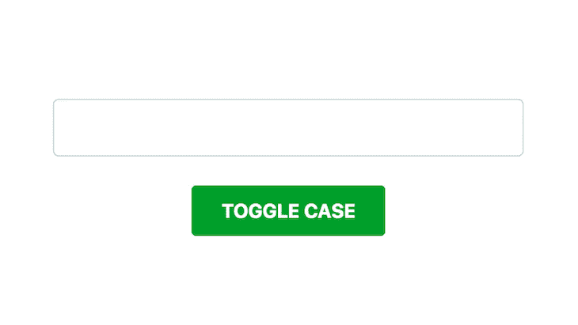
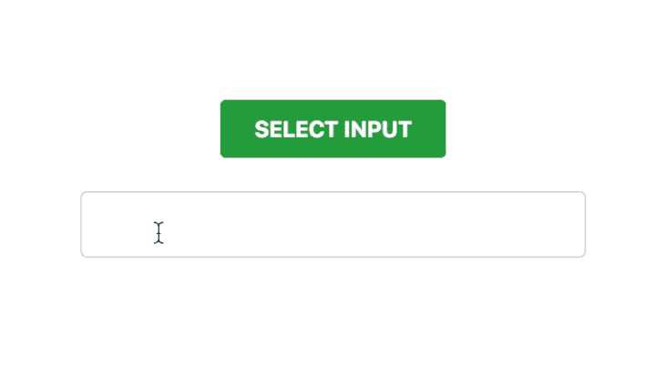
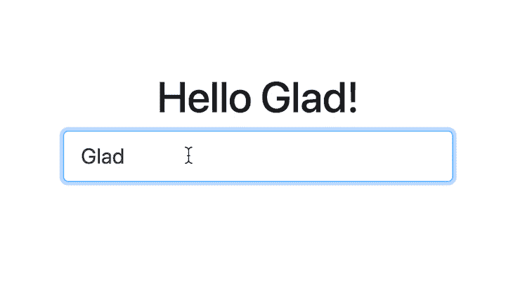
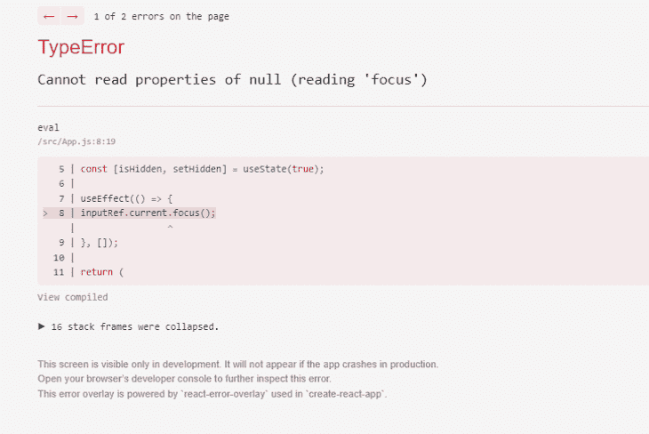

# 如何使用 React createRef - LogRocket 博客

> 原文：<https://blog.logrocket.com/react-createref-guide/>

***编者按:***本指南使用 React *`createRef`最后一次更新是在 2022 年 11 月 15 日，包括了 React 引用的常见错误和用 ref 存储变异状态的信息。*

如果你已经开发 web 应用足够长的时间，你可能已经使用过 JavaScript [DOM](https://developer.mozilla.org/en-US/docs/Web/API/Document_Object_Model/Introduction) 库，比如 [jQuery](http://jquery.com/) 、 [Mootools](https://mootools.net/) 、 [Prototype.js](http://prototypejs.org/learn/) 等等。这些库给交互式 web 应用程序的构建带来了重大转变。有了 DOM 抽象 API，操作 web 应用程序的内容变得容易多了。

例如，您会发现自己在用 jQuery 做这样的事情:

```
​​$('#button').on('click', function(evt) {
​​  evt.preventDefault();
​​  var content = $('
​​Random Post Title
​​Random post text.
​​');
​​
​​  $('#element').append(content);
​​});
```

如今，像 [React](https://blog.logrocket.com/tag/react/) 、 [Angular](https://blog.logrocket.com/tag/angular/) 和 [Vue.js](https://blog.logrocket.com/tag/vue/) 这样的 JavaScript 框架通常用于构建现代应用程序。这些框架都是基于组件的架构。虽然您可以通过利用它们的内置功能做很多事情，但有时您需要与实际的 DOM 进行交互来实现一些本机行为。大多数现代框架都提供 API，通过这些 API 可以访问应用程序的原生 DOM 表示，React 也不例外。

在本教程中，我们将考虑如何在 React 应用程序中与 DOM 交互。我们还将看到如何使用 React v16.3 中引入的`React.createRef()`特性，以及 React 更高版本中引入的`useRef`钩子。要了解 React 中虚拟 DOMs 的更多信息，请查看本[指南](https://blog.logrocket.com/what-virtual-dom-react/)。

*向前跳转:*

## 什么是 React refs 和 DOM？

React 提供了一个称为 [refs](https://blog.logrocket.com/complete-guide-react-refs/) 的特性，允许从组件访问 DOM。您只需将 ref 附加到应用程序中的一个元素上，就可以从组件中的任何地方访问该元素的 DOM。

[React 文档](https://reactjs.org/docs/refs-and-the-dom.html)将 refs 称为工具，用于提供对 render 方法中创建的 React 元素和 DOM 节点的直接访问。一般来说，只有当使用[状态和道具](https://blog.logrocket.com/the-beginners-guide-to-mastering-react-props-3f6f01fd7099/)的机制无法实现所需的交互时，才应该考虑使用 refs。

但是，在一些情况下，使用 ref 是合适的。其中之一是在与第三方 DOM 库集成时。此外，深度交互，如处理文本选择或管理媒体回放行为，需要相应元素上的 refs。您可以查看我们的 [React 参考指南](https://blog.logrocket.com/react-reference-guide-refs-dom/#creatingrefs)了解更多信息。

## 在 React 中创建引用

在 React 中创建引用有四种主要方式。以下是不同方法的列表，从最古老的开始:

1.  字符串引用(传统方法)
2.  回调参考
3.  `React.createRef`(来自 React v16.3)
4.  `useRef`钩子(来自 React v16.8)

### React 中的字符串引用

在 React 应用程序中创建引用的传统方式是使用字符串引用。这是最古老的方法，被视为传统方法，已被弃用。字符串引用是通过向所需元素添加一个`ref`属性并为`ref`传递一个`string`名称作为其值来创建的。

这里有一个简单的例子:

```
class MyComponent extends React.Component {

  constructor(props) {
    super(props);
    this.toggleInputCase = this.toggleInputCase.bind(this);
    this.state = { uppercase: false };
  }

  toggleInputCase() {
    const isUpper = this.state.uppercase;

    // Accessing the ref using this.refs.inputField
    const value = this.refs.inputField.value;

    this.refs.inputField.value =
      isUpper
        ? value.toLowerCase()
        : value.toUpperCase();

    this.setState({ uppercase: !isUpper });
  }

  render() {
    return (
      <div>
        {/* Creating a string ref named: inputField */}
        <input type="text" ref="inputField" />

        <button type="button" onClick={this.toggleInputCase}>
          Toggle Case
        </button>
      </div>
    );
  }

}
```

这里，我们创建了一个简单的 React 组件，它呈现一个`<input>`元素和一个`<button>`元素，允许我们在大写和小写之间切换输入的大小写。

我们用设置为`false`的`uppercase`属性来初始化组件的状态。这个属性允许我们确定输入的当前大小写。

重点是我们在`<input>`元素上创建的字符串 ref。我们还制作了一个名为`inputField`的`<input>`参考。后来，在`<button>`的 [`onClick`事件处理程序](https://blog.logrocket.com/react-onclick-event-handlers-guide/)中，我们通过`this.refs.inputField`访问 ref。然后，我们操纵`<input>`的 DOM 来改变输入的值。

下面是一个交互的示例演示:



尽管这是一个如何使用 refs 的简单示例，但它向我们展示了如何在 React 组件中使用字符串 refs。如前所述，不鼓励在 React 应用程序中使用字符串引用。

### 在 React 中使用回调引用

回调引用使用回调函数来创建引用，而不是将引用的名称作为字符串传递。如果您使用的是早于 v16.3 的 [React 版本，这应该是您创建引用的首选方法。](https://reactjs.org/docs/refs-and-the-dom.html#callback-refs)

回调函数接收`React Component`实例或`HTML DOM`元素作为其参数，可以在其他地方存储和访问。使用回调`ref`，我们之前的代码片段将变成如下:

```
class MyComponent extends React.Component {

  constructor(props) {
    super(props);
    this.toggleInputCase = this.toggleInputCase.bind(this);
    this.state = { uppercase: false };
  }

  toggleInputCase() {
    const isUpper = this.state.uppercase;

    // Accessing the ref using this.inputField
    const value = this.inputField.value;

    this.inputField.value =
      isUpper
        ? value.toLowerCase()
        : value.toUpperCase();

    this.setState({ uppercase: !isUpper });
  }

  render() {
    return (
      <div>
        {/* Creating a callback ref and storing it in this.inputField */}
        <input type="text" ref={elem => this.inputField = elem} />

        <button type="button" onClick={this.toggleInputCase}>
          Toggle Case
        </button>
      </div>
    );
  }

}
```

在这方面，我们做了两项重大改变。首先，我们使用回调函数定义了`ref`，并将其存储在`this.inputField`中，如下所示:

```
<input type="text" ref={elem => this.inputField = elem} />
```

然后，在事件处理程序中，我们使用`this.inputField`而不是`this.refs.inputField`来访问`ref`。

当使用内联回调函数`refs`时，正如我们在例子中所做的，重要的是要知道对于组件的每次更新，回调函数被调用两次——第一次使用`null`,然后再次使用`DOM`元素。

然而，创建回调函数作为组件类的`bound`方法可以用来避免这种行为。使用回调函数创建引用可以让您更好地控制如何创建、设置和取消设置引用。

## 使用`React.createRef()`的例子

从 React v16.3 开始， [React API](https://blog.logrocket.com/modern-api-data-fetching-methods-react/) 包含了一个`createRef()`方法，它可以用来创建引用，就像我们使用回调函数一样。只需通过调用`React.createRef()`创建一个引用，并将结果`ref`分配给一个元素。

使用`React.createRef()`，我们之前的例子现在看起来像这样:

```
class MyComponent extends React.Component {

  constructor(props) {
    super(props);
    this.inputField = React.createRef();
    this.toggleInputCase = this.toggleInputCase.bind(this);
    this.state = { uppercase: false };
  }

  toggleInputCase() {
    const isUpper = this.state.uppercase;

    // Accessing the ref using this.inputField.current
    const value = this.inputField.current.value;

    this.inputField.current.value =
      isUpper
        ? value.toLowerCase()
        : value.toUpperCase();

    this.setState({ uppercase: !isUpper });
  }

  render() {
    return (
      <div>
        {/* Referencing the ref from this.inputField */}
        <input type="text" ref={this.inputField} />

        <button type="button" onClick={this.toggleInputCase}>
          Toggle Case
        </button>
      </div>
    );
  }

}
```

在这里，我们看到了一些变化。首先，在`constructor()`中，我们使用`React.createRef()`创建了一个`ref`，并将其存储在`this.inputField`中，如下所示:

```
this.inputField = React.createRef();
```

接下来，在事件处理程序中，我们使用`this.inputField.current`而不是`this.inputField`来访问`ref`。这对于用`React.createRef()`创建的 refs 来说是值得注意的。在 ref 的`current`属性中可以访问对节点的引用。

最后，我们将`ref`传递给`<input>`组件，如下所示:

```
<input type="text" ref={this.inputField} />
```

我们已经探索了在 React 应用程序中创建 refs 的各种方法。在接下来的几节中，我们将进一步了解`React.createRef`更有趣的特征。

### 使用 React `useRef`钩子

随着 React v16 的发布， [Hooks API](https://blog.logrocket.com/react-reference-guide-hooks-api/) 已经成为 React 应用程序中抽象和重用代码的事实手段。一个这样的钩子是 [`useRef`](https://blog.logrocket.com/usestate-vs-useref/) ，它允许我们在[功能组件](https://blog.logrocket.com/fundamentals-functional-programming-react/)中创建和使用引用。

值得注意的是，即使使用了`useRef`钩子，默认情况下，您仍然不能在函数组件上使用 ref 属性，因为我们不能创建函数的实例。我们将在本文后面讨论如何通过 [ref 转发](https://blog.logrocket.com/cleaning-up-the-dom-with-forwardref-in-react/)来解决这个问题。

要使用`useRef`钩子，你将`ref.current`应该引用的对象传入`useRef`钩子并调用它。这个钩子调用应该返回一个`ref`对象，您可以像使用前面讨论的`createRef`方法一样使用它。

如果我们使用`useRef`钩子，我们之前的例子应该是这样的:

```
const MyComponent = () => {
    const [uppercase, setUppercase] = React.useState(false)
    const inputField = React.useRef(null)
    const toggleInputCase = () => {
        // Accessing the ref using inputField.current
        const value = inputField.current.value;
        inputField.current.value = uppercase ? value.toLowerCase() : value.toUpperCase();
        setUppercase(previousValue => !previousValue)
    }

    return(
       <div>
           {/* Referencing the ref from this.inputField */}
           <input type="text" ref={inputField} />
           <button type="button" onClick={toggleInputCase}>
                Toggle Case  
           </button>
       </div>
```

如您所见，代码与`React.createRef`实现非常相似。我们使用`useRef`钩子创建一个`ref`，并将这个`ref`传递给`<input>`的 ref 属性。

`<button>`的事件处理程序的流程与之前相同。我们根据状态变量`uppercase`的当前值，更新我们的`ref`所指向的 HTML 元素的`value`属性(可以使用`ref.current`来访问它)。

## React 中的建筑构件参照

在上一节中，我们看到了如何使用`React.createRef` API 创建引用。实际的引用存储在`ref`的`current`属性中。

在我们的示例中，我们只在 React 应用程序中创建了对 DOM 节点的引用。但是也可以创建 refs 来反应组件，这将使我们能够访问这些组件的`instance`方法。

请记住，我们只能在`class`组件上创建引用，因为它们在挂载时会创建该类的`instance`。不能在功能元件上使用参照。

让我们考虑一个在 React 组件上使用 refs 的非常简单的例子。在本例中，我们将创建两个组件:

*   `FormInput`:这个组件将包装一个`<input>`元素，并提供一个方法来知道输入何时包含一些值，以及一个方法来选择输入文本
*   `MyComponent`:当**选中**时，包装`FormInput`组件和一个按钮来选择输入中的文本

以下是组件的代码片段:

```
class FormInput extends React.Component {

  constructor(props) {
    super(props);
    this.textInput = React.createRef();
  }

  hasText() {
    return this.textInput.current.value.length > 0;
  }

  selectInputText() {
    this.textInput.current.select();
  }

  render() {
    return (
```

像以前一样，我们使用`React.createRef()`创建了一个`ref`，并将`ref`添加到了`render`函数中的`<input>`元素中。我们创造了两种方法:

*   `hasText()`:返回一个`Boolean`，表示`input`元素的值不为空。因此，它在为空时返回`false`。否则，它返回`true`
*   `selectInputText()`:选择`input`中的整个文本

注意，通过访问我们创建的`ref`:`this.textInput.current`的`current`属性，我们在方法中获得了对`input`的引用。

现在，让我们创建`MyComponent`。以下是代码片段:

```
const MyComponent = (props) => {

  const formInput = React.createRef();

  const inputSelection = () => {
    const input = formInput.current;

    if (input.hasText()) {
      input.selectInputText();
    }
  };

  return (
    <div>
      <button type="button" onClick={inputSelection}>
        Select Input
      </button>

      <FormInput ref={formInput} />
    </div>
  );

};
```

在这个代码片段中，我使用了一个函数组件而不是类组件，因为这是一个无状态组件。我还想用这个组件来演示如何在函数组件中使用 refs。

这里，我们使用`React.createRef()`创建一个`ref`，并将其存储在`formInput`常量中。注意，我们没有使用`this`，因为功能组件不是类，也不创建实例。

* * *

### 更多来自 LogRocket 的精彩文章:

* * *

注意，在`render()`方法中，我们将自己创建的`ref`添加到了之前制作的`<FormInput>`组件中。与前面向 DOM 节点添加引用的例子不同，在这里，我们向组件添加一个引用。

此外，只能为类组件而不是功能组件创建引用。`FormInput`是一个类组件，所以我们可以创建对它的引用。然而，我们可以在功能组件中使用 ref，就像我们在这个例子中使用`formInput`一样。

最后，在`inputSelection()`函数中，我们像以前一样使用`ref`的`current`属性访问对组件的引用。

我们可以访问`FormInput`组件的`hasText()`和`selectInputText()`方法，因为引用指向了`FormInput`组件的一个实例。这验证了为什么不能为功能元件创建参照。

这是一个交互的示例演示:



## 受控和非受控元件中的参考

React 中的所有组件在默认情况下都是受控的，因为 React 负责在表单数据更改时处理组件的更新。

在 React 中处理不受控制的组件时，引用非常方便。这是因为当表单数据改变时，您不使用事件处理程序来更新`state`,而是依靠 refs 从 DOM 中获取表单值。你可以在这里了解更多关于[非受控组件的信息。](https://blog.logrocket.com/controlled-vs-uncontrolled-components-in-react/)

### 受控组件

让我们先创建一个简单的受控组件，然后创建一个非受控组件，来演示如何使用 refs 从 DOM 中获取表单值:

```
class ControlledFormInput extends React.Component {
  constructor(props) {
    super(props);
    this.handleChange = this.handleChange.bind(this);
    this.state = { value: "Glad" };
  }

  handleChange(evt) {
    this.setState({ value: evt.target.value });
  }

  render() {
    return (
      <div>
        <h1>Hello {this.state.value}!</h1>
        <input type="text" value={this.state.value} onChange={this.handleChange} placeholder="Enter your name" />
      </div>
    )
  }
}
```

上面的代码片段显示了一个包含`<input>`元素的受控组件。注意，`<input>`的值来自州的`value`属性。我们将状态上的`value`初始化为`"Glad"`(这是我的名字)。

另外，请注意，我们使用了`handleChange()`事件处理程序，用从访问`evt.target.value`中获得的`input`元素的值来更新`state`中的`value`属性。

这是一个交互的示例演示:



### 非受控元件中的参考

以下是组件的非受控版本:

```
class UncontrolledFormInput extends React.Component {
  constructor(props) {
    super(props);
    this.inputField = React.createRef();
    this.handleChange = this.handleChange.bind(this);
    this.state = { value: "Glad" };
  }

  handleChange(evt) {
    this.setState({ value: this.inputField.current.value });
  }

  render() {
    return (
      <div>
        <h1>Hello {this.state.value}!</h1>
        {/* Attach the created ref: this.inputField */}
        <input type="text" ref={this.inputField} defaultValue={this.state.value} onChange={this.handleChange} placeholder="Enter your name" />
      </div>
    )
  }
}
```

我们对之前组件的非受控版本做了一些更改。首先，我们使用`React.createRef()`创建一个`ref`，并将其存储在`this.inputField`实例属性中。我们还在`render()`方法中将`ref`附加到`<input>`。

我们还使用`defaultValue`属性将`this.state.value`指定为`<input>`元素的默认值——这只在输入值第一次改变之前有用。

如果我们使用了`value`属性为`input`指定一个默认值，我们将不再从`input`获得更新的值。这是因为`value` prop 会自动覆盖 React 中 DOM 中的值。

最后，在我们的事件处理程序中，我们使用`ref`而不是事件对象来访问`input`元素的值:

```
this.setState({ value: this.inputField.current.value });

Instead of doing this:

this.setState({ value: evt.target.value });
```

演示与受控版本相同。这是一个交互的示例演示:


## 反应中的参考转发

通常，React 组件不能访问其子组件中使用的引用。虽然根据 [React 文档](https://reactjs.org/docs/forwarding-refs.html)的说法，这很好，因为它防止了组件依赖于彼此的引用，但是在某些情况下，您可能需要访问子组件的 DOM 元素。

例如，假设您有一个在整个 React 应用程序中使用的自定义文本字段组件。在大多数情况下，这个文本字段组件将呈现一个带有一些定制的标准 HTML `<input>`文本字段，很可能是通过 props:

```
const TextField = ({placeholder}) => {
return (
<input type: "text" placeholder={placeholder}. />
);
}
```

如果我们想直接访问`TextField`的父组件中的`input`元素来执行一些功能，比如选择文本，默认情况下没有办法这样做。然而，我们可以采用两种方法来实现这一点。

第一种方法是将`TextField`转换成一个类组件，并在指向`<input>`的`TextField`组件中创建一个`ref`。因为`TextField`是一个类组件，我们可以从父组件访问它的方法。我们现在可以在`TextField`中创建一个方法来选择(突出显示)`<input>'s`文本。

我们的第二个选择是在父组件中创建`ref`对象，并将`ref`转发到`TextField`的`<input>`元素。这叫做 [ref 转发](https://blog.logrocket.com/cleaning-up-the-dom-with-forwardref-in-react/)。

引用转发允许我们在父组件中创建一个`ref`,并将该`ref`转发给其子组件。这允许我们在 DOM 级别上与这些子组件中的 HTML 元素进行交互。

下面是我们如何使用引用转发来实现我们的目标:

```
const Parent = () => {
    const inputRef = React.useRef(null);
    const selectInputText = (e) => {
        inputRef.current.select()
    }
    return (
        <div>
            <TextField ref = {inputRef} placeholder="I am a text field!"/>
            <button onClick={selectInputText}>Select Text</button>
        </div>
    );
}
```

如您所见，我们在`Parent`中创建了一个 ref 对象，并将其传递给了`TextField`组件。在`TextField`组件中，我们使用了`forwardRef`函数，它接收一个功能组件作为参数，并将 ref 作为第二个参数传递给它。

然后，我们将这个`ref`传递给我们的`<input>`元素的 ref 属性。在`Parent`中创建的`ref`现在引用了这个`<input>`元素，并可以与之交互。

请注意，即使我们可以将引用传递给一个功能组件，这个引用也不能用于访问该功能组件本地的函数和变量。

最后，引用也可以转发给类组件，如下所示:

```
const ComponentB = React.forwardRef(({ placeholder }, ref) => {
    return (

    );
}
)
```

## React 引用的常见错误

在 React 中使用 refs 时，您可能会遇到问题— `"TypeError: Cannot read properties of undefined"`。当您试图在赋值之前访问`ref`对象的`.current`属性时，会发生此错误。

### Refs 返回未定义或 null

我们用一个例子来理解这个。看看下面的代码片段:

```
import { useEffect, useRef } from "react";

const App = () => {
  const inputRef = useRef();

  useEffect(() => {
    inputRef.current.focus();
  }, []);

  return (
    <div>
      <h1>Hello World!</h1>
      <input ref={inputRef} />
    </div>
  );
}

export default App;
```

这里，我们有一个引用输入字段的`ref`对象。一旦呈现了`App`组件，输入字段就会被聚焦。

让我们考虑当页面加载时输入字段应该是隐藏的，只有当点击页面上的**按钮**时才出现。简单吧？您可以使用一个状态变量来控制`input`的可见性:

```
import { useEffect, useRef, useState } from "react";

const App = () => {
  const inputRef = useRef();
  const [isHidden, setHidden] = useState(true);

  useEffect(() => {
    inputRef.current.focus();
  }, []);

  return (
    <div>
      <h1>Hello World!</h1>
      {!isHidden && <input ref={inputRef} />}
      <button onClick={() => setHidden((isHidden) => !isHidden)}>
        {isHidden ? "Show Input" : "Hide Input"}
      </button>
    </div>
  );
};
```

但是，当您检查上述代码的输出时，您会注意到一个错误屏幕:



这是因为在 React 呈现输入的`DOM`元素之前，`ref`对象没有任何值，并且由于`ref`的默认值是未定义的，所以会出现错误`"Cannot read property of undefined"`。

如果将`null`作为初始值传递，错误将是`"Cannot read property of null"`。这两个错误意味着相同的事情:当您读取`.current`属性时，`ref`对象没有任何值。

要解决这个问题，您可以在`useEffect`回调中使用`isHidden`状态，并且在`isHidden`状态为`false`时只关注输入字段:

```
...

useEffect(() => {
  if(!isHidden) inputRef.current.focus();
}, [isHidden]);

...

```

## 用 React ref 存储变异状态

除了直接访问 DOM 元素，refs 还可以有可变的值。ref 对象是可变的，这意味着您可以通过给`.current`属性赋值来更新它的值。但是它和状态变量有什么不同呢？

*   ref 值在组件重新呈现时保持不变
*   与状态变量不同，如果 ref 值改变，它不会触发组件重新呈现

看看下面的例子:

```
import { useEffect, useRef, useState } from "react";

const App = () => {
  const inputRef = useRef();
  const [isHidden, setHidden] = useState(true);
  const buttonClicks = useRef(0);

  useEffect(() => {
    if(!isHidden) inputRef.current.focus();
  }, [isHidden]);

  const handleToggle = () => {
    buttonClicks.current++;
    setHidden((isHidden) => !isHidden);
  };

  return (
    <div>
      <h1>Hello World!</h1>
      {!isHidden && <input ref={inputRef} />}
      <button onClick={handleToggle}>
        {isHidden ? "Show Input" : "Hide Input"}
      </button>
      <button onClick={() => alert(`button clicks: ${buttonClicks.current}`)}>
        Alert Button Clicks
      </button>
    </div>
  );
};
```

这里，`ref`用于跟踪按钮点击。当`buttonClick` ref 的值改变时，不会触发重新渲染。因此，它提高了组件的可用性和性能。避免不必要的重新渲染对于优化 UI 的性能来说是微不足道的。

您可以使用 ref 来存储 UI 上不需要的值。这里需要注意的重要一点是，由于引用不会触发重新渲染，所以您不应该在组件的 JSX 中使用它的值，因为它是不可预测的，会导致错误。如果您希望基于数据在 JSX 中显示或拥有一些逻辑，那么最好使用状态变量。

## 结论

在本教程中，我们考虑了在 React 应用程序中与 DOM 交互的各种方法。我们还看到了如何在 React 中使用`React.createRef()`方法和`useRef`钩子来简化创建 refs。

您现在也知道了我们如何在不受控制的组件中使用 refs。您可以参考 React 文档来了解更多关于如何使用 refs 的信息。