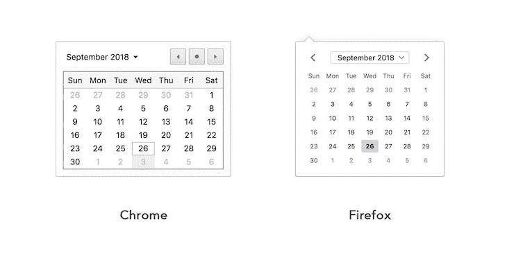
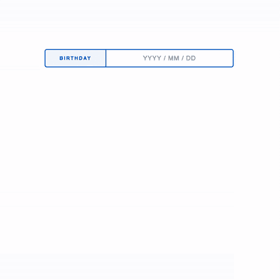
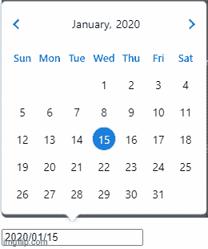
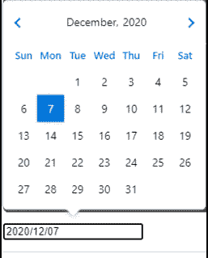

# React 自定义日期选择器:一步一步日志火箭博客

> 原文：<https://blog.logrocket.com/react-custom-datepicker-step-by-step/>

***编者按*** :本帖最后更新于 2022 年 2 月 1 日，以解决 React Hooks 的更新问题。

在 web 上看到包含一个或多个日期字段的表单是很常见的。无论是人的出生日期还是航班时刻表，您都希望确保用户提供有效的日期。日期选择器是一个有用的附加功能，可以显示日历和日期输入字段，使应用程序用户可以轻松安排活动或填写注册表单。

HTML5 引入了一个 [`date`输入类型](https://developer.mozilla.org/en-US/docs/Web/HTML/Element/input/date)来改进表单中的日期值。`date`输入类型向用户呈现了一个日期选择器，但是，这个日期选择器的外观在不同的浏览器中是不一致的。



对于用户来说，大多数主流浏览器都将`date`输入类型贬低为`text`输入，导致了用户界面的呈现和数据格式的问题。当用户输入基于文本的输入时，日期可能会出现格式问题。例如，对于全球使用的各种日期格式，缺少对用户的说明可能会导致处理数据的困难，从而导致在浏览器中显示错误消息。

在本文中，我们将通过使用原生 JavaScript `Date`对象从头构建一个自定义的 React datepicker 来解决这个问题。



要跟随本教程，您需要以下内容:

*   熟悉 JavaScript 和 React
*   安装在计算机上的 Node.js
*   机器上安装的纱线卷装管理器
*   在您的机器上创建全局安装的 React 应用程序

> 注意:如果您使用的是 NPM v 5.2 以上版本，那么您不需要安装 Create React App 作为全局依赖项。相反，您可以使用 npx 命令。

如果你在某个地方卡住了，可以随意看看 [GitHub 库](https://github.com/atharvadeosthale/date-picker-react)。我们开始吧！

### 目录

## 入门指南

### 创建新的 React 应用程序

首先，要创建一个新的 React 应用程序，运行下面的命令，这是创建自定义 React datepicker 的快速起点:

```
npx create-react-app react-datepicker
cd react-datepicker
npm start

```

或者，如果您使用 yarn，您可以运行下面的代码:

```
yarn create react-app react-datepicker

```

npx 在 npm v≥5.2 中可用，您可以使用它在您的机器上全局安装 Create React App。如果您已经使用下面的命令安装了 Create React App，您应该卸载它以确保 npx 使用的是最新版本:

```
npm install -g create-react-app

```

要卸载该软件包，可以使用以下命令之一:

```
//npm
npm uninstall -g create-react-app 
//yarn
yarn global remove create-react-app

```

### 安装依赖项

要通过 Yarn 安装所需的依赖项，请运行以下命令:

```
yarn add bootstrap reactstrap styled-components prop-types

```

要通过 npm 安装依赖项，只需将`--use-npm`附加到创建命令，如下所示:

```
npx create-react-app react-datepicker --use-npm

```

### 安装引导程序

为了提供默认样式，我们已经将引导包作为依赖项安装了[。要包含 Bootstrap v.4 样式，请编辑`src/index.js`文件，并在每隔一个导入语句之前添加以下行:](https://blog.logrocket.com/whats-new-bootstrap-5-1-0/)

```
import "bootstrap/dist/css/bootstrap.min.css";

```

## 设置目录组件

我们的应用程序需要以下两个组件:

1.  `calendar`:呈现自定义日历，提供日期选择功能
2.  `datepicker`:呈现一个`date`输入，并为用户提供日历以选择日期

我们将用两个文件`index.js`和`styles.js`将每个组件存储在它自己的目录中。`index.js`文件导出组件，而`styles.js`文件导出样式化组件，这是组件添加样式所需要的。

要创建组件目录和文件，请从项目的根目录运行以下命令:

```
# Create directories
mkdir -p src/components/Calendar src/components/Datepicker

# Create files
cd src/components/Calendar && touch index.js styles.js
cd src/components/Datepicker && touch index.js styles.js

```

我们的应用程序不需要任何外部依赖来处理日期。相反，我们将使用助手函数。要为日历`helpers`模块创建一个文件，运行以下命令:

```
mkdir -p src/helpers
touch src/helpers/calendar.js

```

### 启动应用程序

通过在终端中运行以下命令之一来启动应用程序:

```
//yarn
yarn start

//npm
npm start
```

现在，我们可以开始开发了。你会注意到，一个新的浏览器标签已经为你打开了实时重载功能，与应用程序中的变化保持同步。

## 日历`helpers`模块

在我们之前创建的 calendar `helpers`模块中，我们将定义一些助手和常量，我们将把它们导出为命名导出。将以下代码添加到`src/helpers/calendar.js`文件中:

```
// (int) The current year
export const THIS_YEAR = +(new Date().getFullYear());
// (int) The current month starting from 1 - 12
// 1 => January, 12 => December
export const THIS_MONTH = +(new Date().getMonth()) + 1;
// Week days names and shortnames
export const WEEK_DAYS = {
  Sunday: "Sun",
  Monday: "Mon",
  Tuesday: "Tue",
  Wednesday: "Wed",
  Thursday: "Thu",
  Friday: "Fri",
  Saturday: "Sat"
}
// Calendar months names and short names
export const CALENDAR_MONTHS = {
  January: "Jan",
  February: "Feb",
  March: "Mar",
  April: "Apr",
  May: "May",
  June: "Jun",
  July: "Jul",
  August: "Aug",
  September: "Sep",
  October: "Oct",
  November: "Nov",
  December: "Dec"
}
// Weeks displayed on calendar
export const CALENDAR_WEEKS = 6;
// Pads a string value with leading zeroes(0) until length is reached
// For example: zeroPad(5, 2) => "05"
export const zeroPad = (value, length) => {
  return `${value}`.padStart(length, '0');
}
// (int) Number days in a month for a given year from 28 - 31
export const getMonthDays = (month = THIS_MONTH, year = THIS_YEAR) => {
  const months30 = [4, 6, 9, 11];
  const leapYear = year % 4 === 0;
  return month === 2
    ? leapYear
      ? 29
      : 28
    : months30.includes(month)
      ? 30
      : 31;
}
// (int) First day of the month for a given year from 1 - 7
// 1 => Sunday, 7 => Saturday
export const getMonthFirstDay = (month = THIS_MONTH, year = THIS_YEAR) => {
  return +(new Date(`${year}-${zeroPad(month, 2)}-01`).getDay()) + 1;
}

```

像`Date.prototype`中的`getDay()`和`getMonth()`这样的方法通常返回一个从零开始的值。因此，作为一年的第一个月，一月是`0`，而十二月是`11`。一周的第一天，周日是`0`，周六是`7`。

在上面的代码片段中，您会看到`1`被添加到这些从零开始的值中。周日成为工作日的`1`，十二月成为一个月的`12`。

最后，注意`CALENDAR_WEEKS`被设置为`6`；因为一个月通常跨越四周，所以这样做可以让日历适应上个月的最后一周和下个月的第一周。

### 用于验证的其他助手

让我们通过添加一些额外的助手函数来改进我们的`calendar`组件。首先，我们将通过向`src/helpers/calendar.js`文件追加以下代码来验证`calendar`模块中的日期格式:

```
// (bool) Checks if a value is a date - this is just a simple check
export const isDate = date =&gt; {
  const isDate = Object.prototype.toString.call(date) === '[object Date]';
  const isValidDate = date && !Number.isNaN(date.valueOf());

  return isDate && isValidDate;
}
// (bool) Checks if two date values are of the same month and year
export const isSameMonth = (date, basedate = new Date()) => {
  if (!(isDate(date) && isDate(basedate))) return false;
  const basedateMonth = +(basedate.getMonth()) + 1;
  const basedateYear = basedate.getFullYear();
  const dateMonth = +(date.getMonth()) + 1;
  const dateYear = date.getFullYear();
  return (+basedateMonth === +dateMonth) && (+basedateYear === +dateYear);

}
// (bool) Checks if two date values are the same day
export const isSameDay = (date, basedate = new Date()) => {

  if (!(isDate(date) && isDate(basedate))) return false;
  const basedateDate = basedate.getDate();
  const basedateMonth = +(basedate.getMonth()) + 1;
  const basedateYear = basedate.getFullYear();
  const dateDate = date.getDate();
  const dateMonth = +(date.getMonth()) + 1;
  const dateYear = date.getFullYear();
  return (+basedateDate === +dateDate) && (+basedateMonth === +dateMonth) && (+basedateYear === +dateYear);

}
// (string) Formats the given date as YYYY-MM-DD
// Months and Days are zero padded
export const getDateISO = (date = new Date) => {

  if (!isDate(date)) return null;
  return [
    date.getFullYear(),
    zeroPad(+date.getMonth() + 1, 2),
    zeroPad(+date.getDate(), 2)
  ].join('-');

}
// ({month, year}) Gets the month and year before the given month and year
// For example: getPreviousMonth(1, 2000) => {month: 12, year: 1999}
// while: getPreviousMonth(12, 2000) => {month: 11, year: 2000}
export const getPreviousMonth = (month, year) => {
  const prevMonth = (month > 1) ? month - 1 : 12;
  const prevMonthYear = (month > 1) ? year : year - 1;
  return { month: prevMonth, year: prevMonthYear };
}
// ({month, year}) Gets the month and year after the given month and year
// For example: getNextMonth(1, 2000) => {month: 2, year: 2000}
// while: getNextMonth(12, 2000) => {month: 1, year: 2001}
export const getNextMonth = (month, year) => {
  const nextMonth = (month < 12) ? month + 1 : 1;
  const nextMonthYear = (month < 12) ? year : year + 1;
  return { month: nextMonth, year: nextMonthYear };
}

```

### 默认导出

接下来，我们将添加 calendar builder 函数，这是 calendar `helpers`模块的默认导出。calendar builder 函数将月份和年份作为参数，然后返回一个包含 42 个元素的数组，每个元素代表一个格式为`[YYYY, MM,DD]`的日历日期。

将下面的代码片段附加到`src/helpers/calendar.js`文件中:

```
// Calendar builder for a month in the specified year
// Returns an array of the calendar dates.
// Each calendar date is represented as an array => [YYYY, MM, DD]
export default (month = THIS_MONTH, year = THIS_YEAR) => {

  // Get number of days in the month and the month's first day

  const monthDays = getMonthDays(month, year);
  const monthFirstDay = getMonthFirstDay(month, year);
  // Get number of days to be displayed from previous and next months
  // These ensure a total of 42 days (6 weeks) displayed on the calendar

  const daysFromPrevMonth = monthFirstDay - 1;
  const daysFromNextMonth = (CALENDAR_WEEKS * 7) - (daysFromPrevMonth + monthDays);
  // Get the previous and next months and years

  const { month: prevMonth, year: prevMonthYear } = getPreviousMonth(month, year);
  const { month: nextMonth, year: nextMonthYear } = getNextMonth(month, year);
  // Get number of days in previous month
  const prevMonthDays = getMonthDays(prevMonth, prevMonthYear);
  // Builds dates to be displayed from previous month

  const prevMonthDates = [...new Array(daysFromPrevMonth)].map((n, index) => {
    const day = index + 1 + (prevMonthDays - daysFromPrevMonth);
    return [ prevMonthYear, zeroPad(prevMonth, 2), zeroPad(day, 2) ];
  });
  // Builds dates to be displayed from current month

  const thisMonthDates = [...new Array(monthDays)].map((n, index) => {
    const day = index + 1;
    return [year, zeroPad(month, 2), zeroPad(day, 2)];
  });
  // Builds dates to be displayed from next month

  const nextMonthDates = [...new Array(daysFromNextMonth)].map((n, index) => {
    const day = index + 1;
    return [nextMonthYear, zeroPad(nextMonth, 2), zeroPad(day, 2)];
  });
  // Combines all dates from previous, current and next months
  return [ ...prevMonthDates, ...thisMonthDates, ...nextMonthDates ];

}

```

返回的日历日期从上个月的最后一周到下个月的第一周。

## 构建`calendar`组件

现在我们有了日历`helpers`模块，让我们构建我们的 React `calendar`组件。将以下代码片段添加到`src/components/Calendar/index.js`文件中:

```
import React, { Component, Fragment, useEffect, useState } from "react";
import PropTypes from "prop-types";
import * as Styled from "./styles";
import calendar, {
  isDate,
  isSameDay,
  isSameMonth,
  getDateISO,
  getNextMonth,
  getPreviousMonth,
  WEEK_DAYS,
  CALENDAR_MONTHS,
} from "../../helpers/calendar";
export default function Calendar({ date, onDateChanged }) {
  const [dateState, setDateState] = useState({ current: 0, month: 0, year: 0 });
  const [today, setToday] = useState(new Date());
  useEffect(() => {
    addDateToState(date);
  }, []);
  const addDateToState = (date) => {
    const isDateObject = isDate(date);
    const _date = isDateObject ? date : new Date();
    setDateState({
      current: isDateObject ? date : null,
      month: +_date.getMonth() + 1,
      year: _date.getFullYear(),
    });
  };
  const getCalendarDates = () => {
    const { current, month, year } = dateState;
    const calendarMonth = month || +current.getMonth() + 1;
    const calendarYear = year || current.getFullYear();
    return calendar(calendarMonth, calendarYear);
  };
  return (
    <Styled.CalendarContainer>
      {renderMonthAndYear()}
      <Styled.CalendarGrid>
        <Fragment>{Object.keys(WEEK_DAYS).map(renderDayLabel)}</Fragment>
        <Fragment>{getCalendarDates().map(renderCalendarDate)}</Fragment>
      </Styled.CalendarGrid>
    </Styled.CalendarContainer>
  );
}
Calendar.propTypes = {
  date: PropTypes.instanceOf(Date),
  onDateChanged: PropTypes.func,
};

```

默认的日历导出，以及其他帮助函数和常量，都是从日历`helpers`模块导入的。calendar styles 模块的所有导出都是用名称空间`Styled`导入的。

目前，我们还没有创建任何样式，但我们将很快使用样式组件。使用`useState`钩子从 props 中部分解析组件状态，该钩子用包含以下内容的对象设置状态:

*   `current`:当前所选日期的`Date`对象或空
*   `month`:当前所选日期的月份，如果设置的话。否则，默认为当前日期的月份
*   `year`:当前所选日期的年份，如果设置的话。否则，默认为当前日期的年份

需要使用`month`和`year`状态属性来正确呈现日历，如`getCalendarDates()`方法所示，该方法使用日历构建器函数来构建月份和年份的日历。

最后，用`today`属性增加状态，这是当前日期的一个`Date`对象。

### 呈现部分`calendar`组件

在前面的`calendar`组件代码片段中，`renderer`部分引用了呈现月份、年份、工作日和日历日期的方法。我们将这些方法添加到`calendar`组件中，如下所示:

```
let pressureTimer, pressureTimeout; 

const renderMonthAndYear = () => {
    const { month, year } = dateState;
    // Resolve the month name from the CALENDAR_MONTHS object map
    const monthname =
      Object.keys(CALENDAR_MONTHS)[Math.max(0, Math.min(month - 1, 11))];
    return (
      <Styled.CalendarHeader>
        <Styled.ArrowLeft
          onMouseDown={handlePrevious}
          onMouseUp={clearPressureTimer}
          title="Previous Month"
        />
        <Styled.CalendarMonth>
          {monthname} {year}
        </Styled.CalendarMonth>
        <Styled.ArrowRight
          onMouseDown={handleNext}
          onMouseUp={clearPressureTimer}
          title="Next Month"
        />
      </Styled.CalendarHeader>
    );
  };
  // Render the label for day of the week
  // This method is used as a map callback as seen in render()
  const renderDayLabel = (day, index) => {
    // Resolve the day of the week label from the WEEK_DAYS object map
    const daylabel = WEEK_DAYS[day].toUpperCase();
    return (
      <Styled.CalendarDay key={daylabel} index={index}>
        {daylabel}
      </Styled.CalendarDay>
    );
  };
  // Render a calendar date as returned from the calendar builder function
  // This method is used as a map callback as seen in render()
  const renderCalendarDate = (date, index) => {
    const { current, month, year } = dateState;
    const _date = new Date(date.join("-"));
    // Check if calendar date is same day as today
    const isToday = isSameDay(_date, today);
    // Check if calendar date is same day as currently selected date
    const isCurrent = current && isSameDay(_date, current);
    // Check if calendar date is in the same month as the state month and year
    const inMonth =
      month && year && isSameMonth(_date, new Date([year, month, 1].join("-")));
    // The click handler
    const onClick = this.gotoDate(_date);
    const props = { index, inMonth, onClick, title: _date.toDateString() };
    // Conditionally render a styled date component
    const DateComponent = isCurrent
      ? Styled.HighlightedCalendarDate
      : isToday
      ? Styled.TodayCalendarDate
      : Styled.CalendarDate;
    return (
      <DateComponent key={getDateISO(_date)} {...props}>
        {_date.getDate()}
      </DateComponent>
    );
  };

```

在`renderMonthAndYear()`方法中，首先从`CALENDAR_MONTHS`对象中解析出月份的名称。然后，它被呈现在年份旁边，在左侧和右侧有两个用于导航的箭头控件。

每个箭头控件都有针对`mousedown`和`mouseup`事件的事件处理程序，我们稍后将它们定义为`handlePrevious()`、`handleNext()`和`clearPressureTimer()`。添加了一些样式后，`renderMonthAndYear()`方法呈现的 DOM 看起来像下面的截图:


`renderDayLabel()`方法呈现一周中某一天的标签，这是从`WEEK_DAYS`对象中解析出来的。它有两个参数，day 和 index，因为它被用作对`.map()`的回调函数，正如在`render()`方法中看到的。

映射后，一周中各天的渲染 DOM 如下图所示:


`renderCalendarDate()`方法也被用作`.map()`回调函数，并呈现日历日期。它作为第一个参数接收的日期的格式是`[YYYY, MM, DD]`。

`renderCalendarDate()`方法检查日期是否与今天的日期相同，包括当前状态的月份和年份。通过这些检查，它有条件地呈现日历日期单元格的一个变体，`HiglightedCalendarDate`、`TodayCalendarDate`或`CalendarDate`。

对于每个呈现的日历日期，使用`gotoDate()`方法设置一个`onClick`处理程序来跳转到该特定日期，我们将在下一节中定义该方法。

### 基本附加`calendar`组件

让我们为我们的`calendar`组件添加一些定制。例如，我们将添加一个按钮，如下所示:

```
import DatePicker from "react datepicker";
import Button from "react datepicker/components/button";
export default function Example() {
  return (
    <DatePicker 
      render={<Button/>}
    />
  )
}

```

我们可以用下面的代码设置一个`input`图标:

```
import DatePicker from "react datepicker"
import InputIcon from "react datepicker/components/input_icon"
export default function Example() {
  return (
    <DatePicker 
      render={<InputIcon/>}
    />
  )
}

```

让我们添加一个特性，在`date`值改变时向用户发出指示。为此，我们将把`handleValueChange`传递给`onChange`:

```
import DatePicker from "react datepicker"
export default function Example() {
  return (
    <DatePicker
      render={<CustomInput />}
    />
  )
}
function CustomInput({ openCalendar, value, handleValueChange }) {
  return (
    <input
      onFocus={openCalendar}
      value={value}
      onChange={handleValueChange}
    />
  )
}

```

使用上面的代码，当选定的日期被更改时，用户将看到如下内容:



最后，让我们为用户添加在特定范围内选择日期的功能:

```
export default function Example() {
  return (
    <DatePicker
      range
      eachDaysInRange
      render={<CustomRangeInput />}
    />

  )
}

function CustomRangeInput({openCalendar, value}) {
  let from = value[0] || ""
  let to = value[1] || ""

  value = from && to ? "from " + from + ", to " + to : from 
  return (
    <input
      onFocus={openCalendar}
      value={value}
      readOnly />    
)}

```



这些只是一些自定义组件，您可以将它们添加到您的应用程序中，以改进您的整体 UI。

### 事件处理程序

在前面的章节中，我们已经多次引用了事件处理程序。继续更新`calendar`组件，为事件处理程序添加以下代码片段:

```
const gotoDate = (date) => (evt) => {
    evt && evt.preventDefault();
    const { current } = dateState;
    !(current && isSameDay(date, current)) && addDateToState(date);
    onDateChanged(date);
  };
  const gotoPreviousMonth = () => {
    const { month, year } = dateState;
    const previousMonth = getPreviousMonth(month, year);
    setDateState({
      month: previousMonth.month,
      year: previousMonth.year,
      current: dateState.current,
    });
  };
  const gotoNextMonth = () => {
    const { month, year } = dateState;
    const nextMonth = getNextMonth(month, year);
    setDateState({
      month: nextMonth.month,
      year: nextMonth.year,
      current: dateState.current,
    });
  };
  const gotoPreviousYear = () => {
    const { year } = dateState;
    setDateState({
      month: dateState.month,
      year: year - 1,
      current: dateState.current,
    });
  };
  const gotoNextYear = () => {
    const { year } = dateState;
    setDateState({
      month: dateState.month,
      year: year + 1,
      current: dateState.current,
    });
  };
  const handlePressure = (fn) => {
    if (typeof fn === "function") {
      fn();
      pressureTimeout = setTimeout(() => {
        pressureTimer = setInterval(fn, 100);
      }, 500);
    }
  };
  const clearPressureTimer = () => {
    pressureTimer && clearInterval(pressureTimer);
    pressureTimeout && clearTimeout(pressureTimeout);
  };
  const handlePrevious = (evt) => {
    evt && evt.preventDefault();
    const fn = evt.shiftKey ? gotoPreviousYear : gotoPreviousMonth;
    handlePressure(fn);
  };
  const handleNext = (evt) => {
    evt && evt.preventDefault();
    const fn = evt.shiftKey ? gotoNextYear : gotoNextMonth;
    handlePressure(fn);
  };

```

`gotoDate()`方法是一个高阶函数，它将一个`Date`对象作为它的参数。它返回一个事件处理程序，可以触发该事件处理程序来更新状态中当前选定的日期。`addStateToDate()`用于从日期中解析月和年，并更新状态。

如果一个回调函数被传递给`calendar`组件的`onDateChanged`属性，那么这个函数将会被更新的日期调用。如果您想将日期更改传播到父组件，这个特性尤其有用。

`handlePrevious()`和`handleNext()`事件处理程序有相似的行为。默认情况下，它们在几个月中循环。然而，如果按下 **shift 键**，事件处理程序将会以年为单位进行循环。

最后，他们将控制权交给了`handlePressure()`方法。`handlePressure()`方法简单地使用定时器来模拟快速循环几个月或几年的压力点击，而`clearPressureTimer()`方法清除这些定时器。

### 组件生命周期挂钩

当我们开始包装我们的`calendar`组件时，让我们添加一些生命周期方法:

```
useEffect(() => {
    const now = new Date();
    const tomorrow = new Date().setHours(0, 0, 0, 0) + 24 * 60 * 60 * 1000;
    const ms = tomorrow - now;
    dayTimeout = setTimeout(() => {
      setToday(new Date());
      clearDayTimeout();
    }, ms);
    return () => {
      clearPressureTimer();
      clearDayTimeout();
    };
  }, []);

const clearDayTimeout = () => {
    dayTimeout && clearTimeout(dayTimeout);
  };

```

在`useEffect()`钩子中，我们有一个`day`计时器，它被设置为在当天结束后自动将`today`状态属性更新到第二天。在卸载组件之前，所有计时器都被清除，如 return 语句所示。

## 设计日历

组件完成后，让我们添加样式化组件进行样式化。将以下代码片段添加到`src/components/Calendar/styles.js`文件中:

```
import styled from 'styled-components';
export const Arrow = styled.button`
  appearance: none;
  user-select: none;
  outline: none !important;
  display: inline-block;
  position: relative;
  cursor: pointer;
  padding: 0;
  border: none;
  border-top: 1.6em solid transparent;
  border-bottom: 1.6em solid transparent;
  transition: all .25s ease-out;
`;
export const ArrowLeft = styled(Arrow)`
  border-right: 2.4em solid #ccc;
  left: 1.5rem;
  :hover {
    border-right-color: #06c;
  }
`;
export const ArrowRight = styled(Arrow)`
  border-left: 2.4em solid #ccc;
  right: 1.5rem;
  :hover {
    border-left-color: #06c;
  }
`;
export const CalendarContainer = styled.div`
  font-size: 5px;
  border: 2px solid #06c;
  border-radius: 5px;
  overflow: hidden;
`;
export const CalendarHeader = styled.div`
  display: flex;
  align-items: center;
  justify-content: space-between;
`;
export const CalendarGrid = styled.div`
  display: grid;
  grid-template: repeat(7, auto) / repeat(7, auto);
`;
export const CalendarMonth = styled.div`
  font-weight: 500;
  font-size: 5em;
  color: #06c;
  text-align: center;
  padding: 0.5em 0.25em;
  word-spacing: 5px;
  user-select: none;
`;
export const CalendarCell = styled.div`
  text-align: center;
  align-self: center;
  letter-spacing: 0.1rem;
  padding: 0.6em 0.25em;
  user-select: none;
  grid-column: ${props => (props.index % 7) + 1} / span 1;
`;
export const CalendarDay = styled(CalendarCell)`
  font-weight: 600;
  font-size: 2.25em;
  color: #06c;
  border-top: 2px solid #06c;
  border-bottom: 2px solid #06c;
  border-right: ${props => (props.index % 7) + 1 === 7 ? `none` : `2px solid #06c`};
`;
export const CalendarDate = styled(CalendarCell)`
  font-weight: ${props => props.inMonth ? 500 : 300};
  font-size: 4em;
  cursor: pointer;
  border-bottom: ${props => ((props.index + 1) / 7) <= 5 ? `1px solid #ddd` : `none`};
  border-right: ${props => (props.index % 7) + 1 === 7 ? `none` : `1px solid #ddd`};
  color: ${props => props.inMonth ? `#333` : `#ddd`};
  grid-row: ${props => Math.floor(props.index / 7) + 2} / span 1;
  transition: all .4s ease-out;
  :hover {
    color: #06c;
    background: rgba(0, 102, 204, 0.075);
  }
`;
export const HighlightedCalendarDate = styled(CalendarDate)`
  color: #fff !important;
  background: #06c !important;
  position: relative;
  ::before {
    content: '';
    position: absolute;
    top: -1px;
    left: -1px;
    width: calc(100% + 2px);
    height: calc(100% + 2px);
    border: 2px solid #06c;
  }
`;
export const TodayCalendarDate = styled(HighlightedCalendarDate)`
  color: #06c !important;
  background: transparent !important;
  ::after {
    content: '';
    position: absolute;
    right: 0;
    bottom: 0;
    border-bottom: 0.75em solid #06c;
    border-left: 0.75em solid transparent;
    border-top: 0.75em solid transparent;
  }
  :hover {
    color: #06c !important;
    background: rgba(0, 102, 204, 0.075) !important;
  }
`;

```

现在，当您在应用程序中渲染`calendar`组件时，它将看起来像下面的截图:


## 自定义反应`datepicker`组件

要开始构建我们的`datepicker`组件，将下面的代码片段添加到`src/components/Datepicker/index.js`文件中:

```
import React from "react";
import PropTypes from "prop-types";
import Calendar from "../Calendar";
import * as Styled from "./styles";
import { isDate, getDateISO } from "../../helpers/calendar";
import { useEffect } from "react/cjs/react.development";
export default function Datepicker(props) {
  const [dateState, setDateState] = useState(null);
  const [calendarOpen, setCalendarOpen] = useState(false);
const { label } = this.props;
  const toggleCalendar = () => setCalendarOpen(!calendarOpen);
  const handleChange = (evt) => evt.preventDefault();
  const handleDateChange = (date) => {
    const newDate = date ? getDateISO(date) : null;
    dateState !== newDate &&
      setDateState(newDate) &&
      setCalendarOpen(false) &&
      props.onDateChanged(dateState);

  };
  useEffect(() => {
    const newDate = props.value && new Date(props.value);
    isDate(newDate) && setDateState(getDateISO(newDate));
  }, []);
  useEffect(() => {
    const dateISO = getDateISO(new Date(date));
    setDateState(dateISO);
  }, [props]);
}
Datepicker.propTypes = {
  label: PropTypes.string,
  value: PropTypes.string,
  onDateChanged: PropTypes.func,
};

```

组件状态用两个属性初始化:

*   `date`:当前日期的 ISO 字符串表示，格式为`"YYYY-MM-DD"`
*   `calendarOpen`:布尔标志，表示日期选择器日历是否可见

当组件挂载时，`Date`对象从传递给组件的值属性中解析出来，然后更新状态，如在`useEffect()`函数中看到的。

`handleDateChange()`方法将一个`Date`对象作为其参数，并更新状态中的日期。如果一个回调函数被传递给`datepicker`组件的`onDateChanged`属性，那么这个函数将被更新的 ISO 日期字符串调用。

### 呈现日期选择器

值得一提的是，Bootstrap dropdown 组件将用于模拟我们的自定义 datepicker 的下拉效果，这是在我们的项目中添加 [Reactstrap](https://reactstrap.github.io/?path=/story/home-installation--page) 包作为依赖项的主要目的。datepicker 中呈现的样式化组件是 Reactstrap 中下拉组件的样式化扩展。

更新`datepicker`组件以包含`render()`方法，如下面的代码片段所示:

```
return (
    <Styled.DatePickerContainer>
      <Styled.DatePickerFormGroup>
        <Styled.DatePickerLabel>{label || "Enter Date"}</Styled.DatePickerLabel>
        <Styled.DatePickerInput
          type="text"
          value={dateState ? dateState.split("-").join(" / ") : ""}
          onChange={handleChange}
          readOnly="readonly"
          placeholder="YYYY / MM / DD"
        />
      </Styled.DatePickerFormGroup>
      <Styled.DatePickerDropdown isOpen={calendarOpen} toggle={toggleCalendar}>
        <Styled.DatePickerDropdownToggle color="transparent" />
        <Styled.DatePickerDropdownMenu>
          {calendarOpen && (
            <Calendar
              date={dateState && new Date(dateState)}
              onDateChanged={handleDateChange}
            />
          )}
        </Styled.DatePickerDropdownMenu>
      </Styled.DatePickerDropdown>
    </Styled.DatePickerContainer>
  );

```

`Styled.DatePickerFormGroup`组件是一个引导程序`.form-group`，它包装了`datepicker`标签和`input`字段。需要注意的是，输入字段是`"text"`类型，标记为`readonly`，所以不能直接编辑。另请注意，输入元素上 change 事件的默认行为已被阻止。

`Styled.DatePickerDropdown`组件及其后代是 Reactstrap 包中 dropdown 组件的样式扩展。

最后，`calendar`组件呈现在下拉菜单中，传递来自状态的日期和作为`onDateChanged`道具回调函数的`handleDateChange()`方法。

组件`datepicker`的最终呈现的 DOM 应该看起来像下面的截图，并带有一些样式:


## 设置日期选择器的样式

将以下代码片段添加到`src/components/Datepicker/styles.js`文件中，以创建 datepicker 所需的样式化组件:

```
import styled from 'styled-components';
import { FormGroup, Label, Input, Dropdown, DropdownToggle, DropdownMenu } from 'reactstrap';
export const DatePickerContainer = styled.div`
  position: relative;
`;
export const DatePickerFormGroup = styled(FormGroup)`
  display: flex;
  justify-content: space-between;
  position: relative;
  width: 100%;
  border: 2px solid #06c;
  border-radius: 5px;
  overflow: hidden;
`;
export const DatePickerLabel = styled(Label)`
  margin: 0;
  padding: 0 2rem;
  font-weight: 600;
  font-size: 0.7rem;
  letter-spacing: 2px;
  text-transform: uppercase;
  color: #06c;
  border-right: 2px solid #06c;
  display: flex;
  align-items: center;
  justify-content: center;
  background: rgba(0, 102, 204, 0.05);
`;
export const DatePickerInput = styled(Input)`
  padding: 1rem 2rem;
  font-weight: 500;
  font-size: 1rem;
  color: #333;
  box-shadow: none;
  border: none;
  text-align: center;
  letter-spacing: 1px;
  background: transparent !important;
  display: flex;
  align-items: center;
  ::placeholder {
    color: #999;
    font-size: 0.9rem;
  }
`;
export const DatePickerDropdown = styled(Dropdown)`
  position: absolute;
  width: 100%;
  height: 100%;
  top: 0;
  left: 0;
`;
export const DatePickerDropdownToggle = styled(DropdownToggle)`
  position: relative;
  width: 100%;
  height: 100%;
  background: transparent;
  opacity: 0;
  filter: alpha(opacity=0);
`;
export const DatePickerDropdownMenu = styled(DropdownMenu)`
  position: absolute;
  top: 0;
  left: 0;
  width: 100%;
  border: none;
  padding: 0;
  margin: 0;
  transform: none !important;
`;

```

## `app`组件

最后，更新`src/App.js`文件，看起来像下面的代码片段:

```
import logo from "./logo.svg";
import "./App.css";

function App() {
  return (
    <div className="App">

    </div>
  );
}
export default App;

```

如果您阅读了本文，那么您应该在 React 应用程序中呈现了一个可工作的自定义日期选择器。现在，在`app`组件中渲染它:

```
import "./App.css";
import Datepicker from "./components/Datepicker";
function App() {
  return (
    <div className="App">
      <Datepicker label="Datepicker advanced" />
    </div>
  );
}
export default App;

```

## 结论

在本教程中，我们介绍了如何在 React 中设置一个健壮且有吸引力的 datepicker，作为原生 HTML5 `datepicker` input 元素的替代。使用简单的日期选择器，用户不太可能错误地设置日期输入的格式，从而提高了提供给应用程序的信息的质量。

您可以根据自己的意愿定制和升级本教程中的 datepicker，使其最适合您的应用程序。我希望你喜欢这篇文章，快乐编码！

## 使用 LogRocket 消除传统反应错误报告的噪音

[LogRocket](https://lp.logrocket.com/blg/react-signup-issue-free)

是一款 React analytics 解决方案，可保护您免受数百个误报错误警报的影响，只针对少数真正重要的项目。LogRocket 告诉您 React 应用程序中实际影响用户的最具影响力的 bug 和 UX 问题。

[ ](https://lp.logrocket.com/blg/react-signup-general) [  ](https://lp.logrocket.com/blg/react-signup-general) [LogRocket](https://lp.logrocket.com/blg/react-signup-issue-free)

自动聚合客户端错误、反应错误边界、还原状态、缓慢的组件加载时间、JS 异常、前端性能指标和用户交互。然后，LogRocket 使用机器学习来通知您影响大多数用户的最具影响力的问题，并提供您修复它所需的上下文。

关注重要的 React bug—[今天就试试 LogRocket】。](https://lp.logrocket.com/blg/react-signup-issue-free)