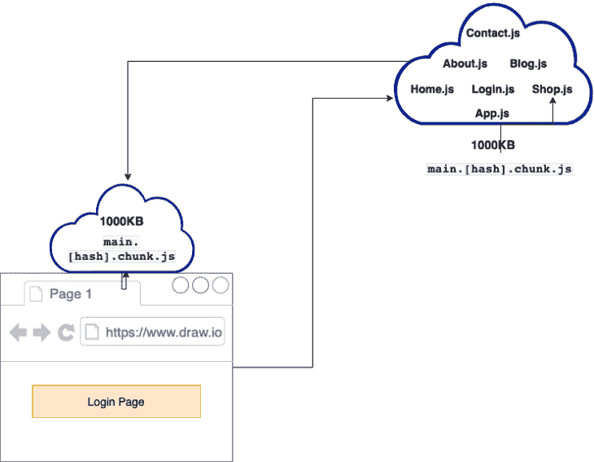

# React 动态导入和以路由为中心的代码分割

> 原文：<https://blog.logrocket.com/react-dynamic-imports-route-centric-code-splitting-guide/>

***编者按:**这篇文章于 2022 年 3 月 21 日更新，包含了关于可加载组件和 React 路由器最新版本的信息。*

性能优化对于每个开发人员来说都是一个重要的软件开发里程碑。在投入大量时间编写优秀的代码、添加功能、忍受冗长的调试部分，以及最终完成我们的杰作之后，我们接下来选择我们最喜欢的托管服务，并将应用程序部署到云中。

但是，一旦我们尝试托管和导航应用程序，我们会立即注意到加载时间很长，这意味着应用程序慢得令人难以置信。此时，我们已经到达了性能优化的里程碑。

作为开发人员，我们可以在人类已知的最胖的服务器上开发我们的应用程序:localhost。在 localhost 上开发时，我们很容易遇到任何性能问题，但这是因为生产和开发之间存在差异。

在本地服务器上开发时，我们所有的文件都托管在我们计算机的端口上。在 React 中，端口默认设置为`3000`。因为当我们使用本地服务器时，互联网连接并不重要，所以我们可以非常快地下载我们所有的文件和 JavaScript 包。

然而，一旦我们上线，下载大文件和 JavaScript 包可能会成为一个大问题，尤其是在可能没有高速互联网的地方。React 使用了几种性能优化技术和技巧。在本文中，我们将看看如何使用以路由为中心的[代码分割](https://reactjs.org/docs/code-splitting.html)来提高性能。

## **代码拆分的好处**

使用 create-react-app 的一个很大的好处是，它给了我们现成的代码拆分和分块。组块允许我们将代码分成包，包是打包成单个文件的一组相关的组块。 [Create React App](https://github.com/facebook/create-react-app) 、 [Gatsby](https://www.gatsbyjs.com/) 、 [Next.js](https://nextjs.org/) 等工具使用 [webpack](https://webpack.js.org/) 捆绑应用。像 webpack 这样的捆绑器导入所有的应用程序文件，并将它们合并成一个包。

这样做的一些优点是:

*   允许用户的浏览器下载整个应用程序一次，这样他们就可以无缝导航，而不需要另一个 HTTP 请求
*   浏览器不需要要求或导入任何其他文件，因为它们都在包中。虽然捆绑通常很有帮助，但随着应用程序的增长，应用程序捆绑包可能会变得非常大，这意味着它会影响应用程序的加载时间

对于最佳实践，web 开发人员将大的包代码分割成较小的包，因为这使他们能够按需延迟加载文件，并提高 React 应用程序的性能。

以下是 React 应用程序的生产版本片段:


我们可以通过运行构建脚本`npm run build`或`yarn build`来创建一个生产构建——分别是`build/static/js`和`build/static/css`目录中的`.js`和`.css`文件。

从图像中，我们可以看到文件被分成不同的块。[创建 React 应用](https://create-react-app.dev)通过`[SplitChunksPlugin]([https://webpack.js.org/plugins/split-chunks-plugin/](https://webpack.js.org/plugins/split-chunks-plugin/))` webpack 插件实现了这一点。让我们分解上面显示的代码:

1.  代表我们的应用程序需要的所有 CSS 代码。注意，即使你使用类似于[样式组件](https://styled-components.com/)的东西用 JavaScript 编写 CSS，它仍然会编译成 CSS
2.  代表我们的应用程序中使用的所有库。它实际上是从`node_modules`文件夹中导入的所有供应商代码
3.  `Main.[hash].chunk.js`是我们所有的申请文件(Contact.js，About.js 等。).它代表了我们为 React 应用程序编写的所有代码
4.  代表一个小的 webpack 运行时逻辑，用于加载和运行我们的应用程序。默认情况下，其内容位于 build/index.html 文件中

然而，即使我们的生产结构得到优化，仍有改进的空间。
考虑以下图像:



Code spitting optimized production build.

虽然我们可以创建一个生产版本，并按原样部署应用程序，但上面的图片显示它可以进一步优化。

从图像中，我们看到`main.[hash].chunk.js`包含了我们所有的应用程序文件，大小为 1000kB。我们还可以看到，当用户访问登录页面时，浏览器会下载整个 1000kB 的数据块。这个块包含用户可能永远不需要的代码。因此，如果登录页面为 2kB，用户必须加载 1000kB 的数据块才能查看 2kB 的页面。

因为`main.[hash].chunk.js`的大小随着我们的应用程序的增长而增加，更大的应用程序的大小可能会超过 1000kB，这意味着我们的应用程序加载时间可能会大幅增加——如果用户的互联网速度很差，它的执行速度甚至会更慢。这就是我们需要进一步优化的原因。

对此的解决方案是将`main.[hash].chunk.js`分割成更小的块，这确保当用户访问我们的页面时，他们只下载他们需要的代码块。在这个例子中，用户的浏览器应该只加载登录块。

通过这样做，我们将显著减少用户在应用程序初始加载期间下载的代码数量，并提升应用程序的性能。让我们在下一节看看如何实现代码分割。

## **实现以路由为中心的代码拆分**

为了实现代码分割，我们将结合 JavaScript 和 React 的特性。让我们来看看下面的技巧:

### 动态导入

这是一个现代的 JavaScript 特性，它像承诺一样导入我们的文件。

之前:

```
import Login from "Pages/Login.js";
import Home from "Pages/Home.js";
import About from "Pages/About.js";
import Contact from "Pages/Contact.js";
import Blog from "Pages/Blog.js";
import Shop from "Pages/Shop.js";

```

上面的代码片段使用静态导入来导入我们的文件。当 webpack 遇到这种语法时，它会将所有文件捆绑在一起。这是因为我们想静态地将它们包含在一起。

之后:

```
const module = await import('/modules/myCustomModule.js');

```

与同步的静态导入不同，动态导入是异步的。这使我们能够按需导入我们的模块和文件。一旦 webpack 遇到这种语法，它会立即开始对我们的应用程序进行代码拆分。

### `React.lazy()`

这个 React 组件是一个将另一个函数作为参数的函数。该参数调用动态导入并返回一个承诺。`React.lazy()`处理这个承诺，并期望它返回一个包含`defaultexport` React 组件的模块。

之前:

```
import Login from "Pages/Login.js";
/pre>
```

之后:

登录页面现在是延迟加载的，确保了`Login.js`块仅在呈现时才被加载。

```
import React, {lazy} from "react";
const Login = lazy(()=> import("Pages/Login"));

```

`React.Suspense()`

### 允许我们有条件地暂停一个组件的渲染，直到它被加载。它有一个接受 React 元素的后备属性。React 元素可以是 JSX 代码片段，也可以是完整的组件。

更多来自 LogRocket 的精彩文章:

* * *

### 当用户访问使用动态导入的页面时，他们可能会在应用程序加载模块时看到一个空白屏幕。由于动态导入是异步的，有时用户甚至会得到一个错误。如果用户的互联网连接速度较慢，这种可能性就会增加。

* * *

`React.lazy()`和`React.suspense()`一起使用来解决这个问题。

虽然`React.Suspense`会暂停组件的呈现，直到它的所有依赖项都被延迟加载，但它也会显示传递给`fallback props`的 React 元素作为后备 UI。

考虑下面的代码:

这里，我们延迟加载`hero`和`service`组件。这些都是`home component`的属地。它需要他们展示一个完整的主页。

```
import React, { lazy, Suspense } from 'react';

const Hero = lazy(() => import('./Components/Hero'));
const Service = lazy(() => import('./Component/Service'));

const Home = () => {
  return (
    <div>
      <Suspense fallback={<div>Page is Loading...</div>}>
        <section>
          <Hero /> 
          <Service />
        </section>
      </Suspense>
    </div>
  );
}

```

我们使用`suspense component`来暂停`home component`的渲染，直到依赖项被延迟加载，这样当用户导航到主页时就不会出现错误或空白页面。

现在，当组件被延迟加载时，用户使用下面的回退 UI:

反应路由器

```
<div>Page is Loading...</div>

```

### 选择在应用程序中何处实现代码拆分可能会有问题。在不影响用户体验的情况下，选择能够均匀分割包的位置非常重要。

路线是一个很好的起点。

`react-router-dom`库支持内置的路由级代码分割。它允许我们在路由级别下载块。使用这个特性，我们将在路由级别进行代码拆分，这非常有帮助。

考虑下面的代码:

从这个代码示例中，我们使用`react-router-router`库设置了我们的路线，并且`Dashboard`和`Notifications`组件是延迟加载的。

```
import { lazy, Suspense } from "react";
import { Routes, Route, Outlet, Link } from "react-router-dom";

import HomePage from "./pages/Home";

const Dashboard = lazy(() => import("./pages/Dashboard"));
const Notifications = lazy(() => import("./pages/Notifications"));

export default function App() {
  return (
    <div className="App">
      <h1>React Router Code Splitting Demo</h1>
      <Routes>
        <Route path="/" element={<AppLayout />}>
          <Route index element={<HomePage />} />
          <Route path="dashboard" element={<DashboardPage />} />
          <Route path="notifications" element={<NotificationsPage />} />
        </Route>
      </Routes>
    </div>
  );
}

const DashboardPage = () => (
  <Suspense fallback={<div>Page is Loading...</div>}>
    <Dashboard />
  </Suspense>
);

const NotificationsPage = () => (
  <Suspense fallback={<div>Page is Loading...</div>}>
    <Notifications />
  </Suspense>
);

const AppLayout = () => {
  return (
    <div>
      <nav>
        <ul>
          <li>
            <Link to="/">Home</Link>
          </li>
          <li>
            <Link to="/dashboard">Dashboard</Link>
          </li>
          <li>
            <Link to="/notifications">Notifications</Link>
          </li>
        </ul>
      </nav>
      <hr />
      <Outlet />
    </div>
  );
};

```

注意`Dashboard`和`Notifications`组件是如何与`Suspense`组件封装在一起的。这确保了在延迟加载所请求的页面组件时，向用户呈现回退 UI。

由于我们的设置，webpack 提前将我们的代码分块。因此，用户只接收按需呈现页面所需的块。例如，当用户访问通知页面时，用户会收到`Notifications``.js`块，当用户访问仪表板页面时，他们会看到`Dashboard``.js`块。

演示的完整代码和工作示例都可以在[这个代码沙箱](https://codesandbox.io/s/blazing-morning-3m7tst)中找到。

您可以看到，我们已经显著减少了应用程序的初始加载时间，甚至没有减少应用程序中的代码量。

此外，如果您有兴趣了解 React Router v6 的更多信息，您可以查看本指南。

可加载组件

### 您还可以使用[可加载组件](https://loadable-components.com/)库来动态加载页面组件。

`loadable()`函数用于创建一个可以动态导入的异步组件。它与`React.lazy()`相似，但另外它可以接受`fallback`,而不需要`Suspense`组件。`loadable()`功能还可以从组件中注入道具，支持完全动态导入。

你可以在这个[代码沙箱链接](https://codesandbox.io/s/react-router-code-splitting-with-loadable-components-5mqf4n)中找到`loadable``()`组件的演示。

```
import { Routes, Route, Outlet, Link } from "react-router-dom";
import loadable from "@loadable/component";

import HomePage from "./pages/Home";

const LoadablePage = loadable((props) => import(`./pages/${props.page}`), {
  fallback: <div>Page is Loading...</div>,
  cacheKey: (props) => props.page
});

export default function App() {
  return (
    <div className="App">
      <h1>React Router Code Splitting Demo</h1>
      <Routes>
        <Route path="/" element={<AppLayout />}>
          <Route index element={<HomePage />} />
          <Route path="dashboard" element={<LoadablePage page="Dashboard" />} />
          <Route
            path="notifications"
            element={<LoadablePage page="Notifications" />}
          />
        </Route>
      </Routes>
    </div>
  );
}

```

请注意，`loadable``()`组件库不是`React.lazy()`和`React.Suspense`的替代品，应该只在你觉得受限或者需要服务器端渲染支持的情况下使用。你可以查看这本[比较指南](https://loadable-components.com/docs/loadable-vs-react-lazy/)了解详细信息。

**结论**

## 在本文中，我们解释了什么是以路由为中心的代码分割，以及为什么使用它会有帮助。我们还讨论了利用动态导入、`React.lazy()`、`React.Suspense`、React 路由器和可加载组件来创建性能更好的 React 应用程序。

使用 LogRocket 消除传统反应错误报告的噪音

## 是一款 React analytics 解决方案，可保护您免受数百个误报错误警报的影响，只针对少数真正重要的项目。LogRocket 告诉您 React 应用程序中实际影响用户的最具影响力的 bug 和 UX 问题。

[LogRocket](https://lp.logrocket.com/blg/react-signup-issue-free)

自动聚合客户端错误、反应错误边界、还原状态、缓慢的组件加载时间、JS 异常、前端性能指标和用户交互。然后，LogRocket 使用机器学习来通知您影响大多数用户的最具影响力的问题，并提供您修复它所需的上下文。

[ ](https://lp.logrocket.com/blg/react-signup-general) [  ](https://lp.logrocket.com/blg/react-signup-general) [LogRocket](https://lp.logrocket.com/blg/react-signup-issue-free)

关注重要的 React bug—[今天就试试 LogRocket】。](https://lp.logrocket.com/blg/react-signup-issue-free)

Focus on the React bugs that matter — [try LogRocket today](https://lp.logrocket.com/blg/react-signup-issue-free).