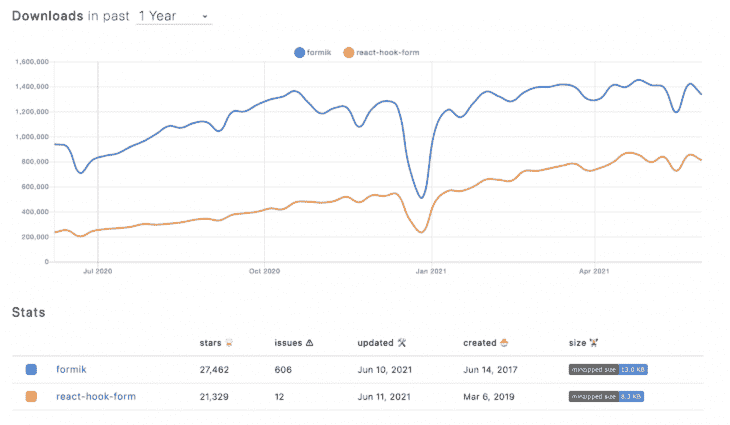
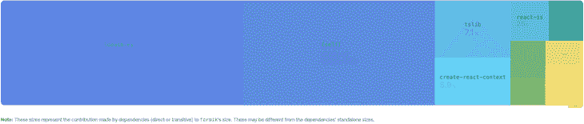
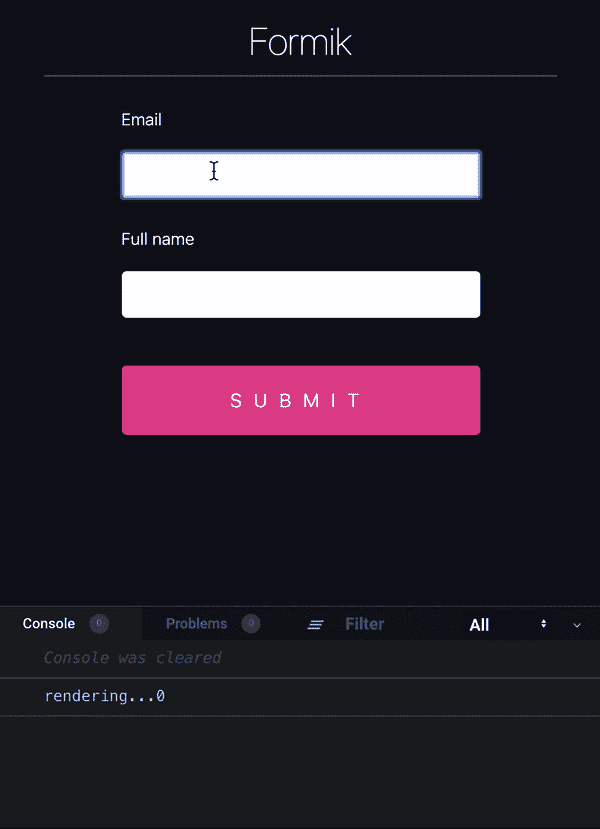
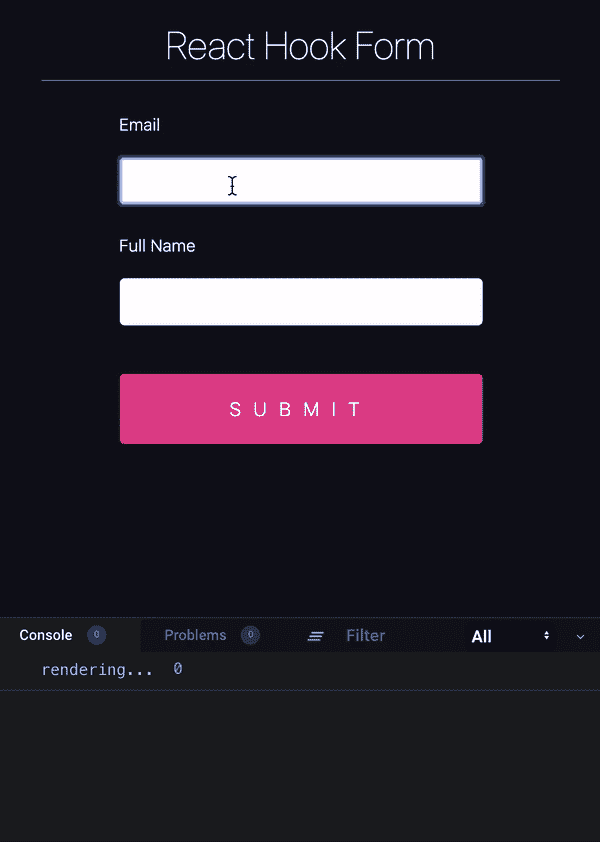
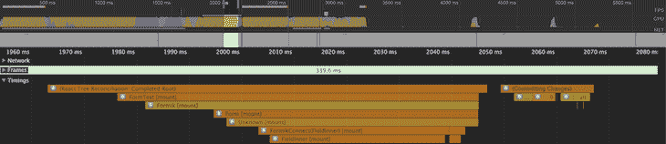
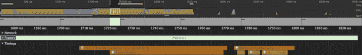
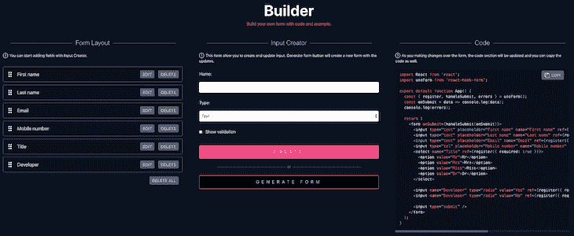

# React Hook Form 与 Formik:技术和性能比较

> 原文：<https://blog.logrocket.com/react-hook-form-vs-formik-comparison/>

***编者按:**这篇文章在 2021 年 7 月更新，以反映 React Hook Form 和 Formik 当前的技术统计比较。*

## 介绍

作为 JavaScript 开发人员，我们都知道在使用 React 和 forms 时可能会遇到的复杂性。我们都曾与表单冗长、表单验证以及管理表单及其组件的状态进行过斗争。

正是这些奋斗导致了 [Formik](https://jaredpalmer.com/formik/) 的发展。Formik 解决了其“前身” [Redux Form](https://redux-form.com/8.2.2/) 的几个缺点。然后， [React Hook Form](https://react-hook-form.com/) 发布，反过来解决了 Formik 的一些缺点。

在大小、最佳实践和性能方面，Formik 优于 Redux Form，但是在本文中，我们将看到 Formik 如何与 React Hook Form 相抗衡。

## React 钩形与 Formik 的技术比较

下面是 React Hook Form 和 Formik 的[下载统计](https://www.npmtrends.com/redux-form-vs-formik-vs-react-hook-form)。Formik 仍然以超过 100 万的周下载量领先:



但是除了下载数量，上面还显示了大小、最近更新和开放问题，这些都是判断库的好指标。

根据 minzipped 的大小，React Hook Form 的大小不到 Formik 的一半，也可以推断出这两个库都在积极开发中，因为它们会定期更新。需要注意的一点是开放问题的不同。在这里，React Hook 形式优于 Formik，

接下来，让我们比较代码库和依赖项:

[Formik 模块组成](https://bundlephobia.com/result?p=formik@1.5.8):



Formik has nine dependencies.

[React Hook Form 模块组成](https://bundlephobia.com/result?p=react-hook-form@3.24.0):


React Hook Form has no dependencies.

那么以上是什么意思呢？一个库的依赖越少越好。以[臭名昭著的“左垫”灾难](https://www.theregister.co.uk/2016/03/23/npm_left_pad_chaos/)为例。当一个开发人员取消发布他的 npm 模块并破坏了数千个依赖它的其他模块时，左 pad 灾难就发生了，所以是的——依赖越少肯定越好。

所以，总结一下:

| **表格** | **反应钩形** | 每周下载量 |
| --- | --- | --- |
| 1,486,953 | 893,036 | 大小 |
| 12.6kB | 5.2kB | 开放的问题 |
| 510 | 2 | 属国 |
| 9 | 0 | **获胜者** |
| **Winner** | 🥇 | React Hook 形式由于其较小的尺寸和零依赖性，在这里是明显的赢家。 |

React Hook Form 与 Formik 的性能比较

## 在 React 中实现任何功能时，组件重渲染都是需要考虑的一个重要因素。我们希望尽可能避免不必要的重新渲染周期，因为随着应用程序的增长，这可能会导致重大的性能问题。让我们看看 Formik 如何应对钩形:

但是为什么两个库的渲染数量会有这么大的差异呢？还有为什么 Formik 还没有追上 React 钩子形态？答案依赖于库的架构和它们从核心设计的方式。React Hook Form 将输入组件与其余组件隔离开来，防止整个表单因单个字段更改而重新呈现。



Total re-renders: 30+



Total re-renders: 3

其他库，包括 Formik，依赖于表单更新来级联输入的更改，尽管它在灵活性方面有一些优势，但这在性能上有很大的代价。

开发 React 应用程序时的另一个性能问题是挂载时间，这是指 React 将组件插入 DOM 所花费的时间。当然，我们的目标是尽可能缩短装载时间，因为较长的装载时间会导致明显的延迟。同样，让我们来看看 Formik 与 React Hook 的形式:

**表格:T1**



安装数量:6

> 提交更改的数量:1
> 
> *   总时间:**2070 毫秒**
> *   **反应挂钩形式:**
> *   

安装数量:1

提交更改的数量:1

> 总时间:**1800 毫秒**
> 
> *   上面的测试是基于一个非常简单的形式，所以增加复杂性也会导致挂载时间的差异增加，但是很明显 React Hook 形式优于 Formik。总而言之:
> *   **表格**
> *   **反应钩形**

重新渲染

| 更新发生在表单级别 | 对于特定的场，呈现是孤立发生的 | 安装数量 |
| --- | --- | --- |
| 它安装了表单、一些附加组件，并为字段使用了一个特殊的组件 | 只需要安装表单 | 提交变更的数量 |
| 一 | 一 | 总安装时间 |
| 2070 毫秒 | 1800 毫秒 | **获胜者** |
| Total mounting time | 🥇 | React Hook Form 具有较少的重新渲染和更快的安装时间，是明显的赢家。 |
| 测试来自于 [React Hook Form 网站](https://react-hook-form.com/)，在那里可以找到代码和文本解释。 | 发展比较 | 为了评估每个库的细微差别和注意事项，我们将构建一个具有几种不同输入类型和验证的表单: |

**字段名**

**字段类型**

## **现场验证**

**必需的**

| Username | Text | Max length = 20 | ✅ |
| --- | --- | --- | --- |
| 名字 | 文本 | 最大长度= 50 | ✅ |
| 电子邮件 | Email | Valid Email (Pattern) | ✅ |
| 手机号码 | 电话 | 最大长度= 12 | ❌ |
| 网站(全球资讯网的主机站) | 统一资源定位器 | 没有人 | ❌ |
| 密码(p) | 密码(p) | 大写、小写、数字/特殊字符和最小值。8 个字符 | ✅ |
| 性别 | 收音机 | 没有人 | ❌ |
| 出生日期 | 日期 | 年/月/日 | ❌ |
| 关于 | 文本区域 | 没有人 | ❌ |
| 订阅时事通讯 | Checkbox 吗 | 不要 | -好的 |
| 为了美观，我在表单中添加了 [Bootstrap](https://getbootstrap.com/getting-started/) ,同时也是为了展示将它集成到各个模块中是多么容易。**提交**事件会将表单数据记录到控制台。 | 我没有包括任何用于验证或协助状态管理的附加库；我们将完全依赖每个库的功能。 | 反应挂钩形式 | 当我开始开发表单时，我发现了 [React Hook 表单生成器](https://react-hook-form.com/form-builder): |



这被证明是一个游戏改变者，因为它允许用户非常容易地创建表单域和它们各自的验证。

### 请注意，form builder 不是一个万能的解决方案，但是它确实允许我们快速引导一个带有通用 HTML5 输入字段的表单。我需要调整一些小的东西，特别是在应用引导元素和类的时候，但是它仍然节省了很多时间。

下面是 React 挂钩表单的 CodeSandbox:

sieg-g 使用 React，react-dom，react-hook-form，react-scripts 的 React Hook 表单示例

This proved to be a game-changer, as it allows users to very easily create the form fields and their respective validations.

我发现开发非常简单，React Hook Form 的伟大之处在于它允许你将它插入到任何框架或 UI 库中。

在这个例子中，我们将 React Hook 表单与标准 HTML5 表单、输入和验证模式一起使用。错误消息集成也被证明是快速、简单且易于实现的。

> 下面是一个表单输入、验证和错误消息的示例:

总的来说，我发现 React Hook 表单是一种对开发人员友好的体验。我喜欢代码的简洁、清晰和明了！

使用 Formik 构建表单

需要强调的是，Formik 有两种不同的方式来构建表单，一种是利用`Formik`组件和 Formik 提供的字段。这种方法利用了 Formik 的全部功能，实现了它的所有特性和特征。

更多来自 LogRocket 的精彩文章:

```
<div className="form-group">
   <input
       className="form-control"
       type="text"
       placeholder="Username"
       {...register("Username", { required: true, maxLength: 20 })}
   />
   {errors.Username &&
       errors.Username.type === "required" &&
       errorMessage(required)}
   {errors.Username &&
       errors.Username.type === "maxLength" &&
       errorMessage(maxLength)}
</div>
```

构建 Formik 表单的第二种方法是使用`useFormik`钩子，这是一种更简单的构建表单的方法，但是有一些限制，只推荐用于更简单的场景。

### 现在让我们使用`Formik`组件来介绍我们的表单:

bajcmartinez 使用 formik、react、react-dom、react-scripts 创作的《狂热-albattani-2kums》

* * *

### More great articles from LogRocket:

* * *

就像 React Hook Form 一样，Formik 也被证明是一个优秀的开发工具，并且易于实现。

下面是表单输入、验证和错误消息的示例:

> 它的实现方式与 React Hook Form 非常相似，但是请注意，Formik 使用了`<Field/>`组件，这与 React Hook Form 不同，React Hook Form 只能使用 HTML5 输入元素。

使用 Formik 的验证也需要显式地开发并应用于每个输入，或者通过像 [Yup](https://github.com/jquense/yup) 这样的验证库的帮助:

结论

Formik 和 React Hook Form 都是强大的库，可以让你构建任何你需要的表单。它们的架构不同，React Hook Form 在性能和易于实现方面领先——部分原因是它是为现代 React 应用程序构建的较新的库。

```
<div className="form-group">
   <Field
       className="form-control"
       type="text"
       placeholder="Username"
       name="username"
       validate={validateUserName}
   />
   {errors.username &&
       touched.username &&
       errorMessage(errors.username)}
</div>

```

我支持 React Hook 的原因可能并不令人惊讶，但是我和 Formik 合作过很多次，总是有愉快的经历。这两个库都能很好地完成工作，最终，选择哪一个更好取决于您。请记住，如果您正在使用类组件，您必须选择 Formik。

总结本文的讨论:

```
const validateUserName = value => {
  let error;
  if (!value) {
    error = required;
  } else if (value.length > 12) {
    error = maxLength;
  }
  return error;
};
```

## 获胜者是:

使用 LogRocket 消除传统反应错误报告的噪音

是一款 React analytics 解决方案，可保护您免受数百个误报错误警报的影响，只针对少数真正重要的项目。LogRocket 告诉您 React 应用程序中实际影响用户的最具影响力的 bug 和 UX 问题。

自动聚合客户端错误、反应错误边界、还原状态、缓慢的组件加载时间、JS 异常、前端性能指标和用户交互。然后，LogRocket 使用机器学习来通知您影响大多数用户的最具影响力的问题，并提供您修复它所需的上下文。

```
<Field component="textarea" />
```

关注重要的 React bug—[今天就试试 LogRocket】。](https://lp.logrocket.com/blg/react-signup-issue-free)

## **表格**

[LogRocket](https://lp.logrocket.com/blg/react-signup-issue-free)

**反应钩形**

[ ](https://lp.logrocket.com/blg/react-signup-general) [  ](https://lp.logrocket.com/blg/react-signup-general) [LogRocket](https://lp.logrocket.com/blg/react-signup-issue-free)

**获胜者**

Focus on the React bugs that matter — [try LogRocket today](https://lp.logrocket.com/blg/react-signup-issue-free).

| 🥇 | 附加功能和特性 | **表格** |
| --- | --- | --- |
| **反应钩形** | **反应原生** | ✅ |

## ✅

| **TypeScript** | ✅ | ✅ |
| --- | --- | --- |
| **嵌套组件** | ✅ | ✅ |
| **类组件** | ✅ | ❌ |
| **代码示例** | ✅ | ✅ |
| **清除文档** | ✅ | ✅ |
| **是整合** | ✅ | ✅ |
| **Redux 整合** | ✅ | ✅ |
| **YUP integration** | ✅ | ✅ |
| **Redux integration** | ✅ | ✅ |