# React Hooks 备忘单:最佳实践示例

> 原文：<https://blog.logrocket.com/react-hooks-cheat-sheet-solutions-common-problems/>

编者按:这个 React Hooks 教程最近一次更新是在 2023 年 3 月 6 日，它包含了更多 React Hooks 的最佳实践和例子。

React Hooks 有一个非常简单的 API，但是鉴于其庞大的社区和各种各样的用例，围绕 React Hooks 的最佳实践和如何解决常见问题必然会出现问题。

在本教程中，我们将概述一些 React Hooks 最佳实践，并通过示例突出一些用例，从简单到高级的场景。为了帮助演示如何解决常见的 React Hooks 问题，我构建了一个附带 web 应用程序的[，用于与本文中的一些示例进行实时交互。](https://github.com/ohansemmanuel/react-hooks-cheatsheet)

## React Hooks 备忘单:最佳实践和示例

这个 React Hooks 备忘单包含了大量的代码片段，并假设一些 Hooks 流畅。如果你对钩子完全陌生，你可能想从我们的 [React Hooks API 参考指南](https://blog.logrocket.com/react-reference-guide-hooks-api/)开始。

React Hooks 备忘单中包含了与以下挂钩相关的最佳实践:

## `useState`

[`useState`](https://reactjs.org/docs/hooks-reference.html#usestate) 让你在一个函数组件内使用局部状态。您将初始状态传递给该函数，它将返回一个包含当前状态值(不一定是初始状态)的变量和另一个更新该值的函数。

看看这个 React `useState`视频教程:

[https://www.youtube.com/embed/4qVNaohzDWU](https://www.youtube.com/embed/4qVNaohzDWU)

视频

### 声明状态变量

声明一个状态变量就像用某个初始状态值调用`useState`一样简单，比如:`useState(initialStateValue)`。

```
const DeclareStateVar = () => {
  const [count] = useState(100)
  return <div> State variable is {count}</div>
}
```

### 更新状态变量

更新状态变量就像调用由`useState`调用返回的 updater 函数一样简单:`const [stateValue, updaterFn] = useState(initialStateValue);`。

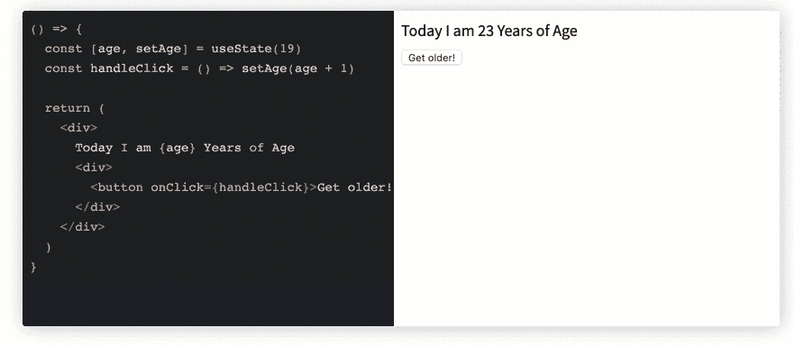

Note how the age state variable is being updated.

下面是负责上述截屏的代码:

```
const UpdateStateVar = () => {
  const [age, setAge] = useState(19)
  const handleClick = () => setAge(age + 1)

  return (
    <div>
      Today I am {age} Years of Age
      <div>
        <button onClick={handleClick}>Get older! </button>
      </div>
    </div>
  )
}
```

### 为什么 React `useState`钩子没有立即更新？

如果你发现 [`useState` / `setState`没有立即更新](https://linguinecode.com/post/why-react-setstate-usestate-does-not-update-immediately)，答案很简单:它们只是队列。

React `useState`和`setState`不直接对状态对象进行修改；他们创建队列来优化性能，这就是为什么更改不会立即更新的原因。

### React 挂钩和多个状态变量

可以在一个功能组件中使用和更新多个状态变量，如下所示:

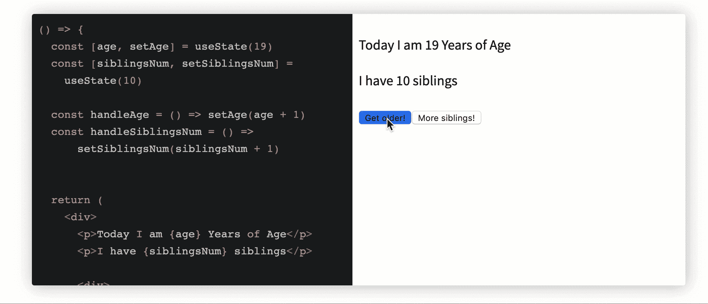

下面是负责上述截屏的代码:

```
const MultipleStateVars = () => {
  const [age, setAge] = useState(19)
  const [siblingsNum, setSiblingsNum] = 
    useState(10)

  const handleAge = () => setAge(age + 1)
  const handleSiblingsNum = () => 
      setSiblingsNum(siblingsNum + 1)

  return (
    <div>
      <p>Today I am {age} Years of Age</p>
      <p>I have {siblingsNum} siblings</p>

      <div>
        <button onClick={handleAge}>
          Get older! 
        </button>
        <button onClick={handleSiblingsNum}>
            More siblings! 
        </button>
      </div>
    </div>
  )
}
```

### 使用对象状态变量

与字符串和数字相反，您也可以使用一个对象作为传递给`useState`的初始值。

注意，您必须将整个对象传递给`useState` updater 函数，因为对象是被替换的，而不是被合并的。

```
// 🐢 setState (object merge) vs useState (object replace)
// assume initial state is {name: "Ohans"}

setState({ age: 'unknown' })
// new state object will be
// {name: "Ohans", age: "unknown"}

useStateUpdater({ age: 'unknown' })
// new state object will be
// {age: "unknown"} - initial object is replaced
```

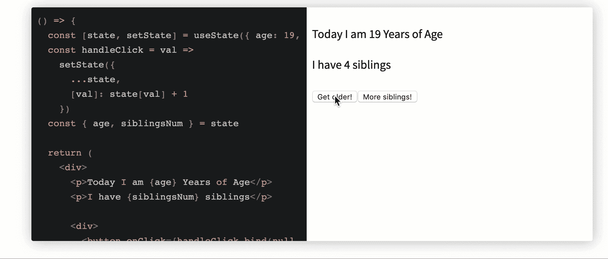

Multiple state objects updated via a state object variable.

下面是上面截屏的代码:

```
const StateObject = () => {
  const [state, setState] = useState({ age: 19, siblingsNum: 4 })
  const handleClick = val =>
    setState({
      ...state,
      [val]: state[val] + 1
    })
  const { age, siblingsNum } = state

  return (
    <div>
      <p>Today I am {age} Years of Age</p>
      <p>I have {siblingsNum} siblings</p>

      <div>
        <button onClick={handleClick.bind(null, 'age')}>Get older!</button>
        <button onClick={handleClick.bind(null, 'siblingsNum')}>
          More siblings!
        </button>
      </div>
    </div>
  )
}
```

### 从函数初始化状态

与只传递初始状态值相反，状态也可以通过函数进行初始化，如下所示:

```
const StateFromFn = () => {
  const [token] = useState(() => {
    let token = window.localStorage.getItem("my-token");
    return token || "default#-token#"
  })

  return <div>Token is {token}</div>
}
```

### 功能性`setState`

从调用`useState`返回的 updater 函数也可以采用类似于 good ol' `setState`的函数:

```
const [value, updateValue] = useState(0)
// both forms of invoking "updateValue" below are valid 👇
updateValue(1);
updateValue(previousValue => previousValue + 1);
```

当状态更新依赖于某个先前的状态值时，这是理想的。


A counter with functional setState updates.

下面是上面截屏的代码:

```
const CounterFnSetState = () => {
  const [count, setCount] = useState(0);
  return (
    <>
      <p>Count value is: {count}</p>
      <button onClick={() => setCount(0)}>Reset</button>
      <button 
        onClick={() => setCount(prevCount => prevCount + 1)}>
        Plus (+)
      </button>
      <button 
        onClick={() => setCount(prevCount => prevCount - 1)}>
       Minus (-)
      </button>
    </>
  );
}
```

如果你想自己深入探索，这里有一个[实时、可编辑的`useState`备忘单](https://react-hooks-cheatsheet.com/usestate)。

## `useEffect`

使用 [`useEffect`](https://reactjs.org/docs/hooks-reference.html#useeffect) ，您可以从功能组件内部调用[副作用，这是 React Hooks 时代需要理解的一个重要概念。](https://blog.logrocket.com/guide-to-react-useeffect-hook/)

### 基本副作用

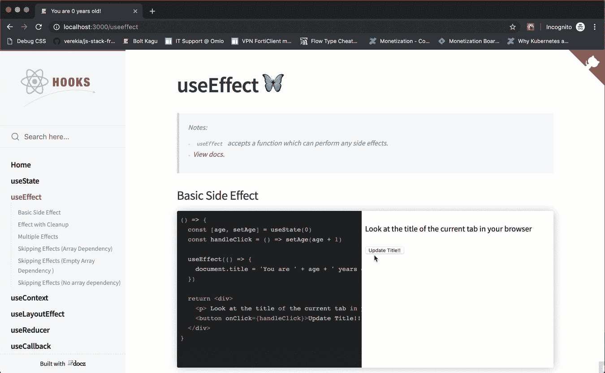

Watch the title of the document update.

下面是负责上述截屏的代码:

```
const BasicEffect = () => {
  const [age, setAge] = useState(0)
  const handleClick = () => setAge(age + 1)

  useEffect(() => {
    document.title = 'You are ' + age + ' years old!'
  })

  return <div>
    <p> Look at the title of the current tab in your browser </p>
    <button onClick={handleClick}>Update Title!! </button>
  </div>
}
```

### 清理效果

一段时间后清理效果是很常见的。这可以通过从传递给`useEffect`的效果函数中返回一个函数来实现。下面是一个用`addEventListener`的例子。

```
const EffectCleanup = () => {
  useEffect(() => {
    const clicked = () => console.log('window clicked')
    window.addEventListener('click', clicked)

    // return a clean-up function
    return () => {
      window.removeEventListener('click', clicked)
    }
  }, [])

  return <div>
    When you click the window you'll 
    find a message logged to the console
  </div>
}
```

### 多重效果

在一个功能组件中可以发生多个`useEffect`调用，如下所示:

```
const MultipleEffects = () => {
  // 🍟
  useEffect(() => {
    const clicked = () => console.log('window clicked')
    window.addEventListener('click', clicked)

    return () => {
      window.removeEventListener('click', clicked)
    }
  }, [])

  // 🍟 another useEffect hook 
  useEffect(() => {
    console.log("another useEffect call");
  })

  return <div>
    Check your console logs
  </div>
}
```

请注意，`useEffect`调用可以被跳过——也就是说，不会在每次渲染时被调用。这是通过向效果函数传递第二个数组参数来实现的。

### 跳过效果(数组依赖)

```
const ArrayDepMount = () => {
  const [randomNumber, setRandomNumber] = useState(0)
  const [effectLogs, setEffectLogs] = useState([])

  useEffect(
    () => {
      setEffectLogs(prevEffectLogs => [...prevEffectLogs, 'effect fn has been invoked'])
    },
    []
  )

  return (
    <div>
      <h1>{randomNumber}</h1>
      <button
        onClick={() => {
          setRandomNumber(Math.random())
        }}
      >
        Generate random number!
      </button>
      <div>
        {effectLogs.map((effect, index) => (
          <div key={index}>{'🍔'.repeat(index) + effect}</div>
        ))}
      </div>
    </div>
  )
}
```

在上面的例子中，`useEffect`被传递了一个值为`[randomNumber]`的数组。

因此，每当生成新的随机数时，将在 mount *和*上调用效果函数。

点击**生成随机数**按钮，生成新的随机数后效果函数重新运行:

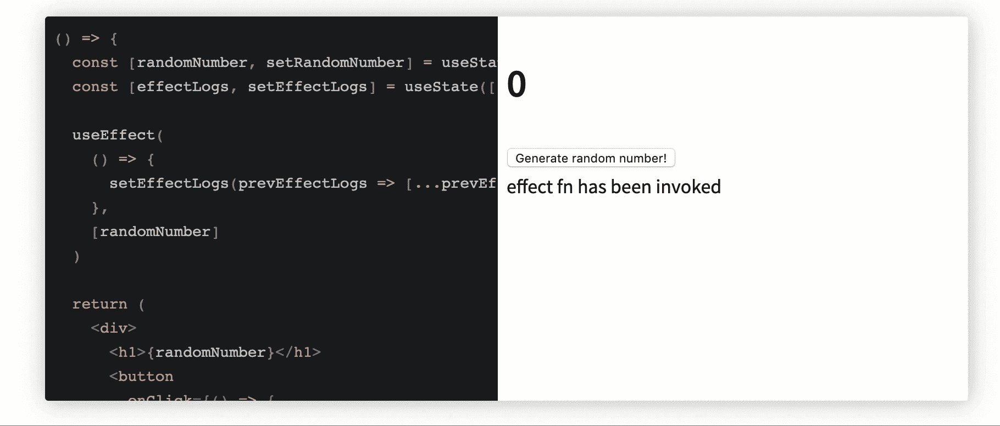

### 跳过效果(空数组依赖)

在这个例子中，`useEffect`被传递一个空数组，`[]`。因此，效果函数将只在挂载时被调用。

```
const ArrayDepMount = () => {
  const [randomNumber, setRandomNumber] = useState(0)
  const [effectLogs, setEffectLogs] = useState([])

  useEffect(
    () => {
      setEffectLogs(prevEffectLogs => [...prevEffectLogs, 'effect fn has been invoked'])
    },
    []
  )

  return (
    <div>
      <h1>{randomNumber}</h1>
      <button
        onClick={() => {
          setRandomNumber(Math.random())
        }}
      >
        Generate random number!
      </button>
      <div>
        {effectLogs.map((effect, index) => (
          <div key={index}>{'🍔'.repeat(index) + effect}</div>
        ))}
      </div>
    </div>
  )
}
```

下面是被点击的按钮和未调用的效果功能:

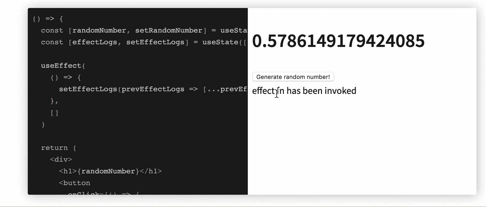

### 跳过效果(无数组依赖性)

如果没有数组依赖，效果函数将在每次渲染后运行。

```
useEffect(() => {
console.log(“This will be logged after every render!”)
})
```

如果你想进一步探索，这里有一个[实时、可编辑的`useEffect`备忘单](https://react-hooks-cheatsheet.com/useeffect)。

## `useContext`

[`useContext`](https://reactjs.org/docs/hooks-reference.html#usecontext) 为你省去必须依赖上下文消费者的压力。与`MyContext.Consumer`和它公开的渲染道具 API 相比，React Context 有一个更简单的 API。

上下文是 React 处理多个组件之间共享数据的方式。

下面的例子强调了通过`useContext`或`Context.Consumer`使用上下文对象值的区别:

```
// example Context object
const ThemeContext = React.createContext("dark");

// usage with context Consumer
function Button() {
  return <ThemeContext.Consumer>
        {theme => <button className={theme}> Amazing button </button>}
  </ThemeContext.Consumer>
}

// usage with useContext hook 
import {useContext} from 'react';

function ButtonHooks() {
 const theme = useContext(ThemeContext)
 return <button className={theme}>Amazing button</button>
}
```

这里有一个关于`useContext`的真实例子:


下面是负责上述示例的代码:

```
const ThemeContext = React.createContext('light');

const Display = () => {
 const theme = useContext(ThemeContext);
 return <div
        style={{
        background: theme === 'dark' ? 'black' : 'papayawhip',
        color: theme === 'dark' ? 'white' : 'palevioletred',
        width: '100%',
        minHeight: '200px'
        }}
    >
        {'The theme here is ' + theme}
    </div>
}
```

如果你想自己动手修改，这里有一个实时的、可编辑的 [React 上下文备忘单](https://react-hooks-cheatsheet.com/usecontext)。

## `useLayoutEffect`

[`useLayoutEffect`](https://reactjs.org/docs/hooks-reference.html#uselayouteffect) 与`useEffect`具有完全相同的签名。我们将在下面讨论`useLayoutEffect`和`useEffect`的区别。

```
useLayoutEffect(() => {
//do something
}, [arrayDependency])
```

### 用法与`useEffect`相似

下面是用`useLayoutEffect`构建的`useEffect`的相同例子:


这是代码:

```
const ArrayDep = () => {
    const [randomNumber, setRandomNumber] = useState(0)
    const [effectLogs, setEffectLogs] = useState([])

    useLayoutEffect(
      () => {
        setEffectLogs(prevEffectLogs => [...prevEffectLogs, 'effect fn has been invoked'])
      },
      [randomNumber]
    )

    return (
      <div>
        <h1>{randomNumber}</h1>
        <button
          onClick={() => {
            setRandomNumber(Math.random())
          }}
        >
          Generate random number!
        </button>
        <div>
          {effectLogs.map((effect, index) => (
            <div key={index}>{'🍔'.repeat(index) + effect}</div>
          ))}
        </div>
      </div>
    )
  }
```

### `useLayoutEffect`对`useEffect`

`useEffect``useLayoutEffect`的[有什么区别？传递给`useEffect`的函数在布局和绘制之后触发——也就是在渲染提交到屏幕之后。对于大多数不应该阻止浏览器更新屏幕的副作用来说，这是可以的。](https://blog.logrocket.com/useeffect-vs-uselayouteffect/)

尽管有些情况下你可能不想要`useEffect`提供的行为；例如，如果您需要对 DOM 做一个视觉上的改变作为副作用，`useEffect`不会是最好的选择。

为了防止用户看到变化的闪烁，您可以使用`useLayoutEffect`。传递给`useLayoutEffect`的函数会在浏览器更新屏幕之前运行。

你可以[阅读我的后续文章](https://blog.logrocket.com/useeffect-vs-uselayouteffect/)，深入了解`useEffect`和`useLayoutEffect`的区别。

这里有一个实时的、可编辑的 [`useLayoutEffect`小抄](https://react-hooks-cheatsheet.com/uselayoutEffect)。

## `useReducer`

[`useReducer`](https://reactjs.org/docs/hooks-reference.html#usereducer) 可以作为`useState`的替代。它非常适合复杂的状态逻辑，其中依赖于以前的状态值或许多状态子值。

根据您的用例，您可能会发现`useReducer`很容易测试。

### 基本用法

与调用`useState`相反，用`reducer`和`initialState`调用`useReducer`，如下图。`useReducer`调用返回状态属性和一个`dispatch`函数。

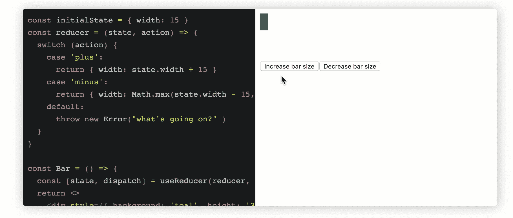

Increase/decrease bar size by managing state with useReducer.

下面是负责上述截屏的代码:

```
const initialState = { width: 15 };

const reducer = (state, action) => {
  switch (action) {
    case 'plus':
      return { width: state.width + 15 }
    case 'minus':
      return { width: Math.max(state.width - 15, 2) }
    default:
      throw new Error("what's going on?" )
  }
}

const Bar = () => {
  const [state, dispatch] = useReducer(reducer, initialState)
  return <>
    <div style={{ background: 'teal', height: '30px', width: state.width }}></div>
    <div style={{marginTop: '3rem'}}>
        <button onClick={() => dispatch('plus')}>Increase bar size</button>
        <button onClick={() => dispatch('minus')}>Decrease bar size</button>
    </div>
    </>
}

ReactDOM.render(<Bar />)
```

### 惰性初始化状态

`useReducer`取第三个函数参数。你可以从这个函数初始化 state，从这个函数返回的任何东西都作为 state 对象返回。将使用第二个参数`initialState`调用该函数。

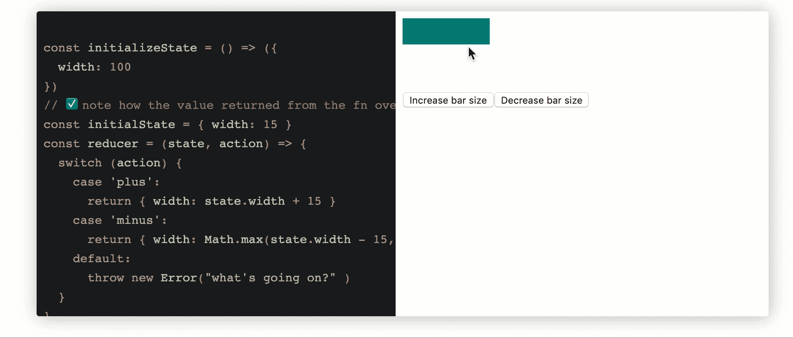

Same increase/decrease bar size, with state initialized lazily.

以上示例的代码如下:

```
const initializeState = () => ({
  width: 100
})

// ✅ note how the value returned from the fn above overrides initialState below: 
const initialState = { width: 15 }
const reducer = (state, action) => {
  switch (action) {
    case 'plus':
      return { width: state.width + 15 }
    case 'minus':
      return { width: Math.max(state.width - 15, 2) }
    default:
      throw new Error("what's going on?" )
  }
}

const Bar = () => {
  const [state, dispatch] = useReducer(reducer, initialState, initializeState)
  return <>
    <div style={{ background: 'teal', height: '30px', width: state.width }}></div>
    <div style={{marginTop: '3rem'}}>
        <button onClick={() => dispatch('plus')}>Increase bar size</button>
        <button onClick={() => dispatch('minus')}>Decrease bar size</button>
    </div>
    </>
}

ReactDOM.render(Bar)
```

### 模仿`this.setState`的行为

使用不像 Redux 那样严格的减速器。例如，传递给缩减器的第二个参数`action`不需要有`type`属性。

这允许进行有趣的操作，例如重命名第二个参数并执行以下操作:

```
const initialState = { width: 15 }; 

const reducer = (state, newState) => ({
  ...state,
  width: newState.width
})

const Bar = () => {
  const [state, setState] = useReducer(reducer, initialState)
  return <>
    <div style={{ background: 'teal', height: '30px', width: state.width }}></div>
    <div style={{marginTop: '3rem'}}>
        <button onClick={() => setState({width: 100})}>Increase bar size</button>
        <button onClick={() => setState({width: 3})}>Decrease bar size</button>
    </div>
    </>
}

ReactDOM.render(Bar)
```

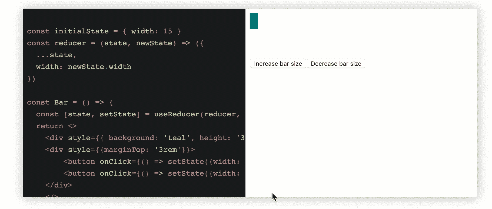

The results remain the same with a setState-like API imitated.

这里有一个可编辑的 [`useReducer`小抄](https://react-hooks-cheatsheet.com/usereducer)。

## `useCallback`

[`useCallback`](https://reactjs.org/docs/hooks-reference.html#usecallback) 返回一个[被记忆的](https://en.wikipedia.org/wiki/Memoization)回调。用`React.Memo()`包装组件表明了重用代码的意图。这不会自动扩展到作为参数传递的函数。

用`useCallback` 包装时，[保存对函数的引用。将此引用作为属性传递给新组件，以减少呈现时间。](https://blog.logrocket.com/react-usememo-vs-usecallback-a-pragmatic-guide/#whatis)

### `useCallback`举例

下面的例子将构成后面的解释和代码片段的基础。

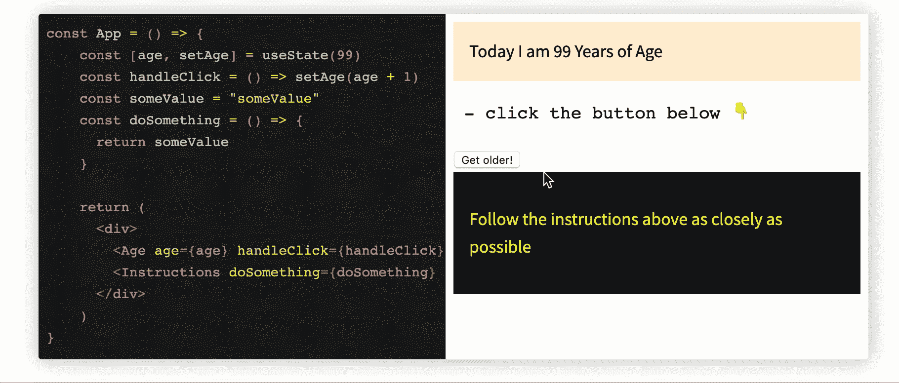

这是代码:

```
const App = () => {
    const [age, setAge] = useState(99)
    const handleClick = () => setAge(age + 1)
    const someValue = "someValue"
    const doSomething = () => {
      return someValue
    }

    return (
      <div>
        <Age age={age} handleClick={handleClick}/>
        <Instructions doSomething={doSomething} />
      </div>
    )
}

const Age = ({ age, handleClick }) => {
  return (
    <div>
      <div style={{ border: '2px', background: "papayawhip", padding: "1rem" }}>
        Today I am {age} Years of Age
      </div>
      <pre> - click the button below 👇 </pre>
      <button onClick={handleClick}>Get older! </button>
    </div>
  )
}

const Instructions = React.memo((props) => {
  return (
    <div style={{ background: 'black', color: 'yellow', padding: "1rem" }}>
      <p>Follow the instructions above as closely as possible</p>
    </div>
  )
})

ReactDOM.render (
  <App />
)
```

在上面的例子中，每当点击**变老**按钮时，父组件`<Age />`被更新(并重新呈现)。

因此，`<Instructions />`子组件也被重新呈现，因为向`doSomething`属性传递了一个带有新引用的新回调。

注意，即使`Instructions`子组件使用`React.memo`来优化性能，它仍然被重新渲染。

如何解决这个问题以防止`<Instructions />`不必要的重新渲染？

### `useCallback`具有引用功能

```
const App = () => {
  const [age, setAge] = useState(99)
  const handleClick = () => setAge(age + 1)
  const someValue = "someValue"
  const doSomething = useCallback(() => {
    return someValue
  }, [someValue])

  return (
    <div>
      <Age age={age} handleClick={handleClick} />
      <Instructions doSomething={doSomething} />
    </div>
  )
}

const Age = ({ age, handleClick }) => {
  return (
    <div>
      <div style={{ border: '2px', background: "papayawhip", padding: "1rem" }}>
        Today I am {age} Years of Age
      </div>
      <pre> - click the button below 👇 </pre>
      <button onClick={handleClick}>Get older! </button>
    </div>
  )
}

const Instructions = React.memo((props) => {
  return (
    <div style={{ background: 'black', color: 'yellow', padding: "1rem" }}>
      <p>Follow the instructions above as closely as possible</p>
    </div>
  )
})

ReactDOM.render(<App />)
```

### `useCallback`带内嵌功能

`useCallback`也可以使用内嵌函数。以下是内联`useCallback`调用的相同解决方案:

```
const App = () => {
  const [age, setAge] = useState(99)
  const handleClick = () => setAge(age + 1)
  const someValue = "someValue"

  return (
    <div>
      <Age age={age} handleClick={handleClick} />
      <Instructions doSomething={useCallback(() => {
        return someValue
      }, [someValue])} />
    </div>
  )
}

const Age = ({ age, handleClick }) => {
  return (
    <div>
      <div style={{ border: '2px', background: "papayawhip", padding: "1rem" }}>
        Today I am {age} Years of Age
      </div>
      <pre> - click the button below 👇 </pre>
      <button onClick={handleClick}>Get older! </button>
    </div>
  )
}

const Instructions = memo((props) => {
  return (
    <div style={{ background: 'black', color: 'yellow', padding: "1rem" }}>
      <p>Follow the instructions above as closely as possible</p>
    </div>
  )
})

render(<App />)
```

这里是[直播，可编辑`useCallback`小抄](https://react-hooks-cheatsheet.com/usecallback)。

## `useMemo`

[`useMemo`](https://reactjs.org/docs/hooks-reference.html#usememo) 函数返回一个记忆值。 [`useMemo`与`useCallback`](https://blog.logrocket.com/react-usememo-vs-usecallback-a-pragmatic-guide/) 不同，它内部化返回值而不是整个函数。React 不会将句柄传递给同一个函数，而是跳过该函数并返回前一个结果，直到参数发生变化。

这使您可以避免在必要时重复执行潜在的高成本操作。小心使用该方法，因为函数中定义的任何变化的变量都不会影响`useMemo`的行为。例如，如果要添加时间戳，这个方法不关心时间的变化，只关心函数参数的不同。

### `useMemo`举例

下面的例子将构成后面的解释和代码片段的基础。

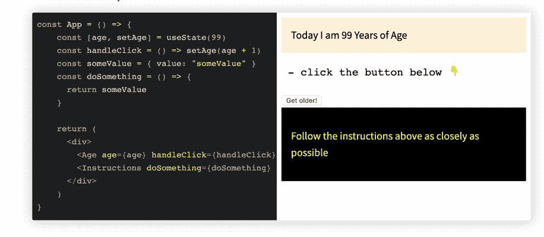

下面是负责上面截图的代码:

```
const App = () => {
    const [age, setAge] = useState(99)
    const handleClick = () => setAge(age + 1)
    const someValue = { value: "someValue" }
    const doSomething = () => {
      return someValue
    }

    return (
      <div>
        <Age age={age} handleClick={handleClick}/>
        <Instructions doSomething={doSomething} />
      </div>
    )
}

const Age = ({ age, handleClick }) => {
  return (
    <div>
      <div style={{ border: '2px', background: "papayawhip", padding: "1rem" }}>
        Today I am {age} Years of Age
      </div>
      <pre> - click the button below 👇 </pre>
      <button onClick={handleClick}>Get older! </button>
    </div>
  )
}

const Instructions = React.memo((props) => {
  return (
    <div style={{ background: 'black', color: 'yellow', padding: "1rem" }}>
      <p>Follow the instructions above as closely as possible</p>
    </div>
  )
})

ReactDOM.render (
  <App />
)
```

上面的例子类似于`useCallback`的例子。这里唯一的区别是，`someValue`是一个对象，*不是一个字符串。因此，尽管使用了`React.memo`，但`Instructions`组件仍然会重新渲染。*

为什么？对象通过引用进行比较，每当`<App />`重新渲染时，对`someValue`的引用就会改变。

有什么解决方案吗？

### 基本用法

可以使用`useMemo`来记忆对象`someValue`。这可以防止不必要的重新渲染。

```
const App = () => {
    const [age, setAge] = useState(99)
    const handleClick = () => setAge(age + 1)
    const someValue = useMemo(() => ({ value: "someValue" }))
    const doSomething = () => {
      return someValue
    }

    return (
      <div>
        <Age age={age} handleClick={handleClick}/>
        <Instructions doSomething={doSomething} />
      </div>
    )
}

const Age = ({ age, handleClick }) => {
  return (
    <div>
      <div style={{ border: '2px', background: "papayawhip", padding: "1rem" }}>
        Today I am {age} Years of Age
      </div>
      <pre> - click the button below 👇 </pre>
      <button onClick={handleClick}>Get older! </button>
    </div>
  )
}

const Instructions = React.memo((props) => {
  return (
    <div style={{ background: 'black', color: 'yellow', padding: "1rem" }}>
      <p>Follow the instructions above as closely as possible</p>
    </div>
  )
})

ReactDOM.render (<App />)
```

这里有一个[现场，可编辑的`useMemo`演示](https://react-hooks-cheatsheet.com/usememo)。

## `useRef`

[`useRef`](https://reactjs.org/docs/hooks-reference.html#useref) 返回一个“ref”对象。从返回对象的`.current`属性中访问值。例如，`.current`属性可以被初始化为初始值— `useRef(initialValue)`。对象在组件的整个生存期内都是持久的。

在这个[综合`useRefs`指南](https://blog.logrocket.com/a-guide-to-react-refs/)中了解更多信息，或者查看我们的`useRefs`视频教程:

[https://www.youtube.com/embed/0ppuDPhgyrA](https://www.youtube.com/embed/0ppuDPhgyrA)

视频

### 访问 DOM

考虑下面的示例应用程序:

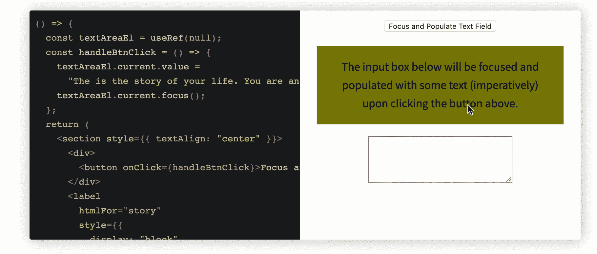

Accessing the DOM via useRef.

下面是负责上述截屏的代码:

```
const AccessDOM = () => {
  const textAreaEl = useRef(null);
  const handleBtnClick = () => {
    textAreaEl.current.value =
    "The is the story of your life. You are an human being, and you're on a website about React Hooks";
    textAreaEl.current.focus();
  };
  return (
    <section style={{ textAlign: "center" }}>
      <div>
        <button onClick={handleBtnClick}>Focus and Populate Text Field</button>
      </div>
      <label
        htmlFor="story"
        style={{
          display: "block",
          background: "olive",
          margin: "1em",
          padding: "1em"
        }}
      >
        The input box below will be focused and populated with some text
        (imperatively) upon clicking the button above.
      </label>
      <textarea ref={textAreaEl} id="story" rows="5" cols="33" />
    </section>
  );
};
```

### 类似实例的变量(通用容器)

除了保存 DOM 引用,“ref”对象还可以保存任何值。考虑下面一个类似的应用程序，其中 ref 对象保存一个字符串值:

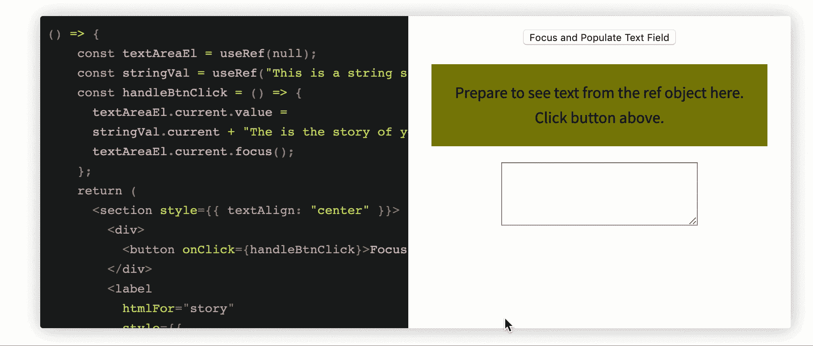

代码如下:

```
const HoldStringVal = () => {
    const textAreaEl = useRef(null);
    const stringVal = useRef("This is a string saved via the ref object --- ")
    const handleBtnClick = () => {
      textAreaEl.current.value =
      stringVal.current + "The is the story of your life. You are an human being, and you're on a website about React Hooks";
      textAreaEl.current.focus();
    };
    return (
      <section style={{ textAlign: "center" }}>
        <div>
          <button onClick={handleBtnClick}>Focus and Populate Text Field</button>
        </div>
        <label
          htmlFor="story"
          style={{
            display: "block",
            background: "olive",
            margin: "1em",
            padding: "1em"
          }}
        >
          Prepare to see text from the ref object here. Click button above.
        </label>
        <textarea ref={textAreaEl} id="story" rows="5" cols="33" />
      </section>
    );
  };
```

您可以像存储来自`setInterval`的返回值一样进行清理。

```
function TimerWithRefID() {
  const setIntervalRef = useRef();

  useEffect(() => {
    const intervalID = setInterval(() => {
      // something to be done every 100ms
    }, 100);

    // this is where the interval ID is saved in the ref object 
    setIntervalRef.current = intervalID;
    return () => {
      clearInterval(setIntervalRef.current);
    };
  });
}
```

### 其他示例

研究一个接近真实世界的例子可以帮助你将钩子的知识运用到生活中。在 React 悬念数据获取发布之前，通过钩子获取数据被证明是一个很好的钩子练习。

下面是一个使用加载指示器获取数据的示例:

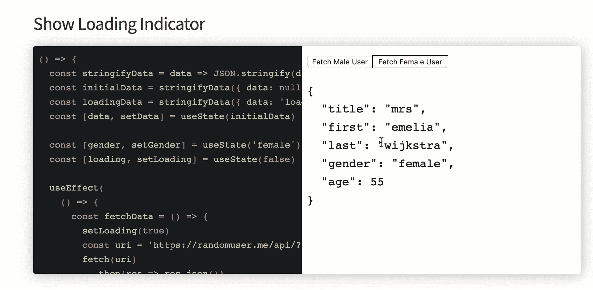

代码如下所示:

```
const fetchData = () => {
  const stringifyData = data => JSON.stringify(data, null, 2)
  const initialData = stringifyData({ data: null })
  const loadingData = stringifyData({ data: 'loading...' })
  const [data, setData] = useState(initialData)

  const [gender, setGender] = useState('female')
  const [loading, setLoading] = useState(false)

  useEffect(
    () => {
      const fetchData = () => {
        setLoading(true)
        const uri = 'https://randomuser.me/api/?gender=' + gender
        fetch(uri)
          .then(res => res.json())
          .then(({ results }) => {
            setLoading(false)
            const { name, gender, dob } = results[0]
            const dataVal = stringifyData({
              ...name,
              gender,
              age: dob.age
            })
            setData(dataVal)
          })
      }

      fetchData()
    },
    [gender]
  )

  return (
    <>
      <button
        onClick={() => setGender('male')}
        style={{ outline: gender === 'male' ? '1px solid' : 0 }}
      >
        Fetch Male User
      </button>
      <button
        onClick={() => setGender('female')}
        style={{ outline: gender === 'female' ? '1px solid' : 0 }}
      >
        Fetch Female User
      </button>

      <section>
        {loading ? <pre>{loadingData}</pre> : <pre>{data}</pre>}
      </section>
    </>
  )
}
```

这是一张[实时、可编辑的`useRef`备忘单](https://react-hooks-cheatsheet.com/useRef)。

## `useTransition`

理解`useTransition`钩子的关键是它优先考虑状态变化。默认情况下，React 中的任何状态更改都被赋予高优先级。然而，当您转换一个状态变化时(可能是因为繁重的计算)，您告诉 React 给予该状态变化较低的优先级，这意味着所有其他状态变化将在转换的状态变化运行之前运行并呈现在屏幕上。

### 将状态标记为转换

将一个状态标记为转换很简单，只需将一个同步函数与您想要转换的状态一起传递给由`useTransition`钩子返回的`startTransition`函数:

```
import { useTransition } from 'react';

const App =()=>{
  const [timeUpdate, setTimeUpdate] = useState(2)
  const [isPending, startTransition] = useTransition()

  startTransition(()=>{
      // handle state change in here
    })

  }

```

`isPending`标志返回`true`或`false`,指示是否有未决转换，我们使用`startTransition`函数将状态变化标记为转换。

### `useTransition`和常规状态更新的区别

放置在`useTransition`钩子内的状态更新被赋予低优先级，而常规的状态更新被赋予较高的优先级。

所以把`useTransition`想象成一个 React 钩子，让你在不阻塞 UI 的情况下更新状态。

让我们看一个例子。

#### 改变状态而不转换

我已经创建了一个 [CodeSandbox](https://codesandbox.io/s/compassionate-browser-ieidgo?file=/src/App.js) ，它进行了两次状态更新:

1.  根据用户输入更新`textInput`状态
2.  用当前输入的用户输入循环和更新`listItems`状态

`React`有一种称为“批处理”的机制，允许它将多个状态更改合并成一个对组件状态的更新。

当您在 React 组件中调用`setState`时，React 不会立即更新组件的状态。相反，它将状态更新安排在以后处理。如果在同一个事件循环中多次调用`setState` *，React 会在将这些更新应用到组件的状态并触发重新渲染之前，将它们批处理成一个更新。*

 *这就是为什么在这个例子中，我们的`setTextInput`状态不会触发重新渲染，直到我们完成循环并更新了`setListItems`状态，然后才触发渲染。这使得我们的应用程序动作有点迟缓。

现在，让我们看看同一个例子，但这一次，我们将转换计算量很大的状态变化。

#### 通过转换改变状态

正如我们在这个[代码沙箱](https://codesandbox.io/s/nostalgic-cdn-002eg9?file=/src/App.js)中看到的，我们的应用程序有了显著的改进。在这个例子中，我们告诉`react`给`setListItems`状态更新一个较低的优先级，因为它需要大量的计算。这意味着`setTextInput`状态将在状态改变时触发重新渲染，而不必与`setListItem`状态改变一起批处理。

***注意，**如果一个状态更新导致一个组件挂起，那么这个状态更新应该包含在一个转换中*

## `useDeferredValue`

`useDeferredValue` Hook 是 React 18 的新增功能，它为开发人员优化应用程序提供了一个强大的新工具。`useDeferredValue`允许您将值的呈现推迟到将来的某个时间点，这在您希望避免不必要的呈现的情况下非常有用。

下面是示例语法代码:

```
import { useDeferredValue } from 'react'

const App =()=>{
const [valueToDefer, setValueToDefer] = useState("")
const deferredValue = useDeferredValue(valueToDefer)

return (
  <p>{deferredValue}</p>
  )
}

```

我们所要做的就是将我们想要推迟的值传递到`useDeferredValue`钩子中。

`useDeferredValue`钩子最常见的一个用例是当你同时进行大量更新的时候。例如，假设您的应用程序中有一个搜索栏，它会随着用户的键入而实时更新。如果用户是一个快速打字员，这可能导致几十个，甚至几百个更新快速连续发生。如果没有任何优化，这可能会导致您的应用程序变慢。

通过使用`useDeferredValue`钩子，您可以通过推迟搜索结果的呈现直到用户停止输入来避免这个问题。这类似于[去抖动](https://www.freecodecamp.org/news/debouncing-explained/)的工作方式；它可以显著提高性能。

让我们用一个例子来演示这个用例:

```
const Search =()=> {
  const [searchQuery, setSearchQuery] = useState('');
  const [searchResults, setSearchResults] = useState([]);

  const deferredSearchQuery = useDeferredValue(searchQuery);

  useEffect(() => {
    // Fetch search results using deferredSearchQuery
    // Update setSearchResults with the new results
  }, [deferredSearchQuery]);

  const handleSearchInputChange = (event) => {
    setSearchQuery(event.target.value);
  };

  return (
    <div>
      <input type="text" value={searchQuery} onChange={handleSearchInputChange} />
      <ul>
        {searchResults.map((result) => (
          <li key={result.id}>{result.title}</li>
        ))}
      </ul>
    </div>
  );
}

```

在这里，我们使用`useDeferredValue`钩子来推迟搜索结果的呈现，直到用户停止在搜索栏中输入。这有助于减少不必要的重新渲染并提高性能。

## `useId`

`useId`是一个用来生成唯一 id 的 React 钩子。这在很多情况下是有价值的，比如为可访问性属性生成惟一的 id。

下面是示例语法代码:

```
import { useId } from 'react'

const App =()=>{
const id = useId()

return (
  <input type="text" id={id} />
  )
}

```

现在，让我们看一个用例。下面是一个使用带有`TextField`组件的`useId`钩子的场景示例:

```
const TextField =()=>{
  return(
      <>
        <label htmlFor="name" /> 
        <input type="text" id="name"/>
      </>
  )
}

```

我们将在下面的`App`组件中多次使用`TextField`组件:

```
const App=()=>{
  return (
    <div className="inputs">
      <TextField />
      <TextField />
    </div>
  )
}

```

为了将一个`label`元素链接到一个`input`字段，我们使用了`id`和`htmlFor`属性。这将使浏览器将特定的`label`元素与特定的`input`字段相关联。如果我们使用普通的`HTML`，这就没有必要了——相反，我们可以简单地复制元素并改变属性。

然而，在上面的例子中，我们创建了一个可重用的`TextField`组件，并且我们在`App`组件中使用了这个组件两次。由于`TextField`
中元素的属性是静态的，所以每次我们渲染组件时，属性都保持不变。

我们可以通过使用`useId`钩子来解决这个问题。让我们修改`TextField`组件，如下所示:

```
const TextField =()=>{
const id = useId();
  return(
      <>
        <label htmlFor={id} /> 
        <input type="text" id={id}/>
      </>
  )
}

```

现在，每次我们调用`TextInput`组件时，一个惟一的 ID 将与所呈现的元素相关联。

## 结论

钩子给了功能组件很大的力量。我希望这份备忘单对您日常使用 React 钩子有用。

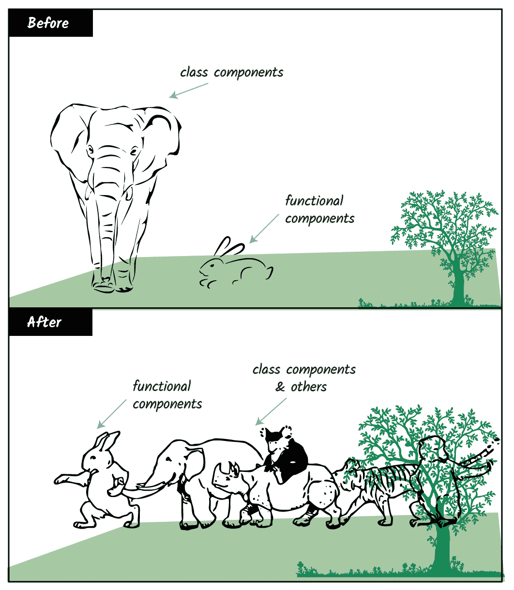

多亏了钩子和其他几个新的 React 特性。由我插画


干杯！

## 使用 LogRocket 消除传统反应错误报告的噪音

[LogRocket](https://lp.logrocket.com/blg/react-signup-issue-free)

是一款 React analytics 解决方案，可保护您免受数百个误报错误警报的影响，只针对少数真正重要的项目。LogRocket 告诉您 React 应用程序中实际影响用户的最具影响力的 bug 和 UX 问题。

[ ](https://lp.logrocket.com/blg/react-signup-general) [  ](https://lp.logrocket.com/blg/react-signup-general) [LogRocket](https://lp.logrocket.com/blg/react-signup-issue-free)

自动聚合客户端错误、反应错误边界、还原状态、缓慢的组件加载时间、JS 异常、前端性能指标和用户交互。然后，LogRocket 使用机器学习来通知您影响大多数用户的最具影响力的问题，并提供您修复它所需的上下文。

关注重要的 React bug—[今天就试试 LogRocket】。](https://lp.logrocket.com/blg/react-signup-issue-free)*