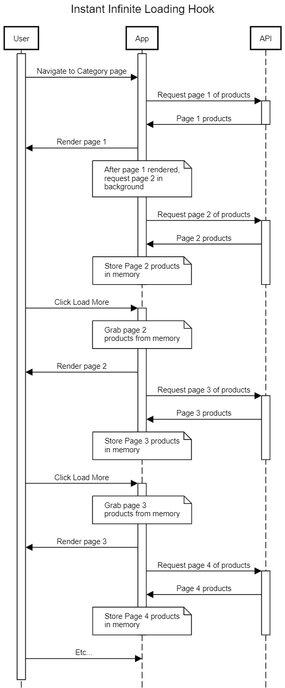

# React Hooks for infinite scroll:高级教程

> 原文：<https://blog.logrocket.com/react-hooks-infinite-scroll-advanced-tutorial/>

## 介绍

无限加载是电子商务应用程序中非常常见的一种模式。在线零售商喜欢这种加载产品的模式，因为它允许用户无缝地浏览一个类别中的每个产品，而不必经常暂停并等待下一页的加载。

在本文中，我们将为 React 创建一个超级强大的无限装载钩，它可以作为您创建自己的装载钩的指南！

虽然本文中的代码将专门针对 React，但代码背后的思想很容易适用于任何上下文，包括 Vue.js、Svelte、vanilla JavaScript 等。

## 为无限滚动创建挂钩

在我们进入细节之前，让我们先概述一下钩子将管理什么和不管理什么。

钩子不管理渲染；这取决于组件。API 通信也不包括在内，但是，钩子可以扩展以包括它。事实上，根据您的用例，将它全部打包可能是个好主意！

我们的钩子将管理什么？首先也是最重要的，页面上可见的项目。具体来说，就是产品、博客文章、列表项、链接以及任何在页面上重复出现并从 API 调用中加载的内容。

我们还假设 [React 路由器](https://blog.logrocket.com/react-router-v6/)在大多数(如果不是全部)包含任何路由的 React 应用程序中普遍存在，因此我们将使用这种依赖性。

让我们从管理物品的状态开始:

```
import { useState } from 'react';

const useInfiniteLoading = (() => {
  const [items, setItems] = useState([]);

  return {
    items
  };
}

```

接下来，让我们添加一个函数，每次我们想要加载下一页项目时都会调用这个函数。

如前所述，API 通信不是本文的一部分。实际的 API 库并不重要，我们只需要一个接受页码变量的函数，并返回与该页码对应的项目数组。这可以使用 GraphQL、Rest、本地文件查找或项目需要的任何东西！

```
const useInfiniteLoading = (props) => {
  const { getItems } = props; /* 1 */
  const [items, setItems] = useState([]);
  const pageToLoad = useRef(new URLSearchParams(window.location.search).get('page') || 1); /* 2 */
  const initialPageLoaded = useRef(false);
  const [hasMore, setHasMore] = useState(true);

  const loadItems = async () => { /* 3 */
    const data = await getItems({
      page: pageToLoad.current
    });
    setHasMore(data.totalPages > pageToLoad.current); /* 4 */
    setItems(prevItems => [...prevItems, ...data]);
  };

  useEffect(() => {
    if (initialPageLoaded.current) {
      return;
    }

    loadItems(); /* 5 */
    initialPageLoaded.current = true;
  }, [loadItems])

  return {
    items,
    hasMore,
    loadItems
  };
}

```

让我们快速浏览一下这段代码:

1.  首先，我们直接接受一个道具:`getItems`。`getItems`是一个接受带有`page`属性的对象的函数，该属性的值是我们想要加载的项目的“页面”
2.  接下来，我们获取一个表示起始页的`page`查询参数，默认为第一页
3.  `loadItems`是当我们想要实际加载下一页产品时，我们的组件可以调用的函数。在阅读本文的过程中，我们将探索使用该功能的不同方式，无论是自动的、手动的还是两者的混合
4.  从`getItems`返回的数据还将包括项目的总页数。这将用于在加载所有项目时有条件地隐藏“加载更多”按钮
5.  这确保页面中填充了初始产品

就这样，我们现在有了一个钩子，可以无限装载我们的物品！

下面是使用这个钩子的一个简单例子:

```
import { useInfiniteLoading } from './useInfiniteLoading';

export default MyList = () => {
    const { items, hasMore, loadItems } = useInfiniteLoading({
      getItems: ({ page }) => { /* Call API endpoint */ }
    });

    return (
        <div>
            <ul>
                {items.map(item => (
                    <li key={item.id}>
                        {item.name}
                    </li>
                ))}
            </ul>
            {hasMore && 
              <button onClick={() =>loadItems()}>Load More</button>
            }
        </div>
    );
}

```

很直白，很简单，还可以更好。

## 双向加载数据

用户直接访问带页码的网址怎么办？例如，`[http://www.myonlinestore.com/jumpers?page=4](http://www.myonlinestore.com/jumpers?page=4)`，用户如何获取第一、第二或第三页上的内容？我们期望他们自己直接编辑网址吗？

我们应该为用户提供一种加载前一页的方法，只需使用一个“加载前一页”(或类似的)按钮，放在项目列表的顶部。

代码看起来是这样的:

```
import { useEffect, useRef, useState } from 'react';
import { useHistory } from 'react-router-dom';

export const useInfiniteLoading = (props) => {
  const { getItems } = props;
  const [items, setItems] = useState([]);
  const pageToLoad = useRef(new URLSearchParams(window.location.search).get('page') || 1);
  const initialPageLoaded = useRef(false);
  const [hasNext, setHasNext] = useState(true); /* 1 */
  const [hasPrevious, setHasPrevious] = useState(() => pageToLoad.current !== 1); /* 2 */
  const history = useHistory();

  const loadItems = async (page, itemCombineMethod) => {
    const data = await getItems({ page });
    setHasNext(data.totalPages > pageToLoad.current); /* 3 */
    setHasPrevious(pageToLoad.current > 1); /* 4 */
    setItems(prevItems => {
      /* 5 */
      return itemCombineMethod === 'prepend' ?
        [...data.items, ...prevItems] :
        [...prevItems, ...data.items]
    });
  };

  const loadNext = () => {
    pageToLoad.current = Number(pageToLoad.current) + 1;
    history.replace(`?page=${pageToLoad.current}`);
    loadItems(pageToLoad.current, 'append');
  }

  const loadPrevious = () => {
    pageToLoad.current = Number(pageToLoad.current) - 1;
    history.replace(`?page=${pageToLoad.current}`);
    loadItems(pageToLoad.current, 'prepend');
  }

  useEffect(() => {
    if (initialPageLoaded.current) {
      return;
    }

    loadItems(pageToLoad.current, 'append');
    initialPageLoaded.current = true;
  }, [loadItems])

  return {
    items,
    hasNext,
    hasPrevious,
    loadNext,
    loadPrevious
  };
}

```

1.  重构`hasMore`到`hasNext`，因为它会在下一点旁边读得更好
2.  添加`hasPrevious`，它将跟踪我们是否已经加载了最下面的页面(最下面的页面是第一页)
3.  假设`getItems`查询将返回页面信息，我们将使用一个`totalPages`值与我们刚刚加载的页面进行比较，以确定我们是否仍然应该显示“加载更多”
4.  如果我们已经加载了第一页，那么我们不再需要显示“加载上一页”按钮
5.  虽然钩子不负责呈现项目，但它负责呈现这些项目的顺序。这部分将确保当我们加载之前的项目时，我们将它们放在当前项目之前。这使得`key`道具对于渲染项目的组件来说绝对重要，所以在野外使用时一定要记住这一点

这是正确使用时的样子:

```
import { useRef } from 'react';
import { useInfiniteLoading } from './useInfiniteLoading';

export default MyList = () => { 
    const { items, hasNext, hasPrevious, loadNext, loadPrevious } = useInfiniteLoading({
      getItems: ({ page }) => { /* Call API endpoint */ }
    });

    return (
        <div>
            {hasPrevious && 
              <button onClick={() => loadPrevious()}>Load Previous</button>
            }
            <ul>
                {items.map(item => (
                    <li key={item.id}>
                        {item.name}
                    </li>
                ))}
            </ul>
            {hasNext && 
              <button onClick={() =>loadNext()}>Load More</button>
            }
        </div>
    )
}

```

一些读者可能会注意到一个刚刚通过实现“加载上一个”按钮引入的错误。对于还没有这样做的人，再看一下代码，问问自己如果用户点击“加载上一个”按钮，然后点击“加载下一个”会发生什么将加载哪些页面？

由于我们使用单个变量来跟踪最近加载的页面，代码“忘记”*我们已经加载了上一页的下一页。这意味着如果用户从第五页开始(通过一个直接链接)，然后点击“Load Previous”，应用程序将读取`pageToLoad` ref，看到用户在第五页，发送请求以获取第四页上的项目，然后更新 ref 以指示用户正在查看第四页的数据。*

 *然后，用户可能决定向下滚动并按下“加载更多”按钮。应用程序将查看`pageToLoad` ref 的值，看到用户刚刚在查看第四页，发送对第五页数据的请求，然后更新 ref 以指示用户正在查看第五页数据。在非常简单的交互之后，用户现在有了第四页的数据和第五页的两组数据。

为了解决这个问题，我们将再次使用一些 refs 来跟踪加载的最低页面和加载的最高页面。我们将使用这些变量来确定要加载的下一页:

```
const useInfiniteLoading = (props) => {
  // ...
  const initialPage = useRef(new URLSearchParams(window.location.search).get('page') || 1); /* 6 */
  // ...
  const lowestPageLoaded = useRef(initialPage.current); /* 7 */
  const highestPageLoaded = useRef(initialPage.current); /* 7 */

  const loadItems = (page, itemCombineMethod) => { 
    // ...
    setHasNext(data.totalPages > page);
    setHasPrevious(page > 1);
    // ...
  }

  const loadNext = () => {
    const nextPage = highestPageLoaded.current + 1; /* 8 */
    loadItems(nextPage, 'append');
    highestPageLoaded.current = nextPage;
  }

  const loadPrevious = () => {
    const nextPage = lowestPageLoaded.current - 1; /* 8 */
    if (nextPage < 1) return; /* 9 */
    loadItems(pageToLoad.current, 'prepend');
    lowestPageLoaded.current = nextPage;
  }

  return {
    // ...
  };
}

```

下面我们来仔细看看这段代码:

1.  重构`pageToLoad`到`initialPage`，因为它只用于初始化
2.  设置两个新的引用来跟踪在任一方向上加载的页面
3.  利用方向跟踪引用来确定要加载的下一页
4.  安全检查，以确保我们没有试图加载低于第一页的页面

我们有了，两个方向的无限载荷！请务必特别注意本节中第一个代码块的代码分解；省略`key`值(或使用数组索引)将导致渲染错误，这将很难修复。

## 感知性能

感知性能是应用程序感觉有多快的概念。这不是真的可以通过分析或测量来支持的东西，因为它只是一种感觉——你可能已经经历过很多次了。

例如，如果我们显示下载一个页面所需的所有数据所需的整个时间的加载指示器，然后显示一个完全呈现的页面，那么该页面的加载不会像一个随着数据可用而逐渐加载的页面(或使用占位符内容的页面)那样快。用户可以看到正在发生的事情，而不是什么都看不到，然后什么都看不到。

* * *

### 更多来自 LogRocket 的精彩文章:

* * *

我们可以让我们的无限加载钩子感觉即时，甚至在用户请求之前就预取下一页的项目。当我们使用手动触发的“加载更多”按钮时，这种技术会非常有效。

对于自动触发的“加载更多”按钮，这种技术仍然有效，但是有更好的方法让页面看起来像是立即加载的。我们将在下一节讨论自动触发的“加载更多”按钮。

我们要使用的让无限加载钩子瞬间出现的技术是，总是在下一个页面之后加载该页面，然后将该页面存储在内存中，等待直接进入状态并呈现在页面上。

这可能最好用序列图来解释:



我们的想法是，下一页条目已经在内存中等待我们了，所以当用户点击“加载更多”时，我们可以立即将这些条目放入状态，并用新条目重新呈现页面。页面呈现后，我们请求后续页面的数据。

点击“加载更多”实际上会触发一个网络请求，但这是对下一页之后的页面的网络请求。

这项技术提出了几个问题:如果我们无论如何都要下载数据，为什么不直接呈现给用户看呢？不是浪费带宽吗？

无论如何，不简单地呈现所有产品的原因是因为我们不希望用户变得不知所措。允许用户在显示下一页产品时触发，这给了他们一种控制感，他们可以按照自己的节奏来购买产品。此外，如果我们谈论的是一个手动触发的“加载更多”按钮，他们将能够快速到达页脚，而不是必须滚动通过许多页的产品。

下载一组用户可能看不到的项目会浪费带宽吗？是的。但对于一个感觉像闪电一样的应用程序来说，这是一个很小的代价，用户会发现使用起来很快乐。

我们当然会注意到那些带宽有限的用户，他们使用的是目前在 Chrome、Edge 和 Opera 以及所有移动浏览器(除了 Safari)中可用的实验性 API。

具体来说，我们可以使用`NetworkInformation`的`effectiveType`和`saveData`属性的组合来确定用户是否有一个有能力的连接，使得下一页的下载足够快，从而不会阻塞任何用户触发的 API 调用，并且还可以确定用户是否已经表示他们想要减少数据使用。关于这个 API 的更多信息可以在 [MDN](https://developer.mozilla.org/en-US/docs/Web/API/NetworkInformation) 上找到。

## 自动无限加载

基于 scroll 实现任何东西的最有效的方法是利用[交集观察者 API](https://blog.logrocket.com/lazy-loading-using-the-intersection-observer-api/) 。

即使我们在 React 中不直接与正在呈现的 HTML 元素交互，设置它仍然相对简单。使用连接到“Load More”按钮的 ref，我们可以检测“Load More”按钮何时在视窗中(或者将要在视窗中)，然后自动触发该按钮上的动作，加载并呈现下一页的项目。

因为本文的目的是无限加载，所以我们不打算深入讨论交叉点观察器 API 的实现细节，而是使用现有的 React 钩子为我们提供该功能， [react-cool-inview](https://github.com/wellyshen/react-cool-inview) 。

使用 react-cool-inview 的实现再简单不过了:

```
import useInView from 'react-cool-inview';

const useInfiniteLoading = (props) => {
  // ...

  const { observe } = useInView({
    onEnter: () => {
      loadNext();
    },
  });

  return {
    // ...
    loadMoreRef: observe
  };
}

```

在这个模块中，我们使用了“加载更多”按钮上的`loadMoreRef`:

```
import { useRef } from 'react';
import { useInfiniteLoading } from './useInfiniteLoading';

export default MyList = () => { 
    const { loadMoreRef /* ... */ } = useInfiniteLoading({
      getItems: ({ page }) => { /* Call API endpoint */ }
    });

    return (
        <div>
            {/* ... */}

            {hasNext && 
              <button ref={loadMoreRef} onClick={() =>loadNext()}>Load More</button>
            }
        </div>
    )
}

```

如前所述，我们可以通过使用提供给交叉点观察器钩子的选项来使自动无限加载模式感觉更快。例如，不是等待“加载更多”按钮出现在视口中，而是等到它即将出现在视口中，或者等到有一行项目不在视图中，允许加载下一组项目，从而防止用户实际看到“加载更多”按钮。

这些是我鼓励您在实现无限装载挂钩时考虑的因素。

### 防止在页面加载时触发无限加载

当项目在视口中时，使用交叉点观察器 API 自动触发页面加载会出现一个常见问题。在加载数据时，页面上没有任何内容要呈现，因此“Load More”按钮应该位于所有项目的下方，在视窗之外，但实际上在第一页数据加载完毕并按下按钮之前，它会一直在视窗内。

解决这个问题的方法是，当页面处于加载状态时，强制页面上项目的高度；我建议使用骨架装载机。在页面容器上设置一个最小高度也是可行的，但是会带来一些问题。

最后，我们有“双向加载数据”的考虑。也就是说，我们是否使用交叉点观察器 API 自动加载项目的前一页？我们当然可以，但我不建议这样做——“加载上一页”按钮将在视窗中启动，这意味着上一页的项目将自动加载，导致用户在浏览器试图恢复滚动位置时失去位置。

## 无限加载选项

让我们开始用一些选项来扩展我们的无限装载钩子。我们将有三个钩子选项:手动装载、部分无限装载和无限无限装载。

### 人工装载

这是我们先前简要讨论过的选择；只有当用户点击“加载更多”按钮时，下一页的项目才会加载。实现这一点非常容易，只需利用一个当用户激活按钮时触发的回调函数。

### 无限载荷

这是一个有趣的说法，代表了当用户向下滚动时，应用程序自动触发的“加载更多”按钮。

我们在前一节讨论了它的实现。这个选项的主要结果是，只要用户在滚动，只要有更多的项目要加载，数据页就会继续加载。

### 部分无限载荷

最后，我们有一个混合了手动和无限加载的模式。该模式将使用 ref 来跟踪自动页面加载被触发的次数，并且一旦该值等于预定义的最大值，将停止自动加载页面，而是退回到用户必须手动按下“Load More”按钮。

下面是我们如何在钩子中设置它的一个例子:

```
import { useEffect, useRef } from 'react';

export const useInfiniteLoading = (props) => {
  const { loadingType, partialInfiniteLimit = -1 /* ... */ } = props; /* 1 */
  const remainingPagesToAutoload = useRef(loadingType === 'manual' ? 0 : partialInfiniteLimit);
  const loadMoreRef = useRef(null);

  const loadNext = () => {/* ... */}

  const { observe, unobserve } = useInView({
    onEnter: () => {
      if (remainingPagesToAutoload.current === 0) { /* 2 */
        unobserve();
        return;
      }

      remainingPagesToAutoload.current = remainingPagesToAutoload.current - 1;
      loadNext();
    },
  });

  // ...

  return {
    loadMoreRef,
    handleLoadMore
    /* ... */
  };
}

```

1.  在这里，我们接受两个新的道具:
    *   第一个是`loadingType`，它是三个字符串值之一:“手动”、“部分”和“无限”
    *   第二个是`partialInfiniteLimit`，它将指示当`loadingType`为“部分”时，“加载更多”功能应自动触发多少次
2.  钩子不能是有条件的，所以当`loadingType`是“手动的”或者钩子达到自动装载限制时，我们只需在第一次调用它时关闭交叉点观察器钩子

我们可以通过给用户提供第二个按钮来进一步使用这种方法:`Load More`和`Continue Auto Load More`。第二个按钮的例子有点罗嗦，实现完全取决于应用程序的上下文，但本质上它意味着将权力交给用户。如果用户希望数据页面继续自动加载，他们可以将这一偏好传达给应用程序。

## 最后的想法

好了，我们现在已经介绍了创建一个无限装载挂钩的过程，以及一些特殊的额外功能。

我强烈建议你使用这个回购中提供的[代码，并把它作为你自己的无限加载钩子的起点。它提供了我们在本文中讨论的所有代码:一个全功能的`useInfiniteLoading`钩子，包括所有额外的特性，比如手动无限加载、部分无限加载、无限无限加载和条件预取。](https://github.com/denno020/useInfiniteLoading)

它不一定要即插即用到每个可能的项目中，有时我们需要的只是让它在单个项目中工作得非常好！

## [LogRocket](https://lp.logrocket.com/blg/react-signup-general) :全面了解您的生产 React 应用

调试 React 应用程序可能很困难，尤其是当用户遇到难以重现的问题时。如果您对监视和跟踪 Redux 状态、自动显示 JavaScript 错误以及跟踪缓慢的网络请求和组件加载时间感兴趣，

[try LogRocket](https://lp.logrocket.com/blg/react-signup-general)

.

[ ](https://lp.logrocket.com/blg/react-signup-general) [](https://lp.logrocket.com/blg/react-signup-general) 

LogRocket 结合了会话回放、产品分析和错误跟踪，使软件团队能够创建理想的 web 和移动产品体验。这对你来说意味着什么？

LogRocket 不是猜测错误发生的原因，也不是要求用户提供截图和日志转储，而是让您回放问题，就像它们发生在您自己的浏览器中一样，以快速了解哪里出错了。

不再有嘈杂的警报。智能错误跟踪允许您对问题进行分类，然后从中学习。获得有影响的用户问题的通知，而不是误报。警报越少，有用的信号越多。

LogRocket Redux 中间件包为您的用户会话增加了一层额外的可见性。LogRocket 记录 Redux 存储中的所有操作和状态。

现代化您调试 React 应用的方式— [开始免费监控](https://lp.logrocket.com/blg/react-signup-general)。*