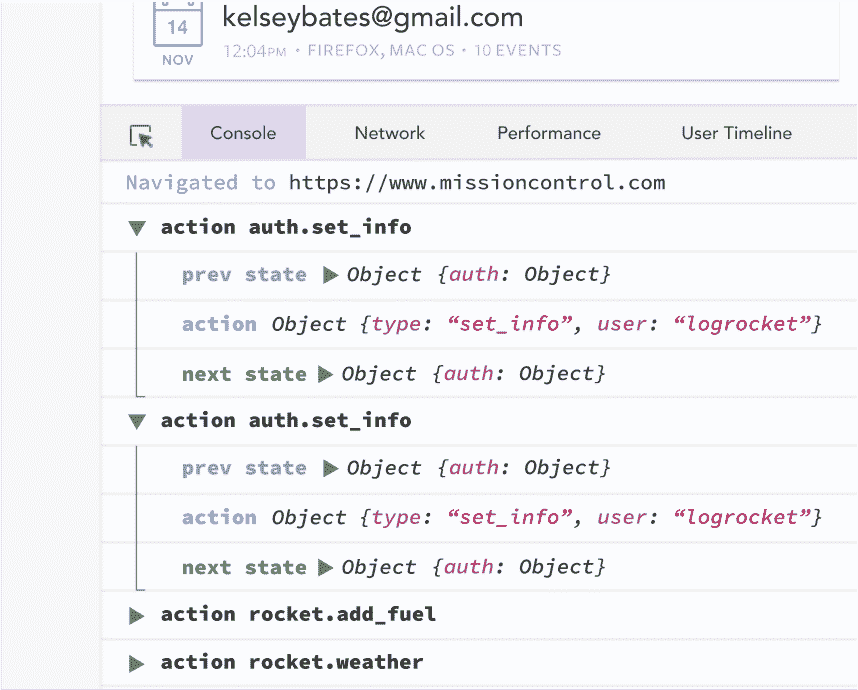

# 使用 React 钩子进行状态管理

> 原文：<https://blog.logrocket.com/react-hooks-state-management/>

***编者按**:这个 React 钩子状态管理教程最后一次更新是在 2021 年 5 月 25 日。*

React Hooks API 引入了一种全新的编写和思考 React 应用的方式。我最喜欢的 React 钩子之一是 [`useReducer`](https://blog.logrocket.com/guide-to-react-usereducer-hook/) ，你可以用它在组件之间共享状态。

在本教程中，我们将向您展示如何使用`useReducer`钩子在 React 中处理复杂的状态更新。

我们将通过实例详细介绍以下内容:

## 为什么使用 React 钩子进行共享状态管理？

在 React 中管理状态，特别是在大型应用程序中，通常需要引入第三方库，如 Redux 和 MobX。这些第三方工具使得以更加可预测和细粒度的方式更新应用程序的状态变得更加容易，但是它们通常会带来额外的开销和陡峭的学习曲线。

多亏了`useReducer`，随着 [React v16.8](https://reactjs.org/docs/hooks-intro.html) 引入的[定制挂钩](https://blog.logrocket.com/how-to-create-your-own-react-hooks-77b426ac0e26/)之一，你现在可以获得使用第三方库的好处，而无需额外的软件包和学习曲线——好吧，也许只是一个微小的曲线。

在本教程结束时，您将能够使用 React 钩子以可预测的方式管理和共享应用程序的状态。

在我们开始之前，我想声明一下，我并不是要抨击其他的状态管理方法或包，比如 [Redux](https://blog.logrocket.com/why-use-redux-reasons-with-clear-examples-d21bffd5835/) 、 [MobX](https://blog.logrocket.com/introduction-to-mobx-with-react/) 、[反冲](https://blog.logrocket.com/simple-state-management-react-recoil/)、 [Zustand](https://blog.logrocket.com/using-zustand-to-simplify-state-management/) 等等。每个解决方案都有其优势，并在特定的用例中大放异彩。本教程的目的是演示如何使用 React 钩子进行状态管理，并帮助您理解`useReducer`钩子是如何工作的，以便您可以将它添加到您的工具箱中。

## 什么是`useReducer`？

在我们开始讨论如何使用`useReducer`来管理 React 中的共享状态之前，让我们来解构它，以便更好地理解它。

`useReducer`钩子允许您在分派某些动作时更新 React 组件的部分状态。这个过程非常类似于 Redux 的工作方式:`useReducer`接受一个 reducer 函数和一个初始状态作为参数，然后提供一个状态变量和一个 dispatch 函数，这使您能够更新状态。

如果你熟悉 Redux 如何通过 reducers 和 actions 更新存储，那么你已经知道`useReducer`是如何工作的了。

## 挂钩是如何工作的

需要两件事来工作:一个初始状态和一个缩减函数。我们将在下面看到它们的样子，然后详细解释它们的用途。

考虑以下代码片段:

```
// we have to define the initial state of the component's state
const initialState = { count: 0 }

// this function will determine how the state is updated
function reducer(state, action) {
  switch(action.type) {
    case 'INCREMENT':
      return { count: state.count + 1 }
    case 'DECREMENT':
      return { count: state.count - 1 }
    case 'REPLACE':
      return { count: action.newCount }
    case 'RESET':
      return { count: 0 }
    default:
      return state
  }
}

// inside your component, initialize your state like so
const [state, dispatch] = useReducer(reducer, initialState);
```

在上面的代码片段中，我们为组件定义了一个初始状态——一个根据调度的动作更新状态的 reducer 函数——并且在第 21 行初始化了组件的状态。

如果你从未使用过 Redux，下面是这个过程是如何工作的。

### `initialState`

`initialState`变量是我们的组件首次安装时的默认状态值。

### 减速器功能

我们希望在某些动作发生时更新组件的状态。该函数负责根据动作指定状态应该包含的内容。它返回一个对象，然后用该对象替换状态。

reducer 函数接受两个参数:`state`和`action`。

*   是您的应用程序的当前状态
*   `action`是一个包含当前正在发生的动作的细节的对象。它通常包含一个表示动作的`type:`。`action`还可以包含更多的数据，这通常是状态中要更新的新值

一个操作可能看起来像这样:

```
const replaceAction = {
  type: 'REPLACE',
  newCount: 42,
}
```

回头看看我们的 reducer 函数，可以看到一个检查`action.type`值的 switch 语句。如果我们已经将`replaceAction`作为当前动作传递给了我们的 reducer，那么 reducer 将返回一个对象`{ count: 42 }`，这个对象将被用来替换组件的状态。

### 调度操作

我们现在知道什么是 reducer，以及它如何通过被调度的动作来确定组件的下一个状态。然而，我们如何派遣这样的行动？

回到代码片段，检查第 21 行。您会注意到`useReducer`在一个数组中返回两个值。第一个是状态对象，第二个是一个叫做`dispatch`的函数。这是我们用来分派动作的。

例如，如果我们想要分派上面定义的`replaceAction`，我们应该这样做:

```
dispatch(replaceAction)

// or

dispatch({
  type: 'REPLACE',
  newCount: 42,
})
```

Dispatch 只不过是一个函数，由于 JavaScript 中的函数是一等公民，我们可以通过 props 将它们传递给其他组件。这个简单的事实就是你可以在应用中使用`useReducer`来代替 Redux 的原因。

## 使用 React 钩子在组件之间共享状态

当使用 React 钩子在组件之间共享状态时，就不需要使用 Redux 了。在这一节中，我们将向您展示如何在没有 Redux 的情况下进行 React 状态管理。

现在您已经知道如何调度一个动作来更新组件的状态，让我们看一个场景，其中根组件的状态充当 Redux 存储的替换。

首先，我们将定义商店的初始状态:

```
const initialState = {
  user: null,
  permissions: [],
  isAuthenticating: false,
  authError: null,
}

```

现在我们的减速器功能:

```
function reducer(state, action) {
  switch(action.type) {
    case 'AUTH_BEGIN':
      return {
        ...state,
        isAuthenticating: true,
      }

    case 'AUTH_SUCCESS':
      return {
        isAuthenticating: false,
        user: action.user,
        permissions: action.permissions
        authError: null,
      }

    case 'AUTH_FAILURE':
      return {
        isAuthenticating: false,
        user: null,
        permissions: []
        authError: action.error,
      }

    default:
      return state
  }
}
```

最后，我们的根组件。这将保存存储并将所需的数据和分派功能传递给需要它们的组件。这将允许子组件根据需要读取和更新存储。

让我们看看它在代码中的样子:

```
function App() {
  const [store, dispatch] = useReducer(initialState)

  return (
    <React.Fragment>
      <Navbar user={store.user} />
      <LoginPage store={store} dispatch={dispatch} />
      <Dashboard user={store.user} />
      <SettingsPage permissions={store.permissions} />
    </React.Fragment>
  )
}
```

我们设置了`App`来处理存储，这是我们将存储值传递给子组件的地方。如果我们使用 Redux，我们必须使用`Provider`包装所有的组件，创建一个单独的商店，然后对于每个需要连接到商店的组件，使用`connect`将它们包装在一个特设中。

但是，使用这种方法，我们可以绕过使用所有样板文件，直接将存储的值作为道具传递给组件。我们可以有尽可能多的商店、减速器等。而不必引入 Redux。

* * *

### 更多来自 LogRocket 的精彩文章:

* * *

好了，让我们写一个登录函数，从`<LoginPage />`组件调用它，观察商店是如何更新的。

```
async function loginRequest(userDetails, dispatch) {
  try {
    dispatch({ type: 'AUTH_BEGIN' })
    const { data: { user, permissions } } = await axios.post(url, userDetails)
    dispatch({ type: 'AUTH_SUCCESS', user, permissions }) 
  } catch(error) {
    dispatch({ type: 'AUTH_FAILURE', error: error.response.data.message })
  }
}
```

我们会在`LoginPage`组件中这样使用它:

```
function LoginPage(props) {
  // ...omitted for brevity
  const handleFormSubmit = async (event) => {
    event.preventDefault()

    await loginRequest(userDetails, props.dispatch)
    const { authError } = props.store
    authError
      ? handleErrors(authError)
      : handleSuccess()
  }
  // ...omitted for brevity
}
```

我们现在已经能够更新从其他几个组件中读取的存储变量。一旦减速器返回到由动作确定的新状态，这些组件就获得新的值`user`和`permissions`。

这是在不同组件之间共享动态数据的一种非常模块化的方式，同时仍然保持代码相对简单，没有样板文件。您可以通过使用 [`useContext`钩子](https://reactjs.org/docs/hooks-reference.html#usecontext)进一步改进这一点，使所有组件都可以使用存储和分派功能，而不必手工传递它。

## 使用 React 钩子进行状态管理的限制

如果我们是客观的，我们需要讨论一下`useReducer`的一些相当重要的限制。这些限制可能会阻碍您使用`useReducer`管理应用程序的所有状态。

### 商店限制

你的商店不是真正的全球性的。Redux 的全局存储实现意味着存储本身不依赖于任何组件；它与你的应用程序是分开的。

您从`useReducer`获得的状态是依赖于组件的，以及它的分派功能。这使得不可能在不同的 reducer 上使用来自一个`useReducer`调用的分派。例如，以这两个独立的商店及其配送功能为例:

```
const [notificationStore, dispatch1] = useReducer(initialState, notificationReducer)
const [authStore, dispatch2] = useReducer(initialState, authReducer)
```

因为调度函数依赖于返回它的`useReducer`调用，所以不能在`authStore`中使用`dispatch1`触发状态更新，也不能在`notificationStore`中使用`dispatch2`触发状态更新。

这个限制意味着您必须手动跟踪哪个分派函数属于哪个缩减器，这可能最终会导致更多的膨胀。在撰写本文时，还没有已知的方法来组合调度函数或 reducers。

### 展开性

Redux 的一个我最喜欢的特性是它的可扩展性。例如，您可以添加一个日志记录中间件来记录所有调度的操作，并且您可以使用 Chrome 扩展来查看您的存储，甚至区分调度之间的变化。

如果你决定用`useReducer`代替 Redux，这些都是你必须放弃的。或者您可以自己实现这些，但是您将重新引入 Redux 带来的样板文件。

## 在 React 应用中实现状态管理？用 LogRocket 跟踪状态和动作

调试 React 应用程序可能很困难，尤其是在有复杂状态的情况下。如果您对监视和跟踪生产中所有用户的 Redux 状态感兴趣，请尝试 LogRocket 。[](https://logrocket.com/signup/)[https://logrocket.com/signup/](https://logrocket.com/signup/)

LogRocket 就像是网络应用的 DVR，记录下你网站上发生的每一件事。您可以汇总并报告问题发生时应用程序的状态，而不是猜测问题发生的原因。

LogRocket Redux 中间件包为您的用户会话增加了一层额外的可见性。LogRocket 记录 Redux 存储中的所有操作和状态。

让您调试 React 应用的方式现代化—[开始免费监控](https://logrocket.com/signup/)。

## 结论

挂钩是 React 库的一个很好的补充。它允许以一种更可预测和更有组织的方式更新组件的状态，并且在某种程度上，当[与`useContext`](https://blog.logrocket.com/use-hooks-and-context-not-react-and-redux/) 结合使用时，使得组件之间的数据共享变得更加容易。

我们在上面讨论过，它也有缺点。如果你找到了避开它们的方法，请在评论中告诉我。