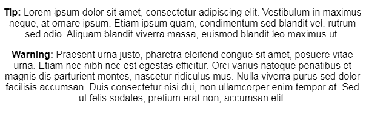
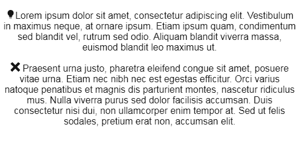
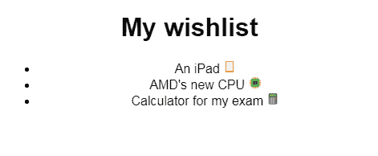
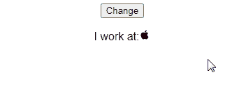
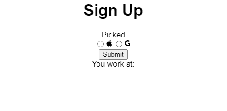

# React Icons:包含示例的综合教程

> 原文：<https://blog.logrocket.com/react-icons-comprehensive-tutorial-examples/>

在本文中，您将学习如何使用 React 图标库在 React 项目中显示图标。

## 介绍

增强 React 项目用户体验的最佳方式之一是使用明亮多彩的图标。它们不仅让你的应用看起来更好，也让你的网站更现代、更时尚。

图标甚至可以让设计师节省屏幕空间。此外，图标是通用的，开发者和用户都熟悉它们的用法。

比如你觉得什么比较好看？这段文字:



或者这些图标:



在 React 中渲染图标，最常用的库是 [React Icons](https://react-icons.github.io/react-icons) 。这是一个易于使用的库，用于在应用程序中呈现图标。

## 装置

在 React 项目中，运行以下终端命令:

```
npm install react-icons

```

## 简单用法

首先，将您想要的图标导入到项目中:

```
import {FcHeadset} from "react-icons/fc" 

```

然后在 React 组件中呈现它:

```
return (
    <div>
        <p>
            For coding, you need some good <FcHeadset />
        </p>
    </div>
);

```

如您所见，您可以将图标显示为子元素。


请注意，每个图标包都有自己的子文件夹。例如，如果你想从[游戏图标包](https://react-icons.github.io/react-icons/icons?name=gi)中获取图标，那么你应该使用下面的导入:

```
import { IconName } from "react-icons/gi";

```

## 在列表中呈现图标

像以前一样，像这样导入你的图标:

```
import { FcIpad, FcElectronics, FcCalculator } from "react-icons/fc";

```

这里，我们从[平面颜色包](https://react-icons.github.io/react-icons/icons?name=fc)中导入了我们的图标。

要呈现它，请在组件的`return`块中编写以下代码:

```
return (
    <div>
        <h1> My wishlist</h1>
        <ul>
            <li>
                An iPad <FcIpad />{" "}
            </li>
            <li>
                AMD's new CPU <FcElectronics />
            </li>
            <li>
                Calculator for my exam <FcCalculator />
            </li>
        </ul>
    </div>
);

```



## 可点击的按钮和链接

```
import { FaGoogle, FaRegSun } from "react-icons/fa";
export default function SimpleButton() {
    return (
        <div>
            <p>Login With Google:</p>
            <a href="/auth/google">
                <FaGoogle />
            </a>
            <br />
            <button onClick={() => alert("Settings page")}>
                <FaRegSun />
            </button>
        </div>
    );
}

```

在第 1 行，我们从[字体 Awesome 包](https://react-icons.github.io/react-icons/icons?name=fa)中导入了两个图标。在第 7 行，我们在`a`标签之间呈现了`FaGoogle`图标。这意味着这个图标现在是一个链接。稍后，在第 11 行，我们在`button`标签之间渲染了`FaRegSun`图标，从而将图标变成了一个可点击的按钮。


## 条件渲染

```
import { FcAndroidOs } from "react-icons/fc";
export default function ConditionalRendering() {
    const usesAndroid = true;
    return (
        <div>
            {usesAndroid ? (
                <p>
                    {" "}
                    I use <FcAndroidOs />
                </p>
            ) : (
                <p> Does not use Android</p>
            )}
        </div>
    );
}

```

在第 3 行，我们声明了`usesAndroid`布尔值，这将使条件渲染成为可能。此外，第 6–13 行的代码声明，如果`usesAndroid`的值是`true`，那么呈现`FcAndroidOs`图标如下:


否则，呈现一个标准的`p`元素。

当您将`usesAndroid`布尔值设置为`false`时，结果如下:


## 在两个图标之间交换

假设你想从 Google+图标换成苹果图标。你可以使用 [React 钩子](https://blog.logrocket.com/5-top-react-hooks-libraries-compared/)来解决这个问题:

```
import { useState } from "react";
import { AiFillApple, AiOutlineGoogle } from "react-icons/ai";
export default function SwappingIcons() {
    const [icon, setIcon] = useState("apple");

    const changeIcon = (state) => {
        if (state === "apple") {
            return "google";
        }
        return "apple";
    };

    return (
        <div>
            <button onClick={() => setIcon((old) => changeIcon(old))}>Change</button>
            <p>
                {" "}
                I work at:{icon === "apple" ? <AiFillApple /> : <AiOutlineGoogle />}
            </p>{" "}
        </div>
    );
}

```

首先，我们声明一个`icon`钩子来决定呈现哪个图标。初始值为`apple`。

从第 6 行到第 11 行，我们创建了`changeIcon`函数，它在`apple`和`google`之间交换`icon`的值。

稍后，我们创建一个简单的`button`元素。如果用户点击该按钮，则运行`changeIcon`功能交换值。

最后，在第 18 行，我们指定如果`icon`钩子是`apple`，那么渲染`AiFillApple`图标。否则，渲染`AiOutlineGoogle`图标。



## 使用表单

这里，您将使用 [Formik 库](https://blog.logrocket.com/building-better-react-forms-with-formik/),因为它更容易使用。要安装 Formik，请运行以下命令:

```
npm i formik

```

现在，要构建一个带有图标的表单，请编写以下代码:

```
import React, { useState } from "react";
import { Formik, Field, Form } from "formik";
import { AiFillApple, AiOutlineGoogle } from "react-icons/ai";

export default function FormExample() {
    const [icon, setIcon] = useState("");
    return (
        <div>
            <h1>Sign Up</h1>
            <Formik
                initialValues={{
                    picked: ""
                }}
                onSubmit={async (values) => {
                    setIcon(values.picked);
                }}
            >
                {({ values }) => (
                    <Form>
                        <div id="my-radio-group">Picked</div>
                        <div role="group" aria-labelledby="my-radio-group">
                            <label>
                                <Field type="radio" name="picked" value="Apple" />
                                <AiFillApple />
                            </label>
                            <label>
                                <Field type="radio" name="picked" value="Google" />
                                <AiOutlineGoogle />
                            </label>
                        </div>
                        <button type="submit">Submit</button>
                    </Form>
                )}
            </Formik>
            You work at:{icon}
        </div>
    );
}

```

在第 12 行，我们告诉 Formik，如果表单没有提交，那么表单返回的值是一个空字符串。然后从第 14 行到第 17 行，我们告诉 React 当用户提交表单时，将`icon`钩子设置为所选的值。

稍后在第 23–29 行，我们创建了我们的`radio`按钮。它们都将`name`属性设置为`picked`，这样 Formik 就可以识别这些元素并检索表单提交的值。

最后，在第 35 行，我们显示了`icon`元素的值。



## 图标配置

请注意，到目前为止，在我们的应用程序中，所有呈现的图标都很小。幸运的是，React 图标库允许我们定制这些图标的大小和颜色。

### 颜色

为此，您需要使用 [React 的上下文 API](https://blog.logrocket.com/a-deep-dive-into-react-context-api/) 。首先，创建一个独立的组件来设计你的图标:

```
import { IconContext } from "react-icons";

export default function ConfigIcon({ children }) {

    return (
        <>
            <IconContext.Provider value={{ color: "green" }}>
                {children}
            </IconContext.Provider>
        </>
    );
}

```

根据第 7 行,`IconContext.Provider`将改变我们图标的属性。在这里，我们已经指定了`color`属性将是`green`。

最后，在第 8 行，我们告诉 React 呈现`GreenIcon`组件的子元素。这意味着如果你有一个图标作为`GreenIcon`的子元素，那么你的图标将会是绿色的。

是时候使用我们的组件了:

```
import "./styles.css";
import GreenIcon from "./GreenIcon";
import { AiFillFastForward } from "react-icons/ai";
export default function App() {
    return (
        <div className="App">
            <ConfigIcon>
                <AiFillFastForward />
            </ConfigIcon>
        </div>
    );
}

```

我们的`AiFillFastForward`组件现在将是绿色的。


### 大小

```
return (
    <>
        <IconContext.Provider value={{ color: "green", size: "4em" }}>
            {children}
        </IconContext.Provider>
    </>
);

```

在第 3 行，我们将大小设置为`4em`。默认图标大小为`1em`。


自定义图标现在看起来更大更好了！

[所有代码示例都在 CodeSandbox](https://codesandbox.io/embed/serene-swartz-tcx5k) 中。

## 结论

React 图标库使用起来绝对轻而易举。它不仅提供了你的项目所需的所有流行图标，而且它非常快，非常小，以确保你的应用程序不会滞后。

非常感谢您的阅读！

## 使用 LogRocket 消除传统反应错误报告的噪音

[LogRocket](https://lp.logrocket.com/blg/react-signup-issue-free)

是一款 React analytics 解决方案，可保护您免受数百个误报错误警报的影响，只针对少数真正重要的项目。LogRocket 告诉您 React 应用程序中实际影响用户的最具影响力的 bug 和 UX 问题。

[ ](https://lp.logrocket.com/blg/react-signup-general) [  ](https://lp.logrocket.com/blg/react-signup-general) [LogRocket](https://lp.logrocket.com/blg/react-signup-issue-free)

自动聚合客户端错误、反应错误边界、还原状态、缓慢的组件加载时间、JS 异常、前端性能指标和用户交互。然后，LogRocket 使用机器学习来通知您影响大多数用户的最具影响力的问题，并提供您修复它所需的上下文。

关注重要的 React bug—[今天就试试 LogRocket】。](https://lp.logrocket.com/blg/react-signup-issue-free)