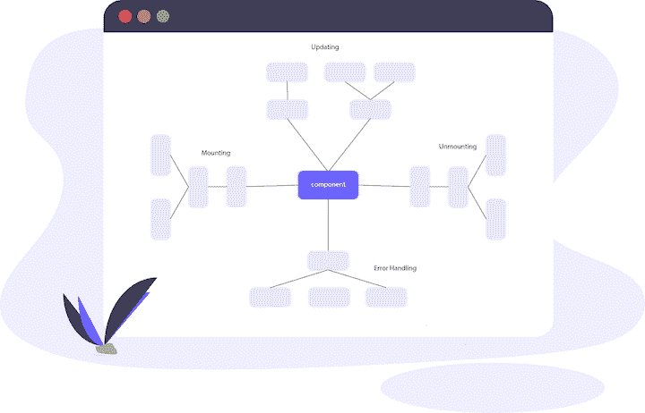
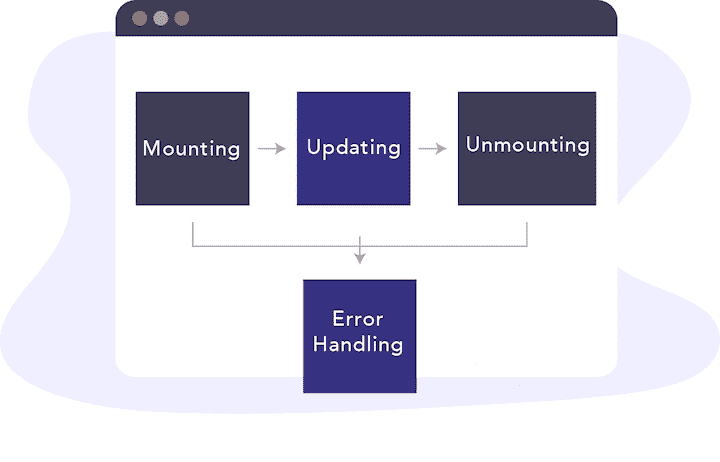
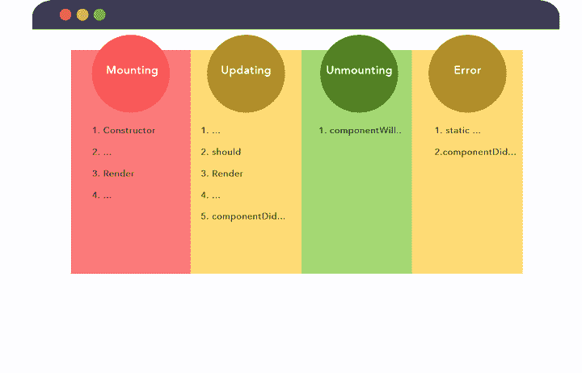
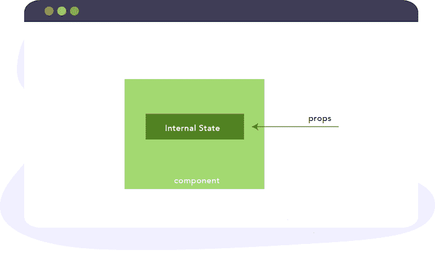
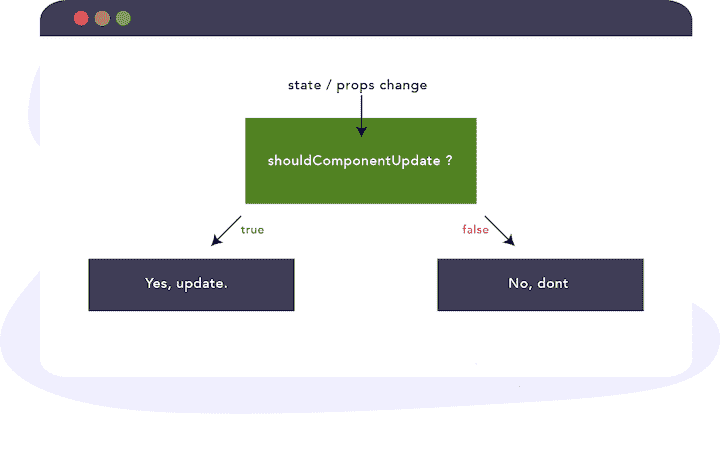
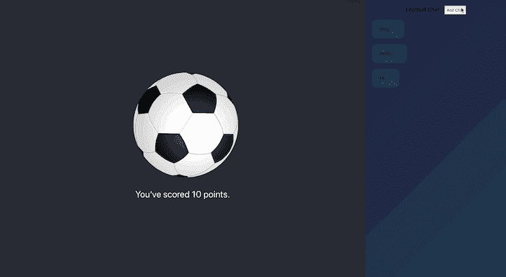
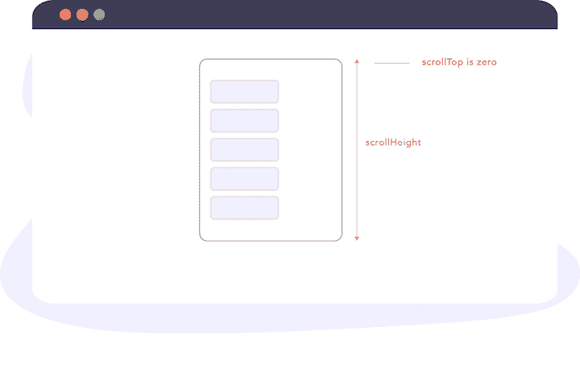
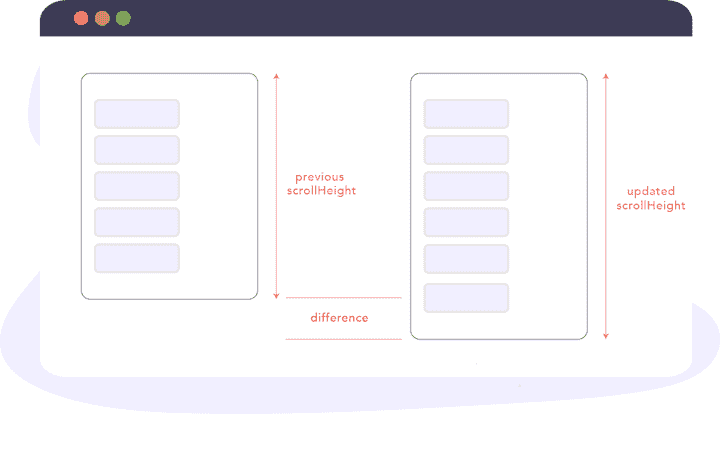
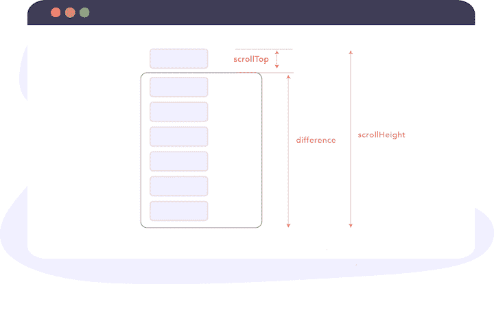
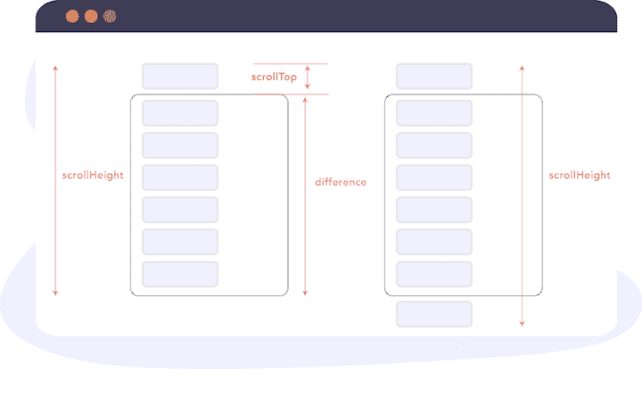

# React lifecycle methods:一个带有示例的可接近的教程

> 原文：<https://blog.logrocket.com/react-lifecycle-methods-tutorial-examples/>

***编者按**:React 16.8 中 React 钩子的[引入使得本教程中描述的一些方法已经过时。要深入了解 2021 年如何处理 React 状态和生命周期特性，请查看我们的](https://blog.logrocket.com/introducing-react-16-8-featuring-official-support-for-hooks/) [React Hooks 参考指南](https://blog.logrocket.com/react-reference-guide-hooks-api/)和[备忘单](https://blog.logrocket.com/react-hooks-cheat-sheet-unlock-solutions-to-common-problems-af4caf699e70/)。*

什么是 React 生命周期方法？简单地说，您可以将 React 组件生命周期视为组件的“生命周期”。生命周期方法是在 React 组件的诞生、成长和死亡过程中发生的一系列事件。

这个全面的指南旨在帮助你直观地理解什么是 React 生命周期方法，以及它们为什么有用。以下是我们将要介绍的内容:

为了直观地了解我们将在本教程中介绍的内容，下图说明了 React 组件生命周期的工作方式:



## 什么是 React 组件生命周期？

在 React 中，组件经历一个事件生命周期:

1.  挂载(向 DOM 添加节点)
2.  更新(改变 DOM 中的现有节点)
3.  卸载(从 DOM 中删除节点)
4.  错误处理(验证您的代码工作正常并且没有错误)

您可以将这些事件分别视为组件的诞生、成长和死亡。错误处理就像一年一度的体检。

让我们看一个简单的例子。如果我告诉您构建一个 Hello World 组件，您可能会编写如下内容:

```
class HelloWorld extends React.Component {
   render() {
    return <h1> Hello World </h1> 
   }
}
```

当在客户端上呈现和查看该组件时，您可能会看到这样的视图:


在渲染之前，组件将经历它的安装、更新和卸载阶段。让我们进一步分解一下。

安装一个组件就像把一个新生婴儿带到这个世界上。这是组件对生命的第一瞥。在这个阶段，由代码和 React 内部组成的组件被插入到 DOM 中。

在挂载阶段之后，React 组件在更新阶段“增长”。如果没有更新，组件将保持它最初在 DOM 中创建时的样子。正如您所想象的，您编写的许多组件都需要更新，无论是通过`state`还是`props`的变化。因此，它们也要经历更新阶段。

最后一个阶段称为卸载阶段。在这个阶段，组件“死亡”。在 React 行话中，它被从 DOM 中移除。

React 组件还可以经历一个阶段:错误处理阶段。当你的代码不能运行或者某处有错误时，就会发生这种情况。把它想象成年度体检。

下图显示了 React 生命周期:



请注意，React 组件可能不会经历每个阶段。例如，一个组件可能在一分钟前被装载，然后在没有任何更新或错误处理的情况下被卸载。上面描述的图示和示例假设组件经历了所有四个阶段。

[](https://logrocket.com/signup/)

## 什么是 React 生命周期方法？

每个 React 生命周期阶段都有许多生命周期方法，您可以覆盖这些方法，以便在流程中的指定时间运行代码。这些通常被称为组件生命周期方法。

下图显示了与安装、更新、卸载和错误生命周期阶段相关的 React 生命周期方法:



## 安装生命周期方法

挂载阶段是指创建组件并将其插入 DOM 的阶段。

按顺序调用以下方法。

### 1.`constructor()`

`constructor()`是组件被“赋予生命”时调用的第一个方法

在组件安装到 DOM 之前，调用构造函数方法。在大多数情况下，您会在构造函数方法中初始化状态和绑定事件处理程序方法。

下面是`constructor()` React 生命周期方法的一个简单例子:

```
const MyComponent extends React.Component {
  constructor(props) {
   super(props) 
    this.state = {
       points: 0
    }  
    this.handlePoints = this.handlePoints.bind(this) 
    }   
}
```

值得重申的是这是组件挂载到 DOM 之前调用的 的第一个方法。构造函数不是你引入任何副作用或订阅的地方，比如事件处理程序。

### 2.`static getDerivedStateFromProps()`

`static getDerivedStateFromProps`是从 [React 17](https://medium.com/@valerii.sukhov/react-17-lifecycle-5b68946c813c) 开始的新 React 生命周期方法，旨在取代`componentWillReceiveProps`。

它的主要功能是确保状态和道具在需要的时候保持同步。

`static getDerivedStateFromProps()`的基本结构看起来是这样的:

```
const MyComponent extends React.Component {
  ... 

  static getDerivedStateFromProps() {
*//do stuff here*
  }  
}
```

`static getDerivedStateFromProps()`收`props`和`state`:

```
... 

  static getDerivedStateFromProps(props, state) {
*//do stuff here*
  }  

...
```

您可以返回一个对象来更新组件的状态:

```
... 

  static getDerivedStateFromProps(props, state) { 
     return {
        points: 200 *// update state with this*
     }
  }  

  ...
```

或者您可以返回 null 不进行更新:

```
... 

  static getDerivedStateFromProps(props, state) {
    return null
  }  

...
```

这种生命周期方法到底为什么重要？虽然`static getDerivedStateFromProps()`是一种很少使用的生命周期方法，但它在某些情况下会派上用场。

请记住，这个方法是在组件初次挂载到 DOM 之前调用的。

这里有一个简单的例子，这样您就可以看到`static getDerivedStateFromProps()`方法的实际应用。考虑一个呈现足球队得分的简单组件。如您所料，点数存储在组件状态对象中:

```
class App extends Component {
  state = {
    points: 10
  }

  render() {
    return (
      <div className="App">
        <header className="App-header">
          
          <p>
            You've scored {this.state.points} points.
          </p>
        </header>
      </div>
    );
  }
}
```

结果如下:


The source code is available on [Github](https://github.com/ohansemmanuel/points).

文本显示，“您得了 10 分”，其中 10 是状态对象中的点数。

让我们看另一个例子。如果你输入如下所示的`static getDerivedStateFromProps`方法，会呈现多少个点？

```
class App extends Component {
  state = {
    points: 10
  }

  // *******
  //  NB: Not the recommended way to use this method. Just an example. Unconditionally overriding state here is generally considered a bad idea
  // ********
  static getDerivedStateFromProps(props, state) {
    return {
      points: 1000
    }
  }

  render() {
    return (
      <div className="App">
        <header className="App-header">
          
          <p>
            You've scored {this.state.points} points.
          </p>
        </header>
      </div>
    );
  }
}
```

现在，我们有`static getDerivedStateFromProps`组件生命周期方法。如果您还记得前面的解释，这个方法是在组件挂载到 DOM 之前调用的。通过返回一个对象，我们甚至在组件呈现之前就更新了它的状态。

以下是我们得到的结果:


`1000`来自于在`static getDerivedStateFromProps`方法中更新状态。

这个例子是人为设计的，并不真正代表您使用`static getDerivedStateFromProps`方法的方式。不过我觉得对理解基础还是有帮助的。

使用这种生命周期方法，仅仅因为您可以更新状态并不意味着您应该更新。`static getDerivedStateFromProps`方法有特定的用例。如果你在错误的环境中使用它，你将会用错误的工具解决问题。

那么什么时候应该使用`static getDerivedStateFromProps`生命周期方法呢？

方法名`getDerivedStateFromProps`由五个词组成:从 props 获得派生状态。本质上，`static getDerivedStateFromProps`允许一个组件更新它的内部状态来响应属性的变化。



以这种方式的组件状态被称为[派生状态](https://reactjs.org/blog/2018/06/07/you-probably-dont-need-derived-state.html#when-to-use-derived-state)。

根据经验，派生状态应该谨慎使用，因为如果你不确定自己在做什么，你可能会将[微妙的错误](https://reactjs.org/blog/2018/06/07/you-probably-dont-need-derived-state.html#common-bugs-when-using-derived-state)引入到你的应用程序中。

### 3.`render()`

在调用了`static getDerivedStateFromProps`方法之后，下一个生命周期方法是`render`方法:

```
class MyComponent extends React.Component {
*// render is the only required method for a class component* 
   render() {
    return <h1> Hurray! </h1>
   }
}
```

如果您想要将元素呈现到 DOM 中，例如，返回一些`JSX`，`render`方法是您应该编写这些内容的地方(如上所示)。

您也可以返回普通字符串和数字，如下所示:

```
class MyComponent extends React.Component {
   render() {
    return "Hurray" 
   }
}
```

或者，您可以返回数组和片段:

```
class MyComponent extends React.Component {
   render() {
    return [
          <div key="1">Hello</div>,
          <div key="2" >World</div>
      ];
   }
}
```

```
class MyComponent extends React.Component {
   render() {
    return <React.Fragment>
            <div>Hello</div>
            <div>World</div>
      </React.Fragment>
   }
}
```

如果您不想呈现任何内容，可以在 render 方法中返回一个布尔值 or `null`:

```
class MyComponent extends React.Component { 
   render() {
    return null
   }
}

class MyComponent extends React.Component {
  // guess what's returned here? 
  render() {
    return (2 + 2 === 5) && <div>Hello World</div>;
   }
}
```

最后，您可以从 render 方法返回一个[门户](https://reactjs.org/docs/portals.html "React Portals"):

```
class MyComponent extends React.Component {
  render() {
    return createPortal(this.props.children, document.querySelector("body"));
  }
}
```

关于渲染方法需要注意的一件重要事情是渲染函数应该是纯的，即不要试图使用`setState`或与外部 API 交互。

### 4.`componentDidMount()`

在调用了`render`之后，组件被挂载到 DOM，并且调用了`componentDidMount`方法。

这个函数在组件被挂载到 DOM 后立即被调用。

您可以使用`componentDidMount`生命周期方法在 DOM 节点挂载后立即从组件树中获取它。

例如，假设您有一个模型，并希望在特定的 DOM 元素中呈现该模型的内容:

```
class ModalContent extends React.Component {

  el = document.createElement("section");

  componentDidMount() {
    document.querySelector("body).appendChild(this.el);
  }

  // using a portal, the content of the modal will be rendered in the DOM element attached to the DOM in the componentDidMount method. 

}

```

如果您还想在组件安装到 DOM 后立即发出网络请求，这是一个很好的地方:

```
componentDidMount() {
  this.fetchListOfTweets() // where fetchListOfTweets initiates a netowrk request to fetch a certain list of tweets.
}
```

您也可以设置订阅，如计时器。这里有一个例子:

```
// e.g requestAnimationFrame 
componentDidMount() {
    window.requestAnimationFrame(this._updateCountdown);
 }

// e.g event listeners 
componentDidMount() {
    el.addEventListener()
}
```

只是确保在组件卸载时取消订阅。当我们讨论`componentWillUnmount`生命周期方法时，我将向您展示如何做到这一点。

## 更新生命周期方法

每当 React 组件的`state`或`props`发生变化时，组件就会被重新渲染。简而言之，组件被更新。这是 React 组件生命周期的更新阶段。

那么，当组件要被更新时，调用什么生命周期方法呢？

### 1.`static getDerivedStateFromProps()`

`static getDerivedStateFromProps`是在更新阶段调用的第一个 React 生命周期方法。我已经在挂载阶段解释了这个方法，所以我将跳过它。

在回顾安装生命周期阶段时，我们已经解释了这种方法。需要注意的是，在安装和更新阶段都会调用这个方法。

### 2.`shouldComponentUpdate()`

一旦调用了`static getDerivedStateFromProps`方法，接下来就会调用`shouldComponentUpdate`方法。

在大多数情况下，当状态或道具改变时，您会希望组件重新呈现。但是，您可以控制这种行为。



在这个生命周期方法中，您可以返回一个布尔值— `true`或`false` —并控制组件是否被重新呈现(例如，在状态或属性发生变化时)。

这种生命周期方法主要用于性能优化措施。然而，这是一个非常常见的用例，所以如果`state`和`props`没有改变，当你不希望组件重新呈现时，你可以使用内置的 [`React.PureComponent`](https://reactjs.org/docs/react-api.html#reactpurecomponent) 。

### 3.`render()`

在调用了`shouldComponentUpdate`方法之后，根据`shouldComponentUpdate`返回的值，会立即调用`render`，默认为`true`。

### 4.`getSnapshotBeforeUpdate()`

[`getSnapshotBeforeUpdate`生命周期方法](https://blog.logrocket.com/how-is-getsnapshotbeforeupdate-implemented-with-hooks/)存储 DOM 更新后状态的先前值。`getSnapshotBeforeUpdate()`紧接在`render`之后被调用。

最有可能的是，你很少会接触到这种生命周期方法。但是，当您需要在更新完成后从 DOM 获取信息(并可能更改它)时，它就派上了用场。

重要的是:`getSnapshotBeforeUpdate`中从 DOM 查询的值指的是 DOM 更新之前的值，即使之前调用了`render`方法。

想想你如何使用版本控制系统，比如 [Git](https://git-scm.com/) 。一个基本的例子是，您编写代码并在提交给回购之前准备好您的更改。

让我们假设在实际推送到 DOM 之前调用了 render 函数来暂存您的更改。在实际 DOM 更新之前，从`getSnapshotBeforeUpdate`检索的信息指的是实际可视 DOM 更新之前的信息。

对 DOM 的实际更新可能是异步的，但是在 DOM 更新之前总是立即调用`getSnapshotBeforeUpdate`生命周期方法。

这是一个棘手的方法，所以让我们看另一个例子。

生命周期方法派上用场的一个经典案例是在聊天应用程序中。我在前面的示例应用程序中添加了一个聊天窗格:


聊天窗格的实现就像它看起来一样简单。在`App`组件中是一个无序列表，带有一个`Chats`组件:

```
<ul className="chat-thread">
    <Chats chatList={this.state.chatList} />
 </ul>
```

`Chats`组件呈现聊天列表，为此，它需要一个`chatList`道具。这基本上是一个数组。在本例中，一个由 3 个字符串值组成的数组，`["Hey", "Hello", "Hi"]`。

组件有一个简单的实现，如下所示:

```
class Chats extends Component {
  render() {
    return (
      <React.Fragment>
        {this.props.chatList.map((chat, i) => (
          <li key={i} className="chat-bubble">
            {chat}
          </li>
        ))}
      </React.Fragment>
    );
  }
}
```

它只是通过`chatList` prop 映射并呈现一个列表项，该列表项又被设计成看起来像一个聊天气泡:)。

聊天窗格标题中有一个**添加聊天**按钮:


点击此按钮将在显示的消息列表中添加新的聊天文本“Hello”。

这就是实际情况:


与大多数聊天应用程序一样，这里的问题是每当聊天消息的数量超过聊天窗口的可用高度时，预期的行为是自动向下滚动聊天窗格，以便可以看到最新的聊天消息。现在不是这样了:



让我们看看如何使用`getSnapshotBeforeUpdate`生命周期方法来解决这个问题。

`getSnapshotBeforeUpdate`生命周期方法的工作方式是，当它被调用时，它将前面的属性和状态作为参数传递给它。

所以我们可以使用如下所示的`prevProps`和`prevState`参数:

```
getSnapshotBeforeUpdate(prevProps, prevState) {

}
```

在这个方法中，您应该返回一个值或`null`:

```
getSnapshotBeforeUpdate(prevProps, prevState) {
   return value || null // where 'value' is a  valid JavaScript value    
}
```

这里返回的任何值都会被传递给另一个生命周期方法。你很快就会明白我的意思。

`getSnapshotBeforeUpdate` React 生命周期方法本身并不工作。它旨在与`componentDidUpdate`生命周期方法结合使用。

### 5.`componentDidUpdate()`

在`getSnapshotBeforeUpdate`之后调用`componentDidUpdate`生命周期方法。与`getSnapshotBeforeUpdate`方法一样，它接收前面的属性和状态作为参数:

```
componentDidUpdate(prevProps, prevState) {

}
```

然而，这还不是全部。

无论从`getSnapshotBeforeUpdate`生命周期方法返回什么值，都作为第三个参数传递给`componentDidUpdate`方法。

让我们调用从`getSnapshotBeforeUpdate`，snapshot 返回的值，下面是我们之后得到的结果:

```
componentDidUpdate(prevProps, prevState, snapshot) {

}
```

有了这些知识，我们来解决聊天自动滚动位置的问题。

为了解决这个问题，我需要提醒(或教)你一些 DOM 几何。所以请容忍我。

同时，下面是在聊天窗格中保持滚动位置所需的所有代码:

```
getSnapshotBeforeUpdate(prevProps, prevState) {
    if (this.state.chatList > prevState.chatList) {
      const chatThreadRef = this.chatThreadRef.current;
      return chatThreadRef.scrollHeight - chatThreadRef.scrollTop;
    }
    return null;
  }

  componentDidUpdate(prevProps, prevState, snapshot) {
    if (snapshot !== null) {
      const chatThreadRef = this.chatThreadRef.current;
      chatThreadRef.scrollTop = chatThreadRef.scrollHeight - snapshot;
    }
  }
```

这是聊天窗口:

但是，下图突出显示了保存聊天消息的实际区域(无序列表，`ul`包含消息):

正是这个`ul`我们引用了 React Ref。

```
<ul className="chat-thread" ref={this.chatThreadRef}>
   ...
</ul>
```

首先，因为`getSnapshotBeforeUpdate`可能通过任意数量的 props 或者甚至是状态更新而被触发，所以我们在一个条件中包装代码来检查是否确实有新的聊天消息:

```
getSnapshotBeforeUpdate(prevProps, prevState) {
    if (this.state.chatList > prevState.chatList) {
      // write logic here
    }

  }
```

`getSnapshotBeforeUpdate`必须返回一个值。如果没有添加聊天消息，我们将只返回`null`:

```
getSnapshotBeforeUpdate(prevProps, prevState) {
    if (this.state.chatList > prevState.chatList) {
      // write logic here
    }
    return null 
}
```

现在考虑一下`getSnapshotBeforeUpdate`方法的完整代码:

```
getSnapshotBeforeUpdate(prevProps, prevState) {
    if (this.state.chatList > prevState.chatList) {
      const chatThreadRef = this.chatThreadRef.current;
      return chatThreadRef.scrollHeight - chatThreadRef.scrollTop;
    }
    return null;
  }
```

首先，考虑所有聊天消息的整体高度不超过聊天窗格高度的情况:



这里，表达式`chatThreadRef.scrollHeight - chatThreadRef.scrollTop`将等同于`chatThreadRef.scrollHeight - 0`。

评估后，它将等于聊天窗格的[`scrollHeight`](https://developer.mozilla.org/en-US/docs/Web/API/Element/scrollHeight)——就在新消息插入 DOM 之前。

如果您还记得前面的解释，从`getSnapshotBeforeUpdate`方法返回的值作为第三个参数传递给`componentDidUpdate`方法。我们称之为`snapshot`:

```
componentDidUpdate(prevProps, prevState, snapshot) {

 }
```

这里传入的值是 DOM 更新之前的前一个`scrollHeight`。

在`componentDidUpdate`中我们有下面的代码，但是它做什么呢？

```
componentDidUpdate(prevProps, prevState, snapshot) {
    if (snapshot !== null) {
      const chatThreadRef = this.chatThreadRef.current;
      chatThreadRef.scrollTop = chatThreadRef.scrollHeight - snapshot;
    }
  }
```

实际上，我们是以编程的方式从上往下垂直滚动窗格，距离等于`chatThreadRef.scrollHeight - snapshot;`。

由于`snapshot`指的是更新前的`scrollHeight`，所以上面的表达式返回新聊天消息的高度加上由于更新而产生的任何其他相关高度。请参见下图:



当整个聊天窗格的高度被消息占据时(并且已经向上滚动了一点)，由`getSnapshotBeforeUpdate`方法返回的`snapshot`值将等于聊天窗格的实际高度:



从`componentDidUpdate`开始的计算将把`scrollTop`值设置为额外消息高度的总和，这正是我们想要的。



如果您遇到了困难，我确信仔细阅读解释(再一次)或检查源代码将有助于澄清您的问题。也可以用评论区问我。

## 卸载生命周期方法

在组件卸载阶段会调用以下方法:

### `componentWillUnmount()`

在组件被卸载和销毁之前，立即调用`componentWillUnmount`生命周期方法。这是执行任何必要清理的理想位置，如清除计时器、取消网络请求或清理在`componentDidMount()`中创建的任何订阅，如下所示:

```
// e.g add event listener
componentDidMount() {
    el.addEventListener()
}

// e.g remove event listener 
componentWillUnmount() {
    el.removeEventListener()
 }
```

## 错误处理生命周期方法

当代码出错时，就会抛出错误。当后代组件(即，它们下面的组件)抛出错误时，调用以下方法。

让我们实现一个简单的组件来捕捉演示应用程序中的错误。为此，我们将创建一个名为`ErrorBoundary`的新组件。

下面是最基本的实现:

```
import React, { Component } from 'react';

class ErrorBoundary extends Component {
  state = {};
  render() {
    return null;
  }
}

export default ErrorBoundary;
```

### `static getDerivedStateFromError()`

每当在子代组件中引发错误时，首先调用此方法，引发的错误作为参数传递。

从该方法返回的任何值都用于更新组件的状态。

让我们更新`ErrorBoundary`组件来使用这个生命周期方法:

```
import React, { Component } from "react";
class ErrorBoundary extends Component {
  state = {};

  static getDerivedStateFromError(error) {
    console.log(`Error log from getDerivedStateFromError: ${error}`);
    return { hasError: true };
  }

  render() {
    return null;
  }
}

export default ErrorBoundary;
```

现在，每当在一个后代组件中抛出一个错误，这个错误就会被记录到控制台中，`console.error(error)`，并且从`getDerivedStateFromError`方法返回一个对象。这将用于更新`ErrorBoundary`组件的状态，即使用`hasError: true`。

### componentDidCatch()

在抛出后代组件中的错误后，也会调用`componentDidCatch`方法。除了抛出的`error`之外，它还被传递了一个参数，该参数表示关于错误的更多信息:

```
componentDidCatch(error, info) {
    logToExternalService(error, info) // this is allowed. 
        //Where logToExternalService may make an API call.
}
```

在这种方法中，您可以将收到的`error` 或 `info` 发送给外部日志服务。与 `getDerivedStateFromError` 不同， `componentDidCatch` 允许副作用:

```
componentDidCatch(error, info) {
    logToExternalService(error, info) *// this is allowed.* 
        *//Where logToExternalService may make an API call.*
}
```

让我们更新`ErrorBoundary`组件来使用这个生命周期方法:

```
import React, { Component } from "react";
class ErrorBoundary extends Component {
  state = { hasError: false };

  static getDerivedStateFromError(error) {
    console.log(`Error log from getDerivedStateFromError: ${error}`);
    return { hasError: true };
  }

  componentDidCatch(error, info) {
    console.log(`Error log from componentDidCatch: ${error}`);
    console.log(info);
  }

  render() {
    return null
  }
}

export default ErrorBoundary;
```

此外，由于`ErrorBoundary`只能捕捉来自后代组件的错误，我们将让组件呈现作为`Children`传递的任何内容，或者在出错时呈现默认的错误 UI:

```
... 

render() {
    if (this.state.hasError) {
      return <h1>Something went wrong.</h1>;
    }

    return this.props.children;
}
```

我模拟了每当你添加第五条聊天消息时的 JavaScript 错误。看看工作中的误差边界:

 [https://www.youtube.com/embed/BDkTLdOw5XM?version=3&rel=1&showsearch=0&showinfo=1&iv_load_policy=1&fs=1&hl=en-US&autohide=2&wmode=transparent](https://www.youtube.com/embed/BDkTLdOw5XM?version=3&rel=1&showsearch=0&showinfo=1&iv_load_policy=1&fs=1&hl=en-US&autohide=2&wmode=transparent)

视频

## 结论

关于 React 中的生命周期方法，包括 React 17 中的新增内容，已经有了很长的讨论。我希望本教程和我们走过的实际例子能帮助你更好地理解什么是 React 生命周期方法以及它们是如何工作的。

回头见！

## [LogRocket](https://lp.logrocket.com/blg/react-signup-general) :全面了解您的生产 React 应用

调试 React 应用程序可能很困难，尤其是当用户遇到难以重现的问题时。如果您对监视和跟踪 Redux 状态、自动显示 JavaScript 错误以及跟踪缓慢的网络请求和组件加载时间感兴趣，

[try LogRocket](https://lp.logrocket.com/blg/react-signup-general)

.

[ ](https://lp.logrocket.com/blg/react-signup-general) [](https://lp.logrocket.com/blg/react-signup-general) 

LogRocket 结合了会话回放、产品分析和错误跟踪，使软件团队能够创建理想的 web 和移动产品体验。这对你来说意味着什么？

LogRocket 不是猜测错误发生的原因，也不是要求用户提供截图和日志转储，而是让您回放问题，就像它们发生在您自己的浏览器中一样，以快速了解哪里出错了。

不再有嘈杂的警报。智能错误跟踪允许您对问题进行分类，然后从中学习。获得有影响的用户问题的通知，而不是误报。警报越少，有用的信号越多。

LogRocket Redux 中间件包为您的用户会话增加了一层额外的可见性。LogRocket 记录 Redux 存储中的所有操作和状态。

现代化您调试 React 应用的方式— [开始免费监控](https://lp.logrocket.com/blg/react-signup-general)。