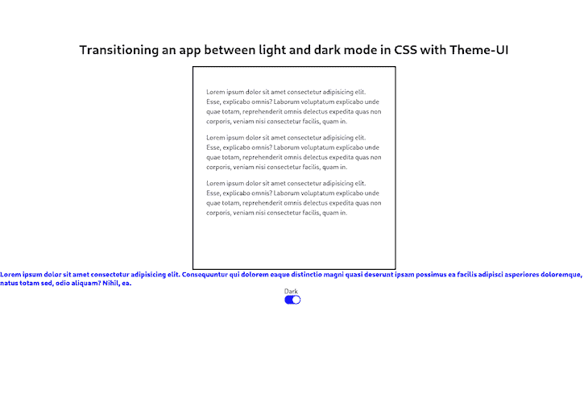
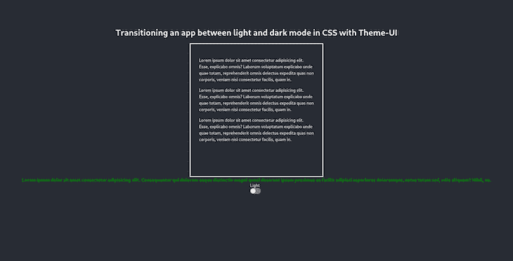
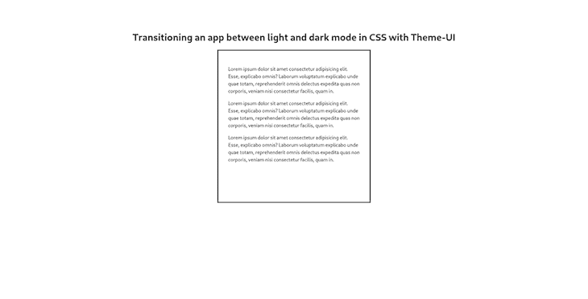

# 使用主题用户界面在 CSS 中的亮暗模式之间转换 React 应用程序

> 原文：<https://blog.logrocket.com/react-light-dark-mode-css-theme-ui/>

能够在明亮和黑暗模式之间转换我们的 React 应用程序已经成为当今世界的必需品，像主题 UI 这样的工具可以帮助我们实现这一点。毕竟，现在不仅仅是开发者更喜欢深色，用户也希望能够在浅色和深色主题之间进行选择。

每当我在应用程序中看到它适用时，我自己就设置为黑暗模式；它看起来很光滑，看起来很舒服，如果我不喜欢它，我可以随时换回更轻的版本。所以，对于我们开发者来说，越来越多的用户希望他们的应用程序有这样的选择并不奇怪。此外，仅从技术角度来看，这表明该团队考虑充分，为用户体验付出了额外的努力，这是当今吸引和留住用户的一个至关重要的方面。

在本文中，我们将构建一个 React 应用程序，它可以使用[主题 UI](https://blog.logrocket.com/build-react-custom-component-library-theme-ui/) 从亮模式过渡到暗模式。

*向前跳转:*

## 项目概述和安装

我们将创建一个简单的卡片，它有一个文本组件和一个标题。卡片下面还会有一部分蓝色文本，当我们通过单击按钮切换模式时，卡片文本和标题将变为深色模式，而蓝色文本将变为绿色，以展示我们可以实现的对比度。

这是我们将要建造的最终版本:

### 灯光模式



### 黑暗模式



什么是主题 UI？

## 主题用户界面是一个库，可以使用基于约束的设计原则来创建主题用户界面。定制组件库、web 应用、Gatsby 主题、设计系统等等都可以使用这个工具来构建。

换句话说，它是一个组件库，类似于大多数开发人员熟悉的组件库，如 Bootstrap、Chakra UI 等。在我看来，主题 UI 最可爱的地方——也是本教程的主要原因——是它强大的`sx prop`和本机挂钩，可以无缝地处理颜色变化。

现在，事不宜迟，让我们开始创建我们的应用程序吧！

创建我们的 React 应用

## 在本教程中，我们将使用 ReactJS。让我们从搭建 React 应用程序开始，在终端中输入以下命令:

`npx create-react-app darkmode-tutorial`

你可以给这个项目起你认为合适的名字。在我们的项目创建完成后，让我们通过输入以下命令进入它:

`cd darkmode-tutorial`

然后，让我们通过在项目的根文件夹中输入以下命令来安装主题 UI 及其相关的依赖项:

`npm install theme-ui @emotion/react`

安装完成后，进入我们的`src`文件夹中的`index.js`文件，用主题 UI 包装我们的 React 应用程序。我们先这样导入`ThemeProvider`:

`import { ThemeProvider } from "theme-ui";`

然后，用 ThemeProvider 包装我们的`App`组件:

至此，我们已经将 ThemeProvider 包装到了应用程序中。下一步，我们将创建一个包含我们的配色方案的`theme`文件，并将它作为 props 在 ThemeProvider 中传递，这样我们就可以在整个应用程序中使用我们定义的方案。

```
ReactDOM.createRoot(document.getElementById("root")).render(
  <React.StrictMode>
    <ThemeProvider>
      <App />
    </ThemeProvider>
  </React.StrictMode>
);

```

创建主题文件

## 为了使用主题 UI 的全部功能，我们将在我们的`src`文件夹中创建一个`theme.js`，并像这样定义我们的配色方案:

如你所见，我们在这里做的是创建一个`theme`常量，并在导出它之前定义我们的颜色。由于我们已经将`initialColorMode`定义为`light`，我们的应用程序的默认配色方案将是浅色，当我们将模式更改为`dark`时，我们在代码中概述的相应更改将会发生。

```
// import type { Theme } from "theme-ui";
const theme = {
  initialColorMode: "light",
  colors: {
    text: "black",
    background: "white",
    primary: "#1408e6",
    inverseText: "blue",
    modes: {
      dark: {
        text: "white",
        background: "#282c34",
        primary: "#8fceff",
        inverseText: "green",
      },
    },
  },
};

export default theme;

```

例如，`black`文本将变成`white`，`white`背景将采用我们为`#282c34`提供的颜色。

在处理`sx prop`时，我们将使用`inverseText`属性——现在不要用这个来烦自己，我们稍后会对此进行更深入的讨论。

现在，既然我们有了`theme.js`文件，让我们回到`index.js`并将它作为道具传递给我们的应用程序，以便在我们喜欢的任何地方使用它:

如你所见，我在这里做的是导入主题(`import theme from "./theme";`)并在`ThemeProvider`中将其作为道具传递，就像这样:

```
import React from "react";
import ReactDOM from "react-dom/client";
import App from "./App";
import "./index.css";
import { ThemeProvider } from "theme-ui";
import theme from "./theme";

ReactDOM.createRoot(document.getElementById("root")).render(
  <React.StrictMode>
    <ThemeProvider theme={theme}>
      <App />
    </ThemeProvider>
  </React.StrictMode>
);

```

既然我们已经将 theme.js 文件作为道具传递，并且可以在我们的应用程序中使用它，我们就可以开始使用 App.js 文件了。

```
<ThemeProvider theme={theme}>
  <App />
</ThemeProvider>

```

使用 App.css 设置样式

## 但是，在开始使用 App.js 文件之前，让我们添加一些样式，以确保我们的应用程序在构建时看起来不错。我们将在编码过程中添加相关的类。

更多来自 LogRocket 的精彩文章:

* * *

### 使用 App.js

* * *

```
.App {
  height: 100vh;
  display: flex;
  flex-direction: column;
  align-items: center;
  margin-top: 5rem;
}
.boxes {
  display: flex;
  flex-direction: row;
  justify-content: space-around;
}
.box {
  border: solid;
  width: 500px;
  height: 500px;
}

.para {
  line-height: 1.5rem;
  margin-top: 1rem;
}

```

## 正如我之前提到的，我们的应用程序将在一个框中包含一些虚拟文本和一个在黑暗和光明模式之间切换的开关按钮。因此，让我们转到我们的`App.js`文件并导入以下内容:

我们将使用`useState`钩子来处理我们的组件状态、`theme-ui`的`Box`、`Switch`和`useColorMode`，以及我们上面创建的`App.css`文件。这个导入(`/** @jsxImportSource theme-ui */`)是为了使用主题 UI 强大的`sx prop`；是的，它是被注释掉的。

```
import React, { useState } from "react";
/** @jsxImportSource theme-ui */
import { Box, Switch, useColorMode } from "theme-ui";
import "./App.css";

```

由于主题 UI 像标准的 UI 库一样工作，我们可以使用`Box`和`Switch`轻松地创建组件。让我们开始填充组件:

我们从定义`useColorMode`钩子开始。它的工作方式几乎与本机的`useState`钩子 React 完全一样(我们在下面的代码行中调用它来将状态设置为浅色方案)。

```
const App = () => {
  const [colorMode, setColorMode] = useColorMode();
  const [state, setState] = useState("light");
  return (
    <div className="App">
      <h1>
        Transitioning an app between light and dark mode in CSS with Theme-UI
      </h1>
      <div className="boxes">
        <Box p={4} color="text" bg="transparent" className="box">
          <div className="para">
            Lorem ipsum dolor sit amet consectetur adipisicing elit. Esse,
            explicabo omnis? Laborum voluptatum explicabo unde quae totam,
            reprehenderit omnis delectus expedita quas non corporis, veniam nisi
            consectetur facilis, quam in.
          </div>{" "}
          <div className="para">
            Lorem ipsum dolor sit amet consectetur adipisicing elit. Esse,
            explicabo omnis? Laborum voluptatum explicabo unde quae totam,
            reprehenderit omnis delectus expedita quas non corporis, veniam nisi
            consectetur facilis, quam in.
          </div>{" "}
          <div className="para">
            Lorem ipsum dolor sit amet consectetur adipisicing elit. Esse,
            explicabo omnis? Laborum voluptatum explicabo unde quae totam,
            reprehenderit omnis delectus expedita quas non corporis, veniam nisi
            consectetur facilis, quam in.
          </div>
        </Box>{" "}
      </div>

```

在我们的 return 语句中，我们有一个类为`App`的包装器 div，一个`h1`标签，另一个类为`boxes`的包装器 div，以及一个内部的`Box`组件。这个来自主题用户界面的`Box`确保我们的文本被很好地隐藏在里面。

如果一切顺利，我们的应用程序在当前阶段应该是这样的:



在接下来的步骤中，我们将添加另一个文本和切换按钮，以便在颜色模式之间进行切换。

sx prop

### 还记得我们在`theme.js`文件中定义了一个`inverseText`属性吗？现在是时候使用它了。

sx prop 允许您使用主题中的值来内联样式化元素。对于那些曾经使用过样式化组件的人来说，这应该很熟悉。基本上，您可以编写内联 CSS 并使用您在`theme.js`文件中定义的值，这正是我们现在要做的。

仍然在`App.js`中，从我们停止的地方继续，让我们添加另一个片段:

现在，对于这个`sx prop`，我们已经手动定义了`fontWeight`和`fontSize`，但是对于文本`color`，我们调用了之前在`theme.js`中定义的`inverseText`属性。

```
<div sx={{ fontWeight: "900", color: "inverseText", fontSize: "17px" }}>
  Lorem ipsum dolor sit amet consectetur adipisicing elit. Consequuntur qui
  dolorem eaque distinctio magni quasi deserunt ipsam possimus ea facilis
  adipisci asperiores doloremque, natus totam sed, odio aliquam? Nihil, ea.
</div>

```

如果我们回头检查它是如何定义的，我们会看到在亮模式下它被定义为`blue`，而在暗模式下它变成了`green`。这看起来很丑，我知道，但这是一个很好的方式来轻松地显示对比！

添加交换机功能

### 现在，我们几乎拥有了我们需要的一切。我们只需添加从主题 UI 导入的`Switch`按钮，并在其上添加一个 click 事件来处理更改。查看以下片段:

为了改变颜色，我们实际上并不需要 React 的`useState`钩子，我只是想用它来创建一个条件文本，表明点击按钮后将会出现哪种配色方案。所以如果，状态是`light`，文本会说`dark`，反之亦然。

```
<div>
  <div>{state === "light" ? <div> Dark</div> : <div>Light</div>}</div>
  <Switch
    onClick={() => {
      setColorMode(colorMode === "light" ? "dark" : "light");
      setState(colorMode === "light" ? "dark" : "light");
    }}
  />
</div>

```

在我们的`onClick`事件中，我们使用三元运算符定义一个 if 语句:如果`colorMode`是`light`，则变成`dark`。正如你所看到的，`setColorMode`钩子的工作方式和`setState`完全一样，所以对于 React 开发者来说应该不会有什么困惑。

App.js 的最终版本

## 这是我们的`App.js`文件的最终版本——您可以将它与您自己的进行比较:

结论

```
import React, { useState } from "react";
/** @jsxImportSource theme-ui */
import { Box, Switch, useColorMode } from "theme-ui";

import "./App.css";

const App = () => {
  const [colorMode, setColorMode] = useColorMode();
  const [state, setState] = useState("light");
  return (
    <div className="App">
      <h1>
        Transitioning an app between light and dark mode in CSS with Theme-UI
      </h1>
      <div className="boxes">
        <Box p={4} color="text" bg="transparent" className="box">
          <div className="para">
            Lorem ipsum dolor sit amet consectetur adipisicing elit. Esse,
            explicabo omnis? Laborum voluptatum explicabo unde quae totam,
            reprehenderit omnis delectus expedita quas non corporis, veniam nisi
            consectetur facilis, quam in.
          </div>{" "}
          <div className="para">
            Lorem ipsum dolor sit amet consectetur adipisicing elit. Esse,
            explicabo omnis? Laborum voluptatum explicabo unde quae totam,
            reprehenderit omnis delectus expedita quas non corporis, veniam nisi
            consectetur facilis, quam in.
          </div>{" "}
          <div className="para">
            Lorem ipsum dolor sit amet consectetur adipisicing elit. Esse,
            explicabo omnis? Laborum voluptatum explicabo unde quae totam,
            reprehenderit omnis delectus expedita quas non corporis, veniam nisi
            consectetur facilis, quam in.
          </div>
        </Box>{" "}
      </div>
      <div sx={{ fontWeight: "900", color: "inverseText", fontSize: "17px" }}>
        Lorem ipsum dolor sit amet consectetur adipisicing elit. Consequuntur
        qui dolorem eaque distinctio magni quasi deserunt ipsam possimus ea
        facilis adipisci asperiores doloremque, natus totam sed, odio aliquam?
        Nihil, ea.
      </div>
      <div>
        <div>{state === "light" ? <div> Dark</div> : <div>Light</div>}</div>
        <Switch
          onClick={() => {
            setColorMode(colorMode === "light" ? "dark" : "light");
            setState(colorMode === "light" ? "dark" : "light");
          }}
        />
      </div>
    </div>
  );
};

export default App;

```

## 就是这样，伙计们！主题用户界面为我们提供了一种快速简单的方式来处理黑暗模式的功能，这些功能对于提供积极的用户体验来说是必不可少的。

在本教程中，我向您展示了如何实现颜色改变功能，如何从主题 UI 导入组件，以及如何使用它的 sx prop，这与样式化组件有相似之处。

我希望你喜欢阅读——保持平静和快乐的编码！

使用 LogRocket 消除传统反应错误报告的噪音

## 是一款 React analytics 解决方案，可保护您免受数百个误报错误警报的影响，只针对少数真正重要的项目。LogRocket 告诉您 React 应用程序中实际影响用户的最具影响力的 bug 和 UX 问题。

[LogRocket](https://lp.logrocket.com/blg/react-signup-issue-free)

自动聚合客户端错误、反应错误边界、还原状态、缓慢的组件加载时间、JS 异常、前端性能指标和用户交互。然后，LogRocket 使用机器学习来通知您影响大多数用户的最具影响力的问题，并提供您修复它所需的上下文。

[ ](https://lp.logrocket.com/blg/react-signup-general) [  ](https://lp.logrocket.com/blg/react-signup-general) [LogRocket](https://lp.logrocket.com/blg/react-signup-issue-free)

关注重要的 React bug—[今天就试试 LogRocket】。](https://lp.logrocket.com/blg/react-signup-issue-free)

Focus on the React bugs that matter — [try LogRocket today](https://lp.logrocket.com/blg/react-signup-issue-free).