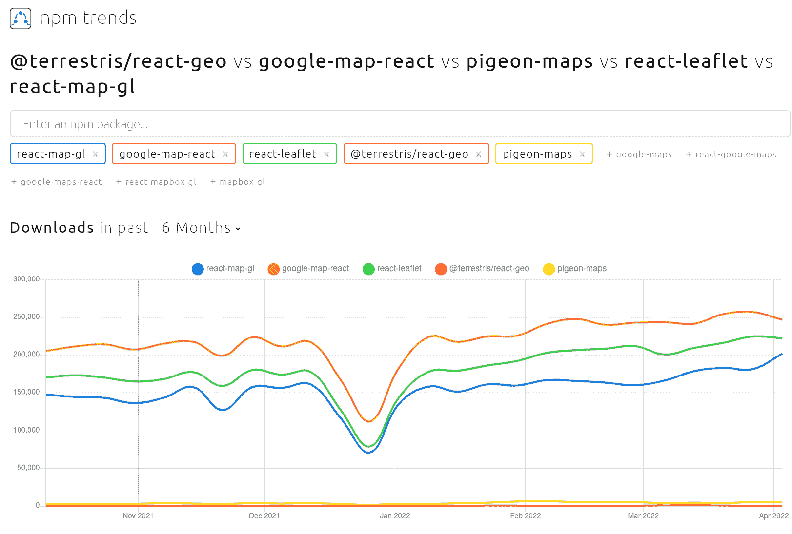
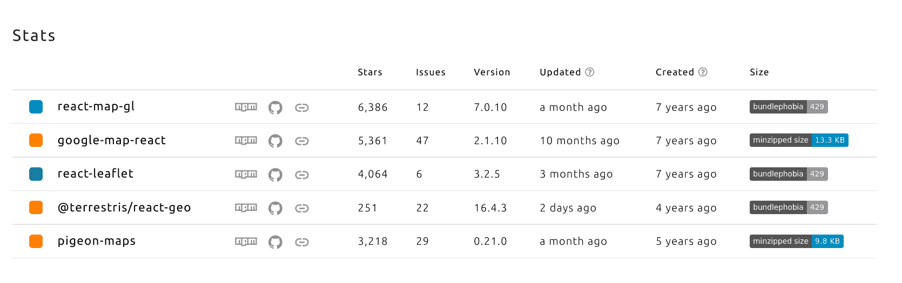

# React 地图库比较

> 原文：<https://blog.logrocket.com/react-map-library-comparison/>

***编者按:*** *本文于 2022 年 5 月 11 日更新，提供各特色库的最新信息。*

## 介绍

在 React 应用中实施有效、高效和可持续的地图解决方案可能是一项艰巨的任务。如果您的具体用例允许，最好利用现有的解决方案，而不是重新发明轮子。

在本帖中，我们将调查几个现有的 React 地图库，并根据功能、技术和易用性对它们进行比较。

## 应该对比哪些图书馆？

每当我必须决定使用什么库或框架时，我的第一步就是查看 Github“棒极了”的库。Github Awesome 资源库是一个巨大的集合，包含了针对特定框架或编程语言的“所有令人惊叹的东西”。一些著名的 awesome 库包括 [Awesome React](https://github.com/enaqx/awesome-react) 、 [Awesome Vue](https://github.com/vuejs/awesome-vue) 、 [Awesome Graphql](https://github.com/chentsulin/awesome-graphql) 和 [Awesome JavaScript](https://github.com/sorrycc/awesome-javascript) 。点击查看所有牛逼软件库的完整列表[。](https://github.com/sindresorhus/awesome)

在本文中，我使用了令人敬畏的 React 存储库。在 maps 类别下，总共列出了 11 个不同的 React 映射库、组件和包装器。在 Awesome React 上列出的 11 个库中，有 6 个被排除在比较之外，因为它们已经将近一年多没有更新了。这通常表明项目已经贬值或被放弃。

这样我们就剩下五个库了，这对于比较来说还是很多的。然而，经过一番考虑后，我决定忽略这五个中的任何一个都是不公平的，因为它们中的大多数仍在积极开发中，并且每一个都有不同的功能、模块和组件。

### 内容

## 每个库的概述

### 反应-地图-总帐

[React-map-gl](https://github.com/uber/react-map-gl) 是一套 React 组件，用于 [Mapbox GL JS](https://blog.logrocket.com/how-to-use-mapbox-gl/) ，这是一个基于 WebGL 的矢量和栅格切片映射库。

除了向 React 应用程序展示 MapboxGL 功能，react-map-gl 还与 [deck.gl 无缝集成。](https://deck.gl)这个库和 deck.gl 一样，最初是由优步开发和维护的。然而，它目前是在开放治理模型下维护的，其他几个地理空间数据可视化库都以 deck.gl 为中心。

### 谷歌地图反应

[谷歌地图反应](https://github.com/google-map-react/google-map-react)是一个覆盖了一小部分[谷歌地图 API](https://developers.google.com/maps/) 的组件。它允许您在 Google 地图上呈现任何 React 组件。它是完全同构的，可以在服务器上呈现。

此外，即使没有加载 Google Maps API，它也可以在浏览器中呈现地图组件。它使用一种内部的、可调整的悬停算法——地图上的每个对象都可以悬停。

### 反应传单

[React 小叶](https://github.com/PaulLeCam/react-leaflet)提供了[小叶](https://blog.logrocket.com/react-leaflet-tutorial/)作为 React 组件的抽象。它并不取代传单，只是利用 React 的生命周期方法来调用相关的传单处理程序。

### 反应-地理

[一套地理相关组件](https://github.com/terrestris/react-geo)与 React、 [Ant Design](https://blog.logrocket.com/data-visualization-with-react-ant-design/) 和 OpenLayers 结合使用。

### 鸽子地图

你是否厌倦了等待三秒钟来解析 200kb 的 Google Maps JavaScript，只是为了显示几个图块和一个标记？140kb 的小册子太多了吗？欢迎加入俱乐部！鸽子地图的目标是提供一个性能第一、以反应为中心、可扩展的地图引擎。

有了上面的信息，我们就可以根据项目需求来删除某些库了。例如，如果一个项目要求该项目使用免费的开源软件，那么可以缩小库的选择范围，只使用 OpenStreetMap。

如果该项目已经使用了许多谷歌产品，并希望留在这个生态系统中，那么只需要考虑使用谷歌地图的图书馆。

## 统计数据和趋势

让我们快速浏览一下 npm 趋势，这将根据过去六个月的下载次数，显示每个图书馆的受欢迎程度:

从上图可以清楚地看出，五个图书馆的下载量之间存在一些差异，从几百到近三十万不等。

下载的数量总是作为一个图书馆受欢迎程度的一个很好的指标，但它绝对不应该是决定性的因素。

以下是每个图书馆的统计数据(也来自 npm trends):

另一个衡量受欢迎程度的指标是一个库在 GitHub 上被“标星”的次数。但是，GitHub 明星和社交媒体的点赞类似。因此，不要把你的选择仅仅建立在他们或任何其他单一的衡量标准上。从上表可以看出，react-leaflet 的恒星数量大约是鸽子地图的 1.3 倍，但下载量却是鸽子地图的 40 倍左右。

尺寸是另一个需要记住的重要因素。大多数库都相对较小，只有 react-map-gl 例外，它有 212.6 KB。如果尺寸很重要，那这绝对不行。

从上表中我们还可以看出，除了 Google Map React 在大约十个月前进行了最后一次更新之外，所有的库都在积极开发中。你可以看看 npm trends 的 l [atest 统计数据。](https://www.npmtrends.com/react-map-gl-vs-google-map-react-vs-react-leaflet-vs-@terrestris/react-geo-vs-pigeon-maps)

## 技术和功能

### 反应-地图-总帐

*   地图解决方案:地图框
*   成本:一个非常慷慨的免费层，但价格可以在这里找到
*   文档和演示:清晰简洁的文档和优秀的编码示例可以在这里找到

#### 功能

React-map-gl 向 React 应用程序公开整个 Mapbox GL JS 功能。React-map-gl 还与 deck.gl 无缝集成。这意味着这个库包含了很多功能。它涵盖了事件、交互处理程序、用户界面以及所有地理和几何功能。

#### 外卖食品

这个库最初是由优步开发的，但目前是在开放治理模式下维护的。它可能比大多数项目需要的功能更多。地图可以动态设计，航路点可以通过相机转换平滑地动画化，从热图到聚类的一切都可以在地图上绘制出来。

如果您的应用程序非常注重地图，并且当它突破免费层时有预算，那么这个解决方案绝对值得一试。

### 谷歌地图反应

*   地图解决方案:谷歌地图
*   成本:此处提供[价格](https://cloud.google.com/maps-platform/pricing/)
*   文档和演示:有限的文档，但是可以在[这里](https://github.com/google-map-react/google-map-react)找到涵盖大多数用例的优秀示例

#### 功能

这个库是建立在一组有限的 Google Maps API 之上的，公开了非常小的一组功能。它允许您在 Google 地图上呈现任何 React 组件。它是完全同构的，可以在服务器上呈现，也可以在客户端呈现。此外，即使没有加载 Google Maps API，它也可以在浏览器中呈现地图组件。

#### 外卖食品

这个库允许你在谷歌地图上渲染 React 组件，基本上就是这样。因此，如果您正在构建一个目录列表应用程序(想想 AirBnb)，那么这个库将是一个很好的选择。

虽然功能有限，但它允许点击/悬停交互、自定义标记和事件交互。

* * *

### 更多来自 LogRocket 的精彩文章:

* * *

关于定价选项，人们需要考虑是否值得为如此有限的功能实现谷歌地图，因为人们可以很容易地通过免费解决方案实现类似的功能。

虽然这个项目在过去的一年中已经更新过，但是您应该知道最近在[项目库](https://github.com/google-map-react/google-map-react)上没有太多的活动。

### 反应传单

*   地图解决方案:与提供商无关，这意味着您可以使用任何地图提供商，只要您遵守其使用条款
*   成本:你可以使用免费的解决方案，比如 OpenStreetMap，或者商业解决方案
*   文档和演示:文档涵盖了所有的功能。Git 资源库中有一些编码示例，但是我没有在网上找到任何演示。文档和编码示例可以在[这里](https://react-leaflet.js.org/)找到

#### 功能

该库建立在 fleed . js 插件的基础上，该插件本身包含了许多功能，包括事件、交互处理程序、用户界面、矢量图层以及所有地理和几何功能。

#### 外卖食品

如果您的项目需要免费的开源替代方案，如开放街道地图，这是一个极好的解决方案，但它不会将您绑定到任何单一的地图解决方案。

构建它的 fleet . js 库功能丰富。它还有一个很棒的插件和扩展生态系统，可以很容易地集成到一个解决方案中。如果开源——以及一些重要的功能——是一个项目需求，那么这个库绝对是一个好的选择。

再说一次，我觉得这个库是面向更严肃的地图应用的，如果所有的功能都不是必需的，就不应该实现。

### 反应-地理

*   地图解决方案:使用 OpenLayers 构建，可用于 OpenStreetMap-project 和商业产品，如 Bing 地图或 Google 地图
*   成本:你可以使用免费的解决方案，比如 OpenStreetMap，或者其他商业解决方案
*   文档和演示:每个组件的完整文档和很棒的编码演示可以在这里找到

#### 功能

该库结合了 OpenLayers 框架和 Ant 设计库中的可用功能。OpenLayers 框架具有丰富的特性和功能。和 MapBox 一样，它的功能包括从事件、样式和交互的所有东西。

#### 外卖食品

这个库感觉像是在尝试做每件事的一点点，但是做的还不够。它以 Ant 设计的形式将地图功能与用户界面功能结合起来。

就我个人而言，我有点反对一个库把一个设计系统强加给一个项目，但是如果一个人已经在使用 Ant 设计框架，这可能是一个好处。

它是用 OpenLayers 构建的，因此是免费和开源的。

### 鸽子地图

地图解决方案:OpenStreetMap
费用:免费使用 OpenStreetMap
文档和演示:有限的文档和演示可以在[这里找到](https://pigeon-maps.js.org/)

#### 功能

这个库拥有所有的基本功能和更多。它不像我们已经讨论过的其他一些库那样功能丰富，所以对于任何更高级的场景，这可能不是您的最佳选择。

但是在看 API 之前不要把它一笔勾销，它有很多功能，包括叠加、触摸交互和事件处理。

#### 外卖食品

这个库旨在提供一个性能第一的、以 React 为中心的可扩展地图引擎，而不需要等待 Google Maps 加载的巨大开销。

考虑到这一点，这个库中包含的功能数量令人印象深刻。然而，我不认为它应该用来驱动一个成熟的地图应用程序。因此，如果你的项目需要高性能的、免费的开源软件，这个库就能满足你的需求。

## 比较概览图表

| 反应-地图-总帐 | 谷歌地图反应 | 反应传单 | 反应-地理 | 鸽子地图 | 大小(KB) |
| --- | --- | --- | --- | --- | --- |
| 216.8 | 13.3 | 7.1 | ？？ | 7.0 | 已关闭的问题 |
| 821 | 784 | 717 | 121 | 61 | 开放的问题 |
| 13 | 70 | 5 | 12 | 29 | 地图解决方案 |
| [地图框](https://www.mapbox.com/) | [谷歌地图](https://developers.google.com/maps/documentation) | 与提供商无关 | [OpenLayers](https://openlayers.org/) | [OpenStreetMap](https://wiki.openstreetmap.org/wiki/Main_Page) | 费用 |
| 按使用付费 | 按使用付费 | 免费/按使用付费 | 自由的 | 自由的 | 证明文件 |
| 伟大的 | 有限的 | 好的 | 好的 | 有限的 | 结论 |

## 每个库都有自己的优缺点，在为特定项目选择合适的库时，您需要考虑这些优点和缺点。

您使用的库应该真正依赖于项目。这可能因预算、功能、定制和许可而异。

从事预算有限的项目的开发人员可能会考虑免费解决方案，而从事基于免费解决方案的项目的人现在可能会考虑迁移到功能更丰富的商业解决方案。

[LogRocket](https://lp.logrocket.com/blg/react-signup-general) :全面了解您的生产 React 应用

## 调试 React 应用程序可能很困难，尤其是当用户遇到难以重现的问题时。如果您对监视和跟踪 Redux 状态、自动显示 JavaScript 错误以及跟踪缓慢的网络请求和组件加载时间感兴趣，

.

[try LogRocket](https://lp.logrocket.com/blg/react-signup-general)

LogRocket 结合了会话回放、产品分析和错误跟踪，使软件团队能够创建理想的 web 和移动产品体验。这对你来说意味着什么？

  

LogRocket 不是猜测错误发生的原因，也不是要求用户提供截图和日志转储，而是让您回放问题，就像它们发生在您自己的浏览器中一样，以快速了解哪里出错了。

不再有嘈杂的警报。智能错误跟踪允许您对问题进行分类，然后从中学习。获得有影响的用户问题的通知，而不是误报。警报越少，有用的信号越多。

LogRocket Redux 中间件包为您的用户会话增加了一层额外的可见性。LogRocket 记录 Redux 存储中的所有操作和状态。

现代化您调试 React 应用的方式— [开始免费监控](https://lp.logrocket.com/blg/react-signup-general)。

Modernize how you debug your React apps — [start monitoring for free](https://lp.logrocket.com/blg/react-signup-general).