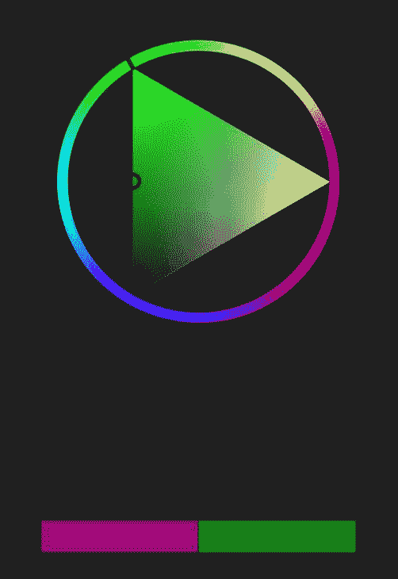
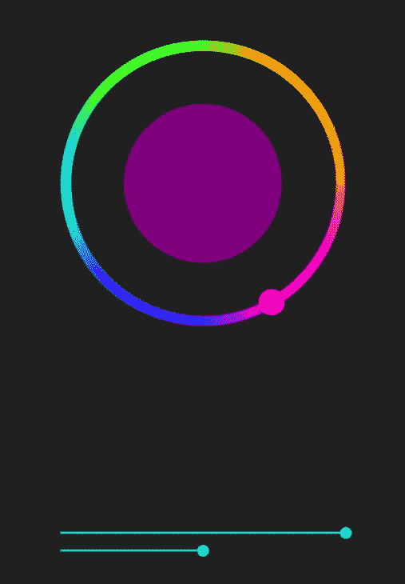
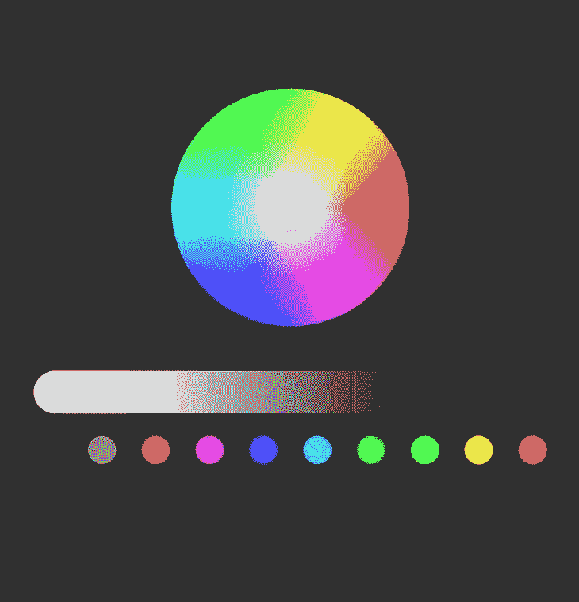
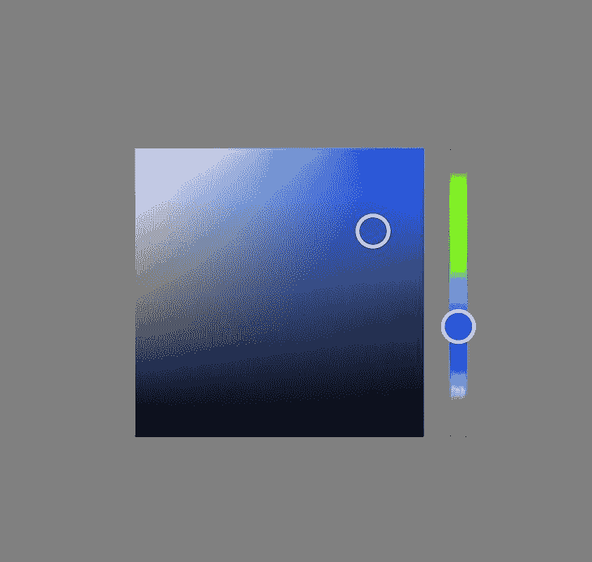
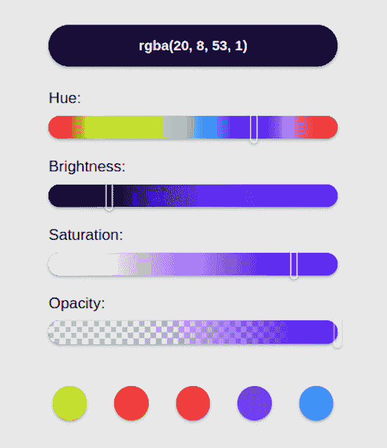
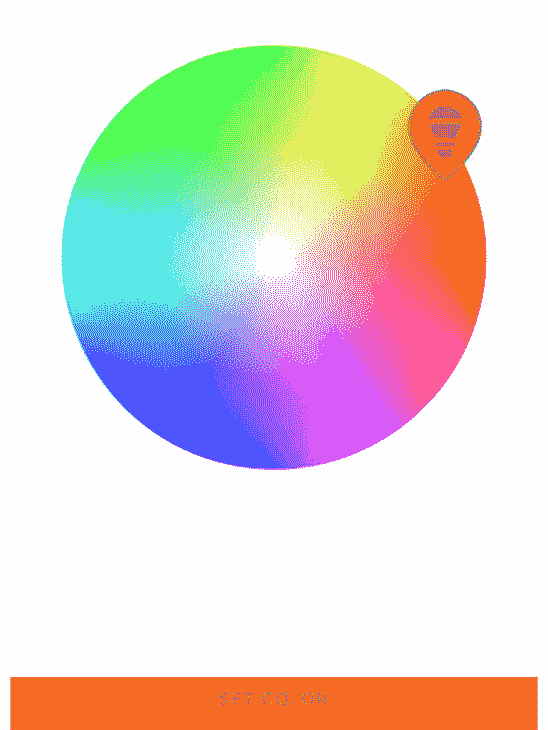

# 探索 5 个流行的 React 原生颜色选择器库

> 原文：<https://blog.logrocket.com/react-native-color-picker-libraries/>

颜色在网络和移动开发中非常重要。它们要么让页面看起来美观、流畅，要么让人看起来不舒服。

为您的应用选择正确的颜色组合可能会遇到一些令人沮丧的障碍，这并不像看起来那么容易。然而，多亏了颜色选择器库，为我们的应用程序选择正确的颜色变得越来越容易。

拾色器是软件工具或图形用户界面(GUI)小部件，用于浏览色谱上的颜色。这些方便的工具可以帮助开发人员快速找到、预览和选择满足他们需求的颜色值。

颜色选择器库是具有广泛的颜色选项的库，并允许我们为我们的应用程序进行试验、浏览和尝试不同的颜色选项。有许多颜色选择器库可用于我们的 React 本机应用程序。

在这篇文章中，我们将看一些最好的颜色选择器库的概述。理想情况下，本文的目的是指导您为项目选择合适的库。

让我们看看 React 原生项目可用的一些颜色选择器库。这些库是根据受欢迎程度、易用性、每周下载量和易于定制来选择的。

向前跳:

## `react-native-color-picker`

`[react-native-color-picker](https://www.npmjs.com/package/react-native-color-picker)` [库](https://www.npmjs.com/package/react-native-color-picker)有两种颜色选择器类型:全息和三角形。这个库不是很复杂，使它非常直观和易于使用。此外，它每周有数千次下载，使其成为最受欢迎的颜色选择器库之一**。**

要在您的应用程序中使用`react-native-color-picker`库，请使用以下任何命令进行安装:

```
//Npm
npm install react-native-color-picker --save

// Yarn
yarn add react-native-color-picker

```

你还需要安装`@react-native-community/slider`包。这是因为 React Native 中的原生`Slider`组件已经被弃用，所以你必须[提供 slider 组件作为道具](https://blog.logrocket.com/react-slider-tutorial/)。

运行以下任一命令来安装滑块软件包:

```
// Npm
npm install @react-native-community/slider --save

// Yarn
yarn add @react-native-community/slider

```

安装完成后，您可以将其导入到应用程序的组件中，并如下调用它:

```
/* App.js */

import { ColorPicker } from 'react-native-color-picker'

const App = () => (
  <ColorPicker
    onColorSelected={color => alert(`Color selected: ${color}`)}
    style={{flex: 1}}
  />
)

```

正如我们所知，`react-native-color-picker`库有两种颜色选择器类型。要使用 holo 或三角形颜色选择器，我们必须在导入中显式指定类型。让我们看看这两种颜色选择器类型以及如何使用它们。

三角形拾色器的形状是一个圆圈内的三角形。查看如何在下面的代码中实现该选项:

```
/* Controlled Triangle Color picker */

import React, { useState } from 'react';
import { View, Text } from 'react-native';
import { TriangleColorPicker, toHsv } from 'react-native-color-picker';

export const App = () => {
  const [color, setColor] = useState(toHsv('green'));

  function onColorChange(color) {
    setColor({ color });
  }
  return (
    <View style={{ flex: 1, padding: 45, backgroundColor: '#212021' }}>
      <Text style={{ color: 'white' }}>
        React Native Color Picker
      </Text>

      <TriangleColorPicker
        oldColor="purple"
        color={color}
        onColorChange={onColorChange}
        onColorSelected={(color) => alert(`Color selected: ${color}`)}
        onOldColorSelected={(color) => alert(`Old color selected: ${color}`)}
        style={{ flex: 1 }}
      />
    </View>
  );
};

```

这将给你下面的颜色选择器。您可以使用外部圆圈调整色调，使用内部三角形调整亮度:



正如您在上面的图像中看到的，底部的栏在左侧显示以前选择的颜色，在右侧显示当前选择的颜色。这使您可以直观地比较颜色，并选择搭配良好的选项。

holo 颜色选择器是默认的颜色选择器，由一个圆形颜色选择器和一些滑块表示:

```
/* App.js */

import React, { useState } from 'react';
import { View, Text } from 'react-native';
import { ColorPicker, toHsv } from 'react-native-color-picker';

export const App = () => {
  const [color, setColor] = useState(toHsv('green'));
  function onColorChange(color) {
    setColor({ color });
  }
  return (
    <View style={{ flex: 1, padding: 45, backgroundColor: '#212021' }}>
      <Text style={{ color: 'white' }}>
        React Native Color Picker
      </Text>

      <ColorPicker
        oldColor="purple"
        color={color}
        onColorChange={onColorChange}
        onColorSelected={(color) => alert(`Color selected: ${color}`)}
        onOldColorSelected={(color) => alert(`Old color selected: ${color}`)}
        style={{ flex: 1 }}
      />
    </View>
  );
};

```

上面的代码将产生下面的颜色选择器。您可以使用外圆选择色调，并使用底部的滚动条调整饱和度和亮度。产生的颜色将显示在内圈:



## 反应原生色轮颜色选择器

[React 原生轮颜色选择器](https://github.com/naeemur/react-native-wheel-color-picker#readme)是一个纯 JavaScript 库。它是轻量级的，也就是说它体积小，适用于 Android、iOS 和网络。

这个颜色选择器使用色调和饱和度色轮和亮度滑块。当您进行调整时，颜色选择器的滚轮、滑块和色板上的动画将显示颜色的变化。

React Native Wheel Color Picker 的每周下载量比`react-native-color-picker`少，但通常每周仍有大约两千次下载，使其成为我们列表中第二大最受欢迎的颜色选择器库。

虽然这个库总体上很容易使用，但它也有一些复杂的功能。最有用的两个是样本和离散。

样本是滑块下的小点。它们代表不同的颜色类型，如蓝色、红色、绿色等等。根据用户的选择，可以关闭或打开样本。要打开或关闭它，只需将布尔值添加到颜色选择器中，如下所示:

```
<ColorPicker swatches={true} />

```

另一方面，离散表示色板的不同色调。例如，如果您从样本中选择绿色，离散组件会向您显示所选绿色的不同变化，范围从较浅到较深。您可以向拾色器添加分立元件，如下所示:

```
<ColorPicker discretes={true} />

```


上图显示了离散和样本的例子。最上面一行点包含离散点，显示所选蓝色的不同变化。底部一行点包含样本。

要使用 React 原生色轮拾色器库，请使用以下任一命令进行安装:

```
/* Npm */
npm install react-native-wheel-color-picker

/* Yarn */
yarn add react-native-wheel-color-picker

```

安装后，您可以在组件中使用这个颜色选择器库，如下所示:

```
/* App.js */

import React, {useState} from 'react';
import {SafeAreaView, StyleSheet, View} from 'react-native';
import ColorPicker from 'react-native-wheel-color-picker';

const App = () => {
  const [color, setColor] = useState('');

  const onColorChange = color => {
    setColor(color);
  };
  return (
    <SafeAreaView>
      <View style={styles.sectionContainer}>
        <ColorPicker
          color={color}
          onColorChange={(color) => onColorChange(color)}
          onColorChangeComplete={color => alert(`Color selected: ${color}`)}
          thumbSize={30}
          sliderSize={30}
          noSnap={true}
          row={false}
        />
      </View>
    </SafeAreaView>
  );
};
const styles = StyleSheet.create({
  sectionContainer: {
    marginTop: 70,
    paddingHorizontal: 24,
  },
});
export default App;

```

上面的代码将产生下面的颜色选择器，它显示了一个色轮、一个调整亮度的滑动条和一行样本。

您可以调整圆圈中的滚轮来选择颜色。同样，您可以从下面的色板或颜色类型中选择不同的颜色变化。然后，您可以使用滑块根据自己的喜好调整颜色:



## `react-native-hsv-color-picker`

`[react-native-hsv-color-picker](https://github.com/yuanfux/react-native-hsv-color-picker)` [库](https://github.com/yuanfux/react-native-hsv-color-picker)帮助你使用色调、饱和度和值(HSV)构建颜色。React Native 和 Expo 项目都支持这个库。它的每周下载量平均在 100 左右或者更多。虽然它很容易使用，但可能不如上面的其他库直观。

要在项目中安装此库，请运行以下命令之一:

```
/* Npm */
npm install react-native-hsv-color-picker --save

/* Yarn */
yarn add react-native-hsv-color-picker

```

除非您正在使用 Expo ，否则这个库有一些对等依赖项，您需要在使用它之前下载并配置。按照文档中提供的[说明为库添加必要的依赖项。](https://github.com/expo/expo/tree/master/packages/expo-linear-gradient#installation-in-bare-react-native-projects)

请参阅下面的示例代码，其中详细介绍了如何在您的应用程序中使用该库:

```
/* App.js */

import React, { useState } from 'react';
import { StyleSheet, View } from 'react-native';
import HsvColorPicker from 'react-native-hsv-color-picker';

export default App = () => {
  const [state, setState] = useState({
    hue: 0,
    sat: 0,
    val: 1,
  });

  const onSatValPickerChange = ({ saturation, value }) => {
    setState({
      sat: saturation,
      val: value,
    });
  };

  const onHuePickerChange = ({ hue }) => {
    setState({hue});
  };

  return (
    <View style={styles.container}>
      <HsvColorPicker
        huePickerHue={state.hue}
        satValPickerHue={state.hue}
        satValPickerValue={state.val}
        satValPickerSaturation={state.sat}
        onHuePickerPress={onHuePickerChange}
        onHuePickerDragMove={onHuePickerChange}
        onSatValPickerPress={onSatValPickerChange}
        onSatValPickerDragMove={onSatValPickerChange}
      />
    </View>
  );
};
const styles = StyleSheet.create({
  container: {
    flex: 1,
    backgroundColor: 'grey',
    alignItems: 'center',
    justifyContent: 'center',
  },
});

```

上面的代码会给你下面的颜色选择器。滑块允许您在不同的颜色类型之间进行选择。然后，使用该块，您可以浏览颜色变化并做出选择:



## 复活的颜色选择器

[Reanimated 颜色选择器](https://alabsi91.github.io/reanimated-color-picker/)是 React Native 的一个高度可定制的纯 JavaScript 颜色选择器库。它支持 Android、iOS、Expo 和 web。

不像其他的，这个库有一些很酷的 API，允许你定制你的颜色选择器来适应你的口味。这些 API 包括:

*   封装所有内置组件的包装器
    *   所有其他组件都被包裹或封闭在`ColorPicker`内
*   `Panel`:用于改变颜色的[色调、饱和度和亮度](https://blog.logrocket.com/using-hsl-colors-css/)的滑块
    *   分成`Panel1`、`Panel2`和`Panel3`，每个面板单独工作
*   `Preview`:允许您预览您选择的颜色组合
*   `PreviewText`:显示预览颜色文本的 React Native `Text`组件
*   `Slider`:带有四个用于改变颜色属性的滑块选项
    *   `HueSlider`:允许您调整灰度
    *   `BrightnessSlider`:允许您改变亮度或暗度
    *   `SaturationSlider`:允许您改变强度
    *   `OpacitySlider`:允许您更改透明度

要安装，请运行以下任一命令:

```
/* Npm */
npm i reanimated-color-picker

/* Yarn */
yarn add reanimated-color-picker

```

安装完成后，让我们看看如何使用下面的库:

```
/* App.js */

import React from 'react';
import { StyleSheet, View, Text } from 'react-native';
import ColorPicker, {
  Preview,
  OpacitySlider,
  BrightnessSlider,
  HueSlider,
  SaturationSlider,
} from 'reanimated-color-picker';

export default App = () => {
  return (
    <View style={styles.container}>
      <ColorPicker
        style={{ width: '75%', justifyContent: 'center' }}
        sliderThickness={30}
        thumbSize={40}
        thumbShape="pill">
        <Preview
          style={[styles.previewStyle, styles.shadow]}
          textStyle={{ fontSize: 18 }}
          colorFormat="rgba"
          hideInitialColor
        />
        <Text style={styles.sliderLabel}>Hue:</Text>
        <HueSlider
          style={[{ borderRadius: 15, marginBottom: 25 }, styles.shadow]}
        />
        <Text style={styles.sliderLabel}>Brightness:</Text>
        <BrightnessSlider
          style={[{ borderRadius: 15, marginBottom: 25 }, styles.shadow]}
        />
        <Text style={styles.sliderLabel}>Saturation:</Text>
        <SaturationSlider
          style={[{ borderRadius: 15, marginBottom: 25 }, styles.shadow]}
        />
        <Text style={styles.sliderLabel}>Opacity:</Text>
        <OpacitySlider
          style={[{ borderRadius: 15, marginBottom: 25 }, styles.shadow]}
        />
      </ColorPicker>
    </View>
  );
};
const styles = StyleSheet.create({
  container: {
    flex: 1,
    backgroundColor: '#e8e8e8',
    paddingBottom: 0,
    width: '100%',
    maxWidth: 500,
    margin: 'auto',
  },
  sliderLabel: {
    fontSize: 20,
    color: '#000',
    marginBottom: 10,
  },
  previewStyle: {
    height: 55,
    borderRadius: 50,
    marginBottom: 30,
  },
  shadow: {
    shadowColor: '#000',
    shadowOffset: {
      width: 0,
      height: 2,
    },
    shadowOpacity: 0.25,
    shadowRadius: 3.84,
    elevation: 5,
  },
});

```

在上面的代码中，我们使用四个滑块来组合各种设置，并获得更理想的颜色。我们还使用了`Preview`组件来查看结果颜色。最后，每个组件都被包装在`ColorPicker`包装器中。查看结果:



## `react-native-light-color-picker`

`[react-native-light-color-picker](https://www.npmjs.com/package/react-native-light-color-picker)` [库](https://www.npmjs.com/package/react-native-light-color-picker)适用于 Android 和 iOS。下面是安装它的命令:

```
/* Npm */
npm i react-native-light-color-picker

/* yarn */
yarn add react-native-light-color-picker

```

安装完成后，从`react-native-light-color-picker`模块导入`calcTextColor`、`CCTPicker`和`RGBPicker`:

```
/* App.js */

import React from 'react';
import { Dimensions, StyleSheet, View, SafeAreaView, Text, Button } from 'react-native';
import {
  calcTextColor,
  CCTPicker,
  RGBPicker,
} from 'react-native-light-color-picker';
const { width, height } = Dimensions.get('screen');

export default function App() {
  const [color, setColor] = React.useState('#FFFF00');
  const [value, setValue] = React.useState(0);
  const [mode, setMode] = React.useState(1);
  return (
      <SafeAreaView style={styles.SafeAreaView}>
        <View>
          <Button
            onPress={() => {
              setMode(mode === 0 ? 1 : 0);
            }}
          >
            Switch mode
          </Button>
        </View>
        {mode === 0 && (
          <>
            <RGBPicker
              value={color}
              onChangeComplete={console.log}
              onChange={setColor}
            />
            <View
              style={[
                styles.demo,
                {
                  backgroundColor: color,
                },
              ]}
            >
              <Button
                labelStyle={{
                  color: calcTextColor(color),
                }}
                onPress={() => {
                  setColor('#FF0000');
                }}
              >
                Set color
              </Button>
            </View>
          </>
        )}
        {mode === 1 && (
          <>
            <CCTPicker
              value={value}
              onChangeComplete={console.log}
              onChange={setValue}
            />
            <View
              style={[
                styles.demo,
                {
                  backgroundColor: color,
                },
              ]}
            >
              <Button
                labelStyle={{
                  color: calcTextColor(color),
                }}
                onPress={() => {
                  setValue(30);
                }}
              >
                Set value
              </Button>
              <Text style={styles.text}>{value}</Text>
            </View>
          </>
        )}
      </SafeAreaView>
  );
}
const styles = StyleSheet.create({
  SafeAreaView: {
    width,
    height,
    flex: 1,
    justifyContent: 'space-between',
    alignItems: 'center',
  },
  container: {
    width: '100%',
    height: '100%',
    flex: 1,
  },
  demo: {
    width: '100%',
    height: 100,
  },
  text: {
    alignSelf: 'center',
  },
});

```

在上面的代码中，我们通过切换`Switch mode`按钮在两个颜色选择器选项——`CCTPicker`和`RGBPicker`之间切换。查看下面的结果:


Just like in the other React Native color picker libraries, we can move around and browse through different colors using the teardrop-shaped color picker selector. When we stop moving the color picker selector, the resulting color will be logged in our console so we can copy it.

## 结论

在本教程中，我们已经了解了为什么颜色在我们的应用程序中很重要，以及各种 React 本机颜色选择器库如何帮助我们为我们的应用程序选择正确的配色方案。

当我们查看可供我们使用的不同颜色选择器库选项时，我们还探究了每个选项的独特之处。此外，我们已经看到了每个库的样子，我们如何在我们的应用程序中使用它们，以及它们如何帮助我们为我们的应用程序选择一个令人满意的颜色主题。

现在由您来选择哪个选项更简单，更符合您的需求。感谢您的阅读。

## [LogRocket](https://lp.logrocket.com/blg/react-native-signup) :即时重现 React 原生应用中的问题。

[](https://lp.logrocket.com/blg/react-native-signup)

[LogRocket](https://lp.logrocket.com/blg/react-native-signup) 是一款 React 原生监控解决方案，可帮助您即时重现问题、确定 bug 的优先级并了解 React 原生应用的性能。

LogRocket 还可以向你展示用户是如何与你的应用程序互动的，从而帮助你提高转化率和产品使用率。LogRocket 的产品分析功能揭示了用户不完成特定流程或不采用新功能的原因。

开始主动监控您的 React 原生应用— [免费试用 LogRocket】。](https://lp.logrocket.com/blg/react-native-signup)