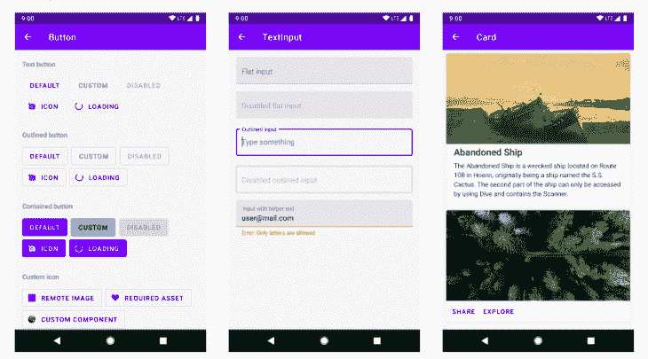
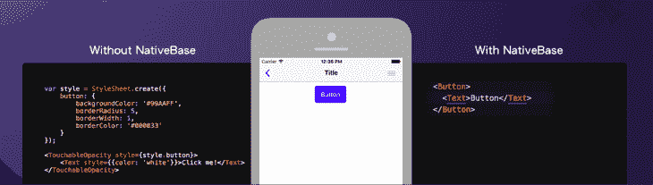
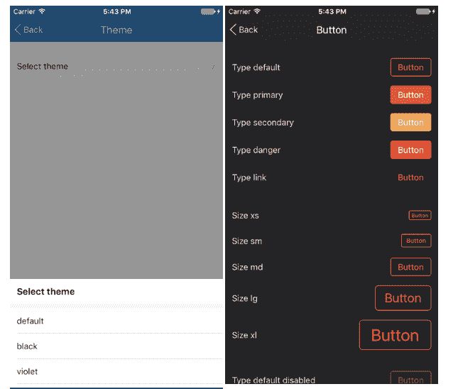
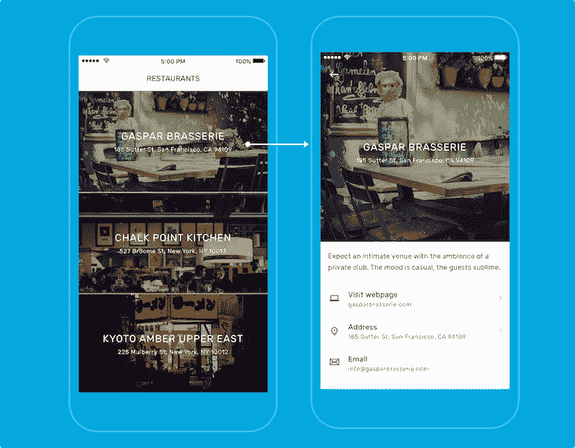
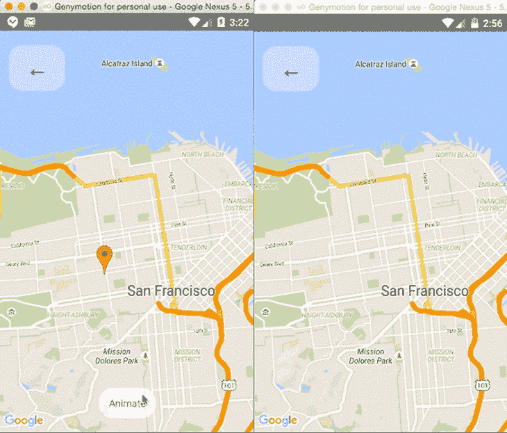

# 你应该知道的 10 个 React 原生组件库

> 原文：<https://blog.logrocket.com/react-native-component-libraries/>

***编者按**:这篇文章最后一次更新是在 2022 年 12 月 15 日，包含了更新的、更流行的库。*

在构建 React 本机应用程序时，最佳实践包括利用隔离的 UI 组件来加快开发时间。这种想法并不是本地人独有的；它实际上是一种反应哲学，一种移动框架非常依赖的哲学。

就像 React 允许开发者使用原生 HTML 元素一样，比如 div、文本输入、按钮等。React Native framework 允许开发人员使用特定于平台的原生 GUI 元素，我们可以使用这些元素来开发移动应用程序以及我们的自定义样式。但是，在某些情况下，这些内置组件不能满足我们的设计和开发目标，这意味着我们要么从头开始构建定制组件，要么使用组件库。

## 为什么要在 React Native 中使用组件库？

组件库提供预先开发的组件，帮助我们更快地交付 React 本地项目。例如，我们可以[用 react-native-vector-icons](https://blog.logrocket.com/react-native-vector-icons-fonts-react-native-app-ui/) 创建图标按钮。假设您使用一个 React 本地组件库，它提供了一个完整的 UI 工具包。在这种情况下，您不需要为内置的 UI 元素编写自定义样式，也不需要安装许多第三方的预实现组件。组件库通常为构建任何现代应用程序提供一组预先开发的、可定制的 UI 元素。

有这么多好的选项可用，决定为新的 React 本机应用程序使用哪个组件库可能是一个挑战。但是，一旦您理解了每个组件库的可用组件、特性、限制和开发人员支持，就可以更容易地根据您的设计目标选择一个。

## 最好的反应本地组件库

在本文中，我们将探索一些最好的开源 React 本地组件库。他们不仅会帮助你使用一种健壮的方法并加快你的项目交付时间，而且他们还会为 iOS 和 Android 这样的平台提供高质量的支持:

对于每个组件库，我将提供一个摘要、一些突出的特性和有用的链接，以便您可以根据您的设计目标选择一个。我们开始吧！

## 反应原生纸

[React Native Paper](https://reactnativepaper.com/) 是基于 [Google 的 Material Design](https://material.io/design) 的跨平台 React Native UI 库。React Native Paper 由 React Native 官方开发合作伙伴 [Callstack](https://github.com/callstack) 开发，支持主题化，并提供可定制和生产就绪的组件。

当使用这个库时，你可以通过使用一个 [Babel 插件](https://github.com/satya164/babel-plugin-optional-require)来减少它的包的大小，这个插件允许你选择需要的模块。这将排除您的应用程序不使用的所有模块，并重写导入语句以仅包括那些在应用程序的组件文件中导入的模块。

[React Native Paper 也支持 web](https://blog.logrocket.com/sharing-code-react-native-web/) 使用 [React Native Web](https://github.com/necolas/react-native-web) 。

### 如何使用 React 原生纸主题？

将主题应用于特定的组件很容易；React Native Paper 自带两个默认主题，分别是`light`和`dark`，你可以扩展。它还使用 [`react-native-vector-icons`库](https://github.com/oblador/react-native-vector-icons)来支持和正确使用按钮、浮动动作按钮、列表等中的图标。

### TL；博士:反应原生纸

## 反应本地元素

最古老和最容易开始的库之一， [React Native Elements](https://reactnativeelements.com/) 是一个跨平台的 UI 工具包，实现了材质设计。这个工具包不是遵循一个固执己见的设计系统，而是通过其通用的内置组件提供了一个更基本的结构，这意味着你将[更多地控制你想要如何定制组件](https://blog.logrocket.com/react-native-styling-tutorial-with-examples/)。该库中任何组件的定制将包括一些定制道具的混合，以及来自 [React 原生核心 API](https://reactnative.dev/) 的道具。

也就是说，当使用这个库时，我发现我可以比使用本文中提到的其他库编写更少的样板代码。使用这个 UI 工具包构建的应用程序在 iOS 和 Android 平台上都具有通用性。

`ThemeProvider`提供主题化支持。不像其他一些库给你明暗主题，你必须定义你的主题来让它们工作。通过使用 React Native web，还可以在 Web 项目中使用 React 本机元素。

### TL；DR:反应原生元素

## NativeBase

[NativeBase](https://nativebase.io/) 是另一个从 React Native 早期就存在的库。它支持一个很长的、丰富的跨平台 UI 组件列表，这些组件也是生产就绪的，不仅为每个常规组件提供了基本支持，还为许多组件提供了预定义的配置，几乎涵盖了所有可能的用例。

例如，[选择组件](https://docs.nativebase.io/select)呈现一个跨平台的下拉 UI 元素，并且还支持定制样式，比如:

*   使用基于下拉菜单的图标来打开和关闭状态
*   添加占位符文本
*   设置选定的值

Select 组件支持主题，并提供基于 NativeBase 组件库的付费模板，您可以使用这些模板来节省开发时间。但是，整个 UI 库都是免费开源的。

NativeBase 还提供了一个名为 [KitchenSink](https://kitchensink.nativebase.io/) 的综合演示应用，您可以通过网络浏览器浏览所有组件。

### TL；大卫:自然基础

## React 原生 UI 小猫

[UI Kitten](https://akveo.github.io/react-native-ui-kitten/) 是另一个支持 React 原生应用的开源库。它基于 [Eva 设计系统](https://eva.design/)，拥有[超过 480 个自己的](https://akveo.github.io/eva-icons/#/)图标。它支持创建定制的主题，但也允许您使用或扩展两个默认的视觉主题。

有 20 多个基本的 UI 组件可以使用，它也是少数几个为所有组件提供从右到左书写系统支持的 UI 库之一，这是全球应用程序需要注意的一个事实。它也支持网络。

如果您为一个现有的项目设置这个 UI 库，您将不得不经历一些配置步骤。对于新项目，您可以轻松使用预先开发的 [app 模板](https://akveo.github.io/react-native-ui-kitten/docs/guides/getting-started#new-apps)。确保[先阅读其设计系统](https://akveo.github.io/react-native-ui-kitten/docs/design-system/eva-design-system-intro#eva-design-system)以了解设计原则。

### TL；DR: React 原生 UI 小猫

## RNUI: React 原生 UI 库

Wix 很好地维护和使用了这个 [RNUI](https://wix.github.io/react-native-ui-lib/) 库，它是一个工具集，用于构建惊人的 React 本地应用。它支持旧版本和最新版本的 React 原生版本，并提供了 20 多个定制组件，其中一些组件，如`Drawer`，可以轻松集成以构建现代的可浏览列表，如 Gmail 应用程序的收件箱。它也有定制的动画组件，如[动画扫描仪](https://wix.github.io/react-native-ui-lib/docs/components/media/AnimatedScanner)，这对于指示卡的进度很有用，如上传状态，以及动画图像。

RNUI 是另一个支持从右向左书写系统的 UI 库，它包括完全的可访问性支持。

### 国家警察；大卫:RNUI

## 你在开玩笑吗

Teaset 是一个 UI 库，提供了 20 多个纯粹的组件，这些组件采用了最小化的设计方法。这个库的目标是让你和你的用户更关注应用程序的内容，而不是它的设计。它支持一些典型的组件，如`Input`、`CheckBox`，但同时也提供了更多不常见的组件，如`Stepper`、`Badge`、`TabView`和`DrawerView`。

在撰写本文时，对 web 的支持[还不能用于 Teaset 的](https://github.com/rilyu/teaset/issues/377)。

### TL；博士:特塞特

## Shoutem UI

如果你正在为你的 React 原生 iOS 或 Android 应用寻找一个专业外观的 UI，那么 Shoutem UI kit 是一个很好的选择。Shoutem UI 是一个开源库，是 [Shoutem UI 工具包](https://shoutem.github.io/docs/ui-toolkit/introduction)的一部分。

Shoutem UI 由超过 25 个可组合和可定制的 UI 组件组成，这些组件带有支持其他组件的预定义样式。您可以通过组合它们来构建复杂的 ui。您还可以使用 Shoutem [主题库](https://github.com/shoutem/theme)应用自定义的 CSS 样式，使用[动画组件库](https://github.com/shoutem/animation)应用动画，如`ZoomIn`、`FadeIn`等。

### TL；DR: Shoutem UI

## 洛蒂为反应土著

Lottie 是一个优秀的开源动画图形库，由 Airbnb 开发，用于创建精美的动画。Lottie 社区提供了特色动画，您可以免费用于 React 原生 iOS 或 Android 应用程序。

您还可以使用 Adobe After Effects 创建自定义动画。洛蒂然后使用 [Bodymovin](https://github.com/airbnb/lottie-web) 扩展将自定义动画导出为 JSON 格式，并在原生移动应用程序中呈现。因为 JSON 导出格式，你的 app 会有很棒的性能。

`[lottie-react-native](https://github.com/lottie-react-native/lottie-react-native)`包包含了`Lottie`组件，你可以用它在 React 原生应用中添加洛蒂动画。在内部，它使用`[lottie-android](https://github.com/airbnb/lottie-android)`和`[lottie-ios](https://github.com/airbnb/lottie-ios)`分别在 Android 和 iOS 上原生呈现洛蒂格式的文件。

### TL；医生:洛蒂对本土反应

## 反应原生地图

[React Native Maps](https://github.com/react-native-maps/react-native-maps) 是另一个有用的库，为您的 iOS 和 Android 应用程序提供可定制的地图组件。该库中的组件包括:

*   `MapView`
*   `Marker`
*   `Polygon`
*   `Polyline`
*   `Callout`
*   `Circle`
*   `HeatMap`
*   `Geojson`
*   `Overlay`

使用这些组件，您可以在地图上为用户提供不同的体验。此外，您可以将组件与动画 API 结合起来，为组件提供动画效果。例如，可以设置缩放、标记视图和标记坐标的动画，还可以在地图上渲染多边形和多段线。

但是，React 原生贴图仅与 React Native v 0 . 64 . 3 兼容。如果您计划将 React 原生贴图用于使用较旧 React 原生版本的项目，请确保更新您的 React 原生版本。

### TL；DR:反应原生地图

## React Native 天才聊天

在一些开发场景中，React 原生开发人员会在他们的移动应用程序中添加聊天屏幕。例如，像集成聊天机器人或实现用户间聊天系统这样的情况需要开发一个聊天组件，它包括带有化身的传入和传出消息、用于键入消息的文本输入和发送按钮。

react-native-gifted-chat 库提供了一个预先开发的可定制的聊天组件，您可以使用它，而不必从头开始编写。

这个聊天组件库具有以下突出的特性:

*   高度可定制的用户界面
*   有用的事件处理程序，比如`onPressAvatar`、`onInputTextChanged`等等
*   打字指示器
*   构建聊天机器人用户界面的快速回复选项
*   作曲动作，如附加照片

### TL；DR: React Native 天才聊天

## 那么，最好的 React 原生组件库是什么？

要回答这个问题，你必须考虑你自己独特的项目。如果多个组件库适合您的设计或开发目标，选择一个具有良好的开发人员支持、活跃的开发时间表和编写良好的文档的组件库是一个好的决定。

列表中包含的组件库被积极维护。这些库的存在是为了使您的开发更快，并提供一种健壮的方法来构建应用程序，这样您就不必每次创建新的 React 原生应用程序时都重新发明轮子。只要你知道你想在你的 UI 设计中实现什么，这些库中的任何一个都应该可以做到。

你可以从 [`awesome-react-native`](https://github.com/jondot/awesome-react-native#ui) GitHub 库找到更多的第三方开源 UI 组件库。有没有喜欢的 React 原生组件库？请在评论中告诉我们！

## [LogRocket](https://lp.logrocket.com/blg/react-native-signup) :即时重现 React 原生应用中的问题。

[LogRocket](https://lp.logrocket.com/blg/react-native-signup) 是一款 React 原生监控解决方案，可帮助您即时重现问题、确定 bug 的优先级并了解 React 原生应用的性能。

LogRocket 还可以向你展示用户是如何与你的应用程序互动的，从而帮助你提高转化率和产品使用率。LogRocket 的产品分析功能揭示了用户不完成特定流程或不采用新功能的原因。

开始主动监控您的 React 原生应用— [免费试用 LogRocket】。](https://lp.logrocket.com/blg/react-native-signup)