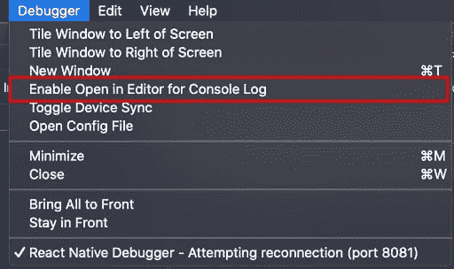
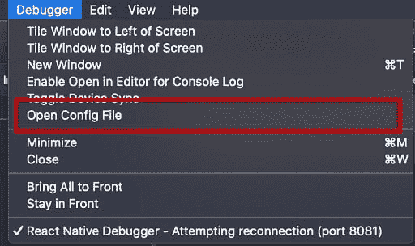

# React 本机调试器:快速调试技巧

> 原文：<https://blog.logrocket.com/react-native-debugger-fast-debugging/>

***编者按:**本帖于 2021 年 10 月更新，加入了 Apollo 客户端 DevTools，并反映了 React Native 和 React Native 调试器的当前版本。*

React 的一个主要好处是可用于这个 UI 库的渲染器的数量。React Native、React Unity 和 React VR 就是其中的几个渲染器。当你在不同的平台上开发时，分享相同的设计模式和相似的架构是很棒的。

在另一篇[帖子](https://blog.logrocket.com/redux-devtools-tips-tricks-for-faster-debugging/)中，我们讨论了一些关于 [Redux DevTool](https://chrome.google.com/webstore/detail/redux-devtools/lmhkpmbekcpmknklioeibfkpmmfibljd?hl=en) 的很酷的技巧，可以帮助你更快地调试你的 React 应用。React Native 的调试体验不止于此。

在 Redux DevTools 之上，React Native Debugger 附带了一组可以提高开发和调试速度的特性。下面是 React 本机调试的一些技巧。

## React 本机调试器中的键盘和触摸条快捷键

我们中的许多人都会同意，在专注于开发或调试时，我们喜欢避开鼠标/触控板。使用键盘快捷键是快速访问功能的一种方式。React 本机调试器附带了许多快捷方式来提高我们的工作效率。Chrome DevTools 中可用的大多数键盘快捷键在这里与 [React 原生调试器](https://github.com/jhen0409/react-native-debugger)一起工作。对于我们将在本帖中讨论的所有功能，为了方便起见，我们添加了相关的键盘快捷键。

除了键盘快捷键，它还有超级有用的功能，可以从 Macbook 的 touch bar 访问。我们可以从 touch bar 重新加载 JavaScript、切换元素和网络检查器。此外，对于使用 Redux 的应用程序， [Redux 滑块](https://github.com/reduxjs/redux-devtools)可用于在动作之间移动，也可从 touch bar 获得。

## 并行开发工具

RN Debugger 是一款基于电子的 app，将 [Chrome DevTools](https://developers.google.com/web/tools/chrome-devtools) 、 [Redux DevTool](https://chrome.google.com/webstore/detail/redux-devtools/lmhkpmbekcpmknklioeibfkpmmfibljd?hl=en) 、[React dev Tools](https://chrome.google.com/webstore/detail/react-developer-tools/fmkadmapgofadopljbjfkapdkoienihi?hl=en)和 [Apollo Client DevTools](https://chrome.google.com/webstore/detail/apollo-client-devtools/jdkknkkbebbapilgoeccciglkfbmbnfm?hl=en-US) 一起嵌入在一个地方。这是天作之合！在这里，您可以查看应用程序的各个方面。

这四个工具都提供了有用的特性，将它们结合在一起会使开发过程更加顺畅。老实说，在使用 React web 应用程序时，我非常想念这个功能。这在一个窗口中提供了应用程序状态、组件树、GraphQL 查询检查和 UI 元素的深入视图。

它还允许开发者精确地分析应用的行为。React Developer Tools 允许您检查特定组件的属性和状态，而 Redux DevTool 提供了我们商店的完整图片，最重要的是，我们的控制台日志可通过 Chrome DevTools 获得。Apollo Client DevTools 帮助我们检查 GraphQL 查询、变异和缓存。

这里简要总结了我们可以利用这些工具的优势。

## 使用 Chrome DevTools 和 React Native

默认情况下，React Native 通过其远程调试能力支持 [Chrome DevTools](https://reactnative.dev/docs/debugging#chrome-developer-tools) ，这使得拥有我们最喜欢的调试技术`console.log`成为可能。Chrome DevTools 允许我们用堆栈跟踪来查看 JS 警告和错误。RN 调试器在默认支持的基础上增加了一些特性。我们将在后面的文章中详细讨论这些。

### 切换 Chrome 开发工具的快捷键:

*   macOS: Command+Option+I
*   Windows/Linux: Ctrl+Alt+I

## Redux 开发工具

今天，包括 Twitter 在内的大多数大型应用程序都在使用 Redux 来管理 React 应用程序中的全局状态。Redux 的一个很大的优势是它是一个开发工具，可以很容易地跟踪应用程序的状态何时、何地、为何以及如何改变。我们已经介绍了使用 DevTools 更快调试 Redux 应用程序的[惊人技巧，使用 RN 调试器，您也可以在 React 原生应用程序中享受它。](https://blog.logrocket.com/redux-devtools-tips-tricks-for-faster-debugging/)

将 Redux DevTools 与 Chrome DevTools 和 React DevTool 并列，可以更容易地看到商店对组件树的影响。

### 切换 Redux 开发工具的快捷键:

*   macOS: Command+Option+j
*   Windows/Linux: Ctrl+Alt+J

## React 开发工具

React 核心团队在 [React DevTools](https://blog.logrocket.com/5-things-you-didnt-know-about-react-devtools-2c6e0ef22529/) 上投入了很多，并开发出了前端领域最好的工具之一。React DevTools 允许您深入查看组件树。您可以选择和编辑组件的当前属性和状态。这与 Redux DevTools 一起，为您提供了组件状态的完整画面，无论它是来自 Redux store 还是作为本地状态处理。

### 切换 React DevTools 的快捷键:

*   macOS: Command+Option+K
*   Windows/Linux: Ctrl+Alt+K

## 带有 React Native 的 Apollo 客户端开发工具

Apollo 是使用 GraphQL 的开发人员最喜欢的工具之一，它还构建了一个强大的生态系统来增强开发人员的能力。Apollo Client DevTool 允许您通过 Apollo 客户端实例向服务器发送查询，或者可视化 Apollo 客户端缓存并通过字段名称和/或值进行搜索。它还有助于检查和重新运行突变，以调试应用程序中的更改。

大多数网络开发人员通过 Firefox 浏览器插件或 Chrome 网络商店的扩展来使用 Apollo 客户端开发工具。对于 React 本机调试器，可以通过开发人员工具中的 **Apollo** 选项卡获得。键盘快捷键和 Chrome DevTools 一样，可以导航到 Apollo 标签页。

### 切换 Apollo 客户端开发工具的快捷键:

*   macOS: Command+Option+I
*   Windows/Linux: Ctrl+Alt+I

## 代码编辑器中的链接控制台日志

如上所述，React 原生调试器附带了嵌入式 Chrome DevTools。由于 Chrome DevTools 提到了代码中任何日志记录的来源，RN Debugger 允许我们在您的编辑器中导航到特定的日志记录代码。

此功能可从应用程序菜单中启用。为了让它工作，我们必须在 RN 调试器配置文件中定义编辑器。比如说。设置 VS 代码，我们必须在配置文件中定义`editor: code`。在这篇文章的后面，我们将研究配置文件的细节。

此功能需要从应用程序的菜单中启用。它的标题为“在控制台日志编辑器中启用打开”。

## 
网络巡查

我们的应用程序严重依赖来自服务器的数据。在开发和调试期间，我们希望监控应用程序的所有或特定网络活动。利用 Chrome DevTools 的强大功能，RN Debugger 将大部分 fetch 和 XMLHTTPRequest 记录在开发工具的 network 选项卡中。

虽然这有时可以通过使用直接与 Chrome 连接的官方远程调试器来实现，但 RN Debugger 没有多少优势使其网络检查更有价值:

*   同时监控应用程序的不同方面——我们可以在单个窗口中监控 Redux 存储、React 组件和网络活动
*   CORS！是的，RN 调试器允许您放弃可能发生的 CORS 问题
*   它支持禁止的标题名，如 origin 和 user-agent。这让我们对网络请求有了更多的控制

### 从配置启用:

默认情况下，网络检查设置为`false`，但这种行为可以通过配置文件进行更改。我们可以将`defaultNetworkInspect`设置为`true`，默认启用。

## React Native 中的异步存储管理

AsyncStorage 是 React Native 的异步、未加密、持久、键值存储系统。我们可以利用它在用户设备上永久存储应用程序的不敏感数据。它可以成为开发离线使用功能的有用工具。

为了监控和调试 AsyncStorage，RN 调试器允许您随时记录所有存储的内容。这可以从上下文菜单中完成，不幸的是，目前还没有任何快捷键。

除了记录异步存储，我们还可以使用上下文菜单中的其他选项清除它。这可以为开发人员节省大量宝贵的时间，因为从操作系统选项中清除应用程序的数据需要一些繁琐的工作。在使用诸如向新安装的用户显示 onboarding 滑块等功能时，这可能是一个非常有用的功能。

## 重新加载 JS

React 原生开发的主要优势之一是它能够加载更新的代码，而无需重新构建应用程序。在通常的 RN 应用中，我们可以从一个摇动手势后打开的开发者菜单中重新加载 JS，或者我们使用 iOS 的 Cmd+R 或 Android 的 Double R。使用 RN Debugger，这对于两个平台以及模拟器和设备都是可行的。

### 重新加载 JS 的快捷键:

*   macOS: Command+R
*   Windows/Linux: Ctrl+R

## 切换元素检查器

元素检查已经成为 UI 开发的重要部分。这使得在画布上更容易看到元素的边界和位置。

React Native 有一个元素检查器，它的工作方式类似于浏览器中的传统元素检查器。这个检查器可以通过 React 本机应用程序中的开发者菜单进行切换，但 RN Debugger 允许我们通过键盘快捷键和 Macbook 的 touch bar 进行切换。这将我们从模拟器和代码之间转移的麻烦中解救出来。

### 用于在设备或模拟器上切换元素检查器的键盘快捷键:

*   macOS: Command+I
*   Windows/Linux: Ctrl+I

## 设置配置

RN Debugger 向我们的主目录`~/.rndebuggerrc`添加了一个文件，JSON5 格式的文件允许我们根据自己的意愿调整配置。以下是我发现最有用的几个:

*   `fontFamily`:用于设置调试器字体系列
*   `zoomLevel`:调试器窗口的缩放级别；cmd++ & cmd+-用于放大和缩小
*   `autoUpdate`:用于后台更新 React 原生调试器
*   启动编辑器的 bash 命令，这个属性已经在本文中讨论过了
*   `defaultNetworkInspect`:使网络能够从调试会话开始就进行检查

可以从应用程序菜单访问该配置文件。它的标题为“打开配置文件”:

## 结论

React Native Debugger 是不同 DevTools 的完美集成，可以提高开发人员的工作效率。充分利用它，一定会有更快更好的发展。RN 调试器的哪些特性是你经常使用的，你希望在这个令人敬畏的工具中看到哪些其他特性？请在下面的评论区告诉我。

如果您使用的是 React Native 版本< 0.61，请保持到 v0.10，因为由于 React DevTools 的变化，以后的版本只支持 React Native 的更高版本。

## [LogRocket](https://lp.logrocket.com/blg/react-native-signup) :即时重现 React 原生应用中的问题。

[LogRocket](https://lp.logrocket.com/blg/react-native-signup) 是一款 React 原生监控解决方案，可帮助您即时重现问题、确定 bug 的优先级并了解 React 原生应用的性能。

LogRocket 还可以向你展示用户是如何与你的应用程序互动的，从而帮助你提高转化率和产品使用率。LogRocket 的产品分析功能揭示了用户不完成特定流程或不采用新功能的原因。

开始主动监控您的 React 原生应用— [免费试用 LogRocket】。](https://lp.logrocket.com/blg/react-native-signup)