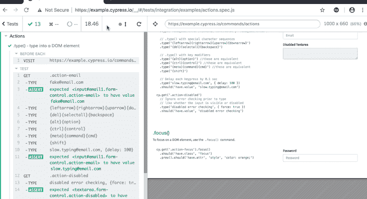
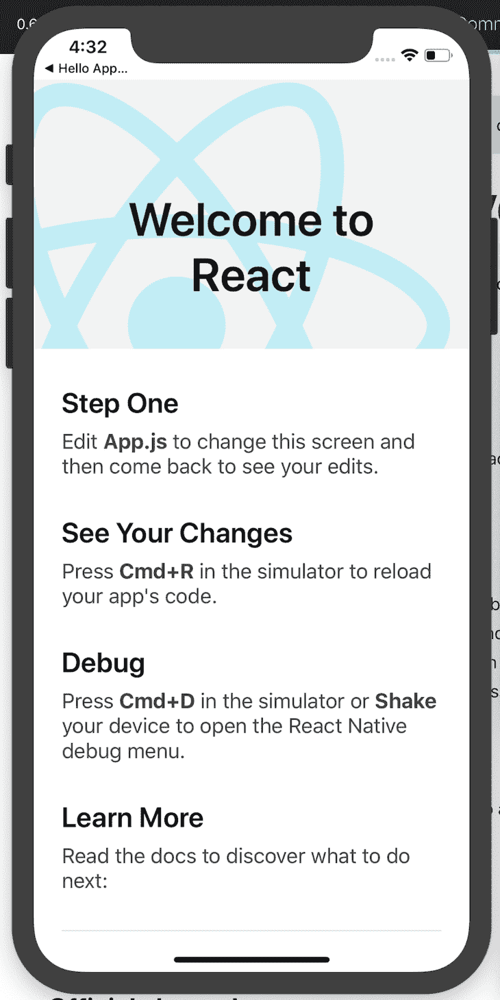
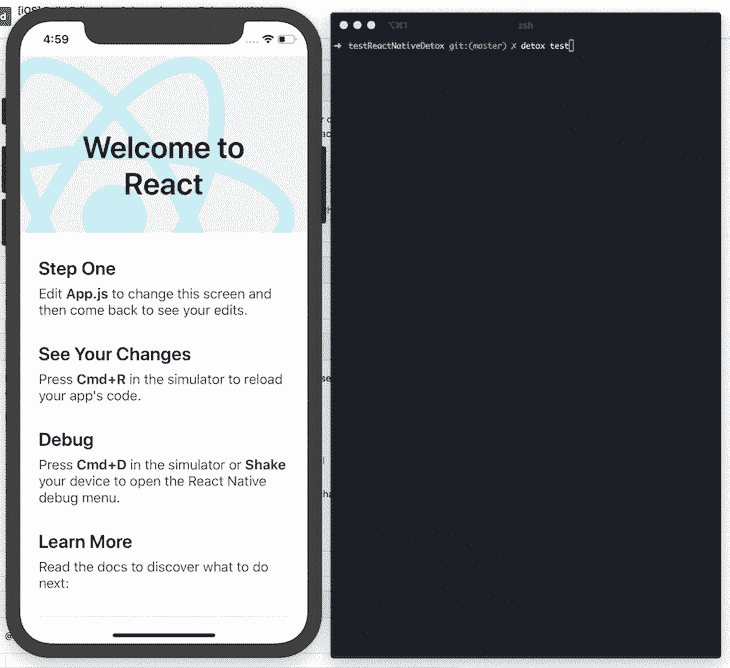
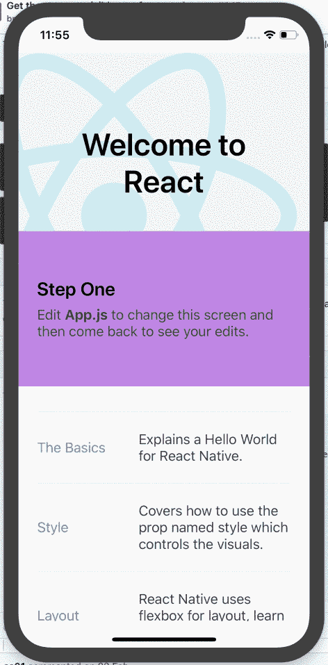
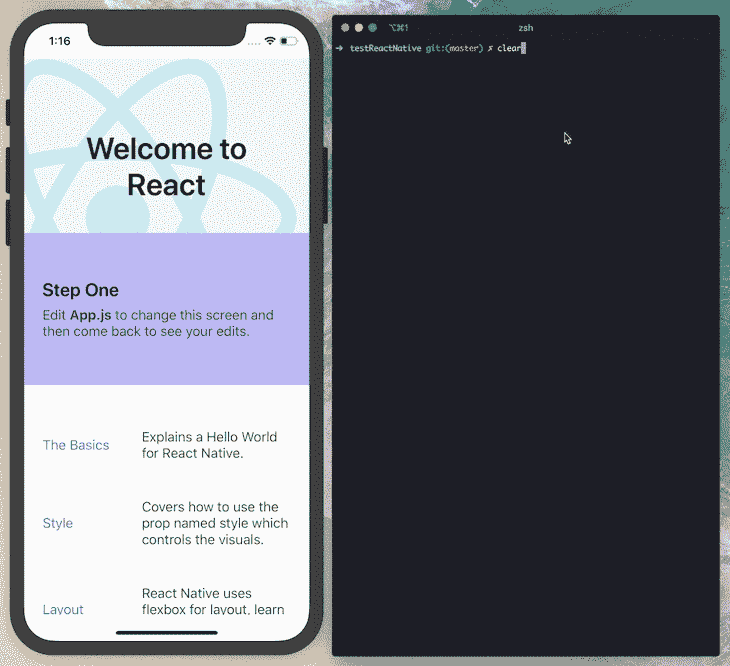
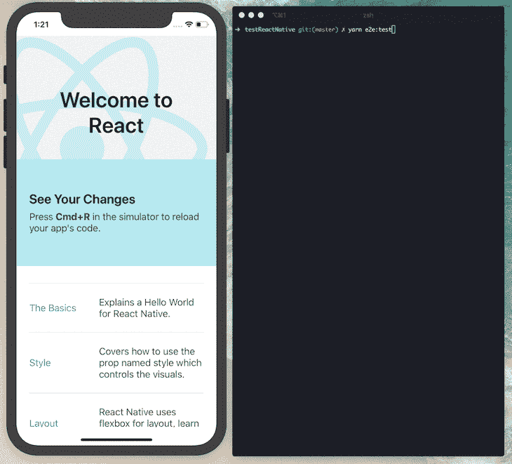
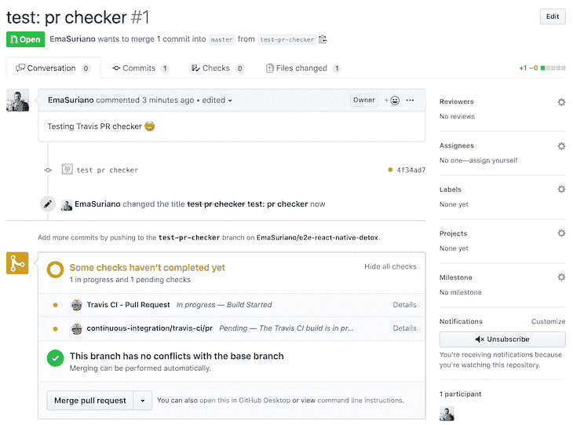

# 利用 Detox - LogRocket 博客对本地端到端测试做出反应

> 原文：<https://blog.logrocket.com/react-native-end-to-end-testing-detox/>

***编者按:**本文最后更新于 2022 年 1 月 28 日，旨在解决 React 原生工具的错误和更新。*

端到端测试是一种在 web 生态系统中广泛使用的技术，它使用了像 [Cypress](https://github.com/cypress-io/cypress) 和[puppet er](https://github.com/GoogleChrome/puppeteer)这样的框架和库。但是对于移动应用程序，端到端测试并不常见。我有一个理论，大多数移动开发者认为测试移动应用很难，需要大量的设置和配置，因此他们跳过了测试。

在本文中，我们将介绍如何在 React 原生应用中实现端到端测试框架 [Detox](https://github.com/wix/Detox) ，编写几个交互测试，最后将 Detox 集成到您的开发工作流中。为了简洁起见，我们将只关注 iOS 流程。我们开始吧！

你可以在 [GitHub 库](https://github.com/EmaSuriano/e2e-react-native-detox)获得该项目的完整代码。

### 目录

## 什么是端到端测试？

与单元测试相反，端到端测试旨在尽可能多地覆盖应用程序的功能，模拟实际的用户操作。您的测试覆盖的领域越多，它就越可靠。因此，端到端测试包括应用程序的所有阶段:设置环境、安装应用程序、初始化、执行例程以及预期事件或行为的发生。

### 使用 Cypress 进行本地端到端测试

[使用 Cypress](https://blog.logrocket.com/cypress-io-the-selenium-killer/) 的端到端测试看起来像浏览器中的下图:



通过选择元素`div`、`button`和`input`，使用本地选择器`getElementById`、`getElementByName`和`getElementByClassName`，然后触发事件`click`、`change`和`focus`，Cypress 能够创建一个 Chrome 实例，运行一个 URL，并开始与网页交互。

在测试中的任何时候，开发人员都可以`expect`发生一些事情或者`assert`一些具有特定值的事情。如果所有的期望都是`true`，测试套件的结果将是成功的。

## 移动应用中的端到端测试

测试移动应用程序的过程实际上与 web 应用程序非常相似。让我们来看一下这些步骤:

1.  在 Android 或 iOS 设备上创建模拟器的实例
2.  安装应用程序
3.  初始化应用程序
4.  执行例程
5.  预期事件

在一个移动应用程序中，使用 Detox 进行的端到端测试看起来像下面的视频:

## 什么是排毒测试框架？

Detox 是由 React 原生社区的主要贡献者之一 [Wix](https://www.wix.engineering/) 开发的端到端移动应用框架。Wix 还维护着令人惊叹的项目，如 [react-native-navigation](https://github.com/wix/react-native-navigation) 和 [react-native-ui-lib](https://github.com/wix/react-native-ui-lib) 。

Detox 提供了很好的抽象来选择和触发元素上的动作。一个普通的测试看起来像下面的代码:

```
describe('Login flow', () => {
  it('should login successfully', async () => {
    await device.launchApp();
    // getting the reference of an element by ID and expecting to be visible
    await expect(element(by.id('email'))).toBeVisible();

    // Getting the reference and typing
    await element(by.id('email')).typeText('[email protected]');
    await element(by.id('password')).typeText('123456');

    // Getting the reference and executing a tap/press
    await element(by.text('Login')).tap();

    await expect(element(by.text('Welcome'))).toBeVisible();
    await expect(element(by.id('email'))).toNotExist();
  });
});

```

如您所见，语法可读性很强，通过使用 async/await，您可以编写同步的、易于理解的测试。让我们开始演示吧！

## 设置我们的项目

为了将重点放在测试而不是设置 React Native 上，我建议使用`react-native init`引导您的项目，这将创建一个非常简单和干净的 React Native 项目。

我们将从安装依赖项并创建一个新项目开始:

```
~ npm install react-native -g
~ react-native init testReactNativeDetox

               ######                ######
             ###     ####        ####     ###
            ##          ###    ###          ##
            ##             ####             ##
            ##             ####             ##
            ##           ##    ##           ##
            ##         ###      ###         ##
             ##  ########################  ##
          ######    ###            ###    ######
      ###     ##    ##              ##    ##     ###
   ###         ## ###      ####      ### ##         ###
  ##           ####      ########      ####           ##
 ##             ###     ##########     ###             ##
  ##           ####      ########      ####           ##
   ###         ## ###      ####      ### ##         ###
      ###     ##    ##              ##    ##     ###
          ######    ###            ###    ######
             ##  ########################  ##
            ##         ###      ###         ##
            ##           ##    ##           ##
            ##             ####             ##
            ##             ####             ##
            ##          ###    ###          ##
             ###     ####        ####     ###
               ######                ######

                  Welcome to React Native!
                 Learn Once Write Anywhere

✔ Downloading template
✔ Copying template
✔ Processing template
✔ Installing dependencies
✔ Installing CocoaPods dependencies (this may take a few minutes)

  Run instructions for iOS:
    • cd testReactNativeDetox && react-native run-ios
    - or -
    • Open testReactNativeDetox/ios/testReactNativeDetox.xcworkspace in Xcode or run "xed -b ios"
    • Hit the Run button

  Run instructions for Android:
    • Have an Android emulator running (quickest way to get started), or a device connected.
    • cd testReactNativeDetox && react-native run-android

```

在这一步之后，您可以通过执行下面的代码来尝试在模拟器中运行应用程序:

```
~ cd testReactNativeDetox
~ react-native run-ios

```

您应该会看到如下所示的输出:



## 使用 Detox 运行 React 本地测试

在我们开始使用 Detox 测试 React 本地应用程序之前，您需要具备以下条件:

*   安装了 Xcode
*   [安装并更新自制软件](https://brew.sh/)
*   Node.js 已安装。使用命令`brew update && brew install node`
*   `applesimutils`已安装。使用`brew tap wix/brew;brew install applesimutils;`
*   `detox-cli`已安装。使用`npm install -g detox-cli`

首先将排毒添加为项目的依赖项:

```
~ yarn add detox -D

```

在 CLI 中，您会发现一个可以自动设置项目的命令。您需要运行以下程序:

```
~  detox init -r jest

detox[34202] INFO:  [init.js] Created a file at path: e2e/config.json
detox[34202] INFO:  [init.js] Created a file at path: e2e/init.js
detox[34202] INFO:  [init.js] Created a file at path: e2e/firstTest.spec.js
detox[34202] INFO:  [init.js] Patching package.json at path: /Users/USERNAME/Git/testReactNativeDetox/package.json
detox\[34202] INFO:  [init.js]   json["detox"\]["test-runner"] = "jest";

```

上面的代码将创建一个名为`e2e`的新文件夹，其中包含一个基本测试和一些初始配置，如`init.js`，这是告诉 Jest 启动模拟器的文件。让我们修改初始测试，检查前两个部分是否可见:

```
describe('Example', () => {
  beforeEach(async () => {
    await device.launchApp();
  });

  it('should have "Step One" section', async () => {
    await expect(element(by.text('Step One'))).toBeVisible();
  });

  it('should have "See Your Changes" section', async () => {
    await expect(element(by.text('See Your Changes'))).toBeVisible();
  });
});

```

接下来，您需要在您的`package.json`或`.detoxrc.json`文件中添加排毒配置。如果您使用的是`package.json`，您需要添加一个`detox`部分，并添加如下所示的所有配置。将以下对象添加到`detox`键中，每次出现时用您的应用程序的名称替换`testReactNativeDetox`的名称:

```
{
  "detox": {
    "test-runner": "jest",
    "configurations": {
      "ios.release": {
        "binaryPath": "./ios/build/Build/Products/Release-iphonesimulator/testReactNativeDetox.app",
        "build": "xcodebuild -workspace ios/testReactNativeDetox.xcworkspace -configuration release -scheme testReactNativeDetox -sdk iphonesimulator -derivedDataPath ios/build",
        "type": "ios.simulator",
        "name": "iPhone X"
      }
    }
  }
}
```

要构建应用程序，请运行以下命令:

```
~ detox build

```

如果您的构建失败并显示消息`clang:error: linker command failed with exit code 1 (use-v to see invocation)`，请参考 GitHub 问题中的[解决方案，并尝试再次运行该命令。请记住，每当您对应用程序进行更改并想要测试它时，您都需要执行上面的构建过程。](https://github.com/facebook/react-native/issues/4210#issuecomment-171944483)

如果上面的命令仍然不起作用，请检查您是否替换了`package.json`中所有出现的项目名称。如果这样做也失败了，尝试打开 Xcode 并自己构建调试版本。

最后，我们将运行测试:

```
~ detox test

 PASS  e2e/firstTest.spec.js (7.514s)
  Example
    ✓ should have "Step One" section (260ms)
    ✓ should have "See Your Changes" section (278ms)

```

您应该会收到如下所示的输出:



## 用图像轮播改善我们的用户界面

为了改进我们的 UI，让我们添加一个彩色的图像转盘。为了节省时间，我决定使用社区构建的现有 carousel 组件。对于这个演示，我使用了[react-swipe able-views-native](https://github.com/oliviertassinari/react-swipeable-views)。
为了生成随机的颜色，我使用了 [randomColor](https://github.com/davidmerfield/randomColor) 。

将两个库作为项目的依赖项安装:

```
~ yarn add react-swipeable-views-native randomcolor

```

然后，我们将对我们的`App.js`文件做一些修改:

```
import React, {Fragment} from 'react';
import {
  SafeAreaView,
  StyleSheet,
  ScrollView,
  View,
  Text,
  TextInput,
  Button,
  StatusBar,
} from 'react-native';
import {
  Header,
  LearnMoreLinks,
  Colors,
  DebugInstructions,
  ReloadInstructions,
} from 'react-native/Libraries/NewAppScreen';
import randomColor from 'randomcolor';
import SwipeableViews from 'react-swipeable-views-native';
const Slide = ({children}) => (
  <View
    style={[
      styles.slide,
      {backgroundColor: randomColor({luminosity: 'light'})},
    ]}>
    {children}
  </View>
);
const App = () => {
  return (
    <Fragment>
      <StatusBar barStyle="dark-content" />
      <SafeAreaView>
        <ScrollView
          contentInsetAdjustmentBehavior="automatic"
          style={styles.scrollView}>
          <Header />
          {global.HermesInternal == null ? null : (
            <View style={styles.engine}>
              <Text style={styles.footer}>Engine: Hermes</Text>
            </View>
          )}
          <View style={styles.body}>
            <SwipeableViews testID="slides">
              <Slide>
                <Text style={styles.sectionTitle}>Step One</Text>
                <Text style={styles.sectionDescription}>
                  Edit <Text style={styles.highlight}>App.js</Text> to change
                  this screen and then come back to see your edits.
                </Text>
              </Slide>
              <Slide>
                <Text style={styles.sectionTitle}>See Your Changes</Text>
                <Text style={styles.sectionDescription}>
                  <ReloadInstructions />
                </Text>
              </Slide>
              <Slide>
                <Text style={styles.sectionTitle}>Debug</Text>
                <Text style={styles.sectionDescription}>
                  <DebugInstructions />
                </Text>
                <Button onPress={() => alert('Clicked!')} title="Click here!" />
              </Slide>
              <Slide>
                <Text style={styles.sectionTitle}>Learn More</Text>
                <TextInput
                  testID="docsInput"
                  multiline
                  style={styles.sectionDescription}>
                  Read the docs to discover what to do next:
                </TextInput>
              </Slide>
            </SwipeableViews>
            <LearnMoreLinks />
          </View>
        </ScrollView>
      </SafeAreaView>
    </Fragment>
  );
};
const styles = StyleSheet.create({
  scrollView: {
    backgroundColor: Colors.lighter,
  },
  engine: {
    position: 'absolute',
    right: 0,
  },
  body: {
    backgroundColor: Colors.white,
  },
  sectionTitle: {
    fontSize: 24,
    fontWeight: '600',
    color: Colors.black,
  },
  sectionDescription: {
    marginTop: 8,
    fontSize: 18,
    fontWeight: '400',
    color: Colors.dark,
  },
  highlight: {
    fontWeight: '700',
  },
  footer: {
    color: Colors.dark,
    fontSize: 12,
    fontWeight: '600',
    padding: 4,
    paddingRight: 12,
    textAlign: 'right',
  },
  slide: {
    padding: 24,
    height: 200,
    display: 'flex',
    justifyContent: 'center',
  },
});
export default App;

```

为了支持滑动行为，我们将所有的部分包装在`SwipeableViews`中。然后，我们将每个部分包装在一个名为`Slide`的自定义`View`中，它实现了类似`padding`和`backgroundColor`的属性。最后，我们在最后两张幻灯片中添加了一个`Button`和一个`TextInput`组件。

结果如下:



## 写排毒测试

为了更简单，让我们在`package.json`中添加两个新的`scripts`:

```
{
  "scripts": {
    "e2e:test": "detox test -c ios.release",
    "e2e:build": "detox build -c ios.release"
  }
}

```

既然应用程序已经更改，您需要创建一个新的构建，以便使用修改后的版本运行测试。执行以下命令:

```
~ yarn e2e:build

```

这个过程可能需要一些时间。同时，让我们快速浏览一下现有的测试:

```
describe('Example', () => {
  beforeEach(async () => {
    await device.launchApp();
  });

  it('should show "Step One"', async () => {
    await expect(element(by.text('Step One'))).toBeVisible();
  });

  it('should show "See Your Changes"', async () => {
    await expect(element(by.text('See Your Changes'))).toBeVisible(); // THIS TEST WILL FAIL!
  });
});

```

`See Your Changes`部分现在位于转盘的第二张幻灯片中，用户只有在滑动时才能看到。所以第二次测试肯定会失败。让我们把排毒移到那张幻灯片上:

```
describe('Example', () => {
  // previous tests here

  it('should render "See Your Changes" in the second slide', async () => {
    // getting the reference of the slides and make a swipe
    await element(by.id('slides')).swipe('left');
    await expect(element(by.text('See Your Changes'))).toBeVisible(); // no this will pass!
    await element(by.id('slides')).swipe('right');
  });
});

```

我们可以使用`by.id()`,因为我们在`App`组件中使用了`testID`道具。此时，您可以使用以下命令执行端到端测试，它们应该会通过:

```
~ yarn e2e:test

 PASS  e2e/firstTest.spec.js (7.514s)
  Example
    ✓ should have "Step One" section (260ms)
    ✓ should render "See Your Changes" in the second slide (993ms)

```



让我们再添加几个测试来涵盖以下场景:

*   测试转盘是否允许用户在幻灯片中来回移动
*   移动第三张幻灯片并与`Button`互动
*   移动最后一张幻灯片并与`TextInput`互动

```
describe('Example', () => {
  // previous tests here

  it('should enable swiping back and forth', async () => {
    await expect(element(by.text('Step One'))).toBeVisible();
    await element(by.id('slides')).swipe('left');
    await element(by.id('slides')).swipe('right');
    await expect(element(by.text('Step One'))).toBeVisible();
  });

  it('should render "Debug" and have a Button to click in the third slide', async () => {
    await element(by.id('slides')).swipe('left');
    await element(by.id('slides')).swipe('left');
    await expect(element(by.text('Debug'))).toBeVisible();

    await element(by.text('Click here!')).tap();
    await expect(element(by.text('Clicked!'))).toBeVisible();
    await element(by.text('OK')).tap();
  });

  it('should render "Learn More" and change text in the fourth slide', async () => {
    await element(by.id('slides')).swipe('left');
    await element(by.id('slides')).swipe('left');
    await element(by.id('slides')).swipe('left');
    await expect(element(by.text('Learn More'))).toBeVisible();

    const docsInput = element(by.id('docsInput'));

    await expect(docsInput).toBeVisible();

    await docsInput.clearText();
    await docsInput.typeText('Maybe later!');

    await expect(docsInput).toHaveText('Maybe later!');
  });
});

```

让我们再次运行测试:

```
~ yarn e2e:test

 PASS  e2e/firstTest.spec.js (22.128s)
  Example
    ✓ should have "Step One" section (268ms)
    ✓ should render "See Your Changes" in the second slide (982ms)
    ✓ should enable swiping back and forth (1861ms)
    ✓ should render "Debug" and have a Button to click in the third slide (2710ms)
    ✓ should render "Learn More" and change text in the fourth slide (9964ms)

```

您的应用程序现在应该如下所示:



## 在 CI 中运行 E2E 测试

在 CI 内部运行测试是很重要的，基本上消除了手工测试的需要，并防止将 bug 发布到产品中。对于这个例子，我决定使用 [TravisCI](https://travis-ci.org/) ，因为它与 GitHub 有着[般惊人的集成，并且还为开源项目提供了无限的计划。](https://blog.logrocket.com/continuous-integration-and-deployment-with-travis-ci/)

如果您使用 GitHub，您可以安装 [Travis 应用程序](https://github.com/marketplace/travis-ci)，创建一个新的计划，并允许它访问您的存储库。之后，您需要在您的项目中创建一个名为`.travis.yml`的新文件，它定义了您想要在 CI 中运行的步骤。

我稍微调整了一下[官方排毒文档](https://github.com/wix/Detox/blob/master/docs/Guide.RunningOnCI.md#-running-detox-on-travis-ci)中的 CI 配置。下面是在我的情况下工作的配置:

```
language: objective-c
osx_image: xcode10.2

branches:
  only:
    - master

env:
  global:
    - NODE_VERSION=stable

install:
  - brew tap wix/brew
  - brew install applesimutils
  - curl -o- https://raw.githubusercontent.com/creationix/nvm/v0.33.2/install.sh | bash
  - export NVM_DIR="$HOME/.nvm" && [ -s "$NVM_DIR/nvm.sh" ] && . "$NVM_DIR/nvm.sh"
  - nvm install $NODE_VERSION
  - nvm use $NODE_VERSION
  - nvm alias default $NODE_VERSION

  - npm install -g react-native-cli
  - npm install -g detox-cli
  - npm install
  - cd ios; pod install; cd -;

script:
  - npm run e2e:ci

```

最后，将命令`e2e:ci`添加到您的`package.json`中。`detox build`命令将构建应用程序，`detox test`将运行测试，`--cleanup`标志将关闭仿真器以完成执行:

```
{
  "scripts": {
    "e2e:test": "detox test -c ios.release",
    "e2e:build": "detox build -c ios.release",
    "e2e:ci": "npm run e2e:build && npm run e2e:test -- --cleanup"
  }
}

```

一旦您将所有的更改都推送到您的`master`分支，尝试打开一个新的拉请求。您应该会看到添加了一个新的 pull request checker，我们称之为 Travis，它运行排毒测试:



您可以在 Travis 中访问该拉取请求的[完整日志。](https://travis-ci.org/github/EmaSuriano/e2e-react-native-detox/builds/585643904)

## 结论

我强烈建议您尝试使用 Detox 来测试您的 React 本地应用程序。排毒是一个了不起的端到端的移动测试解决方案。使用了一段时间后，我认为它有以下优点和缺点:

*   用于匹配器和触发特定动作的非常好的抽象语法
*   与 Jest 的完美融合
*   在 CI 中运行测试的能力

有时，您可能会遇到配置错误，找到合适的解决方案可能需要一些时间。解决这个问题的最好方法是去深入研究一下 GitHub 的问题。我希望你喜欢这篇文章，快乐编码！

## [LogRocket](https://lp.logrocket.com/blg/react-native-signup) :即时重现 React 原生应用中的问题。

[](https://lp.logrocket.com/blg/react-native-signup)

[LogRocket](https://lp.logrocket.com/blg/react-native-signup) 是一款 React 原生监控解决方案，可帮助您即时重现问题、确定 bug 的优先级并了解 React 原生应用的性能。

LogRocket 还可以向你展示用户是如何与你的应用程序互动的，从而帮助你提高转化率和产品使用率。LogRocket 的产品分析功能揭示了用户不完成特定流程或不采用新功能的原因。

开始主动监控您的 React 原生应用— [免费试用 LogRocket】。](https://lp.logrocket.com/blg/react-native-signup)