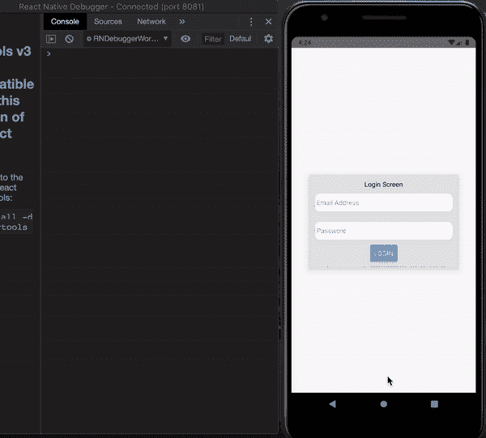
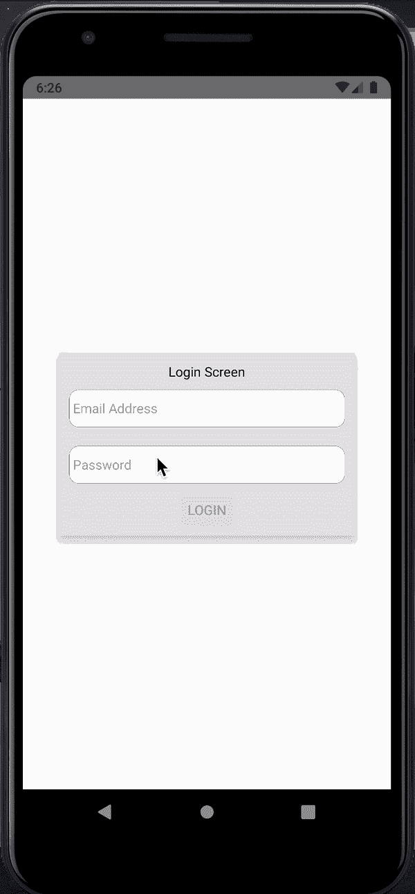
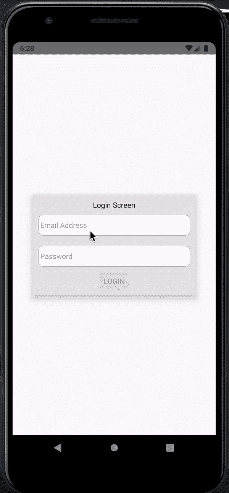
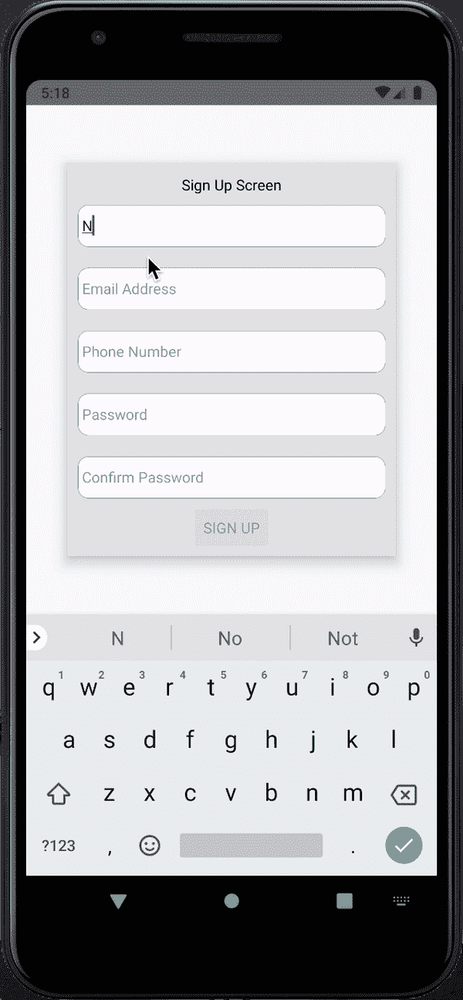
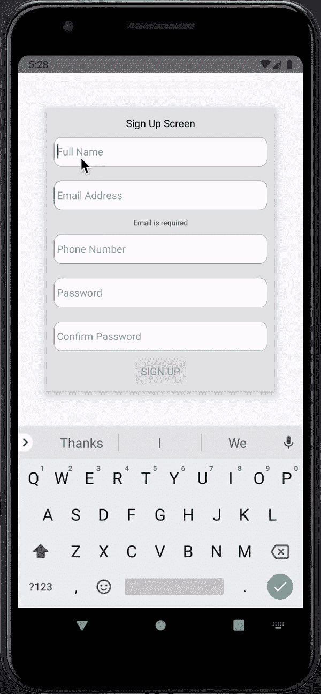
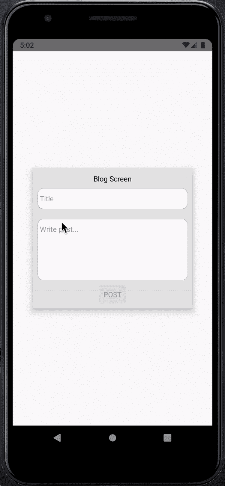

# 使用 Formik 和 Yup - LogRocket Blog 进行原生表单验证

> 原文：<https://blog.logrocket.com/react-native-form-validations-with-formik-and-yup/>

表单输入是用户输入和与应用程序交互的关键组件，包括注册、登录、内容创建、评论等。这些是任何应用程序的关键部分，确保用户在表单上的体验是无缝的，可以大大提高应用程序的可用性。

在这篇文章中，我们将使用 [Formik](https://formik.org/) 创建一些表单。Formik 是一个简单的 React/React 本地表单库，帮助处理表单状态、输入验证、格式化、错误处理、表单提交等。Formik 使用 react state 和 pros 使一切变得简单，便于理解、集成、调试和测试您的表单。

我们还将在混合中加入一些[是的](https://github.com/jquense/yup)来帮助构建验证和解析表单输入的模式。

## 先决条件

要阅读本文，您需要:

*   对 React Native 的基本了解
*   在你的机器上设置


React Native welcome screen

## 入门指南

如果您没有 React 本机设置，请参考[文档以开始使用](https://reactnative.dev/docs/getting-started)，然后从那里开始。

我们将使用以下工具设置我们的新应用:

```
npx react-native init formikExample
```

这将创建一个包含 React 本地项目的文件夹`formikExample`。在您的模拟器或设备上运行项目，并确保它显示 React Native [欢迎屏幕](https://reactnative.dev/docs/0.61/getting-started)。

设置好 React 本地项目后，现在让我们开始创建一些表单。在这个博客中，我们将创建三种形式:

*   登录表单
*   注册表单
*   发布博客表单

这三个表单应该有助于我们了解使用 Formik 和 Yup 创建表单的一些核心特性。

最后，让我们添加我们将使用的两个库:

```
yarn add formik yup
```

## 登录表单

从最简单的形式开始。这应该有两个电子邮件和密码输入和一个登录按钮。

在开始添加文本输入之前，让我们先做一些清理工作。更新`App.js`如下图所示:

```
// App.js
import React from 'react'
import {
  SafeAreaView,
  StyleSheet,
  ScrollView,
  View,
  Text,
  StatusBar,
  TextInput,
} from 'react-native'

const App = () => {
  return (
    <>
      <StatusBar barStyle="dark-content" />
      <SafeAreaView style={styles.container}>
        <View style={styles.loginContainer}>
          <Text>Login Screen</Text>
        </View>
      </SafeAreaView>
    </>
  )
}

const styles = StyleSheet.create({
  container: {
    flex: 1,
    justifyContent: 'center',
    alignItems: 'center',
  },
  loginContainer: {
    width: '80%',
    alignItems: 'center',
  }
})

export default App
```


这应该会将`defaultWelcome`屏幕更改为屏幕中央的“登录屏幕”文本。

现在让我们开始添加一些输入。

当为比如说电子邮件地址添加`TextInputs`时，它要求我们设置状态来存储电子邮件值，并设置一个`handleEmailChange`函数来处理文本更改和更新电子邮件状态。

这可能会变得太多，尤其是当您处理大量输入时。

这就是 Formik 帮助处理所有这些重复性工作的地方。所以让我们看看如何用 Formik 来做，让我们用 Formik 来添加电子邮件输入表单。

我们将从导入 Formik 库开始，然后设置输入:

```
// App.js

import { Formik } from 'formik'

...
        <View style={styles.loginContainer}>
          <Text>Login Screen</Text>
          <Formik
            initialValues={{ email: '', password: '' }}
            onSubmit={values => console.log(values)}
          >
            {({ handleChange, handleBlur, handleSubmit, values }) => (
              <>
                <TextInput
                  name="email"
                  placeholder="Email Address"
                  style={styles.textInput}
                  onChangeText={handleChange('email')}
                  onBlur={handleBlur('email')}
                  value={values.email}
                  keyboardType="email-address"
                />
                <TextInput
                  name="password"
                  placeholder="Password"
                  style={styles.textInput}
                  onChangeText={handleChange('password')}
                  onBlur={handleBlur('password')}
                  value={values.password}
                  secureTextEntry
                />
                <Button onPress={handleSubmit} title="Submit" />
              </>
            )}
          </Formik>
        </View>
```

一个好的用户界面有助于改善用户体验，所以让我们添加一些样式来帮助我们的输入看起来更好。

让我们添加下面的样式来改进用户界面，如下所示:

```
const styles = StyleSheet.create({

  loginContainer: {
    width: '80%',
    alignItems: 'center',
    backgroundColor: 'white',
    padding: 10,
    elevation: 10,
    backgroundColor: '#e6e6e6'
  },
  textInput: {
    height: 40,
    width: '100%',
    margin: 10,
    backgroundColor: 'white',
    borderColor: 'gray',
    borderWidth: StyleSheet.hairlineWidth,
    borderRadius: 10,
  },
})
```

目前，我们的`onSubmit`函数是传递值的`console.log`语句。这就是我们的登录函数进入并获取这些值进行处理的地方。

让我们在[调试模式](https://reactnative.dev/docs/debugging)下测试一下我们的`handleSubmit`，在文本输入中输入一些内容，看看这些值是否被记录在调试器中。



你可能已经注意到了，但是，我们可以提交没有价值，格式错误的电子邮件地址和其他缺陷。我们不希望出现这种情况，我们希望用户只有在输入正确格式的电子邮件和密码后才能登录。在那之前，我们希望登录按钮被禁用。

这就是输入验证的用武之地，我们想要创建一个验证模式来检查输入的格式是否符合预期。如前所述，我们将使用 [Yup](https://github.com/jquense/yup) 来创建验证模式，并为每次检查提供定制的错误消息。

让我们创建登录验证模式，如下所示:

```
// App.js
import * as yup from 'yup'

const loginValidationSchema = yup.object().shape({
  email: yup
    .string()
    .email("Please enter valid email")
    .required('Email Address is Required'),
  password: yup
    .string()
    .min(8, ({ min }) => `Password must be at least ${min} characters`)
    .required('Password is required'),
})
```

正如在模式中看到的，电子邮件应该是格式化的`email`的`string()`，以检查它是否是正确的电子邮件格式，如果检查失败，我们也将返回相应的错误消息，我们稍后将显示这一点。

对于密码字段，它也是一个必需的字符串，我们还添加了另一个对最小字符数的检查，`min(8)`以确保密码至少有 8 个字符。

你可以对你的输入进行更多的检查，查看[是文档](https://github.com/jquense/yup)了解更多。

现在让我们将这个模式添加到 Formik 表单中，这样我们就可以用它来验证我们的输入。我们将更新我们的表单，如下所示:

```
// App.js

<Formik
   validationSchema={loginValidationSchema}
   initialValues={{ email: '', password: '' }}
   onSubmit={values => console.log(values)}
 >
   {({
     handleChange,
     handleBlur,
     handleSubmit,
     values,
     errors,
     isValid,
   }) => (
     <>
       <TextInput
         name="email"
         placeholder="Email Address"
         style={styles.textInput}
         onChangeText={handleChange('email')}
         onBlur={handleBlur('email')}
         value={values.email}
         keyboardType="email-address"
       />
       {errors.email &&
         <Text style={{ fontSize: 10, color: 'red' }}>{errors.email}</Text>
       }
       <TextInput
         name="password"
         placeholder="Password"
         style={styles.textInput}
         onChangeText={handleChange('password')}
         onBlur={handleBlur('password')}
         value={values.password}
         secureTextEntry
       />
       {errors.password &&
         <Text style={{ fontSize: 10, color: 'red' }}>{errors.password}</Text>
       }
       <Button
         onPress={handleSubmit}
         title="LOGIN"
         disabled={!isValid}
       />
     </>
   )}
 </Formik>
```



We added our `validationSchema` as seen above, all our inputs are validated against the schema after every change to ensure they match the expected format.

如果没有，则根据当前输入为每个输入生成`errors`。

为了显示`errors`,我们从 Formik props 中析构它们，如上所示，并将它们显示在相应的文本输入下方。

我们还访问了`isValid`状态，这是一个用于检查输入是否有效的布尔值，我们将用它来设置登录按钮的`disabled`状态。

由于每次更改后都会检查所有输入，所以即使用户还没有开始与输入交互，我们也会显示错误。

我们不希望出现这种情况，所以我们将添加一个检查，以确保只有在用户触摸输入后才会显示错误。

```
            {({
              handleChange,
              handleBlur,
              handleSubmit,
              values,
              errors,
              touched,
              isValid,
            }) => (
...
                {(errors.email && touched.email) &&
                  <Text style={styles.errorText}>{errors.email}</Text>
                }

                {(errors.password && touched.password) &&
                  <Text style={styles.errorText}>{errors.password}</Text>
                }

...
// in stylesheet
  errorText: {
    fontSize: 10,
    color: 'red',
  },
```



请注意，在第二张图中，错误仅在有问题的输入被触摸后出现，而在第一张图中，错误出现在所有输入上，即使只触摸了一个输入。

至此，我们已经完成了我们的登录表单。

让我们继续注册表格。

## 注册表单

在上一节登录表单中，我们使用 Formik 来处理表单，但是仍然需要传递不同的函数(比如`handleChange`、`handleBlur value`等)。)对每个`TextInput`来说，随着投入的增加，这可能会变成大量的工作。

Formik 提供了一个组件`Field`,可以自动为我们将输入连接到 Formik。在本节中，我们将探讨这一点。

让我们从创建一个将被传递到`Field`组件的`CustomInput`组件开始，获取 Formik 道具，并为我们处理输入。

我们将创建一个名为`CustomInput.js`的文件，并向其中添加以下代码:

```
// CustomInput.js
import React from 'react'
import { Text, TextInput, StyleSheet } from 'react-native'

const CustomInput = (props) => {
  const {
    field: { name, onBlur, onChange, value },
    form: { errors, touched, setFieldTouched },
    ...inputProps
  } = props

  const hasError = errors[name] && touched[name]

  return (
    <>
      <TextInput
        style={[
          styles.textInput,
          hasError && styles.errorInput
        ]}
        value={value}
        onChangeText={(text) => onChange(name)(text)}
        onBlur={() => {
          setFieldTouched(name)
          onBlur(name)
        }}
        {...inputProps}
      />
      {hasError && <Text style={styles.errorText}>{errors[name]}</Text>}
    </>
  )
}

const styles = StyleSheet.create({
  textInput: {
    height: 40,
    width: '100%',
    margin: 10,
    backgroundColor: 'white',
    borderColor: 'gray',
    borderWidth: StyleSheet.hairlineWidth,
    borderRadius: 10,
  },
  errorText: {
    fontSize: 10,
    color: 'red',
  },
  errorInput: {
    borderColor: 'red',
  }
})

export default CustomInput

```

如你所见，这个`CustomInput`处理了我们在登录表单`TextInputs`中做的许多事情，从处理输入、样式、检查和呈现错误等等。

现在让我们创建一个新文件`SignUp.js`来存放我们的注册表单。要查看内容，让我们将`index.js`指向注册屏幕。

在`index.js`将应用程序导入更新到`import App from './SignUp'`。

现在在`SignUp.js`上，让我们从下面的代码开始:

```
// SignUp.js
import React from 'react'
import {
  SafeAreaView,
  StyleSheet,
  View,
  Text,
  StatusBar,
  TextInput,
  Button,
} from 'react-native'
import { Formik, Field } from 'formik'
import * as yup from 'yup'

const SignUp = () => {
  return (
    <>
      <StatusBar barStyle="dark-content" />
      <SafeAreaView style={styles.container}>
        <View style={styles.signupContainer}>
          <Text>Sign Up Screen</Text>

        </View>
      </SafeAreaView>
    </>
  )
}

const styles = StyleSheet.create({
  container: {
    flex: 1,
    justifyContent: 'center',
    alignItems: 'center',
  },
  signupContainer: {
    width: '80%',
    alignItems: 'center',
    backgroundColor: 'white',
    padding: 10,
    elevation: 10,
    backgroundColor: '#e6e6e6'
  },
})
export default SignUp
```

这应该显示我们的初始注册屏幕，只有文本。

现在让我们导入我们创建的`CustomInput`,并开始使用讨论过的`Field`组件创建我们的`SignUp`表单:

```
// SignUp.js

import CustomInput from './CustomInput'

...
          <Text>Sign Up Screen</Text>

          <Formik
            initialValues={{
              fullName: '',
              email: '',
              phoneNumber: '',
              password: '',
              confirmPassword: '',
            }}
            onSubmit={values => console.log(values)}
          >
            {({ handleSubmit, isValid }) => (
              <>
                <Field
                  component={CustomInput}
                  name="fullName"
                  placeholder="Full Name"
                />
                <Field
                  component={CustomInput}
                  name="email"
                  placeholder="Email Address"
                  keyboardType="email-address"
                />
                <Field
                  component={CustomInput}
                  name="phoneNumber"
                  placeholder="Phone Number"
                  keyboardType="numeric"
                />
                <Field
                  component={CustomInput}
                  name="password"
                  placeholder="Password"
                  secureTextEntry
                />
                <Field
                  component={CustomInput}
                  name="confirmPassword"
                  placeholder="Confirm Password"
                  secureTextEntry
                />

                <Button
                  onPress={handleSubmit}
                  title="SIGN UP"
                  disabled={!isValid}
                />
              </>
            )}
          </Formik>
```



正如你可能注意到的，由于`Field`自动将输入连接到 Formik，我们从`Formik`析构的道具更少，因为它们被直接传递给`CustomInput`。这使得代码更加清晰易读。

我们还添加了一些输入，全名、电话号码、密码和确认密码。

最后，对于我们的注册表单，让我们添加`validationSchema`。我们还将借此机会展示一些验证肌肉。yup 的一个主要好处是，我们可以使用其庞大的可扩展 API 来验证不同的输入格式。

我们将使用验证模式来:

*   检查所需的值是否存在
*   使用 regex 检查全名和电话的格式是否符合预期
*   使用正则表达式来确保我们用户的密码强度
*   检查我们的密码和确认密码是否匹配

好了，让我们添加验证模式:

```
// SignUp.js
const signUpValidationSchema = yup.object().shape({
  fullName: yup
    .string()
    .matches(/(\w.+\s).+/, 'Enter at least 2 names')
    .required('Full name is required'),
  phoneNumber: yup
    .string()
    .matches(/(01)(\d){8}\b/, 'Enter a valid phone number')
    .required('Phone number is required'),
  email: yup
    .string()
    .email("Please enter valid email")
    .required('Email is required'),
  password: yup
    .string()
    .matches(/\w*[a-z]\w*/,  "Password must have a small letter")
    .matches(/\w*[A-Z]\w*/,  "Password must have a capital letter")
    .matches(/\d/, "Password must have a number")
    .matches(/[[email protected]#$%^&*()\-_"=+{}; :,<.>]/, "Password must have a special character")
    .min(8, ({ min }) => `Password must be at least ${min} characters`)
    .required('Password is required'),
  confirmPassword: yup
    .string()
    .oneOf([yup.ref('password')], 'Passwords do not match')
    .required('Confirm password is required'),
})
```



然后把它传给我们的 Formik 表单`validationSchema={signUpValidationSchema}`。

对于上面的全名，我们使用 regex 来确保用户至少输入两个名字。我们还使用 regex 来检查电话号码的格式，在本例中检查号码是否符合格式`01xxxxxxxx`。

最后，对于密码，我们使用 regex 来确保用户创建的密码至少包含一个小写字母、一个大写字母、一个数字、一个特殊字符和至少 8 个字符。

我们还使用 Yup 来确保确认密码与密码匹配。

注册表单到此结束。

## 发布博客表单

最后，让我们跳到最后一个表单。内容创建表单，在这个表单中，我们将有三个字段，标题，内容和照片。

正如我们之前所做的，让我们为表单创建一个新文件`BlogForm.js`，并更新`index.js`中的 ppp 以指向它`import App from './BlogForm'`。

现在让我们跳到我们的`BlogForm`上，添加下面的代码开始吧:

```
// BlogForm.js
import React from 'react'
import {
  SafeAreaView,
  StyleSheet,
  View,
  Text,
  StatusBar,
  Button,
} from 'react-native'
import { Formik, Field } from 'formik'
import * as yup from 'yup'
import CustomInput from './CustomInput'

const App = () => {
  return (
    <>
      <StatusBar barStyle="dark-content" />
      <SafeAreaView style={styles.container}>
        <View style={styles.signupContainer}>
          <Text>Blog Screen</Text>
          <Formik
            initialValues={{
              title: '',
              post: '',
            }}
            onSubmit={values => console.log(values)}
          >
            {({ handleSubmit, isValid, values }) => (
              <>
                <Field
                  component={CustomInput}
                  name="title"
                  placeholder="Title"
                />
                <Field
                  component={CustomInput}
                  name="post"
                  placeholder="Write post..."
                  multiline
                  numberOfLines={3}
                />
                <Button
                  onPress={handleSubmit}
                  title="POST"
                  disabled={!isValid}
                />
              </>
            )}
          </Formik>
        </View>
      </SafeAreaView>
    </>
  )
}

const styles = StyleSheet.create({
  container: {
    flex: 1,
    justifyContent: 'center',
    alignItems: 'center',
  },
  signupContainer: {
    width: '80%',
    alignItems: 'center',
    backgroundColor: 'white',
    padding: 10,
    elevation: 10,
    backgroundColor: '#e6e6e6'
  },
})
export default App
```

注意，我们向 post 输入添加了一些属性，使其成为`multiline`并将`numberOfLines`增加到三个。

这是为了让我们的输入更大，所以让我们对`CustomInput`做一些调整，以确保更新良好:

```
// CustomInput.js
    <TextInput
      style={[
        styles.textInput,
        props.multiline && { height: props.numberOfLines * 40 },
        hasError && styles.errorInput
      ]}
```



并将`textAlignVertical: 'top',`添加到`textInput`样式中，这将使文本保持在多行输入的顶部。

这将根据`numberOfLines`更新样式以增加我们输入的高度。

在我们运行并查看它的外观之前，让我们也添加我们的验证模式。

之前，我们使用了`.min()`来确保密码超过 8 个字符，我们将在这里使用同样的方法来确保帖子足够长(最少 20 个字符),并向用户显示关于剩余字符数的消息:

```
// BlogForm.js
    const blogValidationSchema = yup.object().shape({
      title: yup
        .string()
        .required('Title is required'),
      post: yup
        .string()
        .min(20, ({ min, value }) => `${min - value.length} characters to go`)
        .required('Blog post is required'),
    })
```

并将其传递给我们的 Formik 表单`validationSchema={blogValidationSchema}`。

让我们通过添加一个图像选择器并为其添加验证来结束这一部分。我们将使用 [react 原生图像拾取器](https://github.com/react-native-community/react-native-image-picker)进行媒体选择，查看[文档](https://github.com/react-native-community/react-native-image-picker)了解更多关于设置和使用的详细信息:

```
yarn add react-native-image-picker
npx pod-install
```

使用图像拾取器设置，导入`ImagePicker`并添加一个按钮来选择图像并将它们传递到我们的 Formik 表单:

```
// BlogForm.js
import ImagePicker from 'react-native-image-picker'

...

                <Field
                  component={CustomInput}
                  name="post"
                  placeholder="Write post..."
                  multiline
                  numberOfLines={3}
                />
                <TouchableOpacity
                  style={styles.photoButton}
                  onPress={() => {
                    ImagePicker.showImagePicker(
                      { title: 'Select Photo' }, (response) => {
                        if (response.uri) setFieldValue('photo', response)
                        setFieldTouched('photo', true)
                    })
                  }}
                >
                  <Text>Add Image</Text>
                </TouchableOpacity>

                {values.photo &&
                  <Text>{`...${values.photo.fileName.substr(values.photo.fileName.length - 10)}`}</Text>
                }

                {(errors.photo && touched.photo) &&
                  <Text style={{ color: 'red' }}>{errors.photo}</Text>
                }
```


由于这不是文本输入，我们需要手动设置触摸和值状态，所以记得从 Formik props 中析构`setFieldValue`、`setFieldTouched`、`errors`和`touched`。

我们将需要它来设置值和触摸状态，以及显示丢失照片的错误。

我们还需要更新我们的验证模式来检查照片对象，为此需要将
`photo: yup.object().required('Photo is required'),`添加到验证模式中。

您可以进一步扩展 yup 对象验证，甚至检查对象的形状，以确保所有必填字段，如`fileName`、`path`、`type`等。

## 结论

Formik 和 Yup 为 React 和 React Native 中的表单处理提供了一个简单、可理解和可扩展的解决方案，为我们提供了输入验证、错误检查、处理和显示、处理提交等解决方案。

使用这些强大的工具，你还可以做更多的事情，使你的表单更加直观和实用，这篇博客只是触及了表面。

你可以在我的 GitHub 上找到所有的代码。

一如既往，快乐编码。

## [LogRocket](https://lp.logrocket.com/blg/react-native-signup) :即时重现 React 原生应用中的问题。

[](https://lp.logrocket.com/blg/react-native-signup)

[LogRocket](https://lp.logrocket.com/blg/react-native-signup) 是一款 React 原生监控解决方案，可帮助您即时重现问题、确定 bug 的优先级并了解 React 原生应用的性能。

LogRocket 还可以向你展示用户是如何与你的应用程序互动的，从而帮助你提高转化率和产品使用率。LogRocket 的产品分析功能揭示了用户不完成特定流程或不采用新功能的原因。

开始主动监控您的 React 原生应用— [免费试用 LogRocket】。](https://lp.logrocket.com/blg/react-native-signup)