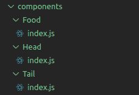
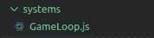

# 如何在 React Native 中构建一个简单的游戏

> 原文：<https://blog.logrocket.com/react-native-game-development-tutorial/>

## 介绍

今天我们要学习如何用 React Native 制作一个游戏。因为我们使用 React Native，这个游戏将是跨平台的，这意味着你可以在 Android、iOS 和网络上玩同样的游戏。然而，今天我们将只关注移动设备。让我们开始吧。

## 入门指南

要制作任何游戏，我们都需要一个在玩的时候更新游戏的循环。这个循环是为了流畅运行游戏而优化的，为此我们将使用 [React 原生游戏引擎](https://github.com/bberak/react-native-game-engine) **。**

首先，让我们使用以下命令创建一个新的 React 本地应用程序:

```
npx react-native init ReactNativeGame

```

创建项目后，我们需要添加一个依赖项，以便添加一个游戏引擎:

```
npm i -S react-native-game-engine

```

这个命令将把 React 本地游戏引擎添加到我们的项目中。

那么我们要做什么样的游戏呢？为了简单起见，让我们用一条吃食物碎片并长身体的蛇来做一个游戏。

## React 国产游戏引擎简介

React 原生游戏引擎是一个轻量级的游戏引擎。它包括一个组件，允许我们将对象数组作为实体添加，以便我们可以操作它们。为了编写我们的游戏逻辑，我们使用了一系列系统道具，允许我们操纵实体(游戏对象)、检测触摸和许多其他令人惊叹的细节，帮助我们制作一个简单、实用的游戏。

## 让我们在 React Native 中构建一个贪吃蛇游戏

要制作一个游戏，我们需要一个画布或容器来添加游戏对象。要制作画布，我们只需添加一个视图组件，样式如下:

```
// App.js     
<View style={styles.canvas}>
</View>

```

我们可以像这样添加我们的样式:

```
const styles = StyleSheet.create({
  canvas: {
    flex: 1,
    backgroundColor: "#000000",
    alignItems: "center",
    justifyContent: "center",
  }
});

```

在画布中，我们将使用带有 React 本地游戏引擎样式的`GameEngine`组件:

```
import { GameEngine } from "react-native-game-engine";
import React, { useRef } from "react";
import Constants from "./Constants";

export default function App() {
  const BoardSize = Constants.GRID_SIZE * Constants.CELL_SIZE;
  const engine = useRef(null);
  return (
    <View style={styles.canvas}>
      <GameEngine
              ref={engine}
              style={{
                width: BoardSize,
                height: BoardSize,
                flex: null,
                backgroundColor: "white",
              }}
            />
    </View>
);

```

我们还使用`useRef()` React 钩子为游戏引擎添加了一个 ref 以备后用。

我们还在项目的根目录下创建了一个`Constants.js`文件来存储我们的常量值:

```
// Constants.js
import { Dimensions } from "react-native";
export default {
  MAX_WIDTH: Dimensions.get("screen").width,
  MAX_HEIGHT: Dimensions.get("screen").height,
  GRID_SIZE: 15,
  CELL_SIZE: 20
};

```

你会注意到我们正在做一个 15 乘 15 的网格，我们的蛇将在那里移动。

此时，我们的游戏引擎设置为显示蛇和它的食物。我们需要向`GameEngine`组件添加实体和道具，但在此之前，我们需要创建一个将在设备上呈现的蛇和食物组件。

## 创建游戏实体

我们先做蛇。蛇分为两部分，头和身体(或尾巴)。现在我们将制作蛇的头部，稍后我们将在本教程中添加蛇的尾巴。

为了制作蛇头，我们将在组件文件夹中制作一个`Head`组件:



如你所见，我们有三个组件:`Head`、`Food`和`Tail`。我们将在本教程中一个接一个地了解这些文件的内容。

在`Head`组件中，我们将创建一个具有某种样式的视图:

```
import React from "react";
import { View } from "react-native";
export default function Head({ position, size }) {
  return (
    <View
      style={{
        width: size,
        height: size,
        backgroundColor: "red",
        position: "absolute",
        left: position[0] * size,
        top: position[1] * size,
      }}
    ></View>
  );
} 

```

我们会通过一些道具来设置头部的大小和位置。

我们使用`position: "absolute"`属性来轻松移动头部。

这将呈现一个正方形，我们不打算使用任何更复杂的东西；蛇的身体呈正方形或长方形，食物呈圆形。

现在我们把这个蛇头加到`GameEngine`上。

要添加任何实体，我们需要在`GameEngine`的`entities`属性中传递一个对象:

```
//App.js
import Head from "./components/Head";

 <GameEngine
        ref={engine}
        style={{
          width: BoardSize,
          height: BoardSize,
          flex: null,
          backgroundColor: "white",
        }}
        entities={{
          head: {
            position: [0, 0],
            size: Constants.CELL_SIZE,
            updateFrequency: 10,
            nextMove: 10,
            xspeed: 0,
            yspeed: 0,
            renderer: <Head />,
          }
        }} 
/>

```

我们已经用 head 键将一个对象传递到了`entities`道具中。这些是它定义的属性:

*   `position`是放置蛇头的一组坐标
*   `size`是设置蛇头大小的值
*   `xspeed`和`yspeed`是决定蛇移动和方向的值，可以是 1、0 或-1。注意，当`xspeed`设置为 1 或-1 时，那么`yspeed`的值必须为 0，反之亦然
*   最后，`renderer`负责呈现组件
*   `updateFrequency`和`nextMove`将在后面讨论。

添加完`Head`组件后，让我们也添加其他组件:

```
// commponets/Food/index.js
import React from "react";
import { View } from "react-native";
export default function Food({ position, size }) {
  return (
    <View
      style={{
        width: size,
        height: size,
        backgroundColor: "green",
        position: "absolute",
        left: position[0] * size,
        top: position[1] * size,
        borderRadius: 50
      }}
    ></View>
  );
}

```

组件`Food`与组件`Head`相似，但是我们改变了背景颜色和边框半径，使其成为一个圆形。

现在创建一个`Tail`组件。这一个可能很棘手:

```
// components/Tail/index.js

import React from "react";
import { View } from "react-native";
import Constants from "../../Constants";
export default function Tail({ elements, position, size }) {
  const tailList = elements.map((el, idx) => (
    <View
      key={idx}
      style={{
        width: size,
        height: size,
        position: "absolute",
        left: el[0] * size,
        top: el[1] * size,
        backgroundColor: "red",
      }}
    />
  ));
  return (
    <View
      style={{
        width: Constants.GRID_SIZE * size,
        height: Constants.GRID_SIZE * size,
      }}
    >
      {tailList}
    </View>
  );
}

```

当蛇吃食物时，我们会在蛇体内添加一种元素，这样我们的蛇就会生长。这些元素将传入`Tail`组件，这将表明它必须变大。

我们将遍历所有的元素来创建整个蛇的身体，添加它，然后渲染。

制作完所有需要的组件后，让我们将这两个组件添加为`GameEngine`实体:

```
// App.js

import Food from "./components/Food";
import Tail from "./components/Tail";

// App.js
const randomPositions = (min, max) => {
    return Math.floor(Math.random() * (max - min + 1) + min);
  };

// App.js

<GameEngine
        ref={engine}
        style={{
          width: BoardSize,
          height: BoardSize,
          flex: null,
          backgroundColor: "white",
        }}
        entities={{
          head: {
            position: [0, 0],
            size: Constants.CELL_SIZE,
            updateFrequency: 10,
            nextMove: 10,
            xspeed: 0,
            yspeed: 0,
            renderer: <Head />,
          },
          food: {
            position: [
              randomPositions(0, Constants.GRID_SIZE - 1),
              randomPositions(0, Constants.GRID_SIZE - 1),
            ],
            size: Constants.CELL_SIZE,
            renderer: <Food />,
          },
          tail: {
            size: Constants.CELL_SIZE,
            elements: [],
            renderer: <Tail />,
          },
        }}

      /> 

```

为了保证食物位置的随机性，我们制作了一个带有最小和最大参数的`randomPositions`函数。

在`tail`中，我们在初始状态下添加了一个空数组，所以当蛇吃食物时，它会将每个尾巴长度存储在`elements:`空间中。

至此，我们已经成功地创建了我们的游戏组件。现在是时候在游戏循环中加入游戏逻辑了。

## 游戏逻辑

为了进行游戏循环，`GameEngine`组件有一个名为`systems`的道具，它接受一组函数。

* * *

### 更多来自 LogRocket 的精彩文章:

* * *

为了保持一切结构化，我创建了一个名为`systems`的文件夹，并插入了一个名为`GameLoop.js`的文件:



在这个文件中，我们导出一个带有某些参数的函数:

```
// GameLoop.js

export default function (entities, { events, dispatch }) {
  ...

  return entities;
}

```

第一个参数是`entities`，它包含我们传递给`GameEngine`组件的所有实体，因此我们可以操作它们。另一个参数是具有属性的对象，即`events`和`dispatch`。

### 移动蛇头

让我们编写代码，将蛇头向正确的方向移动。

在`GameLoop.js`函数中，我们将更新头部位置，因为该函数将在每一帧中被调用:

```
// GameLoop.js
export default function (entities, { events, dispatch }) {
  const head = entities.head;
  head.position[0] += head.xspeed;
  head.position[1] += head.yspeed;
}

```

我们正在使用`entities`参数访问头部，并且在每一帧我们都在更新蛇头的位置。

如果你现在玩游戏，什么都不会发生，因为我们已经把我们的`xspeed`和`yspeed`设置为 0。如果将`xspeed`或`yspeed`设为 1，蛇头会快速移动。

为了减慢蛇的速度，我们将像这样使用`nextMove`和`updateFrequency`值:

```
const head = entities.head;

head.nextMove -= 1;
if (head.nextMove === 0) {
  head.nextMove = head.updateFrequency;

  head.position[0] += head.xspeed;
  head.position[1] += head.yspeed;
}

```

我们通过在每一帧减去 1 来将`nextMove`的值更新为 0。当值为 0 时，`if`条件被设置为`true`，并且`nextMove`值被更新回初始值，从而移动蛇头。

现在蛇的速度应该比以前慢了。

### “游戏结束！”情况

在这一点上，我们还没有添加“游戏结束！”条件。第一首“游戏结束！”条件是当蛇碰到墙时，游戏停止运行，并向用户显示一条消息，表明游戏结束。

要添加此条件，我们使用以下代码:

```
if (head.nextMove === 0) {
  head.nextMove = head.updateFrequency;
  if (
        head.position[0] + head.xspeed < 0 ||
        head.position[0] + head.xspeed >= Constants.GRID_SIZE ||
        head.position[1] + head.yspeed < 0 ||
        head.position[1] + head.yspeed >= Constants.GRID_SIZE
      ) {
        dispatch("game-over");
      } else {
        head.position[0] += head.xspeed;
        head.position[1] += head.yspeed;
    }

```

第二个`if`条件是检查蛇头是否碰到墙壁。如果该条件为真，那么我们将使用`dispatch`函数调度一个`"game-over"`事件。

使用`else`，我们正在更新蛇的头部位置。

现在让我们加上“游戏结束！”功能性。

每当我们发送一个`"game-over"`事件时，我们将停止游戏并显示一个警告“游戏结束！”我们来实施吧。

为了监听`"game-over"`事件，我们需要将`onEvent`属性传递给`GameEngine`组件。要停止游戏，我们需要添加一个`running`道具并传入`useState`。

我们的`GameEngine`应该是这样的:

```
// App.js
import React, { useRef, useState } from "react";
import GameLoop from "./systems/GameLoop";

....
....

const [isGameRunning, setIsGameRunning] = useState(true);

....
....

 <GameEngine
        ref={engine}
        style={{
          width: BoardSize,
          height: BoardSize,
          flex: null,
          backgroundColor: "white",
        }}
        entities={{
          head: {
            position: [0, 0],
            size: Constants.CELL_SIZE,
            updateFrequency: 10,
            nextMove: 10,
            xspeed: 0,
            yspeed: 0,
            renderer: <Head />,
          },
          food: {
            position: [
              randomPositions(0, Constants.GRID_SIZE - 1),
              randomPositions(0, Constants.GRID_SIZE - 1),
            ],
            size: Constants.CELL_SIZE,
            renderer: <Food />,
          },
          tail: {
            size: Constants.CELL_SIZE,
            elements: [],
            renderer: <Tail />,
          },
        }}
        systems={[GameLoop]}
        running={isGameRunning}
        onEvent={(e) => {
          switch (e) {
            case "game-over":
              alert("Game over!");
              setIsGameRunning(false);
              return;
          }
        }}
      />

```

在`GameEngine`中，我们添加了`systems`属性，并通过我们的`GameLoop`函数传入了一个数组，以及一个具有`isGameRunning`状态的`running`属性。最后，我们添加了`onEvent` prop，它接受带有事件参数的函数，这样我们就可以监听我们的事件。

在这种情况下，我们正在监听 switch 语句中的`"game-over"`事件，因此当我们接收到该事件时，我们显示`"Game over!"`警报并将`isGameRunning`状态设置为`false`以停止游戏。

### 吃食物

我们已经写下了“游戏结束！”逻辑，现在让我们来研究一下让蛇吃掉食物的逻辑。

当蛇吃食物时，食物的位置会随机变化。

打开`GameLoop.js`并编写以下代码:

```
// GameLoop.js

const randomPositions = (min, max) => {
  return Math.floor(Math.random() * (max - min + 1) + min);
};

export default function (entities, { events, dispatch }) {
  const head = entities.head;
  const food = entities.food;

  ....
  ....
  ....
  if (
        head.position[0] + head.xspeed < 0 ||
        head.position[0] + head.xspeed >= Constants.GRID_SIZE ||
        head.position[1] + head.yspeed < 0 ||
        head.position[1] + head.yspeed >= Constants.GRID_SIZE
      ) {
        dispatch("game-over");
      } else {

     head.position[0] += head.xspeed;
     head.position[1] += head.yspeed;

     if (
          head.position[0] == food.position[0] &&
          head.position[1] == food.position[1]
        ) {

          food.position = [
            randomPositions(0, Constants.GRID_SIZE - 1),
            randomPositions(0, Constants.GRID_SIZE - 1),
          ];
        }
  }

```

我们添加了一个`if`条件来检查蛇头和食物的位置是否相同(这将表明蛇已经“吃掉”了食物)。然后，我们使用`randomPositions`函数更新食物位置，就像我们在`App.js`中做的那样。请注意，我们正在从`entities`参数访问食物。

### 控制蛇

现在让我们添加蛇的控制。我们将使用按钮来控制蛇的移动方向。

为此，我们需要在画布下方的屏幕中添加按钮:

```
// App.js

import React, { useRef, useState } from "react";
import { StyleSheet, Text, View } from "react-native";
import { GameEngine } from "react-native-game-engine";
import { TouchableOpacity } from "react-native-gesture-handler";
import Food from "./components/Food";
import Head from "./components/Head";
import Tail from "./components/Tail";
import Constants from "./Constants";
import GameLoop from "./systems/GameLoop";
export default function App() {
  const BoardSize = Constants.GRID_SIZE * Constants.CELL_SIZE;
  const engine = useRef(null);
  const [isGameRunning, setIsGameRunning] = useState(true);
  const randomPositions = (min, max) => {
    return Math.floor(Math.random() * (max - min + 1) + min);
  };
  const resetGame = () => {
    engine.current.swap({
      head: {
        position: [0, 0],
        size: Constants.CELL_SIZE,
        updateFrequency: 10,
        nextMove: 10,
        xspeed: 0,
        yspeed: 0,
        renderer: <Head />,
      },
      food: {
        position: [
          randomPositions(0, Constants.GRID_SIZE - 1),
          randomPositions(0, Constants.GRID_SIZE - 1),
        ],
        size: Constants.CELL_SIZE,
        updateFrequency: 10,
        nextMove: 10,
        xspeed: 0,
        yspeed: 0,
        renderer: <Food />,
      },
      tail: {
        size: Constants.CELL_SIZE,
        elements: [],
        renderer: <Tail />,
      },
    });
    setIsGameRunning(true);
  };
  return (
    <View style={styles.canvas}>
      <GameEngine
        ref={engine}
        style={{
          width: BoardSize,
          height: BoardSize,
          flex: null,
          backgroundColor: "white",
        }}
        entities={{
          head: {
            position: [0, 0],
            size: Constants.CELL_SIZE,
            updateFrequency: 10,
            nextMove: 10,
            xspeed: 0,
            yspeed: 0,
            renderer: <Head />,
          },
          food: {
            position: [
              randomPositions(0, Constants.GRID_SIZE - 1),
              randomPositions(0, Constants.GRID_SIZE - 1),
            ],
            size: Constants.CELL_SIZE,
            renderer: <Food />,
          },
          tail: {
            size: Constants.CELL_SIZE,
            elements: [],
            renderer: <Tail />,
          },
        }}
        systems={[GameLoop]}
        running={isGameRunning}
        onEvent={(e) => {
          switch (e) {
            case "game-over":
              alert("Game over!");
              setIsGameRunning(false);
              return;
          }
        }}
      />
      <View style={styles.controlContainer}>
        <View style={styles.controllerRow}>
          <TouchableOpacity onPress={() => engine.current.dispatch("move-up")}>
            <View style={styles.controlBtn} />
          </TouchableOpacity>
        </View>
        <View style={styles.controllerRow}>
          <TouchableOpacity
            onPress={() => engine.current.dispatch("move-left")}
          >
            <View style={styles.controlBtn} />
          </TouchableOpacity>
          <View style={[styles.controlBtn, { backgroundColor: null }]} />
          <TouchableOpacity
            onPress={() => engine.current.dispatch("move-right")}
          >
            <View style={styles.controlBtn} />
          </TouchableOpacity>
        </View>
        <View style={styles.controllerRow}>
          <TouchableOpacity
            onPress={() => engine.current.dispatch("move-down")}
          >
            <View style={styles.controlBtn} />
          </TouchableOpacity>
        </View>
      </View>
      {!isGameRunning && (
        <TouchableOpacity onPress={resetGame}>
          <Text
            style={{
              color: "white",
              marginTop: 15,
              fontSize: 22,
              padding: 10,
              backgroundColor: "grey",
              borderRadius: 10
            }}
          >
            Start New Game
          </Text>
        </TouchableOpacity>
      )}
    </View>
  );
}
const styles = StyleSheet.create({
  canvas: {
    flex: 1,
    backgroundColor: "#000000",
    alignItems: "center",
    justifyContent: "center",
  },
  controlContainer: {
    marginTop: 10,
  },
  controllerRow: {
    flexDirection: "row",
    justifyContent: "center",
    alignItems: "center",
  },
  controlBtn: {
    backgroundColor: "yellow",
    width: 100,
    height: 100,
  },
});

```

除了控制之外，我们还增加了一个按钮，当前一个游戏结束时可以开始新的游戏。此按钮仅在游戏未运行时出现。在点击那个按钮时，我们通过使用游戏引擎的`swap`函数来重置游戏，传入实体的初始对象，并更新游戏的运行状态。

现在谈谈控制。我们增加了可触摸按钮，当按下时，会发送将在游戏循环中处理的事件:

```
// GameLoop.js
....
....
 export default function (entities, { events, dispatch }) {
    const head = entities.head;
    const food = entities.food;

  if (events.length) {
    events.forEach((e) => {
      switch (e) {
        case "move-up":
          if (head.yspeed === 1) return;
          head.yspeed = -1;
          head.xspeed = 0;
          return;
        case "move-right":
          if (head.xspeed === -1) return;
          head.xspeed = 1;
          head.yspeed = 0;
          return;
        case "move-down":
          if (head.yspeed === -1) return;
          head.yspeed = 1;
          head.xspeed = 0;
          return;
        case "move-left":
          if (head.xspeed === 1) return;
          head.xspeed = -1;
          head.yspeed = 0;
          return;
      }
    });
  }

....
....
});

```

在上面的代码中，我们添加了一个`switch`语句来识别事件并更新蛇的方向。

还和我在一起吗？太好了！唯一剩下的就是尾巴了。

### 尾部功能

当蛇吃食物时，我们希望它的尾巴长出来。我们还想发送一个“游戏结束！”蛇咬自己的尾巴或身体。

让我们添加尾部逻辑:

```
// GameLoop.js

const tail = entities.tail;

....
....

....

    else {
      tail.elements = [[head.position[0], head.position[1]], ...tail.elements];
      tail.elements.pop();

      head.position[0] += head.xspeed;
      head.position[1] += head.yspeed;

      tail.elements.forEach((el, idx) => {
        if (
          head.position[0] === el[0] &&
          head.position[1] === el[1] 
        )
          dispatch("game-over");
      });
      if (
        head.position[0] == food.position[0] &&
        head.position[1] == food.position[1]
      ) {
        tail.elements = [
          [head.position[0], head.position[1]],
          ...tail.elements,
        ];

        food.position = [
          randomPositions(0, Constants.GRID_SIZE - 1),
          randomPositions(0, Constants.GRID_SIZE - 1),
        ];
      }
    }

```

为了让尾巴跟随蛇的头部，我们正在更新尾巴的元素。我们通过将头部的位置添加到元素数组的开头，然后删除尾部的元素数组中的最后一个元素来实现这一点。

现在在这之后，我们写一个条件，如果蛇咬了它自己的身体，我们调度`"game-over"`事件。

最后，每当蛇吃食物时，我们就在头部的当前位置上添加尾部元素，以增加尾部的长度。

以下是`GameLoop.js`的完整代码:

```
// GameLoop.js

import Constants from "../Constants";
const randomPositions = (min, max) => {
  return Math.floor(Math.random() * (max - min + 1) + min);
};
  export default function (entities, { events, dispatch }) {
    const head = entities.head;
    const food = entities.food;
    const tail = entities.tail;
  if (events.length) {
    events.forEach((e) => {
      switch (e) {
        case "move-up":
          if (head.yspeed === 1) return;
          head.yspeed = -1;
          head.xspeed = 0;
          return;
        case "move-right":
          if (head.xspeed === -1) return;
          head.xspeed = 1;
          head.yspeed = 0;
          // ToastAndroid.show("move right", ToastAndroid.SHORT);
          return;
        case "move-down":
          if (head.yspeed === -1) return;
          // ToastAndroid.show("move down", ToastAndroid.SHORT);
          head.yspeed = 1;
          head.xspeed = 0;
          return;
        case "move-left":
          if (head.xspeed === 1) return;
          head.xspeed = -1;
          head.yspeed = 0;
          // ToastAndroid.show("move left", ToastAndroid.SHORT);
          return;
      }
    });
  }
  head.nextMove -= 1;
  if (head.nextMove === 0) {
    head.nextMove = head.updateFrequency;
    if (
      head.position[0] + head.xspeed < 0 ||
      head.position[0] + head.xspeed >= Constants.GRID_SIZE ||
      head.position[1] + head.yspeed < 0 ||
      head.position[1] + head.yspeed >= Constants.GRID_SIZE
    ) {
      dispatch("game-over");
    } else {
      tail.elements = [[head.position[0], head.position[1]], ...tail.elements];
      tail.elements.pop();
      head.position[0] += head.xspeed;
      head.position[1] += head.yspeed;
      tail.elements.forEach((el, idx) => {
        console.log({ el, idx });
        if (
          head.position[0] === el[0] &&
          head.position[1] === el[1] 
        )
          dispatch("game-over");
      });
      if (
        head.position[0] == food.position[0] &&
        head.position[1] == food.position[1]
      ) {
        tail.elements = [
          [head.position[0], head.position[1]],
          ...tail.elements,
        ];

        food.position = [
          randomPositions(0, Constants.GRID_SIZE - 1),
          randomPositions(0, Constants.GRID_SIZE - 1),
        ];
      }
    }
  }
  return entities;
}

```

## 结论

现在你在 React Native 的第一个游戏完成了！你可以在自己的设备上运行这个游戏。我希望你学到了新的东西，也希望你能和你的朋友分享。

感谢您的阅读，祝您有美好的一天。

## [LogRocket](https://lp.logrocket.com/blg/react-native-signup) :即时重现 React 原生应用中的问题。

[](https://lp.logrocket.com/blg/react-native-signup)

[LogRocket](https://lp.logrocket.com/blg/react-native-signup) 是一款 React 原生监控解决方案，可帮助您即时重现问题、确定 bug 的优先级并了解 React 原生应用的性能。

LogRocket 还可以向你展示用户是如何与你的应用程序互动的，从而帮助你提高转化率和产品使用率。LogRocket 的产品分析功能揭示了用户不完成特定流程或不采用新功能的原因。

开始主动监控您的 React 原生应用— [免费试用 LogRocket】。](https://lp.logrocket.com/blg/react-native-signup)