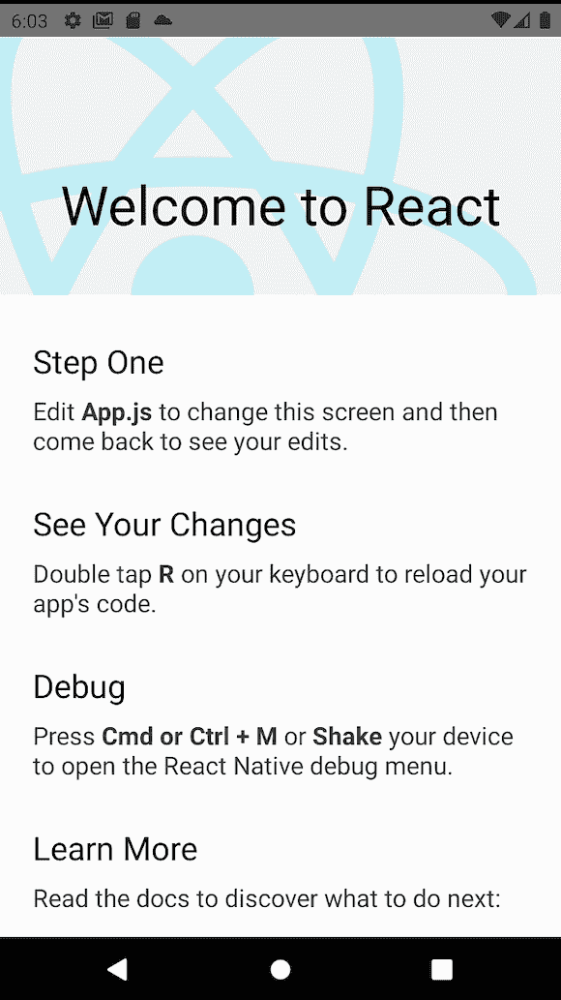
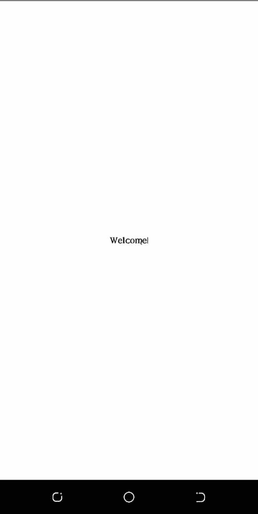
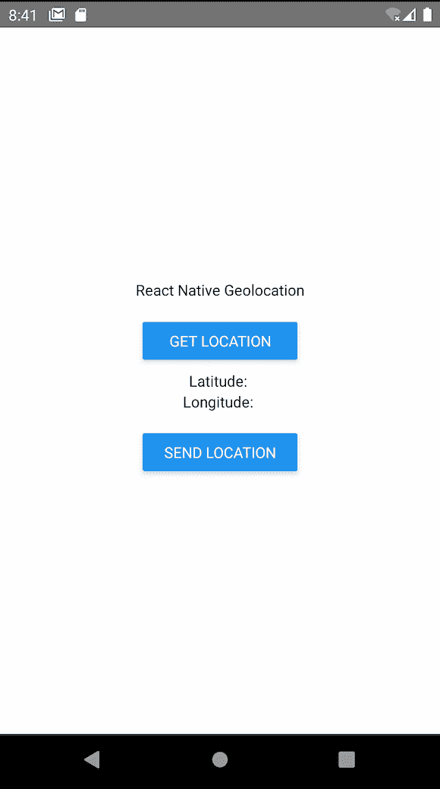
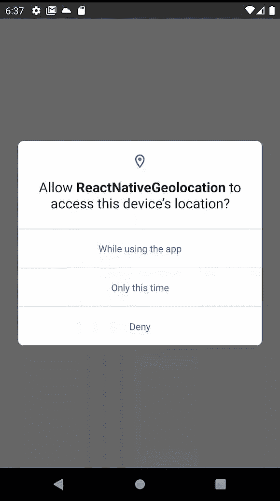
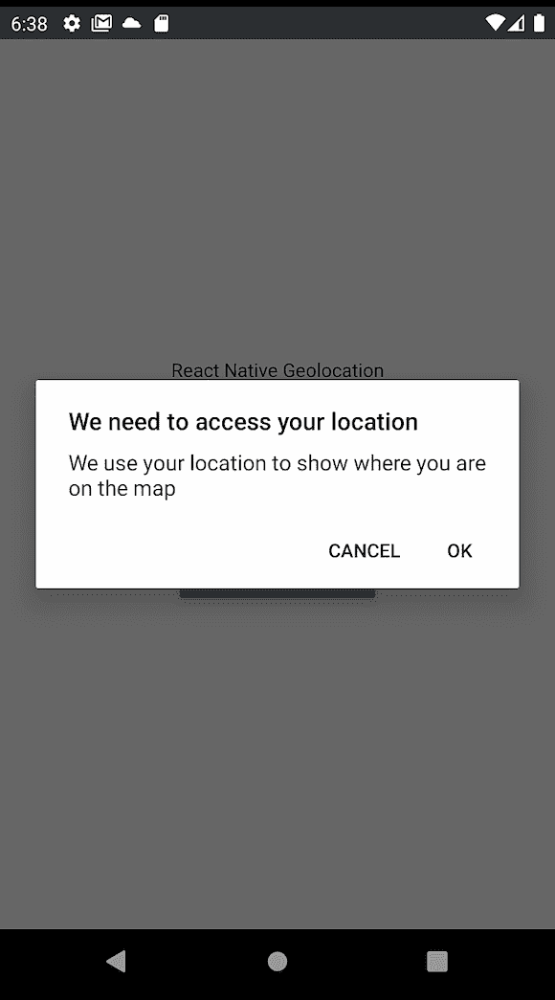
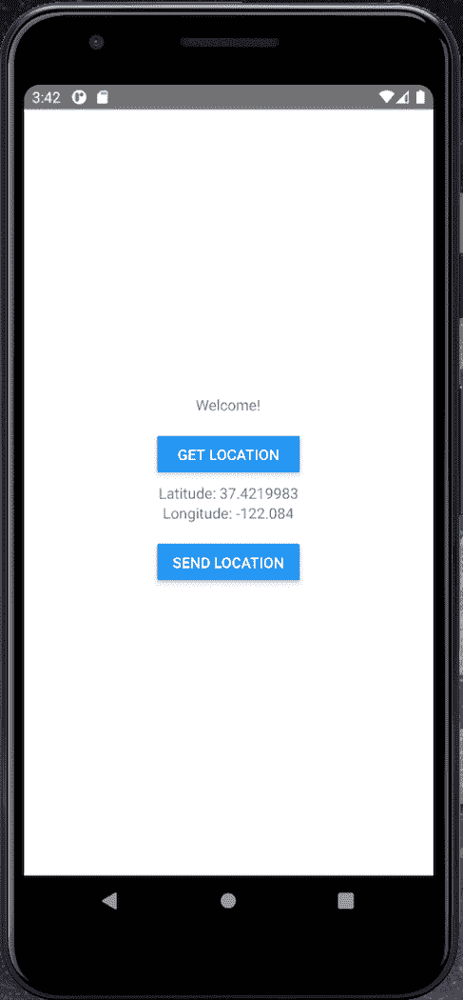
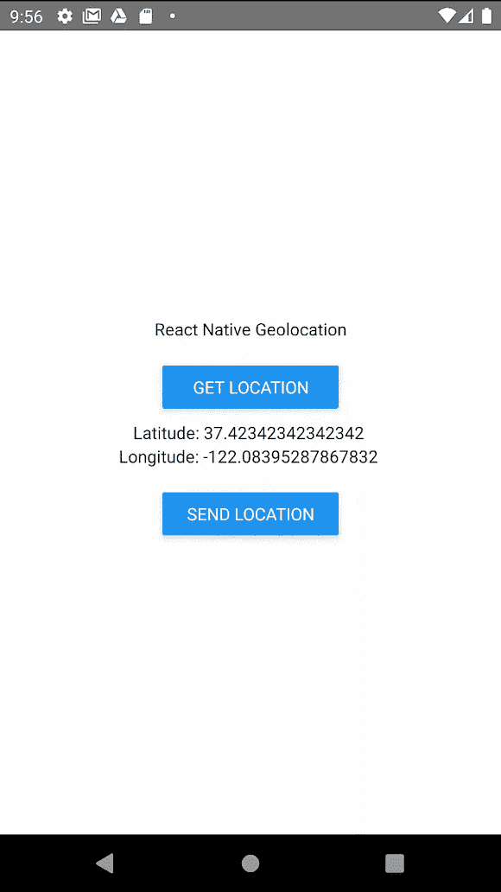
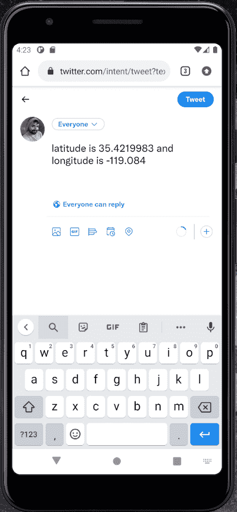

# React Native geolocation:完整教程

> 原文：<https://blog.logrocket.com/react-native-geolocation-complete-tutorial/>

***编者按**:本文最后一次更新于 2022 年 9 月 21 日，以反映对 React Native CLI 所做的更改。*

你可能想知道送餐和打车应用程序如何知道你在特定时间点的位置。答案是地理定位。

在本教程中，我们将学习如何在 React Native 中实现地理定位。我们将构建一个示例应用程序，它在地图上显示用户的位置和经度和纬度坐标，并使用户能够将他们的位置发送到另一个来源，如 Twitter。

我们将讨论以下内容:

你可以在 [GitHub](https://github.com/AlexMercedCoder/react-native-geolocation) 上获得该项目的完整源代码。我们开始吧！

## 什么是地理定位？

地理定位是指[检测连接到互联网的设备](https://blog.logrocket.com/what-you-need-know-while-using-geolocation-api/)的地理位置的能力。地理定位的一个简单例子是使用设备的 IP 地址来确定其所在的国家、城市或邮政编码。大多数时候，用户必须授予应用程序访问其位置数据的权限。

## React Native 中的地理定位

React Native 为地理定位提供了 [`@react-native-community/geolocation`](https://github.com/react-native-geolocation/react-native-geolocation) API。然而，谷歌并不推荐使用 React Native API 进行地理定位，因为它不如推荐的[谷歌位置服务 API](https://developers.google.com/maps/documentation/geolocation/overview) 准确和缓慢。

谢天谢地，React Native 社区已经为 React Native 中实现地理定位开发了[几个优秀的库](https://reactnative.directory/?search=geolocation)，包括 [`react-native-location`](https://www.npmjs.com/package/react-native-location) 和`[react-native-geolocation-service](https://www.npmjs.com/package/react-native-geolocation-service)`。

在这个 React 本地地理定位教程中，我们将使用`react-native-geolocation-service`库，它可以作为节点包在 [npm](https://www.npmjs.com/package/react-native-geolocation-service) 上获得。

我们将构建一个应用程序来完成以下任务:

*   请求允许访问您的 Android 和 iOS 设备上的位置数据
*   选择你的位置坐标
*   保存或发送您的位置坐标

建议使用 Node.js ≥v10。要检查 Node.js 版本，请运行以下代码:

```
$ node -v

// returns node version

```

您可以使用`nvm`来管理安装在您机器上的多个 Node.js 版本。React Native 有一个内置的命令行界面，可以用来生成一个新项目。您可以使用 Node.js 附带的 npx 来访问它，而无需全局安装任何东西。

## 初始化 React 本机项目

首先，在您的终端中运行以下命令:

```
$ npx react-native init ReactNativeGeolocation

```

npx 是一个基于节点的命令，您可以使用它在终端中运行基于节点的依赖项，而不必在您的机器上安装它们。

该命令的`init`部分是初始化一个新的 React 本地项目的指令，其中`ReactNativeLocation`作为项目文件的安装目录。

`npx react-native`命令无需在您的机器上安装 React Native 即可工作。或者，您可以在您的计算机上全局安装 React Native，以便在不使用 npx 的情况下运行 React Native 命令。要全局安装 React Native，请运行以下命令:

```
$ npm install -g react-native-cli

```

然后，您可以使用以下命令检查 React Native 是否已安装:

```
$ react-native -v

```

上面的命令将安装在您的机器上的 React 本地版本打印到控制台。打开你最喜欢的 IDE，进入`ReactNativeGeolocation`目录。我们运行来初始化项目的命令已经为我们设置了 React 本地应用程序。

我们将在`App.js`文件中编写我们所有的代码。确保您在应用程序的根目录下运行命令。

第一步，启动[地铁](https://facebook.github.io/metro/docs/concepts/)。Metro 是 React Native 附带的 JavaScript bundler。Metro 接受一个条目文件和各种选项，然后返回一个包含所有代码及其依赖项的 JavaScript 文件:

```
$ npx react-native start

```

当 Metro 在您的终端中运行时，打开另一个终端并运行以下命令:

```
$ npx react-native run-android

```

要运行这个应用程序，你需要一个 [Android 模拟器](https://developer.android.com/studio/run/managing-avds)或者一个在调试模式下连接到你电脑的移动设备。然而，如果你使用 Android Studio 的模拟器，你可能会遇到错误，原因如下:

*   您需要定义一个指向 SDK 目录的`ANDROID_HOME` env 变量
*   您需要接受所有的 [SDK 许可证](https://developer.android.com/studio/intro/update)

然后，您应该会看到以下屏幕:



我们可以开始对我们的`App.js`文件夹中的应用程序进行更改。删除`App.js`中的所有旧代码，并替换为以下代码:

```
/**
* Sample React Native App
* https://github.com/facebook/react-native
*
* @format
* @flow strict-local
*/

import React from 'react';
import {StyleSheet, View, Text} from 'react-native';

const App = () => {
 return (
   <View style={styles.container}>
     <Text>Welcome!</Text>
   </View>
 );
};

const styles = StyleSheet.create({
 container: {
   flex: 1,
   backgroundColor: '#fff',
   alignItems: 'center',
   justifyContent: 'center',
 },
});

export default App;

```

上面的代码给了我们一个新的屏幕，我们可以在这里继续编写我们的程序:



## React Native 中地理定位所需的依赖项

使用 Yarn 或 npm 安装`react-native-geolocation-service`库，代码如下:

```
$ yarn add react-native-geolocation-service

```

```
$ npm install react-native-geolocation-service --save

```

在过去，您必须链接库，但在 React Native 的最新版本中，当使用`npx react-native run-android`或 iOS 等效版本运行构建时，这是自动完成的。

以前，您会使用一个`npx react-native link`命令，它不再是 React 本机 CLI 的一部分。如果你使用的是 React Native ≤v0.60，那么这些[链接方向](https://github.com/Agontuk/react-native-geolocation-service/blob/HEAD/docs/setup.md)应该可以帮助你设置好。

我们还希望通过向`android/src/main/AndroidManifest.xml`添加以下代码来确保我们在应用程序中启用权限:

```
    <uses-permission android:name="android.permission.INTERNET" />
    <uses-permission android:name="android.permission.ACCESS_FINE_LOCATION" />

```

然后，再次运行`npx react-native run-android`。

## 将地理定位添加到 React 本机应用程序

让我们向 React 本机应用程序添加两个独立的按钮，一个用于获取用户的位置，我们将把它存储在应用程序状态中，另一个用于将用户的位置发送到 Twitter。

我们将在欢迎文本下的`App.js`中添加两个按钮。确保从 React Native 更新导入，将`Button`作为`import {StyleSheet, View, Text, Button} from 'react-native';`包含进来:

```
  return (
    <View style={styles.container}>
      <Text>Welcome!</Text>
      <View
        style={{marginTop: 10, padding: 10, borderRadius: 10, width: '40%'}}>
        <Button title="Get Location" />
      </View>
      <Text>Latitude: </Text>
      <Text>Longitude: </Text>
      <View
        style={{marginTop: 10, padding: 10, borderRadius: 10, width: '40%'}}>
        <Button title="Send Location" />
      </View>
    </View>
  );
};

```

现在，我们的应用程序看起来如下图所示:



## 导入`react-native-library`

一旦安装了`react-native-geolocation-service`库，我们就可以实现获取经纬度坐标的逻辑。使用 ES6，我们将编写一个由`onPress`按钮事件处理的异步请求，该请求由`GET LOCATION`按钮触发。

一旦该事件处理程序被触发，用户将被要求获得访问其位置的权限。批准请求后，该位置将返回给用户。

首先，我们需要如下导入`react-native-geolocation-service`:

```
import Geolocation from 'react-native-geolocation-service';

```

## 请求访问位置数据的许可

要使用手机的地理定位功能，我们必须要求用户提供适当的权限。在下面的代码中，我们有一个在 Android 设备上请求权限的函数。

确保按如下方式导入`PermissionsAndroid``import {StyleSheet, View, Text, Button, PermissionsAndroid} from 'react-native';`:

```
// Function to get permission for location
const requestLocationPermission = async () => {
  try {
    const granted = await PermissionsAndroid.request(
      PermissionsAndroid.PERMISSIONS.ACCESS_FINE_LOCATION,
      {
        title: 'Geolocation Permission',
        message: 'Can we access your location?',
        buttonNeutral: 'Ask Me Later',
        buttonNegative: 'Cancel',
        buttonPositive: 'OK',
      },
    );
    console.log('granted', granted);
    if (granted === 'granted') {
      console.log('You can use Geolocation');
      return true;
    } else {
      console.log('You cannot use Geolocation');
      return false;
    }
  } catch (err) {
    return false;
  }
};

```

对于 iOS app 权限，可以在 iOS 权限流上阅读[这篇文章，或者试试这个统一的](https://rossbulat.medium.com/react-native-managing-app-permissions-for-ios-4204e2286598) [iOS/Android 权限库](https://www.npmjs.com/package/react-native-permissions)。

在上面的函数中，我们调用请求函数向发行者请求许可。我们指定我们正在请求`ACCESS_FINE_LOCATION`权限，这个权限必须在之前添加到 Android 清单中并重新构建。

然后，我们传递一个带有提示细节的对象。请求的结果存储在变量`granted`中，如果成功，它将存储字符串`granted`。如果请求成功，我们返回`true`，如果不成功，我们返回`false`。

## 获取用户的位置数据

现在，从组件内部，我们将创建状态来跟踪用户的位置。首先，确保您从 React 导入了`useState`:

```
  // state to hold location
  const [location, setLocation] = useState(false);

```

然后我们将编写一个函数，这样当`GET LOCATION`按钮被按下时，它将请求许可。如果许可被授予，它将获得用户的当前位置:

```
  // function to check permissions and get Location
  const getLocation = () => {
    const result = requestLocationPermission();
    result.then(res => {
      console.log('res is:', res);
      if (res) {
        Geolocation.getCurrentPosition(
          position => {
            console.log(position);
            setLocation(position);
          },
          error => {
            // See error code charts below.
            console.log(error.code, error.message);
            setLocation(false);
          },
          {enableHighAccuracy: true, timeout: 15000, maximumAge: 10000},
        );
      }
    });
    console.log(location);
  };

```

我们看到自己调用了之前编写的`requestLocationPermission`函数，该函数将返回一个承诺，该承诺将解析为`true`或`false`。如果承诺解析为`true`，我们使用`react-native-geolocation-service`库获得正确的位置并将位置状态设置为结果。如果承诺为`false`，表示未给予许可，或者如果未能获得位置，则将位置状态设置为`false`。

然后我们在`GET LOCATION`按钮上添加`getLocation`功能作为`onPress`事件:

```
<Button title="Get Location" onPress={getLocation} />

```

到目前为止，您的`App.js`应该看起来像下面的代码:

```
/**
 * Sample React Native App
 * https://github.com/facebook/react-native
 *
 * @format
 * @flow strict-local
 */
import React, {useState, useEffect} from 'react';
import {StyleSheet, View, Text, Button, PermissionsAndroid} from 'react-native';
import Geolocation from 'react-native-geolocation-service';
// Function to get permission for location
const requestLocationPermission = async () => {
  try {
    const granted = await PermissionsAndroid.request(
      PermissionsAndroid.PERMISSIONS.ACCESS_FINE_LOCATION,
      {
        title: 'Geolocation Permission',
        message: 'Can we access your location?',
        buttonNeutral: 'Ask Me Later',
        buttonNegative: 'Cancel',
        buttonPositive: 'OK',
      },
    );
    console.log('granted', granted);
    if (granted === 'granted') {
      console.log('You can use Geolocation');
      return true;
    } else {
      console.log('You cannot use Geolocation');
      return false;
    }
  } catch (err) {
    return false;
  }
};
const App = () => {
  // state to hold location
  const [location, setLocation] = useState(false);
  // function to check permissions and get Location
  const getLocation = () => {
    const result = requestLocationPermission();
    result.then(res => {
      console.log('res is:', res);
      if (res) {
        Geolocation.getCurrentPosition(
          position => {
            console.log(position);
            setLocation(position);
          },
          error => {
            // See error code charts below.
            console.log(error.code, error.message);
            setLocation(false);
          },
          {enableHighAccuracy: true, timeout: 15000, maximumAge: 10000},
        );
      }
    });
    console.log(location);
  };
  return (
    <View style={styles.container}>
      <Text>Welcome!</Text>
      <View
        style={{marginTop: 10, padding: 10, borderRadius: 10, width: '40%'}}>
        <Button title="Get Location" onPress={getLocation} />
      </View>
      <Text>Latitude: {location ? location.coords.latitude : null}</Text>
      <Text>Longitude: {location ? location.coords.longitude : null}</Text>
      <View
        style={{marginTop: 10, padding: 10, borderRadius: 10, width: '40%'}}>
        <Button title="Send Location" />
      </View>
    </View>
  );
};
const styles = StyleSheet.create({
  container: {
    flex: 1,
    backgroundColor: '#fff',
    alignItems: 'center',
    justifyContent: 'center',
  },
});
export default App;

```

当它运行时，你点击 **`GET LOCATION`** 按钮，你会看到如下的弹出窗口:





然后，您的位置应该会显示在屏幕上，如下所示:



## `Location`物体

您将从`react-native-geolocation-service`获得的位置对象看起来类似于下面的代码:

```
{
  "coords": {
    "accuracy": 5,
    "altitude": 5,
    "altitudeAccuracy": 0.5,
    "heading": 0,
    "latitude": 37.4219983,
    "longitude": -122.084,
    "speed": 0
  },
  "mocked": false,
  "provider": "fused",
  "timestamp": 1662837540458
}

```

## 在 React Native 中发送地理位置数据

要将用户的地理位置数据发送到 Twitter，我们只需将`SEND LOCATION`按钮变成 Tweet 按钮。

在将位置发送给用户之前，我们将显示示例中返回的数据。为此，我们将 React 中的`useState`挂钩添加到我们的应用程序中，如下所示:

```
import React, { useState } from 'react';

```

然后，我们在我们的`App`函数中定义一个状态:

```
[viewLocation, isViewLocation] = useState([])

```

我们更新`if`语句来调用`isViewLocation`方法，并用返回的`Location`信息对象更新`viewLocation`数组:

```
isViewLocation(location)

```

要查看返回的信息，请更新`Location`和`Longitude`文本标签:

```
<Text>Latitude: {viewLocation.latitude} </Text>
<Text>Longitude: {viewLocation.longitude} </Text>

```

`viewLocation.latitude`返回方法`isViewLocation`调用的对象响应中的纬度。经度也是如此。

此时，我们可以更新按钮，将用户的位置发送到 Twitter。下图显示了我们最后一个示例应用的视图:



接下来，我们将设置`SEND LOCATION`按钮，将用户的位置添加到新的 Tweet 中:

```
  // Function to Send Location to twitter
  const sendLocation = () => {
    try {
      if (location) {
        const tweet = `latitude is ${location.coords.latitude} and longitude is ${location.coords.longitude}`;
        const url = `https://twitter.com/intent/tweet?text=${tweet}`;
        Linking.openURL(url);
      }
    } catch (error) {
      console.log(error);
    }
  };

```

上面的功能:

*   检查我们在本州是否有位置。如果我们不这样做，位置将等于`false`
*   用我们的纬度和经度构造一个字符串作为我们的 Tweet
*   构造一个 URL 来创建 Tweet
*   使用`Linking`对象打开 URL。确保从 React Native 导入`Linking`

现在，当您点击 **`SEND LOCATION`** 按钮时，您应该会看到一个如下图所示的浏览器窗口:



最终的`App.js`文件应该类似于下面的代码:

```
/**
 * Sample React Native App
 * https://github.com/facebook/react-native
 *
 * @format
 * @flow strict-local
 */
import React, {useState, useEffect} from 'react';
import {
  StyleSheet,
  View,
  Text,
  Button,
  PermissionsAndroid,
  Linking,
} from 'react-native';
import Geolocation from 'react-native-geolocation-service';
// Function to get permission for location
const requestLocationPermission = async () => {
  try {
    const granted = await PermissionsAndroid.request(
      PermissionsAndroid.PERMISSIONS.ACCESS_FINE_LOCATION,
      {
        title: 'Geolocation Permission',
        message: 'Can we access your location?',
        buttonNeutral: 'Ask Me Later',
        buttonNegative: 'Cancel',
        buttonPositive: 'OK',
      },
    );
    console.log('granted', granted);
    if (granted === 'granted') {
      console.log('You can use Geolocation');
      return true;
    } else {
      console.log('You cannot use Geolocation');
      return false;
    }
  } catch (err) {
    return false;
  }
};
const App = () => {
  // state to hold location
  const [location, setLocation] = useState(false);
  // function to check permissions and get Location
  const getLocation = () => {
    const result = requestLocationPermission();
    result.then(res => {
      console.log('res is:', res);
      if (res) {
        Geolocation.getCurrentPosition(
          position => {
            console.log(position);
            setLocation(position);
          },
          error => {
            // See error code charts below.
            console.log(error.code, error.message);
            setLocation(false);
          },
          {enableHighAccuracy: true, timeout: 15000, maximumAge: 10000},
        );
      }
    });
    console.log(location);
  };
  // Function to Send Location to twitter
  const sendLocation = () => {
    try {
      if (location) {
        const tweet = `latitude is ${location.coords.latitude} and longitude is ${location.coords.longitude}`;
        const url = `https://twitter.com/intent/tweet?text=${tweet}`;
        Linking.openURL(url);
      }
    } catch (error) {
      console.log(error);
    }
  };
  return (
    <View style={styles.container}>
      <Text>Welcome!</Text>
      <View
        style={{marginTop: 10, padding: 10, borderRadius: 10, width: '40%'}}>
        <Button title="Get Location" onPress={getLocation} />
      </View>
      <Text>Latitude: {location ? location.coords.latitude : null}</Text>
      <Text>Longitude: {location ? location.coords.longitude : null}</Text>
      <View
        style={{marginTop: 10, padding: 10, borderRadius: 10, width: '40%'}}>
        <Button title="Send Location" onPress={sendLocation} />
      </View>
    </View>
  );
};
const styles = StyleSheet.create({
  container: {
    flex: 1,
    backgroundColor: '#fff',
    alignItems: 'center',
    justifyContent: 'center',
  },
});
export default App;

```

## 结论

现在你知道了如何获取用户的位置，你还可以做更多的事情。你可以[建立递送服务，跟踪用户，甚至建立紧急按钮警报系统](https://blog.logrocket.com/geolocation-geocoding-flutter/)。可能性是无限的。在本教程中，我们只是触及了表面，探索了`react-native-geolocation-service`库来构建我们的示例应用程序。

地理定位是一个非常有趣的功能，有着广泛的现实使用案例。请在评论中告诉我你打算如何在 React 本地应用中使用地理定位。编码快乐！

## [LogRocket](https://lp.logrocket.com/blg/react-native-signup) :即时重现 React 原生应用中的问题。

[](https://lp.logrocket.com/blg/react-native-signup)

[LogRocket](https://lp.logrocket.com/blg/react-native-signup) 是一款 React 原生监控解决方案，可帮助您即时重现问题、确定 bug 的优先级并了解 React 原生应用的性能。

LogRocket 还可以向你展示用户是如何与你的应用程序互动的，从而帮助你提高转化率和产品使用率。LogRocket 的产品分析功能揭示了用户不完成特定流程或不采用新功能的原因。

开始主动监控您的 React 原生应用— [免费试用 LogRocket】。](https://lp.logrocket.com/blg/react-native-signup)