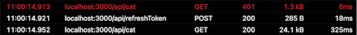
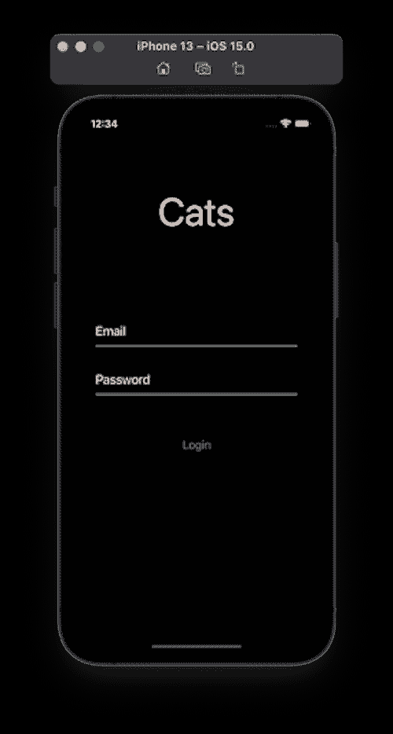

# React Native:使用 Axios 拦截器的 JWT 认证

> 原文：<https://blog.logrocket.com/react-native-jwt-authentication-using-axios-interceptors/>

## 介绍

React Native 是开发复杂移动应用程序的流行选择，无需深入了解 Android 或 iOS。React Native 的主要卖点是，您可以重用很大一部分 React web 应用程序代码来构建移动应用程序。

几乎每个 app 都需要用户认证。一个很好的选择是使用像谷歌或脸书这样的社交网站。这样，我们将大大简化认证过程，因为我们可以轻松集成内置插件。

然而，许多组织都有我们的应用程序需要处理的自定义身份验证系统。与 React 类似，React Native 也是独立的，因此在实现如此复杂的功能时需要做出很多决定。


为了演示如何认证用户，我们将构建一个演示应用程序。该应用程序只有一个功能:显示一只猫的随机图片。但是要看到这一点，用户必须经过身份验证。

## 什么是 JSON Web 令牌？

简而言之， [JSON Web 令牌(JWT)](https://blog.logrocket.com/jwt-authentication-best-practices/) 是使用 JSON 格式在两方或多方之间交换信息的一种安全方式。

### 它是如何工作的？

使用正确的凭据成功进行身份验证后，我们将收到两个令牌:一个访问令牌和一个刷新令牌。我们应该发回访问令牌，通常在每个认证请求的`Authorization`头中。访问令牌是一条敏感的信息，因为如果攻击者设法窃取了它，他就可以冒充我们。由于我们将它附加到每个请求中，因此风险更高。因此，访问令牌必须是短期的，这样攻击者就不能长时间使用它。

在访问令牌过期后，我们可以使用刷新令牌要求一个新的令牌。为了更好的用户体验，这个过程需要是平滑的。说到 UX，我们希望用户在关闭并再次打开应用程序后仍能登录。为了实现这一点，我们需要持久化令牌。

## 演示

### 后端

我已经用 Express 和 MongoDB 实现了后端。

运行它需要 Node.js 和 Docker:

```
git clone https://github.com/cristian-rita/express-jwt-authentication.git
npm install
docker run --name mongodb -d -p 27017:27017 mongo
npm run dev
```

服务器公开了四个 API 端点:

*   `/api/register`
*   `/api/login`
*   `/api/refreshToken`
*   `/api/cat`

为简单起见，让我们手动创建一个用户:

```
curl -X POST -H "Content-Type: application/json" -d '{"email":"[email protected]", "password":"test", "firstName":"John", "lastName":"Doe"}' http://localhost:3000/api/register
```

### 移动应用程序

[该应用的最终版本可在此处获得](https://github.com/cristian-rita/react-native-jwt-example)。

我们将初始化一个空的 React 本机应用程序:

```
npx react-native init ReactNativeJWTExample
```

现在我们需要安装一些依赖项:

```
npm install axios axios-auth-refresh react-native-keychain"
npx pod-install
```

在`src/context`下，创建两个文件:

```
//AuthContext.js
import React, {createContext, useState} from 'react';
import * as Keychain from 'react-native-keychain';

const AuthContext = createContext(null);
const {Provider} = AuthContext;

const AuthProvider = ({children}) => {
  const [authState, setAuthState] = useState({
    accessToken: null,
    refreshToken: null,
    authenticated: null,
  });

  const logout = async () => {
    await Keychain.resetGenericPassword();
    setAuthState({
      accessToken: null,
      refreshToken: null,
      authenticated: false,
    });
  };

  const getAccessToken = () => {
    return authState.accessToken;
  };

  return (
    <Provider
      value={{
        authState,
        getAccessToken,
        setAuthState,
        logout,
      }}>
      {children}
    </Provider>
  );
};

export {AuthContext, AuthProvider};
```

这里没什么特别的。我们使用上下文 API 来管理身份验证状态。

还有一个参考`Keychain`。正如我之前告诉你的，我们需要持久化访问和刷新令牌。

一种可能是使用 AsyncStorage，相当于浏览器的 LocalStorage。AsyncStorage 不安全，因为它没有加密。在这里保存敏感数据是一个糟糕的主意。react-native-keychain 包使用`Keychain`服务来安全地存储数据:

```
import React, {createContext, useContext} from 'react';
import axios from 'axios';
import {AuthContext} from './AuthContext';
import createAuthRefreshInterceptor from 'axios-auth-refresh';
import * as Keychain from 'react-native-keychain';

const AxiosContext = createContext();
const {Provider} = AxiosContext;

const AxiosProvider = ({children}) => {
  const authContext = useContext(AuthContext);

  const authAxios = axios.create({
    baseURL: 'http://localhost:3000/api',
  });

  const publicAxios = axios.create({
    baseURL: 'http://localhost:3000/api',
  });

  authAxios.interceptors.request.use(
    config => {
      if (!config.headers.Authorization) {
        config.headers.Authorization = `Bearer ${authContext.getAccessToken()}`;
      }

      return config;
    },
    error => {
      return Promise.reject(error);
    },
  );

  const refreshAuthLogic = failedRequest => {
    const data = {
      refreshToken: authContext.authState.refreshToken,
    };

    const options = {
      method: 'POST',
      data,
      url: 'http://localhost:3001/api/refreshToken',
    };

    return axios(options)
      .then(async tokenRefreshResponse => {
        failedRequest.response.config.headers.Authorization =
          'Bearer ' + tokenRefreshResponse.data.accessToken;

        authContext.setAuthState({
          ...authContext.authState,
          accessToken: tokenRefreshResponse.data.accessToken,
        });

        await Keychain.setGenericPassword(
          'token',
          JSON.stringify({
            accessToken: tokenRefreshResponse.data.accessToken,
            refreshToken: authContext.authState.refreshToken,
          }),
        );

        return Promise.resolve();
      })
      .catch(e => {
        authContext.setAuthState({
          accessToken: null,
          refreshToken: null,
        });
      });
  };

  createAuthRefreshInterceptor(authAxios, refreshAuthLogic, {});

  return (
    <Provider
      value={{
        authAxios,
        publicAxios,
      }}>
      {children}
    </Provider>
  );
};

export {AxiosContext, AxiosProvider};
```

我们公开了两个`axios`的实例。一个用于认证 API 调用，另一个用于公共调用。

Axios 是一个简单的 HTTP 客户端，具有一些独特的功能。Axios 允许我们拦截请求或响应。我们使用拦截器在`Authorization`头中发送访问令牌。

我们使用的另一个拦截器来自 axios-auth-refresh 包。从客户端的角度来看，除非我们验证过期日期，否则不可能确定访问令牌是否已经过期。这种检查可能很棘手，所以最好依靠服务器来告诉我们访问令牌是否仍然有效。

这种方法的缺点是，我们意识到访问令牌只有在 HTTP 调用失败后才会过期。在这种情况下，我们首先需要刷新访问令牌，然后重试失败的请求。axios-auth-refresh 包为我们处理了所有这些复杂性。



现在我们修改`index.js`文件以使用新创建的上下文提供者:

```
//index.js
import {AppRegistry} from 'react-native';
import App from './App';
import {name as appName} from './app.json';
import {AuthProvider} from './src/context/AuthContext';
import {AxiosProvider} from './src/context/AxiosContext';
import React from 'react';

const Root = () => {
  return (
    <AuthProvider>
      <AxiosProvider>
        <App />
      </AxiosProvider>
    </AuthProvider>
  );
};
AppRegistry.registerComponent(appName, () => Root);
```

在`App.js`文件中，我们尝试从密钥库中加载令牌。如果没有令牌，我们将呈现**登录**屏幕。否则，我们显示**仪表板**:

```
// App.js

import React, {useCallback, useContext, useEffect, useState} from 'react';
import Login from './src/components/Login';
import {AuthContext} from './src/context/AuthContext';
import * as Keychain from 'react-native-keychain';
import Dashboard from './src/components/Dashboard';
import Spinner from './src/components/Spinner';

const App = () => {
  const authContext = useContext(AuthContext);
  const [status, setStatus] = useState('loading');

  const loadJWT = useCallback(async () => {
    try {
      const value = await Keychain.getGenericPassword();
      const jwt = JSON.parse(value.password);

      authContext.setAuthState({
        accessToken: jwt.accessToken || null,
        refreshToken: jwt.refreshToken || null,
        authenticated: jwt.accessToken !== null,
      });
      setStatus('success');
    } catch (error) {
      setStatus('error');
      console.log(`Keychain Error: ${error.message}`);
      authContext.setAuthState({
        accessToken: null,
        refreshToken: null,
        authenticated: false,
      });
    }
  }, []);

  useEffect(() => {
    loadJWT();
  }, [loadJWT]);

  if (status === 'loading') {
    return <Spinner />;
  }

  if (authContext?.authState?.authenticated === false) {
    return <Login />;
  } else {
    return <Dashboard />;
  }
};

export default App;
```

在检查`Keychain`时，我们显示一个我们在`src/components/Spinner.js`中创建的微调器:

```
// src/components/Spinner.js

import React from 'react';
import {ActivityIndicator, StyleSheet, View} from 'react-native';

const Spinner = () => (
  <View style={styles.container}>
    <ActivityIndicator size="large" color="#007aff" />
  </View>
);

const styles = StyleSheet.create({
  container: {
    flex: 1,
    justifyContent: 'center',
    alignItems: 'center',
  },
});

export default Spinner;
```

现在我们已经实现了认证流程，我们还需要实现另外两个组件，**登录**和**仪表板**:

```
// src/components/Login.js

import {
  View,
  Text,
  StyleSheet,
  SafeAreaView,
  TextInput,
  Button,
  Alert,
} from 'react-native';
import React, {useContext, useState} from 'react';
import {AuthContext} from '../context/AuthContext';
import * as Keychain from 'react-native-keychain';
import {AxiosContext} from '../context/AxiosContext';

const Login = () => {
  const [email, setEmail] = useState('');

  const [password, setPassword] = useState('');
  const authContext = useContext(AuthContext);
  const {publicAxios} = useContext(AxiosContext);

  const onLogin = async () => {
    try {
      const response = await publicAxios.post('/login', {
        email,
        password,
      });

      const {accessToken, refreshToken} = response.data;
      authContext.setAuthState({
        accessToken,
        refreshToken,
        authenticated: true,
      });

      await Keychain.setGenericPassword(
        'token',
        JSON.stringify({
          accessToken,
          refreshToken,
        }),
      );
    } catch (error) {
      Alert.alert('Login Failed', error.response.data.message);
    }
  };

  return (
    <SafeAreaView style={styles.container}>
      <Text style={styles.logo}>Cats</Text>
      <View style={styles.form}>
        <TextInput
          style={styles.input}
          placeholder="Email"
          placeholderTextColor="#fefefe"
          keyboardType="email-address"
          autoCapitalize="none"
          onChangeText={text => setEmail(text)}
          value={email}
        />

        <TextInput
          style={styles.input}
          placeholder="Password"
          placeholderTextColor="#fefefe"
          secureTextEntry
          onChangeText={text => setPassword(text)}
          value={password}
        />
      </View>
      <Button title="Login" style={styles.button} onPress={() => onLogin()} />
    </SafeAreaView>
  );
};

const styles = StyleSheet.create({
  container: {
    flex: 1,
    backgroundColor: '#000',
    alignItems: 'center',
    justifyContent: 'flex-start',
    width: '100%',
  },
  logo: {
    fontSize: 60,
    color: '#fff',
    margin: '20%',
  },
  form: {
    width: '80%',
    margin: '10%',
  },
  input: {
    fontSize: 20,
    color: '#fff',
    paddingBottom: 10,
    borderBottomColor: '#fff',
    borderBottomWidth: 1,
    marginVertical: 20,
  },
  button: {},
});

export default Login;
```



登录非常简单。我们展示一个表单，并用 Axios 的公共实例调用 API。如果登录成功，我们将访问和刷新令牌保存到`Keychain`:

```
// src/components/Dashboard.js

import React, {useContext, useState} from 'react';
import {Button, Image, StyleSheet, View} from 'react-native';
import {AuthContext} from '../context/AuthContext';
import {AxiosContext} from '../context/AxiosContext';
import Spinner from './Spinner';

const Dashboard = () => {
  const axiosContext = useContext(AxiosContext);
  const authContext = useContext(AuthContext);
  const [image, setImage] = useState(null);
  const [status, setStatus] = useState('idle');

  const loadImage = async () => {
    setStatus('loading');
    try {
      const response = await axiosContext.authAxios.get('/cat');
      setImage(response.data);
      setStatus('success');
    } catch (error) {
      setStatus('error');
    }
  };

  if (status === 'loading') {
    return <Spinner />;
  }

  return (
    <View style={styles.container}>
      <Image
        source={{uri: image}}
        width={300}
        height={500}
        style={styles.image}
      />

      <View style={styles.buttonGroup}>
        <Button title="Get Image" onPress={loadImage} />
        <Button title="Logout" onPress={() => authContext.logout()} />
      </View>
    </View>
  );
};

const styles = StyleSheet.create({
  container: {
    justifyContent: 'center',
    alignItems: 'center',
    flex: 1,
  },
  image: {
    width: '90%',
    height: '50%',
    resizeMode: 'contain',
  },
  buttonGroup: {
    marginTop: 20,
    flexDirection: 'row',
    justifyContent: 'space-between',
    width: '90%',
  },
});
export default Dashboard;
```

`Dashboard`组件有两个按钮:一个用于通过调用`/api/cat`获取新图像，另一个用于注销。

现在，您应该能够使用我们之前创建的用户登录并测试应用程序了。

```
Email: [email protected]
Passwod: test
```

请记住，有更好的方法来处理这些 API 请求。此外，我们应该有更好的错误处理，但我们试图让应用程序尽可能简单。

## 结论

实现身份验证不是一项简单的任务。尽管我们创建了一个简单的应用程序，但是您可以将这些想法作为起点，并围绕它们进行构建。例如，添加导航就像用专用于公共导航的导航栈替换`Login`组件，用用于认证导航的导航栈替换`Dashboard`组件一样简单。

## [LogRocket](https://lp.logrocket.com/blg/react-native-signup) :即时重现 React 原生应用中的问题。

[](https://lp.logrocket.com/blg/react-native-signup)

[LogRocket](https://lp.logrocket.com/blg/react-native-signup) 是一款 React 原生监控解决方案，可帮助您即时重现问题、确定 bug 的优先级并了解 React 原生应用的性能。

LogRocket 还可以向你展示用户是如何与你的应用程序互动的，从而帮助你提高转化率和产品使用率。LogRocket 的产品分析功能揭示了用户不完成特定流程或不采用新功能的原因。

开始主动监控您的 React 原生应用— [免费试用 LogRocket】。](https://lp.logrocket.com/blg/react-native-signup)