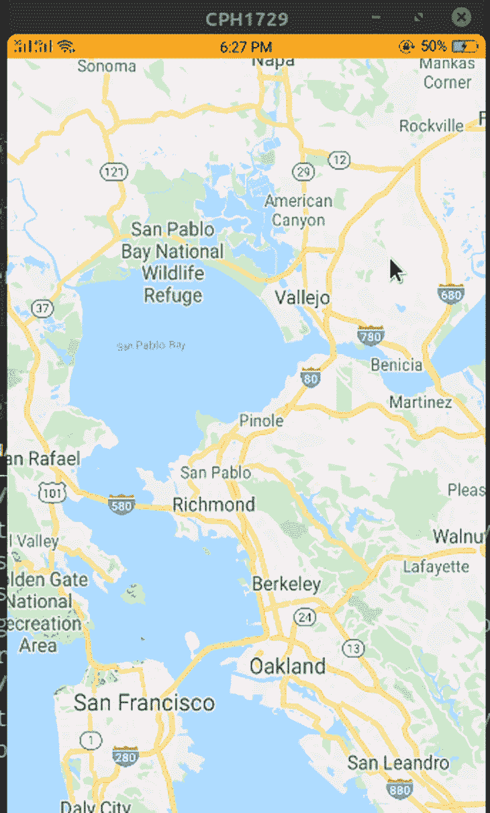
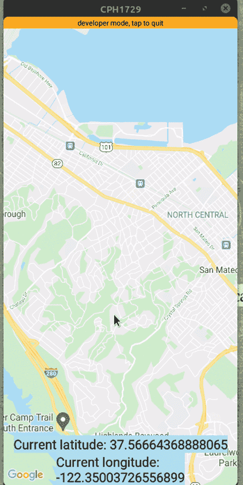
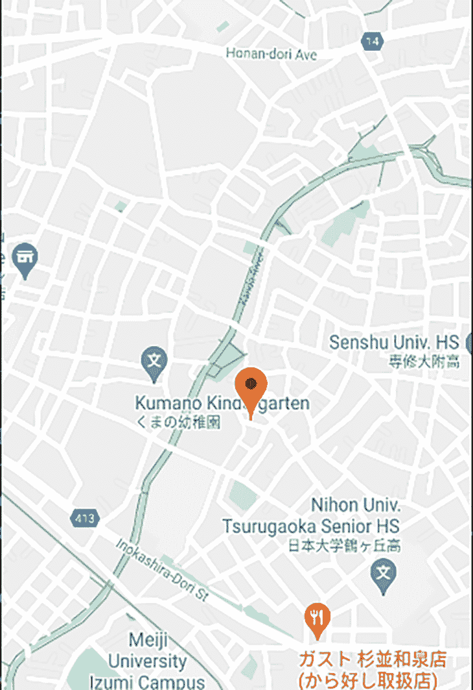
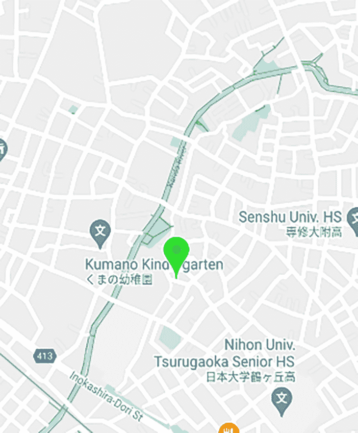
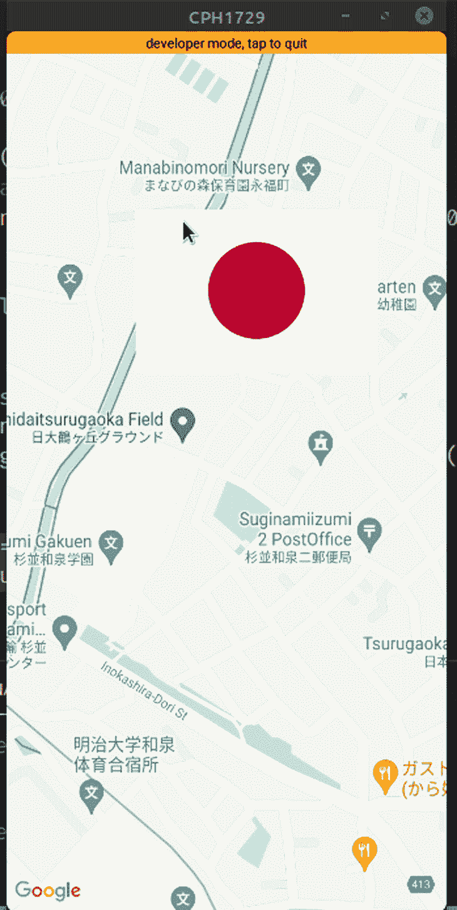
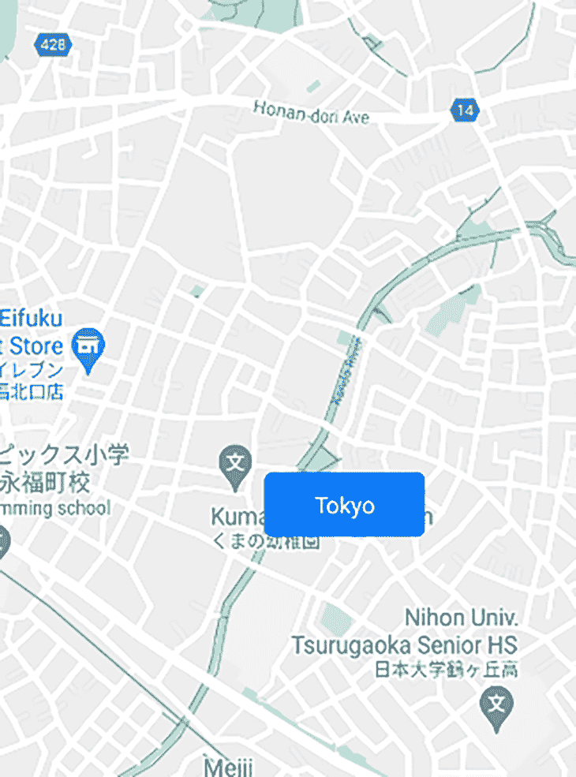
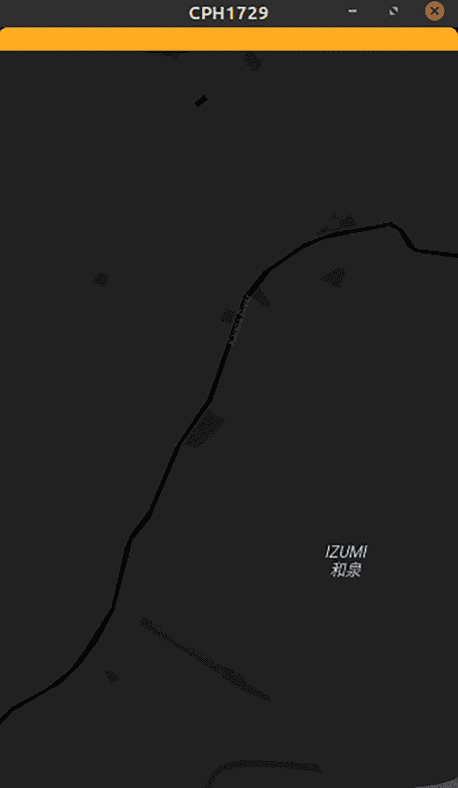
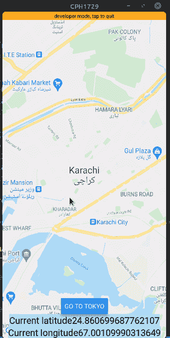
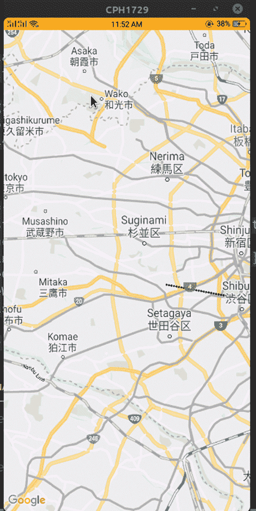
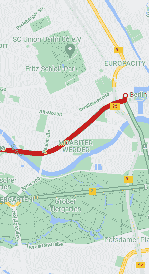

# React 原生地图介绍

> 原文：<https://blog.logrocket.com/react-native-maps-introduction/>

***编者按**:本帖于 2021 年 10 月更新，包含了新信息和更新的例子。*

拥有关于用户位置的准确信息是增强用户体验的一个好方法。例如，您可以使用这些数据向用户展示他们周围的情况，为他们所在地区的产品和服务提供独家交易，等等。我们将讨论以下主题:

幸运的是，如果您有 React 应用程序，使用 [`react-native-maps`库](https://github.com/react-native-maps/react-native-maps)实现地图是轻而易举的事情。

## 什么是 React 原生地图？

React Native Maps 是一个地图组件系统，附带需要与 React Native 一起编译的平台本机代码。在本指南中，我们将演示如何将谷歌地图集成到您的 React 原生应用程序中，并向您介绍基本组件，如`<MapView />`和`<Marker>`。

我们开始吧！

### 装置

在呈现我们的`MapView`组件之前，我们首先需要获得一个 API 键，将 Google Maps 功能整合到我们的应用程序中。为此，使用这些步骤获取您的 [API 秘密。](https://developers.google.com/maps/documentation/android-sdk/get-api-key)

接下来，在`android/app/src/main/AndroidManifest.xml`下，添加这段代码:

```
<application>
   <!-- You will only need to add this meta-data tag, but make sure it's a child of application -->
   <meta-data
     android:name="com.google.android.geo.API_KEY"
     android:value="YOUR_API_KEY"/> <!-- Your key goes here. -->

   <!-- You will also only need to add this uses-library tag -->
   <uses-library android:name="org.apache.http.legacy" android:required="false"/>
</application>

```

这将把我们的 SDK 密钥连接到 [React 本地项目](https://blog.logrocket.com/tag/react-native)。

接下来，运行以下命令将`react-native-maps`安装到您的项目中。

```
yarn add react-native-maps -E
npm install react-native-maps
#Expo requires a different version of this package.
# so if you are using Expo, run this instead:
expo install react-native-maps

```

## 设置地图默认视图

从`App.js`文件中删除所有默认代码，并从`react-native-maps`导入`<MapView />`组件。在组件内部，呈现`<MapView />`组件。

```
import React from "react";
import { StyleSheet, Text, View } from "react-native";
import MapView from "react-native-maps";
export default function App() {
  return (
    <View style={styles.container}>
    {/*Render our MapView*/}
      <MapView
        style={styles.map}
        //specify our coordinates.
        initialRegion={{
          latitude: 37.78825,
          longitude: -122.4324,
          latitudeDelta: 0.0922,
          longitudeDelta: 0.0421,
        }}
      />
    </View>
  );
}
//create our styling code:
const styles = StyleSheet.create({
  container: {
    ...StyleSheet.absoluteFillObject,
    flex: 1, //the container will fill the whole screen.
    justifyContent: "flex-end",
    alignItems: "center",
  },
  map: {
    ...StyleSheet.absoluteFillObject,
  },
});

```

`initialRegion`属性显示了组件安装时将在地图上显示的区域。`initialRegion`值在初始化后不能更改。



不要忘记添加 style 属性来指定尺寸；否则，你会以白屏结束。值`{ flex: 1 }`将确保 [`<MapView />`](https://github.com/react-native-community/react-native-maps/blob/master/docs/mapview.md) 占据整个屏幕。

您需要将一个带有某个区域的纬度、经度和 delta 值的对象传递给`initialRegion` prop。`latitudeDelta`和`longitudeDelta`属性指定地图上的区域必须缩放多少。要改变区域，使用`region`道具。

## 使用带有`useState`钩子的 React 原生贴图

要用`useState`钩子改变区域，使用`onRegionChangeComplete`道具将新区域设置为状态。`onRegionChangeComplete`是一个回调道具，当用户停止在地图上移动时运行。

```
//extra code removed for brevity.
//create a Hook to store our region data.
const [region, setRegion] = useState({
  latitude: 51.5079145,
  longitude: -0.0899163,
  latitudeDelta: 0.01,
  longitudeDelta: 0.01,
});
return (
  <View style={styles.container}>
    <MapView
      style={styles.map}
      initialRegion={{
        latitude: 37.78825,
        longitude: -122.4324,
        latitudeDelta: 0.0922,
        longitudeDelta: 0.0421,
      }}
      //onRegionChangeComplete runs when the user stops dragging MapView
      onRegionChangeComplete={(region) => setRegion(region)}
    />
    {/*Display user's current region:*/}
    <Text style={styles.text}>Current latitude: {region.latitude}</Text>
    <Text style={styles.text}>Current longitude: {region.longitude}</Text>
  </View>
);

```



## 在 React 原生贴图中添加标记

从`react-native-maps`导入`Marker`开始。

```
import { Marker } from "react-native-maps";

```

接下来，将`<Marker />`组件呈现为`<MapView />`的子组件。传递`coordinate`道具中标记的坐标。

```
import { Marker } from "react-native-maps";
const tokyoRegion = {
  latitude: 35.6762,
  longitude: 139.6503,
  latitudeDelta: 0.01,
  longitudeDelta: 0.01,
};
return (
  <View style={styles.container}>
    <MapView
      style={styles.map}
      initialRegion={tokyoRegion} //your region data goes here.
    >
      {/*Make sure the Marker component is a child of MapView. Otherwise it won't render*/}
      <Marker coordinate={tokyoRegion} />
    </MapView>
  </View>
);

```

标记现在应该是可见的，如下所示。



您可以向地图添加`n`个标记，并将其作为直接子组件传递给`<MapView />`组件。

以下是同一个`MapView`中多个`Marker`组件的示例:

```
<MapView
  ref={mapRef}
  style={styles.map}
  initialRegion={tokyoRegion}
  onRegionChangeComplete={(region) => setRegion(region)}
>
  <Marker coordinate={tokyoRegion} />
  {/*marker to a nearby location */}
  <Marker
    coordinate={{
      latitude: 35.67714827145542,
      longitude: 139.6551462687416,
    }}
  />
</MapView>;

```


## 自定义地图标记

### 改变颜色

要改变标记的颜色，使用`pinColor`道具。

```
<Marker
  coordinate={tokyoRegion}
  pinColor="green"
/>

```

这里，我们将大头针的颜色改为`green`:



### 更改标记图像

您还可以通过将`image`属性传递给`<Marker />`组件来添加自定义标记图像。

```
<Marker
  coordinate={{ latitude: 52.5200066, longitude: 13.404954 }}
  image={require("./japaneseFlag.png")} //uses relative file path. 
/>

```



### 更改标记视图

`react-native-maps`也允许开发者使用自定义标记视图。这在您想要使用符号指示位置的情况下可能会有所帮助。一个例子可能是显示一个`Car`组件来显示汽车经销商的位置。

为此，首先要编写一些代码来构建一个自定义组件，如下所示:

```
//create our custom marker component.
function CustomMarker() {
  return (
    <View style={styles.marker}>
      <Text style={styles.color}>Tokyo</Text>
    </View>
  );
}
//styles for our custom marker.
const styles = StyleSheet.create({
  marker: {
    paddingVertical: 10,
    paddingHorizontal: 30,
    backgroundColor: "#007bff",
    borderColor: "#eee",
    borderRadius: 5,
    elevation: 10,
  },
  text: {
  color: "#fff",   
  },
});

```

接下来，将`CustomMarker`合并到你的项目中。

```
 export default function App() {
  return (
    <View style={styles.container}>
      <MapView style={styles.map} initialRegion={tokyoRegion}>
        <Marker coordinate={tokyoRegion}>
          {/* CustomMarker has to be a child of Marker*/}
          <CustomMarker />
        </Marker>
      </MapView>
    </View>
  );
}

```



## 设计地图样式

从[谷歌样式生成器](https://mapstyle.withgoogle.com/)中生成用于设计地图的 JSON 对象。接下来，将生成的样式对象传递给`<MapView />`组件的`customMapStyle` prop。

```
import React, { useState, useRef } from "react";
import { StyleSheet, Text, View, Button } from "react-native";
import MapView, { Marker } from "react-native-maps";

const mapStyle = []; //map styles go here!
export default function App() {
  return (
    <View style={styles.container}>
      <MapView
        style={styles.map}
        initialRegion={tokyoRegion}
        customMapStyle={mapStyle} //plug in our custom style into the customMapStyle prop.
      />
    </View>
  );
}

```

您可以忽略`mapStyle`变量——因为我们正在使用生成器生成地图样式，您只需要将生成的 JSON 对象粘贴到您的代码中，并将其发送到`<MapView />`组件。



正如你所看到的，地图样式从默认的浅色主题变成了深色主题。

## 获取当前位置或特定坐标

如果你想动画到一个特定的坐标呢？

首先，使用`useRef()`钩子创建对`<MapView />`的引用:

```
import { useRef } from "react";

const mapRef = useRef(null);
<MapView
  ref={mapRef} //assign our ref to this MapView
  /*further code.. */
/>

```

这意味着我们现在可以执行方法来控制我们的`MapView`组件。

接下来，添加这个块:

```
//extra code removed for brevity
//destination coordinates
const tokyoRegion = {
  latitude: 35.6762,
  longitude: 139.6503,
  latitudeDelta: 0.01,
  longitudeDelta: 0.01,
};
const goToTokyo = () => {
  //Animate the user to new region. Complete this animation in 3 seconds
  mapRef.current.animateToRegion(tokyoRegion, 3 * 1000);
};
return (
  <View style={styles.container}>
    <Button onPress={() => goToTokyo()} title="Go to Tokyo" />
  </View>
);

```

下面是这个片段的分解:

`useRef()`钩子返回一个可变的 ref 对象，它的`current`属性具有所传递参数的值。如果`current`属性的值是`undefined`，这意味着组件还没有安装。现在，您可以使用`mapRef.current`来访问任何`<MapView />`方法。

`animateToRegion()`方法接受任意两个参数:目标坐标(在本例中为`tokyoRegion`)和以毫秒为单位的动画持续时间。



最后，您的`App.js`文件中的代码应该是这样的:

```
export default function App() {
  const mapRef = useRef(null);
  const [region, setRegion] = useState({
    latitude: 51.5079145,
    longitude: -0.0899163,
    latitudeDelta: 0.01,
    longitudeDelta: 0.01,
  });
  const tokyoRegion = {
    latitude: 35.6762,
    longitude: 139.6503,
    latitudeDelta: 0.01,
    longitudeDelta: 0.01,
  };
  const goToTokyo = () => {
    //complete this animation in 3 seconds
    mapRef.current.animateToRegion(tokyoRegion, 3 * 1000);
  };
  return (
    <View style={styles.container}>
      <MapView
        ref={mapRef}
        style={styles.map}
        initialRegion={{
          latitude: 24.8607,
          longitude: 67.0011,
          latitudeDelta: 0.0922,
          longitudeDelta: 0.0421,
        }}
        onRegionChangeComplete={(region) => setRegion(region)}
      />
      <Button onPress={() => goToTokyo()} title="Go to Tokyo" />
      <Text style={styles.text}>Current latitude{region.latitude}</Text>
      <Text style={styles.text}>Current longitude{region.longitude}</Text>
    </View>
  );
}
const styles = StyleSheet.create({
  container: {
    ...StyleSheet.absoluteFillObject,
    flex: 1,
    justifyContent: "flex-end",
    alignItems: "center",
  },
  map: {
    ...StyleSheet.absoluteFillObject,
  },
  text: {
    fontSize: 20,
    backgroundColor: "lightblue",
  },
});

```

## 在 React 原生贴图中使用`<polyline />`

您可以使用`react-native-maps`库中的`<Polyline />`组件在多个坐标之间创建直线。它在其`coordinates`属性中接受一个坐标数组。你也可以指定额外的道具用于造型目的，比如`strokeWidth`、`strokeColor`等。

让我们在东京和千叶之间创造一条道路。

```
import { Polyline } from "react-native-maps";

const tokyoRegion = {
  latitude: 35.6762,
  longitude: 139.6503,
  latitudeDelta: 0.01,
  longitudeDelta: 0.01,
};
const chibaRegion = {
  latitude: 35.6074,
  longitude: 140.1065,
  latitudeDelta: 0.01,
  longitudeDelta: 0.01,
};

return (
  <View style={styles.container}>
    <MapView style={styles.map} initialRegion={tokyoRegion}>
      <Polyline
        coordinates={[tokyoRegion, chibaRegion]} //specify our coordinates
        strokeColor={"#000"}
        strokeWidth={3}
        lineDashPattern={[1]}
      />
    </MapView>
  </View>
);

```

将位置的坐标存储在它们各自的变量中，并以数组的形式传递给`<Polyline />`组件的`coordinates`属性。



如果你看结果，线直接画在这些坐标之间，没有考虑实际的地理路径和道路。为此，您需要使用 Google Maps Direction API 在源位置和目的地位置之间建立多个坐标，该 API 会返回两地之间所有可能的路线。

## 使用谷歌地图方向 API

为了[使用方向 API](https://blog.logrocket.com/a-practical-guide-to-integrating-google-maps-in-react/) ，你必须首先[为你的项目](https://console.cloud.google.com/apis/library/directions-backend.googleapis.com)启用它。请注意，您需要有一个有效的帐单地址才能使用谷歌云，否则方向功能将无法工作。

首先，创建一个名为`getDirections`的助手函数。在这里，编写以下代码:

```
import {decode} from "@mapbox/polyline"; //please install this package before running!
const getDirections = async (startLoc, destinationLoc) => {
  try {
    const KEY = "YOUR GOOGLE API KEY"; //put your API key here.
    //otherwise, you'll have an 'unauthorized' error.
    let resp = await fetch(
      `https://maps.googleapis.com/maps/api/directions/json?origin=${startLoc}&destination=${destinationLoc}&key=${KEY}`
    );
    let respJson = await resp.json();
    let points = decode(respJson.routes[0].overview_polyline.points);
    console.log(points);
    let coords = points.map((point, index) => {
      return {
        latitude: point[0],
        longitude: point[1]
      };
    });
    return coords;
  } catch (error) {
    return error;
  }
};

```

`decode()`函数将把来自`overview_polyline.points`属性的编码折线点转换成包含所有坐标的纬度和经度的数组。

因此，这将允许`PolyLine`组件容易地读取位置坐标。没有它，`react-native-maps`抛出一个错误。

```
import React, { useState, useEffect } from "react";
import { View, Text } from "react-native";
import MapView, { Polyline } from "react-native-maps";
import { decode } from "@mapbox/polyline";

const App = () => {
  const [coords, setCoords] = useState([]);

  useEffect(() => {
    //fetch the coordinates and then store its value into the coords Hook.
    getDirections("52.5200066,13.404954", "50.1109221,8.6821267")
      .then(coords => setCoords(coords))
      .catch(err => console.log("Something went wrong"));
  }, []);

  return (
    <>
      <MapView
        style={{ flex: 1 }}
        initialRegion={{
          latitude: 52.5200066,
          longitude: 13.404954,
          latitudeDelta: 0.1,
          longitudeDelta: 0.1
        }}
      >
        {/* finally, render the Polyline component with the coords data */}
        {coords.length > 0 && <Polyline coordinates={coords} />}
      </MapView>
    </>
  );
};

export default App;

```



## 结论

现在你应该对如何[实现地图](https://blog.logrocket.com/react-map-library-comparison/)和在`react-native-maps`库之上构建自定义特性有了基本的了解。您可以在工作中运用这些经验来构建各种类型的应用程序，从出租车服务、餐馆查找器到送货应用程序等等。`react-native-maps`库使得整合地图变得简单，并且是 React 本地生态系统中的重要角色。

## [LogRocket](https://lp.logrocket.com/blg/react-native-signup) :即时重现 React 原生应用中的问题。

[](https://lp.logrocket.com/blg/react-native-signup)

[LogRocket](https://lp.logrocket.com/blg/react-native-signup) 是一款 React 原生监控解决方案，可帮助您即时重现问题、确定 bug 的优先级并了解 React 原生应用的性能。

LogRocket 还可以向你展示用户是如何与你的应用程序互动的，从而帮助你提高转化率和产品使用率。LogRocket 的产品分析功能揭示了用户不完成特定流程或不采用新功能的原因。

开始主动监控您的 React 原生应用— [免费试用 LogRocket】。](https://lp.logrocket.com/blg/react-native-signup)