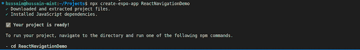
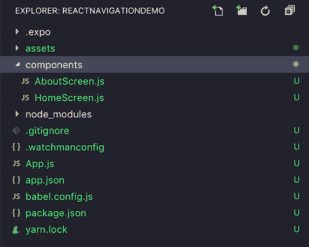
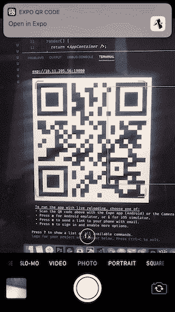
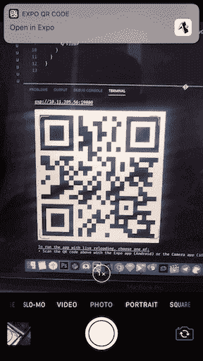
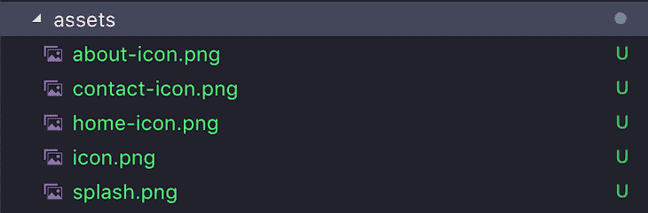
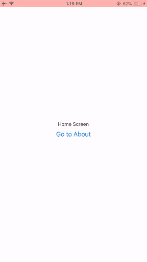
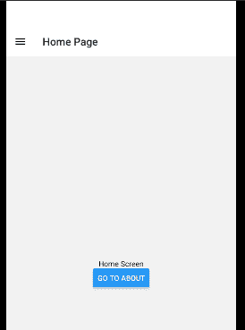

# React 本地导航:示例教程- LogRocket 博客

> 原文：<https://blog.logrocket.com/react-native-navigation-tutorial/>

***编者按**:这份 React 原生导航教程最后一次更新是在 2022 年 12 月 1 日，包括撰写本文时 React 导航的最新版本 v6 的信息，以及 React 导航与 React 路由器库的比较部分。查看 [React 导航与 React 原生导航:哪个适合你？](https://blog.logrocket.com/react-navigation-vs-react-native-navigation/)了解更多信息。*

移动应用程序由多个屏幕组成。在构建移动应用程序时，一个主要问题是如何处理用户在应用程序中的导航——例如，屏幕的显示和屏幕之间的转换。

[React 导航](https://github.com/react-navigation/react-navigation)是 React 可用的最知名的导航库之一。在本教程中，我们将浏览 React 本机导航的基础知识，向您展示如何开始在 React 本机应用程序中使用 React 导航，并浏览一些 React 本机导航示例。

[https://www.youtube.com/embed/3hLQURJM7ws](https://www.youtube.com/embed/3hLQURJM7ws)

视频

我们将讨论以下内容:

## 什么是 React 导航？

[React Navigation](https://reactnavigation.org/) 是一个独立的库，使您能够在 React 本地应用程序中实现导航功能。

React 导航是用 JavaScript 编写的，不直接使用 iOS 和 Android 上的原生导航 API。相反，它重新创建了这些 API 的子集。这允许集成第三方 JS 插件，最大化定制，更容易调试，不需要学习 Objective-C，Swift，Java，Kotlin 等。

## 反应导航 6.0

在撰写本文时，React 导航最稳定的版本是 React 导航 6.0，于 2021 年 8 月发布。根据他们的[发布帖子](https://reactnavigation.org/blog/2021/08/14/react-navigation-6.0/)，最新版本专注于灵活性和易用性。然而，该团队也表示，最新版本这次带来的突破性变化很少。

React Navigation 6.0 中包含的一些新功能包括:

*   导航器的灵活定制选项:这意味着开发人员现在可以进一步调整导航器的外观
*   `Group`组件: [`Group`](https://reactnavigation.org/docs/group) 元素让用户在项目的不同屏幕之间共享屏幕选项和配置。因此，这允许更多的组织和代码可读性
*   组件库:从 v6 开始，导航团队已经创建了一个 [`elements`](https://reactnavigation.org/docs/elements) 组件库。这对于用户想要构建自定义导航器的情况非常有用
*   本地导航:默认情况下，库现在使用`[native-stack](https://reactnavigation.org/docs/native-stack-navigator/)`。这意味着在较旧的设备上，大屏幕之间的导航速度更快，要求更低
*   [Flipper 插件](https://fbflipper.com/):这个工具允许开发者调试他们的应用并跟踪性能。在最新版本中，现在有一个官方的[反应导航插件](https://reactnavigation.org/docs/devtools/#useflipper)来使测试过程更容易

## 什么是 React 原生导航？

[React 原生导航](https://wix.github.io/react-native-navigation/docs/before-you-start/)是 React 导航的一个流行替代方案。它是一个依赖于 React Native 的模块，并被设计为与 React Native 一起使用。React 原生导航略有不同，它直接使用 iOS 和 Android 上的原生导航 API，这允许更原生的外观和感觉。

有关 React 导航和 React 原生导航之间的差异的更详细的探索，请查看" [React 导航与 React 原生导航:哪个适合您？](https://blog.logrocket.com/react-navigation-vs-react-native-navigation-which-is-right-for-you-3d47c1cd1d63/)

## 另一种选择:本地反应路由器

[React Router Native](https://v5.reactrouter.com/native/guides/quick-start) 是 React Native 应用中实现导航功能的另一种解决方案。它是由最著名的[现代网络框架](https://remix.run/docs/en/v1)的[、](https://remix.run/)混合团队开发的。

React Router Native 与 [React Router 框架](https://reactrouter.com/en/main)共享其大部分 API 代码。这意味着使用过 React Router 的 web 开发人员会发现使用它的本地版本很容易。

就易用性而言，React Navigation 和 React Router Native 是完全相同的。例如，查看以下路由器本机代码:

```
import { NativeRouter, Route, Link } from "react-router-native";
const Home = () => <Text>Home</Text>;
const About = () => <Text>About</Text>;
const App = () => (
  <NativeRouter>
    <View>
      <View>
        {/* Define our links. They are like anchor tags */}
        <Link to="/">
          <Text>Home</Text>
        </Link>
        <Link to="/about">
          <Text>About</Text>
        </Link>
      </View>
      {/*Define our routes for this project*/}
      <Route exact path="/" component={Home} />
      <Route path="/about" component={About} />
    </View>
    {/*The NativeRouter*/}
  </NativeRouter>
);

```

与导航相比，我们可以看到代码是相似的:

```
import { NavigationContainer } from "@react-navigation/native";
import { createNativeStackNavigator } from "@react-navigation/native-stack";
function HomeScreen() {
  return (
    <View>
      <Text>Home Screen</Text>
    </View>
  );
}
function AboutScreen() {
  return (
    <View>
      <Text>About Screen</Text>
    </View>
  );
}
const Stack = createNativeStackNavigator();
export default function App() {
  return (
    <NavigationContainer>
     <Stack.Navigator>
        {/*Define our routes*/}
        <Stack.Screen name="Home" component={HomeScreen} />
        <Stack.Screen name="About" component={AboutScreen} />
      </Stack.Navigator>
    </NavigationContainer>
  );
}

```

这两个库中用于实现路由的代码是相同的。这是一个主要的优点，因为这意味着在两个框架中都有一个较小的学习曲线。

如果你是 web 开发出身，我会推荐 React Router Native，因为它的用法和 React Router 是一样的。否则，应该选择 React Navigation，因为它有一个更大的社区，可以提供更多的开发支持。

## 安装 React 导航

假设你已经安装了 [Yarn](https://yarnpkg.com/en/) ，第一步就是设置一个 React 原生 app。开始使用 React Native 最简单的方法是使用 Expo 工具，因为它们允许您在不安装和配置 Xcode 或 Android Studio 的情况下启动项目。

首先，使用以下 bash 命令初始化一个空白 Expo 应用程序:

```
npx create-expo-app ReactNavigationDemo

```

这将启动下载过程并配置项目:



接下来，将 cd 放入项目文件夹并打开代码编辑器:

```
cd ReactNavigationDemo

```

如果您使用的是 VS 代码，您可以使用以下命令在编辑器中打开当前文件夹:

```
code .

```

使用以下内容启动应用程序:

```
npx expo start

```

下一步是在您的 [React Native](https://facebook.github.io/react-native/docs/getting-started) 项目中安装`react-navigation`库:

```
npm install @react-navigation/native
npx expo install react-native-screens react-native-safe-area-context

```

## React 本机堆栈导航器

React Navigation 是用 JavaScript 构建的，它让您创建看起来和感觉上都像真正的本地组件和导航模式。

React Navigation 使用所谓的堆栈导航器来管理导航历史，并根据用户在应用程序中选择的路线显示相应的屏幕。在给定时间，仅向用户呈现一个屏幕。

想象一叠纸；导航到一个新的屏幕会将它放在堆栈的顶部，向后导航会将它从堆栈中移除。stack navigator 还提供了类似于原生 iOS 和 Android 的过渡和手势。请注意，一个应用程序可以有多个堆栈导航器。

## React 本机导航示例

在这一节中，我们将探索 React 本机导航模式的一些示例，以及如何使用 React 导航库来实现它们。

### 1.使用堆栈导航器在屏幕组件之间导航

让我们首先在项目的根目录下创建一个`/components`文件夹。然后我们创建两个文件，`Homescreen.js`和`Aboutscreen`:

```
// Homescreen.js
import React from "react";
import { Button, View, Text } from "react-native";

export default function HomeScreen({ navigation }) {
  return (
    <View style={{ flex: 1, alignItems: "center", justifyContent: "center" }}>
      <Text>Home Screen</Text>
      <Button
        title="Go to About"
        onPress={() => navigation.navigate("About")}
      />
    </View>
  );
}

```

注意上面按钮的`onPress`道具——我们稍后会解释它的作用。

```
// Aboutscreen.js
import React, { Component } from "react";
import { Button, View, Text } from "react-native";
export default function AboutScreen() {
  return (
    <View style={{ flex: 1, alignItems: "center", justifyContent: "center" }}>
      <Text>About Screen</Text>
    </View>
  );
}

```

您的项目文件夹应该如下所示:



我们也来对`App.js`做一些改动。在这里，我们必须进行以下导入:

```
//tell React that we will implement a navigator
import { NavigationContainer } from "@react-navigation/native";
//create a stack navigator
import { createNativeStackNavigator } from "@react-navigation/native-stack";

```

在根`App.js`文件中实现我们的导航是有用的，因为从`App.js`导出的组件是 React 本机应用程序的入口点(或根组件)，而其他所有组件都是其后代。

正如您将看到的，我们将在导航功能中封装所有其他组件:

```
// App.js
import * as React from "react";
import { View, Text } from "react-native";
import { NavigationContainer } from "@react-navigation/native";
import { createNativeStackNavigator } from "@react-navigation/native-stack";
import HomeScreen from "./components/HomeScreen";
import AboutScreen from "./components/AboutScreen";

const Stack = createNativeStackNavigator();

export default function App() {
  return (
    <NavigationContainer>
      <Stack.Navigator>
        <Stack.Screen name="Home" component={HomeScreen} />
        <Stack.Screen name="About" component={AboutScreen} />
      </Stack.Navigator>
    </NavigationContainer>
  );
}

```

在上面的代码中，`createNativeStackNavigator`为我们的应用程序提供了一种在屏幕之间转换的方法，其中每个新屏幕都被放置在一个堆栈的顶部。它被配置为具有熟悉的 iOS 和 Android 外观和感觉:在 iOS 上新屏幕从右边滑入，在 Android 上从底部淡入。

这里，我们已经执行了`createNativeStackNavigator`函数，并将其实例存储到了`Stack`变量中。

稍后，我们将使用`Stack.Screen`标签来传递我们的路线。`Home`路线对应`HomeScreen`，而`About`路线对应`AboutScreen`。

`createStackNavigator`函数在幕后传递，一个`navigate`道具传递给`HomeScreen`和`AboutScreen`组件。该属性允许导航到指定的屏幕组件。这就是为什么我们能够在`HomeScreen.js`的一个按钮上使用它，当按下该按钮时，会进入`AboutScreen`页面，如下所示:

```
<Button title="Go to About" onPress={() => navigation.navigate("About")} />;

```

在`App.js`代码中，我们最终通过将组件包装在`NavigationContainer`标签中创建了一个应用程序容器。该容器管理导航状态。

要运行该应用程序，您需要下载 Expo 客户端应用程序。可以获得[iOS](https://itunes.apple.com/us/app/expo-client/id982107779?mt=8)和 [Android](https://play.google.com/store/apps/details?id=host.exp.exponent&hl=en) 版本。确保您的命令行指向项目文件夹，并运行以下命令:

```
npx expo start

```

您应该会在终端上看到一个二维码。用 Android 上的 Expo app 扫描二维码，对于 iOS 的 app，可以用普通的 iPhone 摄像头扫描，会有命令提示你点击打开 Expo app:



### 2.使用选项卡导航

大多数移动应用程序都有不止一个屏幕。此类移动应用程序中常见的导航方式是基于标签的导航。这里我们将重点介绍如何使用`createBottomTabNavigator`函数实现标签导航。

在实现基于选项卡的导航之前，我们必须首先安装`bottom-tabs`模块，如下所示:

```
npm install @react-navigation/bottom-tabs

```

让我们通过在`/components`下创建一个`ContactScreen.js`文件，在我们的应用程序中添加另一个屏幕:

```
import React, { Component } from "react";
import { Button, View, Text } from "react-native";

export default function ContactScreen() {
  return (
    <View style={{ flex: 1, alignItems: "center", justifyContent: "center" }}>
      <Text>Contact Screen</Text>
    </View>
  );
}

```

现在让我们在`App.js`文件的顶部添加导入:

```
import ContactScreen from './components/ContactScreen';

```

回想一下，在根`App.js`组件中实现导航是很有用的。因此，我们将通过在`App.js`中导入`createBottomTabNavigator`来实现我们的选项卡导航。让我们用这行代码替换`createStackNavigator`:

```
import { createBottomTabNavigator } from '@react-navigation/bottom-tabs';

```

此外，运行`createBottomTabNavigator`功能:

```
const Tab = createBottomTabNavigator();

//further code...
<NavigationContainer>
  <Tab.Navigator initialRouteName="Home">
    <Tab.Screen name="Home" component={HomeScreen} />
    <Tab.Screen name="About" component={AboutScreen} />
  </Tab.Navigator>
</NavigationContainer>;

```

使用`Tab.Screen`组件添加新屏幕:

```
<Tab.Navigator>
  <Tab.Screen name="Home" component={HomeScreen} />
  <Tab.Screen name="About" component={AboutScreen} />
  <Tab.Screen name="Contact" component={ContactScreen} />
</Tab.Navigator>

```

如果你用`npm start`运行应用程序，并在 Expo 客户端上打开它，你应该会看到底部的导航已经实现:



### 3.使用抽屉导航

要立即开始实现抽屉导航，首先安装所需的依赖项:

```
npm install @react-navigation/drawer
npx expo install react-native-gesture-handler react-native-reanimated

```

接下来，前往[reaned 文档](https://docs.swmansion.com/react-native-reanimated/)在你的项目中设置手势控制。

在此步骤之后，将这些导入语句写入`App.js`:

```
import "react-native-gesture-handler"; //this should be the first import in your code
import { createDrawerNavigator } from "@react-navigation/drawer";

```

让我们也更新一下`AppNavigator`变量:

```
const Drawer = createDrawerNavigator();
<Drawer.Navigator initialRouteName="Home">
  <Stack.Screen name="Home" component={HomeScreen} />
  <Stack.Screen name="About" component={AboutScreen} />
  <Stack.Screen name="Contact" component={ContactScreen} />
</Drawer.Navigator>

```

如果你`npm start`，你应该能马上看到变化。从左侧轻扫以查看抽屉导航:


您可以通过在路线名称旁边添加图标来自定义抽屉导航。在该项目的“资产”文件夹中，当前有三个图标:



我们可以通过将`navigationOptions`添加到以下屏幕组件文件中进行定制:

```
<NavigationContainer>
  <Drawer.Navigator initialRouteName="Home">
    <Drawer.Screen
      name="Home"
      component={HomeScreen}
      options={{ //change the configuration of our screen
        drawerIcon: ({ color, number, focused }) => { //set the icon:
          return ( //the icon will be an image
            <Image
              source={require("../assets/home-icon.png")}
              style={{ height: 30, width: 30 }}
            />
          );
        },
      }}
    />
    <Drawer.Screen
      name="About"
      component={AboutScreen}
      options={{
        drawerIcon: ({ color, number, focused }) => { //set the icon for all screens
          return (
            <Image
              source={require("../assets/about-icon.png")}
              style={{ height: 30, width: 30 }}
            />
          );
        },
      }}
    />
    <Drawer.Screen
      name="Contact"
      component={ContactScreen}
      options={{
        drawerIcon: ({ color, number, focused }) => {
          return (
            <Image
              source={require("../assets/contact-icon.png")}
              style={{ height: 30, width: 30 }}
            />
          );
        },
      }}
    />
  </Drawer.Navigator>
</NavigationContainer>

```



`drawerActiveTintColor` prop 允许你根据导航标签的活动或不活动状态应用任何颜色。例如，我们可以改变导航抽屉标签的活动状态颜色。转到`Drawer.Navigator`变量并添加到选项对象:

```
<Drawer.Navigator
  initialRouteName="Home"
  screenOptions={{ drawerActiveTintColor: "#e91e63" }}
>
//... further code.

```

这导致了颜色的变化:


## 将参数传递到 React 导航中的屏幕

将参数传递给路由有两个简单的步骤:

1.  通过将参数作为`navigation.navigate`函数的第二个参数放在一个对象中，将参数传递给路径:

    ```
    navigation.navigate('RouteName', { /* params go here */ })
    ```

2.  读取屏幕组件中的参数:

    ```
    export default function HomeScreen({ route, navigation }) {  //the 'route' variable gives us information on the page.  //It also stores the parameters and their values  const { paramName } = route; //our parameter 'paramName' is stored here.  //..further code..  }
    ```

最后，要设置标题，我们可以使用`options`属性的`title`属性，如下所示:

```
<Drawer.Screen
  name="Home"
  component={HomeScreen}
  options={{
    title: "Home Page", //set the title of the page to 'Home page'
  }}
/>

```



## 结论

我希望这篇文章能够帮助您在现有或未来的 React 原生项目中使用 React 导航包。

还有很多事情可以做，React 导航将满足您的大部分需求。要了解更多信息，请查看 [React 导航文档](https://reactnavigation.org/docs/en/getting-started.html)，并随时从我的 [GitHub repo](https://github.com/emmyyusufu/react-navigation-demo) 获取最终代码。

## [LogRocket](https://lp.logrocket.com/blg/react-native-signup) :即时重现 React 原生应用中的问题。

[](https://lp.logrocket.com/blg/react-native-signup)

[LogRocket](https://lp.logrocket.com/blg/react-native-signup) 是一款 React 原生监控解决方案，可帮助您即时重现问题、确定 bug 的优先级并了解 React 原生应用的性能。

LogRocket 还可以向你展示用户是如何与你的应用程序互动的，从而帮助你提高转化率和产品使用率。LogRocket 的产品分析功能揭示了用户不完成特定流程或不采用新功能的原因。

开始主动监控您的 React 原生应用— [免费试用 LogRocket】。](https://lp.logrocket.com/blg/react-native-signup)