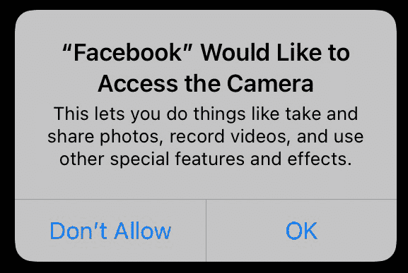
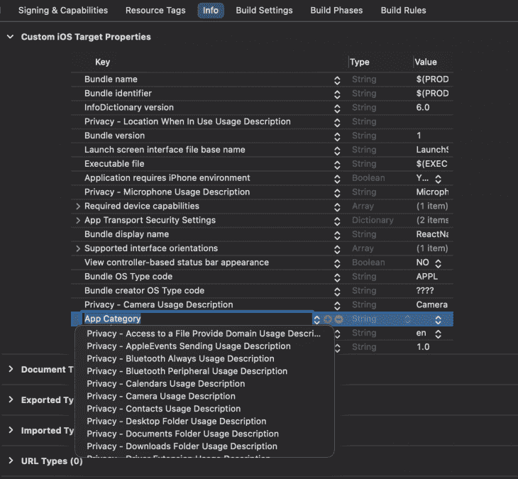
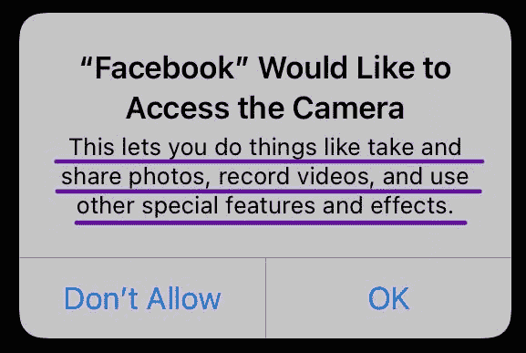
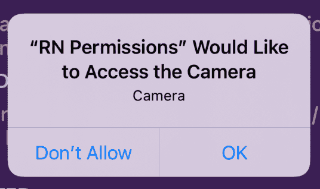
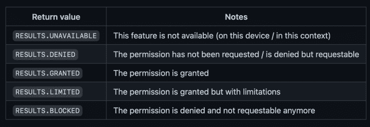
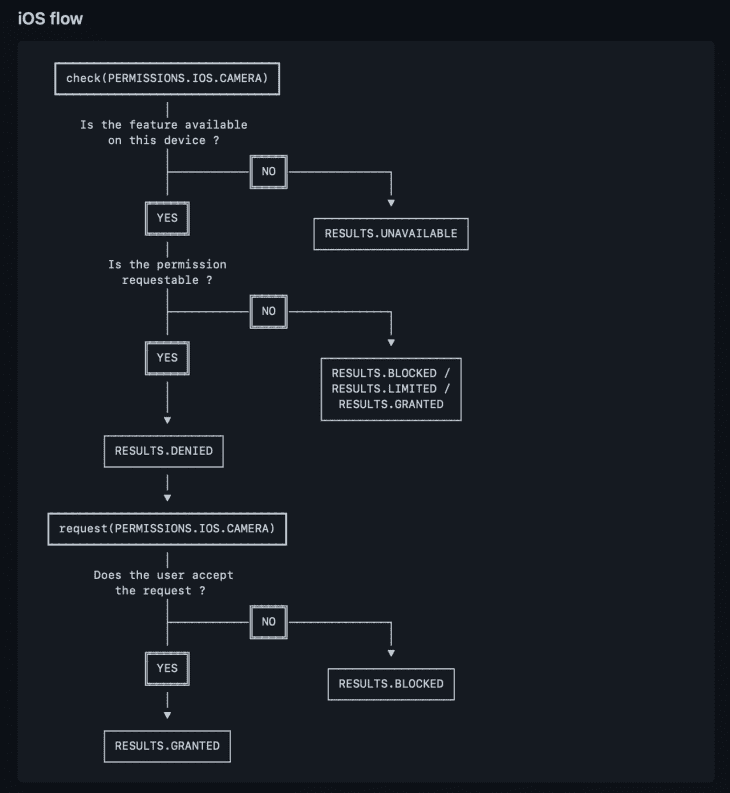
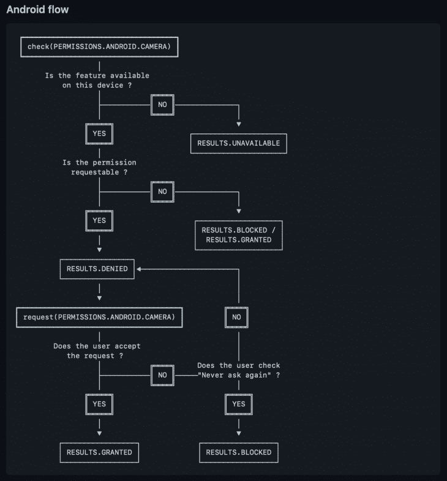
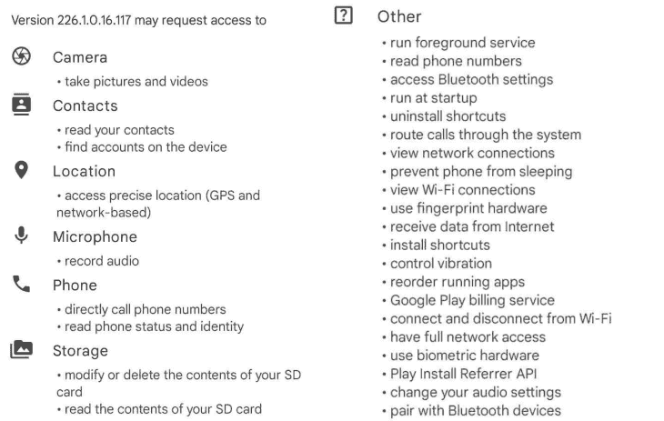
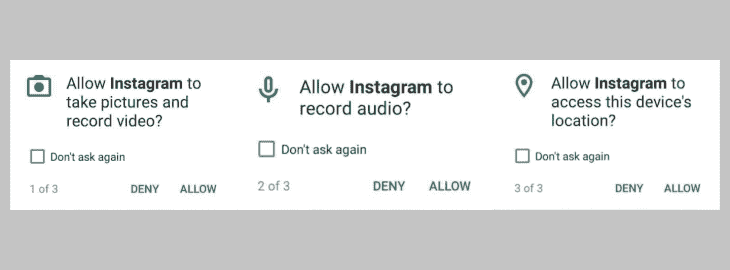

# 在 React Native 中管理应用权限

> 原文：<https://blog.logrocket.com/react-native-permissions/>

当您开发具有高级功能的移动应用程序时，您很可能需要获得用户的许可。

为了保护用户，应用程序不应该能够直接访问用户的摄像头、麦克风、位置等等。我们需要通过获取许可来捕获和存储照片、音频和视频，从而尊重用户隐私。

让我们来看看脸书允许拍照的例子。你对这些警报很熟悉，对吧？



为了能够完整地展示您的应用程序，您的用户必须给予许可。但是如果用户否认了呢？正如您可能猜到的，您无法提供该功能。所以权限是必不可少的。

如果我们正在开发一个照片编辑应用程序呢？解决方案很简单:我们需要获得他们的许可来访问他们的数据。在本文中，我们将深入探讨权限，以及如何通过使用 zoontek 的 [react-native-permissions 库](https://github.com/zoontek/react-native-permissions)在 React Native 中获取权限。

## 反应本地权限库🐝

可惜 React Native 不支持获取权限。幸运的是，我们可以使用一个流行的第三方库:Mathieu Acthernoene 的 react-native-permissions 库。

让我们假设我们想要请求照相机许可。这些步骤很容易做到。

💡首先，确保将该库添加到项目中:

```
$ npm install --save react-native-permissions
--or--
$ yarn add react-native-permissions

```

然后，确保通过在文件顶部写入来导入库，在那里您将处理这些权限:

```
import * as permissions from 'react-native-permissions';
// you may also import just the functions or constants that you will use from this library
import {request, PERMISSIONS} from 'react-native-permissions';

```

### iOS 设备的 react-native-权限

*   确保将所有需要的权限添加到应用程序的`Podfile`中，并运行以下命令:

    ```
    pod install
    ```

    *   CocoaPods 是 Swift 和 Objective-C Cocoa 项目的依赖管理器。`Podfile`是描述一个或多个 Xcode 项目的目标依赖关系的规范。运行`pod install`有助于安装依赖项。你可以[在这里查看 CocoaPods 阅读更多](https://cocoapods.org)。

→在我们的例子中，我们将添加

```
pod 'Permission-Camera', :path => "#{permissions_path}/Camera"

```

到`Podfile`并运行`pod install`。

*   用所需的权限使用描述更新`Info.plist`。你可以通过两种方式实现这一点；选择适合自己的。

#### 选项 1: Xcode

*   打开信息部分
*   添加新行
*   从选项中选择您希望作为密钥的权限
*   向该键添加值

→在我们的例子中，我们将选择**隐私–相机使用说明。**



#### 选项 2:文本编辑器

*   打开`Info.plist`文件
*   从下面复制键和字符串值并粘贴该文件
*   根据需要更新字符串值:

```
<?xml version="1.0" encoding="UTF-8"?>
    <!DOCTYPE plist PUBLIC "-//Apple//DTD PLIST 1.0//EN" "http://www.apple.com/DTDs/PropertyList-1.0.dtd">
    <plist version="1.0">
    <dict>     
      <!-- 🚨 Keep only the permissions used in your app 🚨 -->
      <key>NSAppleMusicUsageDescription</key>
      <string>YOUR TEXT</string>
      <key>NSBluetoothAlwaysUsageDescription</key>
      <string>YOUR TEXT</string>
      <key>NSBluetoothPeripheralUsageDescription</key>
      <string>YOUR TEXT</string>
      <key>NSCalendarsUsageDescription</key>
      <string>YOUR TEXT</string>
      <key>NSCameraUsageDescription</key>
      <string>YOUR TEXT</string>
      <key>NSContactsUsageDescription</key>
      <string>YOUR TEXT</string>
      <key>NSFaceIDUsageDescription</key>
      <string>YOUR TEXT</string>
      <key>NSLocationAlwaysAndWhenInUseUsageDescription</key>
      <string>YOUR TEXT</string>
      <key>NSLocationAlwaysUsageDescription</key>
      <string>YOUR TEXT</string>
      <key>NSLocationTemporaryUsageDescriptionDictionary</key>
      <dict>
        <key>YOUR-PURPOSE-KEY</key>
        <string>YOUR TEXT</string>
      </dict>
      <key>NSLocationWhenInUseUsageDescription</key>
      <string>YOUR TEXT</string>
      <key>NSMicrophoneUsageDescription</key>
      <string>YOUR TEXT</string>
      <key>NSMotionUsageDescription</key>
      <string>YOUR TEXT</string>
      <key>NSPhotoLibraryUsageDescription</key>
      <string>YOUR TEXT</string>
      <key>NSPhotoLibraryAddUsageDescription</key>
      <string>YOUR TEXT</string>
      <key>NSRemindersUsageDescription</key>
      <string>YOUR TEXT</string>
      <key>NSSpeechRecognitionUsageDescription</key>
      <string>YOUR TEXT</string>
      <key>NSSiriUsageDescription</key>
      <string>YOUR TEXT</string>
      <key>NSUserTrackingUsageDescription</key>
      <string>YOUR TEXT</string>

      <!-- … -->
    </dict>
    </plist>

```

→在我们的例子中，如下所示:

```
<key>NSCameraUsageDescription</key>
    <string>YOUR TEXT</string>

```

🌞第一个选项中的值部分和第二个选项中的`<string>`部分对应于警报消息中的文本。

让我们回忆一下脸书照相机许可警报。描述部分是您在此处作为值给出的文本:



→在我们的例子中，我只是将“Camera”赋予值，这里看起来是这样的:



### Android 的 react-native-权限

*   将所有需要的权限添加到应用程序的`android/app/src/main/AndroidManifest.xml`文件中:

```
<manifest xmlns:android="http://schemas.android.com/apk/res/android"
      package="com.myawesomeapp">
      <!-- 🚨 Keep only the permissions used in your app 🚨 -->
      <uses-permission android:name="android.permission.ACCEPT_HANDOVER" />
      <uses-permission android:name="android.permission.ACCESS_BACKGROUND_LOCATION" />
      <uses-permission android:name="android.permission.ACCESS_COARSE_LOCATION" />
      <uses-permission android:name="android.permission.ACCESS_FINE_LOCATION" />
      <uses-permission android:name="android.permission.ACTIVITY_RECOGNITION" />
      <uses-permission android:name="android.permission.ANSWER_PHONE_CALLS" />
      <uses-permission android:name="android.permission.BODY_SENSORS" />
      <uses-permission android:name="android.permission.CALL_PHONE" />
      <uses-permission android:name="android.permission.CAMERA" />
      <uses-permission android:name="android.permission.GET_ACCOUNTS" />
      <uses-permission android:name="android.permission.PROCESS_OUTGOING_CALLS" />
      <uses-permission android:name="android.permission.READ_CALENDAR" />
      <uses-permission android:name="android.permission.READ_CALL_LOG" />
      <uses-permission android:name="android.permission.READ_CONTACTS" />
      <uses-permission android:name="android.permission.READ_EXTERNAL_STORAGE" />
      <uses-permission android:name="android.permission.READ_PHONE_NUMBERS" />
      <uses-permission android:name="android.permission.READ_PHONE_STATE" />
      <uses-permission android:name="android.permission.READ_SMS" />
      <uses-permission android:name="android.permission.RECEIVE_MMS" />
      <uses-permission android:name="android.permission.RECEIVE_SMS" />
      <uses-permission android:name="android.permission.RECEIVE_WAP_PUSH" />
      <uses-permission android:name="android.permission.RECORD_AUDIO" />
      <uses-permission android:name="android.permission.SEND_SMS" />
      <uses-permission android:name="android.permission.USE_SIP" />
      <uses-permission android:name="android.permission.WRITE_CALENDAR" />
      <uses-permission android:name="android.permission.WRITE_CALL_LOG" />
      <uses-permission android:name="android.permission.WRITE_CONTACTS" />
      <uses-permission android:name="android.permission.WRITE_EXTERNAL_STORAGE" />
      <uses-permission android:name="com.android.voicemail.permission.ADD_VOICEMAIL" />

      <!-- … -->

</manifest>

```

→在我们的例子中，我们只需要向`AndroidManifest.xml`文件添加摄像机许可:

```
<uses-permission android:name="android.permission.CAMERA" /> 

```

### 请求权限:返回类型

```
request(Platform.OS === 'ios' ? PERMISSIONS.IOS.CAMERA : PERMISSIONS.ANDROID.CAMERA).then((result) => {
        setPermissionResult(result)
        console.log(result)
      });

```

返回类型和含义如下:



该流程因操作系统而异。这里有 iOS 和 Android 的权限流程图，取自本库的文档。





### 最终产品

瞧啊。您已经准备好运行您的代码了！基本上就是这样！

您可能仍然会遇到一些问题，比如您的设备可能不支持该功能，或者版本无效。我的建议是:查找解决方案的第一个地方应该是库的文档。

在写这篇文章时，我构建了一个包含摄像头和麦克风权限的 React 本地应用程序示例。它显示许可的结果和对结果的解释。

您可以使用它，查看结果类型，并观察结果何时返回。您可以先批准它，然后在“设置”中更改权限，打开应用程序，看看会发生什么。用它来更好地理解！

当您为特定场合编码时，您也可以使用该示例进行测试。除了使用示例，您还可以查看源代码，如果您有任何问题，可以与我的进行比较！

 [https://www.youtube.com/embed/Ktny9_Tc5l4?version=3&rel=1&showsearch=0&showinfo=1&iv_load_policy=1&fs=1&hl=en-US&autohide=2&wmode=transparent](https://www.youtube.com/embed/Ktny9_Tc5l4?version=3&rel=1&showsearch=0&showinfo=1&iv_load_policy=1&fs=1&hl=en-US&autohide=2&wmode=transparent)

视频

当我即将完成我的示例项目时，我发现 zoontek 也为此制作了一个示例应用程序，就像我的一样，但包括了所有权限！你可以在这里查看 zoontek 的示例应用。

## 配置权限的要点👩🏻‍💻

### 许可外观

请记住，如果您回答了一个权限请求，它将不会再次请求该权限。如果您希望它再次出现，请删除并安装该应用程序。

如果您只想更改结果，您可以在仪器的设置中进行更改。

在 iOS 中，用户必须明确授予每个应用程序访问摄像头和麦克风的权限。在您的应用程序可以首次使用捕捉系统之前，操作系统会显示一个警告，要求用户授予您的应用程序访问相机的权限。它们会记住用户对该警告的反应，因此它不会在每次访问用户的相机时重新出现。

* * *

### 更多来自 LogRocket 的精彩文章:

* * *

用户可以在 iOS 的**设置** > **隐私**中更改你的应用的权限设置，或者在 Android 的
**设置** > **应用** > **【你的应用名称】** > **权限**。

### 危险的权限

以前在 Android 开发中，每个权限都必须添加到`AndroidManifest.xml`文件中。它们被称为安装时权限，在谷歌 Play 商店安装时被请求。

从 Android 6.0 (API 23)开始，危险的权限，也就是运行时权限的概念出现了，这些权限变得有必要在运行时而不是安装时询问。运行时权限是应用程序运行时出现的警告对话框。

让我们检查 Instagram 的权限。当我们在谷歌 Play 商店上查看 Instagram 时，我们看到一堆权限。



用户的相机、联系人、位置、麦克风、电话和存储器都是他们的敏感信息。因此，它们是危险的权限。所以，在 Android 6.0 及以后的版本中，用户在使用 app 时看到的是运行时权限；这里，是 Instagram。

当用户试图发布照片或视频时，屏幕上会出现运行时权限对话框。


同样，当用户试图在 Instagram 上拍摄照片或视频时，这些权限就会出现。



### Android 11 权限更新

在 Android 生态系统中，Android 11 带来了一些变化:

*   如果您的应用程序请求与摄像机、麦克风或位置相关的权限，权限对话框会包括“仅这一次”选项。如果选中它，您的应用程序将一次性获得权限。它被称为“一次性许可”第二次打开应用程序时，权限对话框再次出现
*   如果您的应用程序已经几个月没有使用，系统会自动重置用户授予该应用程序的敏感运行时权限

要了解更多信息，[请查看 Android 11 的更新](https://developer.android.com/about/versions/11/privacy/permissions)。

### iOS 14.5:应用追踪透明度

对于 iOS 14.5、iPadOS 14.5 和 tvOS 14.5 及更高版本，开发者需要征得用户的许可，才能在其他公司拥有的应用和网站上跟踪他们。这个库的最大特点之一是它是最新的。您可以使用 react-native-permissions 添加一个[AppTrackingTransparency](https://developer.apple.com/documentation/apptrackingtransparency)(ATT)提示和请求。请记住，只有版本 14.5 或更高版本的 iOS 设备才能请求此功能。

## 何时请求权限以获得最佳用户体验👩🏻‍🎨

在应用程序启动时请求许可，或者在你需要的特定时间请求许可，仍然是一个用户体验的争论。没有答案；有意见。

我的建议是当你需要它的时候问一问。作为一个用户，看到 onboarding 中的所有权限会让我害怕，大多数时候我不会给出完整的权限。正如我以前说过的，这是有争议的。选择适合自己的。

## 结论

我们已经介绍了权限的概念，以及如何通过使用 react-native-permissions 在 React Native 中获得权限。我给了你在你的许可之旅中可能需要的关键点，比如 Android 11 和 iOS 14.5 的变化。您可以[在这个 GitHub 库](https://github.com/iremkaraoglu/ReactNative-Permissions-Example)中找到我的示例项目。

我希望你喜欢这篇文章，并且你的用户有充分的权限从你的应用程序特性中获益！如果您有任何反馈，请随时联系我们。下次再见，保重！☘️

## 参考

[LogRocket](https://lp.logrocket.com/blg/react-native-signup) :即时重现 React 原生应用中的问题。

## [LogRocket](https://lp.logrocket.com/blg/react-native-signup) 是一款 React 原生监控解决方案，可帮助您即时重现问题、确定 bug 的优先级并了解 React 原生应用的性能。

[](https://lp.logrocket.com/blg/react-native-signup)

LogRocket 还可以向你展示用户是如何与你的应用程序互动的，从而帮助你提高转化率和产品使用率。LogRocket 的产品分析功能揭示了用户不完成特定流程或不采用新功能的原因。

开始主动监控您的 React 原生应用— [免费试用 LogRocket】。](https://lp.logrocket.com/blg/react-native-signup)

Start proactively monitoring your React Native apps — [try LogRocket for free](https://lp.logrocket.com/blg/react-native-signup).