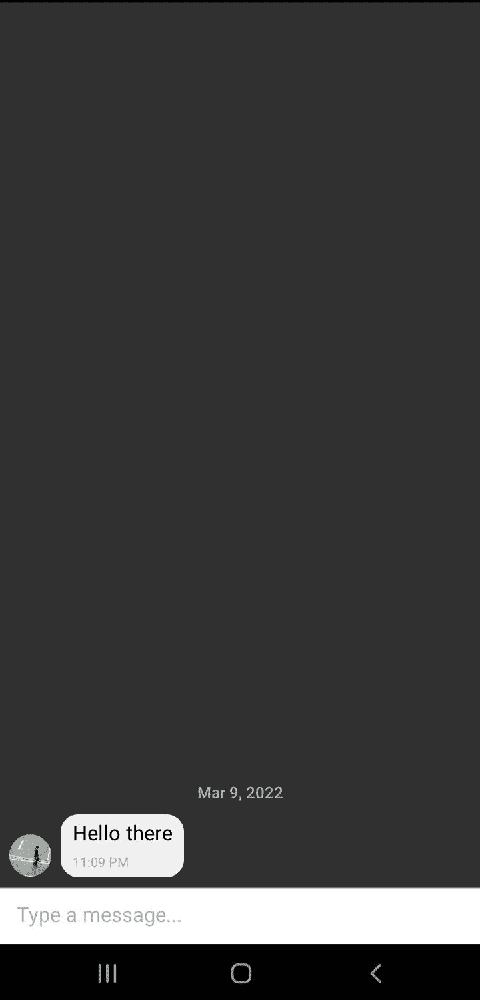
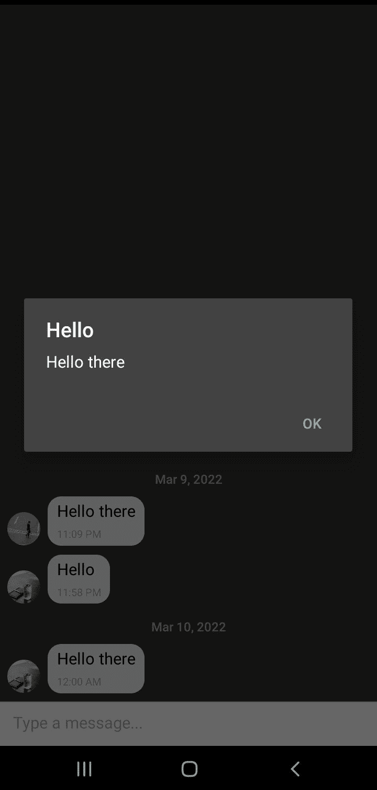
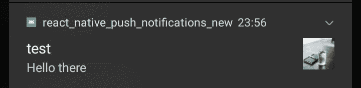

# 使用 Firebase 云消息传递对本地推送通知做出反应

> 原文：<https://blog.logrocket.com/react-native-push-notifications-firebase-cloud-messaging/>

React Native 使用 JavaScript 和 React 从单一代码库构建 iOS、Android 和 web 应用程序。它还允许您利用每个设备的原生功能，如设备的默认主题、[摄像头](https://blog.logrocket.com/intro-to-react-native-camera/)、地理定位和推送通知。这意味着您可以使用 React Native 构建一个完整的移动应用程序，与 iOS 或 Android 的底层设置集成，这使得实现推送通知变得简单，正如我今天将要演示的那样。

在本文中，我们将学习如何构建一个简单的 React 聊天应用程序，该应用程序集成了 Firebase 云消息和设备的推送通知，以便在用户收到新消息时通知用户。

### 内容

### 先决条件

要学习本教程，必须具备以下条件:

*   本地计算机上安装的节点 v14 或更高版本以及 npm v5.6 或更高版本
*   [反应原生的工作知识](https://blog.logrocket.com/tag/react-native/)
*   煽动性的报道

## 设置 React 本地聊天应用程序

要设置应用程序，请创建一个项目文件夹，您希望您的项目位于其中，然后使用以下 npx 命令初始化应用程序:

```
npx react-native init chat_app_with_fcm

```

一旦执行了上面的命令，就会创建一个托管 React 本地设置的`chat_app_with_fcm`目录。将目录路径更改为新创建的`chat_app_with_fcm`文件夹:

```
cd chat_app_with_fcm

```

让我们测试自举 React 本机模板是否工作正常。确保您有连接的设备或模拟器，然后启动应用程序:

```
npm run android

```

这将启动一个开发环境，您可以使用它在连接的设备或模拟器上访问应用程序。

## 构建聊天功能

本指南将创建一个聊天应用程序。为了处理聊天功能，我们将使用 [react-native-gifted-chat 包](https://blog.logrocket.com/build-chat-app-react-native-gifted-chat/)。该包将为聊天应用程序提供一个随时可用的交互式 UI。

要安装软件包，请打开项目终端并运行以下命令:

```
npm i react-native-gifted-chat

```

安装后，导航到`App.js`文件并进行以下更改。

首先，导入`GiftedChat`模块:

```
import { GiftedChat } from 'react-native-gifted-chat'

```

然后，导入以下挂钩:

```
import { useState, useCallback, useEffect } from "react";

```

在`App: ()`函数中，为`messages`定义一个状态:

```
const [messages, setMessages] = useState([]);

```

定义一个`useEffect`来设置应用程序加载时的默认消息:

```
useEffect(() => {
    setMessages([
        {
            _id: 1,
            text: 'Hello there',
            createdAt: new Date(),
            user: {
                _id: 2,
                name: 'PartyA',
                avatar: 'https://placeimg.com/140/140/any',
            },
        },
    ]);
}, [])

```

接下来，为用户发送消息定义一个`onSend`事件处理程序:

```
const onSend = useCallback((messages = []) => {
    setMessages(previousMessages => GiftedChat.append(previousMessages, messages)) // append the new message to present messages
}, [])

```

最后，用`GiftedChat`组件替换渲染视图:

```
return (
    <GiftedChat
        backgroundColor={isDarkMode ? Colors.black : Colors.white}
        messages={messages}
        onSend={messages => onSend(messages)}
        user={{
            _id: 1,
        }}
    />
)

```

完成上述更改后，React Native 将使用其热重新加载功能，并将更改反映到您的屏幕上。



## 在 Firebase 控制台上设置应用程序

现在让我们将这个应用程序连接到 Firebase。要进行设置，请登录到您的 Firebase 帐户，并使用 **Add project** 卡创建一个新项目。输入你的项目名称，然后点击**继续**。在下一步中，您可以随意启用或禁用谷歌分析，然后点击**继续**。

当您的项目准备就绪时，再次点击**继续**进入项目仪表板。在这个仪表板上，使用项目仪表板上的 Android 图标创建一个 Android 应用程序。

在 **Android 软件包名称**下，输入应用程序中的软件包名称。您可以在`/android/app/src/main/AndroidManifest.xml`文件中获得这个包名。最后，点击**注册 app** ，下载`google-services.json`文件，放在你项目的`android/app/`目录下。

## 在 React 本机应用程序中设置 Firebase 云消息传递

要将 React 本地应用程序与 Firebase 连接起来，我们必须用 Firebase 凭证配置应用程序。

在`android/build.gradle`下，在`buildscripts/dependencies`标签内添加以下`classpath`:

```
classpath 'com.google.gms:google-services:4.3.10'

```

在`/android/app/build.gradle`文件下，在`apply plugin: "com.android.application"`的正下方添加`google-services`插件:

```
apply plugin: 'com.google.gms.google-services'

```

接下来，像这样安装 [React Native Firebase](https://www.npmjs.com/package/@react-native-firebase/messaging) :

```
npm i --save @react-native-firebase/messaging

```

这些设置都准备好了。现在，让我们来处理 React Native 将如何使用 FCM 来发送聊天消息。

## 处理前台消息通知

首先，创建一个事件处理程序来处理前台消息通知。处理程序将接收传入的消息，对其进行结构化，将其添加到消息状态，并显示警报。

导航到`App.js`文件并导入 React Native Firebase:

```
import messaging from '@react-native-firebase/messaging';

```

在`App()`下，添加一个`useEffect()`钩子，它将监听`messages`状态的任何变化:

```
useEffect(() => {
}, [messages]);

```

在`useEffect()`中，添加一个事件处理程序来监听通知:

```
// Get the notification message
const subscribe = messaging().onMessage(async remoteMessage => {

    // Get the message body
    let message_body = remoteMessage.notification.body;

    // Get the message title
    let message_title = remoteMessage.notification.title;

    // Get message image
    let avatar = remoteMessage.notification.android.imageUrl;

    // Append the message to the current messages state
    setMessages(messages => GiftedChat.append(messages, {
        _id: Math.round(Math.random() * 1000000),
        text: message_body,
        createdAt: new Date(),
        user: {
            _id: 2,
            name: "PartyB",
            avatar: avatar,
        },
    }));

    // Show an alert to the user
    Alert.alert(message_title, message_body);
});

return subscribe;

```

要对此进行测试，请转到您在上一步中创建的应用程序的 Firebase 控制台。在左侧栏的 **Engage** 下，点击**云消息**。然后点击按钮**发送你的第一条信息**。

在接下来的表格中:

*   在**通知文本**下输入任何标题(如“测试”)
*   输入“你好！”在**通知图像下**
*   粘贴任何你喜欢的图像地址，[或者用一杯水](https://images.unsplash.com/photo-1646660528305-eb8ef9533ba6?ixlib=rb-1.2.1&ixid=MnwxMjA3fDB8MHxlZGl0b3JpYWwtZmVlZHw3fHx8ZW58MHx8fHw%3D&auto=format&fit=crop&w=500&q=60%3E)
*   点击下面的**下一个**按钮

现在，在**目标**下，点击**选择一个应用**，然后选择你的应用。点击**下一步**进入下一步，然后**回顾**。在弹出的窗口中，点击**发布**。

在应用程序上，您应该会收到以下通知。



## 处理后台消息通知

当应用程序关闭时，后台消息通知起作用。与前台通知类似，我们将添加一个处理程序。

要添加处理程序，请在`App()`之前的`App.js`上进行以下更改:

```
// Register background handler
// Get the notification
messaging().setBackgroundMessageHandler(async remoteMessage => {
    // Extract the body
    let message_body = remoteMessage.notification.body;
    // Extract the title
    let message_title = remoteMessage.notification.title;
    // Extract the notification image 
    let avatar = remoteMessage.notification.android.imageUrl;

    // Add the notification to the messages array
    setMessages(messages => GiftedChat.append(messages, {
        _id: Math.round(Math.random() * 1000000),
        text: message_body,
        createdAt: new Date(),
        user: {
            _id: 2,
            name: "PartyB",
            avatar: avatar,
        },
    }));

    // Send a notification alert
    Alert.alert(message_title, message_body);
});

```

要测试功能，您必须关闭应用程序，然后像上一节一样从控制台发送通知消息。

您应该会在手机的推送通知栏上收到类似下面这样的提醒。



## 结论

通知对于现代移动应用程序至关重要。我希望这篇指南已经帮助你学会了添加推送通知来反应原生应用的重要技巧。正如我们所见，Firebase 云消息传递和 React Native Firebase 使这种流动变得无缝且非常容易。

## [LogRocket](https://lp.logrocket.com/blg/react-native-signup) :即时重现 React 原生应用中的问题。

[](https://lp.logrocket.com/blg/react-native-signup)

[LogRocket](https://lp.logrocket.com/blg/react-native-signup) 是一款 React 原生监控解决方案，可帮助您即时重现问题、确定 bug 的优先级并了解 React 原生应用的性能。

LogRocket 还可以向你展示用户是如何与你的应用程序互动的，从而帮助你提高转化率和产品使用率。LogRocket 的产品分析功能揭示了用户不完成特定流程或不采用新功能的原因。

开始主动监控您的 React 原生应用— [免费试用 LogRocket】。](https://lp.logrocket.com/blg/react-native-signup)