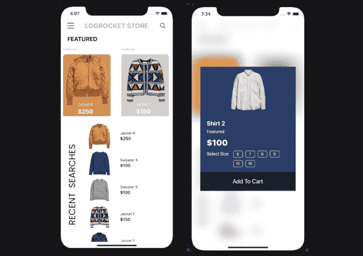
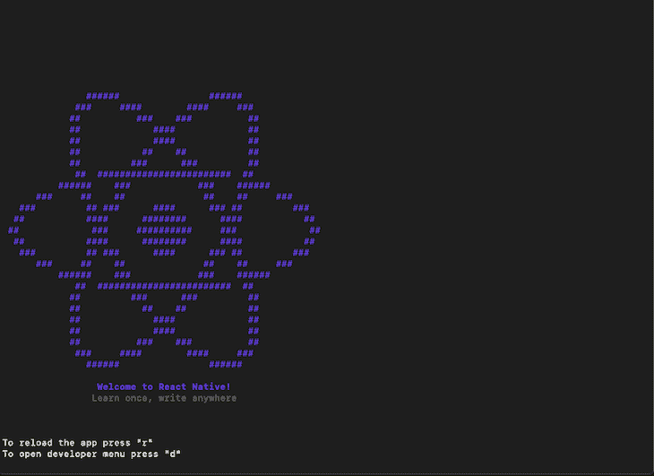
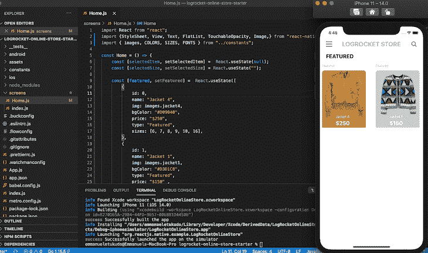
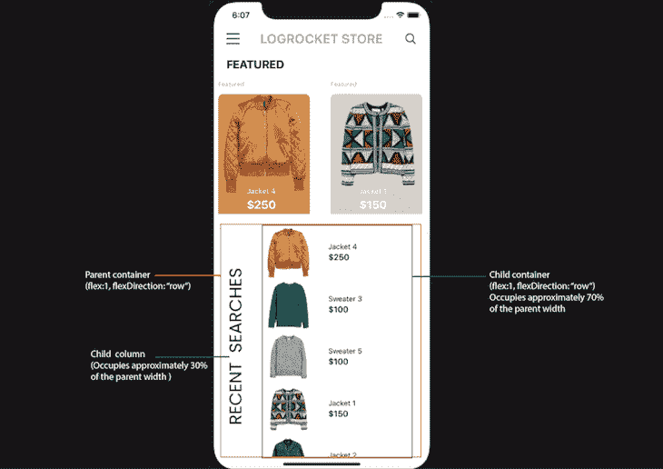

# React 原生样式教程示例- LogRocket 博客

> 原文：<https://blog.logrocket.com/react-native-styling-tutorial-with-examples/>

随着对跨平台移动应用程序需求的增长，开发人员采用一个代码库来构建在多个操作系统上运行的跨平台应用程序的需求也在增长。

从一个代码库为多个操作系统构建移动应用程序有很多好处。无论您是想要增加对新平台用户的支持，还是想要降低生产成本，构建在多种设备上运行的移动应用程序都是一个明智的策略。

在本教程中，我们将向您展示如何在 React Native 中样式化组件。我们将通过构建一个示例电子商务移动应用程序来演示 React Native 中的样式如何工作。

以下是我们将要介绍的内容:

要跟随 React 原生样式教程，您应该具备:

*   熟悉 CSS、HTML 和 Javascript (ES6)
*   Node.js 和 Watchman 安装在您的开发机器上
*   用于测试的 iOS 模拟器或 Android 模拟器
*   安装在开发机器上的代码编辑器(例如 VS Code)
*   对 React 的基本理解

## 什么是 React Native？

[React Native](https://reactnative.dev/) 是一个开源的移动应用框架。由脸书于 2015 年推出，世界各地的移动开发者都使用 React Native 来构建 Android 和 iOS 以及 web 和 macOS/Windows 格式的应用程序。

React Native 的[卖点在于，它使开发者能够使用 React 的框架和原生平台功能。](https://blog.logrocket.com/why-keep-faith-react-native/)

## 反应本机样式示例

对于这个 React 本机样式演示，我们将构建一个电子商务移动应用程序，为用户显示一系列产品，以便根据他们的偏好进行订购。特别是，我们将通过构建登录页面和购物车功能来强调一些关键的 React 本机样式概念。

完成的应用程序将如下所示:



React Native 团队批准了两种主要的方法来建立一个新的`react-native`项目:`Expo-CLI`和`React-native-CLI.`这个项目是使用`react-native-cli-starter`建立的。你可以在 [React 原生文档](https://reactnative.dev/docs/environment-setup)中阅读更多关于 iOS 和 Android 环境设置的信息。

## 中的样式如何反应本地作品

React Native 中的样式是使用 JavaScript 完成的。因为 React 组件支持`style`道具，所以您也可以创建一个样式值的对象，并将它们作为道具传递给组件。样式名的工作方式和 CSS 中的完全一样，除了它们是用骆驼字体写的(例如，`backgroundColor`)。

```
import React from "react";
import {View, Text} from "react-native";

const Home = () => {
    return (
        <View style = {{flex: 1, backgroundColor: "#ffffff" }}>
          <View>
            <Text style={{fontSize: 12, color: "#000" }}>Log Rocket Store</Text>
          </View>
        </View>
    )
}

```

如何设计 React 本机应用程序取决于应用程序的复杂性。随着它变得越来越复杂，您可以使用`StyleSheet.create`为您的应用程序定义多种样式。请参见下面的示例:

```
import React from "react";
import {StyleSheet, View, Text} from "react-native";

const Home = () => {
    return (
        <View style = {style.container}>
          <View>
            <Text style={style.title}>Log Rocket Store</Text>
          </View>
        </View>
    )
}

const style = StyleSheet.create({
    container: {
        flex: 1,
        backgroundColor: "#ffffff",
    },
    title: {
      fontSize: 12,
      color: "#000",
   }
})

```

你的应用程序越复杂，你就越应该把你的风格分解成更小的可重用代码。对于复杂的应用程序，我建议你用你想要的`font sizes`、`padding`、`margin`和`images`创建一个主题，以实现更模块化的代码结构。

## 构建和设计 React 本机应用程序

电子商务移动应用程序有两个由两个组件构建的主要功能:组件`Home`和组件`cart-modal`。要跟进，请在此处克隆启动程序:

```
git clone https://github.com/emmanueletukudo/logrocket-online-store-starter.git

```

导航到新创建的`log-rocket-online-store-starter`目录，并在终端/命令提示符下运行`npm install`。安装完成后，运行下面的命令启动 metro-bundler。

```
npx react-native start

```

[Metro](https://www.codementor.io/@rishabhsharma984/metro-bundler-in-react-native-wub92qcp5) 是由脸书打造的 JavaScript bundler。你可能希望在这里阅读`metro-bundler`文档。如果一切设置正确，您应该会打开一个新的终端窗口，类似于下面的屏幕截图:



既然我们已经建立了项目并运行了 Metro bundler，那么让我们为我们的起始项目运行一个构建。

### iOS 和 Android

要运行`ios`的构建，请将下面的代码复制并粘贴到您的终端中:

```
npx react-native run-ios

```

要运行`andriod`的构建，在您的`command prompt`中运行`npx react-native run-android`。

您应该会看到类似这样的内容:


### 文件夹结构

React 本机样式示例的文件夹结构如下。

*   `assets`包含应用程序的所有资产，包括`fonts`、`images`和`icons`
*   `constants`包含`icons.js`、`images.js`、`theme.js`和`index.js`。所有资产都存储在`JavaScript`常量中
*   `screens`包含`Home.js`和`index.js`

在本教程中，我们将重点关注应用程序的样式，并理解何时使用主题，何时使用内联样式。您可以探索代码库，以了解更多关于一切是如何工作的。

## 样式反应本机组件

`Home`组件有两个部分:特色产品和最近搜索。

导航到屏幕目录，用下面的代码替换`Home`组件中的代码，以创建`Home`组件:

```
import React from "react";
import {StyleSheet, View, Text, FlatList, TouchableOpacity, Image,} from "react-native";
import { images, COLORS, SIZES, FONTS } from "../constants";
const Home = () => {
    const [selectedItem, setSelectedItem] =  React.useState(null);
    const [selectedSize, setSelectedSize] = React.useState("");
    const [featured, setFeatured] =  React.useState([
        {
            id: 0,
            name: "Jacket 4",
            img: images.jacket4,
            bgColor: "#D09040",
            price: "$250",
            type: "Featured",
            sizes: [6, 7, 8, 9, 10, 16],
        },
        {
            id: 1,
            name: "Jacket 1",
            img: images.jacket1,
            bgColor: "#D3D1C8",
            type: "Featured",
            price: "$150" ,
            sizes: [6, 7, 8, 9, 10, 12],
        },
        {
            id: 2,
            name: "Jacket 2",
            img: images.jacket2,
            type: "Featured",
            bgColor: "#303946",
            price: "$160" ,
            sizes: [6, 7, 8, 9, 10],
        }
    ])
    const [recentSearches, setRecentSearch] = React.useState([
        {
            id: 0,
            name: "Jacket 4",
            img: images.jacket4,
            bgColor: "#D09040",
            price: "$250",
            type: "Featured",
            sizes: [6, 7, 8, 9, 10, 16],
        },
        {
            id: 1,
            name: "Sweater 3",
            img: images.sweater3,
            type: "Featured",
            bgColor: "#0F5144",
            price: "$100" ,
            sizes: [6, 7, 8, 9, 10, 16, 18],
        },
        {
            id: 2,
            name: "Sweater 5",
            img: images.sweater5,
            type: "Featured",
            bgColor: "#888983",
            price: "$100" ,
            sizes: [6, 7, 8, 9, 10, 18],
        },
        {
            id: 7,
            name: "Jacket 1",
            img: images.jacket1,
            bgColor: "#D3D1C8",
            type: "Featured",
            price: "$150" ,
            sizes: [6, 7, 8, 9, 10, 12],
        },
        {
            id: 8,
            name: "Jacket 2",
            img: images.jacket2,
            type: "Featured",
            bgColor: "#303946",
            price: "$160" ,
            sizes: [6, 7, 8, 9, 10],
        },
        {
            id: 3,
            name: "Hat 1",
            img: images.hat1,
            type: "Featured",
            bgColor: "#26232A",
            price: "$100" ,
            sizes: [6, 7, 8, 9, 10, 16],
        },
        {
            id: 4,
            name: "Shirt 1",
            img: images.shirt1,
            type: "Featured",
            bgColor: "#575569",
            price: "$100" ,
            sizes: [6, 7, 8, 9, 10, 16],
        },
        {
            id: 5,
            name: "Shirt 2",
            img: images.shirt2,
            type: "Featured",
            bgColor: "#2B3A6B",
            price: "$100" ,
            sizes: [6, 7, 8, 9, 10, 16],
        },
        {
            id: 6,
            name: "Shoe 1",
            img: images.shoe1,
            type: "Featured",
            bgColor: "#9E7348",
            price: "$100" ,
            sizes: [6, 7, 8, 9, 10, 12],
        },

    ])
    function renderFeaturedItems(item, index){
        return(
            <TouchableOpacity 
            style={{height: 300, width: 200, justifyContent: "center", marginHorizontal: SIZES.base }}
            onPress={() => {
                setSelectedItem(item);
                setShowAddToCartModal(true);
            }}
            >
                <Text style={{color: COLORS.lightGray, ...FONTS.h5}}>{item.type}</Text>
                <View style={[{
                    flex: 1,
                    justifyContent: "flex-end",
                    marginTop: SIZES.base,
                    borderRadius: 10,
                    marginRight: SIZES.padding,
                    backgroundColor: item.bgColor,
                    paddingRight: SIZES.padding,
                    paddingBottom: SIZES.radius,
                }, style.featuredShadow ]}>
                    <View style={style.featuredDetails}>
                        <Text style={{color: COLORS.white, ...FONTS.body4, marginTop: 15}}>{item.name}</Text>
                        <Text style={{color: COLORS.white, ...FONTS.h2}}>{item.price}</Text>
                    </View>
                </View>
                <Image 
                source={item.img} 
                resizeMode="cover"
                style = {{
                    position: "absolute",
                    top: 25,
                    right: 20,
                    width: "90%",
                    height: 200,
                }}
                />
            </TouchableOpacity>
        )
    }
// paste recent searches code

// paste renderSizes 
    return(
       <View style={style.container}>
            <Text style={{marginTop: SIZES.radius, marginHorizontal: SIZES.padding, ...FONTS.h2}}>FEATURED</Text>
            {/* Featured */}
            <View style={{height: 260, marginTop: SIZES.radius}}>
                <FlatList 
                horizontal
                showsHorizontalScrollIndicator={false}
                data={featured}
                keyExtractor={item => item.id.toString()}
                renderItem ={({item, index}) => renderFeaturedItems(item, index)}
                />
            </View>
          {/* Recent Searches */}

          {/* Modal */}

        </View>
    )
}
const style = StyleSheet.create({
    container:{
        flex: 1,
        backgroundColor: COLORS.white,
    },
    eaturedShadow: {
        shadowColor: "#000",
        shadowOffset:{
            width: 0,
            height: 5,
        },
        shadowOpacity: 0.29,
        shadowRadius: 4.65,
        elevation: 7
    },
    featuredDetails: {
        position: "absolute",
        top: 160,
        left: 30,
        flexDirection: "column",
        marginLeft: 25,
        marginBottom: 8,
    },
})

export default Home

```

如果您运行`npx react-native run-ios`，您的应用现在应该看起来像下面的截图:



## 破解密码

让我们仔细看看代码。

上面使用的大多数字体大小、填充和边距都在常量文件夹中的`theme.js`文件中声明。在`renderFeaturedItems`函数中，您会注意到我结合了内嵌样式和 prop 方法来设计`featured items`的样式。`react-native`样式属性接受一个数组，因此您可以向`style`传递第二个参数。

请参见下面的示例:

```
<View style={[{
                    flex: 1,
                    justifyContent: "flex-end",
                    marginTop: SIZES.base,
                    borderRadius: 10,
                    marginRight: SIZES.padding,
                    backgroundColor: item.bgColor,
                    paddingRight: SIZES.padding,
                    paddingBottom: SIZES.radius,
                }, style.featuredShadow ]}>

```

在上面的代码块中，`style` prop 值被包装在方括号`[]`中，这意味着 prop 将接受一个对象数组作为值。`style`道具的第二个参数是使用`Stylesheet.create()`创建的。如前所述，这种方法在复杂的 React 本机应用程序中很流行，是支持多种风格的好方法。

现在我们已经构建了`Home`组件的第一个部分，让我们构建最后一个部分:`recent searches`部分。

在我们开始之前，让我们考虑一下`recent searches`结构应该是什么样子。我们需要首先创建一个`flex container`，它的`flex direction`设置为`row`，以及两个`columns`，它们将作为容器的直接子容器。第一列包含图像；另一个是保存产品图像、产品名称和价格的`flex container`。



在 React Native 中进行样式化时，就像在 CSS 中一样，在开始样式化应用程序之前，应该总是将 UI 组件映射到 CSS 属性。这些将让你对如何从头开始设计你的整个应用程序有一个更广泛的了解。

要构建`Home`组件的第二部分，找到`// paste recent searches code`注释并复制/粘贴注释下的代码。

```
  function renderRecentSearches(item, index){
        return(
            <TouchableOpacity
            style = {{flex: 1, flexDirection: "row"}}
            onPress= {() => {
                setSelectedItem(item);
                setShowAddToCartModal(true);
            }}
            >
            <View style={{flex: 1, alignItems: "center", justifyContent: "center"}}>
                <Image
                source = {item.img}
                resizeMode = "contain"
                style = {{
                    width: 130,
                    height: 100,
                }}
                />
            </View>
            <View style={{
                flex: 1.5,
                marginLeft: SIZES.radius,
                justifyContent: "center",
            }}>
                <Text>{item.name}</Text>
                <Text style={{...FONTS.h3}}>{item.price}</Text>
            </View>
            </TouchableOpacity>
        )
    }

```

接下来，在`Home.js`中找到`{/* Recent Searches */}`注释，并将下面的代码粘贴到它下面。

```
<View style={[{
                flex: 1, 
                flexDirection: "row",
                marginTop: SIZES.padding, 
                borderTopLeftRadius: 30, 
                borderTopRightRadius: 30,
                backgroundColor: COLORS.white}, 
                style.recentSearchShadow]
                }>
                <View style={{width: 70, height: "100%", marginLeft: SIZES.base}}>
                    <Image 
                    source={images.searches}
                    style={{width: "100%", height: "100%", resizeMode: "contain"}}
                    />
                </View>
                <View style={{flex: 1, paddingBottom: SIZES.padding}}>
                    <FlatList 
                    showsVerticalScrollIndicator = {false}
                    data = {recentSearches}
                    keyExtractor = {item => item.id.toString()}
                    renderItem = {({item, index}) => renderRecentSearches(item, index)}
                    />
                </View>
            </View>

```

### 添加阴影

将下面的代码添加到`StyleSheet.create`中，以完成`Home`组件的`recent searches`部分的样式。

```
recentSearchShadow:{
        shadowColor: "#000",
        shadowOffset:{
            width: 0,
            height: 5,
        },
        shadowOpacity: 0.29,
        shadowRadius: 4.65, 
        elevation: 7
    },
    recentSearches: {
        width: "100%",
        transform: [{ rotateY: "180deg" }]
    },

```

在 React Native 中给组件添加阴影与在 CSS 中的做法截然不同。您需要指定`shadowColor`、`ShadowOffset`、`ShadowOpacity`、`ShadowRadius`和`elevation`。

这只能在 iOS 中产生阴影。要在 Android 中给一个组件添加阴影，请看官方说明[这里](https://reactnative.dev/docs/view-style-props#elevation)。

### 造型的模态

最后，让我们创建显示每个选定产品的模态。在`Home.js`中找到`// paste renderSizes`注释，并复制/粘贴下面的代码:

```
function renderSizes(){
        return(
            selectedItem.sizes.map((item, index) => {
                return(
                    <TouchableOpacity
                    key = {index}
                    style={{
                        width: 35,
                        height: 25,
                        alignItems: 'center',
                        justifyContent: 'center',
                        marginHorizontal: 5,
                        marginBottom: 10,
                        backgroundColor: selectedItem.sizes[index] == selectedSize ? COLORS.white : null,
                        borderWidth: 1,
                        borderColor: COLORS.white,
                        borderRadius: 5,
                    }}
                    onPress={() => {
                        setSelectedSize(item);
                    }}
                    >
                        <Text style={{ color: selectedItem.sizes[index] == selectedSize ? COLORS.black : COLORS.white, ...FONTS.body4 }}>{item}</Text>
                    </TouchableOpacity>
                )
            })
        )
    }

```

将以下代码粘贴到`Home`组件的注释`{/* Modal */}`下:

```
{ selectedItem && 
            <Modal
            animationType = "slide"
            transparent= {true}
            visible =  {showAddToCartModal}
            >
            <BlurView 
            style={style.blur}
                blurType = "light"
                blurAmount = {20}
                reducedTransparencyFallbackColor = "white"
                >
                <TouchableOpacity
                style={style.absolute}
                onPress= {() => {
                    setSelectedItem(null);
                    setSelectedSize("");
                    setShowAddToCartModal(false);
                }}
                >
                </TouchableOpacity>
                {/* Modal content */}
                <View style={{justifyContent: "center", width: "85%", backgroundColor: selectedItem.bgColor}}> 
                   <View>
                   <Image
                    source = {selectedItem.img}
                    resizeMode = "contain"
                        style = {{
                            width: "100%",
                            height: 170,
                        }} 
                    />
                   </View>
                   <Text style={{ marginTop: SIZES.padding, marginHorizontal: SIZES.padding, color: COLORS.white, ...FONTS.h2}}>{selectedItem.name}</Text>
                   <Text style={{ marginTop: SIZES.base / 2, marginHorizontal: SIZES.padding, color: COLORS.white, ...FONTS.body3 }}>{selectedItem.type}</Text>
                   <Text style={{ marginTop: SIZES.radius, marginHorizontal: SIZES.padding, color: COLORS.white, ...FONTS.h1 }}>{selectedItem.price}</Text>
                   <View style={{ flexDirection: "row", marginTop: SIZES.radius, marginHorizontal: SIZES.padding}}>
                        <View>
                        <Text style={{color: COLORS.white, ...FONTS.body3}}>Select Size</Text>
                        </View>
                        <View style={{flex: 1, flexWrap: "wrap", flexDirection: "row", marginLeft: SIZES.radius}}>
                        {renderSizes()}
                        </View>
                   </View>

                   <TouchableOpacity
                   style={{width: "100%", height: 70, justifyContent:"center", alignItems: "center", marginTop: SIZES.base, backgroundColor: 'rgba(0,0,0,0.5)'}}
                   onPress = {() => {
                    setSelectedItem(null);
                    setSelectedSize("");
                    setShowAddToCartModal(false);
                   }}
                   >
                       <Text style={{color: COLORS.white, ...FONTS.largeTitleBold}}>Add To Cart</Text>
                   </TouchableOpacity>
                </View>
            </BlurView>
            </Modal>
            }

```

要将模态放在应用程序的中心，必须使用绝对定位。
将下面的代码复制/粘贴到`Styleshset.create`对象中，以定位模态中心。

```
blur:{
        flex: 1, 
        alignItems: "center", 
        justifyContent: "center"
    },
    absolute:{
        position: 'absolute',
        top: 0,
        left: 0,
        right: 0,
        bottom: 0,
    },

```

## 结论

无论您希望构建一个相对简单还是复杂的移动应用程序，在 React Native 中进行样式设计就像为 web 应用程序编写 CSS 一样简单。你可以在 [React Native docs](https://reactnative.dev/docs/view-style-props#!) 中阅读更多关于可用 react-native 道具的信息。

## [LogRocket](https://lp.logrocket.com/blg/react-native-signup) :即时重现 React 原生应用中的问题。

[](https://lp.logrocket.com/blg/react-native-signup)

[LogRocket](https://lp.logrocket.com/blg/react-native-signup) 是一款 React 原生监控解决方案，可帮助您即时重现问题、确定 bug 的优先级并了解 React 原生应用的性能。

LogRocket 还可以向你展示用户是如何与你的应用程序互动的，从而帮助你提高转化率和产品使用率。LogRocket 的产品分析功能揭示了用户不完成特定流程或不采用新功能的原因。

开始主动监控您的 React 原生应用— [免费试用 LogRocket】。](https://lp.logrocket.com/blg/react-native-signup)