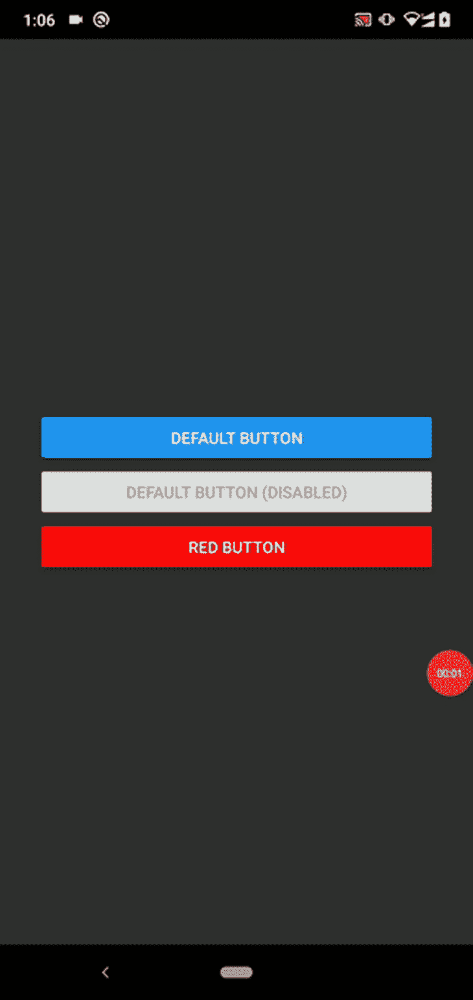
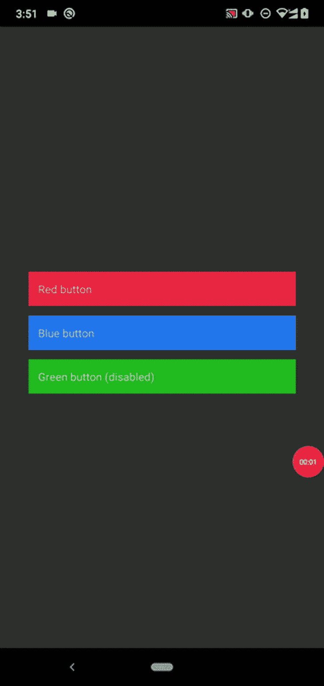
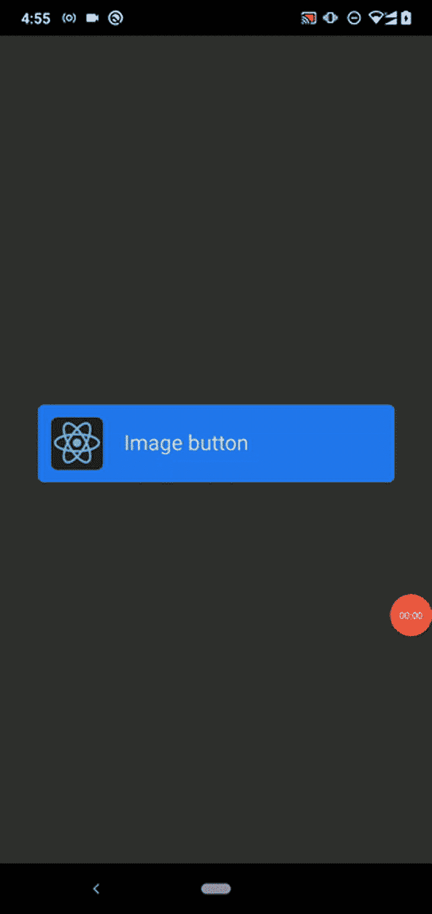
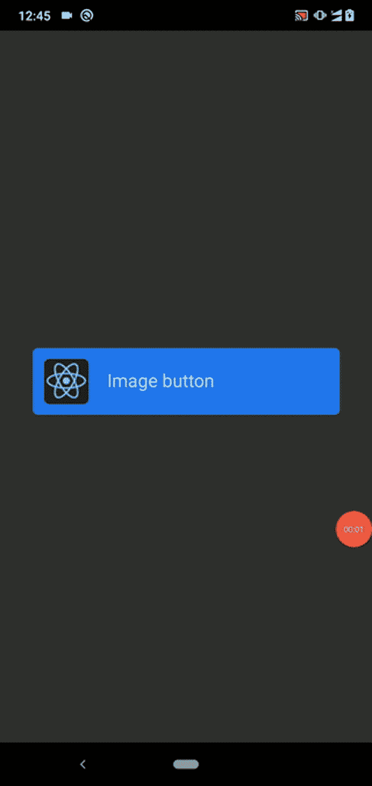
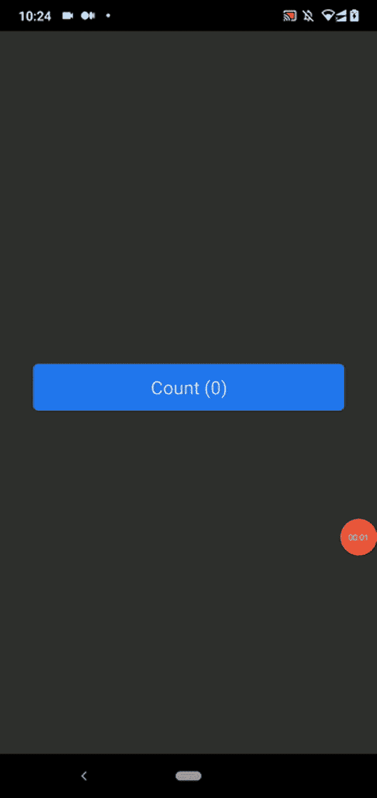
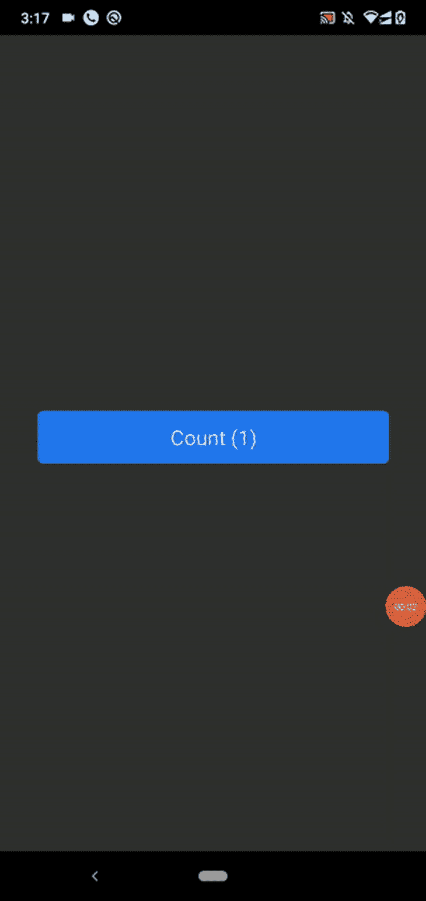
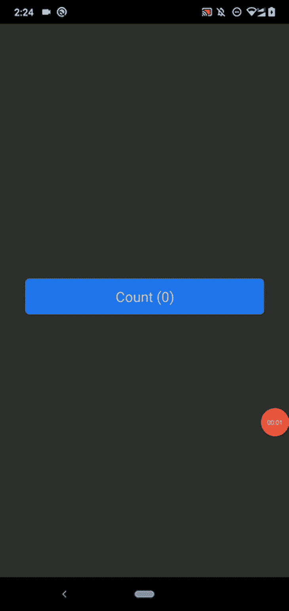
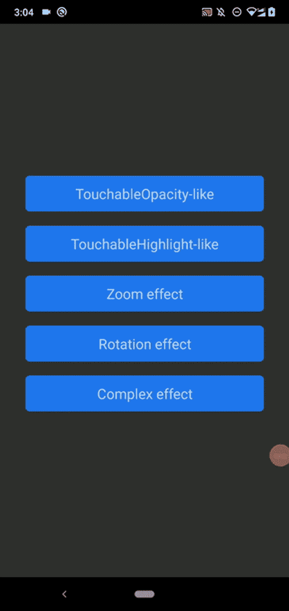
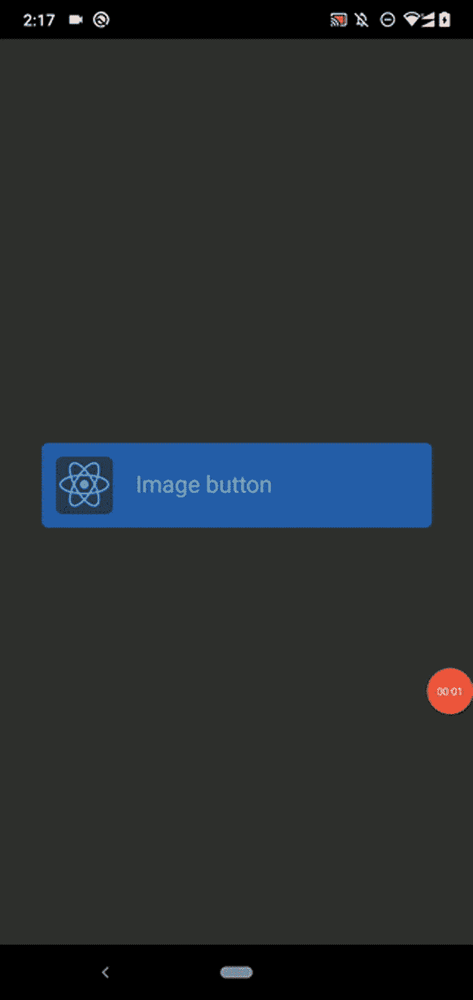

# React 本机可触摸组件与可按压组件

> 原文：<https://blog.logrocket.com/react-native-touchable-vs-pressable-components/>

现代智能手机通常配备触摸屏，而不是内置的物理键盘，移动操作系统提供各种手势功能来使用应用程序。例如，现在，移动应用程序支持屏幕点击、长屏幕点击、拖放和类似多点触摸的手势。用户可以通过按钮和其他交互式 UI 元素，利用简单的手指触摸事件来使用任何通用应用程序中的几乎所有功能。

React Native 最初提供了原生平台特定的按钮和几个可触摸的核心组件，用于处理基本的用户手势。后来，该框架引入了用于处理常见用户手势的 Pressable API。

在本文中，我们将讨论 React Native 的可触摸和可按压组件，使用示例来确定每种组件类型的优点和局限性。此外，我们将讨论何时需要根据 UI/UX 原则使用每个组件。你也可以随意浏览这篇文章，因为我们会涉及很多内容:

## 反应本机可触摸组件

在 React Native 中，我们可以使用`Button`组件来处理基本的触摸事件。组件`Button`在屏幕上呈现一个特定于平台的本地按钮元素，所以它不像`View`组件那样[可以跨平台定制](https://blog.logrocket.com/integrate-react-native-components-native-apps/)。作为一种解决方案，React Native 引入了可触摸组件来创建定制风格的跨平台按钮。

在讨论可触摸组件之前，让我们创建一个本机按钮，并确定它的局限性。

### 创建本机按钮

首先，使用以下命令创建一个新的 React 本地项目:

```
npx react-native init TouchableExample
cd TouchableExample

```

接下来，将以下代码添加到您的`App.js`源文件中:

```
import React from 'react';
import {
  SafeAreaView,
  Button,
  StyleSheet,
  View,
} from 'react-native';

const App = () => {
  const onTap = () => {
    console.log('Button touched!');
  };
  return (
    <SafeAreaView style={styles.container}>
      <Button
        title="Default button"
        onPress={onTap}
      />
      <View style={styles.separator}/>
      <Button
        title="Default button (disabled)"
        disabled={true}
        onPress={onTap}
      />
      <View style={styles.separator}/>
      <Button
        title="Red button"
        color="red"
        onPress={onTap}
      />
    </SafeAreaView>
  );
};

const styles = StyleSheet.create({
  container: {
    flex: 1,
    justifyContent: 'center',
    marginHorizontal: 36,
  },
  separator: {
    height: 12
  }
});

export default App;

```

上面的代码片段创建了三个本机按钮:

1.  具有默认主题颜色的按钮
2.  默认按钮，禁用
3.  红色按钮

使用以下命令运行上述代码:

```
npm start 
# --- or ---
yarn start

npx react-native run-android
# --- or ---
npx react-native run-ios

```

当您点击活动按钮时，您将看到三种不同样式的按钮元素和一个基于您当前移动平台的反馈动画。请看 Android 设备上显示的以下预览:



### 限制

在 Android 上，`color` prop 改变特定按钮的背景颜色，在 iOS 上改变文本颜色(也就是按钮的前景色)。`style`道具对于`Button`是不可用的，所以我们需要添加一个分隔符元素或者用`View`包裹它来相应地设置按钮边距。

如您所见，`Button`组件的 UI 定制仅限于`color`道具，并且按钮看起来基于移动平台而不同。

因此，React Native 为您提供了可触摸的组件，以创建用户可以触摸的可定制的跨平台元素。

## `TouchableOpacity`组件

`TouchableOpacity`是作为触摸事件反馈降低不透明度级别的核心组件。它在内部使用`Animated.View`组件来实现不透明过渡——然后，您可以使用`style`道具进行造型，这与特定于平台的`Button`组件不同。它还支持子组件，允许您构建可触摸的图像、自定义按钮和复杂的列表项。

将以下代码添加到您的`App.js`文件中，用`TouchableOpacity`组件创建一些按钮:

```
import React from 'react';
import {
  SafeAreaView,
  TouchableOpacity,
  StyleSheet,
  View,
  Text,
} from 'react-native';

const App = () => {
  const onTap = () => {
    console.log('Button touched!');
  };
  return (
    <SafeAreaView style={styles.container}>
      <TouchableOpacity
        style={[styles.button, { backgroundColor: '#ee2244' }]}
        onPress={onTap}>
        <Text>Red button</Text>
      </TouchableOpacity>
      <TouchableOpacity
        style={[styles.button, { backgroundColor: '#2277ee' }]}
        onPress={onTap}
        activeOpacity={0.6}>
        <Text>Blue button</Text>
      </TouchableOpacity>
      <TouchableOpacity
        style={[styles.button, { backgroundColor: '#22bb22' }]}
        onPress={onTap}
        activeOpacity={0.6}
        disabled={true}>
        <Text>Green button (disabled)</Text>
      </TouchableOpacity>
    </SafeAreaView>
  );
};

const styles = StyleSheet.create({
  container: {
    flex: 1,
    justifyContent: 'center',
    marginHorizontal: 36,
  },
  button: {
    padding: 12,
    marginBottom: 12
  }
});

export default App;

```

这里，我们通过使用`TouchableOpacity`组件作为基本元素创建了三个定制按钮。我们可以:

*   用`activeOpacity`按钮调整按下的不透明度
*   使用`disabled`道具禁用不透明度动画和触摸事件回调

与特定于平台的`Button`组件不同，`TouchableOpacity`在所有支持的平台上看起来都是一样的。

运行上面的源代码，您将看到自定义按钮，如下所示:



该组件提供`hitSlop`和`pressRetentionOffset`来配置触摸动作行为和触敏区域。这些道具具有以下影响:

*   `hitSlop`:定义用户的触摸动作可以从原始按钮区域开始多远
*   `pressRetentionOffset`:定义用户需要将手指从该区域移开多远才能取消激活一个按下的按钮。该偏移值也包括`hitSlop`值

上述道具帮助您以用户友好的方式创建更小的可触摸元素，即添加一些交互式 UI 元素，在屏幕上呈现比指尖更小的可触摸区域。

下面的脚本实现了一个按钮，您可以通过触摸按钮上下边缘 100 像素，左右边缘 50 像素来激活该按钮。现在，您不需要点击按钮区域的顶部来激活它，但与默认配置相比，您必须将手指移得更远一点才能取消按下状态:

```
<TouchableOpacity
    style={[styles.button, { backgroundColor: '#ee2244' }]}
    onPress={onTap}
    hitSlop={{top: 100, left: 50, right: 50, bottom: 100}}
    pressRetentionOffset={200}>
    <Text>Red button</Text>
</TouchableOpacity>

```

您可以使用该组件来创建任何可触摸的应用程序 UI 部分。例如，下面的代码片段呈现一个图像按钮:

```
import React from 'react';
import {
  SafeAreaView,
  TouchableOpacity,
  StyleSheet,
  Text,
  Image,
} from 'react-native';

const App = () => {
  const onTap = () => {
    console.log('Button touched!');
  };
  return (
    <SafeAreaView style={styles.container}>
      <TouchableOpacity
        style={[styles.button, { backgroundColor: '#2277ee' }]}
        onPress={onTap}>
        <Image
          style={styles.tinyLogo}
          source={{
            uri: 'https://reactnative.dev/img/tiny_logo.png',
          }}
        />
        <Text style={styles.buttonText}>Image button</Text>
      </TouchableOpacity>
    </SafeAreaView>
  );
};

const styles = StyleSheet.create({
  container: {
    flex: 1,
    justifyContent: 'center',
    marginHorizontal: 36,
  },
  button: {
    padding: 12,
    marginBottom: 12,
    flexDirection: 'row',
    borderRadius: 6
  },
  buttonText: {
    marginTop: 10,
    marginLeft: 20,
    fontSize: 20
  },
  tinyLogo: {
    width: 50,
    height: 50,
  },
});

export default App;

```

上述源代码呈现了以下图像按钮:



大多数开发人员用`FlatList`和`TouchableOpacity`创建现代列表组件。我在[的这篇文章](https://blog.logrocket.com/build-ecommerce-app-from-scratch-with-react-native/)中描述了如何开发一个可触摸的基于组件的电子商务应用。

您可以使用`onPress`、`onPressIn`、`onPressOut`和`onLongPress`回调将函数附加到特定触摸事件流中的各种事件。

## `TouchableHighlight`组件

在按钮被按下的状态下，`TouchableHighlight`组件允许你改变子`View`组件的背景颜色。您不能将多个子元素放在这个组件中(因为它试图改变底层子组件的背景颜色)，但是您总是可以通过用`View`包装它们来添加嵌套元素。这个组件也接受`style`道具来应用`View`样式，类似于`TouchableOpacity`。

让我们在代码片段中使用`TouchableHighlight`组件，以便更熟悉它。下面的源代码重新实现了我们刚刚用`TouchableHighlight`组件构建的图像按钮:

```
import React from 'react';
import {
  SafeAreaView,
  TouchableHighlight,
  StyleSheet,
  Text,
  View,
  Image,
} from 'react-native';

const App = () => {
  const onTap = () => {
    console.log('Button touched!');
  };
  return (
    <SafeAreaView style={styles.container}>
      <TouchableHighlight
        style={[styles.button, { backgroundColor: '#2277ee' }]}
        activeOpacity={0.7}
        underlayColor="#30aaff"
        onPress={onTap}>
        <View style={styles.buttonContent}>
          <Image
            style={styles.tinyLogo}
            source={{
              uri: 'https://reactnative.dev/img/tiny_logo.png',
            }}
          />
          <Text style={styles.buttonText}>Image button</Text>
        </View>
      </TouchableHighlight>
    </SafeAreaView>
  );
};

const styles = StyleSheet.create({
  container: {
    flex: 1,
    justifyContent: 'center',
    marginHorizontal: 36,
  },
  button: {
    padding: 12,
    marginBottom: 12,
    borderRadius: 6
  },
  buttonContent: {
    flexDirection: 'row',
  },
  buttonText: {
    marginTop: 10,
    marginLeft: 20,
    fontSize: 20
  },
  tinyLogo: {
    width: 50,
    height: 50,
  },
});

export default App;

```

我们通过`underlayColor`属性改变默认按钮的按下状态颜色，然后我们可以看到自定义颜色作为触摸事件反馈。我们也可以通过`activeOpacity`道具改变底层组件的不透明度，就像我们对`TouchableOpacity`组件所做的那样。

请看下面的图片按钮预览:



您可以通过`onShowUnderlay`和`onHideUnderlay`回调订阅背景动画事件。

## `TouchableWithoutFeedback`组件

`TouchableOpacity`和`TouchableHighlight`组件都可以从`TouchableWithoutFeedback`组件定义中继承几个共享属性。例如，`disabled`和`onPress`式的道具就来源于`TouchableWithoutFeedback`的定义。

组件本身接受用户手势，但不显示任何反馈动画。通常，用户手势显示反馈动画是一种很好的 UI/UX 设计实践，所以`TouchableWithoutFeedback`在实际用例中很少有帮助。

这个组件只能附加一个子元素，就像`TouchableHighlight`组件一样，但是您总是可以通过用`View`包装它们来添加嵌套元素。

请看下面的示例源代码:

```
import React, { useState } from 'react';
import {
  SafeAreaView,
  TouchableWithoutFeedback,
  StyleSheet,
  Text,
  View,
} from 'react-native';

const App = () => {
  let [counter, setCounter] = useState(0);
  const onTap = () => {
    setCounter(counter + 1);
  };
  return (
    <SafeAreaView style={styles.container}>
      <TouchableWithoutFeedback
        onPress={onTap}>
        <View style={[styles.button, { backgroundColor: '#2277ee' }]}>
          <Text style={styles.buttonText}>Count ({ counter })</Text>
        </View>
      </TouchableWithoutFeedback>
    </SafeAreaView>
  );
};

const styles = StyleSheet.create({
  container: {
    flex: 1,
    justifyContent: 'center',
    marginHorizontal: 36,
  },
  button: {
    padding: 12,
    marginBottom: 12,
    borderRadius: 6
  },
  buttonText: {
    fontSize: 20,
    textAlign: 'center'
  },
});

export default App;

```

上面的代码片段实现了一个简单的计数器应用程序，它随着每个按钮点击事件增加其显示值。这里，计数器值得到更新，但是我们看不到反馈动画。

看看下面 Android 上的预告:



## `TouchableNativeFeedback`组件

如前所述，可触摸组件是跨平台的 UI 组件，因此您可以实现一个独立于平台的 UI 部分来捕获用户手势。组件是一个 Android 独有的组件，帮助我们展示平台的连锁反应。

用`TouchableNativeFeedback`替换前面代码片段导入的`TouchableWithoutFeedback`核心组件，如下所示:

```
import {
  SafeAreaView,
  TouchableNativeFeedback, // Updated
  StyleSheet,
  Text,
  View,
} from 'react-native';

```

接下来，将以下布局定义添加到`App`组件的`SafeAreaView`中:

```
<TouchableNativeFeedback
  onPress={onTap}>
  <View style={[styles.button, { backgroundColor: '#2277ee' }]}>
    <Text style={styles.buttonText}>Count ({ counter })</Text>
  </View>
</TouchableNativeFeedback>

```

上面的代码产生了下面的按钮:



还可以用组件道具自定义安卓涟漪效果，如下图:

```
<TouchableNativeFeedback
  onPress={onTap} background={TouchableNativeFeedback.Ripple('blue', false)}>
  <View style={[styles.button, { backgroundColor: '#2277ee' }]}>
    <Text style={styles.buttonText}>Count ({ counter })</Text>
  </View>
</TouchableNativeFeedback>

```

现在，您将看到一个与我们之前看到的默认涟漪效应不同的涟漪效应:



查看 [`Ripple`静态方法文档](https://reactnative.dev/docs/touchablenativefeedback#ripple)以了解更多关于所有支持参数的信息。

## `TouchableOpacity`对`TouchableHighlight`对`TouchableWithoutFeedback`对`TouchableNativeFeedback`

查看下表，了解何时在应用中使用每个可触摸组件:

| 可触摸组件名称 | 可触摸不透明度 | 可触摸高亮显示 | TouchableWithoutFeedback | 可触摸的反馈 |
| --- | --- | --- | --- | --- |
| 功能 | 当用户按下特定的可触摸元素时，减少不透明度 | 当用户按下特定的可触摸元素时，更改底层视图元素的背景色 | 当用户按下元素时不播放 UI 动画，但是触发事件处理程序 | 当用户按下该元素时，播放 Android 特有的涟漪效果 |
| 平台兼容性 | 适用于 Android 和 iOS 平台 | 适用于 Android 和 iOS 平台 | 适用于 Android 和 iOS 平台 | 仅适用于 Android 平台 |
| 支持子元素 | 能够包装多个子元素，而无需在视图中包装它们 | 只能包装一个子元素，但是通过在视图中包装它们来添加嵌套元素是可行的 | 只能包装一个子元素，但是通过在视图中包装它们来添加嵌套元素是可行的 | 只能包装一个子元素，但是可以通过在视图中包装来添加嵌套元素 |
| 合适的使用案例 | 开发人员可以使用该组件创建自定义按钮、菜单项和列表框 | 用例与 TouchableOpacity 相同，唯一的区别是反馈动画行为。许多开发人员使用这个组件来创建超链接 | 用例非常少——仅在不需要向用户显示任何按钮按压反馈时使用 | 适用于 Android 平台上的任何可触摸组件 |

## 反应本地可压制成分

如前所述，React Native 提供了四种不同的可触摸组件来处理基本的用户手势。为了引入新的效果，比如缩放效果，React 本地团队需要创建另一个组件。当使用预先构建的可触摸组件时，我们也无法为一个可触摸元素组合任意动画，并且必须坚持使用开箱即用的特定、固定的反馈动画。

为了解决这个问题，React 本地团队在 [v0.63](https://github.com/facebook/react-native/releases/tag/v0.63.0) 中引入了带有可压性 API 的 [`Pressable`组件](https://reactnative.dev/docs/pressable)。如果你使用 Expo，你需要使用 Expo [SDK 40](https://blog.expo.dev/expo-sdk-40-is-now-available-d4d73e67da33) 或更高版本来访问这个 API。

React Native Pressability API 不像可触摸组件那样提供多个内置的动画组件，而是提供一个名为`Pressable`的核心组件。`Pressable`组件非常灵活，允许应用开发者使用任何他们想要的反馈动画。我们可以用`Pressable`重新创建任何预定义的、可触摸的组件行为。

### 可压制组件示例

让我们创建几个带有不同反馈动画的按钮来开始吧。我将示例项目源代码上传到了一个 [GitHub 库](https://github.com/codezri/react-native-pressable-examples)，因为直接添加到这里有点大。
使用以下 Git 命令克隆存储库并安装依赖项:

```
git clone https://github.com/codezri/react-native-pressable-examples.git
cd react-native-pressable-examples

npm install
# --- or ---
yarn install

```

现在，在您的移动电话或模拟器上运行示例应用程序:

```
npm start
# --- or ---
yarn start

npx react-native run-android
# --- or ---
npx react-native run-ios

```

您将看到几个用`Pressable`组件创建的按钮，如下图所示:



前两个按钮分别实现类似于`TouchableOpacity`和`TouchableHighlight`的组件。接下来的三个按钮使用动态样式实现各种反馈效果。

我们可以用`pressed`状态变量动态更新任何`View`样式。例如，看看我们如何根据可按状态改变元素的不透明度值:

```
const PressableOpacityButton = ({title, onTap}) => {
  return (
    <Pressable
      onPress={onTap}
      style={({ pressed }) => [
        {
          opacity: pressed
            ? 0.2
            : 1,
          backgroundColor: '#2277ee'
        },
        styles.button,
      ]}>
        <Text style={styles.buttonText}>{ title }</Text>
    </Pressable>
  );
}

```

我们还可以基于`pressed`状态变量更新`Pressable`组件的子元素——查看 [`ComplexButton`组件源](https://github.com/codezri/react-native-pressable-examples/blob/9472086715ab59ab928f9ddf1efa3bdda7f47fff/App.js#L80),看看我们如何动态地改变文本颜色。

我们为演示创建了简单的按钮，但是您可以用`Pressable`包装任何复杂的组件。尝试在已经用可触摸组件开发的复杂应用中使用`Pressable`。

您也可以使用`android_ripple`道具启用 Android 涟漪效果，如下所示:

```
android_ripple={{color: 'white'}}

```

尝试创建具有独特反馈效果的不同可按压元素。您可以使用`Pressable`创建任何交互式 UI 元素，作为内置可触摸组件的替代。

然而，这些反馈动画并不平滑，因为我们基于布尔可压状态切换样式，所以我们必须使用 [React 本地动画 API](https://blog.logrocket.com/run-animations-react-react-native-one-codebase/) 来实现平滑的反馈动画。

好消息是，可压性和动画 API 的组合可以取代 React Native 中所有现有的可触摸组件！

例如，当用户触摸下面的图像按钮源时，它会平滑地改变其不透明度:

```
import React from 'react';
import {
  SafeAreaView,
  Pressable,
  Animated,
  StyleSheet,
  Text,
  Image,
} from 'react-native';

const App = () => {
  const animated = new Animated.Value(1);
  const fadeIn = () => {
    Animated.timing(animated, {
      toValue: 0.4,
      duration: 150,
      useNativeDriver: true,
    }).start();
  };

  const fadeOut = () => {
    Animated.timing(animated, {
      toValue: 1,
      duration: 250,
      useNativeDriver: true,
    }).start();
  };
  return (
    <SafeAreaView style={styles.container}>
      <Pressable onPressIn={fadeIn} onPressOut={fadeOut}>
        <Animated.View
          style={[styles.button, { backgroundColor: '#2277ee', opacity: animated }]}>
          <Image
            style={styles.tinyLogo}
            source={{
              uri: 'https://reactnative.dev/img/tiny_logo.png',
            }}
          />
          <Text style={styles.buttonText}>Image button</Text>
        </Animated.View>
      </Pressable>
    </SafeAreaView>
  );
};

const styles = StyleSheet.create({
  container: {
    flex: 1,
    justifyContent: 'center',
    marginHorizontal: 36,
  },
  button: {
    padding: 12,
    marginBottom: 12,
    flexDirection: 'row',
    borderRadius: 6
  },
  buttonText: {
    marginTop: 10,
    marginLeft: 20,
    fontSize: 20
  },
  tinyLogo: {
    width: 50,
    height: 50,
  },
});

export default App;

```

运行上述代码后，您将看到下面的图像按钮:



上述组件的行为与内置的`TouchableOpacity`组件相同。

可按组件还支持`hitSlop`和`pressRetentionOffset`定制接受的用户手势，支持`onPress`、`onPressIn`、`onPressOut`和`onLongPress`订阅手势生命周期事件。

## 可触摸与可按压组件

一些 React 本地开发人员会提到 Pressability API 是对现有可触摸组件的改进替代，而其他人则认为 Pressability API 是 React 本地代码库重构的结果。

查看以下对照表，为您的应用找到合适的组件类型:

| 可触的 | 可压制的 |
| --- | --- |
| 内置反馈动画:
不透明度变化
背景颜色变化
涟漪效应(仅适用于 Android) | 不提供任何内置的反馈动画；开发者必须实现反馈效果 |
| 通过四个核心组件提供可触摸的功能 | 通过一个名为 Pressable 的核心组件提供可压性 API 特性 |
| 效果定制是有限的，但满足主要开发人员的要求 | 非常灵活和可定制，因为没有内置的反馈动画 |
| 一些动画是平滑且吸引人的(例如，可触摸不透明不透明过渡) | 开发人员需要使用动画 API 来实现流畅的动画；否则，动画会变得即时和传统 |
| 适用于实现需要简单反馈效果的交互式元素，如不透明度变化和背景变化 | 适用于实现需要独特效果和动画的交互式元素。由于广泛的定制支持，开发人员还可以使用 Pressability API 来实现 UI 工具包和包装库。这些库具有内置的反馈动画，即[反应-自然-可按压-不透明](https://github.com/mrousavy/react-native-pressable-opacity) |

几乎所有的 React 本地应用程序都使用可触摸组件来实现定制按钮、交互式列表和平铺式通用 UI 元素。此外，流行的 UI 工具包如 [NativeBase](https://github.com/GeekyAnts/NativeBase) 在内部使用可触摸组件作为 UI 元素的构建块。因此，React 本地团队可能不会很快弃用可触摸的组件。

然而，他们确实建议开发人员在构建新应用程序时使用 Pressability API，因为它为处理用户手势提供了更好的标准，正如他们在官方博客中提到的那样:

> 我们期望大多数人会在幕后利用`Pressable`来构建和共享组件，而不是依赖于像`TouchableOpacity`这样的默认体验。— React Native [v0.63 公告](https://reactnative.dev/blog/2020/07/06/version-0.63#pressable)

尝试灵活的 Pressability API 在新应用中构建交互式 UI 元素无疑是一个好主意。核心可触摸组件现在在内部使用 Pressability API，所以迁移到 Pressability API 不是强制性的——当然，直到我们收到一个 React 本机稳定版本，该版本不支持内置的可触摸组件。

## 结论

我们讨论并实际探索了 React Native 中可触摸和可按压的组件。这两种组件类型都为实现响应用户手势的交互式 UI 元素提供了解决方案。

显示用户手势的反馈效果是一种很好的 UI/UX 实践。例如，如果我们改变了某个菜单项的颜色，用户就知道这个程序接受了最近的用户手势。因此，每个应用程序通常都会显示交互式 UI 元素的反馈动画。

但是过度使用反馈动画会降低你的应用程序的质量，所以不要对用户手势使用过多的动画或彩色效果。符合应用程序主题的最小反馈动画将保持应用程序的专业外观。

可触摸组件带有预建的反馈动画，自定义选项有限，因此您可以更快地使用它们，但您将面临自定义问题。与此同时，Pressability API 允许您按照自己的意愿构建反馈动画，因此您可以完全自由地实现反馈效果，即使这需要一些努力来实现。如果你使用像 [NativeBase](https://blog.logrocket.com/using-nativebase-with-react-native/) 这样的 UI 套件，你不需要直接使用这两种组件类型——因为 UI 套件通常带有预定义的手势反馈系统。

## [LogRocket](https://lp.logrocket.com/blg/react-native-signup) :即时重现 React 原生应用中的问题。

[](https://lp.logrocket.com/blg/react-native-signup)

[LogRocket](https://lp.logrocket.com/blg/react-native-signup) 是一款 React 原生监控解决方案，可帮助您即时重现问题、确定 bug 的优先级并了解 React 原生应用的性能。

LogRocket 还可以向你展示用户是如何与你的应用程序互动的，从而帮助你提高转化率和产品使用率。LogRocket 的产品分析功能揭示了用户不完成特定流程或不采用新功能的原因。

开始主动监控您的 React 原生应用— [免费试用 LogRocket】。](https://lp.logrocket.com/blg/react-native-signup)