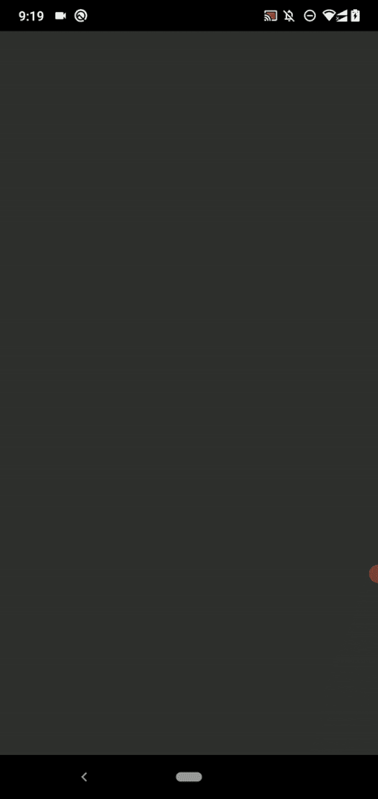
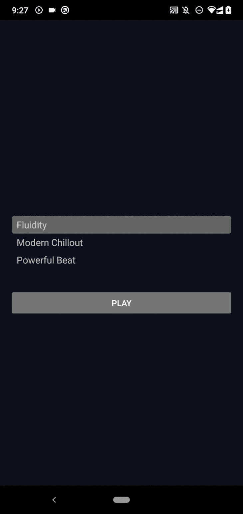
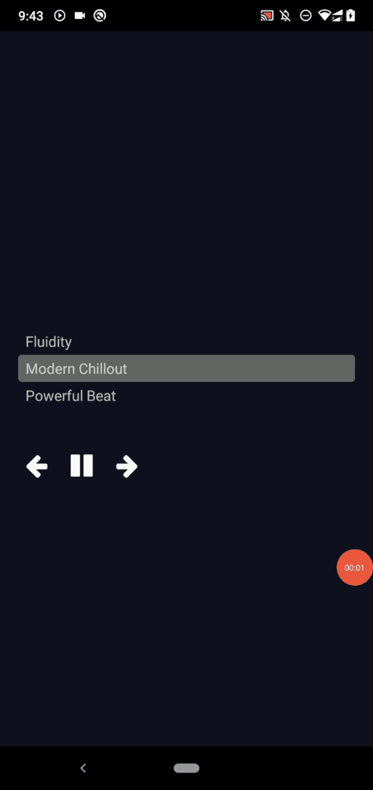
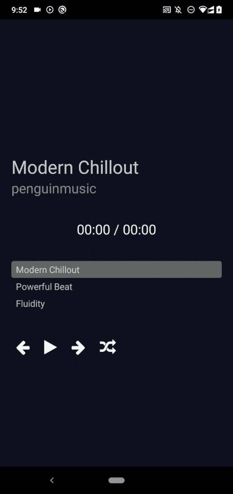
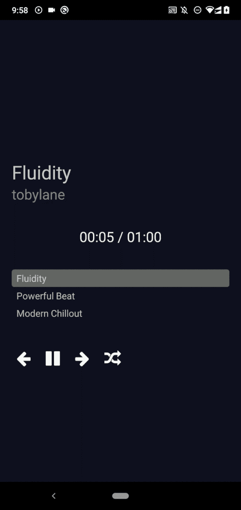

# 反应原生轨道播放器:完全指南

> 原文：<https://blog.logrocket.com/react-native-track-player-complete-guide/>

React 原生应用开发者构建各种应用，其中一些涉及实现音乐播放列表。如果您计划使用 React Native 构建一个音频播放器，那么您无疑需要一个 playlist 实现，它包括一个可管理的音乐曲目队列，该队列对用户是可见的，或者作为一个后台服务运行，用于以特定的顺序播放音乐曲目。

音乐播放列表通常连接到播放所选音乐曲目的音乐播放器实现。从用户的角度来看，他们应该能够在播放列表中添加、删除、随机播放和重新排序音乐曲目。从开发人员的角度来看，他们也应该能够以编程方式更新播放列表。

在 React Native 中创建和管理播放列表有几种潜在的方法。我们可以在没有第三方库的情况下从头构建一个播放列表和播放器，但这很耗时。我们也可以使用一个库来播放音乐曲目，并基于音乐播放器事件从头开始开发一个音乐队列。我们可以使用功能齐全的音乐曲目播放器库来进一步加快开发过程。

[`react-native-track-player`库](https://github.com/doublesymmetry/react-native-track-player)提供了全功能的 API，用于在 React Native 中创建基于播放列表的音乐应用。在本教程中，我将通过实现一个包含可视播放列表的音乐播放器来解释`react-native-track-player`的特性。

*向前跳转:*

## `react-native-track-player`的突出特点

在我们开始实践教程之前，让我们看看这个库的特性。

这个库附带了以下有助于构建音乐应用程序的功能:

### 开发者友好的玩家状态管理

该库由两个逻辑模块组成:

1.  音乐播放器模块
2.  播放列表实现

音乐播放器模块播放播放列表中出现的曲目。这个库提供了函数和 React 钩子来控制音乐播放器的状态和订阅播放器事件。这些开发人员友好的玩家状态管理特性使得 track player-UI 集成变得容易。此外，基于事件的 React 挂钩降低了 React 状态管理需求的复杂性。

### 简单的播放列表管理

这个库为开发者提供了一个简单的 API 来管理音乐曲目队列。您可以通过程序添加、删除、重复和跳过带有自解释功能的音乐曲目。使用这个库，创建你自己的基于播放列表的音乐播放器很容易。

### 性能第一的原生库核心

对于播放列表管理和回放，该库使用两个本机模块:

JavaScript `react-native-track-player`实现调用上述本机模块进行音乐回放和播放列表管理，因此这个库努力为您的音乐应用程序提供本机性能。播放列表存储在优化的本地数据结构中，以获得更好的性能(例如，Kotlin 中的 [LinkedList](https://github.com/doublesymmetry/KotlinAudio/blob/dd4bdab147c90fffcff7800790dbfcb41291d29b/kotlin-audio/src/main/java/com/doublesymmetry/kotlinaudio/players/QueuedAudioPlayer.kt#L16) )。

该库提供了一个开发人员友好的、一致的异步 API，因此您可以在 React 本机应用程序代码库中轻松使用现代的`async/await`模式。

### 平台支持和灵活的平台特定配置

这个库可以在 Android、iOS 和 Windows 平台上运行。它使用 [WinRT 媒体播放 API](https://learn.microsoft.com/en-us/uwp/api/windows.media.playback) 在 Windows 上播放音乐内容，所以你可以使用这个包来构建现代的 Windows 应用程序！

track player 库从未通过仅提供通用的跨平台 API 来限制开发人员，它为高级用例提供了特定于平台的配置。例如，它可以让你改变 Android 上的通知面板播放器图标。

## `react-native-track-player`教程

现在，我们将通过开发一个带有播放列表的音乐播放器应用程序来学习如何使用`react-native-track-player`库。在构建音乐播放器应用程序时，我将向您展示一些额外的示例代码片段，以进一步解释库 API 函数。

### 将库与 React 本地项目集成

从安装`react-native-track-player`包开始。首先，创建一个新的 React 本地项目来构建音乐播放器:

```
npx react-native init MusicTrackPlayer
cd MusicTrackPlayer

```

接下来，运行新创建的应用程序，确保一切正常:

```
npx react-native run-android
# --- or ---
npx react-native run-ios

```

现在，安装库:

```
npm install react-native-track-player
# --- or ---
yarn add react-native-track-player

```

我正在 Android 上开发这个示例应用程序，所以运行上面的命令就足以设置这个库了。但是，在 iOS 上，您需要手动安装本机依赖项:

```
cd ios && pod install

```

再次构建应用程序并运行它来验证包的安装状态。

注意:在 Android 上，如果`:app:checkDebugAarMetadata` Gradle build 任务失败，在你的`android/build.gradle`中使用`compileSdkVersion = 33`。更多信息见本[参考](https://github.com/doublesymmetry/react-native-track-player/issues/1767)。

### 创建一个简单的轨道播放器

让我们开始用音轨播放器库播放音乐吧。在为播放列表实现 UI 组件之前，我们将以编程方式创建一个播放列表，以理解播放列表管理 API。

首先，在你的应用程序源目录中创建一个名为`assets`的新目录，并下载[这些音乐曲目](https://github.com/codezri/react-native-track-player-demo/tree/main/assets)(来自 [Pixabay Music](https://pixabay.com/music/) 的三个 MP3 音频文件)到其中。

在初始化 track player 实例以播放您下载的 MP3 文件之前，我们需要定义几个服务来帮助我们配置、初始化和控制 track player 实例。创建一个名为`trackPlayerServices.js`的新文件，并添加以下代码:

```
import TrackPlayer, {
  AppKilledPlaybackBehavior,
  Capability,
  RepeatMode,
  Event
} from 'react-native-track-player';

export async function setupPlayer() {
  let isSetup = false;
  try {
    await TrackPlayer.getCurrentTrack();
    isSetup = true;
  }
  catch {
    await TrackPlayer.setupPlayer();
    await TrackPlayer.updateOptions({
      android: {
        appKilledPlaybackBehavior:
          AppKilledPlaybackBehavior.StopPlaybackAndRemoveNotification,
      },
      capabilities: [
        Capability.Play,
        Capability.Pause,
        Capability.SkipToNext,
        Capability.SkipToPrevious,
        Capability.SeekTo,
      ],
      compactCapabilities: [
        Capability.Play,
        Capability.Pause,
        Capability.SkipToNext,
      ],
      progressUpdateEventInterval: 2,
    });

    isSetup = true;
  }
  finally {
    return isSetup;
  }
}

export async function addTracks() {
  await TrackPlayer.add([
    {
      id: '1',
      url: require('./assets/fluidity-100-ig-edit-4558.mp3'),
      title: 'Fluidity',
      artist: 'tobylane',
      duration: 60,
    }
  ]);
  await TrackPlayer.setRepeatMode(RepeatMode.Queue);
}

export async function playbackService() {
  // TODO: Attach remote event handlers
}

```

上面的代码实现了三个服务:

1.  `setupPlayer`:仅用几个播放器功能和默认行为(即，应用程序终止行为)初始化一个轨道播放器实例一次
2.  `addTracks`:从捆绑资源向当前播放列表添加一首曲目
3.  这个服务接收远程事件。我们将在下一节讨论回放服务事件，所以现在让这个函数为空

这里，我们通过`require`函数从 app bundle 中加载一个 MP3 文件。该库支持通过`http`协议加载远程音频文件，通过`file`协议加载本地音频文件。

接下来，我们需要将上面的`playbackService`函数注册为回放事件处理程序。在您的`index.js`文件中使用以下代码:

```
import { AppRegistry } from 'react-native';
import TrackPlayer from 'react-native-track-player';
import App from './App';
import { name as appName } from './app.json';
import { playbackService } from './trackPlayerServices';

AppRegistry.registerComponent(appName, () => App);
TrackPlayer.registerPlaybackService(() => playbackService);

```

现在，我们可以开始构建应用程序 UI，因为我们的 track player 服务已经准备好了。将以下代码添加到您的`App.js`文件中:

```
import React, { useEffect, useState } from 'react';
import {
  SafeAreaView,
  StyleSheet,
  View,
  Button,
  ActivityIndicator,
} from 'react-native';
import TrackPlayer from 'react-native-track-player';
import { setupPlayer, addTracks } from './trackPlayerServices';

function App() {

  const [isPlayerReady, setIsPlayerReady] = useState(false);

  useEffect(() => {
    async function setup() {
      let isSetup = await setupPlayer();

      const queue = await TrackPlayer.getQueue();
      if(isSetup && queue.length <= 0) {
        await addTracks();
      }

      setIsPlayerReady(isSetup);
    }

    setup();
  }, []);

  if(!isPlayerReady) {
    return (
      <SafeAreaView style={styles.container}>
        <ActivityIndicator size="large" color="#bbb"/>
      </SafeAreaView>
    );
  }

  return (
    <SafeAreaView style={styles.container}>
      <Button title="Play" color="#777" onPress={() => TrackPlayer.play()}/>
    </SafeAreaView>
  );
}

const styles = StyleSheet.create({
  container: {
    flex: 1,
    justifyContent: 'center',
    padding: 20,
    backgroundColor: '#112'
  },
});

export default App;

```

上面的`App`组件通过`[useEffect](https://blog.logrocket.com/using-react-useeffect-hook-lifecycle-methods/)`调用`setupPlayer`服务来初始化本机的音轨播放器。接下来，如果当前播放列表为空，它调用`addTracks`服务来初始化播放列表。该组件使用条件呈现逻辑，如下所示:

*   如果播放器没有准备好(设置正在进行中),则渲染加载动画
*   如果播放器设置过程成功，则呈现一个**播放**按钮

**播放**按钮调用`TrackPlayer.play`函数开始播放曲目队列。运行上面的 app 代码，按下**播放**按钮。播放列表将开始播放！看下面的预告:



使用以下代码为`addTracks`服务播放所有下载的音乐曲目:

```
export async function addTracks() {
  await TrackPlayer.add([
    {
      id: '1',
      url: require('./assets/fluidity-100-ig-edit-4558.mp3'),
      title: 'Fluidity',
      artist: 'tobylane',
      duration: 60,
    },
    {
      id: '2',
      url: require('./assets/penguinmusic-modern-chillout-future-calm-12641.mp3'),
      title: 'Modern Chillout',
      artist: 'penguinmusic',
      duration: 66,
    },
    {
      id: '3',
      url: require('./assets/powerful-beat-121791.mp3'),
      title: 'Powerful Beat',
      artist: 'penguinmusic',
      duration: 73,
    }
  ]);
  await TrackPlayer.setRepeatMode(RepeatMode.Queue);
}

```

得益于`RepeatMode.Queue`模式，播放列表将在结束时重新开始播放。

### 管理播放列表
在前面的示例代码中，我们使用了`TrackPlayer.add`函数向播放列表添加新的音乐曲目。同样，您可以使用以下功能来管理当前播放列表:

*   `TrackPlayer.remove`:按曲目索引删除音乐曲目
*   `TrackPlayer.skip`:跳转到给定索引的音乐曲目
*   `TrackPlayer.next`:转到下一首音乐曲目
*   `TrackPlayer.previous`:转到上一首音乐曲目
*   `TrackPlayer.reset`:清除当前播放列表并停止播放音乐

在[官方文档](https://react-native-track-player.js.org/docs/api/functions/queue)中浏览所有支持的播放列表管理功能。

按下**播放**按钮后，通过热加载功能逐一执行以下函数调用，熟悉播放列表管理功能:

```
TrackPlayer.remove(0)
TrackPlayer.skip(2)
TrackPlayer.next()
TrackPlayer.previous()
TrackPlayer.reset()

```

### 可视化可管理的播放列表

让我们在实际场景中使用上面的播放列表管理功能。我们可以开始改进示例应用程序，将它变成基于播放列表的音乐播放器。

作为第一步，让我们创建一个 React 组件来显示当前播放列表，并让用户播放喜欢的音乐曲目。为了简单起见，在本教程中，我们将在我们的`App.js`文件中开发所有组件，但是当您开发生产级应用时，请确保将您的应用适当地分解到单独的源文件中。

首先，将以下导入行添加到`App.js`:

```
import {
  SafeAreaView,
  StyleSheet,
  Text,
  View,
  Button,
  FlatList,
  ActivityIndicator,
  TouchableOpacity,
} from 'react-native';
import TrackPlayer, {
  useTrackPlayerEvents,
  Event,
  State
} from 'react-native-track-player';

```

接下来，将`Playlist`组件实现添加到源文件中:

```
function Playlist() {
  const [queue, setQueue] = useState([]);
  const [currentTrack, setCurrentTrack] = useState(0);

  async function loadPlaylist() {
    const queue = await TrackPlayer.getQueue();
    setQueue(queue);
  }

  useEffect(() => {
    loadPlaylist();
  }, []);

  useTrackPlayerEvents([Event.PlaybackTrackChanged], async (event) => {
    if(event.state == State.nextTrack) {
      let index = await TrackPlayer.getCurrentTrack();
      setCurrentTrack(index);
    }
  });

  function PlaylistItem({index, title, isCurrent}) {

    function handleItemPress() {
      TrackPlayer.skip(index);
    }

    return (
      <TouchableOpacity onPress={handleItemPress}>
        <Text
          style={{...styles.playlistItem,
            ...{backgroundColor: isCurrent ? '#666' : 'transparent'}}}>
        {title}
        </Text>
      </TouchableOpacity>
    );
  }

  return(
    <View>
      <View style={styles.playlist}>
        <FlatList
          data={queue}
          renderItem={({item, index}) => <PlaylistItem
                                            index={index}
                                            title={item.title}
                                            isCurrent={currentTrack == index }/>
          }
        />
      </View>
    </View>
  );
}

```

这里，我们用一个`FlatList`组件呈现当前播放列表。`FlatList`组件使用`queue`状态变量来加载当前播放列表的细节。同时，`useEffect`调用`TrackPlayer.getQueue`将当前播放列表抓取到`queue`中。

播放列表 UI 还突出显示了当前的音乐曲目，因此我们将当前的音乐曲目索引存储在`currentTrack`状态变量中。一旦用户按下一个列表项，我们就通过调用`TrackPlayer.skip`函数来请求 track player 实例播放选中的曲目。我们通过`useTrackPlayerEvents`库钩子跟踪`currentTrack`的变化。

接下来，在`App`组件中添加`<Playlist/>`，如下面的代码片段所示:

```
return (
  <SafeAreaView style={styles.container}>
    <Playlist/>
    <Button title="Play" color="#777" onPress={() => TrackPlayer.play()}/>
  </SafeAreaView>
);

```

将以下样式定义添加到样式表中:

```
playlist: {
  marginTop: 40,
  marginBottom: 40
},
playlistItem: {
  fontSize: 16,
  paddingTop: 4,
  paddingBottom: 4,
  paddingLeft: 8,
  paddingRight: 8,
  borderRadius: 4
},

```

运行应用程序。现在，您可以按下并选择音乐曲目。等待音乐曲目结束，播放列表组件将自动设置下一首当前音乐曲目，如以下预览所示:



### 处理播放和播放器状态

前面，我们调用了`TrackPlayer.play`函数来开始播放曲目队列。我们在构建音乐 app 时经常需要暂停、控制播放速度、调节音乐音量、跳转到当前音乐曲目的特定位置。除了播放动作外，`react-native-track-player`库还允许您通过以下功能控制播放和播放器状态:

*   `TrackPlayer.pause`:暂停当前播放曲目；您可以使用`TrackPlayer.play`功能再次播放
*   `TrackPlayer.seekTo`:根据输入的秒数跳转到特定位置
*   `TrackPlayer.setRate`:改变播放速度
*   `TrackPlayer.setVolume`:设置音乐播放器音量

上述功能会影响当前播放/播放器状态。也可以在调用上述函数之前获取回放/播放器状态。这里有一些我们经常需要的吸气剂:

*   `TrackPlayer.getState`:返回当前播放状态
*   `TrackPlayer.getVolume`:返回当前音量

注意:如前所述，这个库提供了一个异步 API，所以您必须使用`await`标记从解析的承诺中提取返回的数据。从官方文档中浏览所有支持的回放状态控制功能。

按下**播放**按钮后，通过热重装逐一执行以下函数调用，熟悉播放器/播放状态函数:

```
TrackPlayer.pause()
TrackPlayer.seekTo(10)
TrackPlayer.setRate(0.5)
TrackPlayer.setVolume(0.2)

```

### 可视化回放和播放器状态

现在，我们将使用上述函数向我们的音乐播放器添加一个控制盒。用户可以使用控制盒按钮播放/暂停、转到上一首音乐曲目以及转到下一首音乐曲目。我们将使用 [`react-native-vector-icons`包](https://github.com/oblador/react-native-vector-icons)来构建控件箱图标按钮。

首先，根据[官方安装指南](https://github.com/oblador/react-native-vector-icons#installation)安装并重建项目。然后，在您的`App.js`文件中添加以下导入:

```
import TrackPlayer, {
  useTrackPlayerEvents,
  usePlaybackState,
  Event,
  State
} from 'react-native-track-player';
import Icon from 'react-native-vector-icons/FontAwesome';

```

现在，更新现有的`Playlist`组件并添加新的`Controls`组件源:

```
function Playlist() {
  const [queue, setQueue] = useState([]);
  const [currentTrack, setCurrentTrack] = useState(0);

  async function loadPlaylist() {
    const queue = await TrackPlayer.getQueue();
    setQueue(queue);
  }

  useEffect(() => {
    loadPlaylist();
  }, []);

  useTrackPlayerEvents([Event.PlaybackTrackChanged], (event) => {
    if(event.state == State.nextTrack) {
      TrackPlayer.getCurrentTrack().then((index) => setCurrentTrack(index));
    }
  });

  function PlaylistItem({index, title, isCurrent}) {

    function handleItemPress() {
      TrackPlayer.skip(index);
    }

    return (
      <TouchableOpacity onPress={handleItemPress}>
        <Text
          style={{...styles.playlistItem,
            ...{backgroundColor: isCurrent ? '#666' : 'transparent'}}}>
        {title}
        </Text>
      </TouchableOpacity>
    );
  }

  return(
    <View>
      <View style={styles.playlist}>
        <FlatList
          data={queue}
          renderItem={({item, index}) => <PlaylistItem
                                            index={index}
                                            title={item.title}
                                            isCurrent={currentTrack == index }/>
          }
        />
      </View>
      <Controls/>
    </View>
  );
}

function Controls({ onShuffle }) {
  const playerState = usePlaybackState();

  async function handlePlayPress() {
    if(await TrackPlayer.getState() == State.Playing) {
      TrackPlayer.pause();
    }
    else {
      TrackPlayer.play();
    }
  }

  return(
    <View style={{flexDirection: 'row',
      flexWrap: 'wrap', alignItems: 'center'}}>
        <Icon.Button
          name="arrow-left"
          size={28}
          backgroundColor="transparent"
          onPress={() => TrackPlayer.skipToPrevious()}/>
        <Icon.Button
          name={playerState == State.Playing ? 'pause' : 'play'}
          size={28}
          backgroundColor="transparent"
          onPress={handlePlayPress}/>
        <Icon.Button
          name="arrow-right"
          size={28}
          backgroundColor="transparent"
          onPress={() => TrackPlayer.skipToNext()}/>
    </View>
  );
}

```

这里，我们使用一个图标按钮在以下条件下切换播放/暂停状态:

```
await TrackPlayer.getState() == State.Playing

```

从`App`组件中移除上一个播放按钮，因为不再需要它:

```
return (
  <SafeAreaView style={styles.container}>
    <Playlist/>
  </SafeAreaView>
);

```

运行应用程序。现在，您可以使用控制盒:



该库提供了`useProgress`钩子来跟踪音乐曲目进度。这个钩子默认每秒轮询一次曲目进度，但是你可以根据自己的意愿配置间隔(即`useProgress(200)`)。

创建一个新组件，用`useProgress`钩子显示音乐曲目进度:

```
function TrackProgress() {
  const { position, duration } = useProgress(200);

  function format(seconds) {
    let mins = (parseInt(seconds / 60)).toString().padStart(2, '0');
    let secs = (Math.trunc(seconds) % 60).toString().padStart(2, '0');
    return `${mins}:${secs}`;
  }

  return(
    <View>
      <Text style={styles.trackProgress}>
        { format(position) } / { format(duration) }
      </Text>
    </View>
  );
}

```

上面的`TrackProgress`组件使用音轨持续时间以`mm:ss`格式显示当前音轨进度。

添加另一个组件来显示当前音乐曲目信息:

```
function Header() {
  const [info, setInfo] = useState({});
  useEffect(() => {
    setTrackInfo();
  }, []);

  useTrackPlayerEvents([Event.PlaybackTrackChanged], (event) => {
    if(event.state == State.nextTrack) {
      setTrackInfo();
    }
  });

  async function setTrackInfo() {
    const track = await TrackPlayer.getCurrentTrack();
    const info = await TrackPlayer.getTrack(track);
    setInfo(info);
  }

  return(
    <View>
        <Text style={styles.songTitle}>{info.title}</Text>
        <Text style={styles.artistName}>{info.artist}</Text>
    </View>
  );
}

```

这里，我们使用了`useTrackPlayerEvents`钩子来更新当前轨道的细节。接下来，将`useProgress`挂钩添加到导入列表中:

```
import TrackPlayer, {
  useTrackPlayerEvents,
  usePlaybackState,
  useProgress,
  Event,
  State
} from 'react-native-track-player';

```

现在，在`App`中渲染上述组件:

```
return (
  <SafeAreaView style={styles.container}>
    <Header/>
    <TrackProgress/>
    <Playlist/>
  </SafeAreaView>
);

```

将以下样式定义添加到样式表中:

```
  trackProgress: {
    marginTop: 40,
    textAlign: 'center',
    fontSize: 24,
    color: '#eee'
  },
  songTitle: {
    fontSize: 32,
    marginTop: 50,
    color: '#ccc'
  },
  artistName: {
    fontSize: 24,
    color: '#888'
  },

```

运行应用程序。现在，您将看到带有音乐曲目详细信息、曲目进度、播放列表和控制框组件的:


您可以通过添加带有`[react-native-slider]([https://github.com/callstack/react-native-slider](https://github.com/callstack/react-native-slider))`的搜索栏来改进音乐曲目播放器，但我们不会在本教程中深入讨论`react-native-slider`集成。添加搜索栏很容易，只需执行以下步骤:

1.  用`useProgress`钩子更新滑块
2.  为滑块附加一个事件处理程序，并调用`TrackPlayer.seekTo`来改变播放状态

### 如何循环和随机播放播放列表项目

您可以使用我们之前测试过的源代码来转到上一首或下一首音乐曲目。自从我们在`addTracks`服务中使用了`RepeatMode.Queue`模式以来，每当播放列表结束时，它将再次开始(循环)。您可以使用`RepeatMode.Track`通过`TrackPlayer.setRepeatMode`功能循环播放当前曲目。尝试自己在控制盒中添加一个播放列表-重复模式选择器按钮！

如果你需要随机播放播放列表怎么办？原生播放列表重排功能仍然是一个正在进行的功能请求([问题#1711](https://github.com/doublesymmetry/react-native-track-player/issues/1711) )，但是现在，我们可以在 JavaScript 端实现播放列表重排。

首先，在`Playlist`组件中实现播放列表洗牌:

```
async function handleShuffle() {
  let queue = await TrackPlayer.getQueue();
  await TrackPlayer.reset();
  queue.sort(() => Math.random() - 0.5);
  await TrackPlayer.add(queue);

  loadPlaylist()
}

return(
  <View>
    <View style={styles.playlist}>
      <FlatList
        data={queue}
        renderItem={({item, index}) => <PlaylistItem
                                          index={index}
                                          title={item.title}
                                          isCurrent={currentTrack == index }/>
        }
      />
    </View>
    <Controls onShuffle={handleShuffle}/>
  </View>
);

```

这里，我们提取当前队列，对其进行洗牌，并通过`handleShuffle`函数将其重新加载到播放列表中。接下来，添加一个新的图标按钮进行随机播放:

```
function Controls({ onShuffle }) {
  const playerState = usePlaybackState();

  async function handlePlayPress() {
    if(await TrackPlayer.getState() == State.Playing) {
      TrackPlayer.pause();
    }
    else {
      TrackPlayer.play();
    }
  }

  return(
    <View style={{flexDirection: 'row',
      flexWrap: 'wrap', alignItems: 'center'}}>
        <Icon.Button
          name="arrow-left"
          size={28}
          backgroundColor="transparent"
          onPress={() => TrackPlayer.skipToPrevious()}/>
        <Icon.Button
          name={playerState == State.Playing ? 'pause' : 'play'}
          size={28}
          backgroundColor="transparent"
          onPress={handlePlayPress}/>
        <Icon.Button
          name="arrow-right"
          size={28}
          backgroundColor="transparent"
          onPress={() => TrackPlayer.skipToNext()}/>
        <Icon.Button
          name="random"
          size={28}
          backgroundColor="transparent"
          onPress={onShuffle}/>
    </View>
  );
}

```

运行应用程序后，您可以使用随机播放功能:



添加一个按钮来自己播放随机的音乐曲目！同样，您可以通过操作曲目播放器队列来重新排序播放列表项并创建多个播放列表。播放列表管理操作将有效地工作，因为该库在本地使用适当的数据结构处理播放列表。

### 使用跟踪播放器事件

我们已经在上面的组件中使用了一些 track player 事件。例如，在`Header`组件中，我们使用了`useTrackPlayerEvents`钩子来检测音乐曲目更改事件。

该库允许您为两种事件类型附加函数:

1.  应用内事件:这些事件在应用内自动发生或由用户发起，即播放/暂停事件。该库提供了`useTrackPlayerEvents`和`usePlaybackState`挂钩来订阅这些应用内事件
2.  远程事件:这些事件由操作系统发起，即当用户按下通知区域迷你播放器的**播放**按钮时，库会调度`Event.RemoteNext`事件。我们将在下一节讨论处理远程事件

您可以从[官方文档](https://react-native-track-player.js.org/docs/api/events)中浏览所有支持的事件详情。

### 使用背景模式

用户在使用音乐应用程序时通常会进行多任务处理。例如，移动用户可以在听音乐的同时使用消息应用。

音乐应用通常即使在后台模式下也会播放当前播放列表，但如果用户想要播放下一首歌曲呢？用户可以从通知面板按下**下一个**按钮，而不是再次打开音乐播放器应用。

运行示例应用程序并检查通知栏。您将看到一个小的、特定于平台的播放器组件，如下所示:



但是，你还不能用这个迷你播放器控制播放列表。原因是库触发远程事件处理程序，而不是改变轨道播放器状态。这种情况为开发人员提供了处理远程事件的灵活性。

你还记得我们在演示应用的代码库中有一个`TODO:`注释吗？这就是我们将`playbackService`附加到库的地方——但是我们没有为远程事件实现动作。

使用`playbackService`中的以下代码根据远程事件控制轨道播放器:

```
export async function playbackService() {
  TrackPlayer.addEventListener(Event.RemotePause, () => {
    console.log('Event.RemotePause');
    TrackPlayer.pause();
  });

  TrackPlayer.addEventListener(Event.RemotePlay, () => {
    console.log('Event.RemotePlay');
    TrackPlayer.play();
  });

  TrackPlayer.addEventListener(Event.RemoteNext, () => {
    console.log('Event.RemoteNext');
    TrackPlayer.skipToNext();
  });

  TrackPlayer.addEventListener(Event.RemotePrevious, () => {
    console.log('Event.RemotePrevious');
    TrackPlayer.skipToPrevious();
  });
}

```

即使在后台运行应用程序时，上述服务也会被执行。回放/播放器事件应该像预期的那样在后台模式下工作——换句话说，`react-native-track-player`库支持后台模式，无需定制调整！

运行应用程序，在音乐播放器上打开另一个应用程序，并使用通知区域的迷你播放器播放下一首音乐曲目——一切都会正常工作。

在 Android 上，音乐播放器应用程序会移除通知区域的迷你播放器，并在终止时停止播放音乐，但您可以通过在`setupPlayer`服务中使用以下设置来避免这种行为:

```
await TrackPlayer.updateOptions({
  android: {
    appKilledPlaybackBehavior:
      AppKilledPlaybackBehavior.ContinuePlayback,
  },
// ---

```

### 如何存储播放列表

在本教程中，出于演示目的，我们使用了一个硬编码的播放列表。但是，在制作音乐应用程序中，你可能需要以一种更易于管理的方式存储你的播放列表。考虑以下存储播放列表信息的选项:

*   如果你的应用程序自动从设备存储器中提取音乐文件(即使用`[react-native-fs](https://blog.logrocket.com/how-to-access-file-systems-react-native/))`)，考虑在应用程序偏好设置或临时文件中缓存播放列表
*   如果您允许用户管理播放列表，您还可以缓存播放列表并提供导出/导入播放列表的功能
*   如果你的音乐应用是一个远程音乐播放器(比如 Spotify)，你无疑可以将你的播放列表存储在服务器中，并提供一个 CRUD API 来管理播放列表

## 结论

在本教程中，我们开发了一个基于播放列表的音乐曲目播放器来学习`react-native-track-player`库的特性。`react-native-track-player`库允许您创建和管理可播放的音乐播放列表。

或者，您可以使用 [`react-native-sound`库](https://github.com/zmxv/react-native-sound)来播放音乐，并用 JavaScript 自己处理播放列表——然后，您必须基于`react-native-sound`事件为整个播放列表队列的实现编写代码。尽管您肯定可以开发这样的实现，但是您可能会面临应用程序性能的问题，因为您在 JavaScript 中处理回放事件和播放列表状态。

`react-native-track-player`库处理本机端的一切，并将事件分派给 JavaScript 以供 UI 更新使用。因此，使用`react-native-track-player`进行可播放音乐播放列表管理可以提高您的工作效率，并为您提供性能第一、生产就绪的解决方案。

从我的 GitHub 库中找到演示应用的源代码。

## [LogRocket](https://lp.logrocket.com/blg/react-native-signup) :即时重现 React 原生应用中的问题。

[](https://lp.logrocket.com/blg/react-native-signup)

[LogRocket](https://lp.logrocket.com/blg/react-native-signup) 是一款 React 原生监控解决方案，可帮助您即时重现问题、确定 bug 的优先级并了解 React 原生应用的性能。

LogRocket 还可以向你展示用户是如何与你的应用程序互动的，从而帮助你提高转化率和产品使用率。LogRocket 的产品分析功能揭示了用户不完成特定流程或不采用新功能的原因。

开始主动监控您的 React 原生应用— [免费试用 LogRocket】。](https://lp.logrocket.com/blg/react-native-signup)