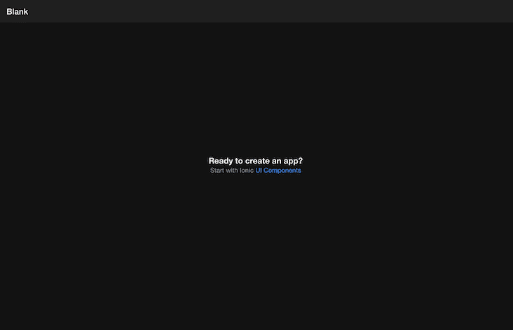
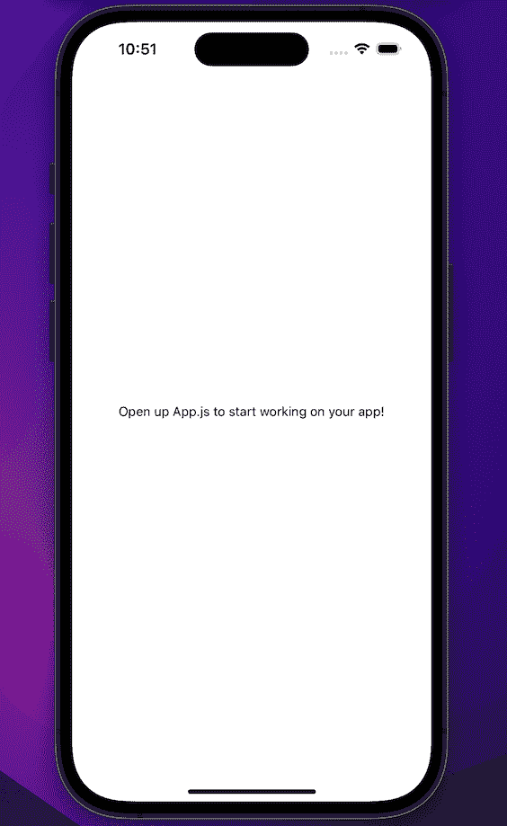
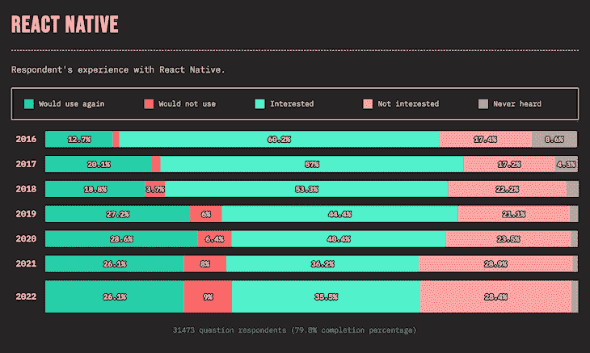
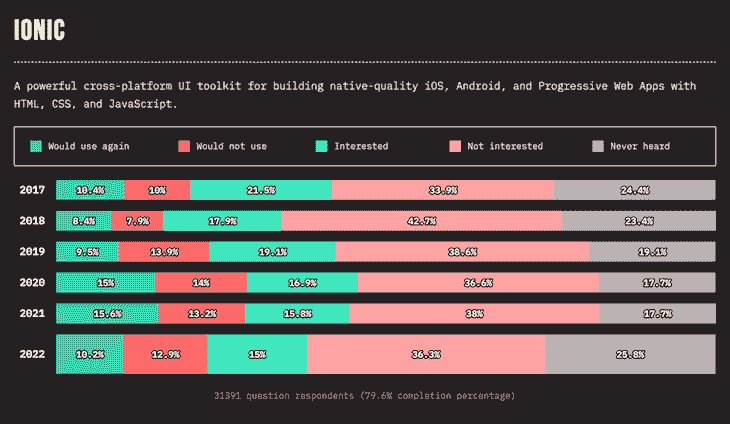
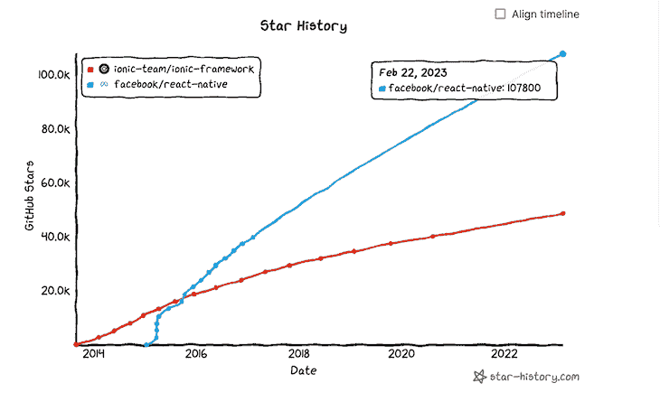
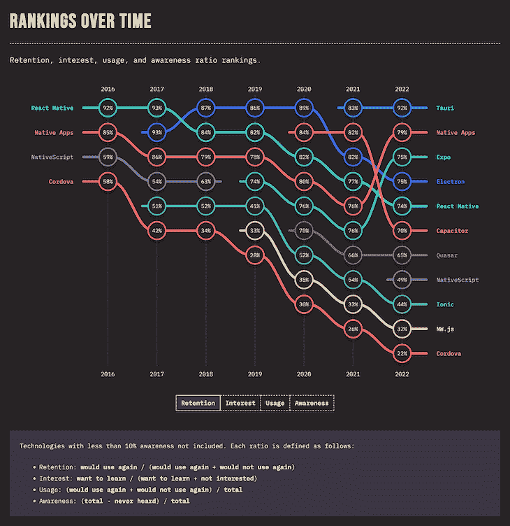

# React Native vs. Ionic - LogRocket 博客

> 原文：<https://blog.logrocket.com/react-native-vs-ionic/>

***编者按**:本文由[沙德·米尔扎](https://blog.logrocket.com/author/shadmirza/)于 2023 年 2 月 8 日进行最后一次审核和准确性更新。*

截至 2023 年 2 月，[60%的网站流量来自使用移动设备的人](https://explodingtopics.com/blog/mobile-internet-traffic)。因此，开发优秀的移动应用程序的需求与日俱增，构建移动应用程序的方法也越来越多。

随着对混合应用的需求不断增加，新的框架正在出现，帮助我们快速构建跨平台的应用。这是对 SwitchUI、React Native、Cordova、Xamarin、Ionic、Jetpack Compose 和 Flutter 等现有框架的补充。

今天，我们将使用 Ionic 和 React Native 构建一个应用程序，根据一系列标准来比较这两个框架。我们将理解这两个框架的亮点以及它们之间的权衡。开始吧！

*向前跳跃*:

## 离子框架

Ionic 是一个开源 UI 工具包，用于使用 web 技术构建高性能、高质量的移动应用。它是平台不可知的，这意味着我们可以使用 React、Angular 甚至 Vue 来构建应用。

您可以使用 HTML、CSS、JavaScript 和 Ionic UI 工具包的组件快速构建 Ionic 应用程序，这些组件在每个平台上都很漂亮。这些高级组件构成了 Ionic 应用程序的构建模块。我们为 web 构建 Ionic 应用程序，并在 WebView wrapper 的帮助下将其部署到 Android 和 iOS 设备上。这种应用程序被称为混合应用程序。

因为所有的设备都使用同一个 web 应用程序，我们可以在所有平台上共享代码，节省时间。离子应用是网络第一，所以支持本机功能，如相机，全球定位系统等。，多走了一步。

我们必须安装插件，为每一个本地功能，我们想用科尔多瓦或电容器。拥有使用原生特性的可能性，以及使用 HTML 和 CSS 迭代的速度，使得 Ionic 成为构建跨平台混合应用程序的绝佳选择。

## 构建 Ionic 应用程序

我们将使用 React 和 Ionic 构建一个基本的石头、剪子、布游戏。这个演示将帮助我们理解和比较 Ionic 开发工作流程和 ReactNative。

首先，让我们安装`@ionic/cli`包来帮助我们启动一个 Ionic 应用程序:

```
npm install -g @ionic/cli

```

现在，我们可以使用这个包来创建我们的应用程序:

```
ionic start ionic-rock-paper-scissors blank --type react

```

注意上面命令中的`--type react`。这意味着我们选择 React 作为我们的框架。也可以挑 Angular 或者 Vue。

一旦我们的应用程序创建完成，我们可以使用下面的命令启动本地开发服务器:

```
ionic serve 

```

它应该会在您的浏览器中打开应用程序:



如果您注意到文件夹结构，我们已经创建了一个`src`文件夹，并添加了一些样板文件。这很有帮助，因为我们可以开始更改一些引导代码，并在浏览器上看到我们的更改。

`/pages`目录包括我们的应用程序包含的所有页面。我们现在对`home.jsx`页面很满意，但是我们可以随时添加更多。

类似地，`/components`目录包含了所有的组件。我们可以创建一个新的组件`GameContainer.jsx`，并开始编写我们的代码。

### 在 Ionic 中为游戏添加用户界面

让我们开始添加一些 JSX，这将渲染应用程序。之后我们将开始添加逻辑:

```
import { IonButton } from "@ionic/react";
import "./GameContainer.css";

const GameContainer = () => {
  return (
    <div className="container">
      <div className="user-choice">
        <IonButton color="primary" onClick={() => onSelect("rock")}>
          Rock 🪨
        </IonButton>
        <IonButton color="secondary" onClick={() => onSelect("paper")}>
          Paper 📄
        </IonButton>
        <IonButton color="tertiary" onClick={() => onSelect("scissors")}>
          Scissor ✂️
        </IonButton>
      </div>
    </div>
  );
};

export default GameContainer;

```

我们添加了三个按钮来帮助用户进行选择。如果你仔细注意，我们使用的是`@ionic/react`包中的`IonicButton`。`IonicButton`是爱奥尼亚提供的高级构建模块之一。它们在 Ionic 世界中被称为组件，我们可以直接在我们的 Ionic app 中使用它们。

Ionic 有大量这样的组件，帮助我们快速构建应用原型。你可以在他们的文档网站上查看这些组件。

因为我们正在使用 React，所以我们可以使用 state 并构建我们的应用程序的逻辑。让我们从添加一些状态和处理程序开始。请遵循代码块中的注释:

```
// create a tuple that helps us choose between rock paper scissors from a random index
const choiceArray = ["rock", "paper", "scissors"];

// create state to save user and computer choice
const [userChoice, setUserChoice] = useState(null);
const [compChoice, setCompChoice] = useState(null);

// save winner or draw in winner state
const [winner, setWinner] = useState(null);

// create states for scoreboard
const [userScore, setUserScore] = useState(0);
const [compScore, setCompScore] = useState(0);

// add onSelect handler to save user and computer choice
const onSelect = (choice) => {
  setUserChoice(choice);
  setCompChoice(getComputerChoice());
};

// add a helper function to get a random choice for computer
const getComputerChoice = () => {
  const random = Math.floor(Math.random() * 3);
  return choiceArray[random];
};

```

现在我们已经初始化了状态并添加了选择处理程序，我们可以编写选择获胜者的逻辑了:

```
// add a helper function to select the winner
const getWinner = useCallback(() => {
  if (userChoice === null) return null;
  if (userChoice === compChoice) return "draw";
  if (priorityMap[userChoice] === compChoice) {
    return "user";
  }
  return "computer";
}, [userChoice, compChoice]);

// select the winner whenever user and computer choice are updated
useEffect(() => {
  const whoWon = getWinner();
  if (!whoWon) return;
  setWinner(whoWon);

  // update the scoreboard
  if (whoWon === "user") {
    setUserScore((prevValue) => prevValue + 1);
  }
  if (whoWon === "computer") {
    setCompScore((prevValue) => prevValue + 1);
  }
}, [userChoice, compChoice, getWinner]);

```

我们选择赢家的逻辑就完成了。现在，让我们在 JSX 中快速添加获奖者信息和记分牌:

```
return (
  <div className="container">
    // add scoreboard
    <div className="score-sheet">
      <h2>Score</h2>
      <div className="score-container">
        <div className="score-board">
          <p className="score-name">User</p>
          <p className="score-value">{userScore}</p>
        </div>
        <div className="score-board">
          <p className="score-name">Computer</p>
          <p className="score-value">{compScore}</p>
        </div>
      </div>
    </div>
    <div>
      {winner && (
        <p className="winner-text">
          You selected {userChoice} while computer selected {compChoice}
        </p>
      )}
      {winner &&
        (winner === "draw" ? (
          <p className="winner-text">Match was a draw</p>
        ) : (
          <p className="winner-text">{winner} is winner</p>
        ))}
    </div>
    <div className="user-choice">
      <IonButton color="primary" onClick={() => onSelect("rock")}>
        Rock 🪨
      </IonButton>
      <IonButton color="secondary" onClick={() => onSelect("paper")}>
        Paper 📄
      </IonButton>
      <IonButton color="tertiary" onClick={() => onSelect("scissors")}>
        Scissor ✂️
      </IonButton>
    </div>
  </div>
);

```

我们的应用程序已经完成，但我们还没有完成。我们讨论了 Ionic 如何让我们通过插件来挂钩本地特性。让我们添加一个选项，通过移动设备上支持的 Share API 来共享游戏结果。

> 注意:支持 Web 共享 API，但需要更加可靠。

首先安装`@capacitor/share`插件:

```
npm install @capacitor/share
npx cap sync

```

现在，我们可以通过一个按钮来处理共享:

```
// import Icon 
import { IonButton, IonIcon } from "@ionic/react";
import { shareOutline } from "ionicons/icons";
// import the plugin
import { Share } from '@capacitor/share';

// add a share handler function
const handleResultShare = async () => {
    await Share.share({
      title: 'Checkout my result in rock, paper, scissors',
      text: `My score is User: ${userScore} and Computer: ${compScore}`,
      url: 'http://gameurl.com/',
      dialogTitle: 'Share with buddies',
    });
  }

// add a button in jsx
<IonButton
  className="share-button"
  color="primary"
  expand="block"
  onClick={handleResultShare}
>
  Share <IonIcon slot="end" icon={shareOutline}></IonIcon>
</IonButton>

```

> 您可以根据自己的喜好更新 CSS。

您也可以使用以下命令在模拟器中预览应用程序:

```
ionic capacitor run ios -l --external

```

这是游戏应该有的样子，还有分享动作:

我们的应用程序现在已经完成了！Ionic 应用程序能够支持 PWA。如果您查看`index.js`文件，您会看到已经添加了服务人员:

```
// If you want your app to work offline and load faster, you can change
// unregister() to register() below. Note this comes with some pitfalls.
// Learn more about service workers: https://cra.link/PWA
serviceWorkerRegistration.unregister();

```

Ionic 中的 PWA 是一个可选功能。您可以将其更改为注册一名服务人员，我们的应用程序将支持 PWA:

```
serviceWorkerRegistration.register();

```

PWA 需要一个清单文件和一个服务人员。多亏了 Ionic，它还被添加到了公共文件夹中，你可以根据自己的需要进行定制。

这将允许我们的应用程序离线工作，加载速度更快。您可以在[文档页面上阅读有关 Ionic PWA 的更多信息。](https://ionicframework.com/docs/react/pwa)

完整的代码可以在 [GitHub 库](https://github.com/iamshadmirza/ionic-rock-paper-scissors)上找到。

我们来讨论一下选择爱奥尼亚的利与弊。

### Ionic pros

我们使用了`IonicButton`，一个来自离子库中的现成组件。Ionic 提供了大量这样的组件，帮助我们快速制作原型。这些组件都是精心打造的，在 Android、iOS 和网络上看起来都很不错。我们不必担心跨平台的样式和一致性。

* * *

### 更多来自 LogRocket 的精彩文章:

* * *

Ionic 几乎没有学习曲线；我们可以使用普通的 HTML、CSS 和 JavaScript。任何 web 开发者都可以从第一天开始构建混合应用。Ionic 对于我们想要使用的框架也很灵活。我们可以在反应、角度或 Vue 中选择任何一个。

另外，开发只需要一个浏览器；不用担心安装 XCode 或者 Android Studio 进行开发。此外，各种各样的插件可用于挂钩本机功能。

最后，对 PWA 的一流支持允许应用程序离线工作，获得推送通知，加载更快，并提供更像应用程序的感觉。

### 离子 cons

该应用程序主要是一个包装在 WebView 中的网页，性能不如真正的原生应用程序。

添加原生功能需要一个额外的步骤，并且您必须为您想要使用的每个功能安装原生插件。

UI 组件是一致的，这意味着它们跨平台看起来是一样的。这既是优点也是缺点，因为每个论坛都有自己的设计语言。Android 和 iOS 的观感不一样，这是一个 Ionic app 很难得到的。

最后，由于性能瓶颈，任何动画密集型应用在 Ionic 上都表现不佳。

## 反应自然

React Native 是一个用于构建跨平台应用的开源库，它是基于 React 的，因为它使用了驱动 React 的相同引擎。

与 Ionic 不同，React 原生应用是真正的原生应用。React Native 提供的组件是围绕其本机对应组件的 JavaScript 包装器。编译后的应用将是真正的原生应用，就像使用 Android Swift 或 XCode 一样。

这是一个巨大的优势，因为原生应用程序可以更有效地使用设备，并提供原生体验。

React Native 也有丰富的原生组件库，每个平台都遵循不同的设计语言。单一的代码库有助于我们构建跨平台的应用程序，在 Android 和 iOS 上都能提供原生的感觉。

使用 React Native 的几家知名公司是脸书、Instagram、Flipkart、比特币基地和 Discord。

我们来搭建一个 app，详细了解一下 React Native。

### 构建 React 本机应用程序

我们将构建和以前一样的石头、布、剪刀游戏，但是使用 React Native。这将帮助我们理解框架之间的核心差异。

Expo 是现在启动 React 原生项目的最佳方式，我们将使用它来快速启动 React 原生应用:

```
npx create-expo-app rn-rock-paper-scissors

```

一旦我们的应用程序创建完成，我们就可以启动本地开发服务器:

```
npm run ios

```

这将在模拟器中打开应用程序:



我们需要创建一个文件夹结构，就像前面的 Ionic 项目一样。它让我们可以根据自己的需要自由定制，但需要我们付出额外的努力。

我要让它和 Ionic 项目里的那个差不多。`/screens`目录将包括我们应用程序的所有屏幕。类似地，`/components`目录将包含所有组件。所有的东西都会被包在一个`src`文件夹里。

### 在 React Native 中为游戏添加 UI

让我们开始添加一些 JSX，这将渲染应用程序。我们将首先开始创建一个屏幕。在`screens`文件夹中添加一个文件`Home.jsx`:

```
// src/screens/Home.jsx
import { View, Text } from 'react-native'
import React from 'react'

const Home = () => {
  return (
    <View>
      <Text>Home</Text>
    </View>
  )
}

export default Home

```

如果你仔细观察，你会发现我们正在从`react-native`包装中进口`View`和`Text`组件。这些是 React Native 提供的原生组件，还有很多类似的组件。

Ionic 为我们提供了丰富的现成组件。在这点上，React Native 是不受欢迎的。它只在本地 UI 组件上提供了一个 JavaScript 包装器；我们可以自己设计。

但是感谢丰富的社区，我们有许多组件库可用。我们将安装`react-native-elements`，它就是这样一个库。

运行以下命令从 npm 安装 React 本机元素:

```
npm install @rneui/themed @rneui/base

```

我们还需要另一个名为`react-native-safe-area-context`的包。让我们也快速安装它:

```
npx expo install react-native-safe-area-context

```

这将安装一个支持 Expo 的版本`react-native-safe-area-context`。

现在我们已经准备好构建我们的游戏了。因为我们使用 React，所以状态和其他逻辑将与 Ionic 相同，只有组件的用法不同:

```
import React, { useEffect, useState, useCallback } from "react";
import { Button, Header } from "@rneui/base";
import { StyleSheet, Text } from "react-native";
import { View } from "react-native";
import { EvilIcons } from "@expo/vector-icons";
import { useSafeAreaInsets } from "react-native-safe-area-context";

const choiceArray = ["rock", "paper", "scissors"];
const priorityMap = {
  scissors: "paper",
  rock: "scissors",
  paper: "rock",
};

const Home = () => {
  const { bottom } = useSafeAreaInsets();
  const [userChoice, setUserChoice] = useState(null);
  const [compChoice, setCompChoice] = useState(null);
  const [winner, setWinner] = useState(null);
  const [userScore, setUserScore] = useState(0);
  const [compScore, setCompScore] = useState(0);

  const onSelect = (choice) => {
    setUserChoice(choice);
    setCompChoice(getComputerChoice());
  };

  const getComputerChoice = () => {
    const random = Math.floor(Math.random() * 3);
    return choiceArray[random];
  };

  const getWinner = useCallback(() => {
    if (userChoice === null) return null;
    if (userChoice === compChoice) return "draw";
    if (priorityMap[userChoice] === compChoice) {
      return "user";
    }
    return "computer";
  }, [userChoice, compChoice]);

  useEffect(() => {
    const whoWon = getWinner();
    if (!whoWon) return;
    setWinner(whoWon);
    if (whoWon === "user") {
      setUserScore((prevValue) => prevValue + 1);
    }
    if (whoWon === "computer") {
      setCompScore((prevValue) => prevValue + 1);
    }
  }, [userChoice, compChoice, getWinner]);

  return (
    <>
      <Header
        centerComponent={{ text: "Rock Paper Scissors", style: styles.heading }}
      />
      <View style={{ flex: 1, paddingBottom: bottom }}>
        <View style={styles.scoreSheet}>
          <Text style={styles.scoreHeading}>Score</Text>
          <View style={styles.scoreContainer}>
            <View style={styles.scoreBoard}>
              <Text style={styles.scoreName}>User</Text>
              <Text style={styles.scoreValue}>{userScore}</Text>
            </View>
            <View style={styles.scoreBoard}>
              <Text style={styles.scoreName}>Computer</Text>
              <Text style={styles.scoreValue}>{compScore}</Text>
            </View>
          </View>
          <Text style={styles.winnerText}>
            You selected {userChoice} while computer selected {compChoice}
          </Text>
          {winner &&
            (winner === "draw" ? (
              <Text style={styles.winnerText}>Match was a draw</Text>
            ) : (
              <Text style={styles.winnerText}>{winner} is winner</Text>
            ))}
        </View>
        <View style={styles.btnWrapper}>
          <Button
            title="Rock 🪨"
            size="sm"
            buttonStyle={styles.button}
            containerStyle={styles.btnContainer}
            onPress={() => onSelect("rock")}
          />
          <Button
            title="Paper 📄"
            size="sm"
            buttonStyle={[styles.button, { backgroundColor: "tomato" }]}
            containerStyle={styles.btnContainer}
            onPress={() => onSelect("paper")}
          />
          <Button
            title="Scissor ✂️"
            size="sm"
            buttonStyle={[styles.button, { backgroundColor: "green" }]}
            containerStyle={styles.btnContainer}
            onPress={() => onSelect("scissors")}
          />
        </View>
      </View>
    </>
  );
};

const styles = StyleSheet.create({
  heading: {
    color: "white",
    fontSize: 16,
    fontWeight: "600",
  },
  scoreSheet: {
    flex: 1,
    flexDirection: "column",
    alignItems: "center",
  },
  scoreHeading: {
    fontSize: 32,
    fontWeight: "800",
    alignSelf: "center",
  },
  scoreContainer: {
    flexDirection: "row",
    alignSelf: "center",
    marginTop: 12,
  },
  scoreBoard: {
    flexDirection: "column",
    alignItems: "center",
    marginHorizontal: 10,
    marginBottom: 26,
  },
  scoreName: {
    fontSize: 18,
    fontWeight: "700",
  },
  scoreValue: {
    fontSize: 32,
  },
  winnerText: {
    fontSize: 16,
    fontWeight: "700",
    marginTop: 10,
    textAlign: "center",
  },
  button: {
    backgroundColor: "rgba(78, 116, 289, 1)",
    borderRadius: 3,
    width: 100,
    paddingVertical: 10,
  },
  shareBtn: {
    backgroundColor: "teal",
    alignSelf: "flex-end",
    margin: 5,
  },
  btnWrapper: {
    flexDirection: "row",
    width: "100%",
    justifyContent: "space-around",
  },
});

export default Home;

```

我们看到了如何在 Ionic 中安装共享插件。这已经没有必要了，因为 React Native 对一些常见的原生特性如`Share`有一流的支持。您可以直接从`react-native`包中导入`Share`并开始使用:

```
// add import
import { Share } from 'react-native';

// add a share handler function
const handleResultShare = async () => {
  await Share.share({
    title: "Checkout my result in rock, paper, scissors",
    message: `My score is User: ${userScore} and Computer: ${compScore}`,
    url: "http://gameurl.com/",
  });
};

// add a button to handle share functionality
<Button
  title="Share"
  icon={<EvilIcons name="share-apple" size={28} color="white" />}
  iconRight
  buttonStyle={[styles.button, styles.shareBtn]}
  onPress={handleResultShare}
/>;

```

让我们来看看实际的分享表:

我们的应用程序现在已经完成了！完整的代码可以在 [GitHub 库](https://github.com/iamshadmirza/rn-rock-paper-scissors)上找到。

现在，我们来讨论一下选择 React Native 的好处和坏处。

### 反应本土专业人士

*   默认情况下，使用 React Native 构建的应用程序是高性能的。React Native 提供的组件提供了类似本机的性能和感觉
*   因为我们使用的是原生组件，所以结果与使用 Android Studio 或 XCode 构建的组件没有区别
*   大部分代码在 Android 和 iOS 之间共享，节省了大量开发时间
*   诸如动画、相机、视频回放和无限列表等计算繁重的任务可以添加到 React 本机应用程序中
*   一个支持许多第三方库的丰富社区，使得快速添加复杂功能变得更加容易
*   与其他应用相比，测试 React 本地应用更容易
*   React Native 是非单调性的，所以我们可以使用我们选择的任何组件库
*   它还可以使用`react-native-web`转换成一个 web 应用，最终帮助我们在 Android、iOS 和 web 之间共享，同时保持移动设备的性能
*   在 React 本地应用上添加可访问性和离线支持要容易得多

### 应对本土的不利因素

由于 React Native 的非个人化特性，构建缓慢的应用程序非常容易。未优化的组件和内存泄漏经常被忽略，导致应用程序性能不佳。

此外，调试仍然是 React 原生生态系统中的一个难点。社区正在努力改进它，但这需要时间。

一个 React 的原生开发者经常要和原生代码交互，这有点困难。对于有网络背景的人来说，学习曲线可能有点困难。

虽然你可以构建任何复杂的动画或计算繁重的应用程序，但我们不能忽视使它具有高性能的努力。创建一个流畅的动画是一项具有挑战性的任务，需要专业知识。

许多本机功能依赖于设备，导致一些设备上的功能运行不正常。这使得调试和支持每一个设备变得困难，因为 API 在旧设备上经常被否决。

最后，React Native 是变化最快的生态系统之一。您今天编写的许多代码很快就会过时，需要重构，要赶上并保持最新需要付出很多努力。

## 离子型与反应型

我们已经讨论了 Ionic 和 React Native 的优缺点；现在，让我们根据下面的一些特性来比较一下这两者。

### Ionic 是平台不可知的，而 React Native 只是用于 React

Ionic 最大的优势是，它与 React、Angular 和 Vue 一起开发可以在移动和网络上使用的应用程序。相比之下，React Native 主要是基于 React 的移动 app 开发库。

React Native 通过 React 的优化渲染使用本地组件，并且只针对移动设备(使用`react-native-web`可以提供 web 支持，但是需要更加可靠)。这使得 React Native 对于使用 React 之外的框架的开发人员来说有点困难。

### 混血儿与本地人

Ionic 应用被称为混合应用。我们在 WebView 包装器中使用 HTML、CSS 和 JavaScript 为 web 构建应用程序。Ionic 的组件提供了足够的样式，在两个平台上都很好看。然而，它们仍然不是本地的 Ionic 应用程序导致网站/PWAs 在浏览器中运行。

另一方面，React 本机应用程序是真正的本机应用程序，因为该应用程序是使用本机组件构建的。它具有原生应用的感觉和性能，与使用 Java/Kotlin 或 Swift 构建的应用没有区别。

虽然 Ionic 应用对于大型用例来说已经足够好了，但它们无法与使用 React Native 构建的真正本机应用的性能相媲美。它缺乏本机应用程序所能提供的性能、感觉和可访问性优势。

虽然这两个框架都允许我们共享代码，但混合应用程序方法提供了 web、Android 和 iOS 之间几乎完全共享的代码。React Native 的代码共享相对于我们想要支持的每个平台来说稍微少一些，并且经常需要有条件的改变。

### 艾滋病患者

Ionic 的混合性质使其非常适合 PWA。如今，默认情况下，每个 Ionic 应用程序都包含 PWA 支持。它帮助用户获得类似应用程序的感觉和一些离线好处。

React Native 没有 PWA 支持，需要额外一步才能获得 PWA 的好处。离线支持很难添加到 React 本地应用中。

### 本机 API

React Native 对大多数原生 API 提供一流的支持，而 Ionic 需要安装一个插件。我们已经在上面通过添加共享功能构建的应用程序中看到了这一点。

Ionic 支持广泛的原生功能，我们可以通过电容插件快速挂钩，但数量仍然有限。React Native 有一个庞大的第三方包社区，让我们可以挂钩任何功能，不管它们有多复杂。

比如 React Native 最近开始支持`react-native-skia`。Skia 是 Google Chrome 和 Chrome OS、Android、Flutter、Mozilla Firefox、Firefox OS 以及许多其他产品的图形引擎。在 Skia 引擎的帮助下，现在可以在 React Native 中构建更复杂的动画甚至草图应用程序。

由于 React Native 真正的本机性质，它可以访问 UI 线程并毫不费力地绘制图形，而不会影响性能。像这样的支持在离子世界里是非常有限的。

Ionic 和 React Native 的技术进步和学习资源都有所改善。随着时间推移，这导致两种框架的适应性增加。这意味着如今构建跨平台应用比三年前要容易得多。

React Native 看到了开发社区对构建跨平台应用程序的持续兴趣。随之而来的是巨大的增长和许多大型科技公司的押注。你可以在下面的图表中看到更多关于 JS 状态调查的信息:



在同一类别中包含其他玩家，如 Flutter 和 SwiftUI，使得构建真正的原生应用程序而不是行为类似于应用程序的东西变得容易得多。

这可能是社区对 Ionic 的兴趣在过去几年中略有下降的原因，尽管 Ionic 已经增加了改进和原生插件支持:



React Native 在 GitHub 上有大约 108k 颗恒星，而 Ionic 有 48.6k 颗恒星。React Native 的崛起要比 Ionic 快得多:



如果我们比较不同时间的排名，React Native(包括 Expo)是第三大最受欢迎的应用构建方式。相比之下，爱奥尼亚排名第九:



总的来说，无论我们是在谈论 GitHub 明星、第三方解决方案的数量，还是开发者社区的兴趣，React Native 在社区方面都取得了成功。

> 更多信息可在 JS 2022 页面的[状态中找到。](https://2022.stateofjs.com/en-US/libraries/mobile-desktop/)

### 排除故障

Ionic 和 React 本机支持调试工具以及良好的旧控制台日志。我们可以在 Chrome 或 Safari 中使用 web inspector 来调试 Ionic 应用程序，而 React Native 则有 Flipper 这样的工具。

React Native 允许您更深入地分析应用程序，并审核性能和其他指标。相比之下，Ionic 应用程序必须手动依赖浏览器来检查不同的改进领域。Ionic 中缺少这样的工具使得 React Native 成为这一类别中的赢家，尽管这两个框架都需要更好的调试支持。

### 应用程序大小

因为 Ionic 在 WebView 包装器中提供了一个 web 应用程序，所以它的应用程序相对较小。相比之下，React Native 将所有编译后的代码捆绑在一起，并将其发送给最终用户，从而导致应用程序变得更大。

在这两种情况下，应用程序的大小仍然很小(大约 16 MB)，任何用户都可以轻松下载。这使得两个框架都适合应用程序开发，而不管它们的大小差异。

### 更新

Ionic 应用得益于即时更新，因为它采用了网络优先的方式。一旦您更新了代码，更改就会立即反映出来。如果您需要对原生插件进行任何更改，您只需重新构建应用并提交到商店。

默认情况下，React Native 要求您在每次需要更改某些内容时进行构建。但是有了 CodePush，我们可以通过 OTA(空中下载)向用户推送更新，而无需他们安装新版本。这需要额外的工作来设置，并且管理起来比更新 web 代码更昂贵。此外，只要原生依赖关系没有变化，CodePush 更新就以应用程序为目标，管理应用程序的版本以实现更新有点棘手。

## 结论

选择正确的框架总是取决于您正在构建的应用程序的需求和您目前拥有的技能。

PWA，移动和 web 之间的代码共享，以及原生插件支持，使 Ionic 成为各种应用程序的绝佳选择。你可以更好地构建一个像新闻订阅或电子商务网站这样的应用程序。许多像麦当劳和 JustWatch 这样的大公司都使用 Ionic，并开发出了很棒的应用程序。只有当你的应用程序计算量很大时，Ionic 才会开始挣扎。

如果你的用例有流畅的应用动画，比如访问相机模块，渲染大规模数据集的图表等，React Native 会好得多。React Native 对原生组件的访问给人一种真正的原生感觉，这对于一些公司来说是必不可少的。除了性能，丰富的第三方库使得在 React Native 中构建复杂的功能变得容易。

平台收益呢？如果你有精通 Angular 和 Vue 的开发人员，那么选择 Ionic 将大大减少开发时间。Ionic 对 Vue、React 和 Angular 的适应性使其易于接近，并且几乎没有学习曲线。

开发人员使用 React Native 并不总是轻而易举的事情，尤其是如果他们不熟悉 React 的话。因此，人才库在选择技术组合时起着至关重要的作用，而这一点经常被忽视。

对于 Ionic 和 React Native，React 开发人员的学习曲线是相似的。因此，如果你有一个 React 开发团队，这取决于你对应用的期望。

## [LogRocket](https://lp.logrocket.com/blg/react-native-signup) :即时重现 React 原生应用中的问题。

[](https://lp.logrocket.com/blg/react-native-signup)

[LogRocket](https://lp.logrocket.com/blg/react-native-signup) 是一款 React 原生监控解决方案，可帮助您即时重现问题、确定 bug 的优先级并了解 React 原生应用的性能。

LogRocket 还可以向你展示用户是如何与你的应用程序互动的，从而帮助你提高转化率和产品使用率。LogRocket 的产品分析功能揭示了用户不完成特定流程或不采用新功能的原因。

开始主动监控您的 React 原生应用— [免费试用 LogRocket】。](https://lp.logrocket.com/blg/react-native-signup)