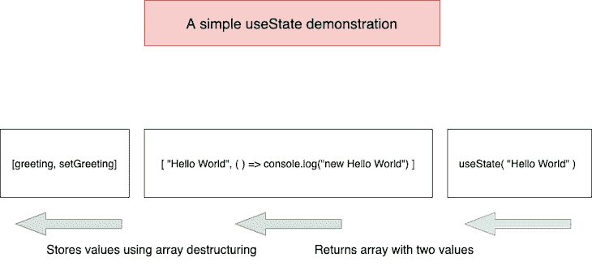

# 避免本地状态管理中常见陷阱的反应模式

> 原文：<https://blog.logrocket.com/react-patterns-common-pitfalls-local-state-management/>

## 介绍

在一般的 React 应用程序中，通常有三种类型的状态:

1.  从 API 获取数据和存储数据。这种类型的状态通常由 Redux 这样的通用状态管理库来管理。
2.  一个或几个附近组件需要的本地状态或任何客户端状态。
3.  全局状态，或在整个应用程序中使用的状态。我还会在组件树中添加离需要它们的组件太远的状态(例如，通过单击标题按钮切换侧边栏)。像这样的状态可以用 React 上下文 API 来管理。

在这篇文章中，我们的重点将放在本地状态管理和我们可以用来避免常见陷阱的各种反应模式上。

### 先决条件

为了从本文中获得最大收益，您应该对 React 和现代 JavaScript 有所了解。至此，我们可以开始简单回顾一下什么是状态，以及为什么它在 React 应用程序中如此重要。

## React 中的状态是什么:简要回顾

在 React 中，状态是一个普通的 JavaScript 对象，它保存关于组件的信息。状态类似于函数中声明的变量。但是，当函数退出时，此类变量会消失，而 React 会在渲染之间保留状态变量。

状态保存影响`render()`方法的信息；因此，状态更改会触发渲染更新。当一个组件在整个生命周期中挂载和变异时，反应状态从默认值开始。

这些状态更新或突变通常由用户生成的事件触发。在 React 中有很多初始化状态的方法，但是我们将使用`useState`钩子。考虑以下代码:

```
const [bulb, setBulb] = useState("off")
```

上面的代码片段创建了一个名为`bulb`的状态变量，并用`useState`钩子的参数初始化它。

## 挂钩是如何工作的

现在考虑下面的代码:

```
const [state, setState] = useState(initialState);
```

`useState`函数只有一个参数:初始状态。它返回一个带有两个值的数组:当前状态和一个更新它的函数。我们使用数组析构来存储从`useState`返回的值。这就是为什么我们写道:

```
const [something, setSomething] = useState()
```

数组析构是现代 JavaScript 的一个特性。下面是一个演示它如何工作的小代码。你可以[在这里](https://developer.mozilla.org/en-US/docs/Web/JavaScript/Reference/Operators/Destructuring_assignment)了解更多信息。

```
const [firstname, lastname] = ["Lawrence", "Eagles"];

console.log(firstname);
// expected output: "Lawrence"

console.log(lastname);
// expected output: "Eagles"

// A closer case study would be:
const [state, setState] = [ "hello", (currentState) => console.log(currentState) ]
// console.log(state) returns "hello"
// console.log(setState) returns (currentState) => console.log(currentState)
```

下图显示了更完整的情况:



请注意，与我们的演示不同，从`useState`返回的数组的第二个值更新状态如下:

```
import "./styles.css";
import React, { useState } from "react";
export default function DemoApp() {
  console.log("useState result", useState("hello World"));
  return (
    <div className="DemoApp">
      <h2>Hello welcome!</h2>
      <p>Open the console to see the result.</p>
    </div>
  );
}

{/* returns ["hello World", function bound dispatchAction()] */}
```

[在这里玩代码](https://codesandbox.io/s/xenodochial-frost-1nbjn?fontsize=14&hidenavigation=1&theme=dark) —只需刷新 CodeSandbox 中的页面，打开控制台就能看到结果。

## React 状态管理中的常见陷阱，以及避免它们的模式

至此，你应该对 React 中的状态以及`useState`钩子的工作方式很熟悉了。因此，接下来，我们将关注管理本地状态中的常见陷阱以及避免它们的模式。

### 1.陈旧状态问题

让我们通过一些代码示例直接进入这个问题:

```
import React, { useState } from "react";
import "./styles.css";
export default function Example() {
  const [count, setCount] = useState(0);
  const lazyUpdateState = () => {
    setTimeout(() => {
      setCount(count + 1);
    }, 3000);
  };
  return (
    <div>
      <p>
        <strong>You clicked {count} times</strong>
      </p>
      <button onClick={lazyUpdateState}>Show count</button>
    </div>
  );
}
```

上面是具有本地状态`count`的反应功能组件，其具有初始值`0`。它有一个函数`lazyUpdateState`，在`3000`毫秒后更新`count`状态。它还向用户显示当前状态。

现在，当我们点击`lazyUpdateState`按钮`n`的次数，我们期望 3000ms 后状态等于`n`对吗？但事实并非如此。

这里我们有陈旧状态的问题。无论按钮被点击多少次，`count`只增加一次。为了解决这个问题，我们必须使用前一个状态来计算下一个状态。这确保了我们的所有点击都在当前状态的计算中被捕获。

React 允许我们将一个更新函数传递给`useState`。此函数将以前的状态作为参数，并返回更新后的状态:

```
useState (prevState => nextState)
```

从上面的语法来看，简单地修改我们的`useState`钩子来接受一个更新函数就可以解决这个陈旧状态问题。下面是正确的代码。[在这里玩例子。](https://codesandbox.io/s/youthful-waterfall-mtx9f?fontsize=14&hidenavigation=1&theme=dark)

```
import React, { useState } from "react";
import "./styles.css";
export default function Example() {
  const [count, setCount] = useState(0);
  const handleAlertClick = () => {
    setTimeout(() => {
      setCount((count) => count + 1);
    }, 3000);
  };
  return (
    <div>
      <p>
        <strong>You clicked {count} times</strong>
      </p>
      <button onClick={handleAlertClick}>Show count</button>
    </div>
  );
}
```

我们现在将一个更新函数传递给`useState`。这确保了来自每个点击事件的状态变化被捕获并用于计算当前状态。

```
import React, { useState } from "react";
import ReactDOM from "react-dom";
import "./styles.css";
function App() {
  const [count, setCount] = useState(0);
  const [message, setMessage] = useState("");
  const increment = () => {
    setCount(count + 1);
    setMessage(`computed count is ${count}`);
  };
  const decrement = () => {
    setCount(count - 1);
    setMessage(`computed count is ${count}`);
  };
  return (
    <div className="App">
      <h1>Update Count!</h1>
      <p>Count: {count}</p>
      <p>{message}</p>
      <button type="button" onClick={increment}>
        Add
      </button>
      <button type="button" onClick={decrement}>
        Subtract
      </button>
    </div>
  );
}
```

### 2.以“类似同步”的方式访问状态

`useState`是异步；因此，当我们想要以同步的方式访问状态时，它不能很好地工作。为此，我们必须做一些调整。考虑下面的代码示例:

```
import React, { useState } from "react";
import ReactDOM from "react-dom";
import "./styles.css";
function App() {
  const [count, setCount] = useState(0);
  const [currentCount, setCurrentCount] = useState("");
  const increment = () => {
    setCount(count + 1);
    setCurrentCount(`computed count is ${count}`);
  };
  const decrement = () => {
    setCount(count - 1);
    setCurrentCount(`computed count is ${count}`);
  };
  return (
    <div className="App">
      <h1>Update Count!</h1>
      <p>Count: {count}</p>
      <p>{currentCount}</p>
      <button type="button" onClick={increment}>
        Add
      </button>
      <button type="button" onClick={decrement}>
        Subtract
      </button>
    </div>
  );
}
```

上面的组件类似于我们前面讨论的陈旧状态组件。这里不同的是，这个组件有多个状态变量:`count`和`currentCount`。在这种情况下，`currentCount`的计算依赖于`count`，是一个独立的状态。因此，给`useState`传递一个更新函数是行不通的。

当我们增加或减少状态时，我们看到`count`总是比`currentCount`落后 1。[在这里打个比方](https://codesandbox.io/s/useasyncstate-forked-ruxe3?file=/src/index.js)。

有许多模式可以用来解决这个问题。下面我们来看看。

#### 使用`useEffect`

通过更新一个`useEffect`中的状态，将两个状态都作为依赖关系，这个问题就解决了。这一行解决了问题:

```
useEffect(() => setCurrentCount(`count is ${count}`), [count, currentCount]);
```

[在这里玩代码](https://codesandbox.io/s/billowing-brook-3t31f?file=/src/App.js)。

虽然这种模式可行，但并不理想。React 核心团队[的 Dan Abramov 认为这是一种反模式](https://www.reddit.com/r/reactjs/comments/a3y76f/react_hooks_setstate_gotcha/ebaced5/)，他说:

> 这是不必要的。当你已经知道下一个值时，为什么还要增加额外的工作，比如运行一个效果呢？相反，推荐的解决方案是要么使用一个变量而不是两个变量(因为一个可以从另一个计算出来)，要么首先计算下一个值，然后一起更新它们。或者，如果你准备好了，那么`useReducer`有助于避免这些陷阱。

#### 计算下一个状态值并更新两个状态

考虑下面的代码:

```
 const increment = () => {
    const newCount = count + 1;
    setCount(newCount);
    currentCount(`count is ${newCount}`);
  }
  const decrement = () => {
    const newCount = count - 1;
    setCount(newCount);
    currentCount(`computed count is ${newCount}`);
  }
```

我们可以看到，我们已经应用了 Abramov 的建议，并对我们的函数做了一点小小的调整。我们计算了下一个状态——在本例中是`newCount`——并用它更新了两个状态。这是一个更干净、更好的解决方案。[在这里玩代码](https://codesandbox.io/s/intelligent-almeida-z3scp?fontsize=14&hidenavigation=1&theme=dark)。

#### 复杂状态管理

`useState`非常适合简单的状态管理。但是，它有时用于复杂的状态管理。让我们考虑下面的一些代码示例:

```
import React, { useState } from "react";
import ReactDOM from "react-dom";
import "./styles.css";
function FavouriteLanguages() {
  const [languages, setLanguages] = useState([]);
  const [newLanguage, setNewLanguage] = useState("");
  const add = (language) => setLanguages([...languages, language]);
  const remove = (index) => {
    setLanguages([...languages.slice(0, index), ...languages.slice(index + 1)]);
  };
  const handleAddClick = () => {
    if (newLanguage === "") {
      return;
    }
    add({ name: newLanguage });
    setNewLanguage("");
  };
  return (
    <React.Fragment>
      <div className="languages">
        {languages.map((language, index) => {
          return <Movie language={language} onRemove={() => remove(index)} />;
        })}
      </div>
      <div className="add-language">
        <input
          type="text"
          value={newLanguage}
          onChange={(event) => setNewLanguage(event.target.value)}
        />
        <button onClick={handleAddClick}>Add language</button>
      </div>
    </React.Fragment>
  );
}
```

上面的组件是一个[简单应用](https://codesandbox.io/s/eager-lehmann-xnxy5?fontsize=14&hidenavigation=1&theme=dark)的一部分，用来创建你最喜欢的编程语言列表。我们看到状态管理涉及到几个操作:`add`和`remove`。用`useState`实现这个会搞乱组件。

更好的模式是将复杂的状态管理提取到`useReducer`钩子中:

```
import React, { useState, useReducer } from "react";
import ReactDOM from "react-dom";
import "./styles.css";
function reducer(state, action) {
  switch (action.type) {
    case "add":
      return [...state, action.item];
    case "remove":
      return [
        ...state.slice(0, action.index),
        ...state.slice(action.index + 1)
      ];
    default:
      throw new Error();
  }
}
function FavouriteLanguages() {
  const [languages, dispatch] = useReducer(reducer, []);
  const [newLanguages, setLanguages] = useState("");
  const handleAddLanguage = () => {
    if (newLanguages === "") {
      return;
    }
    dispatch({ type: "add", item: { name: newLanguages } });
    setLanguages("");
  };
```

以上是`useReducer`实现的摘录。[在这里玩完整的代码](https://codesandbox.io/s/solitary-hill-xscb0?fontsize=14&hidenavigation=1&theme=dark)。

我们可以看到，复杂的状态管理操作被抽象成了`reducer`函数。同样，`add`和`remove`动作触发这些操作。这比使用`useState`使我们的组件变得杂乱要干净得多。

这就是关注点分离的力量。组件呈现 UI 并处理从`events`开始的变化，而`reducer`处理状态操作。

另一个专业技巧是将`reducer`创建为一个单独的模块。这样，它可以在其他组件中重用，从而使我们的代码保持干燥。

#### 从异步回调访问最新状态

考虑下面的代码:

```
import React, { useState } from "react";
import "./styles.css";
function App() {
  const [count, setCount] = useState(0);

 const handleAlert = () => {
    setTimeout(() => {
      alert('You clicked on: ' + count);
    }, 3000);
  }

  return (
    <div>
      <p>You clicked {count} times</p>
      <button onClick={() => setCount(count + 1)}>
        Click me
      </button>
      <button onClick={handleAlert}>
        Show alert
      </button>
    </div>
  );
}
```

从上面的组件中，当我们点击`Show alert`按钮时，就会调用`handleAlert`函数。3000ms 后弹出当前`count`的警告框。

问题是`count`总是陈旧的，这意味着如果我们在警报弹出之前增加`count`，它仍然不会显示最新的`count`。[在这里玩代码](https://codesandbox.io/s/fragrant-snow-ug56r?fontsize=14&hidenavigation=1&theme=dark)。

虽然这类似于我们前面讨论的陈旧状态问题，但解决方案却非常不同。这里，我们希望能够保存在更新时不会触发重新呈现的可变数据。推荐的方法是使用`useRef`钩。它允许我们保存数据，改变它，并从中读取。

考虑下面的代码:

```
import React, { useState, useRef } from "react";
import "./styles.css";
export default function Example() {
  const counterRef = useRef(0);
  const [count, setCount] = useState(false);
  const handleIncrement = () => {
    counterRef.current++;
    setCount(!count);
  };
  function handleAlertClick() {
    setTimeout(() => {
      alert("You clicked on: " + counterRef.current);
    }, 3000);
  }
  return (
    <div>
      <p>You clicked {counterRef.current} times</p>
      <button onClick={handleIncrement}>Click me</button>
      <button onClick={handleAlertClick}>Show alert</button>
    </div>
  );
}
```

通过这个实现，我们将可变状态`counterRef`保存在`useRef`钩子中。`useRef`有一个`current`属性，它实际上存储了我们的状态。因此，我们在每次点击事件时更新该属性。

* * *

### 更多来自 LogRocket 的精彩文章:

* * *

这里使用计数来触发重新渲染，以便可以在视图中捕捉到更改。另一种方法是使用`useEffect`钩。[在这里玩代码](https://codesandbox.io/s/infallible-shaw-1k41v?fontsize=14&hidenavigation=1&theme=dark)。

## 结论

我们的谈话到此结束。我真的希望你觉得有趣。一定要采取预防措施，不要陷入我们上面讨论的任何陷阱。

我将留给你一个很好的经验法则，那就是坚持钩子的规则。不管使用什么钩子，偏离这些都会导致无数的陷阱。

## 使用 LogRocket 消除传统反应错误报告的噪音

[LogRocket](https://lp.logrocket.com/blg/react-signup-issue-free)

是一款 React analytics 解决方案，可保护您免受数百个误报错误警报的影响，只针对少数真正重要的项目。LogRocket 告诉您 React 应用程序中实际影响用户的最具影响力的 bug 和 UX 问题。

[ ](https://lp.logrocket.com/blg/react-signup-general) [  ](https://lp.logrocket.com/blg/react-signup-general) [LogRocket](https://lp.logrocket.com/blg/react-signup-issue-free)

自动聚合客户端错误、反应错误边界、还原状态、缓慢的组件加载时间、JS 异常、前端性能指标和用户交互。然后，LogRocket 使用机器学习来通知您影响大多数用户的最具影响力的问题，并提供您修复它所需的上下文。

关注重要的 React bug—[今天就试试 LogRocket】。](https://lp.logrocket.com/blg/react-signup-issue-free)