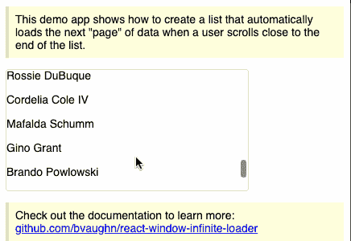

# React 性能优化:窗口与组件回收

> 原文：<https://blog.logrocket.com/react-performance-optimization-windowing-vs-component-recycling/>

在今天的世界里，健壮、敏捷的应用程序不再是奢侈品，而是保持竞争力的最低要求。

60 FPS 是愉悦用户体验的最低要求。在短短几秒钟内，用户可能会对一个缓慢的应用程序失去兴趣，关闭标签，并且永远不会返回。因此，在扩展应用程序时，继续投资于应用程序的性能是至关重要的。

在这篇文章中，我们将特别关注使用两种技术优化大型数据列表的性能:窗口和组件回收。

## 为什么要优化你的列表？

几乎所有的应用程序都有某种列表，它们通常也包含大量数据。因此，无论列表显示多少数据，您都必须确保用户界面不会滞后或崩溃。

最重要的是，显示纯文本列表已经不够了。现代应用程序包括具有交互式元素的列表，如按钮和悬停效果，渲染成本很高，即使显示中等大小的数据，性能也会迅速下降。

那么，我们如何在显示大列表的同时保持我们想要的性能和所有我们想要的特性呢？

在 React 中，我们有两个著名的解决方案:窗口和回收。

这两种技术都旨在使你的列表更轻便、更快速地呈现，但是它们的方法不同。因此，我们将更详细地讨论窗口和组件回收以及它们之间的权衡。

## 什么是窗口？

到目前为止，我们已经确定显示大量的元素会很快降低应用程序的速度。但是如果我们不一定需要渲染所有的元素呢？这是窗口背后的主要思想。

窗口是一种技术，它确保我们的列表只呈现在视口中可见的项目。

当用户滚动时，我们根据滚动条的位置计算应该显示哪些元素，然后在这些元素进入和退出视区时添加和删除它们。

呈现 DOM 元素是 web 应用程序执行的最昂贵的操作之一，通过窗口，我们可以确保只在需要的时候呈现它们。

在 React 中，我们有两个流行的实现窗口的库: [react-window](https://github.com/bvaughn/react-window) 和 [react-virtualized](https://github.com/bvaughn/react-virtualized) 。这两个库都是由同一个作者 [bvaughn](https://github.com/bvaughn) 创建和维护的。

在这两者中，react-window 是更新、更简单、更轻量级的选择，也是我们将在本教程中使用的。react-virtualized 更大，功能更丰富，如果您遇到 react-window 的硬限制，值得考虑。

react-window 是实现窗口的一个很好的选择，它经常与[react-virtualized-auto-sizer](https://www.npmjs.com/package/react-virtualized-auto-sizer)和[react-window-infinite-loader](https://www.npmjs.com/package/react-window-infinite-loader)库一起构建现代的惰性加载列表，填充父组件的高度。

## 实现窗口

现在让我们看看如何用 react-window 实现一个简单的列表。

*注意，react-window 支持固定大小和可变大小的列表。这两种类型都要求您在呈现项目之前指定项目高度。主要区别在于，对于固定大小的列表，所有的行都具有相同的高度，而对于可变大小的列表，您可以自由地为每个项目设置不同的高度。*

好了，现在让我们看看可变高度列表的实现是什么样子的:

```
import React from "react";
import { VariableSizeList } from "react-window";
import AutoSizer from "react-virtualized-auto-sizer";
const Row = ({ index, style }) => <div style={style}>Row: {index}</div>;
export const ReactWindowList = () => (
  <AutoSizer>
    {({ height, width }) => (
      <VariableSizeList
        className="List"
        height={height}
        itemCount={1000}
        itemSize={() => 35}
        width={width}
      >
        {Row}
      </VariableSizeList>
    )}
  </AutoSizer>
);
```

在本例中，您可以看到我们是如何将 react-window 与 react-virtualized-auto-sizer 配对的。该库提供了`AutoSizer`组件，它计算其父组件的高度和宽度，我们在列表中使用这些值。

我们这样做是为了确保列表占据其父级的 100%的高度。由于 react-window 本身不提供自动调整功能，您需要将它与 react-virtualized-auto-sizer 结合使用。幸运的是，这两个库是由同一个作者创建的，所以它们被特别设计成可以很好地协同工作。

如果您使用浏览器工具检查列表中的行元素，您会注意到它们会在用户滚动时被销毁和重新创建。这是窗口技术的结果。

进一步提高列表性能的下一个合乎逻辑的步骤是实现延迟加载。使用延迟加载，不是预先获取所有数据，而是在用户滚动列表时动态获取下一组项目。这是分页的一种形式。正如你可能已经猜到的，还有另一个包可以让你做到这一点:[react-window-infinite-loader。](https://npmjs.com/package/react-window-infinite-loader)

使用 react-window 和 react-window-infinite-loader，创建一个无限的惰性加载列表并在滚动时获取数据是相当容易的:



这里是上面显示的 [codesandbox 项目](https://codesandbox.io/s/x70ly749rq)的链接。

但是 react-window 让您实现的不仅仅是简单的列表。该库支持实现高性能网格，使用窗口技术动态创建行和列:

```
import React, { forwardRef } from "react";
import { FixedSizeGrid as Grid } from "react-window";
const COLUMN_WIDTH = 100;
const ROW_HEIGHT = 35;
const Cell = ({ columnIndex, rowIndex, style }) => (
  <div
    className={"GridItem"}
    style={{
      ...style,
    }}
  >
    r{rowIndex}, c{columnIndex}
  </div>
);
export const ReactWindowGrid = () => (
  <Grid
    className="Grid"
    columnCount={50}
    columnWidth={COLUMN_WIDTH}
    height={150}
    innerElementType={innerElementType}
    rowCount={100}
    rowHeight={ROW_HEIGHT}
    width={300}
  >
    {Cell}
  </Grid>
);
const innerElementType = forwardRef(({ style, ...rest }, ref) => (
  <div
    ref={ref}
    style={{
      ...style,
    }}
    {...rest}
  />
));
```

注意，在这个例子中，由于我们使用了固定的网格，我们必须为宽度和高度指定一个常量值。但是该库还提供了可变网格变体，允许您动态地指定这些值。

希望这个例子展示了使用 react-window 向列表添加窗口是多么容易。

我们真的不需要进行太多配置，并且使用 react-window 和 react-virtualized-auto-sizer 库获得了一个几乎现成的解决方案。

## 什么是组件回收？

现在我们来谈谈部件回收。

组件回收是另一种提高大型列表性能的有效技术。回收背后的想法类似于窗口，因为我们试图减少列表产生的 DOM 元素的数量。然而，我们如何去实现它是不同的。

回收的工作原理是将现有 DOM 元素的键重新分配给即将呈现的新元素。因此，React 不会触发卸载和装载事件，而是使用`componentDidUpdate`用新数据简单地更新现有行项目的属性。

与窗口相比，回收更高效，因为您不需要每次都删除和重新创建 DOM 元素。

但是代价是它会对组件的渲染周期产生意想不到的副作用。

有多个库可以帮助你正确地实现列表的组件回收，其中 [recyclerlistview](https://github.com/Flipkart/recyclerlistview) 和 [flash-list](https://shopify.github.io/flash-list/) 只是几个例子。

## 实施回收

现在让我们看看使用`recyclerlistview`的组件回收实现是什么样子的:

```
import React, { Component } from "react";
import { View, StyleSheet } from "react-native";
import {
  RecyclerListView,
  DataProvider,
  LayoutProvider,
} from "recyclerlistview";
import { LayoutUtil } from "./utils/LayoutUtil";

const getItems = () => {
  const array = [];
  for (let index = 0; index < 1000; index++) {
    array.push(`Row item ${index}`);
  }
  return array;
};

const layoutProvider = new LayoutProvider(
  () => {
    return "VSEL"; //Since we have just one view type
  },
  (type, dim, index) => {
    const columnWidth = LayoutUtil.getWindowWidth() / 3;
    dim.width = 3 * columnWidth;
    dim.height = 300;
  }
);

export default class App extends Component {
  constructor(props) {
    super(props);
    this.state = {
      dataProvider: new DataProvider((r1, r2) => {
        return r1 !== r2;
      }),
      layoutProvider,
      images: [],
      count: 0,
      viewType: 0,
    };
    this.inProgressNetworkReq = false;
  }

  componentWillMount() {
    this.setData();
  }

  async setData() {
    this.setState({
      dataProvider: this.state.dataProvider.cloneWithRows(getItems()),
    });
  }

  rowRenderer = (type, data) => {
    console.log({ data });
    return (
      <div style={{ background: "gray", height: 280 }}>
        Row Item {data.text}
      </div>
    );
  };

  render() {
    return (
      <View style={styles.container}>
        <RecyclerListView
          style={{ flex: 1 }}
          contentContainerStyle={{ margin: 3 }}
          onEndReached={this.handleListEnd}
          dataProvider={this.state.dataProvider}
          layoutProvider={this.state.layoutProvider}
          renderAheadOffset={0}
          rowRenderer={this.rowRenderer}
        />
      </View>
    );
  }
}

const styles = StyleSheet.create({
  container: {
    flex: 1,
    alignItems: "stretch",
    justifyContent: "space-between",
  },
});
```

很快，您就可以看出`recyclerlistview`的实现有点复杂。

这段代码中似乎发生了很多事情，但是最重要的部分是`DataProvider`、`LayoutProvider`和`rowRenderer`。

顾名思义，`rowRender`函数定义如何呈现行项目，`DataProvider`负责为列表提供数据，`LayoutProvider`为每个项目的显示提供样式属性，比如高度和宽度。

`recyclerlistview`还允许通过订阅`onEndReached`事件和指定一个定制的页脚组件来实现延迟加载，以便在获取更多数据时显示加载器。

像 react-window 一样，`recyclerlistview`也允许创建复杂的网格，并允许您为每个单元格定制 UI。

要查找属性和定制的完整列表，请从他们的文档中参考[此表。](https://github.com/Flipkart/recyclerlistview)

## 哪种技术是更好的选择？

既然组件回收更高效，这是否意味着我们应该总是选择它而不是窗口？不一定。虽然组件回收比窗口更高效，但它可能并不总是最佳选择。

根据我的经验，窗口对于可变高度的行更有效，因为当用户滚动时，它会动态地重新创建 DOM 元素。最重要的是，窗口通常更容易实现，并提供了与回收相当的性能结果，对大多数应用程序来说应该足够了。

此外，正如我之前提到的，由于方法的性质，回收可能会对组件的生命周期方法产生意想不到的副作用。

## 结论

在选择最佳性能优化技术时，请记住收益递减法则。

如果您不确定选择哪一种，首先尝试一种简单的技术，然后如果您需要进一步的性能调优，就继续使用一种更复杂的技术。因此，按照这个建议，我建议首先尝试窗口，如果这还不够，尝试组件回收。

## [LogRocket](https://lp.logrocket.com/blg/react-signup-general) :全面了解您的生产 React 应用

调试 React 应用程序可能很困难，尤其是当用户遇到难以重现的问题时。如果您对监视和跟踪 Redux 状态、自动显示 JavaScript 错误以及跟踪缓慢的网络请求和组件加载时间感兴趣，

[try LogRocket](https://lp.logrocket.com/blg/react-signup-general)

.

[ ](https://lp.logrocket.com/blg/react-signup-general) [](https://lp.logrocket.com/blg/react-signup-general) 

LogRocket 结合了会话回放、产品分析和错误跟踪，使软件团队能够创建理想的 web 和移动产品体验。这对你来说意味着什么？

LogRocket 不是猜测错误发生的原因，也不是要求用户提供截图和日志转储，而是让您回放问题，就像它们发生在您自己的浏览器中一样，以快速了解哪里出错了。

不再有嘈杂的警报。智能错误跟踪允许您对问题进行分类，然后从中学习。获得有影响的用户问题的通知，而不是误报。警报越少，有用的信号越多。

LogRocket Redux 中间件包为您的用户会话增加了一层额外的可见性。LogRocket 记录 Redux 存储中的所有操作和状态。

现代化您调试 React 应用的方式— [开始免费监控](https://lp.logrocket.com/blg/react-signup-general)。