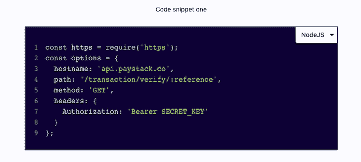

# 行动中的反冲:构建可重用的代码块组件

> 原文：<https://blog.logrocket.com/react-recoil-reusable-code-block-component/>

在本教程中，您将学习如何为您的博客或开发人员文档项目构建支持多语言的代码片段块。我们将设计代码块的样式，使其看起来类似于 VS 代码接口。我们还将使用 React 反冲通过记住用户的语言偏好来提高 UX。

## 设置

首先，请注意，本教程假设您对 React 有基本的了解。接下来，您需要确认您已经安装了 Node 任何版本≥8 都可以。最后，如果你想继续，这里有一个到启动回购的[链接。](https://github.com/Odusanya/code-snippet/tree/feature/starter)

您克隆的项目应该有一个类似如下的文件夹结构:

```
|----- src
  |----- components
    |----- Codeblock
      |----- Codeblock.jsx
      |----- Codeblock.scss
    |----- CodeGroup
      |----- CodeGroup.jsx
      |----- CodeGroup.scss
  |----- views
    |----- Home.jsx
    |----- About.jsx
  |----- utils
  |----- store
      |----- index.js
  |----- index.js
  |----- App.js
  |----- App.scss
```

启动器 repo 从 [create-react-app](https://github.com/facebook/create-react-app) 引导，预安装了以下节点依赖关系:

*   在设计风格时，这有助于我们编写 SCSS 而不是普通的 CSS
*   `prism-react-renderer`:一个轻量级的 [Prism](https://prismjs.com/) React 包装器。这有助于我们构建带有语法亮点的定制代码块

## 使用 React 反冲构建代码片段组件



Our finished code snippet module.

我们的代码片段组件可以在整个站点中重用。一个完美的用例是定制开发人员文档或技术博客，其中您需要经常共享代码片段。

为了提高可读性，我们将逻辑分为两个部分:

*   `CodeSnippet`:显示代码并处理代码语法高亮
*   `CodeGroup`:包装`CodeSnippet`组件，同时增加多语言支持

用下面的代码编辑`CodeSnippet.jsx`文件:

```
import React from 'react';
import Highlight, { defaultProps } from 'prism-react-renderer';

// Import popular vscode nightOwl theme
import theme from 'prism-react-renderer/themes/nightOwl';
import './CodeSnippet.scss';

const supportedSyntax = {
  curl: 'bash',
  node: 'js',
  js: 'js',
  ruby: 'rb',
  php: 'php',
};

const Codeblock = ({ code, syntax, className }) => (
  <Highlight
    {...defaultProps}
    theme={theme}
    code={code.trim()}
    language={supportedSyntax[syntax]}>
    {({ style, tokens, getLineProps, getTokenProps }) => (
      <pre className={`c-pre ${className}`}>
        {/* Tokens are equivalent to each row/line of code text */}
        {tokens.map((line, index) => (
          <div
            className={'c-line'}
            key={index} {...getLineProps({ line, key: index })}>
            <span className="c-line-number">{index + 1}</span> {/* Show code line number */}
            <span className="c-line-content">
              {/* Show code snippet for that line */}
              {line.map((token, key) => (
                <span key={key} {...getTokenProps({ token, key })} />
              ))}
            </span>
          </div>
        ))}
      </pre>
    )}
  </Highlight>
);
export default Codeblock;
```

上面的代码从 prism-react-renderer 扩展了`Highlight`和`defaultProps`。`Highlight`是一个 React 组件，接受一堆道具，最重要的是:

*   `code`(字符串):要显示的文本/代码片段
*   `language` (string):这有助于 prism-react-render set 语言特定的语法高亮显示。请参见 Prism 文档，了解受支持语言的列表
*   `theme` (object):这个可选参数允许您覆盖 Prism 的默认代码主题。在我们的例子中，我们用上面第 5 行中的`nightOwl`主题覆盖它

`defaultProps`对象处理`Highlight`所需的所有其他道具；你通常不需要改变这些。参见文档中的[支持道具的完整列表](https://github.com/FormidableLabs/prism-react-renderer#basic-props)。

> **提示:**建议在你的`code`字符串上使用原生 JavaScript `.trim()`方法来删除不必要的空格。

用下面的代码编辑`CodeGroup.jsx`文件:

```
import React, { useState, useEffect, useRef } from 'react';

import CodeSnippet from '../CodeSnippet/CodeSnippet';
import './CodeGroup.scss';

const languageOptions = {
  curl: 'cURL',
  node: 'NodeJS',
  php: 'PHP',
};

const CodeGroup = ({ code }) => {
  const select = useRef();
  // Set the default language //
  const [language, setLanguage] = useState('curl');
  const handleChange = event => setLanguage(event.target.value);

  // Update the select value when langauge state changes
  useEffect(() => {
    select.current.value = language;
  }, [language]);

  return (
    <code className="c-code-group">
      <span className="c-dropdown">
        <select
          ref={select}
          name="codeSelect"
          defaultValue={language}
          onChange={handleChange}>
          {Object.keys(code).map((lang, index) => (
            <option
              key={index}
              value={lang.toLowerCase()}>{languageOptions[lang]}</option>)
          )}
        </select>
      </span>
      <>
        {Object.keys(code).map((lang, index) => (
          <CodeSnippet
            key={index}
            code={code[lang]}
            className={language === lang ? 'c-snippet c-snippet--is-active' : 'c-snippet'}
            syntax={lang} />
        ))}
      </>
    </code>
  );
};

export default CodeGroup;
```

`CodeGroup`组件包装了`CodeSnippet`组件，并为我们的定制代码块添加了多语言支持。

组件接受一个 object 类型的属性。这是我们想要显示的代码。对象`key`是语言名称，值是为该语言显示的相应字符串。

为了简单起见，我们将这些对象存储在一个`utils/{page_name}Requests.js`文件中，并在需要时导入它们。下面是一个示例代码对象。它可以在`utils/HomeRequests.js`目录中找到:

```
const curl = `
curl -v -X POST https://api.sandbox.paypal.com/v2/invoicing/generate-next-invoice-number \\
-H "Content-Type: application/json" \\
-H "Authorization: Bearer Access-Token"
`;
const node = `
const https = require('https');
const options = {
  hostname: 'api.paystack.co',
  path: '/transaction/verify/:reference',
  method: 'GET',
  headers: {
    Authorization: 'Bearer SECRET_KEY'
  }
};
`;
const php = `
$stripe = new \Stripe\StripeClient('sk_test_BQokikJOvBiI2HlWgH4olfQ2');
$customer = $stripe->customers->create([
  'description' => 'example customer',
  'email' => '[email protected]',
  'payment_method' => 'pm_card_visa',
]);
echo $customer;
`;
const code = {
  curl,
  node,
  php,
}
export default code;
```

这里有一个应用程序的工作演示。

在上面的演示中，代码片段跨多个页面工作。但是，当您导航页面时，代码语言选项会重置，这对于可用性来说可能不是很好。这就是后坐力发挥作用的地方。

## 用反冲保存语言偏好

反冲是一个轻量级的反应状态管理库——像 Redux，但更简单。反冲有一个简单的 API，由引擎盖下的反应钩提供动力。反冲让我们可以跨多个页面保存语言，甚至可以在用户返回你的网站时记住他们的首选语言。

### 反冲入门

首先，运行`yarn add Recoil`给你的项目增加后座力。在你的`src/index.js`文件中，从反冲导入`RecoilRoot`，用`RecoilRoot`包裹`App`组件:

```
import React from 'react';
import ReactDOM from 'react-dom';
import { BrowserRouter } from 'react-router-dom';
import { RecoilRoot } from 'Recoil';

import './index.css';
import App from './App';

ReactDOM.render(
  <React.StrictMode>
    <BrowserRouter>
      <RecoilRoot> // Wrap the App component with RecoilRoot
        <App />
      </RecoilRoot>
    </BrowserRouter>
  </React.StrictMode>,
  document.getElementById('root')
);
```

反应反冲的核心是基于原子和选择器模型。在反冲中，原子是组件可以订阅的状态单元，而选择器是用于同步或异步更新状态的纯函数。如果您熟悉 Redux 等其他状态管理库，原子类似于状态对象。点击阅读更多[。](https://recoiljs.org/docs/introduction/core-concepts)

用下面的代码编辑`store/index.js`文件:

```
import { atom } from 'Recoil';

export const codeLanguageState = atom({
  key: 'snippetLanguageState', // Unique state identifier
  default: 'curl', // Default state value
});
```

atom 函数接受 JavaScript 对象:

*   `key`是唯一的标识符
*   `default`顾名思义，就是默认状态

我们现在可以使用反冲的`useRecoilState`钩子读写`codeLanguageState`原子。

用以下更新编辑`CodeGroup.jsx`:

```
import React, { useEffect, useRef } from 'react';
+ import { useRecoilState } from 'Recoil';
import { codeLanguageState } from '../../store/index';

import CodeSnippet from '../CodeSnippet/CodeSnippet';
import './CodeGroup.scss';

const languageOptions = {
  curl: 'cURL',
  node: 'NodeJS',
  php: 'PHP',
};

const CodeGroup = ({ code }) => {
  const select = useRef();
  // Set default langauge using 
-  const [language, setLanguage] = useState('curl');
+  const [language, setLanguage] = useRecoilState(codeLanguageState);
  const handleChange = event => setLanguage(event.target.value);
  useEffect(() => {
    select.current.value = language;
  }, [language]);
  return (
    <code className="c-code-group">
      <span className="c-dropdown">
        <select
          ref={select}
          name="codeSelect"
          defaultValue={language}
          onChange={handleChange}>
          {Object.keys(code).map((lang, index) => (
            <option
              key={index}
              value={lang.toLowerCase()}>{languageOptions[lang]}</option>)
          )}
        </select>
      </span>
      <>
        {Object.keys(code).map((lang, index) => (
          <CodeSnippet
            key={index}
            code={code[lang]}
            className={language === lang ? 'c-snippet c-snippet--is-active' : 'c-snippet'}
            syntax={lang} />
        ))}
      </>
    </code>
  );
};
export default CodeGroup;
```

在上面的代码片段中，我们对现有的`CodeGroup.jsx`文件做了两处添加:

1.  展开后坐力`useRecoilState`(第 2 行)
2.  用`useRecoilState`钩子替换`useState`钩子，并将我们的状态——在本例中是`codeLanguageState`原子——作为参数传递(第 18 行)

反冲的`useRecoilState` API 与 React 的`useState`钩子是相同的，主要区别是我们的状态可以在组件之间共享。

万岁！我们的应用程序现在跨多个页面存储语言偏好。

如果您仍然在遵循起始文件，那么恭喜您。最后一步是转到`/views`目录中的`Home.jsx`和`Payments.jsx`文件，撤销注释，将`CodeSnippet`组件导入到主页和支付页面。

这里有一个[现场演示。](https://no-persist--code-snippet-tutorial.netlify.app/)

## 带反冲的会话持久性

从上面的演示中，您会注意到，即使当您在页面之间导航时语言仍然存在，但是当页面被刷新时，语言会重置为`curl`。使用反冲和反冲持久(第三方库)，我们可以通过三个简单的步骤将会话持久性添加到我们的应用程序中:

##### 第一步:添加`recoil-persist`

运行`yarn add recoil-persist`将反冲持续添加到我们的应用程序中。

##### 步骤 2:将`persistence_UNSTABLE`添加到原子中

在`store/index.js`文件中，用`persistence_UNSTABLE`键更新`codeLanguageState`:

```
import { atom } from 'Recoil';
export const codeLanguageState = atom({
  key: 'snippetLanguageState',
  default: 'curl',
+ persistence_UNSTABLE: {
+   type: 'snippetLanguageState' // type should be the same as the atom key
+ },
});
```

##### 第三步:设置`initializeState`道具

用以下内容更新您的`index.js`文件:

```
import React from 'react';
import ReactDOM from 'react-dom';
import { BrowserRouter } from 'react-router-dom';
import { RecoilRoot } from 'Recoil';
+ import RecoilPersist from 'recoil-persist';
import './index.css';
import App from './App';
+ const { RecoilPersist, updateState } = RecoilPersist();

ReactDOM.render(
  <React.StrictMode>
    <BrowserRouter>
-     <RecoilRoot>
+     <RecoilRoot initializeState={updateState}>
+       <RecoilPersist />
        <App />
      </RecoilRoot>
    </BrowserRouter>
  </React.StrictMode>,
  document.getElementById('root')
);
```

## 结论

现在我们的应用程序完成了。它足够智能地记住用户最后选择的语言，甚至在刷新之后。你可以在这里尝试一下。如果你想研究最终代码，这里有一个 [Github repo](https://github.com/Odusanya/code-snippet/tree/master) 的链接。

## 使用 LogRocket 消除传统反应错误报告的噪音

[LogRocket](https://lp.logrocket.com/blg/react-signup-issue-free)

是一款 React analytics 解决方案，可保护您免受数百个误报错误警报的影响，只针对少数真正重要的项目。LogRocket 告诉您 React 应用程序中实际影响用户的最具影响力的 bug 和 UX 问题。

[ ](https://lp.logrocket.com/blg/react-signup-general) [  ](https://lp.logrocket.com/blg/react-signup-general) [LogRocket](https://lp.logrocket.com/blg/react-signup-issue-free)

自动聚合客户端错误、反应错误边界、还原状态、缓慢的组件加载时间、JS 异常、前端性能指标和用户交互。然后，LogRocket 使用机器学习来通知您影响大多数用户的最具影响力的问题，并提供您修复它所需的上下文。

关注重要的 React bug—[今天就试试 LogRocket】。](https://lp.logrocket.com/blg/react-signup-issue-free)