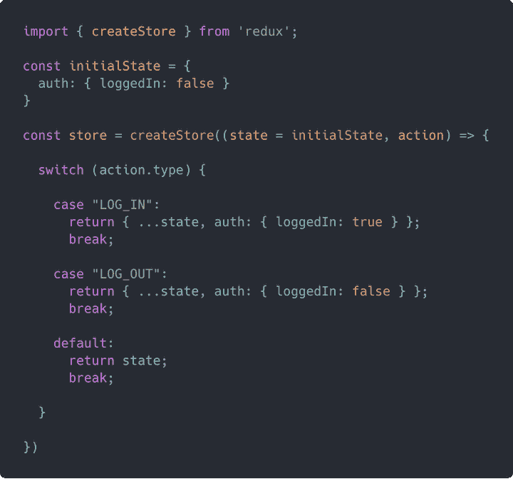

# React Redux connect():何时以及如何使用它

> 原文：<https://blog.logrocket.com/react-redux-connect-when-how-use/>

***编者按:*** *本文最后一次更新是在 2022 年 6 月 16 日，包括了 React 功能组件中`useDispatch`和`useSelector`钩子的使用。*

React 提供了两种向组件提供数据的主要机制，props 和 state。Props 是只读的，允许父组件将属性传递给子组件。状态是局部的，封装在组件中。它可以在组件生命周期的任何时候发生变化。

由于状态是构建动态 React 应用程序的一种非常强大的机制，因此正确的状态管理至关重要。已经有几个库为管理应用程序状态提供了结构良好的架构，比如 Flux、Redux 和 MobX 等等。

在本指南中，我们将向您展示如何使用 [React Redux](https://github.com/reduxjs/react-redux) 使用 Redux 管理 React 应用程序中的状态。我们假设您已经对 React 和 Redux 架构和 API 有了基本的了解。我们开始吧！

## Redux 是什么？

Redux 是 JavaScript 应用程序的可预测状态容器，范围从普通应用程序到框架应用程序。Redux 占用空间非常小，但它仍然允许您编写可以在任何环境中运行的一致的应用程序:



如果您是 Redux 社区的新手，并且对围绕 Redux 的许多设计模式和评论感到不知所措，您应该尝试一下 [Redux Toolkit](https://blog.logrocket.com/smarter-redux-with-redux-toolkit/) ，这是一个官方的、固执己见的、包含电池的工具集，用于高效的 Redux 开发。

Redux Toolkit 消除了许多对 Redux 的批评，有助于弥合围绕 Redux 最佳实践和模式的知识差距。

## Redux `connect()`是什么？

React Redux 包为 Redux 状态容器提供了 React 绑定，使得将 React 应用连接到 Redux 存储非常容易。这允许您根据 React 应用程序组件与 Redux 存储的连接，将它们分为表示组件和容器组件。

表示组件只关心事物的外观。他们不知道 Redux 状态。表示组件从 props 获取数据，并可能触发通过 props 传递给它们的回调。另一方面，容器组件负责事情如何工作，并且完全知道 Redux 状态。它们通常是使用 React Redux 创建的，可能会调度 Redux 操作。它们还订阅 Redux 状态的更改。

值得注意的是，2019 年，Redux 作者丹·阿布拉莫夫(Dan Abramov)在修订他 2015 年关于表示和容器组件的博文时反对这种方法。从 7.1 版本开始，Redux 支持 React 钩子，这意味着您可以在功能组件中使用 Redux 和钩子，而不是使用 Redux `connect()`。

也就是说，理解将业务逻辑从表示组件中分离出来的核心概念是有用的，因为这可以简化许多复杂问题的解决。在本指南中，我们将关注使用 React Redux 连接到 Redux 状态的容器组件。

## 如何将应用程序连接到 Redux 商店

React Redux 包公开了一个非常简单的接口。你只需要关心两个部分。首先，`<Provider store>`包装了 React 应用程序，并使 Redux 状态对应用程序层次结构中的所有容器组件可用。另一方面，`connect([mapStateToProps], [mapDispatchToProps], [mergeProps],[options])`创建了一个更高阶的组件，用于从基础反应组件中生成容器组件。

您可以在项目中安装 React Redux，如下所示:

```
npm install react-redux --save

```

假设您已经为 React 应用程序设置了一个 Redux store，您可以使用以下代码将应用程序连接到 Redux store:

```
import React from 'react';
import ReactDOM from 'react-dom';
import { Provider } from 'react-redux';
import createStore from './createReduxStore';

const store = createStore();
const rootElement = document.getElementById('root');

ReactDOM.render((
 <Provider store={store}>
  <AppRootComponent />
 </Provider>
), rootElement);

```

有了这个设置，您现在可以使用`connect()` API 在`AppRootComponent`的层次结构中创建连接到 Redux 存储的容器组件。

## Redux 中何时使用`connect()`

让我们来看看一些适合使用`connect()`的常见场景。

### 创建容器组件

React Redux `connect()` API 用于创建连接到 Redux 存储的容器元素。Redux 存储是使用 [React 上下文](https://reactjs.org/docs/context.html)从组件的最顶层祖先派生的。如果您只是创建一个表示性的组件，那么您不需要`connect()`。

无论您是想从 Redux store 获取数据、在 Redux store 上调度操作，还是想在 React 组件中两者都做，您都可以通过将组件包装在由`connect()`返回的更高级组件中，使其成为容器组件:

```
import React from 'react';
import { connect } from 'react-redux';
import Profile from './components/Profile';

function ProfileContainer(props) {
  return (
    props.loggedIn
      ? <Profile profile={props.profile} />
      : <div>Please login to view profile.</div>
  )
}

const mapStateToProps = function(state) {
  return {
    profile: state.user.profile,
    loggedIn: state.auth.loggedIn
  }
}

export default connect(mapStateToProps)(ProfileContainer);

```

### 避免手动订阅 Redux 存储

您可以自己创建一个容器组件，并使用`store.subscribe()`手动订阅 Redux 存储。然而，使用`connect()`带来了一些性能改进和优化，您可能无法在您的应用程序中实现。

在下面的代码片段中，我们尝试手动创建一个容器组件，并将其连接到 Redux 存储。与前面的代码片段一样，我们订阅了商店以实现类似的功能:

```
import React, { Component } from 'react';
import store from './reduxStore';
import Profile from './components/Profile';

class ProfileContainer extends Component {

  state = this.getCurrentStateFromStore()

  getCurrentStateFromStore() {
    return {
      profile: store.getState().user.profile,
      loggedIn: store.getState().auth.loggedIn
    }
  }

  updateStateFromStore = () => {
    const currentState = this.getCurrentStateFromStore();

    if (this.state !== currentState) {
      this.setState(currentState);
    }
  }

  componentDidMount() {
    this.unsubscribeStore = store.subscribe(this.updateStateFromStore);
  }

  componentWillUnmount() {
    this.unsubscribeStore();
  }

  render() {
    const { loggedIn, profile } = this.state;

    return (
      loggedIn
        ? <Profile profile={profile} />
        : <div>Please login to view profile.</div>
    )
  }

}

export default ProfileContainer;

```

`connect()`还提供了额外的灵活性，允许您配置容器组件来接收基于最初传递给它们的属性的动态属性。这对于基于道具选择 Redux 状态的一部分或者将动作创建者绑定到道具中的特定变量非常有用。

最佳实践是[每个应用](https://blog.logrocket.com/8-definitive-rules-building-apps-redux/)只使用一个 Redux store，但是如果您的项目需要多个 Redux store，`connect()`允许您轻松指定容器组件应该连接到哪个 store。

## React Redux 与 React Context

很多开发者觉得 [React Context 是 Redux](https://blog.logrocket.com/use-hooks-and-context-not-react-and-redux/) 的替代品。在我看来，事实并非如此。上下文不是为全局状态管理设计的；更确切地说，上下文是为了避免对组件树的钻取。

对于大中型应用程序，全局状态管理是可维护性和可伸缩性的关键。事实上，Connect 和 Redux 通常使用 React 上下文向连接的组件提供数据。它增加了几层额外的不变性和记忆性，使应用程序更具性能。

## Redux `connect()`是如何工作的？

React Redux 提供的`connect()`函数最多可以接受四个参数，所有参数都是可选的。调用`connect()`函数返回一个高阶组件，可以用来包装任何 React 组件。

由于更高阶的组件是由`connect()`返回的，所以必须使用基本的 React 组件再次调用它，以将其转换为容器组件:

```
const ContainerComponent = connect()(BaseComponent);
// Here is the signature of the connect() function:
connect([mapStateToProps], [mapDispatchToProps], [mergeProps], [options])

```

### 在 React Redux 中使用`mapStateToProps`

下面的参数是一个返回普通对象或另一个函数的函数:

```
mapStateToProps(state, [ownProps]) => stateProps

```

传递该参数会使容器组件订阅 Redux 存储更新，这意味着每次存储更新时都会调用`mapStateToProps`函数。如果您对存储更新不感兴趣，可以将其保留为未定义或 null。

`mapStateToProps`是用两个参数声明的。第一个参数是 Redux 存储的当前状态。第二个参数是可选的，是传递给组件的 props 对象:

```
const mapStateToProps = function(state) {
  return {
    profile: state.user.profile,
    loggedIn: state.auth.loggedIn
  }
}

export default connect(mapStateToProps)(ProfileComponent);

```

如果从`mapStateToProps`返回一个普通对象，则返回的`stateProps`对象被合并到组件的道具中。您可以在组件中访问这些属性，如下所示:

```
function ProfileComponent(props) {
  return (
    props.loggedIn
      ? <Profile profile={props.profile} />
      : <div>Please login to view profile.</div>
  )
}

```

但是，如果返回一个函数，该函数将被用作组件的每个实例的`mapStateToProps`。这对于提高渲染性能和记忆非常有用。

为了让你的应用更有性能，Redux 建议使用[重新选择](https://github.com/reduxjs/reselect)，这可以帮助你[从全球商店中只选择所需的数据块](https://blog.logrocket.com/options-caching-react/)。选择器可以计算派生数据，以保持您的存储最小化，还可以为选择添加记忆，以获得更好的应用程序性能。

下面的参数可以是返回普通对象或其他函数的对象或函数:

```
mapDispatchToProps(dispatch, [ownProps]) => dispatchProps

```

为了更好地说明`mapDispatchToProps`是如何工作的，你需要一些动作创建器。例如，假设您有以下动作创建者。您可以在组件中使用 dispatch prop，如下所示:

```
export const writeComment = (comment) => ({
  comment,
  type: 'WRITE_COMMENT'
});

export const updateComment = (id, comment) => ({
  id,
  comment,
  type: 'UPDATE_COMMENT'
});

export const deleteComment = (id) => ({
  id,
  type: 'DELETE_COMMENT'
});

```

### 默认实现

如果您没有提供自己的`mapDispatchToProps`对象或函数，将使用默认实现，它只是将商店的 dispatch 方法作为道具注入到组件中:

```
import React from 'react';
import { connect } from 'react-redux';
import { updateComment, deleteComment } from './actions';

function Comment(props) {
  const { id, content } = props.comment;

  // Invoking the actions via props.dispatch()
  const editComment = () => props.dispatch(updateComment(id, content));
  const removeComment = () => props.dispatch(deleteComment(id));

  return (
    <div>
      <p>{ content }</p>
      <button type="button" onClick={editComment}>Edit Comment</button>
      <button type="button" onClick={removeComment}>Remove Comment</button>
    </div>
  )
}

export default connect()(Comment);

```

### 传递对象

如果为此参数传递了一个对象，则该对象中的每个函数都将被视为 Redux 操作的创建者，并被包装到对 store 的 dispatch 方法的调用中。所以可以直接调用。由此产生的`dispatchProps`动作创建者的对象将被合并到组件的道具中。

以下代码片段显示了如何通过提供动作创建者的对象来定义`mapDispatchToProps`,以及如何将动作创建者用作 React 组件的道具:

```
import React from 'react';
import { connect } from 'react-redux';
import { updateComment, deleteComment } from './actions';

function Comment(props) {
  const { id, content } = props.comment;

  // Invoking the actions directly as component props
  const editComment = () => props.updatePostComment(id, content);
  const removeComment = () => props.deletePostComment(id);

  return (
    <div>
      <p>{ content }</p>
      <button type="button" onClick={editComment}>Edit Comment</button>
      <button type="button" onClick={removeComment}>Remove Comment</button>
    </div>
  )
}

// Object of action creators
const mapDispatchToProps = {
  updatePostComment: updateComment,
  deletePostComment: deleteComment
}

export default connect(null, mapDispatchToProps)(Comment);

```

### 传递函数

如果传递了一个函数，那么您需要返回一个对象`dispatchProps`,该对象使用 store 的 dispatch 方法绑定动作创建者。该函数将商店的发货作为其第一个参数。像使用`mapStateToProps`一样，它也可以将可选的`ownProps`作为第二个参数，该参数映射到传递给组件的原始属性。

如果这个函数返回另一个函数，那么返回的函数将被用作`mapDispatchToProps`,这对提高渲染性能和记忆很有用。

Redux 提供的`bindActionCreators()`助手可以在这个函数中使用，将动作创建者绑定到商店的 dispatch 方法。

* * *

### 更多来自 LogRocket 的精彩文章:

* * *

下面的代码片段展示了如何通过提供一个函数来定义`mapDispatchToProps`，以及如何使用`bindActionCreators()`助手将评论动作创建者绑定到 React 组件的`props.actions`:

```
import React from 'react';
import { connect } from 'react-redux';
import { bindActionCreators } from 'redux';
import * as commentActions from './actions';

function Comment(props) {
  const { id, content } = props.comment;
  const { updateComment, deleteComment } = props.actions;

  // Invoking the actions from props.actions
  const editComment = () => updateComment(id, content);
  const removeComment = () => deleteComment(id);

  return (
    <div>
      <p>{ content }</p>
      <button type="button" onClick={editComment}>Edit Comment</button>
      <button type="button" onClick={removeComment}>Remove Comment</button>
    </div>
  )
}

const mapDispatchToProps = (dispatch) => {
  return {
    actions: bindActionCreators(commentActions, dispatch)
  }
}

export default connect(null, mapDispatchToProps)(Comment);

mergeProps(stateProps, dispatchProps, ownProps) => props

```

如果该参数被传递，它将是一个带有三个参数的函数:

*   `stateProps`:调用`mapStateToProps()`返回的道具对象
*   `dispatchProps`:来自`mapDispatchToProps()`的动作创作者道具对象
*   `ownProps`:组件收到的原始道具

该函数返回一个普通的 props 对象，该对象将被传递给包装的组件。这对于根据道具有条件地映射 Redux 存储的部分状态或动作创建者非常有用。

当未提供此函数时，默认实现如下:

```
const mergeProps = (stateProps, dispatchProps, ownProps) => {
  return Object.assign({}, ownProps, stateProps, dispatchProps)
}

```

### `options`

如果指定的话，`options`对象包含修改`connect()`行为的选项。`connect()`是`connectAdvanced()`的一个特殊实现，它接受了`connectAdvanced()`可用的大部分选项以及一些附加选项。

你可以参考 [`options`对象文档](https://react-redux.js.org/api/connect#options-object)来查看`connect()`可用的所有选项，并了解它们如何修改它的行为。深入研究这个 API 将有助于您理解 Redux 是如何工作的，以及使用它比使用其他状态管理模式有什么好处。

让我们探索一下`options`对象的 API。它使用了`context? object`和一个`pure`布尔。它还允许您将全局存储旁边的自定义上下文传递给容器。

`pure` boolean 允许 Redux 了解容器是否是纯的，这意味着除了它的道具和状态之外，它不依赖于任何东西。默认情况下，这是正确的，但是我们可以利用以下 API 来覆盖默认检查:

```
areStatesEqual?: (next: Object, prev: Object) => boolean; 
areOwnPropsEqual?: (next: Object, prev: Object) => boolean; 
areStatePropsEqual?: (next: Object, prev: Object) => boolean; 
areMergedPropsEqual?: (next: Object, prev: Object) => boolean;

```

默认情况下，所有这些方法都使用浅层比较来确定更改。我们可以为性能密集型容器覆盖它，但是这样做要小心，因为它可能会在任何时候破坏容器。

最后，`options`对象 API 使用了`forwardRef: boolean`，这在您想要从外部访问容器的实例方法时非常有用。

## 如何使用`connect()`

在使用`connect()`将一个常规的 React 组件转换成容器组件之前，您必须指定该组件将连接到的 Redux 存储。

假设您有一个名为`NewComment`的容器组件，用于向帖子添加新评论，并显示一个提交评论的按钮。该组件可能类似于下面的代码片段:

```
import React from 'react';
import { connect } from 'react-redux';

class NewComment extends React.Component {

  input = null

  writeComment = evt => {
    evt.preventDefault();
    const comment = this.input.value;

    comment && this.props.dispatch({ type: 'WRITE_COMMENT', comment });
  }

  render() {
    const { id, content } = this.props.comment;

    return (
      <div>
        <input type="text" ref={e => this.input = e} placeholder="Write a comment" />
        <button type="button" onClick={this.writeComment}>Submit Comment</button>
      </div>
    )
  }

}

export default connect()(NewComment);

```

为了在应用程序中实际使用该组件，您必须指定该组件将连接到哪个 Redux 存储。否则，您将得到一个错误。这可以通过两种方式之一来实现。

### 在容器组件上设置存储属性

首先，您可以通过将对 Redux store 的引用作为组件的`store`属性的值来指定组件上的 Redux store:

```
import React from 'react';
import store from './reduxStore';
import NewComment from './components/NewComment';

function CommentsApp(props) {
  return <NewComment store={store} />
}

```

### 在一个`<Provider>`组件上设置商店道具

如果您希望只为您的应用程序设置一次 Redux store，那么在一个`<Provider>`组件上设置 store prop 是一个不错的选择。对于只使用一个 Redux 商店的应用程序来说，通常就是这种情况。

React Redux 提供了一个`<Provider>`组件，可以用来包装根应用程序组件。它接受一个`store`属性，该属性需要一个对您希望应用程序使用的 Redux 存储的引用。使用 React 的上下文机制，将`store`传递给应用层次结构中的容器组件:

```
import React from 'react';
import ReactDOM from 'react-dom';
import store from './reduxStore';
import { Provider } from 'react-redux';
import NewComment from './components/NewComment';

function CommentsApp(props) {
  return <NewComment />
}

ReactDOM.render((
  <Provider store={store}>
    <CommentsApp />
  </Provider>
), document.getElementById('root'))

```

## 访问`ownProps`

如前所述，传递给`connect()`的`mapStateToProps`和`mapDispatchToProps`函数可以用组件的`ownProps`作为第二个参数来声明。

然而，有一个警告。如果声明的函数的强制参数的数量少于两个，那么`ownProps`将永远不会被传递。但是，如果函数声明时没有强制参数或者至少有两个参数，那么`ownProps`就通过了。让我们回顾几个潜在的场景。

### 声明时没有参数

```
const mapStateToProps = function() {
      console.log(arguments[0]); // state
      console.log(arguments[1]); // ownProps
    };
```

在上面的示例中，`ownProps`被传递，因为该函数是在没有强制参数的情况下声明的。因此，下面的代码也将以类似的方式工作，使用 [ES6 rest 参数语法](https://developer.mozilla.org/en-US/docs/Web/JavaScript/Reference/Functions/rest_parameters):

```
const mapStateToProps = function(...args) {
  console.log(args[0]); // state
  console.log(args[1]); // ownProps
};

```

### 用一个参数声明

在下面的代码中，只有一个参数`state`。所以，`arguments[1]`是`undefined`因为`ownProps`没有通过:

```
const mapStateToProps = function(state) {
      console.log(state); // state
      console.log(arguments[1]); // undefined
    };
```

### 用一个默认参数声明

在下面的代码中，只有一个强制参数`state`。第二个`ownProps`参数是可选的，因为已经为它指定了一个默认值。由于只有一个强制参数，`ownProps`没有被传递，因此，它映射到分配给它的默认值，`{}`:

```
const mapStateToProps = function(state, ownProps = {}) {
console.log(state); // state
console.log(ownProps); // {}
};
```

### 用两个参数声明

```
const mapStateToProps = function(state, ownProps) {
      console.log(state); // state
      console.log(ownProps); // ownProps
    };
```

上面的代码非常简单。`ownProps`被传递，因为该函数是用两个强制参数声明的。

## 功能组件中的反应冗余

React Redux 包引入了`useSelector`和`useDispatch`挂钩，我们可以使用它们轻松地挂钩到 Redux 存储并将动作分派到存储，而无需使用`connect`函数:

```
import { useSelector, useDispatch } from 'react-redux'

```

`useAppSelector`用于从存储状态中读取一个值，它还订阅状态的更新。`useDispatch`挂钩用于向减速器功能分派动作。

现在，让我们通过重写我们的`NewComment`组件来演示如何使用这两个钩子，当前看起来像下面的代码:

```
import React from 'react';
import { connect } from 'react-redux';

class NewComment extends React.Component {

  input = null

  writeComment = evt => {
    evt.preventDefault();
    const comment = this.input.value;

    comment && this.props.dispatch({ type: 'WRITE_COMMENT', comment });
  }

  render() {
    const { id, content } = this.props.comment;

    return (
      <div>
        <input type="text" ref={e => this.input = e} placeholder="Write a comment" />
        <button type="button" onClick={this.writeComment}>Submit Comment</button>
      </div>
    )
  }

}

export default connect()(NewComment);

```

让我们使用 React Redux 挂钩`useSelector`和`useDispatch`重写它:

```
import React, { useRef } from "react";
import { useSelector, useDispatch } from "react-redux";

function NewComment() {
  const input = useRef();

  const dispatch = useDispatch();
  const { id, content } = useSelector((state) => state.comment);

  const writeComment = (evt) => {
    evt.preventDefault();
    const comment = input.current.value;
    comment && dispatch({ type: "WRITE_COMMENT", comment });
  };

  return (
    <div>
      <input type="text" ref={input} placeholder="Write a comment" />
      <button type="button" onClick={writeComment}>
        Submit Comment
      </button>
    </div>
  );
}

export default NewComment;

```

在上面的代码中，我们将`NewComment`组件从类组件转换为功能组件。像`useDipatch`和`useSelector`这样的钩子只在 React 功能组件中使用。

注意我们是如何调用`useDispatch`钩子的，它返回一个`dispatch`函数。我们使用`dispatch`向商店发送动作。用回调函数调用`useSelector`钩子，回调函数将接收状态。

请注意，在回调函数中，我们只返回了`comment`状态，因为这是我们想要在这个组件中使用的。使用 React Redux 钩子，我们移除了`connect`函数。不再需要它，因为`useSelector`已经返回了存储状态的一部分并订阅了它。

每当`comment`状态改变时，`useSelector`就会得到通知，并使`NewComment`组件重新渲染以显示新的状态。

## 结论

在本指南中，我们已经介绍了何时以及如何使用 React Redux `connect()` API 来创建连接到 Redux 状态的容器组件。如上所述，如果你是 Redux 新手，强烈推荐使用 Redux Toolkit，它可以[帮助你快速入门](https://blog.logrocket.com/smarter-redux-with-redux-toolkit/)。我们还简要介绍了 React Redux `connect()` API 的一种替代方式，即`useSelector`和`useDispatch`挂钩，它们在 React 功能组件中工作。

虽然本指南涵盖了对`connect()` API 及其用法的大部分剖析，但它并没有广泛展示用例示例。你可以在[这份文件](https://react-redux.js.org/api/connect)中找到更多。