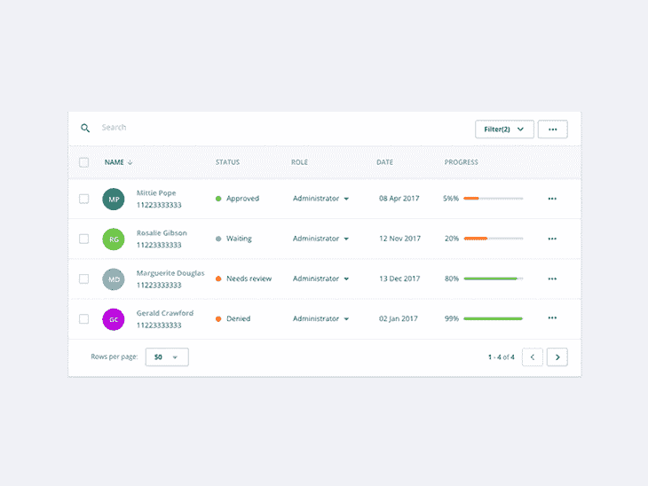

# React 参考指南:渲染道具

> 原文：<https://blog.logrocket.com/react-reference-guide-render-props/>

渲染属性只是在渲染方法中调用的函数属性。为了真正理解这意味着什么，让我们首先了解为什么这样的模式存在，然后探索各种实现。

#### *向前跳转:*

* * *

React 使得构建交互式应用程序变得更加容易管理。我们能够将我们的应用程序分解成组件，每个组件都有自己的封装逻辑和样式。这很棒——这意味着我们能够解决许多小问题，而不是一个真正的大问题。

由于抽象，这种构建应用程序的方法非常有效。应用程序中的组件只是逻辑、数据的抽象，在某些情况下，还有样式。

```
const Button = () => (...)
```

上面的`Button`组件是在页面上显示按钮所需的逻辑和样式的抽象。现在，每当我们想要一个按钮，我们只需使用这个抽象——不需要重新发明轮子。

当我们以这种方式构建应用程序时，一个新的挑战出现了:有时我们希望在组件之间共享逻辑或数据。我们还想以一种干净的、可组合的方式来做这件事。正如我们能够将逻辑和数据抽象成组件一样，我们也希望能够将这些组件组合成更大的构建块。

四个段落了，我们还没有开始渲染道具。

***简单来说，渲染道具就是在渲染方法*** 中调用的功能道具。但是要真正理解这意味着什么，我们首先需要知道为什么这样的模式存在。

* * *

## 为什么我们需要渲染道具？

让我们举一个现实世界中可能会遇到的合理问题。假设我们想要一个 UI 元素，我们可以用动画来消除它。



Delete from table by [Alex Lauderdale](https://dribbble.com/shots/4823330-Interaction-foundation-Delete-from-table).

这里我们想要的是一个可以渲染任何东西的组件，但是我们想保留这个解散动画。我们可以简单地使用`children`道具，传递我们小时候想要渲染的任何东西。

```
const Dismiss = ({ children }) => {
  return (
    <Fragment>
      {children}
    </Fragment>
  )
}
```

那会有用，但是它是有限的。

*   我们如何从正在呈现的组件中触发解散事件？如果我们决定从`Dismiss`组件中触发它，这意味着我们必须硬编码一些 HTML。
*   如果我们想设置不同的动作来触发解散事件呢？
*   有什么方法可以把数据作为道具传递给被渲染的孩子？

在这种情况下，我们需要比 children prop 方法更灵活的方法。我们真正想要的是封装解除功能，以便我们可以在组件之间共享它。

使用渲染道具，我们可以渲染任何我们想要的东西，就像儿童道具方法一样。但是我们也可以将道具传递给正在渲染的东西。

***这就是 render props 的主要用途——能够与任何被渲染的组件进行通信，而不必耦合实现细节*** 。这是可能的，因为 render 函数现在是作为一个 prop 来的，当您调用它时，可以将数据作为参数传递给它。

当我们看一看渲染道具的实际用例(基于 [WAVE 的模态组件](https://wave.free-now.com/components/Modal))时，这将变得更加清晰。我们将看一下最初使用 children prop 方法提出的问题的可能解决方案。然后，我们将看看一个更灵活的解决方案与渲染道具。


##### ***既然知道了道具的用途，那就看看 dev 们是怎么把它们用于现代可复用组件的。***

实现渲染道具

* * *

## 上面，我们有一个`Dismiss`组件，它呈现作为子道具传递的任何内容，但也包含实现解散动画的代码。下面是我们如何使用这样一个组件。请注意，对于这种实现:

```
const Dismiss = ({ children }) => {
  const dismiss = () => {
    ...code to implement dismissal animations etc
  }

  return (
    <div>
      {children}
      <button onClick={dismiss}>dismiss</button>
    </div>
  )
}

const DismissableContent = () => {
  return (
    <Dismiss>
      ...code
    </Dismiss>
  )
}
```

您只能从`Dismiss`组件中触发解散事件

*   您不能将数据传递给正在渲染的`children`
*   你必须考虑布局中额外的 div
*   您可以看到以这种方式共享功能的一些限制。现在让我们来看看同样的解决方案，但是使用了渲染道具:

除了代码更小之外，这种方法还有一些更重要的优点。

```
const Dismiss = (props) => {
  const dismiss = () => {
    ...code to implement dismissal animations etc
  }

  return props.render(dismiss)
}

const DismissableContent = () => {
  return (
    <Dismiss render={
      dismiss => <Content dismiss={dismiss} />
    } />
  )
}
```

我们已经将渲染功能的内容从硬编码在`Dismiss`组件中转移到从 props 接受它。通过简单地调用`props.render()`，组件能够渲染从渲染属性返回的任何内容。这带来了一些影响:

由于 render prop 是一个函数，我们可以将数据作为参数传递给它。这意味着`Dismiss`可以与被渲染的组件通信，反之亦然

*   您不必考虑来自`Dismiss`的任何额外 div，因为它可以是纯的，不返回它自己的 HTML(尽管大多数时候，您会返回一些附带的 HTML 和样式)
*   我们现在可以看到这是如何解决我们使用子道具方法时遇到的问题的。无论从哪个角度来看，这都更加清晰和灵活。

实现其他道具

* * *

## 渲染道具的另一个好处是道具不一定要叫`render`。只要在 render 方法中调用了 prop，您就可以随意调用它。这导致了有趣的实现，就像这样:

```
const Dismiss = ({ children }) => {
  const dismiss = () => {
    ...code to implement dismissal animations etc
  }

  return children(dismiss)
}

const DismissableContent = () => {
  return (
    <Dismiss>
      {(dismiss) => (
        <Content dismiss={dismiss} />
      )}
    </Dismiss>
  )
}
```

通过这个全面的教程，继续掌握道具的基本知识。

##### ***Move on to mastering the basics of props with this comprehensive tutorial.***

实现高阶组件(hoc)

* * *

## 你可能已经注意到了，渲染道具也允许我们用最少的努力实现 hoc。下面，您可以看到一个`withDismiss` HOC，它接收一个组件，并使用消除功能增强了一个组件。

这很容易，因为 React 中组件的组成性质。因为我们已经能够将消除逻辑封装到一个具有 render props 功能的组件中，所以用相同的功能组成新的组件变得毫不费力。

```
const withDismiss = (Component) =>
  (props) => (
    <Dismiss>
      {(dismiss) => (
        <Component dismiss={dismiss} {...props} />
      )}
    </Dismiss>
  )
```

***用一个更高级的用例更深入地研究 HOCs:获取数据。***

##### 警告

如果你使用`React.PureComponent`，在使用渲染道具模式时，有一个重要的边缘情况需要记住。快速回顾一下，`PureComponent`可以提供很小的性能增益，因为它通过一个简单的道具和状态比较在内部实现了`shouldComponentUpdate`。

* * *

## 这里需要注意的重要一点是肤浅的道具对比。大多数情况下，当你使用渲染道具时，你会传递一个匿名函数给渲染道具。

在这个例子中，每次`DismissableContent`渲染时，它为渲染属性生成一个新值，这使得`React.PureComponent`所做的浅层比较失败。

如果这种情况不发生对您很重要(例如，`Dismiss`可能包含一些密集的代码),您可以通过将 render prop 值移动到命名函数中来修复它，如下所示:

```
class Dismiss extends React.PureComponent {
  dismiss = () => {
    ...code to implement dismissal animations etc
  }

  render() {
    return this.props.render(dismiss)
  }
}

const DismissableContent = () => {
  return (
    <Dismiss render={
      dismiss => <Content dismiss={dismiss} /> // will be different every render
    } />
  )
}
```

这将确保`content`值成为`DismissableContent`组件的一个实例，并且不会在每次渲染时重新生成。


探索为什么这些警告导致开发者开始在渲染道具上使用自定义钩子。

```
class Dismiss extends React.PureComponent {
  ...same implementation as above
}

const DismissableContent = () => {
  const content = (dismiss) => <Content dismiss={dismiss} />

  return (
    <Dismiss render={content} />
  )
}
```

This will ensure that the `content` value becomes an instance of the `DismissableContent` component and is not regenerated on every render.

##### 如果你想要一个操场来练习渲染道具，你可以使用下面的 CodeSandbox 来尝试使用这个模式。

* * *

使用 LogRocket 消除传统反应错误报告的噪音

是一款 React analytics 解决方案，可保护您免受数百个误报错误警报的影响，只针对少数真正重要的项目。LogRocket 告诉您 React 应用程序中实际影响用户的最具影响力的 bug 和 UX 问题。

## 自动聚合客户端错误、反应错误边界、还原状态、缓慢的组件加载时间、JS 异常、前端性能指标和用户交互。然后，LogRocket 使用机器学习来通知您影响大多数用户的最具影响力的问题，并提供您修复它所需的上下文。

[LogRocket](https://lp.logrocket.com/blg/react-signup-issue-free)

关注重要的 React bug—[今天就试试 LogRocket】。](https://lp.logrocket.com/blg/react-signup-issue-free)

[ ](https://lp.logrocket.com/blg/react-signup-general) [  ](https://lp.logrocket.com/blg/react-signup-general) [LogRocket](https://lp.logrocket.com/blg/react-signup-issue-free)

automatically aggregates client side errors, React error boundaries, Redux state, slow component load times, JS exceptions, frontend performance metrics, and user interactions. Then LogRocket uses machine learning to notify you of the most impactful problems affecting the most users and provides the context you need to fix it.

Focus on the React bugs that matter — [try LogRocket today](https://lp.logrocket.com/blg/react-signup-issue-free).