# React Router DOM:如何在 web 应用中处理路由

> 原文：<https://blog.logrocket.com/react-router-dom-tutorial-examples/>

***编者按**:这个 React 路由器 DOM 教程最后一次更新是在 2021 年 8 月 11 日。它可能仍然包含过时的信息。*

我们已经广泛地涵盖了 React Router，包括[如何在](https://blog.logrocket.com/using-hooks-with-react-router/)和[旁边使用钩子而不是 React Router](https://blog.logrocket.com/how-react-hooks-can-replace-react-router/) ，如何使用[和 Redux](https://blog.logrocket.com/react-router-with-redux-navigation-state/) 的 React Router，以及其他[高级用例](https://blog.logrocket.com/advanced-react-router-concepts-code-splitting-animated-transitions-scroll-restoration-recursive-17096c0cf9db/)。但是，如果您刚刚开始使用 React 路由器，所有这些可能会让您难以理解。

别担心。在这篇文章中，我将带你从网络版的基础开始， [React 路由器 DOM](https://reacttraining.com/react-router/web/guides/philosophy) 。我们将介绍路由器的一般概念以及如何设置和安装 React 路由器。我们还将回顾框架的基本组件，并演示如何使用参数构建路线，如`/messages/10`。

以下是你将学到的东西:

为了演示 React 路由器 DOM 如何工作，我们将创建一个 React 应用程序示例。你可以在 [CodeSandbox](https://codesandbox.io/s/react-router-example-00rlr) 上找到互动演示。作为参考，最后一个例子的代码可以在 [GitHub](https://github.com/philipszdavido/react-router-4-example) 上找到。

## React 中的路由器是什么？

[单页应用程序(SPAs)](https://en.wikipedia.org/wiki/Single-page_application) 重写页面的各个部分，而不是从服务器上加载整个新页面。

Twitter 是这类应用程序的一个很好的例子。当你点击一个 tweet 时，只有 tweet 的信息会从服务器获取。页面没有完全重新加载:

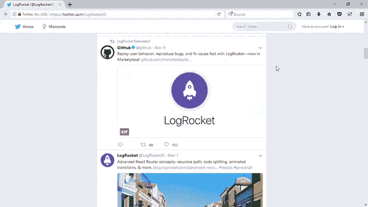

这些应用程序易于部署，并极大地改善了用户体验。然而，它们也带来了挑战。

其中之一是浏览器历史。因为应用程序包含在单个页面中，所以它本身不能依赖浏览器的前进/后退按钮。它需要别的东西。根据应用程序的状态，改变 URL 以在浏览器中推送或替换 URL 历史事件。同时，它还需要根据 URL 中包含的信息重建应用程序状态。

例如，在 Twitter 上，注意当一条推文被点击时，URL 是如何变化的:

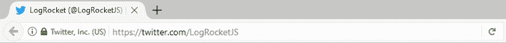

以及历史条目是如何生成的:

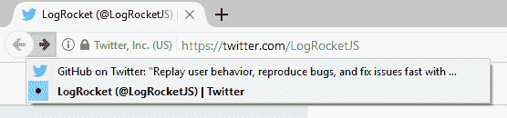

这是路由器的工作。

路由器允许您的应用程序在不同组件之间导航，更改浏览器 URL，修改浏览器历史，并保持 UI 状态同步。

## 什么是 React 路由器？

React 是一个很受欢迎的建造温泉的库。然而，由于 React 只专注于构建用户界面，它没有内置的路由解决方案。

[React 路由器](https://reactrouter.com/)是 React 最流行的路由库。它允许您以相同的声明方式定义路由:

```
<Route path="/home" component={Home} />
```

但是我们不要想太多。让我们从创建一个样例项目并设置 React Router 开始。

我将使用 [Create React App](https://github.com/facebookincubator/create-react-app) 来创建一个 React App。您可以使用以下工具安装(或更新)它:

```
npm install -g create-react-app
```

只需要安装 [Node.js](https://nodejs.org/en/download/) 版本 6 或更高版本即可。

接下来，执行以下命令:

```
create-react-app react-router-example
```

在这种情况下，将创建目录`react-router-example`。如果您`cd`进入它，您应该看到类似如下的结构:

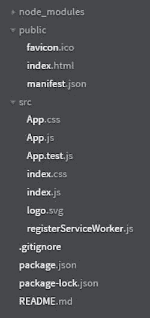

## React 路由器 DOM 是做什么的？

React 路由器包括三个主要包:

*   `react-router`，路由器的核心包
*   `react-router-dom`，包含 React 路由器的 DOM 绑定。换句话说，网站的路由器组件
*   `react-router-native`，它包含 React 路由器的 [React 本地](https://facebook.github.io/react-native/)绑定。换句话说，使用 React Native 的应用程序开发环境的路由器组件

React Router DOM 使您能够在 web 应用程序中实现动态路由。与传统的路由架构不同，在传统的路由架构中，路由是在运行的应用程序之外的配置中处理的，React Router DOM 根据应用程序和平台的需求促进了基于组件的路由。

如果您正在编写将在浏览器中运行的 React 应用程序，React Router DOM 是最合适的选择。

## React 路由器和 React 路由器 DOM 有什么区别？

React 路由器是路由器的核心包。React Router DOM 包含 DOM 绑定，默认情况下允许您访问 React Router。

也就是说，不需要同时使用 React Router 和 React Router DOM。如果您发现自己两者都在使用，那么可以去掉 React Router，因为您已经将它作为一个依赖项安装在 React Router DOM 中了。

但是，请注意，React Router DOM 仅在浏览器上可用，因此您只能将其用于 web 应用程序。

React Native 中可以使用 React 路由器 DOM 吗？

[react-router-native](https://www.npmjs.com/package/react-router-native) 包使您能够在 React Native 应用程序中使用 React Router。这个包包含 React 路由器的 React 本地绑定。

因为 React 路由器 DOM 仅适用于在 web 浏览器中运行的应用程序，所以它不适合在 React 本地应用程序中使用。您应该使用 react-router-native。

## 装置

因为我们正在创建一个 web 应用程序，所以让我们安装`react-router-dom`:

```
npm install — save react-router-dom
```

此时，您可以执行:

```
npm start
```

将会打开一个浏览器窗口`[http://localhost:3000/](http://localhost:3000/)`，您应该会看到如下内容:

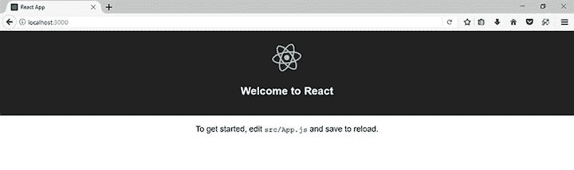

现在让我们用 React 和 React 路由器创建一个简单的 SPA。

## React 路由器 API: `<Router>`、`<Link>`和`<Route>`

React 路由器 API 基于三个组件:

*   `<Router>`:保持 UI 与 URL 同步的路由器
*   `<Link>`:渲染一个导航链接
*   `<Route>`:根据 URL 呈现一个 UI 组件

### `<Router>`

只有在一些特殊的情况下你才不得不直接使用 [`<Router>`](https://reacttraining.com/react-router/web/api/Router) (例如当使用 Redux 时)，所以你要做的第一件事就是选择一个路由器实现。

在 web 应用程序中，您有两种选择:

如果你的目标是不支持 HTML5 历史 API 的老浏览器，你应该坚持使用`<HashRouter>`，它用下面的格式创建 URL:

```
http://localhost:3000/#/route/subroute
```

否则，您可以使用`<BrowserRouter>`，它会创建以下格式的 URL:

```
http://localhost:3000/route/subroute
```

我将使用`<BrowserRouter>`，所以在`src/index.js`中，我将从`react-router-dom`导入这个组件，并用它来包装`<App>`组件:

```
import React from 'react';
// ...
import { BrowserRouter } from 'react-router-dom';

ReactDOM.render(
  <BrowserRouter>
      <App />
  </BrowserRouter>
  , document.getElementById('root')
);
// ...
```

值得一提的是，路由器组件只能有一个子元素。例如，下面的代码:

```
// ...
ReactDOM.render(
  <BrowserRouter>
      <App />
      <div>Another child!</div>
  </BrowserRouter>
  , document.getElementById('root')
);
// ...
```

抛出此错误消息:

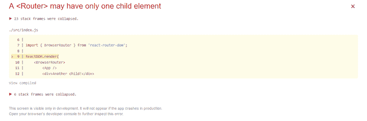

一个`<Router>`组件的主要工作是创建一个[历史](https://github.com/ReactTraining/history)对象来跟踪位置(URL)。当位置因为导航动作而改变时，子组件(在本例中是`<App>`)被重新呈现。

大多数情况下，您将使用一个`<Link>`组件来改变位置。

### `<Link>`

让我们创建一个导航菜单。打开`src/App.css`添加以下样式:

```
ul {
  list-style-type: none;
  padding: 0;
}

.menu ul {
  background-color: #222;
  margin: 0;
}

.menu li {
  font-family: sans-serif;
  font-size: 1.2em;
  line-height: 40px;
  height: 40px;
  border-bottom: 1px solid #888;
}

.menu a {
  text-decoration: none;
  color: #fff;
  display: block;
}
```

在`scr/App.js`中，替换`render()`函数中的最后一个`<p>`元素，如下所示:

```
render() {
  return (
    <div className="App">
      <header className="App-header">
        
        <h1 className="App-title">Welcome to React</h1>
      </header>
      <div className="menu">
          <ul>
            <li> <Link to="/">Home</Link> </li>
            <li> <Link to="/messages">Messages</Link> </li>
            <li> <Link to="/about">About</Link> </li>
          </ul>
      </div>
    </div>
  );
}
```

不要忘记导入文件顶部的`<Link>`组件:

```
import {
Link
} from 'react-router-dom'
```

在浏览器中，您应该会看到类似这样的内容:

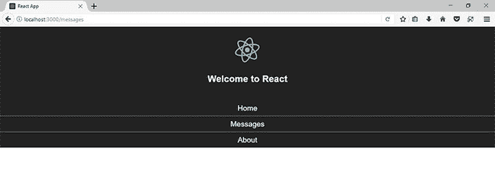

如你所见，这个 JSX 电码:

```
<ul>
<li> <Link to="/">Home</Link> </li>
<li> <Link to="/messages">Messages</Link> </li>
<li> <Link to="/about">About</Link> </li>
</ul>
```

生成以下 HTML 代码:

```
<ul>
<li> <a href="/">Home</a> </li>
<li> <a href="/messages">Messages</a> </li>
<li> <a href="/about">About</a> </li>
</ul>
```

然而，这些并不是常规的锚元素。他们在不刷新页面的情况下更改了 URL。测试一下。

现在给 JSX 代码添加一个`<a>`元素，并再次测试:

```
<ul>
<li> <Link to="/">Home</Link> </li>
<li> <Link to="/messages">Messages</Link> </li>
<li> <Link to="/about">About</Link> </li>
<li>
    <a href="/messages">Messages (with a regular anchor element)</a> 
  </li>
</ul>
```

你注意到不同了吗？

### `<Route>`

现在，当点击一个链接时，URL 会改变，但 UI 不会。让我们解决这个问题。

我将为每条路线创建三个组件。首先，`src/component/Home.js`为路线`/`:

```
import React from 'react';

const Home = () => (
  <div>
    <h2>Home</h2>
    My Home page!
  </div>
);

export default Home;
```

然后，`src/component/Messages.js`为路线`/messages`:

```
import React from 'react';

const Messages = () => (
  <div>
    <h2>Messages</h2>
    Messages
  </div>
);

export default Messages;
```

最后，`src/component/About.js`为路线`/about`:

```
import React from 'react';

const About = () => (
  <div>
    <h2>About</h2>
    This example shows how to use React Router!
  </div>
);

export default About;
```

要指定对应于每个组件的 URL，您可以按以下方式使用`[<Route>](https://reacttraining.com/react-router/web/api/Route)`:

```
<Route path="/" component={Home}/>
<Route path="/messages" component={Messages}/>
<Route path="/about" component={About}/>
```

对于其他路由器库(甚至在 React Router 的早期版本中)，您必须在一个特殊的文件中定义这些路由，或者至少在您的应用程序之外定义。

这不适用于 React 路由器 4。这些组件可以放在路由器内部的任何地方，关联的组件将在该位置呈现，就像任何其他组件一样。

注:最新稳定版本为 [React 路由器 v5.2.0](https://github.com/ReactTraining/react-router/releases/tag/v5.2.0) ，发布于 2020 年 5 月 11 日。 [React 路由器 v.6.0.0](https://github.com/ReactTraining/react-router/releases/tag/v6.0.0-beta.0) 目前处于测试阶段。更多信息，请查看 [React 路由器的版本历史](https://github.com/ReactTraining/react-router/releases)。

因此在`src/App.js`中，导入所有这些组件并在菜单后添加一个部分:

```
// …
import {
  Route,
  Link
} from 'react-router-dom'

import Home from './components/Home';
import About from './components/About';
import Messages from './components/Messages';

class App extends Component {
  render() {
    return (
      <div className="App">
        ...
        <div className="menu">
            ...
        </div>
        <div className="App-intro">
          <Route path="/" component={Home}/>
          <Route path="/messages" component={Messages}/>
          <Route path="/about" component={About}/>
        </div>
      </div>
    );
  }
}
```

在浏览器中，您应该会看到类似这样的内容:

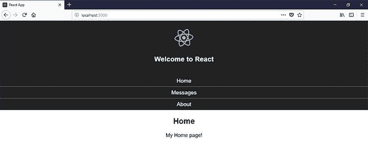

然而，看看当你走其他路线时会发生什么:

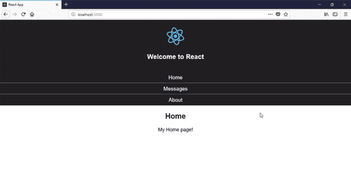

默认情况下，路由是包含性的；多个`<Route>`组件可以同时匹配 URL 路径和渲染。

路由是 React 路由器中最重要的概念。下一节我们来说说路线。

## 了解路线

`<Route>`组件的匹配逻辑被委托给 [path-to-regexp](https://github.com/pillarjs/path-to-regexp) 库。我鼓励你检查这个库的所有选项和修改器，并用[快速路线测试器](http://forbeslindesay.github.io/express-route-tester/)进行现场测试。

在前面的例子中，由于`/message`和`/about`路径也包含字符`/`，它们也被匹配和渲染。

通过这种行为，您可以通过声明不同的组件属于相同(或相似)的路径来显示它们。

解决方法不止一个。

第一种方法使用`exact`属性来呈现组件，前提是定义的路径与 URL 路径完全匹配:

```
<Route exact path="/" component={Home}/>
```

如果您测试该应用程序，您将会看到一切正常。

路线`/message`和`/about`仍在评估中，但它们现在不是`/`的精确匹配。

但是，如果我们知道只选择一条路线，我们可以使用一个`[<Switch>](https://reacttraining.com/react-router/web/api/Switch)`组件来只呈现与位置匹配的第一条路线:

```
// …
import {
  Route,
  Link,
  Switch
} from 'react-router-dom'
// …
class App extends Component {
  render() {
    return (
      …
      <div className="App-intro">
          <Switch>
            <Route exact path="/" component={Home} />
            <Route path="/messages" component={Messages} />
            <Route path="/about" component={About} />
          </Switch>
        </div>
      </div>
    );
  }
}
```

`<Switch>`将使路径匹配排他而非包含(就像你在使用`<Route>`组件一样)。

例如，即使您复制了`Messages`组件的路线:

```
<Switch>
  <Route exact path="/" component={Home} />
  <Route path="/messages" component={Messages} />
  <Route path="/messages" component={Messages} />
  <Route path="/about" component={About} />
</Switch>
```

当访问`/messages`路径时，`Messages`组件只会被渲染一次。

但是，请注意，您仍然需要为`/`路径指定确切的属性，否则，`/message`和`/about`也将匹配`/`，并且`Home`组件将总是被渲染(因为这是第一个匹配的路径):

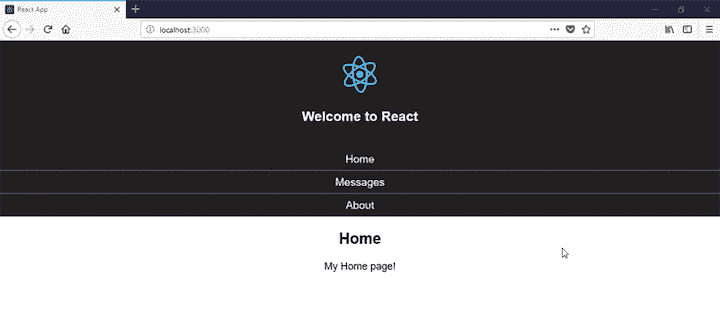

但是当输入一个不存在的路径时会发生什么呢？例如`[http://localhost:3000/non-existent](http://localhost:3000/non-existent)`:


在常规的 JavaScript `switch`语句中，您将为这种情况指定一个默认子句，对吗？

在一个`<Switch>`组件中，这个默认行为可以用一个`[<Redirect>](https://reacttraining.com/react-router/web/api/Redirect)`组件实现:

```
// …
import {
  Route,
  Link,
  Switch,
  Redirect
} from 'react-router-dom'
// …
class App extends Component {
  render() {
    return (
      …
      <div className="App-intro">
          <Switch>
            <Route exact path="/" component={Home} />
            <Route path="/messages" component={Messages} />
            <Route path="/about" component={About} />
            <Redirect to="/" />
          </Switch>
        </div>
      </div>
    );
  }
}
```

该组件将导航到覆盖历史堆栈中当前位置的新位置:

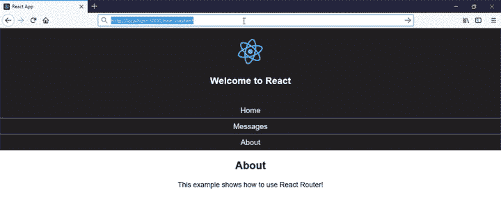

现在，让我们来看看更高级的嵌套路由。

## 嵌套路由

嵌套路由类似于`/about/react`。

假设对于消息部分，我们想要显示一个消息列表。每一个都以类似于`/messages/1`、`/messages/2`等等的链接的形式，将你带到一个详细的页面。

您可以通过修改`Messages`组件开始，以这种方式为五个示例消息生成链接:

```
import React from 'react';

import {
  Link
} from 'react-router-dom';

const Messages = () => (
  <div>
    <ul>
    {
        [...Array(5).keys()].map(n => {
            return <li key={n}>
                    <Link to={`messages/${n+1}`}>
                      Message {n+1}
                    </Link>
                  </li>;
        })
    }
    </ul>
  </div>
);

export default Messages;
```

这应该显示在浏览器中:

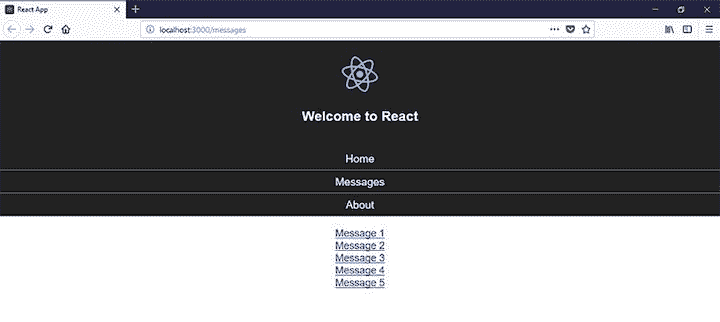

要理解如何实现这一点，您需要知道当路由器呈现一个组件时，有三个属性作为参数传递:

出于我们的目的，我们将使用`match`参数。

当路由器的路径和 URL 位置匹配时，就会创建一个包含 URL 和路径信息的`match`对象。以下是该对象的属性:

*   `params`:从参数对应的 URL 解析出的键/值对
*   `isExact` : `true`如果匹配了整个 URL(没有尾随字符)
*   `path`:用于匹配的路径模式
*   `url`:URL 的匹配部分

这样，在`Messages`组件中，我们可以析构 properties 对象来使用`match`对象:

```
const Messages = ({ match }) => (
<div>
...
</div>
)
```

用`match`对象的匹配 URL 替换`/messages`:

```
const Messages = ({ match }) => (
  <div>
    <ul>
    {
        [...Array(5).keys()].map(n => {
            return <li key={n}>
                    <Link to={`${match.url}/${n+1}`}>
                      Message {n+1}
                    </Link>
                  </li>;
        })
    }
    </ul>
  </div>
);
```

这样一来，如果路径发生变化，您也能得到保护。

在消息列表之后，声明一个带有参数的`<Route>`组件来捕获消息标识符:

```
import Message from './Message';
//…

const Messages = ({ match }) => (
  <div>
    <ul>
       ...
    </ul>
    <Route path={`${match.url}/:id`} component={Message} />
  </div>
);
```

此外，您可以通过以下方式强制使用数字 ID:

```
<Route path={`${match.url}/:id(\\d+)`} component={Message} />
```

如果有匹配，就会呈现出`Message`组件。下面是它的定义:

```
import React from 'react';

const Message = ({ match }) => (
  <h3>Message with ID {match.params.id}</h3>
);

export default Message;
```

在该组件中，显示消息的 ID。注意 ID 是如何从`match.params`对象中提取出来的，使用的名称与路径中定义的名称相同。

如果您打开浏览器，您应该会看到类似下面的内容:


但是请注意，对于 messages 部分的初始页面(`/messages`)或者如果您输入了 URL 和无效的标识符(如`/messages/a`)，列表下不会显示任何内容。留个口信会很好，你觉得呢？

您可以为这种情况添加另一个路由，但是我们可以使用`<Route>`组件的`render`属性，而不是创建另一个组件来显示消息:

```
<Route
  path={match.url}
  render={() => <h3>Please select a message</h3>
/>
```

您可以通过使用`<Route>`的以下属性之一来定义渲染的内容:

*   `[component](https://reacttraining.com/web/api/Route/component)`渲染一个组件
*   `[render](https://reacttraining.com/web/api/Route/render-func)`，返回要渲染的元素或组件的函数
*   `[children](https://reacttraining.com/web/api/Route/children-func)`，也是返回要渲染的元素或组件的函数。但是，无论路径是否匹配，都会呈现返回的元素

最后，我们可以将路线包装在一个`<Switch>`组件中，以保证两者中只有一个匹配:

```
import {
  Route,
  Link,
  Switch
} from 'react-router-dom';

const Messages = ({ match }) => (
  <div>
    <ul>
     ...
    </ul>
    <Switch>
      <Route path={`${match.url}/:id(\\d+)`} component={Message} />
      <Route
        path={match.url}
        render={() => <h3>Please select a message</h3>}
      />
    </Switch>
  </div>
);
```

然而，你必须小心。如果首先声明呈现消息的路由:

```
 <Switch>
      <Route
        path={match.url}
        render={() => <h3>Please select a message</h3>}
      />
      <Route path={`${match.url}/:id(\\d+)`} component={Message} />
</Switch>
```

组件`Message`将永远不会被渲染，因为像`/messages/1`这样的路径将匹配路径`/messages`。

如果您以此顺序声明路线，添加`exact`以避免这种行为:

```
<Switch>
    <Route
      exact
      path={match.url}
      render={() => <h3>Please select a message</h3>}
    />
    <Route path={`${match.url}/:id(\\d+)`} component={Message} />
</Switch>
```

## 如何在 React 中设置默认路由

假设我们在应用程序中遇到一条不存在的路线/路径。我们可以定制一个 404 页面，用简洁的 UI 告诉用户他们请求的页面不可用，而不是让浏览器显示错误。

它可能看起来像这样:

```
<Switch>
  <Route exact path="/" component={Home} />
  <Route path="/messages" component={Messages} />
  <Route path="/about" component={About} />
  <Route component={NotFound} />
</Switch>

```

当没有其他路线匹配所请求的路径时，`<Route component={NotFound} />`显示`NotFound`组件。它被特意设置在`Switch`的底部，所以它将是最后匹配的；放在开头会导致`NotFound`页面一直呈现。

现在，假设我们不喜欢使用一个`NotFound`页面来显示一个不存在的页面。相反，我们希望设置一个缺省页面，以便在遇到不存在的路由时加载。

回到上面的例子，我们希望我们的`Home`页面是默认页面。当用户导航到我们应用程序中不存在的路径或路线时，将显示此`Home`页面。所以显示的不是 404 页面，而是普通页面。

### 使用星号(`*`)

要在 React 路由器中设置默认页面，请将星号(`*`)传递给`Route`的`path`属性:

```
<Switch>
  <Route exact path="/" component={Home} />
  <Route path="/messages" component={Messages} />
  <Route path="/about" component={About} />
  <Route path="*" component={Home} />
</Switch>

```

这个`<Route path="*" component={Home} />`以一种特殊的方式处理不存在的路线。当遇到一条不存在的路径时，`path`属性上的星号会调用该路由。然后显示`Home`组件。

`Home`现在被设置为默认页面。如果我们导航到`localhost:3000/planets`，那么`Home`组件将显示在`localhost:3000/planets` URL 下。该路径在我们的路由配置中不存在，因此 React Router 显示我们的默认页面，即`Home`页面。

### 使用`Redirect`

我们可以使用另一种技术在 React 路由器中设置默认页面:

```
<Switch>
  <Route exact path="/" component={Home} />
  <Route path="/messages" component={Messages} />
  <Route path="/about" component={About} />
  <Redirect to="/" />
</Switch>

```

当在我们的应用程序中找到一个不存在的路径时，这个方法将 URL 重定向到`/`，并将路径`/`和`Home`设置为我们的默认页面。

因此，如果我们在浏览器中导航到`localhost:3000/planets`，React 路由器将重定向到`localhost:3000`并显示`Home`组件，因为路由`localhost:3000/planets`在我们的路由配置中不存在。

### 使用不带路径属性的`Router`

我们之前已经这样做了，但是这一次我们将取消`Notfound`页面并设置`Route`来调用我们的默认组件。

```
<Switch>
  <Route exact path="/" component={Home} />
  <Route path="/messages" component={Messages} />
  <Route path="/about" component={About} />
  <Route component={Home} />
</Switch>

```

我们希望`Home`组件成为我们的默认组件。当没有匹配的路线时，运行`<Route component={Home} />`,而显示`Home`组件。

## 结论

简而言之，路由器可以让你的应用 UI 和 URL 保持同步。

React Router 是 React 最流行的路由器库，从版本 4 开始，React Router declarative 使用与 React 相同风格的组件定义路由。

在这篇文章中，您已经学习了如何设置 React 路由器，它最重要的组件，路由如何工作，以及如何使用路径参数构建动态嵌套路由。

但是还有很多要学的。例如，有一个 [<导航链接>](https://reacttraining.com/react-router/web/api/NavLink) 组件，它是`<Link>`组件的特殊版本，添加了属性`activeClassName`和`activeStyle`，以便在链接匹配位置 URL 时为您提供样式选项。

官方文档涵盖了一些基本示例和更高级的交互式用例。

## 使用 LogRocket 消除传统反应错误报告的噪音

[LogRocket](https://lp.logrocket.com/blg/react-signup-issue-free)

是一款 React analytics 解决方案，可保护您免受数百个误报错误警报的影响，只针对少数真正重要的项目。LogRocket 告诉您 React 应用程序中实际影响用户的最具影响力的 bug 和 UX 问题。

[ ](https://lp.logrocket.com/blg/react-signup-general) [  ](https://lp.logrocket.com/blg/react-signup-general) [LogRocket](https://lp.logrocket.com/blg/react-signup-issue-free)

自动聚合客户端错误、反应错误边界、还原状态、缓慢的组件加载时间、JS 异常、前端性能指标和用户交互。然后，LogRocket 使用机器学习来通知您影响大多数用户的最具影响力的问题，并提供您修复它所需的上下文。

关注重要的 React bug—[今天就试试 LogRocket】。](https://lp.logrocket.com/blg/react-signup-issue-free)