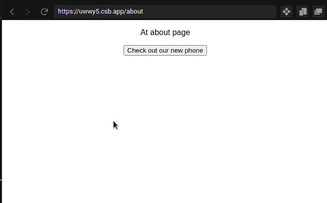
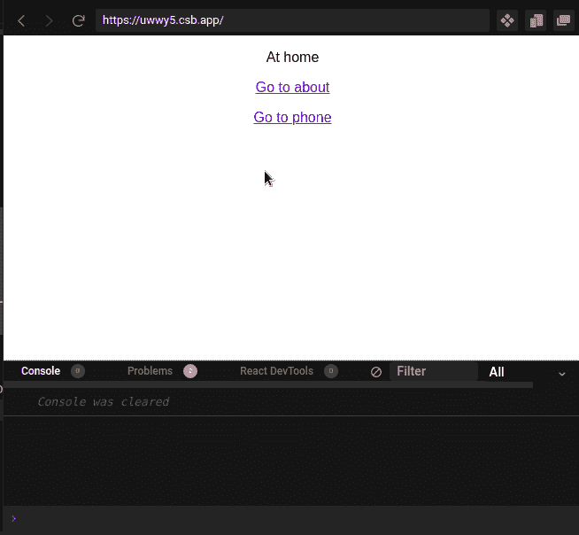
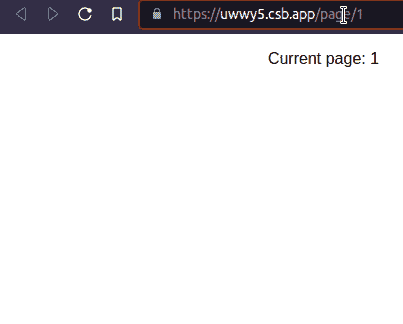

# React 路由器 V6:Reach 路由器和 React 路由器的未来

> 原文：<https://blog.logrocket.com/react-router-v6-future-reach-router/>

***编者按**:这篇文章最后一次更新是在 2021 年 12 月 30 日，包含了关于 React 路由器 v6 的信息。*

2019 年 5 月，React 路由器和 Reach 路由器的联合创始人 Ryan Florence 宣布[即将发布利用 React 的 Hooks API 的 React 路由器](https://reacttraining.com/blog/reach-react-router-future/)新版本。他还表示，React Router 将是幸存的项目，而 Reach Router 将继续以错误修复的形式获得支持。

快进到 2019 年 9 月，React 路由器 v5.1 最终发布；这个版本是对新的基于钩子的 API 的介绍，并带有一些令人惊奇的特性。新的挂钩也使布线更加容易。

在本文中，我将讨论 React Router 中的最新特性，将 Reach Router 和 React Router 与新的基于 Hooks 的 API 进行比较，并简要讨论如何迁移到这个 API。我们开始吧！

### 目录

## `useHistory`钩子

[`useHistory`钩子](https://v5.reactrouter.com/web/api/Hooks/usehistory)让您可以从历史包中访问`history`实例，这是 React 路由器的主要依赖项之一。`history`对象允许在 React 应用程序中的路线之间进行编程导航。

要访问 React 路由器 v4 中的`history`对象，您必须使用`history`属性。假设我们想使用一个按钮以编程方式导航到一条名为`home`的路线。使用 React 路由器 v4，我们的代码将类似于以下内容:

```
function HomeButton({history}) {
  function handleClick() {
    history.push("/home");
  }
  return (
    <button type="button" onClick={handleClick}>
      Go home
    </button>
  );
}

```

然而，随着`useHistory`钩子的引入，我们可以很容易地访问`history`对象并如下使用它:

```
import { useHistory } from "react-router-dom";

function HomeButton() {
  const history = useHistory();
  function handleClick() {
    history.push("/home");
  }
  return (
    <button type="button" onClick={handleClick}>
      Go home
    </button>
  );
}
```

如果用户点击按钮，`home`条目将被推送到`history`堆栈上，呈现主页。

## `useNavigate`钩子

或者，您可以使用 [`useNavigate`钩](https://reach.tech/router/api/useNavigate)。像`useHistory`一样，`useNavigate`钩子允许开发者通过代码在应用中导航。看看下面这个简单的例子:

```
import { useNavigate } from "react-router";

function About() {
  //create an instance of useNavigate
  //this allows us to access this hook's functions
  let navigate = useNavigate();
  function goToPhonePage() {
    //when executed, direct the user to the /phone page.
    navigate("/phone");
  }
  return (
    <div>
      <p> At about page</p>
      {/*When clicked, run the goToPhonePage method */}
      <button onClick={goToPhonePage}> Check out our new phone</button>
    </div>
  );
} 

```

上面代码的输出如下所示:



## `useLocation`钩子

[`useLocation`钩子](https://v5.reactrouter.com/web/api/Hooks/uselocation)返回代表当前 URL 的`location`对象。使用`location`对象的 state 属性，`location`对象也可以用来访问从另一个路由发送的数据。

要在 React Router v4 和 Reach Router 中访问`location`对象，您必须分别使用 props 或`Location`组件。下面的代码片段演示了如何使用 React Router v4 访问`location`对象:

```
function RandomRoute({ location }) {
  return <h1>Current pathname: {location.pathname}</h1>;
}

```

下面的代码片段演示了如何在 Reach Router 中访问`location`对象:

```
function RandomRoute() {
  return (
    <Location>
      {({ location }) => <h1>Current pathname: {location.pathname}</h1>}
    </Location>
  );
}

```

使用新的`useLocation`钩子，您可以更方便地访问`location`对象:

```
function RandomRoute() {
  const location = useLocation();
  return <h1>Current pathname: {location.pathname}</h1>;
}

```

`useLocation`的一个关键用例是[在调试过程中帮助开发者](https://blog.logrocket.com/debugging-react-performance-issues-with-why-did-you-render/)。下面的代码片段记录了用户每次点击链接时的当前页面:

```
import { useLocation } from "react-router-dom";

export default function App() {
  const location = useLocation();
  useEffect(() => {
    console.log(location.pathname);
  }, []);
  //location is dependency, this means that this useEffect will run
  //everytime the value of 'location' changes
  return (
    <Switch>
      <Route exact path="/">
        <Home />
      </Route>
      <Route path="/about">
        <About />
      </Route>
      <Route path="/phone">
        <Phone />
      </Route>
    </Switch>
  );
}

```

在上面的代码中，我们首先创建了一个名为`location`的变量，它将是`useLocation`钩子的一个实例。这使我们可以访问包含用户当前位置的`pathname`对象。我们还使用了`useEffect`函数来注销用户的当前路径:



## `useParams`钩子

React Router v5.1 还为我们提供了新的 [`useParams`钩子](https://v5.reactrouter.com/web/api/Hooks/useparams)，它返回 URL 参数的键值对对象。React Router 和 Reach Router 用户通常使用的 URL 参数允许我们通过 URL 方便地传递关于点击事件的信息。

在 Reach Router 和 React Router 的早期版本中，访问 URL 参数的唯一方式是通过 props，在 Reach Router 的情况下，是通过`Match`组件。使用 React 路由器 v4，我们的代码将如下所示:

```
import {
  BrowserRouter as Router,
  Switch,
  Route,
  Link
} from "react-router-dom";
function App() {
  return (
    <Router>
      <header>
        <nav>
          <Link to="/">Home</Link>
          <Link to = "/page/2">Page 2</Link>
        </nav>
      </header>
      <Switch>
        <Route path = "/page/:pageNumber" component = {Page}>
        <Route path="/" render={() => <h1>Home</h1>} />
      </Switch>
    </Router>
  );
}
function Page({match}) {
  const {pageNumber} = match.params;
  return <h1>Page Number:{pageNumber}</h1>;
}

```

在到达路由器的情况下:

```
import { Router, Link } from "@reach/router";
function App() {
  return (
    <>
      <header>
        <nav>
          <Link to="/">Home</Link>
          <Link to="/page/2">Page 2</Link>
        </nav>
      </header>
      <Router>
        <Home path="/" />
        <Page path="/page/:pageNumber" />
      </Router>
    </>
  );
}
const Home = () => <h1>Home</h1>;
function Page(props) {
  return <h1>Page Number:{props.pageNumber}</h1>;
}

```

尽管上面的方法对于大多数用例来说都很好，但是如果您试图将 URL 参数向下传递给子组件，您将不得不将它们作为道具来传递，从而使您的代码变得混乱。您可以使用[上下文 API 来缓解这个问题](https://blog.logrocket.com/react-context-api-deep-dive-examples/)，但是，这样做可能会在您的代码中引入不必要的复杂性。

有了新的 Hooks API，您可以轻松地在任何子组件中调用`useParams`钩子来获取 URL 参数。如果我们重写代码来使用钩子，它看起来会像这样:

```
import { useParams } from "react-router-dom";

export default function App() {
  return (
    <Router>
      <div>
        <Switch>
          <Route path="/page/:pageNumber" children={<Page />} />
        </Switch>
      </div>
    </Router>
  );
}

function Page() {
//extract the pageNumber parameter.
  const { pageNumber } = useParams();
  return (
    <div>
      <p> Current page: {pageNumber}</p>
    </div>
  );
}

```



## `useRouteMatch`钩子

最后，我们有 [`useRouteMatch`挂钩](https://v5.reactrouter.com/web/api/Hooks/useroutematch)。在 Reach Router 中，要访问路由的`match`对象，您必须使用`Match`组件。如果您使用的是早期版本的 React Router，则必须使用路线的道具或渲染道具。有了`useRouteMatch`钩子，访问`match`对象更加容易和方便。

`useRouteMatch`钩子接受一个路径作为参数，并返回一个相应的`match`对象。当没有传递参数时，钩子根据树中最匹配的`<Route>`返回一个`match`对象。

React 路由器中访问匹配对象的前一种方式如下:

```
//option 1
function ARoute() {
  return (
    <Route
      path="/randomroute/:randomrouteid"
      render={({ match }) => {
        return (
          ...
        );
      }}
    />
  );
}

//option 2
function ARoute(props){
  const match = props.match;
  return (
    ...
  );
}

```

要在到达路由器中获取`match`对象，我们必须使用提供的`Match`组件:

```
function AnotherRandomRoute(){
    return(
        <Match path = "/randomroute/:randomrouteid">
            {
                ({match}) => ...
            }
        </Match>
    );
}

```

上面的代码块工作正常，但是我们可以用`useRouteMatch`钩子使我们的代码更短更简洁:

```
function AnotherRandomRoute(){
    const match = useRouteMatch("/randomroute/:randomrouteid");
    return(
        ...
    );
}

```

使用`useRouteMatch`，您还可以使用`match`对象的`url`和`path`属性实现嵌套路由。下面是一个例子，说明如何在 React Router 中用`useRouteMatch`钩子处理嵌套路由:

```
function Topics() {
  const { path, url } = useRouteMatch();
  return (
    <div>
      <div>
        <Link to={`${url}/1`}>Topic 1</Link>
        <Link to={`${url}/2`}>Topic 2</Link>
        <Switch>
          <Route exact path={path} render={() => <h1>Select a topic</h1>} />
          <Route path={`${path}/:topic`}>
            <Topic />
          </Route>
        </Switch>
      </div>
    </div>
  );
}
function Topic() {
  const { topic } = useParams();
  return (
    <div>
      <h1>Topic: {topic}</h1>
    </div>
  );
}
```

> 在任何时候，如果您想在`Switch`组件之外使用 Route 组件，那么`useRouteMatch`也是很有帮助的。

## 对`Link`和`NavLink`组件的更新

React Router v5.1 还对`Link`和`NavLink`组件进行了一些更新，其中之一是能够将功能传递给这些组件的`to`道具。当前位置作为参数传递给函数，该函数必须以对象或字符串的形式返回位置表示。

## React 路由器 v6

在更新本文时， [React 路由器团队已经发布了 v6](https://blog.logrocket.com/react-router-v6/) ，它包括以下特性:

### 较小的捆尺寸

新包的当前大小大约是 6kB。根据[React 路由器的联合创始人 Michael Jackson 的一条推文](https://twitter.com/mjackson/status/1229156979714605056?s=20)，他们可以通过放弃对 IE11 之前任何功能的支持来实现这一点。这包括放弃对 React < 16.8 的支持，使用 Google Closure 编译器，以及使用更新的代码。由于捆绑包较小，您的应用程序占用的内存更少，速度也比以前更快。

### 使用新的`<Routes>` API 进行自动`<Route>`排序

`<Routes>`将取代`<Switch>`，这意味着开发者不再需要煞费苦心地为他们所有的路线分配`exact`道具。

### 嵌套路线改进

构建复杂的路由系统现在需要更少的样板代码来开始，从而允许更小的代码库，很像 React Router v3 和 Reach Router。

### 附加 API 和挂钩

*   全新的悬念就绪`navigate` API，带来更优化、响应更灵敏的网络应用
*   `useRoutes`和`matchRoutes`用于使用基于对象的路由 API
*   一个名为`useNavigate`的新钩子，它返回一个用于编程路由和导航的函数

此外，随着更多新的钩子出现，React Router 承诺易于使用和最小的膨胀。关于这个版本中新特性的更多信息，[查看文档](https://remix.run/blog/react-router-v6)。

## 从 Reach 路由器迁移到新的基于 Hooks 的 API

如果您计划从 Reach 路由器迁移，[迁移到 React 路由器 v6](https://blog.logrocket.com/migrating-react-router-v6-complete-guide/) 会更容易，因为它们在表面上看起来很相似。您可以通过以下步骤轻松进行迁移:

安装 React 路由器 v6:

```
npm install [email protected]

```

将`<Location>`和`<Match>`更换为`useLocation`和`useMatch`挂钩；

```
const {useMatch, location} from "react-router-dom";
const match = useMatch(); //identical to useRouteMatch
const location = useLocation(); //same as to that of version 5

```

使用`useParams`访问 URL 参数:

```
import {useParams} from "react-router-dom";
//usage is similar to that of v5:
const {pageNumber}  = useParams();
console.log(pageNumber):

```

在顶部放置一个`<BrowserRouter>`:

```
//file: index.js
import {BrowserRouter} from "react-router-dom";
ReactDOM.render(
  <BrowserRouter>
    <App />
  </BrowserRouter>,
  document.getElementById("root")
);

```

将`<Router>`替换为`<Routes>`，然后使用`<Route>`定义您的路线:

```
import {Routes} from "react-router-dom";
<Route path="/" element={<Home />} />
<Route path="about" element={<About />} />

```

下面是一个使用 React 路由器 v6 的基本示例:

```
import { Routes, Route } from "react-router-dom";

export default function App() {
  return (
    <div className="App">
      <Routes>
        {/*when user goes to /, render Home */}
        <Route path="/" element={<Home />} />
        {/*when user goes to /about, render About */}
        <Route path="about" element={<About />} />
      </Routes>
    </div>
  );
}
function Home() {
  return (
    <div>
      <p>At home </p>
    </div>
  );
}
function About() {
  return <div> About</div>;
}

```

正如您所看到的，样板文件的数量已经显著减少，允许更简单和更可读的代码。

## 结论

到目前为止，React 路由器 v6 还是很有前景的。新的特性和钩子肯定会鼓励更干净的代码，我认为 React 路由器团队转向构建基于钩子的 API 是一个伟大的决定。我希望你喜欢这篇文章！

## [LogRocket](https://lp.logrocket.com/blg/react-signup-general) :全面了解您的生产 React 应用

调试 React 应用程序可能很困难，尤其是当用户遇到难以重现的问题时。如果您对监视和跟踪 Redux 状态、自动显示 JavaScript 错误以及跟踪缓慢的网络请求和组件加载时间感兴趣，

[try LogRocket](https://lp.logrocket.com/blg/react-signup-general)

.

[ ](https://lp.logrocket.com/blg/react-signup-general) [](https://lp.logrocket.com/blg/react-signup-general) 

LogRocket 结合了会话回放、产品分析和错误跟踪，使软件团队能够创建理想的 web 和移动产品体验。这对你来说意味着什么？

LogRocket 不是猜测错误发生的原因，也不是要求用户提供截图和日志转储，而是让您回放问题，就像它们发生在您自己的浏览器中一样，以快速了解哪里出错了。

不再有嘈杂的警报。智能错误跟踪允许您对问题进行分类，然后从中学习。获得有影响的用户问题的通知，而不是误报。警报越少，有用的信号越多。

LogRocket Redux 中间件包为您的用户会话增加了一层额外的可见性。LogRocket 记录 Redux 存储中的所有操作和状态。

现代化您调试 React 应用的方式— [开始免费监控](https://lp.logrocket.com/blg/react-signup-general)。