# React 路由器与 Redux:了解导航状态

> 原文：<https://blog.logrocket.com/react-router-with-redux-navigation-state/>

***编者按**:这个 React 路由器和 Redux 导航状态教程最后一次更新是在 2021 年 3 月 31 日。*

导航是传统应用程序和单页应用程序(SPAs)的基本组件。简单地说，导航指的是从一个页面移动到另一个页面的能力。

在本 React 路由器和 Redux 教程中，我们将向您展示在 React/Redux 应用程序中导航的细微差别，并演示如何以声明方式进行导航。您还将学习如何跨 React 应用程序的导航开关维护状态。

我们将讨论以下内容:

要跟随本教程，您应该对 Redux 的工作原理有一个基本的了解。

## 我们不只是写 Redux，我们也谈论它。现在听着:

或者以后订阅

### 什么是 React 路由器？

## React Router 是 React 应用程序中一种流行的管理路由的声明方式。它消除了在 React 应用程序中为所有页面和屏幕手动设置路径所带来的压力。React 路由器输出三个主要组件来帮助我们实现路由——路由、链路和浏览器路由器。


如果您是 React 路由器的新手，请查看此视频教程以帮助您入门:

 [https://www.youtube.com/embed/Law7wfdg_ls?version=3&rel=1&showsearch=0&showinfo=1&iv_load_policy=1&fs=1&hl=en-US&autohide=2&wmode=transparent](https://www.youtube.com/embed/Law7wfdg_ls?version=3&rel=1&showsearch=0&showinfo=1&iv_load_policy=1&fs=1&hl=en-US&autohide=2&wmode=transparent)

视频

Redux 是什么？

## Redux 是一个可预测的状态容器，旨在帮助您编写跨客户机、服务器和本机环境表现一致且易于测试的 JavaScript 应用程序。

虽然它主要用作 React 的状态管理工具，但是您可以将它用于任何其他 JavaScript 框架或库。它是轻量级的，只有 2KB(包括依赖项)，所以您不必担心它会使您的应用程序的资产变大。

使用 Redux，应用程序的状态保存在一个存储中，每个组件都可以从这个存储中访问它需要的任何状态。

如果你刚刚开始使用 Redux，下面的视频对初学者来说是一个很好的资源。

 [https://www.youtube.com/embed/CVpUuw9XSjY?version=3&rel=1&showsearch=0&showinfo=1&iv_load_policy=1&fs=1&hl=en-US&autohide=2&start=4&wmode=transparent](https://www.youtube.com/embed/CVpUuw9XSjY?version=3&rel=1&showsearch=0&showinfo=1&iv_load_policy=1&fs=1&hl=en-US&autohide=2&start=4&wmode=transparent)

视频

使用 Redux 示例反应路由器

## 为了使本教程尽可能实用，我设置了一个名为 EmojiLand 的简单应用程序(不要与同名的百老汇音乐剧混淆)。

下面是示例应用程序的外观:


EmojiLand 是一个简单的应用程序，但它足以帮助你消化我将在本文中分享的非常重要的提示。

请注意，该应用程序如何停留在当前路线上，但当单击按钮时，它会执行一些假操作，并在假操作完成后重定向到另一条路线。

在现实世界中，这个假动作可能是获取资源的网络请求或任何其他异步动作。

为了让我们达成共识，让我们来探索 EmojiLand 应用程序是如何构建的。

要跟进，从 GitHub 获取应用程序的 [repo。如果你觉得很懒，可以跳过这一步。](https://github.com/ohansemmanuel/nav-state-react-router)

克隆回购:`git clone [https://github.com/ohansemmanuel/nav-state-react-router.git](https://github.com/ohansemmanuel/nav-state-react-router.git)`

移到目录中:

安装依赖项:

```
cd nav-state-react-router
```

或者

```
yarn install
```

然后运行应用程序:

```
npm install
```

或者

```
yarn start
```

该应用程序是一个基本的[反应与 Redux 设置](https://blog.logrocket.com/when-and-when-not-to-use-redux-41807f29a7fb/)。还包括一个非常简单的`react-router`设置。

```
npm start
```

在`containers/App.js`中，您将找到该应用程序中包含的六条路线。

下面是完整的代码表示:

每条路线都指向一个表情符号组件。`/quiet`渲染`KeepQuiet`组件。

```
const App = () => (
  <Router>
    <Switch>
      <Route exact path="/" component={AngryDude} />
      <Route path="/quiet" component={KeepQuiet} />
      <Route path="/smile" component={SmileLady} />
      <Route path="/think" component={ThinkHard} />
      <Route path="/thumbs" component={ThumbsUp} />
      <Route path="/excited" component={BeExcited} />
    </Switch>
  </Router>
);
```

下面是`KeepQuiet`组件的样子:

它是一个简单的功能组件，呈现一个`EmojiLand`组件。组件的构造在`components/EmojiLand.js`中。这很简单。你可以在 GitHub 上[看看。](https://github.com/ohansemmanuel/nav-state-react-router/blob/master/src/components/EmojiLand.js)

```
import React from "react";
import EmojiLand from "../components/EmojiLand";
import keepQuietImg from "img/keepquiet.png";
import emojiLand from "./emojiLand";

const KeepQuiet = ({ appState, handleEmojiAction }) => (
    <EmojiLand
      EmojiBg="linear-gradient(120deg, #a6c0fe 0%, #f68084 100%)"
      EmojiImg={keepQuietImg}
      EmojiBtnText="Keep Calm and Stay Quiet."
      HandleEmojiAction={handleEmojiAction}
      appState={appState}
    />
  );

export default emojiLand(KeepQuiet);
```

重要的是，它接受一些道具，如背景渐变、图像和按钮文本。输出的组件更精致。

请看一下上面代码块的最后一行。

更多来自 LogRocket 的精彩文章:

* * *

### 右侧有一个高阶分量。它所做的就是确保当你点击任何表情组件中的一个按钮时，[它会模拟一个虚假的动作](https://github.com/ohansemmanuel/nav-state-react-router/blob/master/src/containers/emojiLand.js)大约 1000 毫秒。请记住，实际上这可能是一个网络请求。

* * *

```
export default emojiLand(KeepQuiet);
```

`emojiLand`高阶组件通过将`appState`道具传递给表情符号组件来实现这一点。在这个例子中，`KeepQuiet`

当第一次呈现任何表情组件时，`appState`是空字符串，`""`。大约 1000ms 后，`appState`变为`DO_SOMETHING_OVER`，其中`DO_SOMETHING_OVER`表示为常数，如下图所示。

在`constants/action-types`中:

这就是这个应用程序中每个表情符号组件的工作方式。

```
export const DO_SOMETHING_OVER = "DO_SOMETHING_OVER";
```

还要记住，在每条路线上，都会呈现一个单独的 EmojiLand 组件。

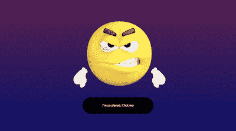


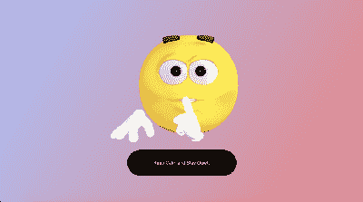

AngryDude, BeExcited, & BeQuiet

使用反应路由器和 Redux 进行重定向


SmileLady, ThinkHard, and ThumbsUp

## 假流程完成后，让我们假设您想要在 EmojiLand 应用程序中重定向/移动到另一个路由。

首先，记住在到达回家的路线时，`AngryDude`组件被渲染。

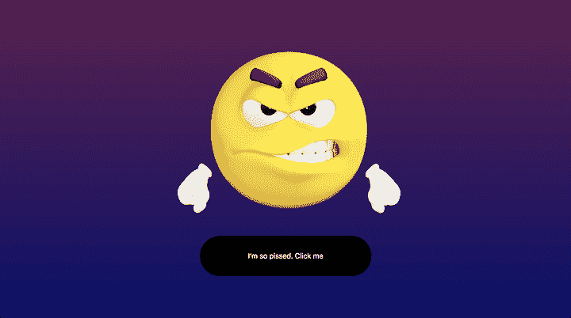

处理重定向的更具声明性的方法是使用 React-router 中的`Redirect`组件。

The AngryDude component.

让我告诉你怎么做。

因为我们想从`AngryDude`组件重定向，首先，您在`containers/AngryDude.js`中导入`Redirect`组件，如下所示:

为了使重定向工作，它必须像常规组件一样呈现。在我们的特定示例中，当`appState`持有值`DO_SOMETHING_OVER`时，我们将进行重定向，即假动作已经完成。

```
import { Redirect } from "react-router-dom";
```

现在，这是代码:

现在，如果`appState`等于`DO_SOMETHING_OVER`，则渲染`Redirect`组件。

```
const AngryDude = ({ appState, handleEmojiAction }) => {
    return appState === DO_SOMETHING_OVER ? (
<Redirect to="/thumbs" />
    ) : (
      <EmojiLand
        EmojiBg="linear-gradient(-180deg, #611A51 0%, #10096D 100%)"
        EmojiImg={angryDudeImg}
        EmojiBtnText="I'm so pissed. Click me"
        HandleEmojiAction={this._handleEmojiAction}
        appState={this.props.appState}
 />
```

注意，一个必需的`to`属性被添加到`Redirect`组件中。这个道具需要知道重定向到哪里。

```
<Redirect to="/thumbs" />
```

有了这些，下面是实际操作:

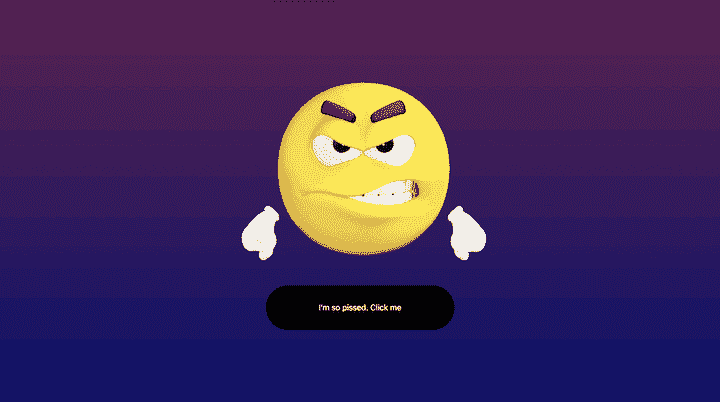

如果对其他路由组件执行相同的操作，则可以成功地重定向所有路由:

Redirecting from “Angry” to “Thumbs up”

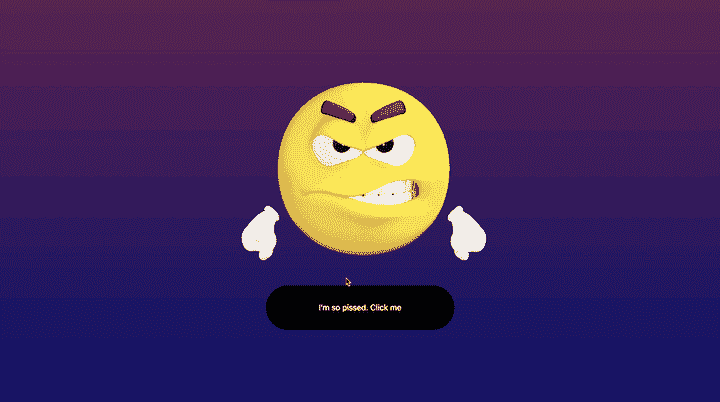

很简单，对吧？

Redirecting through all the routes!

但是有一点问题，我将在下一节中解决这个问题。

避免因替换历史中的当前路由而导致的重定向

### 我将打开一个新的浏览器，点击应用程序，但在某些时候，我会尝试返回，即使用后退浏览器按钮:

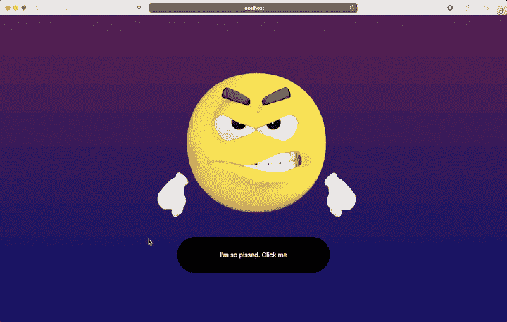

请注意，当我单击后退按钮时，它不会返回到以前的路线，而是将我带回浏览器的主页。为什么？

Attempting to go back takes me back to the browser’s homepage

默认情况下，使用`Redirect`组件将替换浏览器历史堆栈中的当前位置。因此，即使我们循环了多条路线，这些路线也会在浏览器的“记录”中互相替换

对于浏览器，我们只访问了一条路线。因此，点击后退按钮把我带回了主页。这就像有一个数组，但不是推到数组，而是替换数组中的当前值。

不过，有一个解决办法。

组件`Redirect`可以接受一个`push`属性来取消这种行为。有了`push`道具，每条路线都被推到浏览器的历史堆栈中，不会被替换。

这在代码中是这样的:

这是结果。

```
return appState === DO_SOMETHING_OVER ? (
    <Redirect push to="/thumbs" />
  ) : (
    <EmojiLand
      EmojiBg="linear-gradient(-180deg, #611A51 0%, #10096D 100%)"
      EmojiImg={angryDudeImg}
      EmojiBtnText="I'm so pissed. Click me"
      HandleEmojiAction={handleEmojiAction}
      appState={appState}
    />
  );
```

请注意我们现在如何导航回以前访问过的路线！


Now, clicking the back button works just as expected 🙂

维护导航状态

## 当您从一条路线移动到另一条路线时，前一条路线中的变量不会被带到下一条路线。他们走了！

是的，走了，除了你做一些工作。

有趣的是,`Redirect`组件使这变得非常容易。

与将字符串`to` prop 传入`Redirect`相反，您也可以传入一个对象。

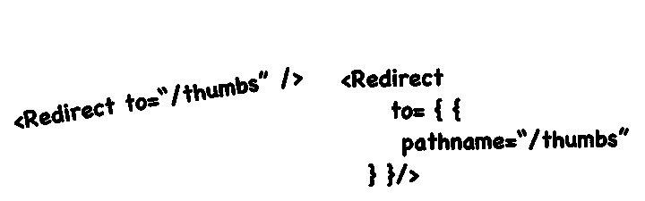

有趣的是，有了对象表示，还可以传入一个`state`对象。

You could also pass in an object to the Redirect component

在`state`对象中，您现在可以存储任何您希望带到被重定向到的路由的键值对。

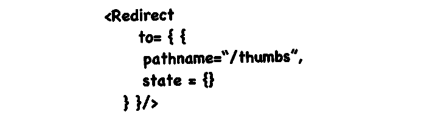

让我们看一个代码示例。

Adding a State object within the `to` prop.

当从`AngryDude`组件重定向到`ThumbsUp`时，让我们将一些值传入状态字段。

这是我们之前看到的:

那要改成这样:

```
<Redirect push to="/thumbs" />
```

现在，我已经传入了 3 个不同的键值对！`humanType`、`age`和`sex`

```
<Redirect
      push
to={{
        pathname: "/thumbs",
        state: {
          humanType: "Cat Person",
          age: 12,
          sex: "none"
        }
      }}
    />
```

但是在重定向到`/thumbs`路由时，我如何接收这些值呢？

对于路由组件，react-router 提供了一个特定的`location`属性。在这个`location`道具中，你可以像这样访问状态对象，`location.state`或者`this.props.location.state`

注意:路由组件是由反应路由器的<route>组件呈现的组件。他们通常在签名中，</route>

> 这里有一个例子，我记录了在新的 route，`/thumbs`中接收到的状态对象，即在新呈现的`Thumbs`组件中

注意位置道具是如何被解构的，然后就是`console.log(location.state)`

```
const ThumbsUp = ({ appState, handleEmojiAction, location }) => {
console.log(location.state);
  return appState === DO_SOMETHING_OVER ? (
    <Redirect push to="/quiet" />
  ) : (
    <EmojiLand
      EmojiBg="linear-gradient(-225deg, #DFFFCD 0%, #90F9C4 48%, #39F3BB 100%)"
      EmojiImg={thumbsUpImg}
      EmojiBtnText="You rock. Thumbs up!"
      HandleEmojiAction={handleEmojiAction}
      appState={appState}
    />
  );
};
```

经过重定向和开发控制台检查后，状态对象确实就在那里！

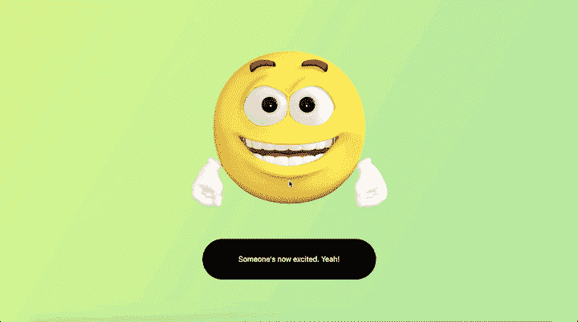

您甚至可以更进一步，基于传入的状态实际呈现一些 UI 组件。

The state object received and logged in the new `/thumbs` route!

我是这样做的:


通过获取传递到`ThumbsUp`中的状态，我对其进行了映射，并呈现了按钮下方的值。如果你关心我是如何做到的，看看`[components/EmojiLand.js](https://github.com/ohansemmanuel/nav-state-react-router/blob/master/src/components/EmojiLand.js)`中的源代码。

Have a look at the text below the button. The values have been grabbed from the location state object!

现在我们已经取得了一些不错的进展！

在现实世界中使用 React 路由器和 Redux

## 这很酷，但在现实世界中实用吗？

有许多用例，但一个非常常见的是在表格中呈现结果列表。但是，该表中的每一行都是可单击的，单击某一行时，您会希望显示有关所单击值的更多信息。

您可以使用这里的概念重定向到新路由，还可以将一些值从表行传递到新路由！所有这些都是通过在`to` prop 中使用重定向的状态对象来实现的！

但是等等——还有另一个解决方案！

在开发领域，通常有多种方法来解决一个问题。我希望这篇文章尽可能实用，所以我将向您展示在路线之间导航的另一种可能的方法。

假设我们想在执行某个操作后从`/thumbs`路由重定向到`quiet`路由。在这种情况下，我们不想使用`Redirect`组件。

你会怎么做？

与我们呈现`Redirect`组件的前一个解决方案不同，您可以使用下面显示的稍微更强制性的方法:

或者

```
history.push("/quiet)
```

好吧，但是这个`history`物体是从哪里来的？

```
this.props.history.push("/quiet")
```

就像前面例子中的`location`一样，react-router 也将一个`history` prop 传递给路由组件。

以下是我们在`containers/Thumbs.js`中看到的:

现在，我们可以像这样使用`history`对象:

```
const ThumbsUp = ({ appState, handleEmojiAction, location }) => {
  return appState === DO_SOMETHING_OVER ? (
    <Redirect push to="/quiet" />
  ) : (
    <EmojiLand
      EmojiBg="linear-gradient(-225deg, #DFFFCD 0%, #90F9C4 48%, #39F3BB 100%)"
      EmojiImg={thumbsUpImg}
      EmojiBtnText="You rock. Thumbs up!"
      HandleEmojiAction={handleEmojiAction}
      appState={appState}
      locationState={location.state}
    />
  );
};
```

现在，结果是一样的:

```
const ThumbsUp = ({ appState, handleEmojiAction, location, history }) => {
  if (appState === DO_SOMETHING_OVER) {
history.push("/quiet");
  }
  return (
    <EmojiLand
      EmojiBg="linear-gradient(-225deg, #DFFFCD 0%, #90F9C4 48%, #39F3BB 100%)"
      EmojiImg={thumbsUpImg}
      EmojiBtnText="You rock. Thumbs up!"
      HandleEmojiAction={handleEmojiAction}
      appState={appState}
      locationState={location.state}
    />
  );
};
```

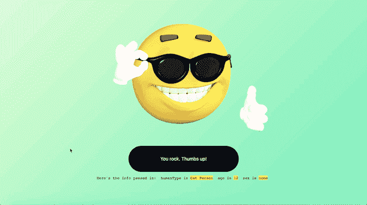

正如所料，重定向仍然是可能的。

Using the history prop works just fine

需要注意的是，您也可以像这样传入一些状态值:

只需将第二个对象参数传递给`history.push`函数。

```
history.push("/quiet", {
 hello: "state value"
})
```

最棒的是，我们开箱即用。我们不需要做任何多余的工作？

我们所要做的就是学习可用的 API。这很好，这解释了为什么`react-router`和`redux`开箱即可正常工作。

这个 app 用的是`redux`，但这不是问题。

我们的方法有什么问题吗？

### 到目前为止，我们讨论的方法没有任何问题。他们工作得很好！然而，有一些注意事项，根据您喜欢的工作方式和您正在进行的项目，这些方法可能适合也可能不适合。

请注意，我在大型项目中使用过以前的模式，同样，它们工作得很好。也就是说，一些 Redux 纯粹主义者更喜欢通过调度动作来导航路线，因为这是引发状态变化的主要方式。其他人更喜欢将路由数据与 Redux 存储同步，即，将路由数据保存在 Redux 存储中。然后有些人只是想在他们的 Redux devtools 中享受对时间旅行调试的支持，就像你在各种路线上导航一样。

如果 React Router 和 Redux 之间没有更深入的集成，这一切都是不可能的。

让我们来探索如何做到这一点。

什么是`conntected-react-router`？

## 在过去，react-router 为此提供了库， [react-router-redux](https://github.com/reacttraining/react-router/tree/master/packages/react-router-redux) 。然而，在撰写本文时，该项目已被否决，不再维护。

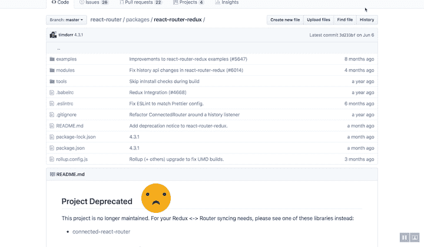

`react-router-redux`维护人员建议使用[连接的反应路由器](https://github.com/supasate/connected-react-router)。

The project is deprecated, as noted on the [react-router-redux github repo](https://github.com/reacttraining/react-router/tree/master/packages/react-router-redux). You can still use it if you want, but you may have some fears using a deprecated library in production.

[连接的 React 路由器](https://github.com/supasate/connected-react-router)是 React 路由器 v4 和 v5 的 Redux 绑定。它通过单向流将路由器状态与 Redux store 同步，并使用 [`react-hot-loader`](https://github.com/gaearon/react-hot-loader) 来促进功能组件的热重装，同时保留状态。

让我们看看这是如何工作的，以及我们可以从整合到我们的项目 Emojiland *中学到什么。*

在你的应用中实现 Redux？用 LogRocket 跟踪 Redux 状态和动作

## 调试 React 应用程序可能很困难，尤其是在有复杂状态的情况下。如果您对监视和跟踪生产中所有用户的 Redux 状态感兴趣，请尝试 LogRocket 。[](https://logrocket.com/signup/)[https://logrocket.com/signup/](https://logrocket.com/signup/)

LogRocket 就像是网络应用的 DVR，记录下你网站上发生的每一件事。您可以汇总并报告问题发生时应用程序的状态，而不是猜测问题发生的原因。

LogRocket Redux 中间件包为您的用户会话增加了一层额外的可见性。LogRocket 记录 Redux 存储中的所有操作和状态。

现代化您调试 React 应用的方式—[开始免费监控](https://logrocket.com/signup/)。

集成连接的 React 路由器

### 首先要做的是 Redux 商店。

**1。创建一个历史对象**

从技术上讲，有一个 DOM history 对象用于操纵浏览器的历史会话。

让我们以编程方式自己创建一个。

为此，从`history`导入`createBrowserHistory`

在`store/index.js`中:

`history`是`react-router-dom`包的一个依赖项，当你在应用中使用 react-router 时，它可能已经安装好了。

```
...
import { createBrowserHistory } from 'history' 
...
```

导入`createBrowserHistory`后，创建如下历史对象:

还在`store/index.js`档。

```
..
const history = createBrowserHistory()
```

在此之前，`store`的创建非常简单，就像这样:

这里的`reducer`指的是`reducers/index.js`中的一个 reducer 函数，但这种情况不会很快出现。

```
const store = createStore(reducer);
```

**2。缠绕根部减速器**

从`connected-react-router`库中导入以下辅助函数

现在必须如下图所示包装根变径管:

```
import { connectRouter } from 'connected-react-router'
```

现在，缩减器将跟踪路由器的状态。别担心，你马上就会明白这意味着什么。

```
const store = createStore(connectRouter(history)(reducer));
```

为了查看到目前为止我们所做的效果，在`index.js`中，我将 redux 商店导出到全球，如下所示:

现在，在浏览器控制台中，您可以使用`store.getState()`检查 redux 状态对象中的内容

```
window.store = store;
```

这就是实际情况:


如您所见，redux 商店中现在有了一个`router`字段！该`router`字段将始终通过一个位置对象保存当前路线的信息，例如`pathname`、`state`等。

Looking in the dev console for the `router` field now in the Redux state

我们还没完。

为了分派路由动作，我们需要从`connected-react-router`库中应用一个定制的中间件。

这将在下面解释

**3。包括一个定制中间件**

要包含用于处理调度动作的定制中间件，从库中导入所需的`routerMiddleware`中间件:

然后使用 redux 的`applyMiddleware`功能:

```
...
import { connectRouter, routerMiddleware } from 'connected-react-router'
```

现在，我们差不多完成了。只差一步了。

```
... 
import { createStore, applyMiddleware } from "redux";
...
```

```
const store = createStore(
  connectRouter(history)(reducer),
applyMiddleware(routerMiddleware(history))
);
```

**4。使用连接的路由器！**

记住，react-redux 给了我们一个`Route`组件。然而，我们需要将这些`Route`组件包装在来自`connected-react-router`库的`ConnectedRouter`组件中。

方法如下:

首先，在`index.js`中导入`ConnectedRouter`组件。

下面是`index.js`文件的渲染函数:

```
import { ConnectedRouter } from 'connected-react-router' 
...
```

记住`App`在应用中渲染不同的路线。

```
render(
  <Provider store={store}>
    <App />
  </Provider>,
  document.getElementById("root")
);
```

现在，在`index.js`中，用`ConnectedRouter`组件包裹`App`组件。`ConnectedRouter`组件应仅次于`react-router`中的`Provider`组件

```
const App = () => (
  <Router>
    <Switch>
      <Route exact path="/" component={AngryDude} />
      <Route path="/quiet" component={KeepQuiet} />
      <Route path="/smile" component={SmileLady} />
      <Route path="/think" component={ThinkHard} />
      <Route path="/thumbs" component={ThumbsUp} />
      <Route path="/excited" component={BeExcited} />
    </Switch>
  </Router>
);
```

我的意思是:

还有一件事！

```
render(
  <Provider store={store}>
 <ConnectedRouter>
      <App />
</ConnectedRouter>
  </Provider>,
  document.getElementById("root")
);
```

现在，应用程序不会像预期的那样工作，因为`ConnectedRouter`需要一个`history`道具，即我们之前创建的历史对象。

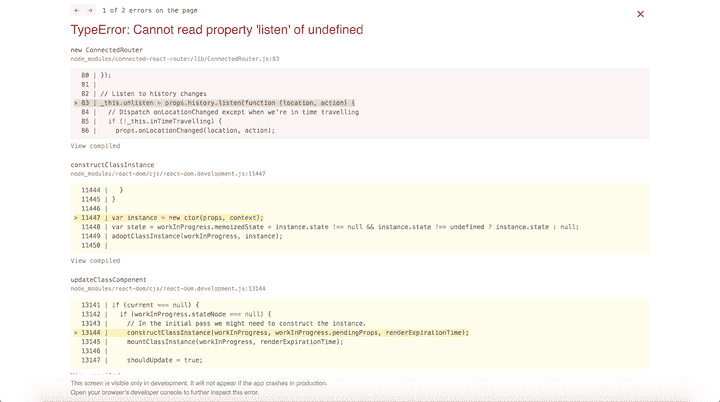

因为我们在多个地方需要同一个对象，所以我们需要它作为一个导出模块。

The app now throws this error.

快速解决方法是创建一个新文件`store/history.js`

现在，这个导出的`history`对象将在两个需要它的地方使用。

```
import { createBrowserHistory } from "history";
const history = createBrowserHistory();
```

```
export default history;
```

在`index.js`中是这样导入的:

然后传递给如下所示的`ConnectedRouter`组件:

```
import history from "./store/history";
```

这样，设置就完成了，应用程序运行了——没有我们之前看到的讨厌的错误！

```
render(
  <Provider store={store}>
    <ConnectedRouter history={history}>
      <App />
    </ConnectedRouter>
  </Provider>,
  document.getElementById("root")
);
```

请记住，我只设置了`connected-react-router`，但是我鼓励你查看这个库的更高级的用法。

你可以用`connected-react-router`库做更多的事情，其中大部分都记录在官方 FAQ 的[中。此外，如果您有一个更健壮的 Redux devtools 设置和一个日志记录中间件，一定要利用时间旅行和动作日志记录！](https://github.com/supasate/connected-react-router/blob/master/FAQ.md#how-to-navigate-with-redux-action)

结论

## 我希望这和我一样有趣！

如果你有任何问题，一定要在评论区提出来，我很乐意帮忙。

去造些牛逼的东西，我一会儿来找你！

Go build something awesome, and I’ll catch you later!

* * *