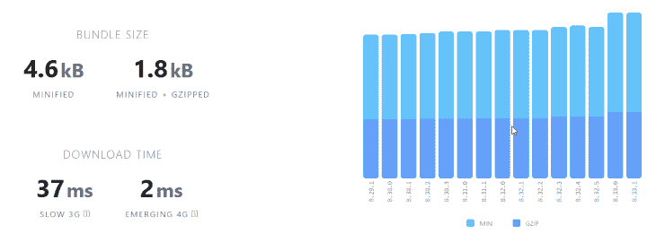
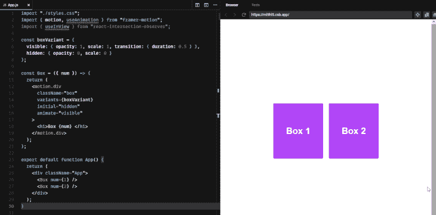
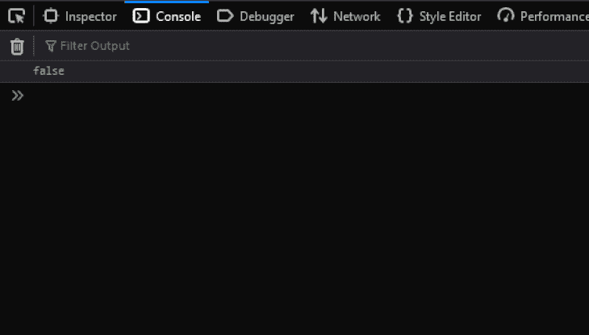
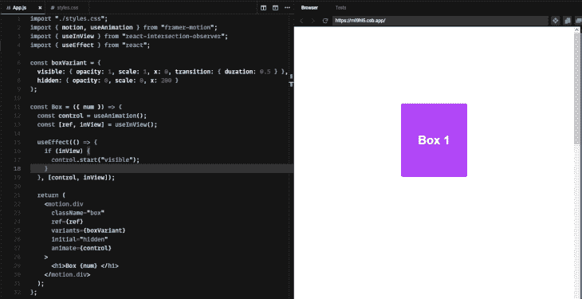
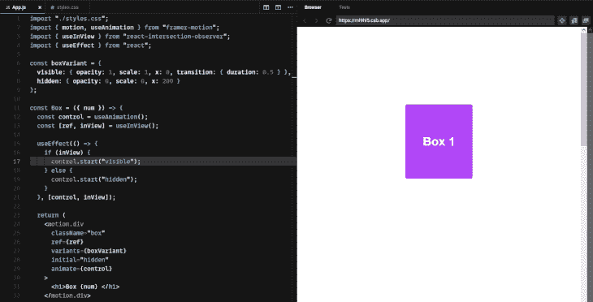

# 反应滚动动画与帧运动-日志火箭博客

> 原文：<https://blog.logrocket.com/react-scroll-animations-framer-motion/>

如果执行得好，动画可以提供强大的用户体验。然而，试图用 CSS 创建令人惊叹的动画是令人头疼的。许多动画库承诺简化这个过程，但是大多数对于构建复杂的动画来说还不够全面。

在本文中，我们将演示如何使用[成帧器动作](https://www.framer.com/motion/)创建滚动动画，这是一个完整的动画库，不需要您是 CSS 专家就可以创建漂亮的动画。

*向前跳转:*

## 先决条件

*   React 及其概念的工作知识，包括钩子
*   CSS 属性的工作知识，例如不透明度、过渡和缩放

不需要有任何关于框架运动的先验知识。本文将介绍该库的基本概念，并在演示部分的基础上进行构建。

让我们先了解一下成帧器运动和交叉点观察器功能的背景。

## 什么是框架运动？

Framer Motion 是一个动画库，用于在 React 中创建声明性动画。它提供生产就绪的动画和一个低级 API 来帮助简化将动画集成到应用程序中的过程。

一些 React 动画库，像 [react-transition-group](https://github.com/reactjs/react-transition-group) 和 [transition-hook](https://github.com/iamyoki/transition-hook) ，[动画元素，带有手动配置的 CSS 过渡](https://blog.logrocket.com/how-build-faster-animation-transitions-react/)。Framer Motion 采用了一种不同的方法，它使用预先配置的样式来制作元素动画。

`motion`和`uaeAnimation`是由成帧器动作暴露的函数触发和控制的两种样式。`motion`功能用于创建运动组件，这些是成帧器运动的构建块。

通过将`motion`作为常规 HTML 或 SVG 元素的前缀，该元素自动成为运动组件:

```
<motion.h1>Motion Component</motion.h1>

```

一个运动组件可以访问几个道具，包括`animate`道具。`animate`接受一个对象，该对象具有要被动画化的组件的已定义属性。当组件挂载时，对象中定义的属性是动态的。

## 什么是交叉点观察器功能？

当元素挂载到 DOM 上时，Framer Motion 会为它们制作动画。它没有基于元素在视口中的滚动位置来制作动画的内置功能。为了解决这个问题，我们需要实现一个交叉点观察器功能，该功能将阻止一个元素在它的滚动位置在视口中之前被安装。

我们可以使用[交叉点观察器 API](https://developer.mozilla.org/en-US/docs/Web/API/Intersection_Observer_API) 从零开始构建这个功能，作为一个定制钩子。这个 JavaScript API 提供了一种异步观察目标元素与顶级文档视口的交集变化的方法。

根据[文档](https://developer.mozilla.org/en-US/docs/Web/API/Intersection_Observer_API)，这个 API 注册了一个回调函数，每当我们想要监视的一个元素进入或退出另一个元素，或者进入或退出视口时，就会执行这个函数。

或者，我们可以使用一个被设计来处理这个功能的库。这是我们将在本文中遵循的方法。我们将使用[react-intersection-observer](https://github.com/thebuilder/react-intersection-observer)库，这是 intersection observer API 的 React 实现。这个库提供了钩子和渲染道具，可以很容易地跟踪元素在视口中的滚动位置。

react-intersection-observer 是一个相对较小的包，所以没有必要担心它可能会给你的项目增加开销。



Source: [bundlephobia](https://bundlephobia.com/package/framer-motion@6.3.2).

现在，让我们建立一个简单的 React 项目并安装必要的依赖项。

## 入门指南

我们将从安装 React 开始:

```
npx create-react-app my-app

```

接下来，我们将安装成帧器动作和`react-intersection-observer`:

```
npm i react-intersection-observer framer-motion

```

接下来，我们将设置一个演示应用程序，并使用 Framer Motion 和 react-intersection-observer 库来识别元素何时出现在视图中，然后应用动画。

## 创建演示应用程序

首先，我们将创建一个 box 组件(这可能是一个 or card、modal 或其他任何东西)并将其导入主组件`App.js`。当这个主要组件进入视口时，我们将制作它的动画。

```
/*Box component*/
const Box = () => {
  return (
    <div className="box">
      <h1>Box</h1>
    </div>
  );
};

/*Main component*/
export default function App() {
  return (
    <div className="App">
      <Box /> /*imported Box component*/ /*imported Box component*/
    </div>
  );
}

```

接下来，我们将从之前安装的库中导入创建动画所需的所有其他内容:

这些是我们制作盒子组件动画所需要的基本钩子。在本教程的稍后部分，您将了解每个钩子是如何工作的。

在我们的组件内部是一个带有`className` : `box`的`div`元素。为了制作`box`元素的动画，我们需要让它成为一个运动组件。

我们通过给元素加上前缀`motion`来实现这一点:

```
const Box = () => {
  return (
    <motion.div className="box">
      <h1>Box</h1>
    </motion.div>
  );
};

```

我们可以通过简单地添加一个`initial`和`animate`道具到`motion`组件并直接定义它们的对象值来开始动画制作`box`元素。

```
<motion.div 
animate={{ x: 100 }} 
initial={{x: 0}} 
className="box"
></motion.div>

```

对于更复杂的动画，帧运动提供了一个变体功能。

## 使用变体制作动画

变体是一组预定义的对象，让我们以声明的方式定义我们想要的动画外观。变体具有标签，可以在运动组件中引用这些标签来创建动画。

下面是一个变体对象的示例:

```
const exampleVariant = {
  visible: { opacity: 1 },
  hidden: { opacity: 0 },
}

```

在这个变体对象`exampleVariant`中，有两个属性:`visible`和`hidden`。这两个属性都通过一个对象作为值传递。当元素为`visible`时，我们希望`opacity`为`1`；当它是`hidden`时，我们希望它是`0`。

上述变体对象可以在运动组件中引用，如下所示:

```
<motion.div variants={exampleVariant} />

```

接下来，我们将创建一个变体，并将其作为道具传递给我们的运动组件:

```
const boxVariant = {
  visible: { opacity: 1, scale: 2 },
  hidden: { opacity: 0, scale: 0 },
}

```

在这个变体对象`boxVariant`中，我们包含了一个`scale`属性，这样当元素处于`visible`状态时，它的尺寸将会放大，而当元素处于`hidden`状态时，它的尺寸将会缩小。

为了在我们的运动组件中引用这个变体对象 it，我们将向运动组件添加一个`variants`道具，并向它传递变体的标签:

```
<motion.div
  variants={boxVariant}
  className="box"
/>

```

现在，我们的运动分量没有发生任何变化；它可以访问 variant 对象，但不知道如何处理它。运动组件需要一种方法来知道何时开始和结束在变体对象中定义的动画。

* * *

### 更多来自 LogRocket 的精彩文章:

* * *

为此，我们将`initial`和`animate`道具传递给运动组件:

```
<motion.div
  variants={boxVariant}
  className="box"
  initial="..."
  animate="..."
/>

```

在上面的代码中，`initial`道具定义了一个运动组件挂载前的行为，而`animate`道具用于定义它挂载时的行为。

现在，我们将通过在组件挂载前将组件的`opacity`设置为`0`并在挂载时将组件的`opacity`设置回`1`来为运动组件添加淡入动画效果。`transition`属性具有指示动画`duration`的持续时间值。

```
<motion.div
  className="box"
  initial={{ opacity: 0, transition:{duration: 1}}}
  animate={{opacity: 1}}
/>

```

因为我们使用了变量，所以我们不必显式地设置`initial`和`animate`属性的值。

相反，我们可以通过引用我们之前创建的 variant 对象中的`hidden`和`visible`属性来动态设置它们:

```
const boxVariant = {
  visible: { opacity: 1, scale: 2 },
  hidden: { opacity: 0, scale: 0 },
}
...
<motion.div
  variants={boxVariant}
  initial="hidden"
  animate="visible"
  className="box"
/>

```

运动组件将继承变体对象的`hidden`和`visible`属性的值，并相应地制作动画:



既然我们已经有了运动组件的工作动画，下一步就是使用 react-intersection-observer 库来访问交叉点观察器 API，并在组件出现时触发动画。

当元素挂载时，Framer Motion 会制作元素动画，所以在我们可以根据元素的滚动位置制作元素动画之前，我们需要能够控制元素挂载和卸载的时间。

挂钩提供了帮助方法，让我们控制动画发生的顺序。例如，我们可以使用`control.start`和`control.stop`方法来手动启动和停止我们的动画。

是一个 react-intersection-observer 钩子，当一个组件在视口中可见时，它可以让我们跟踪。这个钩子让我们可以访问一个`ref`，我们可以把它传递给我们想要观察的组件，以及一个`inView`布尔，它告诉我们一个组件是否在视窗中。

例如，如果我们将`ref`作为道具传递给一个组件，并将`inView`记录到控制台，当组件滚动到视区时，控制台将显示`true`，当组件离开视区时，控制台将显示`false`。



现在，我们将使用`useAnimation`钩子在我们的运动组件进入视口时触发它的动画。

首先，我们将从`useInView`钩子中析构`ref`和`inView`，并将`useAnimation`赋给一个变量:

```
const control = useAnimation()
const [ref, inView] = useInView()

```

接下来，我们将把`ref`作为道具添加到我们的运动组件中，并将`control`变量作为一个值传递给`animate`道具:

```
<motion.div
  ref={ref}
  variants={boxVariant}
  initial="hidden"
  animate={control}
  className="box"
/>

```

最后，我们将创建一个`useEffect`来调用`control.start`方法，只要我们正在观察的组件在视图中，并传递`control`和`inView`变量作为依赖项:

```
useEffect(() => {
    if (inView) {
      control.start("visible");
    } 
  }, [control, inView]);

```

在`useEffect`回调函数中，我们用一个`if`语句执行一个条件检查，检查运动组件是否在视图中。如果条件是`true`，`useEffect`将调用`control.start`方法，并向其传递一个`"visible"`值。这将触发我们的运动组件上的`animate`属性并开始动画。

现在，如果我们上下滚动我们的视口，当它们的滚动位置进入视口时，长方体组件将显示动画:



请注意长方体组件仅在第一次进入视口时设置动画。我们可以通过在`useEffect`回调函数中的`if`语句中添加一个`else`块，并调用`control.start`方法，让它们在每次出现时都有动画效果，但这次是传递一个`"hidden"`值。

```
else {
      control.start("hidden");
    }

```

现在，如果我们上下滚动我们的视口，则每当长方体组件的滚动位置进入视口时，它们都会显示动画:



下面是使用帧运动创建滚动动画的最终代码:

```
import { motion, useAnimation } from "framer-motion";
import { useInView } from "react-intersection-observer";
import { useEffect } from "react";

const boxVariant = {
  visible: { opacity: 1, scale: 1, transition: { duration: 0.5 } },
  hidden: { opacity: 0, scale: 0 }
};

const Box = ({ num }) => {

  const control = useAnimation();
  const [ref, inView] = useInView();

  useEffect(() => {
    if (inView) {
      control.start("visible");
    } else {
      control.start("hidden");
    }
  }, [control, inView]);

  return (
    <motion.div
      className="box"
      ref={ref}
      variants={boxVariant}
      initial="hidden"
      animate={control}
    >
      <h1>Box {num} </h1>
    </motion.div>
  );
};

export default function App() {
  return (
    <div className="App">
      <Box num={1} />
      <Box num={2} />
      <Box num={3} />
    </div>
  );
}

```

## 结论

在本文中，我们介绍了帧运动动画库的基础知识，并演示了如何使用它来创建滚动动画。我们讨论了如何使用`useAnimation`钩子控制动画，以及如何使用交叉点观察器 API(通过 react-intersection-observer 库访问)触发动画。

这篇文章只是提供了一个可以用 Framer Motion 创建的动画的广泛范围的一瞥。访问[官方文件](https://www.framer.com/docs/animation/)，看看你还能想出什么。

## [LogRocket](https://lp.logrocket.com/blg/react-signup-general) :全面了解您的生产 React 应用

调试 React 应用程序可能很困难，尤其是当用户遇到难以重现的问题时。如果您对监视和跟踪 Redux 状态、自动显示 JavaScript 错误以及跟踪缓慢的网络请求和组件加载时间感兴趣，

[try LogRocket](https://lp.logrocket.com/blg/react-signup-general)

.

[ ](https://lp.logrocket.com/blg/react-signup-general) [](https://lp.logrocket.com/blg/react-signup-general) 

LogRocket 结合了会话回放、产品分析和错误跟踪，使软件团队能够创建理想的 web 和移动产品体验。这对你来说意味着什么？

LogRocket 不是猜测错误发生的原因，也不是要求用户提供截图和日志转储，而是让您回放问题，就像它们发生在您自己的浏览器中一样，以快速了解哪里出错了。

不再有嘈杂的警报。智能错误跟踪允许您对问题进行分类，然后从中学习。获得有影响的用户问题的通知，而不是误报。警报越少，有用的信号越多。

LogRocket Redux 中间件包为您的用户会话增加了一层额外的可见性。LogRocket 记录 Redux 存储中的所有操作和状态。

现代化您调试 React 应用的方式— [开始免费监控](https://lp.logrocket.com/blg/react-signup-general)。