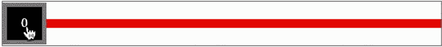
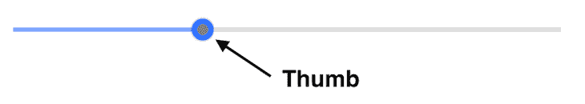
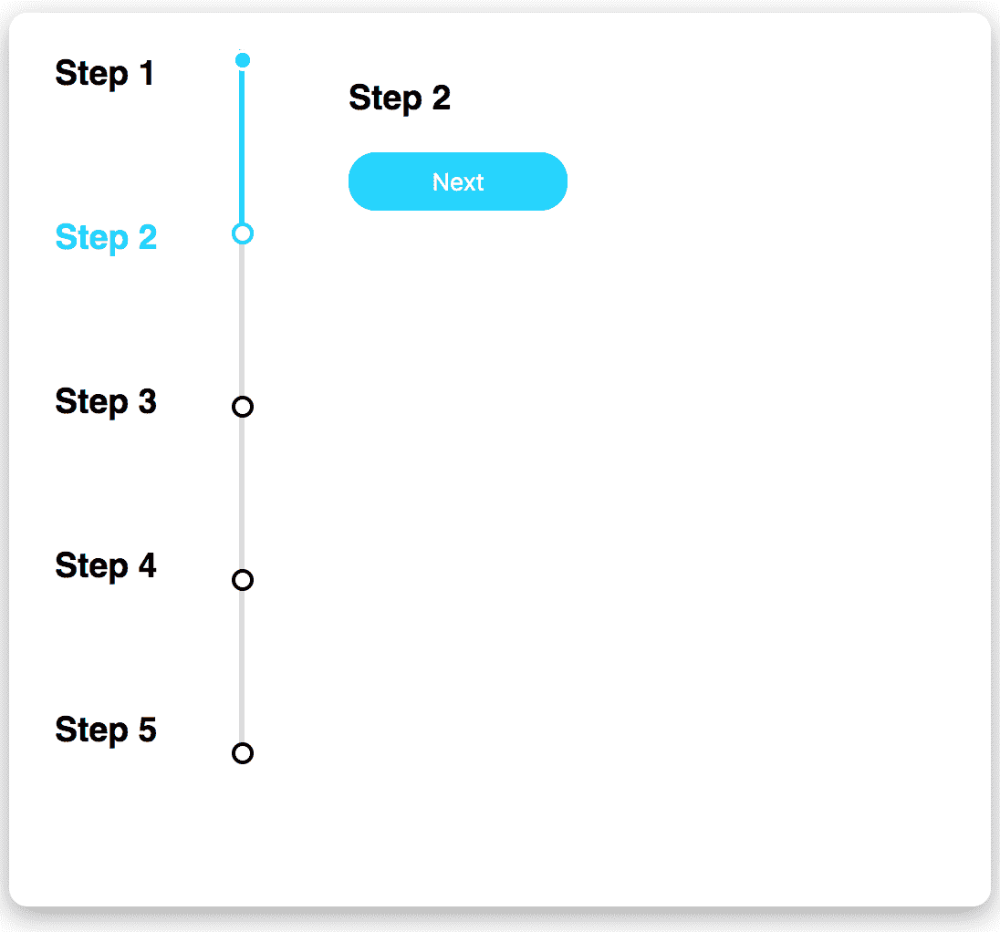
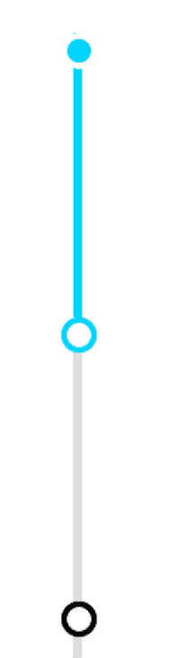
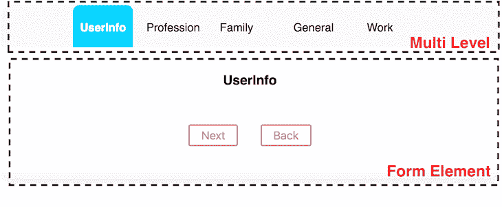

# 使用 react-slider 的 React slider 教程

> 原文：<https://blog.logrocket.com/react-slider-tutorial/>

滑块是 web 和移动应用程序中最常见的 UI 元素之一。用于选择值或值的范围，它通过可视化连接到滑块的数据来提供更好的用户体验。

滑块在提供各种选项时非常有用，例如选择特定的价格范围、跟踪包裹运输或填写表单。

在这篇文章中，我们将使用`react-slider`创建不同的滑块，这是一个 React headless 组件，易于构建和定制。

## `react-slider`组件

是一个小的、可访问的、独立于 CSS 的组件，它帮助我们为 React 应用程序构建定制的滑块组件。它使用 render props 模式为我们的应用程序提供一个无头 UI。

让我们通过安装下面的包来开始使用`react-slider`组件:

```
npm install react-slider

```

一旦我们安装了包并在应用程序中呈现了组件。默认的滑块组件看起来像下面的滑块:



[Default React slider](https://raw.githubusercontent.com/zillow/react-slider/master/react-slider.gif).

稍后，我们可以使用这个滑块的默认代码来定制它:

```
<ReactSlider
    className="horizontal-slider"
    thumbClassName="example-thumb"
    trackClassName="example-track"
    renderThumb={(props, state) => <div {...props}>{state.valueNow}</div>}
/>

```

安装了滑块包后，我们可以回顾组成滑块的三个主要部分:轨迹、标记和滑块。

### 赛道

轨道是连接滑块部件的水平线。为了定制音轨，我们可以添加一个类名，比如`trackClassName`，或者呈现一个定制组件，比如`renderTrack`。使用类名，我们可以定制 track 组件的样式。

但是，如果我们想要控制轨道，我们必须呈现一个自定义组件，并根据我们的需求对其进行更改。例如，呈现自定义组件控制更新用户，即值从 X 更改为 y。

我们可以在此基础上编写自己的功能，比如更新父组件状态。

下面是一个既使用类名又呈现自定义组件的示例:

```
<ReactSlider
    className="horizontal-slider"
    thumbClassName="example-thumb"
    trackClassName="example-track"
    renderTrack={(props, state) => <div {...props} />}//custom track
/>

```

### 拇指

thumb 是在轨道上滑动的元素，我们也可以使用类名对其进行定制，或者使用 render props 方法来呈现定制组件。



### 标记

标记是滑块内的一个步骤，它随轨道一起呈现以更新进度或状态。当我们想要构建一个基于进度的滑块时，这很有用。

这类似于进度条，但它有中间步骤。每一步都要求我们在进行下一步之前完成一个动作。

这里，我们有一个垂直滑块，每一步都有一个标记。


我们可以用两种方式定制标记:要么提供一个类名，要么使用 render props 呈现我们定制的标记组件。

到目前为止，我们已经介绍了`react-slider`的所有主要部分。现在，让我们用一些常见的用例在 React 应用程序中实现它们。

## 在 React 中创建一个简单的滑块

要开始在 React 中使用`react-slider`组件构建滑块，请在根文件夹中创建一个名为`slider.js`的文件，并添加以下代码:

```
import ReactSlider from "react-slider";
const Slider = () => {
  return (
    <ReactSlider
      className="horizontal-slider"
      thumbClassName="example-thumb"
      trackClassName="example-track"
    />
  );
};
export default Slider;

```

这里，我们提供了三个 CSS 类名来定制缩略图、轨迹和滑块:

```
.horizontal-slider {
  width: 100%;
  max-width: 500px;
  height: 100vh;
  margin: auto;
}
.example-thumb {
  cursor: pointer;
  position: absolute;
  z-index: 100;
  background: #ffffff;
  border: 5px solid #3774ff;
  border-radius: 100%;
  display: block;
  box-shadow: 0 0 2px 0 rgb(0 0 0 / 44%);
}
.example-thumb.active {
  background-color: grey;
}
.example-track {
  position: relative;
  background: #ddd;
}
.example-track.example-track-0 {
  background: #83a9ff;
}
.horizontal-slider .example-track {
  top: 20px;
  height: 4px;
}
.horizontal-slider .example-thumb {
  top: 12px;
  width: 10px;
  outline: none;
  height: 10px;
  line-height: 38px;
}

```

滑块样式化后，这里有两件重要的事情需要注意:`example-thumb`和`example-track`类名只为 track 和 thumb 组件提供样式。

为了对从标记 1 到标记 2 的轨道进行样式化，我们可以使用类名`example-track.example-track-0`添加一个样式。我们将在创建垂直滑块时详细讨论这一点。

随着定制的完成，我们完成了简单的滑块；[在这里找到完整的代码和渲染图](https://codesandbox.io/embed/simple-react-slider-56gsb?fontsize=14&hidenavigation=1&theme=dark)。

## 在 React 中创建垂直滑块

我们还可以使用`react-slider`组件构建一个垂直滑块。垂直滑块通常显示进度。例如，许多电子商务网站使用垂直滑块来显示通过邮件递送的包裹的进度。

我们将要构建的[反应垂直滑块的例子可以在这里找到](https://codesandbox.io/embed/react-slider-vertical-example-cnbhp?fontsize=14&hidenavigation=1&theme=dark)。



与水平滑块一样，垂直滑块也有三个组件:步骤、滑块和窗体。

### 台阶

创建一个`step.js`文件，并添加以下代码来呈现五个步骤中的每一个。从上图中我们可以看到，我们在设计中有五个步骤。因此，我们必须添加一个包含值的`steps`数组。基于活动元素，我们可以呈现各自的值:

```
import React from "react";
const steps = ["Step 1", "Step 2", "Step 3", "Step 4", "Step 5"];
const Step = ({ currentIndex }) => {
  return (
    <div className="steps-container">
      {steps.map((step, index) => {
        let color = currentIndex === index ? "#00d4ff" : "black";
        console.log("color", color);
        return (
          <div className="steps-item">
            <h3
              style={{
                margin: 0,
                color: color
              }}
            >
              {step}
            </h3>
          </div>
        );
      })}
    </div>
  );
};
export default Step;

```

这里，我们有从父组件传递来的`currentIndex`属性。它保存滑块中当前活动元素的值。例如，如果第二个标记有效，`currentIndex`为 1。

基于此，我们可以呈现和样式化来自`steps`数组的值。

### 垂直滑块

要添加垂直滑块，请在根文件夹中添加`Slider/index.js`，并添加以下代码:

```
import React from "react";
import ReactSlider from "react-slider";
import "../styles.css";
import "./slider.css";
const Slider = ({ onChange, currentIndex }) => {
  return (
    <ReactSlider
      className="vertical-slider"
      markClassName="example-mark"
      onChange={onChange}
      trackClassName="example-track"
      defaultValue={0}
      value={currentIndex}
      min={0}
      max={4}
      marks
      renderMark={(props) => {
        if (props.key < currentIndex) {
          props.className = "example-mark example-mark-completed";
        } else if (props.key === currentIndex) {
          props.className = "example-mark example-mark-active";
        }
        return <span {...props} />;
      }}
      orientation="vertical"
    />
  );
};
export default Slider;

```

然后我们可以导入`ReactSlider`并将一些属性传递给它。让我们来详细探讨一下。

#### `className`

`className`道具决定了滑块是水平的还是垂直的，我们可以这样设计它:

```
.vertical-slider {
  height: 380px;
  width: 25%;
}

```

#### `markClassName`

通过`markClassName`属性可以定制每一步的标记。我们可以使用`className`来设计它的样式，或者我们可以设计我们的自定义组件的样式，并将其作为渲染道具传递到`react-slider`中:

```
.example-mark {
  width: 8px;
  height: 8px;
  border: 2px solid rgb(0, 0, 0);
  background-color: rgb(255, 255, 255);
  cursor: pointer;
  border-radius: 50%;
  vertical-align: middle;
  margin: 0px calc(19px);
  bottom: calc(50% - 6px);
}
.example-mark.example-mark-active {
  border: 2px solid #00d4ff;
  background-color: rgb(255, 255, 255);
}
.example-mark.example-mark-completed {
  border: 2px solid rgb(255, 255, 255);
  background-color: #00d4ff;
} 

```

在这里，我们有三个类:

*   `.example-mark`样式标记组件
*   `example-mark-active`识别并样式化当前活动标记
*   `example-mark-completed`渲染已经被访问或完成的元素

#### `trackClassName`

我们可以使用滑块中的`trackClassName`道具定制和设计音轨:

```
.example-track {
  position: relative;
  background: #ddd;
}
.example-track.example-track-0 {
  background: #00d4ff;
}

```

注意`example-track-0`决定了每个指定轨迹的风格。例如，如果我们有五个标记，我们可以使用`track-0`、`track-1`、`track-2`、`track-3`和`track-4`定制标记之间的每个轨道。

滑块呈现如下:



其他垂直滑块属性包括:

*   每当我们改变或点击滑块中的标记时，调用一个函数
*   `defaultValue`指定第一次渲染的活动标记的位置
*   `value`指定当前索引值
*   `Min`和`max`决定滑块的范围
*   `marks`启用滑块的步进标记
*   `renderMark`是一个定制标记的渲染道具

## 在 React 中使用进度滑块构建表单

在某些场景中，比如创建数字工作指令，我们可以构建一个带有进度滑块的表单。每个级别都有一组用户必须完成的输入，而进度滑块显示用户在该过程中的进度。

要开始创建表单，创建`Form/index.js`，并添加以下代码，

```
import React from "react";
import FormElement from "./FormElement";
import "./style.css";
const formEls = ["Step 1", "Step 2", "Step 3", "Step 4", "Step 5"];
const Form = ({ currentIndex, handleNext, handleComplete }) => {
  return (
    <div className="form-container">
      <h3>{formEls[currentIndex]}</h3>
      {currentIndex === formEls.length - 1 ? (
        <FormElement
          value={"Complete"}
          onClick={() => handleComplete(currentIndex)}
        />
      ) : (
        <FormElement value={"Next"} onClick={() => handleNext(currentIndex)} />
      )}
    </div>
  );
};
export default Form;

```

表单组件使用`currentIndex`、`handleNext`和`handleComplete`道具来处理这些步骤。

### 在 React 中创建多级表单

使用滑动表单的另一种方式是通过使用多级表单开发应用程序。

由于多级表单使用水平滑块，我们必须对水平组件使用样式。像垂直滑块一样，我们有`marks`、`min`、`max`和`value`道具。因为这是基于表单的，所以我们不需要轨道。

让我们使用`react-slider`和我们定制的、样式化的组件实现一个多级表单。多级表单有两个主要组件:导航步骤和表单元素。



我们必须管理组件状态中的当前索引，并基于该索引呈现表单元素。

下面的代码包含我们上面看到的形式:

```
<ItemContainer>
    <Fragment>
      {tabs.map((tab, index) => {
        return (
          <FormItem active={state.value === index}>
            <h3>{tabs[index]}</h3>
            <br />
            <Button value={"Next"} onClick={onNext}>
              Next
            </Button>
            <Button value={"Back"} onClick={onPrevious}>
              Back
            </Button>
          </FormItem>
        );
      })}
    </Fragment>
</ItemContainer> 

```

表单的两个按钮，**下一个**和**上一个**，在组件状态下存储表单值:

```
const [state, setState] = useState({
    value: 0
  });
  const onNext = () => {
    setState({ ...state, value: state.value + 1 });
  };
  const onPrevious = () => {
    setState({ ...state, value: state.value - 1 });
  };

```

最后，我们有一个滑块来呈现定制的标记和缩略图组件。`react-slider`为我们提供了`renderMark`和`renderThumb`渲染道具来渲染`ReactSlider`中的自定义标记和缩略图组件:

```
<ReactSlider
  className="horizontal-slider"
  marks
  min={0}
  max={4}
  value={state.value}
  trackClassName="example-track"
  renderMark={(props, state) => {
    return (
      <FormLevel>
        <FormLevelLabelContainer
          {...props}
          firstChild={true}
          active={false}
        >
          <FormLevelLabelText>{tabs[props.key]}</FormLevelLabelText>
        </FormLevelLabelContainer>
      </FormLevel>
    );
  }}
  renderThumb={(props, state) => {
    return (
      <FormLevel {...props} active={state.valueNow === state.value}>
        <FormLevelLabelContainer
          firstChild={true}
          active={state.valueNow === state.value}
        >
          <FormLevelLabelText>
            {tabs[state.valueNow]}
          </FormLevelLabelText>
        </FormLevelLabelContainer>
      </FormLevel>
    );
  }}
/>

```

## 比较 React 滑块组件

虽然这篇文章关注的是在 React 中使用`react-slider`来构建一个滑块，但是也有其他选项可以使用。以下是对每种方法及其优缺点的简要概述。

### 材料-用户界面

[Material-UI 是一个流行的 UI 框架](https://blog.logrocket.com/using-material-ui-in-react-native/)，其核心有一个[约 300Kb 的缩小包，下载时间为 13 毫秒](https://bundlephobia.com/package/@material-ui/core@4.9.3)；它的滑块包`material-ui-slider`，有一个[26Kb 的缩小包，1 毫秒的下载时间](https://bundlephobia.com/package/material-ui-slider@3.0.8)。

Material UI 的初学者友好文档和在其内置编辑器中查看完整源代码的选项使其在开发社区中广受欢迎。

然而，如果使用`material-ui-slider`，它会增加应用程序的捆绑包大小，并且定制不像在`react-slider`中那样完全可用。

### 蚂蚁设计

Ant Design，一种 UI 设计语言和 React UI 库，也相当受欢迎，但也有同样的问题与[较重的包大小在 2.2Mb 缩小](https://bundlephobia.com/package/antd@3.26.11)，这可能会导致在构建滑块时出现问题。

此外，通过渲染道具使用自定义组件是不可能的

### `react-slider`优势

很容易定制，我们可以使用渲染道具模式来渲染定制组件。在缩小版中，它还拥有最轻的包，大小为 12Kb。

## 结论

滑块是一个常见的 React UI 元素，用于显示一系列值，帮助用户快速选择一系列选项。

虽然有许多库和框架来构建滑块，但是`react-slider`组件提供了可定制性、用于高效性能的小捆绑包以及高效的开发人员体验。

但是，同样重要的是要注意，如果您的产品或公司已经使用了一个框架或库，如 Ant Design、Bootstrap 或 Material UI，那么使用这些库中的 slider 组件会更容易。

这可以减少管理单个应用程序的多个库的开销。

## [LogRocket](https://lp.logrocket.com/blg/react-signup-general) :全面了解您的生产 React 应用

调试 React 应用程序可能很困难，尤其是当用户遇到难以重现的问题时。如果您对监视和跟踪 Redux 状态、自动显示 JavaScript 错误以及跟踪缓慢的网络请求和组件加载时间感兴趣，

[try LogRocket](https://lp.logrocket.com/blg/react-signup-general)

.

[ ](https://lp.logrocket.com/blg/react-signup-general) [](https://lp.logrocket.com/blg/react-signup-general) 

LogRocket 结合了会话回放、产品分析和错误跟踪，使软件团队能够创建理想的 web 和移动产品体验。这对你来说意味着什么？

LogRocket 不是猜测错误发生的原因，也不是要求用户提供截图和日志转储，而是让您回放问题，就像它们发生在您自己的浏览器中一样，以快速了解哪里出错了。

不再有嘈杂的警报。智能错误跟踪允许您对问题进行分类，然后从中学习。获得有影响的用户问题的通知，而不是误报。警报越少，有用的信号越多。

LogRocket Redux 中间件包为您的用户会话增加了一层额外的可见性。LogRocket 记录 Redux 存储中的所有操作和状态。

现代化您调试 React 应用的方式— [开始免费监控](https://lp.logrocket.com/blg/react-signup-general)。