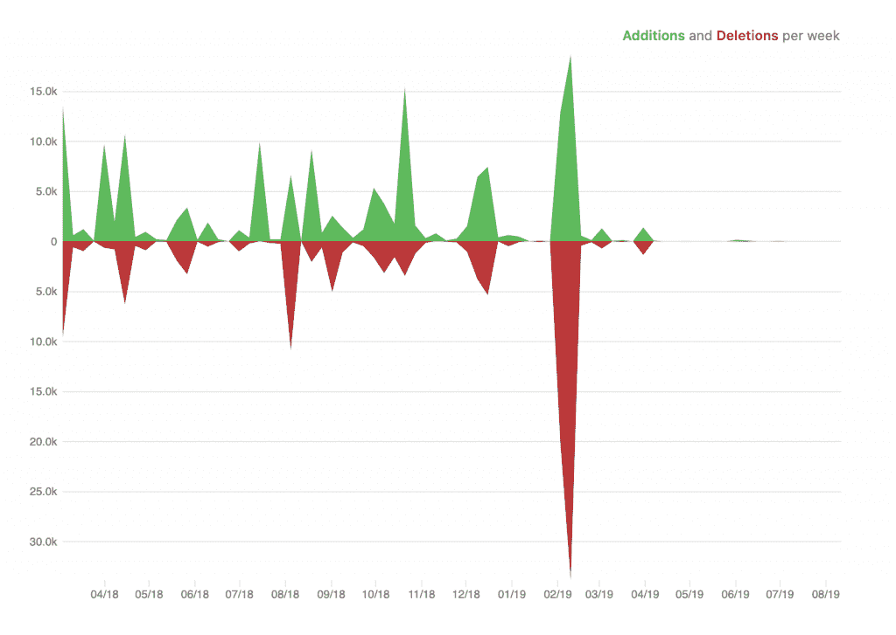
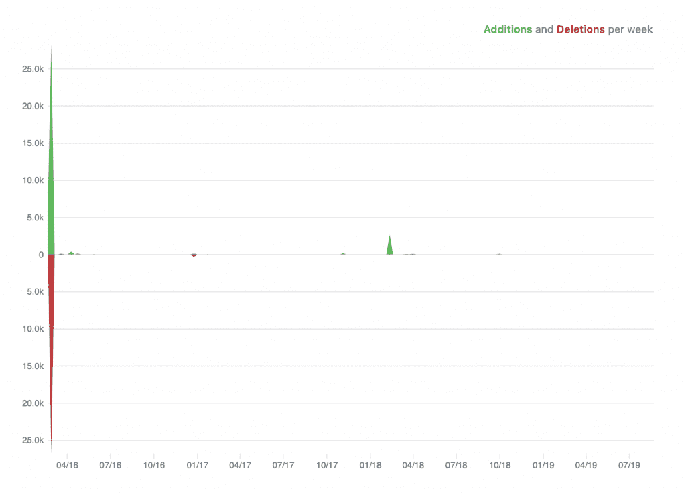

# React Spring vs 动画

> 原文：<https://blog.logrocket.com/react-spring-vs-animated/>

[动画](http://animatedjs.github.io/interactive-docs/)库旨在使动画流畅、强大、易于构建和维护。它侧重于输入和输出之间的声明性关系，中间有可配置的转换，以及简单的`start` / `stop`方法来控制基于时间的动画执行。

[React Spring](https://www.react-spring.io/) 可以看作是动画库的扩展版。它建立在 Animated 的基础上，使它更精简、更灵活。它继承了 [React Motion](https://github.com/chenglou/react-motion) 声明式 API，并不遗余力地对其进行简化。它有许多有用的原语，可以插入几乎所有内容，最后但同样重要的是，可以通过直接提交到 DOM 来制作动画，而不是逐帧重新渲染组件。

## 先决条件

为了正确理解本文，需要对以下技术有一个基本的了解:

## 设置动画

您可以使用 npm 将动画资源库添加到项目中:

```
npm install animated
```

然后将其导入到您的项目中，如下所示:

```
import Animated from 'animated/lib/targets/react-dom';
```

## 设置反作用弹簧

就像动画一样，您可以通过 npm 安装 React Spring 库，如下所示:

```
npm install react-spring
```

并将其导入到项目中，如下所示:

```
import { Spring } from 'react-spring'
```

## 平台目标

从 import 语句中可以看出，动画库专门针对 DOM:

```
import Animated from 'animated/lib/targets/react-dom';
```

与动画库不同，React Spring 允许您为 DOM 以外的目标进行构建:

```
// The default export is valid for react-native as well
import { Spring } from 'react-spring'

// react-konva
import { Spring } from 'react-spring/dist/konva'

// Any other target or platform
import { Spring } from 'react-spring/dist/universal'
```

## 插入文字

考虑一个旋转一段时间并通过插值分解成多个部分的动画长方体，动画库将在(0，4)之间的数字输入范围内对其进行插值，然后在(0 到 360 度)之间指定一组以度为单位的输出范围值:

```
// ... Animated
render() {
  return (
    <div className="App">
<Animated.div
  className="box"
  onClick={this.toggle}
  style={{
    transform: [{
    rotate: this.state.anim.interpolate({
    inputRange: [0, 4],
    outputRange: ["0deg", "360deg"]
  })
  }
],
position: "relative"
}}/>
  </div>
  );
}
```

使用 React Spring，`from`属性将旋转设置为稳定的“0 度”,并将其旋转 90%,这有助于更流畅和声明性的旋转:

```
// ... React Spring
render() {
  return (
    <div className="App">
<Spring
  from={{ rotation: "0deg" }}
  to={{ rotation: this.state.turn ? "0" : "90%" }}>

    {({ rotation }) => (
  <div
  className="box"
  style={{ transform: `rotate(${rotation})` }}
  onClick={this.toggle}>
    {this.state.deg}
  </div>
 )}
</Spring>
    </div>
  );
}
```

在这方面，如果您喜欢键入更少的代码并保持清晰的理解水平，React Springs 是最好的选择，因为它不仅仅处理数字。有了 React Spring，你几乎可以插入任何东西，从颜色到角度，相对长度，SVG 路径等等。

然而，如果您对传统的替代过程没有任何问题，包括键入尽可能多的代码，只插入相关的元素，并且通常坚持熟悉的路线，那么动画库在这里提供了一致性。

## 宣言的

React Spring 包含了 [React](https://blog.logrocket.com/10-mistakes-react-developers-make/) 的声明性质。它有一个简化的声明式 API，允许用几行代码创建复杂的动画。它还公开了一个命令式 API，以防您想要为动画过程手动指定唯一的控件。

### React Spring 中的声明:

```
// ... React Spring
class App extends React.Component {
state = { toggle: false };
handleToggle = () => this.setState(state => ({ toggle: !state.toggle }));
render() {
  return (
    <div className="App">
<Spring
  from={{ scale: 0.5 }}
  to={{ scale: this.state.toggle ? 0.5 : 1 }}>
    {({ scale }) => (
<div
style={{ transform: `scale(${scale})` }}
className="box"
onClick={this.handleToggle}/>
)}
</Spring>
  </div>
  );
  }
}
const rootElement = document.getElementById("root");
ReactDOM.render(<App />, rootElement);
```

另一方面，Animated 有一个命令式 API，这意味着创建动画将涉及一个相当手动的过程和更冗长的代码。

动画形式的声明:

### 从上面的例子来看，React Spring 的`to`和`from`属性使得将一个元素的`scale`属性从一种状态改变为另一种状态变得很容易，并且通过它，库相应地为元素制作动画。

```
// ... Animated
class App extends React.Component {
  state = { toggle: false, anim: new Animated.Value(1) };
  handleClick = () => {
    this.setState(
      state => ({ toggle: !state.toggle }),
      () => {
        this.state.toggle
          ? Animated.timing(this.state.anim, { toValue: 0.5 }).start()
          : Animated.timing(this.state.anim, { toValue: 1 }).start();
   }
  );
};
render() {
  return (
  <div className="App">
    <Animated.div
      className="box"
      style={{ transform: [{ scale: this.state.anim }] }}
      onClick={this.handleClick}/>
  </div>
  );
  }
}
const rootElement = document.getElementById("root");
ReactDOM.render(<App />, rootElement);
```

对于动画，我们必须在组件的状态中设置一个初始的`anim`值，并用`Animated.timing`方法中的`toValue`更新它，然后在库可以执行动画之前调用它的`start`方法。

基元

React Spring 包含像`<Spring>`、`<Trail>`、`<Transition>`、`<Parallax>`这样的原语，用于轨迹、过渡、视差等等动画。这些原语有助于您实现原语动画，而无需手动编写所有必需的逻辑。

## 就像声明一样，动画不包含原语。为了实现原始动画，您必须手动创建所需的动画，这涉及到编写更多的代码行。

表演

由于 React Spring 是动画库的增强形式，它利用其应用动画的能力，而不依赖 React 来逐帧渲染更新，使其具有很高的性能。动画库弥补了性能上的不足，因为它还将对动画的更新直接应用到了一个`requestAnimationFrame`中的 DOM，这确保了动画在所需的帧内渲染，并且不会导致“抖动”。

## 与动画库相比，React Spring 覆盖了更多领域，因为它结合了动画库和 React Motion 的现有成果，提供了一个更强大的动画系统。

宣言的

基元

| 插值 | 表演 | Animated | ❌ | ❌ |
| --- | --- | --- | --- | --- |
| ✅ | ✅ | React-spring | ✅ | ✅ |
| ✅ | ✅ | 如果从设计上来说，你对动画中的声明和原语没有明确的需求，那么 Animated 的性能足以用它提供的丰富的插值特性构建出你理想的动画。然而，如果你想把它们都放在一起，React Spring 可以提供更多的声明和原语。 | 易用性 | 正如我们在本文开始时所展示的，开始使用这两个库非常简单，然而，大多数关于 Animated 及其提供的特性的非常有用的信息都可以在 [React 原生文档](https://facebook.github.io/react-native/docs/getting-started.html)中找到，这使得在搜索关于 Animated 的其他信息的学习资源时有点棘手。[文档](https://facebook.github.io/react-native/docs/animations)没有为没有动画知识的人提供简单的入门步骤。 |

然而，React Spring 有丰富的[文档](https://www.react-spring.io/)，其中有几个例子，为学习如何在 React 中使用该库制作动画提供了更简单的指导。还有几个 React [春季教程](https://blog.logrocket.com/animations-with-react-spring/)和[文章在线](https://scotch.io/tutorials/create-animated-react-apps-with-react-spring)。

## 社区支持

React Spring 的 GitHub 上有大约 94 名贡献者和 13.9k 名明星，相比之下，[动画](https://github.com/animatedjs/animated)有大约 10 名贡献者和 9k 名明星，React Spring 拥有更强的社区支持，尽管与[动画](https://github.com/animatedjs/animated)相比非常新。自诞生以来，React Spring 在 React 开发者生态系统中的贡献比 Animated 大得多。

React Spring 也有支持者和赞助商，他们捐赠资金来支持和确保它的持续发展。下面是这两种技术根据其 Github 库的代码频率图。

## React Spring 也有更多的主动代码贡献，正如上面的图片所示，这表明它很可能已经看到了更多的改进，以赶上 JavaScript 的快速增长。

最后的想法

React Spring 和 Animated 都是很棒的动画工具，可以帮助我们创造良好的用户体验。在它们之间进行选择完全取决于您的项目需求和架构。值得注意的是，这篇文章并不是为了炒作或贬低这些工具，而是为了让你更好地了解它们的优势和劣势，从而做出明智的决定。干杯！



React Spring code frequency



Animated code frequency

## [LogRocket](https://lp.logrocket.com/blg/react-signup-general) :全面了解您的生产 React 应用

调试 React 应用程序可能很困难，尤其是当用户遇到难以重现的问题时。如果您对监视和跟踪 Redux 状态、自动显示 JavaScript 错误以及跟踪缓慢的网络请求和组件加载时间感兴趣，

.

## LogRocket 结合了会话回放、产品分析和错误跟踪，使软件团队能够创建理想的 web 和移动产品体验。这对你来说意味着什么？

LogRocket 不是猜测错误发生的原因，也不是要求用户提供截图和日志转储，而是让您回放问题，就像它们发生在您自己的浏览器中一样，以快速了解哪里出错了。

[try LogRocket](https://lp.logrocket.com/blg/react-signup-general)

不再有嘈杂的警报。智能错误跟踪允许您对问题进行分类，然后从中学习。获得有影响的用户问题的通知，而不是误报。警报越少，有用的信号越多。

[ ](https://lp.logrocket.com/blg/react-signup-general) [](https://lp.logrocket.com/blg/react-signup-general) 

LogRocket Redux 中间件包为您的用户会话增加了一层额外的可见性。LogRocket 记录 Redux 存储中的所有操作和状态。

现代化您调试 React 应用的方式— [开始免费监控](https://lp.logrocket.com/blg/react-signup-general)。

No more noisy alerting. Smart error tracking lets you triage and categorize issues, then learns from this. Get notified of impactful user issues, not false positives. Less alerts, way more useful signal.

The LogRocket Redux middleware package adds an extra layer of visibility into your user sessions. LogRocket logs all actions and state from your Redux stores.

Modernize how you debug your React apps — [start monitoring for free](https://lp.logrocket.com/blg/react-signup-general).