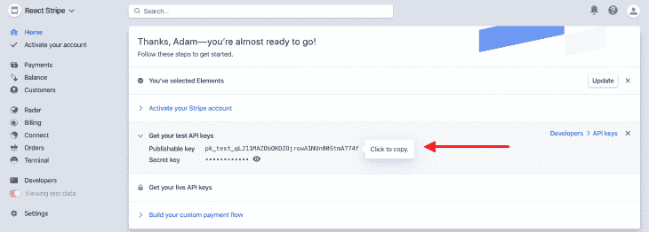
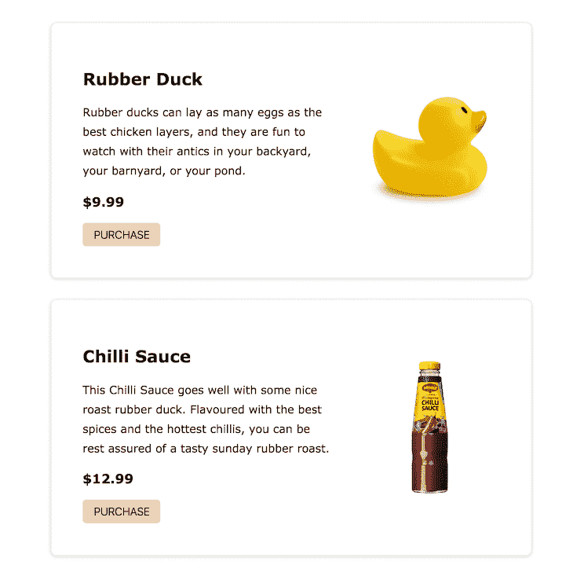
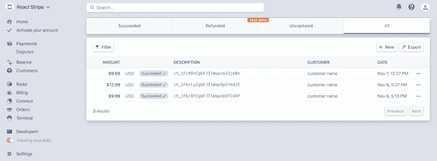

# React 和 Stripe 支付系统教程- LogRocket 博客

> 原文：<https://blog.logrocket.com/react-stripe-payment-system-tutorial/>

***编者按*** : *本帖最后更新于 2021 年 9 月 14 日，旨在改进代码并更新任何过时的信息。*

Stripe 是一套 API，可以轻松设置在线支付处理，在本文中，我们将利用 Stripe 创建一个使用 React 的基本支付系统。

无论您是在实施基于订阅的服务、电子商务商店还是众筹解决方案，Stripe 都能提供完成任务的灵活性。我们将建立一个小型的概念验证支付系统，以实现网站上的一次性购买。

本教程结束时，您应该能够在 React 应用程序中设置处理在线支付的后端和前端。

## 条带化和反应教程要求

本教程要求您具备以下条件:

1.  安装在计算机上的 Node.js
2.  Stripe 开发人员帐户
3.  Express.js 的基础知识
4.  [反应钩的基础知识](https://blog.logrocket.com/practical-react-hooks-how-to-refactor-your-app-to-use-hooks-b1867e7b0a53/)

如果没有安装 Node，可以从[官网](https://nodejs.org/en/)获取最新版本。本教程写的所有代码[都可以在这里](https://github.com/philipszdavido/react-stripe-payment)访问。

## 设置 Stripe 帐户需要什么？

如果你没有 Stripe 开发者账户，你可以在这里注册一个[账户免费使用。注册后，完成以下步骤进行设置:](https://dashboard.stripe.com/register)

*   在**上选择**开发者集成**你想如何开始？**莫代尔
*   选择**在下一个模式下仅接受付款**
*   勾选下一模式的**一次性付款**选项
*   最后，检查**在最后一个模型上构建一个自定义支付流**

您现在应该已经建立了一个基本帐户。您可以通过点击页面左上角的**添加名称**链接来更新帐户名称。

您需要从仪表板上复制您的可发布密钥和秘密密钥，并将它们存储在某个地方，因为我们很快就会需要它们。



## 用 Express.js 构建支付服务器

在我们继续构建 React 应用程序之前，我们需要设置一个服务器来处理支付请求。

我们需要在 Express 服务器上设置一个 RESTful 端点，它将充当 React 代码和 Stripe 后端之间的中间人。如果您以前从未构建过 API，不要担心——这将是非常基础的，因为我们没有实现生产就绪的后端。

让我们开始吧。首先，创建一个新的项目文件夹，想怎么命名就怎么命名(我用`react-stripe-payment`)。在文件夹中打开您的终端并运行`npm init -y`。

接下来，通过运行`npm install express dotenv body-parser stripe`安装依赖项，并通过运行`mkdir src`在根文件夹下创建一个`src`文件夹。

### 使用`server.js`创建服务器

让我们创建一个服务器来监听支付请求。在`src`文件夹下创建一个名为`server.js`的新文件，并将以下内容粘贴到其中:

```
const path = require('path')
const express = require('express')
const bodyParser = require('body-parser')
require('dotenv').config()
const postCharge = require('./stripe')

const app = express()
const router = express.Router()
const port = process.env.PORT || 7000

router.post('/stripe/charge', postCharge)
router.all('*', (_, res) =&gt;
  res.json({ message: 'please make a POST request to /stripe/charge' })
)
app.use((_, res, next) =&gt; {
  res.header('Access-Control-Allow-Origin', '*')
  res.header(
    'Access-Control-Allow-Headers',
    'Origin, X-Requested-With, Content-Type, Accept'
  )
  next()
})
app.use(bodyParser.json())
app.use('/api', router)
app.use(express.static(path.join(__dirname, '../build')))

app.get('*', (_, res) =&gt; {
  res.sendFile(path.resolve(__dirname, '../build/index.html'))
})

app.listen(port, () =&gt; console.log(`server running on port ${port}`))

```

让我们一节一节地分解这个文件。在这里，我们正在导入所需的包。注意，除了从名为`stripe`的文件导入的`postCharge`，它们都是第三方导入。我们稍后将创建该文件:

```
const path = require('path')
const express = require('express')
const bodyParser = require('body-parser')
require('dotenv').config()
const postCharge = require('./stripe')

```

`dotenv`允许我们[从节点进程](https://blog.logrocket.com/customizing-node-js-env-files/)中读取敏感信息，这样我们就不必在代码中硬编码秘密值。

然后，我们将一个新的 Express 实例初始化到一个名为`app`的变量中，并创建一个新的`Router`实例，将其存储在一个名为`router`的变量中。这是我们将用来定义支付端点的内容:

```
const app = express()
const router = express.Router()
const port = process.env.PORT || 7000

```

然后，我们初始化一个名为`port`的新变量，并从节点进程(`process.env.PORT`)中给它赋值，如果是`undefined`，就给它赋值`7000`。

还记得我们之前初始化的路由器吗？在第一行中，我们设置了一个名为`/stripe/charge`的端点，并分配`postCharge`来处理这个路由的所有`POST`请求。

然后，我们可以捕捉所有其他对服务器的请求，并用一个 JSON 对象进行响应，该对象包含一条将用户定向到适当端点的消息:

```
router.post('/stripe/charge', postCharge)
router.all('*', (_, res) =&gt;
  res.json({ message: 'please make a POST request to /stripe/charge' })
)
app.use((_, res, next) =&gt; {
  res.header('Access-Control-Allow-Origin', '*')
  res.header(
    'Access-Control-Allow-Headers',
    'Origin, X-Requested-With, Content-Type, Accept'
  )
  next()
})
app.use(bodyParser.json())
app.use('/api', router)
app.use(express.static(path.join(__dirname, '../build')))

```

接下来，我们在 app 实例上定义一个中间件来为所有请求启用 CORS。在下面一行中，我们附加了另一个中间件，使我们能够从请求体中解析 JSON 对象。

我们告诉我们的应用程序实例使用`router`实例来处理对`/api`端点的所有请求，然后告诉 Express 提供`/build`文件夹。这个文件夹将保存应用程序前端的编译代码。

我们还需要告诉应用程序实例通过服务位于`/build`文件夹中的`index.html`文件来处理所有的`GET`请求。这就是我们如何[在生产](https://create-react-app.dev/docs/deployment/#other-solutions)中为前端服务。

最后，我们在前面定义的端口上启动服务器，并在成功启动时向控制台记录一条消息:

```
app.get('*', (_, res) =&gt; {
  res.sendFile(path.resolve(__dirname, '../build/index.html'))
})

app.listen(port, () =&gt; console.log(`server running on port ${port}`))

```

### 使用`stripe.js`创建`postCharge`处理程序

我们现在将创建我们在上面的`server.js`中需要的`postCharge`处理程序。在`src`文件夹下，创建一个新文件`stripe.js`，并粘贴以下内容:

```
const stripe = require('stripe')(&lt;your_secret_key&gt;)

async function postCharge(req, res) {
  try {
    const { amount, source, receipt_email } = req.body

    const charge = await stripe.charges.create({
      amount,
      currency: 'usd',
      source,
      receipt_email
    })

    if (!charge) throw new Error('charge unsuccessful')

    res.status(200).json({
      charge,
      message: 'charge posted successfully'
    })
  } catch (error) {
    res.status(500).json({
      message: error.message
    })
  }
}

module.exports = postCharge

```

我们来分解一下。这里，我们初始化一个新的 Stripe 实例，方法是需要`stripe`包并用我们之前作为字符串复制的秘密密钥调用它。我们将这个实例保存在一个名为`stripe`的变量中:

```
const stripe = require('stripe')(&lt;your_secret_key&gt;)

```

然后我们创建一个名为`postCharge`的新函数。这个函数是一个请求处理器，所以我们必须接受两个参数:`req`和`res`。

在这个函数中打开一个`try catch`块，我们析构了所有我们期望与请求对象的请求一起发送的变量；在这种情况下，这些变量是`amount`、`source`和`receipt_email`。

然后，我们必须创建一个名为`charge`的新变量，它保存对 Stripe API 的异步调用的结果，以创建新的费用(`stripe.charges.create`):

```
async function postCharge(req, res) {
  try {
    const { amount, source, receipt_email } = req.body

    const charge = await stripe.charges.create({
      amount,
      currency: 'usd',
      source,
      receipt_email
    })

```

如果 Stripe 调用的结果是一个 falsy 值，在这种情况下，这意味着我们的支付请求失败，我们抛出一个新的错误，消息为`charge unsuccessful`:

```
if (!charge) throw new Error('charge unsuccessful')

```

否则，我们用一个`200`状态代码和一个包含消息和费用对象的 JSON 对象来响应请求。

```
res.status(200).json({
  charge,
  message: 'charge posted successfully'
})

```

在`catch`块中，我们拦截所有其他错误，并将其发送给客户端，同时附上一个`500`状态代码和一条包含错误消息的消息。

在文件的最后，我们使用`module.exports`导出`postCharge`函数:

```
} catch (error) {
    res.status(500).json({
      message: error.message
    })
  }
}

module.exports = postCharge

```

这就是支付服务器的全部内容。当然，这不是生产就绪，不应该在处理实际支付的实际应用程序中使用，但对于我们当前的用例来说已经足够了。让我们转到前端。

## 如何用 React 构建一个前端？

既然我们已经完成了支付服务器的构建，是时候充实前端了。它不会是任何花哨的东西，因为我试图保持这个教程咬大小。

* * *

### 更多来自 LogRocket 的精彩文章:

* * *

以下是该应用程序的不同组件:

*   路由器组件
*   产品列表组件
*   结帐表单组件

让我们开始吧。

首先，运行以下命令安装所需的软件包:

```
npm install axios babel-polyfill history parcel parcel-bundler react react-dom react-router-dom react-stripe-elements

```

然后，在项目根目录中，运行以下命令:

```
mkdir public &amp;&amp; touch public/index.html

```

这将创建一个名为`public`的文件夹，并在这个新文件夹中创建一个`index.html`文件。打开`index.html`文件并粘贴以下内容:

```
<!DOCTYPE html>
<html lang="en">
  <head>
    <meta charset="utf-8" />
    <meta name="viewport" content="width=device-width, initial-scale=1" />
    <meta name="description" content="React + Stripe" />
    <title>React and Stripe Payment</title>
  </head>
  <body>
    <noscript>You need to enable JavaScript to run this app.</noscript>
    <div id="root"></div>
    <script src="https://js.stripe.com/v3/"></script>
    <script src="../src/index.js"></script>
  </body>
</html>

```

如果您已经熟悉 React，这应该不是什么新鲜事；这简直就是我们 app 的切入点。还要注意，我们在第一个`<script>`标签中导入了 Stripe SDK——Stripe SDK 的导入必须在我们自己的代码之前。

在`src`文件夹中，运行以下命令:

```
touch src/index.js &amp;&amp; touch src/products.js

```

然后，打开`index.js`并粘贴以下内容:

```
import React from 'react'
import ReactDOM from 'react-dom'
import App from './components/App'
import 'babel-polyfill'

const rootNode = document.querySelector('#root')
ReactDOM.render(&lt;App /&gt;, rootNode)

```

现在我们需要从某个地方获取产品列表。通常，这可能来自数据库或一些 API，但是对于这个简单的用例，我们可以在一个 JavaScript 文件中硬编码两到三个产品。这就是为什么我们需要`products.js`。打开它并粘贴以下内容:

```
export const products = [
  {
    name: 'Rubber Duck',
    desc: `Rubber ducks can lay as many eggs as the best chicken layers, and they
  are fun to watch with their antics in your backyard, your barnyard, or
  your pond.`,
    price: 9.99,
    img:
      'https://encrypted-tbn0.gstatic.com/images?q=tbn%3AANd9GcSqkN8wkHiAuT2FQ14AsJFgihZDzKmS6OHQ6eMiC63rW8CRDcbK',
    id: 100
  },
  {
    name: 'Chilli Sauce',
    desc: `This Chilli Sauce goes well with some nice roast rubber duck. Flavored with
    the best spices and the hottest chillis, you can rest assured of a tasty Sunday
    rubber roast.`,
    price: 12.99,
    img:
      'https://encrypted-tbn0.gstatic.com/images?q=tbn%3AANd9GcRTREm1dEzdI__xc6O8eAz5-4s88SP-Gg9dWYMkBKltGMi84RW5',
    id: 101
  }
]

```

这是一系列可供购买的产品。我们可以添加任意多的组件，然后继续创建组件。

从项目根目录运行`mkdir src/components`。这将在`src`文件夹中创建一个名为`components`的新文件夹来存放我们的 React 组件。让我们继续创建第一个组件。

### 创建`App.jsx`组件

这是根组件，将路由到我们的应用程序中的各个页面。首先在`components`文件夹中创建一个名为`App.jsx`的新文件，然后粘贴以下内容:

```
import React, { useState } from 'react'
import { Router, Route, Switch } from 'react-router-dom'
import { createBrowserHistory } from 'history'
import Products from './Products'
import Checkout from './Checkout'
import { products } from '../products'

const history = createBrowserHistory()

const App = () => {
  const [selectedProduct, setSelectedProduct] = useState(null)

  return (
    <Router history={history}>
      <Switch>
        <Route
          exact
          path="/"
          render={() => (
            <Products
              products={products}
              selectProduct={setSelectedProduct}
              history={history}
            />
          )}
        />
        <Route
          path="/checkout"
          render={() => (
            <Checkout
              selectedProduct={selectedProduct}
              history={history}
            />
          )}
        />
      </Switch>
    </Router>
  )
}

export default App

```

我们来分解一下。

第一部分只是一堆依赖项导入。任何单页面 React 应用程序都需要前三个导入。接下来的两个导入是自定义组件，我们将在后面编写。

最后一个导入是我们之前创建的硬编码产品。我们将把它作为道具传递给`Products`组件:

```
import React, { useState } from 'react'
import { Router, Route, Switch } from 'react-router-dom'
import { createBrowserHistory } from 'history'
import Products from './Products'
import Checkout from './Checkout'
import { products } from '../products'

const history = createBrowserHistory()

```

最后，我们从`history`包中创建一个新的历史实例，并将其保存在一个名为 history 的变量中。

然后我们创建一个名为`App`的新功能组件。`App`有一个名为`selectedProduct`的[状态变量](https://blog.logrocket.com/a-guide-to-usestate-in-react-ecb9952e406c/)，保存当前选择购买的产品:

```
const App = () => {
  const [selectedProduct, setSelectedProduct] = useState(null)

  return (
    <Router history={history}>
      <Switch>
        <Route
          exact
          path="/"
          render={() => (
            <Products
              products={products}
              selectProduct={setSelectedProduct}
              history={history}
            />
          )}
        />
        <Route
          path="/checkout"
          render={() => (
            <Checkout
              selectedProduct={selectedProduct}
              history={history}
            />
          )}
        />
      </Switch>
    </Router>
  )
}

export default App

```

我们返回一个`Router`实例，它定义了所有的路线和它们各自的组件。

在第一个路径`/`中，我们呈现了`Products`组件，并传入了三个属性:硬编码产品的列表、将产品设置为`App`状态的函数，以及使我们能够导航到新页面而不破坏浏览器历史的历史对象。

在第二个路径`/checkout`中，我们呈现了`Checkout`组件，并传入了两个道具:当前选择的产品和`history`对象。

在文件的最后，我们导出`App`组件作为默认导出。

### 创建`Products.jsx`组件

`Products.jsx`组件负责将产品列表呈现给 DOM，这相当简单。在`components`文件夹中创建一个名为`Products.jsx`的新文件，并粘贴如下内容:

```
import React from 'react'
import './Products.scss'

const Products = ({ products, selectProduct, history }) => {
  const handlePurchase = prod => () => {
    selectProduct(prod)
    history.push('/checkout')
  }

  return products.map(prod => (
    <div className="product" key={prod.id}>
      <section>
        <h2>{prod.name}</h2>
        <p>{prod.desc}</p>
        <h3>{'$' + prod.price}</h3>
        <button type="button" onClick={handlePurchase(prod)}>
          PURCHASE
        </button>
      </section>
      
    </div>
  ))
}

export default Products

```

注意，我们可以在这里得到`[Products.scss](https://github.com/philipszdavido/react-stripe-payment/blob/main/src/components/Products.scss)` [的内容。](https://github.com/philipszdavido/react-stripe-payment/blob/main/src/components/Products.scss)

我们来分解一下。我们首先定义一个功能组件，它包含三个要素:

*   `products`
*   `selectProduct`
*   `history`

```
const Products = ({ products, selectProduct, history }) => {
  const handlePurchase = prod => () => {
    selectProduct(prod)
    history.push('/checkout')
  }

```

`products`是我们之前硬编码的产品阵列。稍后我们将映射这个数组，以将单个产品呈现到 DOM 中。

`selectProduct`是接受单个产品对象的函数。它更新`App`组件的状态来保存这个产品，以便`Checkout`组件可以通过它的 props 访问它。

`history`是允许我们安全导航到其他路线的历史对象。

然后我们定义了`handlePurchase`函数，当用户想要购买某个产品时会调用这个函数。它接受一个参数`prod`，并用这个参数调用`selectProduct`。

调用`selectProduct`后，通过调用`history.push`导航到`/checkout`路线。

是时候将产品呈现给 DOM 了。我们映射到`products`数组，对于数组中的每个产品，返回一组 JSX:

```
return products.map(prod => (
    <div className="product" key={prod.id}>
      <section>
        <h2>{prod.name}</h2>
        <p>{prod.desc}</p>
        <h3>{'$' + prod.price}</h3>
        <button type="button" onClick={handlePurchase(prod)}>
          PURCHASE
        </button>
      </section>
      
    </div>
  ))
}

export default Products

```

JSX 应该非常简单，并将在屏幕上显示如下图像:



### 创建`Checkout.jsx`组件

接下来，我们想要创建一个结帐页面，当用户点击产品上的**购买**按钮时，他们将被转到这个页面。

在`components`文件夹下创建一个`Checkout.jsx`文件，并将以下内容粘贴到其中:

```
import React, { useEffect } from 'react'
import { StripeProvider, Elements } from 'react-stripe-elements'
import CheckoutForm from './CheckoutForm'

const Checkout = ({ selectedProduct, history }) => {
  useEffect(() => {
    window.scrollTo(0, 0)
  }, [])

  return (
    <StripeProvider apiKey="pk_test_UrBUzJWPNse3I03Bsaxh6WFX00r6rJ1YCq">
      <Elements>
        <CheckoutForm selectedProduct={selectedProduct} history={history} />
      </Elements>
    </StripeProvider>
  )
}

export default Checkout

```

这就是我们开始将 Stripe 引入组合的时候。在第二行，我们从本节开始时安装的`react-stripe-elements`包中导入了名为`StripeProvider`和`Elements`的东西。

我们的应用程序需要使用`StripeProvider`来访问条带对象；任何与 Stripe 对象交互的组件都必须是`StripeProvider`的子组件。

`[Elements](https://blog.logrocket.com/integrating-stripe-react-stripe-js/)` [是一个 React 组件](https://blog.logrocket.com/integrating-stripe-react-stripe-js/#stripe-elements)，它包装了实际的结账表单。它有助于将一组[条带元素](https://stripe.com/payments/elements)组合在一起，并使标记来自每个条带元素的所有数据变得容易。

组件本身相当简单。它接受两个道具，`selectedProduct`和`history`，并传递给我们接下来要创建的`CheckoutForm`组件。

还有一个`useEffect`调用，在页面第一次装载时将文档滚动到顶部。这是必要的，因为当我们切换路线时,`react-router-dom`保持先前的滚动状态。

请注意，我们正在将一个道具`apiKey`传递给`StripeProvider`。这个密钥是我们之前在设置 Stripe 时复制的可发布密钥。请注意，这个属性是必需的，因为它是向条带服务器验证我们的应用程序的一种方式。

### 创建`CheckoutForm.jsx`组件

这是我们将要创建的最后一个组件，也是最重要的。`CheckoutForm`组件保存输入，用于获取用户卡的详细信息，以及调用后端来处理支付费用。

为此，在`components`目录中创建一个名为`CheckoutForm.jsx`的新文件。我们将一节一节地检查这个文件的内容。

首先，我们将所需的包导入到文件中。注意从`react-stripe-elements`包的导入:

```
import React, { useState } from 'react'
import { Link } from 'react-router-dom'
import {
  CardNumberElement,
  CardExpiryElement,
  CardCVCElement,
  injectStripe
} from 'react-stripe-elements'
import axios from 'axios'
import './CheckoutForm.scss'
...to be continued below...

```

这是一个谈论 Stripe 元素的好时机:Stripe 元素是一组预构建的 UI 元素，允许我们收集用户的卡信息，而无需我们自己管理这些敏感信息。

`react-stripe-elements`包是 Stripe 元素的包装器，它将这些元素公开为 React 组件，我们只需将它们插入到我们的应用程序中即可——无需从头开始创建它们。

我们将其中一些组件和一个高阶组件(HOC)，`injectStripe`一起导入到这个文件中。

`injectStripe`基本上接受在`StripeProvider`组件中初始化的 Stripe 对象，并将该对象注入到任何用它包装的组件中。这是我们访问条带对象的方式。

然后我们导入一个名为`axios`的包。 [Axios 只是一个基于承诺的浏览器 HTTP 客户端](https://blog.logrocket.com/how-to-make-http-requests-like-a-pro-with-axios/)，我们将使用它与我们的支付服务器进行通信。我们可以从这里得到 `[CheckoutForm.scss](https://github.com/philipszdavido/react-stripe-payment/blob/main/src/components/CheckoutForm.scss)` [的](https://github.com/philipszdavido/react-stripe-payment/blob/main/src/components/CheckoutForm.scss)[内容](https://github.com/philipszdavido/react-stripe-payment/blob/main/src/components/CheckoutForm.scss):

```
...continued...
const CheckoutForm = ({ selectedProduct, stripe, history }) =&gt; {
  if (selectedProduct === null) history.push('/')

  const [receiptUrl, setReceiptUrl] = useState('')

  const handleSubmit = async event =&gt; {
    event.preventDefault()

    const { token } = await stripe.createToken()

    const order = await axios.post('http://localhost:7000/api/stripe/charge', {
      amount: selectedProduct.price.toString().replace('.', ''),
      source: token.id,
      receipt_email: '[email protected]'
    })

    setReceiptUrl(order.data.charge.receipt_url)
  }
...to be continued...

```

接下来是实际的`CheckoutForm`组件本身。它需要三个道具:

1.  `selectedProduct`
2.  `stripe`
3.  `history`

`selectedProduct`是用户点击购买的产品。它来自根`App`组件的状态，并作为道具传递下来。

`stripe`是我们导入的`injectStripe` HOC 作为道具注入的实际条纹对象。而且，我们已经知道`history`是做什么的。

我们在组件中做的第一件事是检查`selectedProduct`是否确实存在。如果没有，我们会将用户转到主页。在生产级应用程序中，这可能会由一个[路由保护特设](https://tylermcginnis.com/react-router-protected-routes-authentication/)来处理。

然后我们定义一个新的状态来保存成功支付的收据 URL。它最初是空的。

接下来，我们必须定义一个名为`handleSubmit`的函数，该函数在提交结账表单时(即点击**支付**按钮时)被调用。我们来看看这个函数。

#### 定义`handleSubmit`

首先，我们必须防止`form`元素的默认行为，这样页面就不会刷新。然后我们可以从对`stripe.createToken`的异步调用结果中析构一个`token`值。

`createToken`标记表单中的卡信息，并将其发送到条带服务器。然后它返回一个`token`对象，在这里我们可以得到一个`token.id`值作为实际卡信息的别名。

这确保了我们永远不会将用户的卡细节发送到支付服务器。

其次，我们必须向`localhost:7000/api/stripe/charge`发出一个 HTTP `POST`请求，请求体包含三个内容:

1.  `amount`
2.  `source`
3.  `receipt_email`

`amount`是所购商品的价格。我们必须将它转换成一个字符串，并删除所有特殊字符，如`.`和`,`。这意味着 9.99 美元的成本将作为`999`发送到支付服务器。

`source`是支付费用的地方。在我们的例子中，它将是我们刚刚生成的令牌的 ID。

最后，`receipt_email`是发送付款收据的地方。它通常是客户的电子邮件地址，但是在我们的例子中，我们只是硬编码它，因为我们没有实现身份验证。

请求完成后，我们可以从响应对象中获取收据的 URL，并将其设置为 state。这是假设没有错误，因此在生产级应用程序中，我们通常会实现错误处理:

```
...continued...
if (receiptUrl) {
    return (
      <div className="success">
        <h2>Payment Successful!</h2>
        <a href={receiptUrl}>View Receipt</a>
        <Link to="/">Home</Link>
      </div>
    )
  }
...to be continued...

```

#### 检查`recieptyUrl`

紧接在`handleSubmit`函数之后，我们有一个`if`检查来查看是否有一个`receiptUrl`在状态中。如果有，我们希望呈现一个包含成功消息、查看收据的链接和返回主页的链接的`div`:

```
...continued...
  return (
    <div className="checkout-form">
      <p>Amount: ${selectedProduct.price}</p>
      <form onSubmit={handleSubmit}>
        <label>
          Card details
          <CardNumberElement />
        </label>
        <label>
          Expiration date
          <CardExpiryElement />
        </label>
        <label>
          CVC
          <CardCVCElement />
        </label>
        <button type="submit" className="order-button">
          Pay
        </button>
      </form>
    </div>
  )
}

export default injectStripe(CheckoutForm)

```

否则我们。必须呈现实际的结帐表单。这里，我们使用预构建的`Elements`组件，而不是从头开始重新创建它们，并且必须管理敏感信息。

在这个文件的最后，我们将`CheckoutForm`组件包装在`injectStripe` HOC 中，这样我们就可以访问我们在组件中使用的 Stripe 对象。

## 测试我们的 React 应用

让我们回顾一下到目前为止我们已经完成的工作:

1.  我们已经创建了一个与 Stripe 通信的支付服务器
2.  我们已经创建了一个主页来列出我们的产品
3.  我们已经创建了一个结帐页面来获取用户的付款细节
4.  我们已经创建了一个`handleSubmit`函数，向服务器发送请求来处理支付费用

我们几乎已经设置好了一切，所以是时候实际运行我们的应用程序，看看我们是否能够购买一个橡胶鸭。我们必须先添加我们的脚本，所以打开`package.json`文件，用以下内容替换`scripts`部分:

```
"scripts": {
    "build": "parcel build public/index.html --out-dir build --no-source-maps",
    "dev": "node src/server.js &amp; parcel public/index.html",
    "start": "node src/server.js"
  },

```

打开终端，运行`npm run` `build`命令构建 app，然后运行`npm run dev`。这将启动支付服务器，并在端口 1234 上显示前端。如果没有`.env`文件，服务器会在端口 7000 暴露前端。

接下来，打开浏览器，视情况导航至`[http://localhost:1234](http://localhost:1234)`或`[http://localhost:7000](http://localhost:7000)`，并遵循以下步骤:

*   点击任何产品上的**购买**按钮
*   在结账页面中，在**卡详细信息**字段填写 **4242 4242 4242 4242**
*   填写任何到期日期，并选择一个随机的 CVC 值
*   点击**支付**

如果一切顺利，我们应该会看到一条**付款成功**的消息，其中包含查看收据和返回主页的链接。

要确认付款，请登录您的 Stripe 仪表盘，点击**付款**，您应该会在那里看到付款。



## 结论

这是一个使用 Stripe 的支付系统的非常简化的(并且肯定不适合生产)实现。让我们总结一下真正的生产就绪型实施所需的必要组件，以防您想尝试一下:

1.  一个更强大的支付服务器，具有适当的认证([想到 JWT](https://blog.logrocket.com/jwt-authentication-best-practices/))和验证
2.  一个捕获和保存客户详细信息的流程，以便于将来计费
3.  利用 Stripe 的欺诈检测服务来决定应该处理哪些支付
4.  客户端有更好的用户界面和 UX
5.  客户端强大的错误处理

虽然本教程应该足以让您入门，但它还不足以构建一个成熟的支付解决方案，所以请花一些时间阅读 [Stripe 文档](https://stripe.com/docs)。

## [LogRocket](https://lp.logrocket.com/blg/ecommerce-signup) :看看用户为什么不完成你的电子商务流程中的一个步骤的技术和 UX 原因。

[](https://lp.logrocket.com/blg/ecommerce-signup)

LogRocket 就像是一个网络和移动应用程序和网站的 DVR，记录你的电子商务应用程序上发生的一切。LogRocket 没有猜测用户不转化的原因，而是主动揭示了阻止你转化的根本原因，比如 JavaScript 错误或死点击。LogRocket 还可以监控应用的性能，报告客户端 CPU 负载、客户端内存使用等指标。

开始主动监控您的电子商务应用程序— [免费试用](https://lp.logrocket.com/blg/ecommerce-signup)。