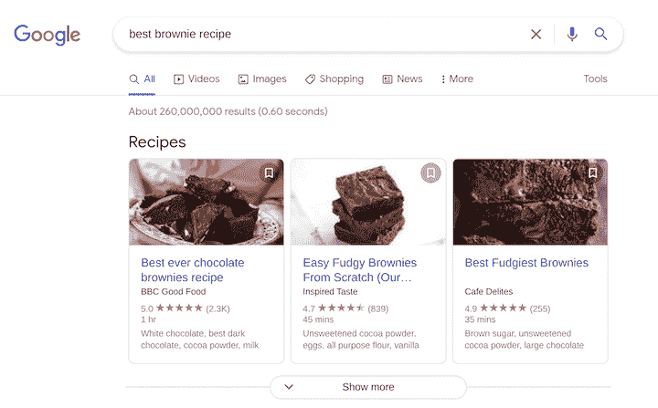
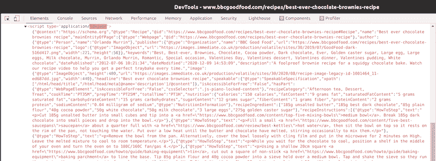
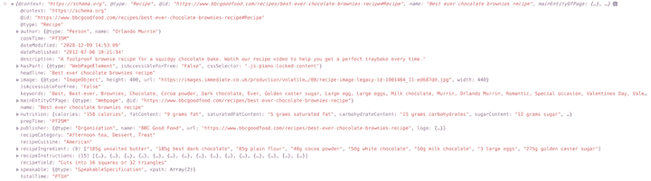
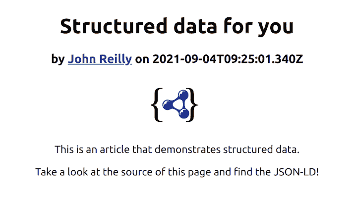
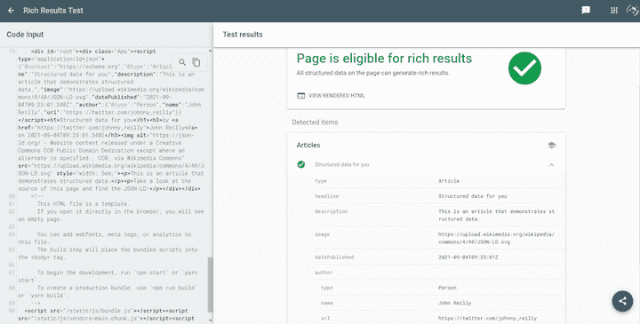

# React、结构化数据和 SEO - LogRocket 博客

> 原文：<https://blog.logrocket.com/react-structured-data-and-seo/>

如果你有一个网站，让它被发现是最重要的。在本指南中，我们将向您展示如何向您的站点添加结构化数据。

添加结构化数据有助于谷歌等搜索引擎理解你的内容，并让它出现在更多的眼球面前。我们将通过构建一个包含结构化数据的简单 React 应用程序来说明这是如何工作的。

## 什么是结构化数据？

Google，DuckDuckGo，和其他搜索引擎在理解网站内容方面都很精通。然而，抓取 HTML 并不是一种特别可靠的内容分类方式。HTML 完全是关于表现的，它可以用多种方式构建。

为了使搜索引擎更容易理解您站点的内容，您可以在页面中嵌入一种称为结构化数据的标准化格式。这种标准化格式允许您显式声明页面包含的内容类型。

假设你写了一篇文章。你可以用一种谷歌能理解的语言可靠地陈述，“这个页面是一篇有这个标题、描述和图片的文章，发表于这个日期。”

有数百种类型的结构化数据可用。你可以在由搜索引擎社区代表维护的 Schema.org 网站上深入了解所有这些内容。

有许多类型的结构化数据可用，从流行的选项到那些更适合的选项。例如，你可能会比使用[分子特性](https://schema.org/MolecularEntity)更频繁地使用[文章](https://schema.org/Article)。

就像有许多不同类型的结构化数据一样，您可以使用多种格式来提供它，包括 [JSON-LD](http://json-ld.org/) 、[微数据](https://www.w3.org/TR/microdata/)和 [RDFa](https://rdfa.info/) 。Google 明确倾向于 JSON-LD，所以这就是我们在本教程中要关注的。

JSON-LD 实际上是定制类型为`application/ld+json`的`script`标签中 JSON 的一部分。例如:

```
<script type="application/ld+json">
{
    "@context": "https://schema.org/",
    "@type": "Recipe",
    "name": "Chocolate Brownie",
    "author": {
        "@type": "Person",
        "name": "John Reilly"
    },
    "datePublished": "2014-09-01",
    "description": "The most amazing chocolate brownie recipe",
    "prepTime": "PT60M"
}
</script>

```

## 行动中的结构化数据

虽然结构化数据通常对搜索引擎有帮助，但它也会影响内容在搜索结果中的呈现方式。例如，让我们在谷歌上搜索“最佳核仁巧克力饼配方”,看看会出现什么:



当你看上面的截图时，你会注意到在列表的顶部(在主搜索结果之前)有一个旋转木马，显示各种布朗尼食谱链接，有专门的图片、标题和描述。这是哪里来的？不出所料，答案是结构化数据。

如果我们点击第一个链接，我们会看到正在讨论的食谱。查看该页面的 HTML，我们会发现许多 JSON-LD 部分:



Screenshot of JSON-LD sections in the BBC Good Food website

如果我们获取一个 JSON-LD 部分的内容并将其粘贴到 devtools 控制台中，那么阅读起来就会容易得多:



Screenshot of JSON-LD section transformed into a JavaScript Object Literal

如果我们查看`@type`属性，我们可以看到它是一个`"Recipe"`。这意味着它是[配方模式](https://schema.org/Recipe)的一个例子。

如果我们进一步查看`headline`属性，它显示为`"Best ever chocolate brownies recipe"`。与搜索结果中显示的标题相匹配。

现在，我们对搜索引擎使用什么来对页面进行分类有了一定的了解，并准确理解了是什么在驱动谷歌搜索结果中的旋转木马。

顺便说一下，这个旋转木马有一个特殊的名字；这叫丰富的结果。丰富的结果是一个搜索结果，当它被显示时，引擎挑选出来进行特殊处理。Google 提供了一个丰富的结果测试工具,允许你验证你的网站是否提供了有资格出现在丰富结果中的结构化数据。稍后将详细介绍。

## 向网站添加结构化数据

为了展示结构化数据在实践中是如何工作的，让我们创建一个 React 应用程序并向其中添加结构化数据。

在控制台中，执行以下命令:

```
npx create-react-app my-app

```

我们现在有一个简单的 React 应用程序，由一个页面组成。让我们用以下内容替换现有的`App.js`文件的内容:

```
//@ts-check
import "./App.css";

function App() {
  // https://schema.org/Article
  const articleStructuredData = {
    "@context": "https://schema.org",
    "@type": "Article",
    headline: "Structured data for you",
    description: "This is an article that demonstrates structured data.",
    image: "https://upload.wikimedia.org/wikipedia/commons/4/40/JSON-LD.svg",
    datePublished: new Date("2021-09-04T09:25:01.340Z").toISOString(),
    author: {
      "@type": "Person",
      name: "John Reilly",
      url: "https://twitter.com/johnny_reilly",
    },
  };

  return (
    <div className="App">
      <script type="application/ld+json">
        {JSON.stringify(articleStructuredData)}
      </script>

      <h1>{articleStructuredData.headline}</h1>
      <h3>
        by{" "}
        <a href={articleStructuredData.author.url}>
          {articleStructuredData.author.name}
        </a>{" "}
        on {articleStructuredData.datePublished}
      </h3>

      

      <p>{articleStructuredData.description}</p>

      <p>Take a look at the source of this page and find the JSON-LD!</p>
    </div>
  );
}

export default App;

```

如果我们看看上面的代码，我们可以看到我们正在创建一个名为`articleStructuredData`的 JavaScript 对象文字，它包含一篇文章的数据。`articleStructuredData`则用来做两件事:

1.  对页面内容做出贡献
2.  呈现一个 JSON-LD 脚本标签`<script type="application/ld+json">`，它是通过调用`JSON.stringify(articleStructuredData)`填充的。

当我们用`npm start` 在本地运行我们的站点时，我们看到一个简单的文章站点，看起来像这样:



现在让我们看看它是否以我们希望的方式支持结构化数据。

## 使用丰富结果测试

使用 [Rich Results Test](https://search.google.com/test/rich-results) 工具有两种方法来测试您的结构化数据:要么提供一个 URL，要么提供代码。在我们的例子中，我们没有面向公众的 URL，所以我们将使用 React 正在呈现的 HTML。

在 devtools 中，我们将使用 copy outerHTML 特性来获取 HTML，然后将它粘贴到丰富的结果中:


点击**测试代码**按钮，您应该会看到如下结果:



所以我们已经成功地建立了一个呈现结构化数据的网站。更重要的是，我们正在用一种我们知道谷歌会识别的方式来呈现丰富的搜索结果。这是增加网站流量的一个非常有用的方法。

## 进一步阅读

在本教程中，我们演示了如何创建一个`Article`。[谷歌](https://developers.google.com/search/docs/advanced/structured-data/search-gallery)在其他类型上有一些很好的资源，它支持并优先考虑丰富的结果，这应该可以帮助你建立你需要的结构化数据来扩大你的内容。

## [LogRocket](https://lp.logrocket.com/blg/react-signup-general) :全面了解您的生产 React 应用

调试 React 应用程序可能很困难，尤其是当用户遇到难以重现的问题时。如果您对监视和跟踪 Redux 状态、自动显示 JavaScript 错误以及跟踪缓慢的网络请求和组件加载时间感兴趣，

[try LogRocket](https://lp.logrocket.com/blg/react-signup-general)

.

[ ](https://lp.logrocket.com/blg/react-signup-general) [](https://lp.logrocket.com/blg/react-signup-general) 

LogRocket 结合了会话回放、产品分析和错误跟踪，使软件团队能够创建理想的 web 和移动产品体验。这对你来说意味着什么？

LogRocket 不是猜测错误发生的原因，也不是要求用户提供截图和日志转储，而是让您回放问题，就像它们发生在您自己的浏览器中一样，以快速了解哪里出错了。

不再有嘈杂的警报。智能错误跟踪允许您对问题进行分类，然后从中学习。获得有影响的用户问题的通知，而不是误报。警报越少，有用的信号越多。

LogRocket Redux 中间件包为您的用户会话增加了一层额外的可见性。LogRocket 记录 Redux 存储中的所有操作和状态。

现代化您调试 React 应用的方式— [开始免费监控](https://lp.logrocket.com/blg/react-signup-general)。