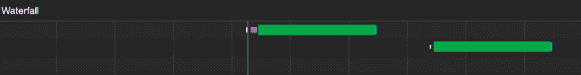
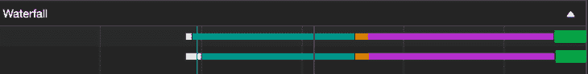
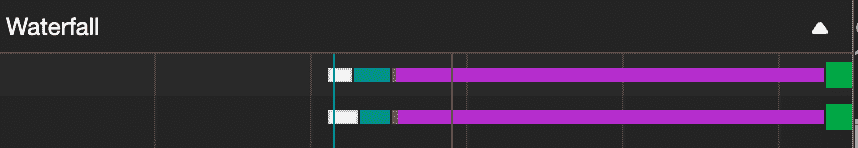
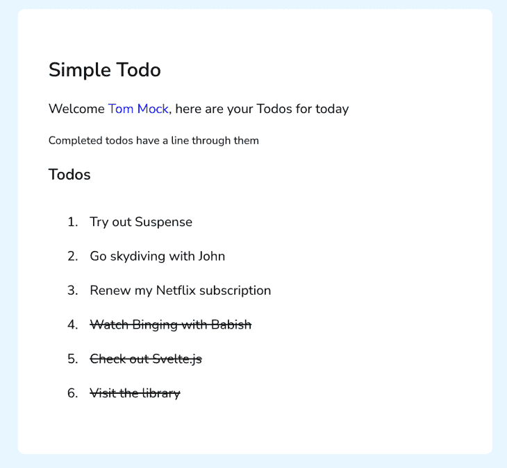
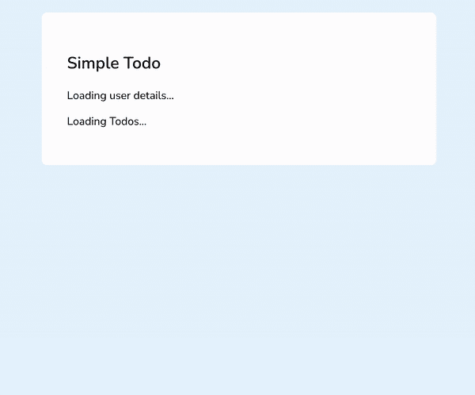
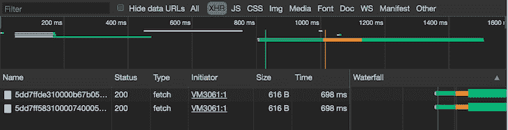

# 实验反应:使用悬念获取数据

> 原文：<https://blog.logrocket.com/react-suspense-data-fetching/>

***编者按:**本文于 2022 年 3 月 16 日更新，包含 React 18 发布前 React 悬念的最新更新。*

随着时间的推移，管理前端应用程序中的数据加载会变得非常复杂。以至于有一整个图书馆生态系统致力于国家管理以对抗它。

React 核心团队意识到了这一点，并通过开发一组并发特性来使 React 中的数据获取更加容易。[悬念](https://17.reactjs.org/blog/2019/11/06/building-great-user-experiences-with-concurrent-mode-and-suspense.html)就是其中之一，它旨在简化 React 组件中加载状态的管理。

在本文中，我们将通过创建一个从 API 获取数据并将其呈现到 DOM 的简单应用程序来了解悬念是如何工作的。

> 注意:在撰写本文时，数据获取的暂记仍处于试验阶段，当它变得稳定时，API 可能已经发生了显著的变化。

### 内容

## 什么是反应悬疑？

[悬念](https://github.com/reactjs/rfcs/blob/main/text/0213-suspense-in-react-18.md)是 React 应用中管理异步操作的一个特性。它让您的组件进行通信，以反应它们正在等待一些数据。

需要注意的是，悬念不是像 [react-async](https://github.com/ghengeveld/react-async) 那样的数据获取库，也不是像 [Redux](https://blog.logrocket.com/understanding-redux-saga-action-creators-sagas/) 那样的管理状态的方式。它只是让您在组件等待某个异步操作(即网络请求)完成时以声明方式呈现回退。

正如我们将进一步看到的，这允许我们跨不同组件同步加载状态，从而为用户提供更好的用户体验。它以一种非侵入性的方式做到这一点，不需要完全重写现有的应用程序。

## 如何利用悬念

让我们看一下最简单的悬念用例，它是在一个组件中处理一个挂起的网络请求:

```
const [todos, isLoading] = fetchData('/todos')

if (isLoading) {
  return <Spinner />
}

return <Todos data={todos} />

```

这应该看起来很熟悉，因为这是大多数人(包括我)处理等待网络呼叫的方式。`fetchData`功能、`Spinner`和`Todos`组件的实现与此无关。

变量`isLoading`用于跟踪请求的状态。如果`true`，我们渲染一个微调器，向用户传达这个状态。这样做绝对没有错，但是让我们看看如何利用悬念来处理这个问题:

```
const todos = fetchData('/todos')

return (
  <Suspense fallback={<Spinner />}>
    <Todos data={todos} />
  </Suspense>
)

```

代码有一个微妙但重要的变化。不是将加载状态作为一个状态变量，通过逻辑根据值来呈现微调器，而是由 React 使用悬念来管理。我们现在以声明方式呈现回退。

在前面的例子中，React 不知道网络调用，所以我们必须使用`isLoading`变量来管理加载状态。在这个例子中，React 知道一个网络调用正在发生，通过暂停包装`Todos`组件，它延迟呈现它，直到网络调用完成。

另一个需要注意的重要事情是传递给悬念的`fallback`属性。这就是我们在等待网络调用结束时想要呈现的内容。它可能是一个旋转器，骨骼装载机，或只是简单的什么都没有。

React 将在等待网络请求完成时呈现`fallback`的值。

然而，React 究竟是如何知道网络调用正在进行的呢？到目前为止，我们所经历的悬念只是在等待时呈现一个后备组件。我们在代码中的什么地方进行通信来对我们正在进行的网络调用做出反应？

这就是数据提取库的用武之地。目前，[继电器](https://relay.dev/docs/guided-tour/rendering/loading-states/#internaldocs-banner)和 [SWR](https://swr.vercel.app/docs/suspense) 都集成了悬念，以传达负载状态做出反应。我想将来会有更多的库作者添加集成。

到目前为止我们学到了什么？暂停让 React 可以访问我们的应用程序中的挂起状态。这允许我们在等待时以声明方式呈现回退组件。

接下来，让我们探索一些常见的数据获取方法，它们的局限性，以及悬念如何改善开发人员和用户的体验。然后，我们将使用悬念构建一个应用程序来管理网络请求的加载状态。最后，我们将把所有这些联系起来，并对悬念提供的一些好处进行实践探索。

## 数据获取方法

如果一个 React 组件需要来自 API 的一些数据，我们通常必须在某个地方发出网络请求来检索它。这就是[数据获取方法](https://blog.logrocket.com/patterns-for-data-fetching-in-react-981ced7e5c56/)发挥作用的地方。

### 渲染时提取

使用这种方法，网络请求在安装后在组件本身中触发。

之所以称之为呈现时提取，是因为直到组件呈现时请求才被触发，在某些情况下，这可能会导致一个称为“瀑布”的问题考虑下面的例子:

```
const App = () => {
  const [userDetails, setUserDetails] = useState({})

  useEffect(() => {
    fetchUserDetails().then(setUserDetails)
  }, [])

  if (!userDetails.id) return <p>Fetching user details...</p>

  return (
    <div className="app">
      <h2>Simple Todo</h2>

      <UserWelcome user={userDetails} />
      <Todos />
    </div>
  )
}

```

这看起来非常类似于当我有一个组件需要来自 API 的数据时我通常会做的事情，但是这有一个问题。

如果嵌套的`Todos`组件也需要从 API 获取一些数据，那么它必须等到`fetchUserDetails()`解析。如果这需要三秒钟，那么`<Todos/>`将不得不在开始获取自己的数据之前等待三秒钟，而不是让两个请求并行发生。

检查**网络**选项卡清楚地显示了这一点，其中第二个请求仅在第一个请求完成后发生。



在一个组件中，有相当数量的其他组件各自进行自己的异步调用，这可能会导致缓慢而笨拙的用户体验。

当然，我们可以让`UserWelcome`组件处理它自己的数据获取，但是这里重要的概念是协调网络请求的想法，正如我们将在下面看到的，悬念使这不成问题。

### 提取然后渲染

使用这种方法，我们在组件呈现之前发出异步请求。让我们回到上一个例子，看看我们将如何修复它:

```
const fetchDataPromise = fetchUserDetailsAndTodos() // We start fetching here

const App = () => {
  const [userDetails, setUserDetails] = useState({})
  const [todos, setTodos] = useState([])

  useEffect(() => {
    fetchDataPromise.then((data) => {
      setUserDetails(data.userDetails)
      setTodos(data.todos)
    })
  }, [])

  return (
    <div className="app">
      <h2>Simple Todo</h2>

      <UserWelcome user={userDetails} />
      <Todos todos={todos} />
    </div>
  )
}

```

在这种情况下，我们将获取逻辑移到了`App`组件之外，这样网络请求甚至在组件安装之前就开始了。我们做的另一个改变是`<Todos/>`不再触发它自己的异步请求。而是从父`App`组件获取所需的数据。

检查 **networks** 选项卡可以清楚地看到两个请求是同时开始的，但是这里有一个微妙的问题，乍一看可能不那么明显。



让我们假设`fetchUserDetailsAndTodos`看起来像这样:

```
function fetchUserDetailsAndTodos() {
  return Promise.all([fetchUserDetails(), fetchTodos()])
    .then(([userDetails, todos]) => ({ userDetails, todos }))
}

```

虽然`fetchUserDetails`和`fetchTodos()`都是并行启动的，但是在我们呈现任何有用的数据之前，我们仍然需要等待两者之间较慢的请求完成。

如果`fetchTodos()`需要 200 毫秒来解析，而`fetchUserDetails()`需要 900 毫秒来解析，`<Todos />`在渲染之前仍然需要额外等待 700 毫秒，尽管它的数据已经准备就绪。

这是因为`Promise.all`要等到所有的承诺都解决了才解析。当然，我们可以通过移除`Promise.all`并分别等待两个请求来解决这个问题，但是随着应用程序的增长，这很快就会变得很麻烦。

还有一个事实是，父组件现在必须管理`UserWelcome`和`Todos`的状态。这在开发人员和用户体验方面都不太好。

### 随取随渲染

这可以说是悬念给反应带来的最重要的好处。这允许您以简单的方式解决我们在其他方法中遇到的问题。它允许我们在触发网络请求后立即开始呈现组件。

这意味着，就像获取然后渲染一样，我们在渲染之前开始获取，但我们不必在开始渲染之前等待响应。让我们看一些代码:

```
const data = fetchData() // this is not a promise (we'll implement something similar)

const App = () => (
  <>
    <Suspense fallback={<p>Fetching user details...</p>}>
      <UserWelcome />
    </Suspense>

    <Suspense fallback={<p>Loading todos...</p>}>
      <Todos />
    </Suspense>
  </>
)

const UserWelcome = () => {
  const userDetails = data.userDetails.read()
  // code to render welcome message
}

const Todos = () => {
  const todos = data.todos.read()
  // code to map and render todos
}

```

这段代码可能看起来有点陌生，但并没有那么复杂。大多数工作实际上发生在`fetchData()`函数中，我们将看到如何进一步实现类似的东西。但是现在，让我们看看代码的其余部分。

首先，我们在第一行呈现任何组件之前触发网络请求。在主`App`组件中，我们将`UserWelcome`和`Todos`组件包装在单独的`Suspense`组件中，它们有自己的后备。

当`App`第一次挂载时，它试图先渲染`UserWelcome`，这触发了`data.userDetails.read()`线。如果数据还没有准备好(也就是说，请求还没有解决)，它将被传递回悬念，然后由悬念呈现`<p>Fetching user details…</p>`。同样的事情也发生在`Todos`身上。

回退将一直呈现到数据准备就绪，然后呈现组件。这种方法的好处是没有一个组件必须等待另一个。一旦任何组件接收到完整的数据，不管另一个组件的请求是否得到解决，它都会被呈现。

我们保留了很好的并行网络请求，呈现代码看起来也更简洁，因为我们消除了查看所需数据是否存在的`if`检查。



现在让我们构建一个简单的应用程序来实现这些概念，并看看我们如何实现上面的`fetchData()`函数。

## 使用 React 悬念构建示例应用程序

我们将构建一个简单的应用程序，从 API 获取一些数据，并将其呈现到 DOM，但我们将利用悬念和即取即呈现的方法。我假设你已经熟悉 React 钩子；否则，你可以在这里得到一个快速介绍[。](https://blog.logrocket.com/react-hooks-cheat-sheet-unlock-solutions-to-common-problems-af4caf699e70/)[本文的所有代码都可以在这里找到](https://github.com/ovieokeh/suspense-data-fetching)。



### 设置

让我们创建所有的文件和文件夹，并安装所需的软件包。我们会边走边填充内容。

运行以下命令来设置项目结构:

```
mkdir suspense-data-fetching && cd suspense-data-fetching
mkdir -p lib/{api,components} public
touch public/index.html public/index.css
cd lib/ && touch index.jsx
touch api/fetchData.js api/wrapPromise.js
cd components/
touch App.jsx UserWelcome.jsx Todos.jsx

```

现在让我们安装所需的依赖项:

```
npm install [email protected] [email protected]
npm install --save-dev parcel parcel-bundler

```

请注意，我们正在安装`react`和`react-dom`的“发布候选”版本。这是因为数据获取的悬念还不稳定，所以您需要手动选择加入。

我们正在安装`parcel`和`parcel-bundler`来帮助我们将代码转换成浏览器能够理解的东西。我选择 package 而不是 webpack 之类的东西的原因是因为它不需要任何配置，而且运行得非常好。

接下来，在`package.json`中添加以下部分:

```
"scripts": {
  "dev": "parcel public/index.html -p 4000"
},

```

既然我们已经准备好了项目结构并安装了所需的依赖项，让我们开始编写一些代码。为了保持教程简洁，我将省略以下文件的代码，您可以从链接的 repo 中获得这些代码:

## 应用程序接口

让我们从`api`文件夹中的文件开始。

### `wrapPromise.js`

这可能是整个教程中最重要的部分，因为这是与悬念交流的内容，也是任何为悬念 API 编写抽象的库作者将花费大部分时间的内容。

`wrapPromise.js`是一个包装器，它包装了一个承诺，并提供了一种方法，允许您确定从承诺返回的数据是否可以读取。如果承诺解析，则返回解析的数据；如果它拒绝，它抛出错误；如果它仍然是未决的，它抛出承诺。

这个 Promise 参数通常是一个从 API 中检索一些数据的网络请求，但是从技术上讲，它可以是任何 Promise 对象。实际的实现留给实现它的人去解决，所以您可能会找到其他方法来实现它。

`wrapPromise`功能有以下要求:

*   它把承诺当作论据
*   当承诺被解析时，它返回解析的值
*   当承诺被拒绝时，它抛出被拒绝的值
*   当承诺仍处于待定状态时，它会抛出承诺
*   它公开了一个读取承诺状态的方法

定义了需求之后，是时候写一些代码了。打开`api/wrapPromise.js`文件，我们就可以开始了:

```
function wrapPromise(promise) {
  let status = 'pending'
  let response

  const suspender = promise.then(
    (res) => {
      status = 'success'
      response = res
    },
    (err) => {
      status = 'error'
      response = err
    },
  )

...to be continued...

```

这里发生了什么事？在`wrapPromise`函数中，我们定义了两个变量:

1.  `status`，跟踪 promise 参数的状态
2.  `response`，保存承诺的结果(无论是解决还是拒绝)

默认情况下,`status`被初始化为“待定”,因为这是任何新承诺的默认状态。然后，我们初始化一个新变量`suspender`，将其值设置为 Promise，并为其附加一个`then`方法。

在这个`then`方法中，我们有两个回调函数:第一个处理解析的值，第二个处理拒绝的值。如果承诺成功解析，我们将变量`status`更新为“成功”,并将变量`response`设置为解析后的值。

如果承诺被拒绝，我们将变量`status`更新为“error ”,并将变量`response`设置为被拒绝的值。

```
...continued from above...
  const read = () => {
    switch (status) {
      case 'pending':
        throw suspender
      case 'error':
        throw response
      default:
        return response
    }
  }

  return { read }
}

export default wrapPromise

```

接下来，我们创建一个名为`read`的新函数，在这个函数中，我们有一个`switch`语句来检查`status`变量的值。如果承诺的`status`是“待定”，我们抛出刚刚定义的`suspender`变量。如果是“错误”，我们抛出`response`变量。最后，如果它是除了这两个以外的任何东西(例如，“成功”)，我们返回`response`变量。

我们抛出`suspender`变量或错误`response`变量的原因是因为我们想要传达回承诺尚未解决的悬念。

我们通过模拟组件中的一个错误(使用`[throw](https://developer.mozilla.org/en-US/docs/Web/JavaScript/Reference/Statements/throw)`)来做到这一点，这个错误将被悬念组件拦截。然后，暂记组件查看抛出的值，以确定它是一个实际的错误还是一个承诺。

如果它是一个承诺，悬念组件将识别出该组件仍在等待一些数据，它将呈现回退。如果这是一个错误，它会使错误冒泡回到最近的[错误边界](https://reactjs.org/docs/error-boundaries.html)，直到它被捕获或者使应用程序崩溃。

在`wrapPromise`函数的末尾，我们返回一个包含`read`函数的对象作为方法，这是我们的 React 组件将与之交互以检索承诺值的对象。

最后，我们有一个默认的导出，这样我们可以在其他文件中使用`wrapPromise`函数。现在让我们继续讨论`fetchData.js`文件。

### `fetchData.js`

在这个文件中，我们将创建一个函数来获取组件所需的数据。它将返回一个用我们刚刚经历的`wrapPromise`函数包装的承诺:

```
import wrapPromise from './wrapPromise'

function fetchData(url) {
  const promise = fetch(url)
    .then((res) => res.json())
    .then((res) => res.data)

  return wrapPromise(promise)
}

export default fetchData

```

我们在这里做的第一件事是导入我们刚刚创建的`wrapPromise`函数，然后定义一个函数`fetchData`。

在这个函数中，我们初始化一个新变量`promise`，并将其值设置为一个[获取](https://developer.mozilla.org/en-US/docs/Web/API/Fetch_API/Using_Fetch)请求承诺。当这个请求完成时，我们使用`res.json()`从 [`Response`对象](https://developer.mozilla.org/en-US/docs/Web/API/Response)获取数据，然后返回`res.data`，其中包含我们需要的数据。

最后，我们将这个`promise`传递给`wrapPromise`函数并返回它。在这个文件的最后，我们导出了`fetchData`函数。

### API 概述

让我们回顾一下到目前为止我们所做的一切。我们定义了一个函数`wrapPromise`，它接收一个承诺，并根据该承诺的状态，或者抛出该承诺的拒绝值、该承诺本身，或者返回已解析的值。

然后，`wrapPromise`返回一个包含`read`方法的对象，该方法允许我们查询值(或者，如果没有解析，则查询承诺本身)。另一方面，`fetchData.js`包含一个使用[获取 API](https://blog.logrocket.com/fetch-api-node-js/) 从服务器获取数据的函数，并返回一个用`wrapPromise`函数包装的承诺。

现在来看组件！

## 成分

我们现在已经为我们的应用程序准备好了“后端”,所以是时候构建组件了。

### `index.jsx`

这是我们应用程序的入口点，我们将首先创建它。这是我们将 React 应用程序安装到 DOM 的地方:

```
import React from 'react'
import ReactDOM from 'react-dom/client'
import App from './components/App'

const mountNode = document.querySelector('#root')
ReactDOM.createRoot(mountNode).render(<App />)

```

如果你曾经使用过 React 应用程序，这应该看起来很熟悉，但是与你通常附加应用程序的方式有两个微妙的区别。

首先，我们从`react-dom/client`导入 ReactDOM。在[反应 18](https://blog.logrocket.com/exploring-react-18-three-new-apis/) 中这是一种新的方式。原因是因为 ReactDOM 的新版本也支持服务器渲染，所以我们必须明确要导入哪个包。

其次，是我们使用 ReactDOM 的方式。通常，我们会这样写—

```
ReactDOM.render(<App />, mountNode)

```

但是，现在这只对 React v17 及以下版本有效。我们需要使用`createRoot`方法来呈现我们的应用程序。这也允许我们手动选择使用并发功能。

### `App.jsx`

这是大部分魔法发生的地方，所以我们将一步一步来看:

```
import React, { Suspense } from 'react'

import UserWelcome from './UserWelcome'
import Todos from './Todos'

const App = () => {
  return (
    <div className="app">
      <h2>Simple Todo</h2>

      <Suspense fallback={<p>Loading user details...</p>}>
        <UserWelcome />
      </Suspense>
      <Suspense fallback={<p>Loading Todos...</p>}>
        <Todos />
      </Suspense>
    </div>
  )
}

export default App

```

一开始，我们有 React 导入，但是请注意，我们也引入了悬念，如果您还记得的话，它让我们的组件在渲染之前等待一些东西。我们还导入了两个定制组件，它们将为用户呈现一条欢迎消息以及一些待办事项。

导入之后，我们创建一个名为`App`的新组件，它将作为其他组件的父组件。接下来，我们用 return 语句来呈现我们的 JSX，这就是我们使用`Suspense`组件的地方。

第一个`Suspense`组件有一个`<p>Loading user details…</p>`的后备，用于包装`<UserWelcome/>`组件。这将导致 React 在用户详细信息数据未准备好时呈现加载消息。

同样的事情也适用于`<Todos />`组件，唯一的区别是回退消息。注意两个`Suspense`组件是并排的。这仅仅意味着获取未决和已完成的待办事项的请求将被并行启动，并且两者都不必等待对方。

### `UserWelcome.jsx`

该组件向用户呈现欢迎消息:

```
import React from 'react'
import fetchData from '../api/fetchData'

const resource = fetchData(
  'https://run.mocky.io/v3/d6ac91ac-6dab-4ff0-a08e-9348d7deed51'
)

const UserWelcome = () => {
  const userDetails = resource.read()

  return (
    <div>
      <p>
        Welcome <span className="user-name">{userDetails.name}</span>, here are
        your Todos for today
      </p>
      <small>Completed todos have a line through them</small>
    </div>
  )
}

export default UserWelcome

```

我们从在文件顶部导入 React 和`fetchData`函数开始。然后，我们启动获取用户详细信息的网络请求，并将结果存储在一个名为`resource`的变量中。

这个`resource`变量是一个引用请求承诺的对象，我们可以通过调用一个`.read()`方法来查询它。如果请求还没有解决，调用`resource.read()`将会向`Suspense`组件抛出一个异常。

但是，如果是，它将从承诺中返回已解析的数据，在本例中，该数据将是 todo 项的数组。然后，我们继续映射这个数组，并呈现每个待办事项。

在文件的末尾，我们有一个默认的导出，这样我们就可以在其他文件中导入这个组件。

### `Todos.jsx`

该组件呈现待办事项列表:

```
import React from 'react'
import fetchData from '../api/fetchData'

const resource = fetchData(
  'https://run.mocky.io/v3/8a33e687-bc2f-41ea-b23d-3bc2fb452ead'
)

const Todos = () => {
  const todos = resource.read()

  const renderTodos = todos.map((todo) => {
    const className = todo.status === 'Completed' ? 'todo-completed' : 'todo'
    return (
      <li className={`todo ${className}`} key={todo.id}>
        {todo.title}
      </li>
    )
  })

  return (
    <div>
      <h3>Todos</h3>
      <ol className="todos">{renderTodos}</ol>
    </div>
  )
}

export default Todos

```

它与上面的`UserWelcome`组件非常相似，唯一的区别是渲染逻辑和内容。

现在我们已经准备好了两个组件，让我们更深入地探索悬念。

## 管理带悬念的渲染顺序

想象一下，如果`Todos`组件首先获得数据，然后您开始遍历列表，只为`UserWelcome`稍后解析。正在呈现的新内容会以一种滑稽的方式将现有的待办内容向下推，这可能会让用户迷失方向。


然而，如果你想让`Todos`组件只在`UserWelcome`组件完成渲染后才进行渲染，那么你可以像这样嵌套`Suspense`组件包装`Todos`:

```
<Suspense fallback={<p>Loading user details...</p>}>
  <UserWelcome />

  <Suspense fallback={<p>Loading Todos...</p>}>
    <Todos />
  </Suspense>
</Suspense>

```

另一种方法是将两个`Suspense`组件包装在一个`[SuspenseList](https://reactjs.org/docs/concurrent-mode-patterns.html#suspenselist)`中，并指定一个“显示顺序”，如下所示:

```
<SuspenseList revealOrder="forwards">
  <Suspense fallback={<p>Loading user details...</p>}>
    <UserWelcome />
  </Suspense>

  <Suspense fallback={<p>Loading Todos...</p>}>
    <Todos />
  </Suspense>
</SuspenseList>

```

> 注意:`SuspenseList`仅在 React 的实验版本中可用，在发布候选版本中不可用。要尝试一下，运行`npm i [[email protected]](/cdn-cgi/l/email-protection)`。

这将使 React 按照组件在代码中出现的顺序呈现组件，而不管哪个组件先获得数据。



您可以开始看到组织应用程序的加载状态变得多么简单，而不是自己去管理`isLoading`变量。自上而下的加载方式要好得多。

## 概述

我们已经完成了组件的编码，现在是时候回顾一下我们到目前为止所做的工作了:

*   我们选择在我们的`index.jsx`文件中使用并发特性
*   我们创建了一个有两个子组件的`App`组件，每个子组件包装在一个`Suspense`组件中
*   在每个子组件中，我们在它们安装之前启动了网络请求

让我们运行我们的应用程序，看看它是否有效。在您的终端中，运行`npm run dev`并在浏览器中导航至`[http://localhost:4000](http://localhost:4000)`。在你的 Chrome 开发者工具中打开**网络**标签并刷新页面。

您应该看到对已完成和待定 todo 项的请求都是并行发生的，如下所示。



看**瀑布**段。我们已经成功实现了一个用于数据获取的简单版本的悬念，您可以看到它如何帮助您以一种简单和可预测的方式编排应用程序的数据获取操作。

## 结论

在本文中，我们已经了解了什么是悬念，各种数据获取方法，并且我们已经构建了一个简单的应用程序，利用悬念进行数据获取。

虽然并发模式仍处于试验阶段，但我希望这篇文章能够突出它变得稳定时将带来的一些好处。

如果你有兴趣了解更多，我建议你阅读[文档](https://reactjs.org/docs/concurrent-mode-intro.html)并尝试构建一个更复杂的应用程序。同样，你可以在这里找到本教程[中写的所有代码。
再见，编码快乐！ **❤️**](https://github.com/ovieokeh/suspense-data-fetching)

## 使用 LogRocket 消除传统反应错误报告的噪音

[LogRocket](https://lp.logrocket.com/blg/react-signup-issue-free)

是一款 React analytics 解决方案，可保护您免受数百个误报错误警报的影响，只针对少数真正重要的项目。LogRocket 告诉您 React 应用程序中实际影响用户的最具影响力的 bug 和 UX 问题。

[ ](https://lp.logrocket.com/blg/react-signup-general) [  ](https://lp.logrocket.com/blg/react-signup-general) [LogRocket](https://lp.logrocket.com/blg/react-signup-issue-free)

自动聚合客户端错误、反应错误边界、还原状态、缓慢的组件加载时间、JS 异常、前端性能指标和用户交互。然后，LogRocket 使用机器学习来通知您影响大多数用户的最具影响力的问题，并提供您修复它所需的上下文。

关注重要的 React bug—[今天就试试 LogRocket】。](https://lp.logrocket.com/blg/react-signup-issue-free)