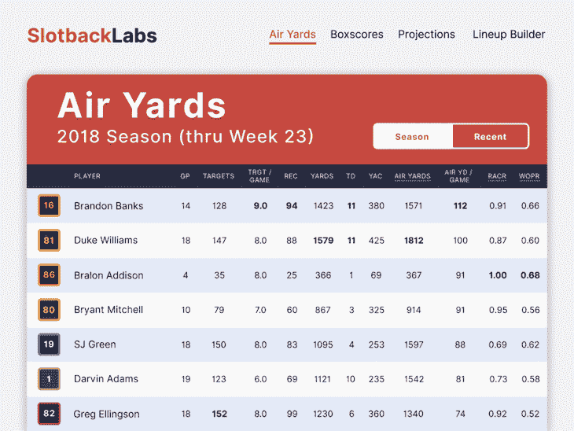
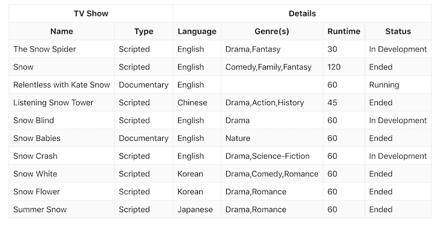
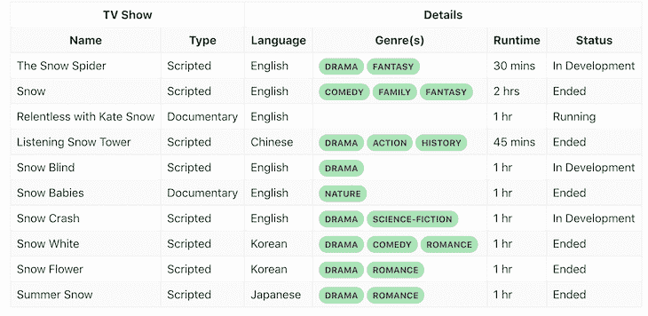
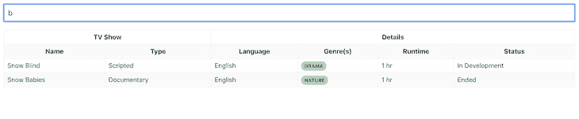
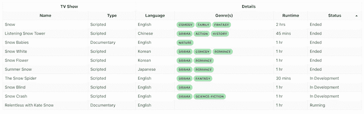

# React Table:一个完整的指南，包含对 TanStack Table - LogRocket 博客的更新

> 原文：<https://blog.logrocket.com/react-table-complete-guide/>

***编者按**:本教程最后一次更新是在 2022 年 12 月 23 日，以反映包含在 TanStack 表 v8 中的更新。*

作为组织复杂数据最流行的方式之一，表格用户界面在 web 产品中非常常见。然而，从头开始构建一个表格 UI 可能是一个很高的要求，尤其是 React，众所周知它让开发人员很头疼。

幸运的是，有各种各样的工具和库可以让创建 React 表的体验变得更加简单和有益，最著名的是 [TanStack Table](https://react-table.tanstack.com/) ，以前称为 React table。

在本教程中，我们将向您展示如何构建一个具有基本排序和搜索功能的智能 React 数据表 UI。在撰写本文时，TanStack 表 v8 的迁移指南尚不可用。因此，我们将使用 React 表的最新稳定版本 v7。

我们将详细介绍以下内容:

## React 中何时使用表格

React 中表格用户界面的一些常见用例包括显示财务报告、体育排行榜、定价和比较页面的数据，仅举几例:



一些广泛使用表格的产品包括 Airtable、Asana List View、Asana Timeline、Google Sheets 和 idea Table。一些使用 React Table 的科技巨头包括谷歌、苹果和微软。

## 什么是反应表？

[React 表](https://github.com/tannerlinsley/react-table)是 React 中使用最广泛的表库之一。在撰写本文时，它在 GitHub 上有超过 20，000 颗星，接收频繁的更新，并支持钩子。React 表库是非常轻量级的，提供了简单表所需的所有基本特性。

### 反应表 v7

2020 年 3 月，React Table 创建者 Tanner Linsley 发布了 [React Table v7](https://github.com/tannerlinsley/react-table/releases/tag/v7.0.0) ，他将其描述为“一年多来将整个库重构为一个只有钩子的 UI/样式/标记不可知的表构建实用程序的工作的高潮。”

React Table v7 由一组 React 挂钩和插件组成，旨在帮助您将复杂数据网格的逻辑特性组合成一个单一的、高性能的、可扩展的和非独立的 API，该 API 由主`useTable`挂钩返回。

作为一个无头工具，React Table 不呈现或提供现成的数据表 UI 元素。因此，您负责使用 React 表挂钩的状态和回调来呈现您自己的表标记。

### 转栈表 v8

2022 年 7 月 1 日，Tanner 宣布发布 TanStack table ，这是 React Table v7 的一次重大升级。

TanStack Table v8 的设计比 v7 性能更高，功能更丰富，支持其他 web 框架，如 Vue、Solid 和 Svelte。在本文的后面，我们将看到从 React Table v7 的潜在迁移可能是什么样子。

### 何时使用 React 表

当您的表格 UI 需要以下任何一项时，您应该考虑 React Table:

*   排序、过滤和分页等基本功能
*   在不影响功能的情况下为表格定制用户界面设计
*   易扩展性；您可以使用自定义插件挂钩在 React Table 上构建自己的特性

### 何时不使用 React 表

当您需要以下任一项时，应该考虑使用另一个 React 数据表库:

*   对固定标题和列的默认支持
*   对触摸和非触摸设备的水平和垂直滚动的现成支持。

React Table 不支配 UI；它是无头的。因此，根据我们的需求来定义 UI 是我们的责任。

尽管我们可以在 React 表中实现[对行内编辑列的支持，但这超出了我们的表的范围。我们需要在 React Table 上创建一个插件或组件来支持这些特性。React Table 名副其实，最适合呈现简单的表格。](https://blog.logrocket.com/build-inline-editable-ui-react/)

就性能而言，React Table 不能处理无限长的表，比如 Google Sheet。React Table 适用于中等大小的表，但不适用于长表。

### React 表的用例

最后，对于需要基本功能(如搜索、排序、过滤等)的简单表，您应该考虑 React Table。一些好的例子可能包括带有统计数据的体育排行榜或带有自定义元素的金融数据表。

在本教程中，我们将演示如何使用 React Table 构建一个简单的 Airtable 克隆。但是首先，让我们快速回顾一下全功能 React 表 UI 的特性，并讨论一些与在 React 中构建数据表相关的常见挑战。

## 反应表用户界面特性

React 数据表 UI 的一些基本功能包括:

*   不折不扣的 UX 和用户界面:清晰易懂的排版和表格用户界面中的自定义元素
*   加载数据的远程数据调用
*   搜索表格或特定列
*   基本过滤和排序选项

React 数据表 UI 中的高级功能可能包括:

*   基于数据类型，如数字、字符串、布尔、选择输入等，为列定制排序和过滤选项。
*   无限长表的分页支持
*   显示和隐藏列
*   支持对列数据的内联编辑
*   支持通过模式面板或细节面板编辑一整行数据
*   固定标题和固定列，便于查看数据
*   支持多种类型的设备；响应性
*   可调整大小的列，以适应列内的长数据点，即多行注释
*   水平和垂直滚动支持
*   可展开的行，显示关于该行的完整数据

## React 表格用户界面中常见的 UX 挑战

就 UI 而言，数据表是以有组织的方式显示复杂数据的最佳选择之一。但是，从 UX 的角度来看，表格是很棘手的，当你支持多种设备时，它们很容易失控。

例如，如果不改变布局以适应更小的屏幕尺寸，就很难使表格具有响应性。此外，表格可能需要双向滚动。默认浏览器滚动条适用于全宽表格，但大多数表格都是自定义宽度的。自定义滚动条在触摸屏和非触摸屏上都很难支持。

根据数据长度管理列宽是很棘手的。当我们在表中加载动态数据时，我们经常会遇到 UX 毛刺。每次数据发生变化时，列宽都会调整，从而导致对齐故障。在设计 UX 时，我们需要小心处理这些问题。

## 何时在 React 中构建自己的表格 UI

在以下场景中，您可能希望构建自己的 React 表格 UI:

*   当你的桌子只是一个没有太多互动的橱窗时
*   当您需要表格的自定义用户界面时
*   当您需要一个没有任何功能的轻量级桌子时

以下是在 React 中构建自己的表格的一些常见用例:

*   带有比较表的产品和营销页面
*   定价表
*   具有自定义样式的简单表格，除了简单的弹出文本之外，不需要对列进行很多交互

## React 表示例:构建 React `Table`组件

够理论；让我们深入一个真实的例子。为了演示如何在 React Table 中创建一个`Table`组件，我们将构建一个具有排序和搜索等基本功能的简单表格 UI。这是我们将要使用的[反应表示例](https://logrocket-smart-table.netlify.app/)。

首先，使用 Create React app 创建一个新的 React App:

```
npx create-react-app react-table-demo

```

### 用 Axios 调用 API

对于我们的应用程序，我们将使用 Axios 从 [TVMAZE API](https://www.tvmaze.com/api) 中检索带有搜索词`snow`的电影信息。以下是此操作的终点:

```
https://api.tvmaze.com/search/shows?q=snow

```

要调用 API，让我们安装 Axios:

```
npm install axios
# OR
yarn add axios

```

接下来，用下面的代码替换`default arc/App.js`文件的内容:

```
// App.js

import axios from "axios";
import { useState, useEffect } from "react";

import Table from "./Table";
import "./App.css";

function App() {
  // data state to store the TV Maze API data. Its initial value is an empty array
  const [data, setData] = useState([]);

  // Using useEffect to call the API once mounted and set the data
  useEffect(() => {
    (async () => {
      const result = await axios("https://api.tvmaze.com/search/shows?q=snow");
      setData(result.data);
    })();
  }, []);

  return <div className="App"></div>;
}
export default App;

```

上面，我们创建了一个名为`data`的状态。一旦组件安装完毕，我们使用 Axios 从 TVMAZE API 获取电影内容，并将返回的结果设置为`data`。

### 将 React 表添加到您的应用程序

使用下面的命令添加 React 表:

```
npm install react-table
# OR
yarn add react-table

```

[React 工作台使用 React 挂钩](https://blog.logrocket.com/react-hooks-cheat-sheet-unlock-solutions-to-common-problems-af4caf699e70/)。它有一个名为`useTable`的主表挂钩，以及一个添加插件挂钩的插件系统。因此，React Table 很容易根据我们的客户需求进行扩展。

让我们用`useTable`钩子创建我们的基本 UI。接下来，我们将创建一个新的`Table`组件，它将接受两个道具`data`和`columns`。`data`道具是我们通过 API 调用得到的数据，而`columns`是定义表格列、标题、行以及如何显示行等的对象。我们很快会在代码中看到它:

在`/src`文件夹中，创建一个新的`Table.js`文件并粘贴以下代码:

```
// Table.js

export default function Table({ columns, data }) {
   // Table component logic and UI come here
}

```

让我们修改`App.js`中的内容，以包含我们的表的列，并呈现`Table`组件:

```
// App.js

import axios from "axios";
import React, { useMemo, useState, useEffect } from "react";

import Table from "./Table";
import "./App.css";

function App() {
  /* 
    - Columns is a simple array right now, but it will contain some logic later on. It is recommended by react-table to memoize the columns data
    - Here in this example, we have grouped our columns into two headers. react-table is flexible enough to create grouped table headers
  */

  const columns = useMemo(
    () => [
      {
        // first group - TV Show
        Header: "TV Show",
        // First group columns
        columns: [
          {
            Header: "Name",
            accessor: "show.name",
          },
          {
            Header: "Type",
            accessor: "show.type",
          },
        ],
      },
      {
        // Second group - Details
        Header: "Details",
        // Second group columns
        columns: [
          {
            Header: "Language",
            accessor: "show.language",
          },
          {
            Header: "Genre(s)",
            accessor: "show.genres",
          },
          {
            Header: "Runtime",
            accessor: "show.runtime",
          },
          {
            Header: "Status",
            accessor: "show.status",
          },
        ],
      },
    ],
    []
  );

  // data state to store the TV Maze API data. Its initial value is an empty array
  const [data, setData] = useState([]);

  // Using useEffect to call the API once mounted and set the data
  useEffect(() => {
    (async () => {
      const result = await axios("https://api.tvmaze.com/search/shows?q=snow");
      setData(result.data);
    })();
  }, []);

  return (
    <div className="App">
      <Table columns={columns} data={data} />
    </div>
  );
}
export default App;

```

在上面的代码中，我们使用了 [`useMemo`钩子](https://blog.logrocket.com/react-usememo-vs-usecallback-a-pragmatic-guide/)来创建一个列的记忆化数组；我们定义了两个级别的标题，每个标题都有不同的列作为我们的表头。

我们已经为所有的列设置了一个访问器，它是由设置为`data`的 TVMAZE API 返回的数据。因为我们的数据包含在数组中的`show`对象中，所以我们所有的访问器都以`show`开头:

```
// sample data array looks like this

[
  {
    "score": 17.592657,
    "show": {
      "id": 44813,
      "url": "http://www.tvmaze.com/shows/44813/the-snow-spider",
      "name": "The Snow Spider",
      "type": "Scripted",
      "language": "English",
      "genres": [
        "Drama",
        "Fantasy"
      ],
      "status": "In Development",
      "runtime": 30,
      "premiered": null,
      "officialSite": null,
      "schedule": {
        "time": "",
        "days": [

        ]
      }
      ...
  },
  {
    // next TV show
  }
...
]

```

现在，让我们完成我们的`Table`组件:

```
// Table.js

import React from "react";
import { useTable } from "react-table";

export default function Table({ columns, data }) {
  // Use the useTable Hook to send the columns and data to build the table
  const {
    getTableProps, // table props from react-table
    getTableBodyProps, // table body props from react-table
    headerGroups, // headerGroups, if your table has groupings
    rows, // rows for the table based on the data passed
    prepareRow // Prepare the row (this function needs to be called for each row before getting the row props)
  } = useTable({
    columns,
    data
  });

  /* 
    Render the UI for your table
    - react-table doesn't have UI, it's headless. We just need to put the react-table props from the Hooks, and it will do its magic automatically
  */
  return (
    <table {...getTableProps()}>
      <thead>
        {headerGroups.map(headerGroup => (
          <tr {...headerGroup.getHeaderGroupProps()}>
            {headerGroup.headers.map(column => (
              <th {...column.getHeaderProps()}>{column.render("Header")}</th>
            ))}
          </tr>
        ))}
      </thead>
      <tbody {...getTableBodyProps()}>
        {rows.map((row, i) => {
          prepareRow(row);
          return (
            <tr {...row.getRowProps()}>
              {row.cells.map(cell => {
                return <td {...cell.getCellProps()}>{cell.render("Cell")}</td>;
              })}
            </tr>
          );
        })}
      </tbody>
    </table>
  );
}

```

上面，我们将`columns`和`data`传递给`useTable`。`useTable`钩子将返回表格、主体和转换数据的必要属性，以创建标题和单元格。表头通过`headerGroups`迭代生成，表体行通过`rows`循环生成:

```
{rows.map((row, i) => {
  prepareRow(row); // This line is necessary to prepare the rows and get the row props from react-table dynamically

  // Each row can be rendered directly as a string using the react-table render method
  return (
    <tr {...row.getRowProps()}>
      {row.cells.map(cell => {
        return <td {...cell.getCellProps()}>{cell.render("Cell")}</td>;
      })}
    </tr>
  );
})}

```

您还会注意到，流派是一个数组，但在我们的最终输出中，它会自动转换为逗号分隔的字符串。

如果我们此时运行我们的应用程序，我们应该得到以下输出:



### React 表中的自定义样式

这个表对于大多数应用程序来说已经足够了，但是如果我们需要定制样式呢？使用 React Table，您可以为每个单元格定义自定义样式；可以在`column`对象中定义样式，如下所示。例如，让我们制作一个类似徽章的自定义组件来显示每个流派:

```
// App.js

import React, { useMemo } from "react";
...

// Custom component to render Genres 
const Genres = ({ values }) => {
  // Loop through the array and create a badge-like component instead of a comma-separated string
  return (
    <>
      {values.map((genre, idx) => {
        return (
          <span key={idx} className="badge">
            {genre}
          </span>
        );
      })}
    </>
  );
};

function App() {
  const columns = useMemo(
    () => [
      ...
      {
        Header: "Details",
        columns: [
          {
            Header: "Language",
            accessor: "show.language"
          },
          {
            Header: "Genre(s)",
            accessor: "show.genres",
            // Cell method will provide the cell value; we pass it to render a custom component
            Cell: ({ cell: { value } }) => <Genres values={value} />
          },
          {
            Header: "Runtime",
            accessor: "show.runtime",
            // Cell method will provide the value of the cell; we can create a custom element for the Cell        
            Cell: ({ cell: { value } }) => {
              const hour = Math.floor(value / 60);
              const min = Math.floor(value % 60);
              return (
                <>
                  {hour > 0 ? `${hour} hr${hour > 1 ? "s" : ""} ` : ""}
                  {min > 0 ? `${min} min${min > 1 ? "s" : ""}` : ""}
                </>
              );
            }
          },
          {
            Header: "Status",
            accessor: "show.status"
          }
        ]
      }
    ],
    []
  );

  . . .
}

. . .

```

我们更新了上面的`Genres`列，通过迭代并将其值发送到一个定制组件，创建了一个类似徽章的元素。我们还更改了 runtime 列，根据时间显示手表的小时和分钟。完成这一步后，我们的表格用户界面应该如下所示:



我们已经看到了如何根据我们的需要定制每个单元格的样式；您可以根据数据值为每个单元格显示任何自定义元素。

## 使用`useFilters`添加搜索功能

让我们为我们的表添加更多的功能。React 表格的[演示页面](https://github.com/tannerlinsley/react-table/blob/master/docs/examples.md)已经提供了创建定制智能表格所需的一切。演示中还缺少一样东西，全局搜索功能。我决定使用 React 表中的 [`useFilters`插件钩子](https://react-table-v7.tanstack.com/docs/api/useFilters)来创建它。

首先，让我们在`Table.js`中创建一个搜索输入:

```
// Table.js

// Create a state
const [filterInput, setFilterInput] = useState("");

// Update the state when input changes
const handleFilterChange = e => {
  const value = e.target.value || undefined;
  setFilterInput(value);
};

// Input element
<input
  value={filterInput}
  onChange={handleFilterChange}
  placeholder={"Search name"}
/>

```

这是管理输入状态的一种简单明了的方式。但是，我们如何将这个过滤值传递给我们的表并过滤表中的行呢？

为此，React Table 提供了一个名为`useFilters`的钩子插件:

```
// Table.js

const {
  getTableProps,
  getTableBodyProps,
  headerGroups,
  rows,
  prepareRow,
  setFilter, // The useFilter Hook provides a way to set the filter
} = useTable(
  {
    columns,
    data,
  },
  useFilters // Adding the useFilters Hook to the table
  // You can add as many Hooks as you want. Check the documentation for details. You can even add custom Hooks for react-table here
);

```

在我们的例子中，我们将只为`Name`列设置过滤器。为了过滤名称，当输入值改变时，我们需要将第一个参数设置为列访问器或 ID 值，将第二个参数设置为搜索过滤器值。

让我们更新我们的`handleFilterChange`函数:

```
const handleFilterChange = e => {
  const value = e.target.value || undefined;
  setFilter("show.name", value); // Update the show.name filter. Now our table will filter and show only the rows which have a matching value
  setFilterInput(value);
};

```

搜索实现后，我们的 UI 将如下所示:



这是一个非常基本的过滤器示例，React Table API 提供了几个选项。请务必查看 API 文档。

## 用`useSortBy`添加排序

让我们为我们的表实现一个更基本的功能，排序。让我们允许对所有列进行排序；很简单，类似于过滤。

我们需要添加一个名为`useSortBy`的插件挂钩，并创建样式来显示表格中的排序图标。它将自动处理升序和降序排序:

```
// Table.js

const {
    getTableProps,
    getTableBodyProps,
    headerGroups,
    rows,
    prepareRow,
    setFilter
  } = useTable(
    {
      columns,
      data
    },
    useFilters,
    useSortBy // This plugin Hook will help to sort our table columns
  );

// Table header styling and props to allow sorting

<th
  {...column.getHeaderProps(column.getSortByToggleProps())}
  className={
    column.isSorted
      ? column.isSortedDesc
        ? "sort-desc"
        : "sort-asc"
      : ""
  }
>
  {column.render("Header")}
</th>

```

基于排序，我们添加类名`sort-desc`或`sort-asc`。我们还向列标题添加了排序属性:

```
{...column.getHeaderProps(column.getSortByToggleProps())}

```

这将自动允许对所有列进行排序。您可以通过使用列上的`disableSortBy`选项禁用特定列中的排序来控制这一点。在我们的例子中，我们允许对所有列进行排序。请随意使用演示。

在我们的排序实现之后，UI 如下所示:



当然，您可以进一步扩展这个演示。如果你需要帮助，请在评论区告诉我。扩展它的一些想法包括:

*   使用全局过滤器过滤多个列(提示:使用`setAllFilters`而不是`setFilter`
*   创建分页并调用更多数据为表加载
*   通过禁用列的`sortby`,仅允许对特定字段进行排序
*   不要将硬编码的搜索值传递给 TVMAZE API，而是创建一个输入来直接搜索 TVMAZE API。例如，删除客户端过滤，并在服务器端添加搜索电视节目的功能

为了扩展这个演示，请查看 React Table 的扩展[示例页面](https://github.com/tannerlinsley/react-table/blob/master/docs/examples.md)。它有一个非常好的厨房水槽可以玩，并且它为大多数用例提供了解决方案。

## TanStack 表入门

正如本文开头所提到的，TanStack Table 是 React Table 的一个重大进步，允许该库支持更多的 JavaScript 框架，包括 Svelte、Solid 和 Vue。TanStack table 包括对 TypeScript 的完全重写、对服务器端操作的改进支持，以及一个大大扩展和改进的 API，等等。

此外，由于它的设计，TanStack 表的实现在许多支持的框架中是一致的，这意味着在 React 中创建一个表所必需的钩子与在一个苗条的应用程序中创建一个表所用的钩子是相同的。因此，对于已经熟悉 React Table 的人来说，在其他框架中使用它更容易。

与 React Table v7 相反，您可以使用下面的代码安装 TanStack Table:

```
npm install @tanstack/react-table

```

然后，我们可以将它导入我们的应用程序，如下所示:

```
import { useReactTable } from '@tanstack/react-table'

function App() {
  const table = useReactTable(options)
   . . .
}

```

### 从 React 表 v7 迁移到 TanStack 表 v8

列配置是使用 TanStack Table 和 React Table v7 之间最显著的区别。在 v8 中，`createColumnHelper`钩子添加了一个创建列的新方法。在下面的示例中，我们将使用 TanStack Table v8 重新创建上一个表示例中的列:

```
import { createColumnHelper } from "@tanstack/react-table";

const columnHelper = createColumnHelper();

const columns = [
  columnHelper.group({
    id: "tv-show",
    header: "TV Show",
    columns: [
      columnHelper.accessor("show.name", {
        header: () => "Name",
      }),
      columnHelper.accessor("show.type", {
        header: () => "Type",
      }),
    ],
  }),
  columnHelper.group({
    header: "Details",
    columns: [
      columnHelper.accessor("show.language", {
        header: () => "Language",
      }),
      columnHelper.accessor("show.genres", {
        header: () => "Genre(s)",
      }),
    ],
    // . . .
  }),
];

```

此外，v8 中的表选项与 v7 中的基本相同，一些较大的差异集中在可选的状态管理和数据管道控制上。您可以在[文档页面](https://tanstack.com/table/v8/docs/guide/introduction)上找到关于其他实现的更多信息。

## 反应表备选方案

尽管 React Table 是最流行的 React 表库，但它并不总是在 React 中构建表的最佳解决方案。根据您的特定项目和用例，有许多替代方案可能也适合您的需求。

下面是一些可供选择的 React 表库，值得一试。

### 1.反应数据网格

[react-data-grid](https://github.com/adazzle/react-data-grid) 用于创建智能表格。在撰写本文时，它拥有超过 5000 颗 GitHub 星，并且维护得很好。

当您的数据表需要以下功能时，请使用 react-data-grid:

*   基本功能，如分组列、排序、搜索和过滤
*   列的内联编辑
*   列中的下拉列表(如 Google Sheets)或列中的任何自定义输入元素
*   支持扩展列以显示更多数据
*   对性能进行微调，例如，它支持无限长的表行的虚拟呈现
*   当没有行时支持空状态

react-data-grid 几乎涵盖了数据表的所有基本需求。但是，它默认不支持分页，所以如果您的表需要分页，您需要手动实现和处理它。默认情况下，react-data-grid 支持更长的表用户界面，并针对性能进行了优化，因此除非 UX 要求，否则分页可能是不必要的。

react-data-grid 也使用 Bootstrap 进行造型。没有它，您仍然可以使用 react-data-grid，但是您必须为表格添加自己的样式。与 React Table 相比，它不容易定制，React Table 允许您创建表结构。在 react-data-grid 中，库创建了表格 UI，所以它不太适合大量使用 UI 的定制页面。

虽然以上几点并不完全是缺点，但是在开始使用 react-data-grid 之前，最好了解一下。最后，当您的应用程序需要一个带有漂亮 UX 的迷你可编辑数据表时，react-data-grid 是最好的，类似于 Google Sheets 或 Airtable。

### 2.react-数据表

[react-数据表](https://github.com/nadbm/react-datasheet)类似 react-数据-网格。它有大约 5000 个 GitHub stars，也是一个维护良好的库。

react-数据表主要致力于帮助您创建自己的类似 Google Sheets 的应用程序。它内置了创建这种 UX 密集型应用程序的基本功能。同样，它可能不适合创建带有表格的通用页面 UI。

然而，与 react-data-grid 不同，react-datasheet 并不是针对大型数据集进行优化的，因此可以将其用于需要类似工作表的功能的小型应用程序。它只有这一个用例，与 react-data-grid 相比，它的特性非常有限。

### 3.反应虚拟化

顾名思义，当数据集很大时， [react-virtualized](https://github.com/bvaughn/react-virtualized) 针对性能进行了大量优化。在撰写本文时，它在 GitHub 上拥有超过 24k 颗星星。这个库不完全是一个表库；它做得更多。它专门用于在 UI 上以不同的格式显示大型数据集，如网格、表格和列表。

当数据集非常大时，呈现性能是表的关键指标；如果是这种情况，请选择 react-virtualized。对于正常的用例来说，这个库可能有些多余，而且 API 可能太高级了。

您应该将 react-virtualized 用于定制时间线、包含无限长日历的图表以及大型数据集的繁重 UI 元素。

## 选择反应表库

对于具有有限数据、自定义样式和最小交互性(如排序和过滤)的简单页面，请使用 React Table。要用有限的数据构建一个迷你的类似 Google Sheets 的应用程序，可以使用 react-data-grid 或 react-datasheet。对于具有大型数据集的 Google Sheets 或类似 Airtable 的应用程序，请使用 react-data-grid。

当您处理非常大的数据集，并且需要一个提供表格、网格和更多选项的自定义 UI 时，请选择 react-virtualized。

## 结论

在我们添加排序之后，这就是最终的[反应表演示](https://logrocket-smart-table.netlify.com/)的样子。你可以玩玩这个演示，看看我们的 [React 表示例](https://github.com/learnwithparam/logrocket-smart-table)的代码库。

在本文中，我们学习了如何使用 React 构建一个表格 UI。为基本用例创建自己的表并不困难，但是要确保尽可能不要重新发明轮子。希望你喜欢学习表格用户界面。请在评论中告诉我你对表格的体验。

## [LogRocket](https://lp.logrocket.com/blg/react-signup-general) :全面了解您的生产 React 应用

调试 React 应用程序可能很困难，尤其是当用户遇到难以重现的问题时。如果您对监视和跟踪 Redux 状态、自动显示 JavaScript 错误以及跟踪缓慢的网络请求和组件加载时间感兴趣，

[try LogRocket](https://lp.logrocket.com/blg/react-signup-general)

.

[ ](https://lp.logrocket.com/blg/react-signup-general) [](https://lp.logrocket.com/blg/react-signup-general) 

LogRocket 结合了会话回放、产品分析和错误跟踪，使软件团队能够创建理想的 web 和移动产品体验。这对你来说意味着什么？

LogRocket 不是猜测错误发生的原因，也不是要求用户提供截图和日志转储，而是让您回放问题，就像它们发生在您自己的浏览器中一样，以快速了解哪里出错了。

不再有嘈杂的警报。智能错误跟踪允许您对问题进行分类，然后从中学习。获得有影响的用户问题的通知，而不是误报。警报越少，有用的信号越多。

LogRocket Redux 中间件包为您的用户会话增加了一层额外的可见性。LogRocket 记录 Redux 存储中的所有操作和状态。

现代化您调试 React 应用的方式— [开始免费监控](https://lp.logrocket.com/blg/react-signup-general)。