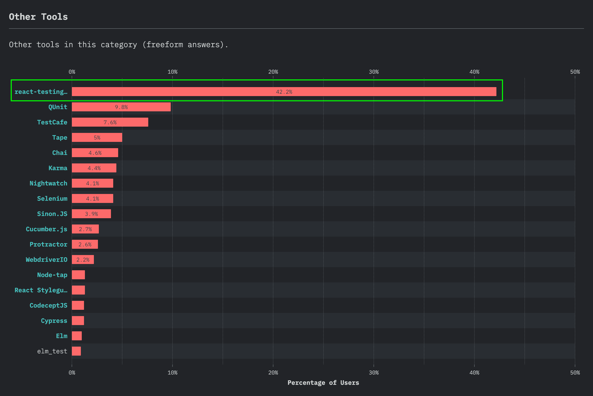

# react-testing-library vs . Enzyme-LogRocket 博客

> 原文：<https://blog.logrocket.com/react-testing-library-vs-enzyme/>

***编者按:**这篇文章于 2022 年 4 月 7 日更新，以反映酶和反应测试库的最新信息，以及如何在这两种工具之间迁移。*

在一个有无数工具的世界里，很难在不同的场景中选择最适合您的目的的工具。

我们应该考虑的变量实在是太多了，我们经常发现自己在努力选择一个工具，并最终开始做一些真正的工作。

这也适用于软件测试领域，尤其是当您谈到测试您的 JavaScript 代码时。

可能会减少您可用选项数量的一个因素是您已经在使用并且不愿意放弃的技术。

例如，当我们谈到测试 React 组件时，我们可能会根据它们在社区中的使用情况以及通过文档获取相关信息的难易程度，给出一些您应该考虑的选项。

我们可以讨论像 Enzyme、react-testing-library 或 react Test Renderer 这样的工具，它们在 React 社区中有丰富的文档和用例。

在这篇文章中，我们将回顾其中的两个工具:[酶](https://github.com/enzymejs/enzyme)和[反应-测试-库](https://github.com/testing-library/react-testing-library)。我们还将讨论如何从酶迁移到反应测试库，以及如何从反应测试库迁移到酶。

我们将讨论以下内容:

虽然 Enzyme 已经存在很长时间了(早在 2015 年发布)，但 react-testing-library 是最近(2018 年)发布的，并迅速获得了很大的吸引力，正如 2019 年 JavaScript 调查的[状态中所指出的那样。](https://2019.stateofjs.com/)



React-testing and other tool usage compared in the State of JavaScript survey.

## React 组件测试工具的上下文

似乎越来越多的开发人员愿意在测试 React 组件时采取不同的思维方式:毕竟，测试软件的目标是对我们发布的东西有信心，并在出现问题时有更好的调试方法。

对于酶和反应测试库来说，测试结构的差异是非常明显的。

使用 react-testing-library，您可以轻松地编写测试，这些测试可以很好地代表用户对应用程序的体验。

比方说，当你用 react-testing-library 编写测试时，你是在测试你的应用程序，就好像你是与应用程序接口交互的用户一样。

另一方面，当您使用 Enzyme 编写测试时，即使您也能够获得与使用 react-testing-library 相同的信心水平，但以类似于真实用户的方式构建测试结构还是有点麻烦。

总的来说，当你用 Enzyme 查看测试时，你可能会在代码库中看到，你实际上是在测试组件的属性和状态，这意味着你在测试组件的内部行为，以确认正确的视图被呈现给用户。

它是这样工作的:如果所有这些道具和状态变量都有这个值，那么我们假设呈现给用户的界面是我们期望的样子。

## 用于测试的反应组分的例子

除了提到的两个主要区别，您还有几个细节可以帮助您为下一个 React 项目选择一个工具(或者两个都用！为什么不呢？)

为了证明这一点，我提出了一个通过两种不同方法实现的简单组件思想:一种是带有 React 挂钩的功能组件，另一种是类组件。

原因是我们也能够比较每种类型组件的测试结构。如果你想看看完整的代码(包括测试)，这里有一个 [GitHub repo](https://github.com/mariesta/enzyme-vs-react-testing-library) 可以和这篇文章一起使用。

另外，请记住，这篇文章并不关注这些工具的设置。

如果你想检查这是如何完成的，你可以看看这个另外的 [LogRocket post](https://blog.logrocket.com/comparing-react-testing-libraries/) 展示了每个工具需要什么依赖。此外，您可以查看 GitHub repos 中的[酶](https://github.com/enzymejs/enzyme)和[反应测试库](https://github.com/testing-library/react-testing-library)。

因此，我们正在创建一个`RangeCounter`组件，它应该向用户呈现两个控制按钮(用于加法和减法)以及这两个按钮之间的当前计数。

该计数应该由传递给组件的 props】和`max`)来控制。

当用户达到范围限制中的任何值时，他们应该会在计数器下方看到一条警告消息，解释为什么他们不能继续递增或递减计数器。

### 示例类组件

类组件看起来像这样:

```
class RangeCounterClass extends Component {
  constructor(props) {
    super(props);
    const { min } = props;
    this.state = {
      counter: min,
      hasEdited: false
    };
    this.incrementCounter = this.incrementCounter.bind(this);
    this.decrementCounter = this.decrementCounter.bind(this);
  }

  componentDidUpdate() { ... }
  incrementCounter() { ... }
  decrementCounter() { ... }

  render() {
    const { max, min } = this.props;
    return (
      <div className="RangeCounter">
        <span className="RangeCounter__title">Class RangeCounter</span>
        <div className="RangeCounter__controls">
          <button
            disabled={this.state.counter <= min}
            onClick={this.decrementCounter}
          >
            -
          </button>
          <span>{this.state.counter}</span>
          <button
            disabled={this.state.counter >= max}
            onClick={this.incrementCounter}
          >
            +
          </button>
        </div>
        {(this.state.counter >= max || this.state.counter <= min) &&
          this.state.hasEdited && (
            <span className="RangeCounter__alert">Range limit reached!</span>
          )}
      </div>
    );
  }
}

```

请记住，您可以随时检查 [GitHub repo](https://github.com/mariesta/enzyme-vs-react-testing-library) 中的整个组件代码。

### 示例功能组件

功能组件将如下所示:

```
const RangeCounterFunctional = props => {
  const { max, min } = props;
  const [counter, setCounter] = useState(min);
  const [hasEdited, setHasEdited] = useState(false);

  useEffect(() => {
    if (counter !== min && !hasEdited) {
      setHasEdited(true);
    }
  }, [counter, hasEdited, min]);

  return (
    <div className="RangeCounter">
      <span className="RangeCounter__title">Functional RangeCounter</span>
      <div className="RangeCounter__controls">
        <button
          disabled={counter <= min}
          onClick={() => setCounter(counter - 1)}
        >
          -
        </button>
        <span data-testid="counter-value">{counter}</span>
        <button
          disabled={counter >= max}
          onClick={() => setCounter(counter + 1)}
        >
          +
        </button>
      </div>
      {(counter >= max || counter <= min) && hasEdited && (
        <span className="RangeCounter__alert">Range limit reached!</span>
      )}
    </div>
  );
};

```

两者都有相同的行为，对用户来说看起来也几乎一样(除了标题，在这篇文章中可以忽略它)。

* * *

### 更多来自 LogRocket 的精彩文章:

* * *

## 酶测试与反应测试库

我们将使用这两种工具测试这两种组件的以下场景:

*   测试当允许递增时，用户能够递增
*   测试用户在允许减量时能够减量
*   测试当计数达到最大值时用户不能递增
*   测试当计数达到最小值时用户不能递减
*   测试该警告消息仅在编辑并达到最小或最大限制后显示

### 用酶测试:当允许递增时，用户能够递增吗？

让我们看看使用 Enzyme 时列表中第一个场景的测试:

```
describe("RangeCounterClass", () => {
  let wrapper;  
  beforeEach(() => {
    wrapper = shallow(<RangeCounterClass />);
  });

  describe("when incrementing counter is allowed", () => {
    it("updates counter value correctly", () => {
      wrapper.instance().incrementCounter();
      expect(wrapper.state().counter).toEqual(1);
      expect(wrapper.state().hasEdited).toEqual(true);
    });
  });
});

```

您会注意到，为了测试组件是否正常工作，您必须检查是否收到了正确的道具，以及状态是否正确。当测试通过时，我们假设显示给用户的当前计数是在`counter`状态变量中的计数。

此外，我们检查`hasEdited`变量是否更改为`true`,因为我们以编程方式更新了计数器(该状态下的值也可以告诉我们警报是否会出现)。

### 用 react-testing-library 测试:当允许递增时，用户能够递增吗？

现在让我们看一下同一个测试场景，但是使用了 react-testing-library:

```
describe("RangeCounterFunctional", () => {
  describe("when incrementing counter is allowed", () => {
    it("updates the counter value", async () => {
      const { getByTestId, getByText } = render(<RangeCounterB min={2} />);
      const incrementButton = getByText("+");
      fireEvent.click(incrementButton);
      expect(getByTestId("counter-value").innerHTML).toEqual("3");
    });
  });
});

```

很明显，这个测试的目的是检查 UI 中显示了什么。这是通过获取实际的 DOM 元素并检查其内容来完成的，内容代表了用户实际看到的内容。

列表中接下来的三个场景显示了相同的模式。现在要看的有趣的一个是最后一个场景，在这个场景中，你可以看到你也可以按照反应-测试-库的相同概念来使用酶。

让我们来看看。

### 用酶测试:消息是否只在编辑和达到极限后显示？

```
describe("RangeCounterClass", () => {
  let wrapper;
  beforeEach(() => {
    wrapper = shallow(<RangeCounterA />);
  });

  it("shows range reached alert when reached limit by clicking control buttons",
    () => {
      wrapper = shallow(<RangeCounterA min={0} max={1}  />);
      wrapper.instance().incrementCounter();
      wrapper.update();
      const alert = wrapper.find('.RangeCounter__alert');
      expect(alert.text()).toEqual('Range limit reached!');
    }
  );
});

```

### 用 react-testing-library 测试:消息是否只在编辑并达到极限后才显示？

```
describe("RangeCounterFunctional", () => {
  it("shows range reached alert when reached limit by clicking control buttons",
    () => {
      const { getByText } = render(<RangeCounterB min={0} max={1} />);
      const incrementButton = getByText("+");
      fireEvent.click(incrementButton);
      expect(getByText("Range limit reached!")).toBeVisible();
    }
  );
});

```

我们看到两者都严格地确认警报出现在页面中，但方式略有不同。

在 Enzyme 中，经常可以看到测试试图通过类来查找页面中的元素(但这不是一个规则)，这没有什么意义，因为用户在 UI 中看不到这些元素。拥有元素后，您可以检查它的内容(这是用户实际看到的)。

使用 react-testing-library，其思想是直接通过用户看到的实际文本进行搜索，而不需要查找包含该文本的元素。

想象一个场景，其中有大量子组件和一个更复杂的 HTML 结构。当使用酶时，你可能更难理解同样的概念。

读完这篇文章后，您可能想知道是否可以将您的测试从这些工具中的一个迁移到另一个。让我们来看看。

## 从反应测试库迁移到酶

要将测试从 react-testing-library 迁移到 Enzyme，您需要安装一个名为`enzyme-adapter-react-[react-version]`的附加库。这个适配器库是必需的，根据您的版本有不同的设置步骤。[这里的](https://enzymejs.github.io/enzyme/docs/installation/)是所有版本的列表。然而，在撰写本文时，Enzyme 的适配器只适用于 React v . 16。React v . 17 有一个[非官方适配器，但 React v.18 还没有](https://www.npmjs.com/package/@wojtekmaj/enzyme-adapter-react-17)

如果这对您来说不成问题，那么安装适配器库并选择您的测试运行程序。Enzyme 并不固执己见，它提供了许多不同的选择(例如 Jest、Mocha 等)。这里是所有不同指南的列表。

## 从酶迁移到反应-测试-文库

将测试从酶迁移到反应测试库稍微简单一些。事实上，React 测试库的创建者 Kent C. Dodds 写了一个[完整的指南来帮助开发人员轻松地迁移他们的测试](https://testing-library.com/docs/react-testing-library/migrate-from-enzyme/)。该指南包括所有必要的安装步骤，以及调整测试的多个示例。

## 结论

没有一种工具在客观上比另一种更好:在决定使用哪种工具时，您必须考虑您必须考虑的变量。

这种特定的比较是基于开发人员在使用这些工具时如何考虑测试，以及遵循用每个工具测试用户行为而不是组件实现的想法是多么容易。

很明显，react-testing-library 通过所有的查询辅助方法和来自 [jest-dom](https://github.com/testing-library/jest-dom) 的匹配器使这变得更加容易，所以很自然地你会想用它来代替。

然而，react-testing-library 有一些限制，比如不能访问组件状态(这可能是有意的，因为理论上你不应该这样做)。

然而，如果你觉得你真的需要，那么酶可能是一个更好的选择。只要有可能，确保你写的测试与用户体验相似。

## 使用 LogRocket 消除传统反应错误报告的噪音

[LogRocket](https://lp.logrocket.com/blg/react-signup-issue-free)

是一款 React analytics 解决方案，可保护您免受数百个误报错误警报的影响，只针对少数真正重要的项目。LogRocket 告诉您 React 应用程序中实际影响用户的最具影响力的 bug 和 UX 问题。

[ ](https://lp.logrocket.com/blg/react-signup-general) [  ](https://lp.logrocket.com/blg/react-signup-general) [LogRocket](https://lp.logrocket.com/blg/react-signup-issue-free)

自动聚合客户端错误、反应错误边界、还原状态、缓慢的组件加载时间、JS 异常、前端性能指标和用户交互。然后，LogRocket 使用机器学习来通知您影响大多数用户的最具影响力的问题，并提供您修复它所需的上下文。

关注重要的 React bug—[今天就试试 LogRocket】。](https://lp.logrocket.com/blg/react-signup-issue-free)