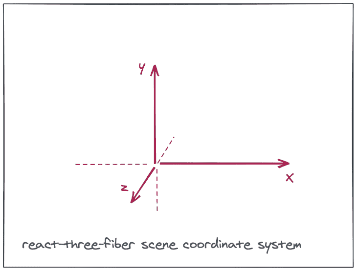
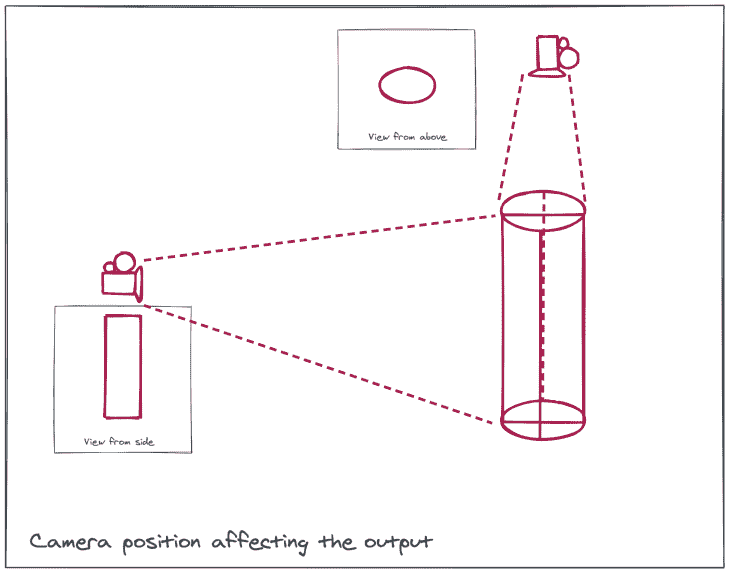
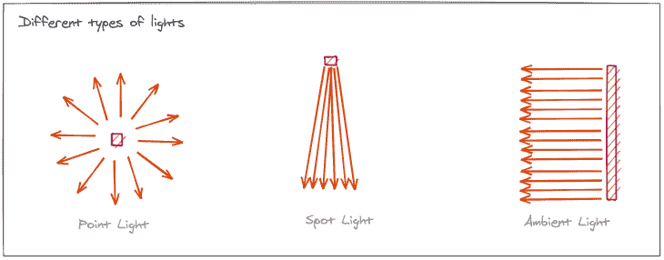
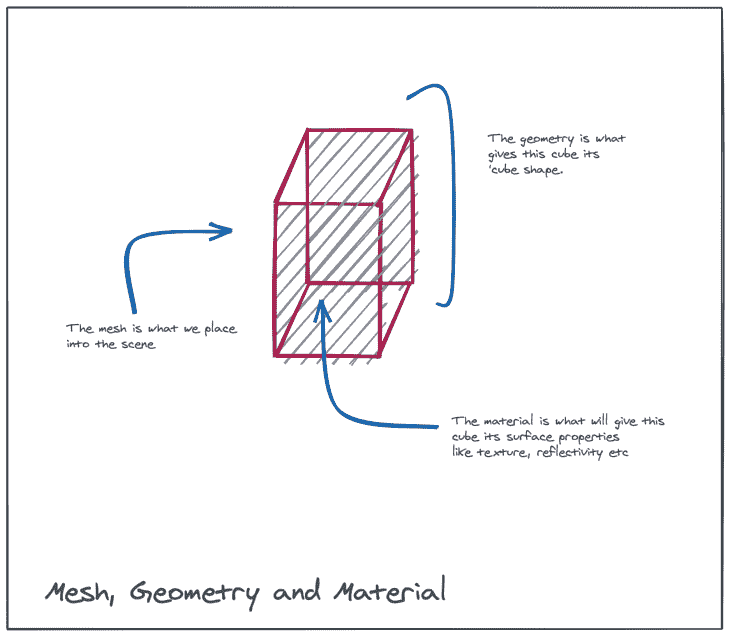
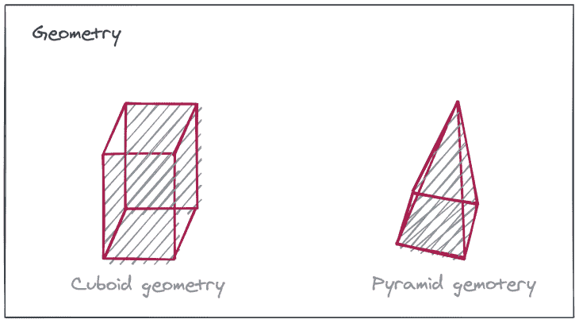
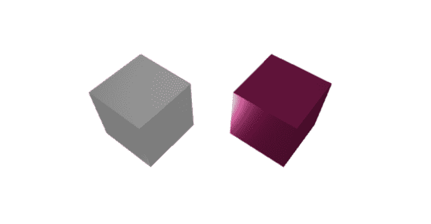
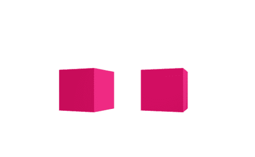
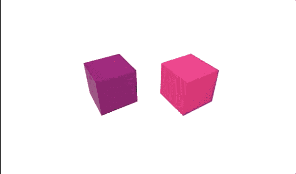
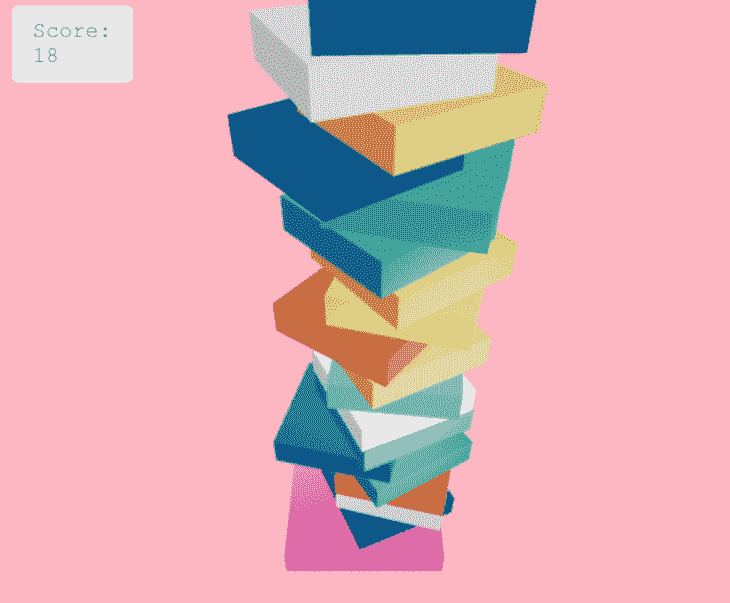
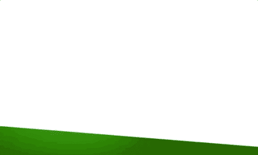

# react-three-fiber:浏览器中的 3D 渲染

> 原文：<https://blog.logrocket.com/react-three-fiber-3d-rendering-in-the-browser/>

***编者按:**本文更新于 2021 年 12 月 4 日。*

## 什么是反应三纤维？

根据他们的官方文档页面:

> [react-three-fiber](https://github.com/pmndrs/react-three-fiber) 是一个 React [渲染器](https://reactjs.org/docs/codebase-overview.html#renderers)用于 web 和 react-native 上的 [three.js](https://threejs.org/)

那么，渲染器到底是什么？渲染器管理 React 树如何变成底层平台调用。这意味着我们可以以可重用的 React 组件的形式构建 3D 工件(保持 React 范式)，react-three-fiber 将完成将这些组件转换为相应的 [three.js](https://threejs.org/) 原语的工作。

## three.js 简介

既然我们知道 react-three-fiber 是 three.js 之上的抽象，那么让我们花一些时间来了解 three.js 是什么，以及它在浏览器端的作用，这使得它成为客户端 3D 渲染的首选解决方案。

Three.js 是一个位于[Web GL](https://webglfundamentals.org/)(Web Graphics Library)之上的包装器，它模糊了你很难从头开始编写的大部分代码。直接引用 three.js [文档](https://threejsfundamentals.org/threejs/lessons/threejs-fundamentals.html):

> WebGL 是一个非常底层的系统，只画点、线、三角形。用 WebGL 做任何有用的事情通常需要相当多的代码，这就是 three.js 的用武之地。它处理场景、灯光、阴影、材质、纹理、3D 数学等。

有了这样的理解，现在让我们开始理解 react-three-fiber 的核心概念。

## react-three-fiber 三维渲染的核心概念

### 事件

场景是我们在不同物体的帮助下建立起来的环境。这类似于电影中场景的概念，它跨越了三个维度，如下图所示。这是所有活动发生的地方。



### 照相机

现在我们有了一个三维场景，我们需要在一个二维的浏览器窗口中显示它，我们需要决定将显示场景的哪个视图。这就是相机发挥作用的地方。我们可以从不同类型的相机中选择不同的镜头。



### 光

有了场景和摄像机，我们还需要手动放置一个光源，因为默认情况下场景是不亮的。我们可以在不同类型的光源中进行选择，如环境光源(所有方向)或点光源(来自特定方向)或聚光灯(类似于真实世界的聚光灯)。



### 网状物

网格是我们将要放置到场景中的物体。它构成了我们电影类比中的演员和事物。网格可以放置在坐标系中的特定点上，并接受附加到其上的事件处理程序以实现交互性。网格本身只是一种占位符，我们向它添加几何体和材质，以便它变得可见并获得某些属性。



### 几何学

几何就是我们如何给网格分配不同的形状。几何学使我们能够创造球体、立方体、金字塔等。



### 材料

材质是为网格提供材质属性的组件。表面效果(如光泽、光泽、颜色等。)通过物料分配。下面的例子显示了粗糙的水泥状结构与金属结构的对比。



## react-three-fiber 入门

有了这样的理解，让我们试着浏览 react-three-fiber 官方 GitHub 页面上的一个基本示例，并试着理解不同的组件以及它们在实际 react 代码中的用法。如果你想自己体验一下，这里有一个到 CodeSandbox 的[链接。](https://codesandbox.io/s/r3f-basic-demo-forked-3q84b?file=/src/App.js)

导入运行 React 和 react-three-fiber 所需的最低要求，我们有:

```
import React, { useRef, useState } from 'react';
import { Canvas } from 'react-three-fiber';
```

我们将使用`useRef`和`useState`挂钩。此外，我们导入的 Canvas 元素相当于我们在上一节中遇到的场景。

接下来，我们创建一个功能组件并返回场景，即来自它的画布，它将被附加到这个 React 组件将要附加到的 DOM 节点:

```
export default function App() {
  return (
    <Canvas>
    </Canvas>
  )
}

```

下一个任务是放置灯光。我们将放置一盏环境光来照亮整个场景。我们还将添加一个聚光灯来获得一些阴影效果，并添加一个点光源作为辅助光源。没有明确提到摄像机，因此它保持在默认位置。此外，所有的 three.js 构件都可以作为 react-three-fiber 中的原生 HTML 元素获得，因此不需要单独导入它们:

```
export default function App() {
  return (
    <Canvas>
      <ambientLight intensity={0.5} />
      <spotLight position={[10, 10, 10]} angle={0.15} penumbra={1} />
      <pointLight position={[-10, -10, -10]} />
    </Canvas>
  )
}

```

观察`spotLight`和`pointLight`如何获取一个位置属性来控制灯光的放置位置。传递的三个属性分别是 x、y 和 z 位置坐标。

接下来，让我们创建我们的主要对象(一个粉红色的立方体)并把它放到场景中。立方体是一个盒子形状，所以我们将使用`boxBufferGeometry`。但是首先，我们可以创建一个具有预期行为的可重用框组件:

```
function Box(props) {
  const mesh = useRef()
  const [state, setState] = useState({isHovered: false, isActive: false})

  return (
    <mesh
      {...props}
      ref={mesh}
      scale={state.isHovered ? [1.5, 1.5, 1.5] : [1, 1, 1]}
      onClick={(e) => setState({...state, isActive: !state.isActive, })}
      onPointerOver={(e) => setState({...state, isHovered: true})}
      onPointerOut={(e) => setState({...state, isHovered: false})}>
      <boxBufferGeometry args={[1, 1, 1]} />
      <meshStandardMaterial color={state.isActive ? '#820263' : '#D90368'} />
    </mesh>
  )
}

```

我们利用`useState`钩子来跟踪`Box`是否被悬停/点击。此外，我们让它在悬停时扩展到原始大小的 1.5 倍(使用 scale 属性)，并在网格上使用 color 属性单击时将其颜色更改为紫色。

现在，我们只是在原始场景中放置了这个盒子的两个实例:

```
export default function App() {
  return (
    <Canvas>
      <ambientLight intensity={0.5} />
      <spotLight position={[10, 10, 10]} angle={0.15} penumbra={1} />
      <pointLight position={[-10, -10, -10]} />
      <Box position={[-1, 0, 0]} />
      <Box position={[1, 0, 0]} />
    </Canvas>
  )
}

```

其中一个盒子位于 x 轴上的位置`1`，另一个盒子位于负 x 轴上的位置`-1`。这是它们的样子:



这很好，但我们可以通过让立方体不断旋转，并以一定的频率上下移动来让它变得更有趣一点。为此，我们需要从 react-three-fiber 导入`useFrame`。这是一个重要的钩子，它允许我们在每个帧计算中应用我们想要的计算，这正是我们在这种情况下想要的。因此，我们将这些代码行添加到我们之前创建的 Box 组件中:

```
useFrame(state => {
  const time = state.clock.getElapsedTime();
  mesh.current.position.y = mesh.current.position.y + Math.sin(time*2)/100;
  mesh.current.rotation.y = mesh.current.rotation.x += 0.01;
})

```

钩子确保它内部的任何变化都以帧速率(每秒 60 次)持续更新。在这种情况下，它不断更新 x-旋转和 y-旋转值，这为该旋转提供了改变方向的效果。此外，盒子以谐波方式移动，即沿着垂直轴弹跳。好多了！

这是一个基本的例子，帮助我们理解所有的概念，掌握如何反应-三纤维的功能。现在让我们进入一个稍微复杂和有趣的话题。

## 使用 react-three-fiber 在浏览器中进行高级 3D 渲染

有了 react-three-fiber 组件及其基本用法初步知识，我们现在可以尝试创建一个更高级的示例。我们将尝试为流行的 android 游戏 [stack](https://play.google.com/store/apps/details?id=com.ketchapp.stack) 构建一个粗糙版本的 UI。下面是渲染后的 UI 截图。



这只是一个应用程序的 UI 克隆。分数会随着牌添加到堆栈中而增加(没有牌平衡检查)。让我们看看这是如何在代码中实现的。这里有一个到[代码沙箱](https://codesandbox.io/s/r3f-basic-demo-forked-6q6ww?file=/src/App.js)的链接。

这是`App.js`文件中的主 JSX 代码:

```
<Canvas
  onClick={() => generateNewBlock()}
  camera={{ position: [0, 7, 7], near: 5, far: 15 }}
  onCreated={({ gl }) => gl.setClearColor('lightpink')}>
  <ambientLight intensity={0.5} />
  <pointLight position={[150, 150, 150]} intensity={0.55} />
  <spotLight position={[10, 10, 10]} angle={0.15} penumbra={1} />
  {boxes.map((props) => (
    <Box {...props} />
  ))}
  <Box position={[0, -3.5, 0]} scale={[3, 0.5, 3]} color="hotpink" />
  <Html scaleFactor={15} class="main">
    <div class="content">{`Score: ${boxes.length}`}</div>
  </Html>
</Canvas>

```

与前一个例子唯一的主要区别是现在呈现的盒子来自一个`boxes`数组。当画布被点击时，对应于新添加的盒子的道具被推入到`boxes`数组中。此外，我们可以在画布中看到一个用于渲染乐谱的`HTML`部分。

添加新块并停止所有先前块的代码逻辑包含在此函数中:

```
function generateNewBlock() {
  const total = boxes.length
  const color = colors[getRandomInt(6)]
  let newBoxes = boxes.map((props) => ({ ...props, move: false }))
  newBoxes.push({ position: [getRandomInt(3), total * 0.5 - 3, 0], color: color, move: true })
  setBoxes([...newBoxes])
}

```

对实现`useFrame`的方式也有所改变，因此最上面的块移动到:

```
let direction = 0.01
useFrame(() => {
  if (mesh.current.position.x > 1) {
    direction = -0.01
  } else if (mesh.current.position.x < -1) {
    direction = 0.01
  }
  if (props.move) {
    mesh.current.rotation.y = mesh.current.rotation.y += 0.01
    mesh.current.position.x = mesh.current.position.x + direction
  }
})

```

这就是用这些长方体块获得这种叠加效果所需的全部代码，类似于这个游戏。

## 反应三纤维物理学

在我们刚刚看到的两个例子中，我们通过`useFrame`钩子手动模拟所有动作。但是，有一些用例，比如在游戏中，我们需要组件的某些属性随时间自动改变(比如在重力作用下向下加速)。这就是物理模拟发挥作用的地方。

通过在画布中包含物理，我们可以执行某些基本规则，画布中的所有元素都将在这些规则下运行。这里有一个[代码沙箱](https://codesandbox.io/s/r3f-basic-demo-forked-zvw4r)展示了 react-three-fiber 的物理特性。我们将使用`use-cannon` [库](https://github.com/pmndrs/use-cannon)来模拟`Canvas`组件内部的物理过程。我们从库中导入`Physics`、`useSphere`和`useBox`:

```
import { Physics, useSphere, useBox } from 'use-cannon'

```

在当前的例子中，我们试图模拟几个球落到地面上，就像这样:

在这个例子中看到的地面是`boxBufferGeometry`的实例，球是我们之前已经看到的`sphereBufferGeometry`的实例。但是，为了在这些网格上执行物理规则，我们需要将等效的物理元素附加到这些网格上。这是通过`useSphere`和`useBox`方法完成的。

方法如下:

```
function Ball(props) {
  const { args = [0.2, 32, 32], color } = props
  const [ref] = useSphere(() => ({ args: 0.2, mass: 1 }))

  return (
    <mesh ref={ref}>
      <sphereBufferGeometry args={args} />
      <meshStandardMaterial color={color} />
    </mesh>
  )
}

```

这段代码片段与我们之前所做的类似，除了一行代码:

```
const [ref] = useSphere(() => ({ args: 0.2, mass: 1 }))

```

这条线正在物理世界中创建一个大小等于 0.2、质量等于 1 的球体。这个 API 返回一个需要附加到我们拥有的球体网格上的 ref。地面以同样的方式创建:

```
function Ground(props) {
  const { args = [10, 0.8, 1] } = props
  const [ref, api] = useBox(() => ({ args }))

  useFrame(() => {
    api.position.set(0, -3.5, 0)
    api.rotation.set(0, 0, -0.08)
  })

  return (
    <mesh ref={ref}>
      <boxBufferGeometry args={args} />
      <meshStandardMaterial color={'green'} />
    </mesh>
  )
}

```

请注意，我们没有给地面分配任何质量，因此重力不会起作用。我们还设置了一个固定的位置和旋转(倾斜)。一旦我们有了地面和球，为了让物理定律对它们起作用，它们需要被放置在物理提供者内部:

```
<Physics 
  gravity={[0, -26, 0]} 
  defaultContactMaterial={{ restitution: 0.6 }}
>
  {balls.map((props) => (
    <Ball {...props} />
  ))}
  <Ground />
</Physics>

```

注意`Physics`组件是如何接受两个指定重力和恢复的道具的。这里:

*   `gravity`是一个 3D 数组，确定 x、y 和 z 方向的加速度。这里配置为负 26，模拟 y 方向的向下力
*   `restitution`是一个系数，它决定了物理世界中物体之间每次碰撞时损失的能量

除此之外，我们还创建了一个生成器函数，它在每次单击时在画布中创建一个球体:

```
function onCanvasClicked(e) {
  let newBalls = [...balls]
  const color = colors[getRandomInt(6)]
  newBalls.push({ color: color })
  setBalls([...newBalls])
}

```

这就是所需的全部设置。这样，每当在画布上注册一个点击，一个新的球体就会被添加到物理世界，然后在配置重力的加速下向地面前进，与地面/球体碰撞，然后继续沿着地面的斜坡移动。这是一个如何使用 react-three-fiber 的功能在浏览器中模拟真实世界物理的示例。

## 表演

在过去的几年里，就性能而言，WebGL 库已经有了巨大的改进。Three.js 利用了这些优势，并为其 API 带来了同样的速度。react-three-fiber 性能受到 three.js 和 GPU 的瓶颈限制。这意味着，就渲染而言，react-three-fiber 本身不会引入任何瓶颈。

引用自[官方页面](https://github.com/pmndrs/react-three-fiber):

> 渲染性能高达 three.js 和 GPU。组件在 React 之外参与渲染循环，没有任何额外的开销。React 在构建和管理组件树方面非常有效，它可能在规模上超过手动/命令式应用程序。

## 结论

如果你已经在用 React 构建简单的 web 应用程序，并打算走 3D 之路，那么 react-three-fiber 就成了一个首选解决方案。

好处包括:

*   改进的 WebGL 库的性能
*   可直接获得的 three.js APIs 和工件的范围
*   没有必要离开 React 生态系统

考虑到这些好处，react-three-fiber 至少是一个值得尝试和探索的候选对象，它可以在浏览器提供给我们的二维空间中呈现三维空间。如果这还不能说服你，请在 CodeSandbox 上查看更多这些[可怕的例子](https://codesandbox.io/examples/package/react-three-fiber)。干杯！

## [LogRocket](https://lp.logrocket.com/blg/react-signup-general) :全面了解您的生产 React 应用

调试 React 应用程序可能很困难，尤其是当用户遇到难以重现的问题时。如果您对监视和跟踪 Redux 状态、自动显示 JavaScript 错误以及跟踪缓慢的网络请求和组件加载时间感兴趣，

[try LogRocket](https://lp.logrocket.com/blg/react-signup-general)

.

[ ](https://lp.logrocket.com/blg/react-signup-general) [](https://lp.logrocket.com/blg/react-signup-general) 

LogRocket 结合了会话回放、产品分析和错误跟踪，使软件团队能够创建理想的 web 和移动产品体验。这对你来说意味着什么？

LogRocket 不是猜测错误发生的原因，也不是要求用户提供截图和日志转储，而是让您回放问题，就像它们发生在您自己的浏览器中一样，以快速了解哪里出错了。

不再有嘈杂的警报。智能错误跟踪允许您对问题进行分类，然后从中学习。获得有影响的用户问题的通知，而不是误报。警报越少，有用的信号越多。

LogRocket Redux 中间件包为您的用户会话增加了一层额外的可见性。LogRocket 记录 Redux 存储中的所有操作和状态。

现代化您调试 React 应用的方式— [开始免费监控](https://lp.logrocket.com/blg/react-signup-general)。